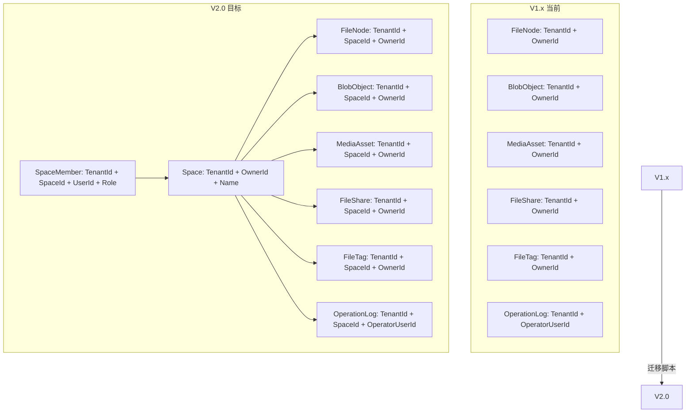

# ADR-03: 文件归属升级策略（OwnerId → SpaceId）

| 元数据 | 值 |
|--------|-----|
| 文档版本 | 1.0 |
| 日期 | 2026-07-16 |
| 状态 | **已批准**（V2.0-0 决策冻结阶段） |
| 负责人 | Hermes-Architect（architect） |
| 参考来源 | `docs/v2.0-pre-study.md` §1.1、`docs/release-plan-v2.0.md` §1.2/§2.7、`aspnet-core/src/PrivateCloudDrive.Domain/FileCenter/*.cs`、`aspnet-core/src/PrivateCloudDrive.EntityFrameworkCore/FileCenter/*.cs`、`aspnet-core/src/PrivateCloudDrive.Application/FileCenter/*.cs` |

---

## 1. 上下文

### 1.1 当前状态

V1.x 数据隔离边界为 `TenantId + OwnerId`，OwnerId = 当前登录用户的 UserId。所有领域实体以 OwnerId 作为文件归属和权限访问的主键：

| 实体 | OwnerId 类型 | 唯一索引/关键索引 |
|------|-------------|-------------------|
| FileNode | Guid, Required | `(OwnerId, ParentId, NormalizedName)` 唯一; `(OwnerId, NormalizedName)` 唯一(根目录) |
| BlobObject | Guid, Required | `(TenantId, OwnerId)` 索引 |
| UploadSession | Guid, Required | `(TenantId, OwnerId, Status)` 索引; `(OwnerId, ParentId, NormalizedFileName)` 索引 |
| MediaAsset | Guid, Required | `(TenantId, OwnerId, MediaType)` 索引; `(TenantId, OwnerId, TakenAt)` 索引 |
| MediaAlbum | Guid, Required | `(TenantId, OwnerId, NormalizedName)` 唯一 |
| MediaAlbumItem | Guid, Required | `(TenantId, OwnerId, AlbumId)` 索引 |
| FileShare | Guid, Required | `(TenantId, OwnerId, FileNodeId)` 索引 |
| FileTag | Guid, Required | `(TenantId, OwnerId, NormalizedName)` 唯一 |
| FileNodeTag | Guid, Required | `(TenantId, OwnerId, FileNodeId, TagId)` 唯一 |

### 1.2 目标状态

V2.0 数据隔离边界升级为 `TenantId + SpaceId + 权限裁剪`。每个用户拥有一个**默认个人空间**（个人文件自动归属），并可创建/加入**家庭/团队空间**（多用户共享）。

核心变化：文件/媒体/分享/标签等所有资源的**归属边界从"用户"变为"空间"**。

### 1.3 关键约束

- **向后兼容**：V1.x 数据不能丢失，现有 API 需要兼容或逐步迁移。
- **个人空间不可删除**：每个用户注册时自动创建默认个人空间，不允许删除。
- **SpaceId 可为空**：过渡期允许 SpaceId 为 null（代表旧数据尚未分配），迁移后强制非空。
- **OwnerId 保留**：作为"创建者/上传者"的审计和配额追溯字段，但不是查询隔离的主要门禁。

---

## 2. 决策

### 2.1 FileNode 模型变更

```diff
 public class FileNode : FullAuditedAggregateRoot<Guid>, IMultiTenant
 {
     public Guid? TenantId { get; private set; }
+    public Guid? SpaceId { get; private set; }   // 新增：空间归属（迁移后可空，V2.0 迁移完成后非空）
     public Guid OwnerId { get; private set; }     // 保留：文件创建者/上传者
     ...
 }
```

**说明：**
- `SpaceId`：目标空间 ID。对于默认个人空间为每个用户的唯一个人空间；对于家庭/团队空间为对应的 Space 实体 ID。
- `OwnerId`：保留，语义从"隔离所有者"变为"创建者"，用于空间内审计和用户级配额追溯。
- 构造函数增加 `spaceId` 参数；`CreateFolder`/`CreateFile` factory methods 同步增加。

### 2.2 所有关联实体统一增加 SpaceId

| 实体 | 变更类型 | SpaceId 约束 | 原因 |
|------|---------|-------------|------|
| FileNode | **新增字段** | 可为空(迁移前)→非空(迁移后) | 核心文件归属 |
| BlobObject | **新增字段** | 可为空(迁移前)→非空(迁移后) | 存储层归属 |
| UploadSession | **新增字段** | 可为空(迁移前)→非空(迁移后) | 上传会话归属 |
| MediaAsset | **新增字段** | 可为空(迁移前)→非空(迁移后) | 媒体资产归属 |
| MediaAlbum | **新增字段** | 可为空(迁移前)→非空(迁移后) | 相册归属 |
| MediaAlbumItem | **新增字段** | 可为空(迁移前)→非空(迁移后) | 相册项目归属 |
| FileShare | **新增字段** | 可为空(迁移前)→非空(迁移后) | 分享归属 |
| FileTag | **新增字段** | 可为空(迁移前)→非空(迁移后) | 标签归属 |
| FileNodeTag | **新增字段** | 可为空(迁移前)→非空(迁移后) | 节点-标签关联归属 |
| FileCenterOperationLog | **新增字段** | 可为空(迁移前)→非空(迁移后) | 审计日志归属 |

**为什么所有实体都需要 SpaceId？**

- **查询隔离**：没有 SpaceId 就无法在不 JOIN 回 FileNode 的情况下做空间级过滤。例如 MediaAsset 查询如果只 join FileNode.SpaceId，每次查询都多一次 JOIN，且会漏掉尚未与 FileNode 关联的操作日志、分享等。
- **存算一致性**：上传时创建 UploadSession 已经知道目标 SpaceId；分享时 FileShare 已经知道属于哪个空间。在创建时记录 SpaceId 比事后推导更准确。
- **独立生命周期**：MediaAlbum 可能在不同空间下同名，FileTag 按空间隔离防止交叉混淆。

### 2.3 回收站模型

**决策：不新增 SpaceRecycleBin 实体。**

当前回收站通过 ABP 软删除机制实现——`FileNode.IsDeleted`、`DeleterId`、`DeletionTime`。回收站列表通过 `GetDeletedRootsAsync(ownerId)` 查询已删除且父节点未删除的根节点。

**V2.0 升级方案：**
- `GetDeletedRootsAsync` 签名增加 `spaceId` 参数，查询条件从 `OwnerId == ownerId` 扩展为 `SpaceId == spaceId`。
- 回收站按空间隔离：用户切换空间后看到该空间的回收站内容。
- 不需要新建 SpaceRecycleBin 表，因为：
  - 软删除标记已在 FileNode 上。
  - 每个空间独立查询自己的已删除节点即可。
  - 回收站不需要空间级独立生命周期（不会出现"A 空间有回收站而 B 空间没有"的情况）。

### 2.4 默认个人空间策略

**决策：每个现有用户在迁移时自动创建一个默认个人空间。**

```
默认个人空间命名: "{UserName} 的个人空间"
默认个人空间描述: "个人文件的默认存储空间"
默认角色: Owner（只对该用户）
默认不可删除: 是
```

- 迁移脚本为所有有数据（FileNode/OwnerId 存在）或已登录过的 V1.x 用户创建默认个人空间。
- 如果用户没有任何数据，可以延迟（在用户下次登录时自动创建 lazy-init）。

---

## 3. IFileNodeRepository 查询升级

### 3.1 接口签名变更

```diff
 public interface IFileNodeRepository : IRepository<FileNode, Guid>
 {
     Task<FileNode?> FindByNameAsync(
+        Guid spaceId,       // 新增
         Guid ownerId,
         Guid? parentId,
         string name,
         Guid? tenantId = null,
         bool includeDeleted = false,
         CancellationToken cancellationToken = default);

     Task<FileNode?> FindByIdAsync(
         Guid id,
+        Guid spaceId,       // 新增
         Guid ownerId,
         Guid? tenantId = null,
         bool includeDeleted = false,
         CancellationToken cancellationToken = default);

     Task<List<FileNode>> GetChildrenAsync(
+        Guid spaceId,       // 新增
         Guid ownerId,
         Guid? parentId,
         int skipCount,
         int maxResultCount,
         Guid? tenantId = null,
         ...other params...);

     Task<long> GetChildrenCountAsync(
+        Guid spaceId,       // 新增
         Guid ownerId,
         Guid? parentId,
         ...other params...);

     Task<List<FileNode>> GetDeletedRootsAsync(
+        Guid spaceId,       // 新增：替代 ownerId 作为回收站隔离边界
         Guid ownerId,
         int skipCount,
         int maxResultCount,
         Guid? tenantId = null,
         CancellationToken cancellationToken = default);

     Task<long> GetDeletedRootsCountAsync(
+        Guid spaceId,       // 新增
         Guid ownerId,
         Guid? tenantId = null,
         CancellationToken cancellationToken = default);

+    // 新增：根据 accessor userId 解析用户可访问的空间列表
+    Task<List<FileNode>> GetChildrenByAccessibleSpacesAsync(
+        IReadOnlyList<Guid> accessibleSpaceIds,
+        Guid ownerId,
+        Guid? parentId,
+        ...other params...);
 }
```

### 3.2 查询条件变化

**当前：**
```csharp
queryable.Where(node =>
    node.TenantId == tenantId &&
    node.OwnerId == ownerId);
```

**V2.0（单空间查询）：**
```csharp
queryable.Where(node =>
    node.TenantId == tenantId &&
    node.SpaceId == spaceId &&
    node.OwnerId == ownerId);  // OwnerId 作为二次过滤（审计 + 操作者约束）
```

**V2.0（跨空间查询——管理员/搜索）：**
```csharp
queryable.Where(node =>
    node.TenantId == tenantId &&
    accessibleSpaceIds.Contains(node.SpaceId.Value));
```

### 3.3 唯一索引升级

当前 FileNode 唯一索引依赖 OwnerId。升级后需要**占位 SpaceId**：

```diff
- b.HasIndex(node => new { node.OwnerId, node.ParentId, node.NormalizedName })
+ b.HasIndex(node => new { node.SpaceId, node.ParentId, node.NormalizedName })
      .IsUnique()
-     .HasFilter("\"IsDeleted\" = false AND \"ParentId\" IS NOT NULL");
+     .HasFilter("\"IsDeleted\" = false AND \"ParentId\" IS NOT NULL AND \"SpaceId\" IS NOT NULL");

- b.HasIndex(node => new { node.OwnerId, node.NormalizedName })
+ b.HasIndex(node => new { node.SpaceId, node.NormalizedName })
      .IsUnique()
-     .HasFilter("\"IsDeleted\" = false AND \"ParentId\" IS NULL");
+     .HasFilter("\"IsDeleted\" = false AND \"ParentId\" IS NULL AND \"SpaceId\" IS NOT NULL");
```

其他实体的唯一索引类似：

| 实体 | 当前唯一键 | V2.0 唯一键 |
|------|-----------|-------------|
| MediaAlbum | `(TenantId, OwnerId, NormalizedName)` | `(TenantId, SpaceId, NormalizedName)` |
| FileTag | `(TenantId, OwnerId, NormalizedName)` | `(TenantId, SpaceId, NormalizedName)` |
| FileNodeTag | `(TenantId, OwnerId, FileNodeId, TagId)` | `(TenantId, SpaceId, FileNodeId, TagId)` |

---

## 4. FileNodeManager 升级

FileNodeManager 是文件归属的核心领域服务，所有"取用户节点"的操作都需要增加 SpaceId 维度。

```diff
 public class FileNodeManager : FileCenterDomainService
 {
     public virtual async Task<FileNode> CreateFolderAsync(
+        Guid? spaceId,          // 新增
         Guid? tenantId,
         Guid ownerId,
         Guid? parentId,
         string name)
     {
-        await EnsureCanCreateAsync(tenantId, ownerId, parentId, name);
+        await EnsureCanCreateAsync(spaceId, tenantId, ownerId, parentId, name);
         return FileNode.CreateFolder(
             GuidGenerator.Create(),
+            spaceId,
             tenantId, ownerId, parentId, name);
     }

     // EnsureOwnerNode 升级
     private static void EnsureOwnerNode(
+        Guid? spaceId,
         Guid? tenantId,
         Guid ownerId,
         FileNode node)
     {
+        // V2.0: 校验 TenantId + SpaceId + OwnerId
-        if (node.TenantId != tenantId || node.OwnerId != ownerId)
+        if (node.TenantId != tenantId ||
+            node.SpaceId != spaceId ||
+            node.OwnerId != ownerId)
             ...
     }
 }
```

所有以 `ownerId` 为入参的 FileNodeManager 方法，增加 `spaceId` 参数：
- `CreateFolderAsync` ✅
- `CreateFileAsync` ✅
- `EnsureCanCreateAsync` ✅
- `RenameAsync` ✅
- `MoveAsync` / `MoveNodeAsync` ✅
- `DeleteFolderTreeAsync` ✅
- `RestoreTreeAsync` ✅
- `PermanentDeleteTreeAsync` ✅
- `GetOwnerFolderAsync` ✅
- `GetOwnerFileAsync` ✅
- `GetOwnerNodeAsync` ✅
- `GetOwnerDeletedNodeAsync` ✅

---

## 5. Application Service 升级

### 5.1 GetOwnerId() → ResolveSpaceContext()

当前每个 AppService 定义 `GetOwnerId()` 返回 `CurrentUser.Id`：

```csharp
private Guid GetOwnerId()
{
    if (!_currentUser.Id.HasValue)
        throw new AbpAuthorizationException("Current user is required.");
    return _currentUser.Id.Value;
}
```

V2.0 升级为获取当前操作空间上下文：

```diff
+/// <summary>
+/// 返回当前操作的空间上下文（SpaceId + 当前用户在空间内的角色）。
+/// 如果客户端未传 spaceId，默认使用用户的默认个人空间。
+/// 方法抛出授权异常表示当前用户不在该空间内或空间不存在。
+/// </summary>
+protected async Task<SpaceContext> ResolveSpaceContextAsync(Guid? spaceId = null)
+{
+    var targetSpaceId = spaceId ?? await _userSpaceService.GetDefaultPersonalSpaceIdAsync(CurrentUser.Id.Value);
+
+    if (!await _userSpaceService.IsMemberAsync(targetSpaceId, CurrentUser.Id.Value))
+        throw new AbpAuthorizationException("User is not a member of the specified space.");
+
+    var role = await _userSpaceService.GetMemberRoleAsync(targetSpaceId, CurrentUser.Id.Value);
+    return new SpaceContext(targetSpaceId, CurrentUser.Id.Value, role);
+}
```

### 5.2 各个 AppService 变更概要

| AppService | 当前模式 | V2.0 模式 |
|-----------|---------|-----------|
| FileCenterFoldersAppService | `var ownerId = GetOwnerId();` 传入所有仓库/领域方法 | `var ctx = await ResolveSpaceContextAsync(input.SpaceId);` 传入 `ctx.SpaceId` + `ctx.OwnerId` |
| FileCenterFileUploadService | `var ownerId = GetOwnerId();` | `var ctx = await ResolveSpaceContextAsync(input.SpaceId);` |
| FileCenterChunkUploadService | `var ownerId = GetOwnerId();` | `var ctx = await ResolveSpaceContextAsync(input.SpaceId);` |
| FileCenterFileDownloadService | `var ownerId = GetOwnerId();` | `var ctx = await ResolveSpaceContextAsync(spaceId);` |
| FileCenterSharesAppService | `var ownerId = GetOwnerId();` | `var ctx = await ResolveSpaceContextAsync(input.SpaceId);` |
| FileCenterTagsAppService | `var ownerId = GetOwnerId();` | `var ctx = await ResolveSpaceContextAsync(input.SpaceId);` |
| FileCenterStorageAppService | `var ownerId = GetOwnerId();` | `var ctx = await ResolveSpaceContextAsync(spaceId);` |
| FileCenterSystemHealthAppService | `var ownerId = GetOwnerId();` | `var ctx = await ResolveSpaceContextAsync(spaceId);` |
| FileCenterTrashCleanupAppService | `var ownerId = GetOwnerId();` | `var ctx = await ResolveSpaceContextAsync(spaceId);` |

### 5.3 API 契约变更

增加可选的 `spaceId` 查询/请求参数：

```diff
 public class GetFolderChildrenInput : PagedAndSortedResultRequestDto
 {
+    /// <summary>
+    /// 目标空间ID。为空时使用当前用户的默认个人空间。
+    /// </summary>
+    public Guid? SpaceId { get; set; }
     public Guid? ParentId { get; set; }
     ...
 }

 public class CreateFolderInput
 {
+    public Guid? SpaceId { get; set; }
     public Guid? ParentId { get; set; }
     [Required] public string Name { get; set; }
 }
```

### 5.4 API 兼容策略

- 所有新增 `SpaceId` 参数均为**可选**（`Guid?`），默认 null。
- 当 API 未传 SpaceId 时，服务层自动解析当前用户的**默认个人空间 ID**。
- 旧版 MAUI 客户端（不传 SpaceId）仍可通过默认个人空间正常工作。

---

## 6. 关联实体分析（FileShare / MediaAsset / MediaAlbum 等）

### 6.1 每个实体是否需要 SpaceId？

| 实体 | 需要 SpaceId？ | 理由 |
|------|:------------:|------|
| **FileShare** | ✅ **是** | 分享属于某个空间，禁用一个分享需要知道它属于哪个空间；查询"某个空间的所有分享"需要 SpaceId 过滤 |
| **MediaAsset** | ✅ **是** | 媒体资产直接关联 FileNode，但查询"某个空间的视频"时如果只 join FileNode 性能差；写时冗余 SpaceId 是最优方案 |
| **MediaAlbum** | ✅ **是** | 相册是独立聚合（不强制关联 FileNode），空间间相册隔离只能靠 SpaceId |
| **MediaAlbumItem** | ✅ **是** | 虽然可以 join Album 拿到 SpaceId，但写入时已有 SpaceId 信息，冗余存储减少 JOIN；且回收站独立查询时需要快速过滤 |
| **FileTag** | ✅ **是** | 标签是独立聚合，空间间标签隔离只能靠 SpaceId。唯一索引 `(TenantId, SpaceId, NormalizedName)` 可以防止同名标签 |
| **FileNodeTag** | ✅ **是** | 关联查询时需要按空间过滤 |
| **FileCenterOperationLog** | ✅ **是** | 审计日志需要记录 SpaceId 才能按空间筛选查看 |
| **BlobObject** | ✅ **是** | Blob 存储的归属：上传时已经知道目标空间，写时冗余空间归属 |
| **UploadSession** | ✅ **是** | 上传会话属于某个空间，过期清理需要按空间扫描 |

### 6.2 哪些实体不需要修改？

当前代码中没有 `PersonalRecycleBin` 实体。回收站通过 ABP 软删除机制实现，不需要新增实体。

所有 10 个实体都需要增加 SpaceId 字段。

---

## 7. 数据迁移策略

### 7.1 迁移步骤

```
Phase 1: 创建 Space/SpaceMember 表（V2.0-1）
Phase 2: 为每个有数据的用户创建默认个人空间（迁移脚本）
Phase 3: 为所有实体补写 SpaceId = 对应用户的默认个人空间 ID
Phase 4: 为新增实体设置 NOT NULL 约束（可选：空间底座稳定后）
Phase 5: 重建唯一索引（从 OwnerId 过渡到 SpaceId）
```

### 7.2 迁移脚本伪代码

```sql
-- Phase 2: 创建默认个人空间
INSERT INTO "AppFileCenterSpaces" ("Id", "TenantId", "Name", "Description", "OwnerId", "SpaceType", "IsDefault", "CreationTime")
SELECT
    NEWID(),                          -- 空间 ID
    abtu."TenantId",                  -- 租户 ID
    abpui."UserName" + ' 的个人空间',  -- 空间名称
    '个人文件的默认存储空间',           -- 描述
    abpui."Id",                       -- 空间所有者 = 用户
    0,                                -- SpaceType.Personal
    1,                                -- IsDefault = true
    GETUTCDATE()
FROM "AbpUsers" abpui
LEFT JOIN "AbpTenantUsers" abtu ON abtu."UserId" = abpui."Id"
WHERE EXISTS (
    SELECT 1 FROM "AppFileCenterFileNodes" fn
    WHERE fn."OwnerId" = abpui."Id"
);

-- Phase 3: 补写 SpaceId
UPDATE "AppFileCenterFileNodes"
SET "SpaceId" = (
    SELECT TOP 1 s."Id"
    FROM "AppFileCenterSpaces" s
    WHERE s."OwnerId" = "AppFileCenterFileNodes"."OwnerId"
      AND s."IsDefault" = 1
)
WHERE "SpaceId" IS NULL;

-- 对 BlobObject、UploadSession、MediaAsset、MediaAlbum、
-- MediaAlbumItem、FileShare、FileTag、FileNodeTag、
-- FileCenterOperationLog 执行类似的 UPDATE
```

### 7.3 Data Integrity Checks

迁移脚本 dry-run 输出：

```sql
-- 迁移前计数
SELECT 'FileNode' AS Entity, COUNT(*) AS Total,
       COUNT(CASE WHEN "SpaceId" IS NULL THEN 1 END) AS NullSpaceId
FROM "AppFileCenterFileNodes"
UNION ALL
SELECT 'BlobObject', COUNT(*),
       COUNT(CASE WHEN "SpaceId" IS NULL THEN 1 END)
FROM "AppFileCenterBlobObjects"
UNION ALL
... 其余实体

-- 迁移后校验
SELECT 'FileNode' AS Entity, COUNT(*) AS Total,
       COUNT(CASE WHEN "SpaceId" IS NULL THEN 1 END) AS NullSpaceIdAfterMigration
FROM "AppFileCenterFileNodes"
-- 校验 1: NullSpaceIdAfterMigration = 0
-- 校验 2: 迁移前后 Total 一致
-- 校验 3: 每个 SpaceId 在 AppFileCenterSpaces 中存在
```

### 7.4 Dry-Run 流程

```
1. 备份当前生产 DB
2. 在测试环境还原备份
3. 执行迁移脚本（不执行 unique index 重建）
4. 输出迁移前后计数对比
5. 输出 SpaceId 完整性校验（每个 ID 在 Space 表中存在）
6. 输出校验报告
7. 审核通过后，在生产环境执行完整迁移（含索引重建）
```

---

## 8. 回滚方案

| 场景 | 回滚方式 | 回滚条件 | 数据影响 |
|------|---------|---------|---------|
| DB 迁移 dry-run 失败 | 丢弃测试库，修正迁移脚本重新演练 | dry-run 结束，未触碰生产 | 无 |
| Phase 2 空间创建失败 | 删除创建的默认空间行（若已写入），恢复备份 | 迁移脚本可回滚的 ID 列表 | 仅空间表，无文件数据变化 |
| Phase 3 SpaceId 补写失败 | 恢复迁移前 DB 备份 | 备份可用且已通过恢复演练 | 全量 DB |
| 索引重建导致死锁或锁超时 | 滚动重建：先建新索引，再删旧索引 | 可接受在维护窗口内 | 索引重建期间查询可能降级 |
| 越权缺陷（Space 上线后） | 关闭 V2.0 路由/功能开关，全量回滚到 V1.4 代码+DB 基线 | 线上部署可灰度切换 | 需提前在发布脚本中预设回滚路由 |

**关键回滚前提：**
1. 迁移前全量 DB dump（含 schema + data）。
2. Storage/blob 存储备份。
3. 每一项迁移操作都有 `BEGIN TRAN` / `ROLLBACK` 验证。
4. 生产回滚必须在迁移后 24 小时内验证，确认 `V1.4 代码 + V1.4 DB schema + V1.4 storage` 能完整恢复服务。

---

## 9. 迁移清单（完整影响范围）

### 9.1 Domain 实体（10 个新增 SpaceId）

| # | 实体 | 文件路径 | 变更类型 | SpaceId 字段 | OwnerId 保留 |
|:-:|------|---------|:--------:|:-----------:|:-----------:|
| 1 | FileNode | `Domain/FileCenter/FileNode.cs` | 新增字段 | `Guid? SpaceId` | ✅ 保留（语义变更） |
| 2 | BlobObject | `Domain/FileCenter/BlobObject.cs` | 新增字段 | `Guid? SpaceId` | ✅ 保留 |
| 3 | UploadSession | `Domain/FileCenter/UploadSession.cs` | 新增字段 | `Guid? SpaceId` | ✅ 保留 |
| 4 | MediaAsset | `Domain/FileCenter/MediaAsset.cs` | 新增字段 | `Guid? SpaceId` | ✅ 保留 |
| 5 | MediaAlbum | `Domain/FileCenter/MediaAlbum.cs` | 新增字段 | `Guid? SpaceId` | ✅ 保留 |
| 6 | MediaAlbumItem | `Domain/FileCenter/MediaAlbumItem.cs` | 新增字段 | `Guid? SpaceId` | ✅ 保留 |
| 7 | FileShare | `Domain/FileCenter/FileShare.cs` | 新增字段 | `Guid? SpaceId` | ✅ 保留 |
| 8 | FileTag | `Domain/FileCenter/FileTag.cs` | 新增字段 | `Guid? SpaceId` | ✅ 保留 |
| 9 | FileNodeTag | `Domain/FileCenter/FileNodeTag.cs` | 新增字段 | `Guid? SpaceId` | ✅ 保留 |
| 10 | FileCenterOperationLog | `Domain/FileCenter/FileCenterOperationLog.cs` | 新增字段 | `Guid? SpaceId` | 该实体无 OwnerId |

### 9.2 领域服务（1 个重构）

| # | 服务 | 文件路径 | 变更类型 |
|:-:|------|---------|:--------:|
| 1 | FileNodeManager | `Domain/FileCenter/FileNodeManager.cs` | 所有方法增加 `spaceId` 参数；`EnsureOwnerNode` 增加 SpaceId 校验 |

### 9.3 Repository 接口（1 个重构）

| # | 接口 | 文件路径 | 变更类型 |
|:-:|------|---------|:--------:|
| 1 | IFileNodeRepository | `Domain/FileCenter/IFileNodeRepository.cs` | 所有方法增加 `spaceId` 参数；新增 `GetChildrenByAccessibleSpacesAsync` |

### 9.4 Repository 实现（1 个重构）

| # | 实现 | 文件路径 | 变更类型 |
|:-:|------|---------|:--------:|
| 1 | EfCoreFileNodeRepository | `EntityFrameworkCore/FileCenter/EfCoreFileNodeRepository.cs` | 查询条件从 `OwnerId` 升级为 `SpaceId` + `OwnerId`；唯一索引更换 |

### 9.5 DbContext 配置（1 个变更）

| # | 文件 | 变更类型 |
|:-:|------|:--------:|
| 1 | `EntityFrameworkCore/FileCenter/FileCenterDbContextModelCreatingExtensions.cs` | 为 10 个实体增加 SpaceId 列配置；更新所有唯一索引 |

### 9.6 Application Service（9 个重构）

| # | 服务 | 文件路径 | 变更类型 |
|:-:|------|---------|:--------:|
| 1 | FileCenterFoldersAppService | `Application/FileCenter/FileCenterFoldersAppService.cs` | GetOwnerId → ResolveSpaceContext |
| 2 | FileCenterFileUploadService | `Application/FileCenter/FileCenterFileUploadService.cs` | 同上 |
| 3 | FileCenterChunkUploadService | `Application/FileCenter/FileCenterChunkUploadService.cs` | 同上 |
| 4 | FileCenterFileDownloadService | `Application/FileCenter/FileCenterFileDownloadService.cs` | 同上 |
| 5 | FileCenterSharesAppService | `Application/FileCenter/FileCenterSharesAppService.cs` | 同上 |
| 6 | FileCenterTagsAppService | `Application/FileCenter/FileCenterTagsAppService.cs` | 同上 |
| 7 | FileCenterStorageAppService | `Application/FileCenter/FileCenterStorageAppService.cs` | 同上 |
| 8 | FileCenterSystemHealthAppService | `Application/FileCenter/FileCenterSystemHealthAppService.cs` | 同上 |
| 9 | FileCenterTrashCleanupAppService | `Application/FileCenter/FileCenterTrashCleanupAppService.cs` | 同上 |

### 9.7 DTO / API 契约（影响数 ≥ 10 个 Input DTO）

| # | DTO | 变更类型 |
|:-:|-----|:--------:|
| 1 | GetFolderChildrenInput | 新增 `Guid? SpaceId` |
| 2 | CreateFolderInput | 新增 `Guid? SpaceId` |
| 3 | 上传相关 Input（FileUploadInput / CreateChunkUploadInput） | 新增 `Guid? SpaceId` |
| 4 | CreateFileShareInput | 新增 `Guid? SpaceId` |
| 5 | CreateFileTagInput | 新增 `Guid? SpaceId` |
| 6 | 搜索/筛选 Input | 新增 `Guid? SpaceId` |
| 7 | FileNodeDto（客户端 DTO） | 新增 `Guid? SpaceId` |
| 8 | FileShareDto | 新增 `Guid? SpaceId` |
| 9 | FileTagDto | 新增 `Guid? SpaceId` |
| 10 | 分页/列表请求 DTO | 新增 `Guid? SpaceId` |

### 9.8 迁移脚本

| # | 脚本 | 变更类型 |
|:-:|------|:--------:|
| 1 | 创建默认个人空间 SQL | 新增 EFCore 迁移 |
| 2 | 补写 SpaceId SQL（10 个表） | 新增迁移步骤 |
| 3 | 重建唯一索引 SQL | 新增迁移步骤 |
| 4 | dry-run 校验 SQL | 新增 |
| 5 | 回滚脚本 | 新增 |

---

## 10. 风险等级与缓解措施

| 风险 | 等级 | 缓解措施 |
|------|:----:|---------|
| 迁移时 SpaceId 补写错误导致数据不可用 | **高** | dry-run + 迁移前后计数校验 + 完整回滚备份 |
| 唯一索引从 OwnerId 过渡到 SpaceId 导致并发冲突 | **中高** | 在维护窗口执行索引重建，可接受短暂不可用 |
| 旧 API 不传 SpaceId 导致默认空间解析行为错误 | **中** | 默认个人空间解析有明确的回退逻辑；旧客户端行为不变 |
| OwnerId 语义变更导致审计/配额查询错误 | **中** | OwnerId 保留为创建者字段，AppService 中明确区分"操作者校验"和"空间归属校验" |
| 回收站跨空间泄露 | **中** | GetDeletedRootsAsync 增加 SpaceId 过滤，回收站 API 默认绑当前空间 |
| FileCenterOperationLog 没有 OwnerId，无法确定操作者空间归属 | **低** | 该实体已有 `OperatorUserId`，通过 `OperatorUserId` 可反查空间成员关系 |

---

## 11. 验收标准

| # | 验收项 | 通过条件 |
|:-:|-------|---------|
| 1 | SpaceId 新增 | 10 个实体都成功添加 `SpaceId` 字段，EF Core 迁移生成成功 |
| 2 | 唯一索引重建 | FileNode/MediaAlbum/FileTag/FileNodeTag 的唯一索引从 `OwnerId` 切换到 `SpaceId` |
| 3 | 默认空间创建 | 迁移脚本创建默认个人空间后，任何一个有数据的用户都能查到其默认空间 |
| 4 | SpaceId 补写 | 10 个迁移补写 SQL 执行后，表中没有 `SpaceId IS NULL` 的行（在迁移完成时间点） |
| 5 | dry-run 报告 | dry-run 输出包含迁移前后计数对比 + SpaceId 完整性校验 + 零错误 |
| 6 | 查询隔离 | 多用户多空间场景下，普通用户只能看到自己空间内的文件/媒体/分享/标签 |
| 7 | 旧 API 兼容 | 不传 SpaceId 的请求自动走默认个人空间，行为与 V1.x 一致 |
| 8 | 回滚演练 | 回滚后数据恢复完整，服务正常启动 |

---

## 12. 工作量评估

| 模块 | 预估人天 | 核心任务数 |
|------|:-------:|:---------:|
| Domain Entity 变更（10 个实体 + 领域服务） | 2–3 | 3–5 |
| Repository 升级（接口 + 实现 + DbContext） | 2–3 | 3–5 |
| Application Service 重构（9 个服务） | 3–5 | 5–8 |
| DTO / API 契约变更（10+ 个 DTO） | 1–2 | 2–3 |
| 迁移脚本开发（创建空间 + 补写 SpaceId + 索引重建） | 2–3 | 3–5 |
| Dry-run 验证 + 回滚脚本 | 1–2 | 2–3 |
| 单元测试/集成测试 | 2–3 | 3–5 |
| **合计** | **13–21** | **21–34** |

---

## 13. 附录：Mermaid 架构图



---

*本文档由 Hermes-Architect 产出，作为 V2.0-0 决策阶段的一部分。待用户授权后，由此 ADR 派生出 V2.0-1（数据底座）和 V2.0-2（文件主链路接入）的 Kanban 子任务。*
