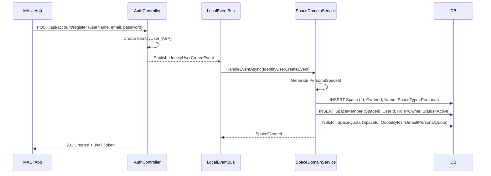

# ADR-01: Space 领域实体设计

| 元数据 | 值 |
|--------|------|
| 文档版本 | 1.0 |
| 日期 | 2026-07-16 |
| 负责人 | Hermes-Architect（architect） |
| 决策性质 | V2.0 Space 领域实体方案冻结 |
| 状态 | **已冻结** |
| 参考来源 | `docs/v2.0-pre-study.md` §2.2、`docs/release-plan-v2.0.md` §2.1、`docs/scenario-matrix-v2.0.md` §1 |

---

## 目录

1. [背景与问题](#1-背景与问题)
2. [决策 1：Space 实体定义与建模](#2-决策-1space-实体定义与建模)
3. [决策 2：SpaceMember 实体与角色模型](#3-决策-2spacemember-实体与角色模型)
4. [决策 3：FileNode 等核心实体的 SpaceId 引入方案](#4-决策-3filenode-等核心实体的-spaceid-引入方案)
5. [决策 4：默认个人空间与用户注册策略](#5-决策-4默认个人空间与用户注册策略)
6. [决策 5：空间停用/删除策略](#6-决策-5空间停用删除策略)
7. [EF Core 迁移脚本 Mock](#7-ef-core-迁移脚本-mock)
8. [回滚方案](#8-回滚方案)
9. [附录](#9-附录)

---

## 1. 背景与问题

### 1.1 现状

V1.x 以 `TenantId + OwnerId` 作为文件隔离边界，所有文件归属单个用户：
- `FileNode`：`TenantId + OwnerId + ParentId` 确定文件和文件夹的唯一路径。
- `BlobObject`、`UploadSession`、`MediaAsset`、`MediaAlbum`、`FileShare`、`FileTag` 均以 `OwnerId` 标识归属。
- 跨用户不可见：用户 A 看不到用户 B 的任何文件，公开分享是唯一的跨用户能力。

### 1.2 V2.0 目标

从个人云盘升级为"空间（Space）云盘"，引入 Space 作为新的隔离范围，实现：
- **个人默认空间**：兼容 V1.x 个人文件，自动迁移。
- **家庭空间**：家庭成员间文件共享，Owner/Admin/Member/Viewer 四类角色。
- **团队空间**：小团队协作，角色模型与家庭空间一致。

### 1.3 核心问题

1. **Space 是否新增独立实体？** 是否可以复用 ABP Tenant 承载"空间"？
2. **成员关系如何建模？** 自己维护 SpaceMember 还是依赖 ABP Identity Role？
3. **现有 `OwnerId` 为中心的表是否增加 `SpaceId`？** 影响范围巨大。
4. **V1.x 存量数据如何迁移？**
5. **空间删除/停用的数据语义是什么？**

---

## 2. 决策 1：Space 实体定义与建模

### 2.1 方案对比

| 维度 | 方案 A（✅ 推荐）**新建 Space 独立聚合** | 方案 B（❌ 拒绝）**复用 ABP Tenant 作为空间** |
|------|:---:|:---:|
| **核心思路** | Domain 层新增 `Space` 聚合根，作为独立于 ABP Tenant 的业务概念 | TenantId 即空间 ID，每个家庭/团队就是独立的 ABP Tenant |
| **实现成本** | 新建 1 个聚合 + 1 个聚合子表（SpaceMember）+ 1 个值对象 （SpaceQuota）+ 系统集成适配 | 利用 ABP 现有多租户表；需 Override TenantManagement UI |
| **数据隔离等级** | 业务级隔离：多空间共享同一数据库、同一 Tenant | 物理级隔离：每次切换空间 = 切换 Tenant；跨空间查询极难 |
| **角色模型灵活度** | 高：完全自定义 SpaceMember.Role 枚举 | 低：只能依赖 ABP 全局 IdentityRole，无法表达"同一用户在不同空间的不同角色" |
| **搜索/媒体/分享查询影响** | 统一加 `SpaceId` 过滤即可 | 需跨 Tenant 联合查询（或走全局视图），EF Core 复杂且性能堪忧 |
| **跨空间文件迁移** | 原生支持：只改 SpaceId | 极难：需要跨 Tenant 数据迁移 |
| **迁移复杂度** | 中等：为每个用户创建默认 Space，给现有数据补 SpaceId | 极高：需要拆分单个 Tenant 为 N 个 Tenant |
| **ABP 生态适配** | 良好：TenantId 保持为"部署租户"，SpaceId 是"业务空间" | 破坏性：Tenant 的语义被 Hijack，影响 ABP 多租户过滤器 |
| **现有架构破坏度** | 低~中：向现有表新增列，但不改变 TenantId 语义 | 高：当前所有仓储的 TenantId 过滤逻辑必须改写 |


### 2.2 推荐理由

选择方案 A（新建 Space 独立聚合）的核心原因：

1. **语义分离**：ABP Tenant 代表"部署与数据库隔离边界"，Space 代表"家庭/小团队协作边界"，两者是正交概念。一台个人 NAS 不会因为创建了多个空间就需要配多套数据库。

2. **跨空间查询可行性**：搜索只会搜索用户在"当前空间"内的文件，但"用户可见空间列表"需要跨空间查询。如果每个空间是一个 Tenant，查询"一个用户所有可见空间的文件"在 EF Core 中要么 N+1，要么走复杂视图。

3. **迁移风险最低**：V1.x 的所有数据都在同一 Tenant 下（当前产品只有单租户部署），补 SpaceId 列是向后兼容的加列迁移。拆分成 N 个 Tenant 是灾难性迁移。

4. **ABP 生态保持**：`IMultiTenant` 过滤器继续约束 TenantId（部署租户），`SpaceId` 在 Application 层通过 `ICurrentSpace` 或 `CurrentUser` 上下文过滤，两者隔离。

### 2.3 Space 实体定义

```csharp
/// <summary>
/// 空间聚合根。空间是 V2.0 文件隔离与协作的核心边界。
/// 同一 ABP Tenant 下可以存在多个 Space。
/// 个人默认空间在用户注册时自动创建，不可删除。
/// </summary>
public class Space : FullAuditedAggregateRoot<Guid>, IMultiTenant
{
    public Guid? TenantId { get; private set; }

    /// <summary>创建者同时也是空间 Owner。</summary>
    public Guid OwnerId { get; private set; }

    /// <summary>空间名称（必填，1~64 字符）。</summary>
    public string Name { get; private set; } = null!;

    /// <summary>标准化后的空间名称，用于重名校验。</summary>
    public string NormalizedName { get; private set; } = null!;

    /// <summary>空间描述（可选，最多 256 字符）。</summary>
    public string? Description { get; private set; }

    /// <summary>空间头像 BlobObjectId（可选）。设置为 null 时使用默认图标。</summary>
    public Guid? AvatarBlobObjectId { get; private set; }

    /// <summary>空间类型：Personal / Family / Team。</summary>
    public SpaceType SpaceType { get; private set; }

    /// <summary>是否已删除（MVP 硬删除，V2.x 候选软删除）。</summary>
    public bool IsDeleted { get; private set; }

    protected Space() { }

    private Space(
        Guid id,
        Guid? tenantId,
        Guid ownerId,
        string name,
        SpaceType spaceType,
        string? description = null)
        : base(id)
    {
        TenantId = tenantId;
        OwnerId = ownerId;
        SpaceType = spaceType;
        SetName(name);
        SetDescription(description);
        // Personal 空间不允许 avatar（使用默认图标）
        if (spaceType == SpaceType.Personal) { AvatarBlobObjectId = null; }
    }

    /// <summary>创建个人默认空间。</summary>
    public static Space CreatePersonal(Guid id, Guid? tenantId, Guid ownerId, string name)
        => new(id, tenantId, ownerId, name, SpaceType.Personal);

    /// <summary>创建家庭或团队空间。</summary>
    public static Space CreateShared(
        Guid id, Guid? tenantId, Guid ownerId, string name,
        SpaceType spaceType, string? description = null)
    {
        if (spaceType is not (SpaceType.Family or SpaceType.Team))
            throw new ArgumentException($"Cannot create shared space with type {spaceType}.", nameof(spaceType));
        return new Space(id, tenantId, ownerId, name, spaceType, description);
    }

    /// <summary>Personal 空间不可删除。</summary>
    public bool CanDelete => SpaceType != SpaceType.Personal;

    public void SetName(string name)
    {
        var trimmed = Check.NotNullOrWhiteSpace(name, nameof(name)).Trim();
        Name = Check.Length(trimmed, nameof(name), SpaceConsts.MaxNameLength)!;
        NormalizedName = NormalizeName(Name);
    }

    public void SetDescription(string? description)
        => Description = Check.Length(description, nameof(description), SpaceConsts.MaxDescriptionLength);

    public void SetAvatar(Guid? blobObjectId)
    {
        if (SpaceType == SpaceType.Personal)
            throw new BusinessException(PrivateCloudDriveDomainErrorCodes.SpacePersonalCannotHaveAvatar);
        AvatarBlobObjectId = blobObjectId;
    }

    /// <summary>标记删除。MVP 硬删除，V2.x 候选软删除。</summary>
    public void MarkDeleted()
    {
        if (!CanDelete)
            throw new BusinessException(PrivateCloudDriveDomainErrorCodes.SpacePersonalCannotDelete);
        // MVP: 硬删除由仓储实际 DELETE
        // V2.x: IsDeleted = true; IsDeletedTime = Clock.Now;
        IsDeleted = true;
    }

    public static string NormalizeName(string name)
        => Check.NotNullOrWhiteSpace(name, nameof(name)).Trim().ToUpperInvariant();
}
```

```csharp
// Domain.Shared 枚举
public enum SpaceType
{
    Personal = 0, // 个人默认空间，不可删除
    Family   = 1, // 家庭共享空间
    Team     = 2, // 团队协作空间
}
```

### 2.4 EF Core 映射

```csharp
builder.Entity<Space>(b =>
{
    b.ToTable(FileCenterDbProperties.DbTablePrefix + "Spaces", FileCenterDbProperties.DbSchema);
    b.ConfigureByConvention();

    b.Property(s => s.OwnerId).IsRequired();
    b.Property(s => s.Name).IsRequired().HasMaxLength(SpaceConsts.MaxNameLength);
    b.Property(s => s.NormalizedName).IsRequired().HasMaxLength(SpaceConsts.MaxNormalizedNameLength);
    b.Property(s => s.Description).HasMaxLength(SpaceConsts.MaxDescriptionLength);
    b.Property(s => s.SpaceType).IsRequired();
    b.Property(s => s.IsDeleted).IsRequired();

    // 同一用户下同类型空间的名称唯一（除 Personal）
    b.HasIndex(s => new { s.TenantId, s.OwnerId, s.SpaceType, s.NormalizedName })
        .IsUnique()
        .HasFilter("\"SpaceType\" != 0 AND \"IsDeleted\" = false");
    b.HasIndex(s => new { s.TenantId, s.OwnerId });
});
```

---

## 3. 决策 2：SpaceMember 实体与角色模型

### 3.1 方案对比

| 维度 | 方案 A（✅ 推荐）**专有 SpaceMember 实体** | 方案 B（❌ 拒绝）**复用 ABP OrganizationUnit + Role** |
|------|:---:|:---:|
| **核心思路** | 新增 `SpaceMember` 聚合子表，`SpaceId + UserId` 为唯一索引，Role 为枚举字段 | 利用 ABP `OrganizationUnit`（OU）表达空间结构，空间角色映射为 ABP Role |
| **存储灵活性** | 高：可以表达 Active/Pending/Expired/Disabled 状态 | 低：OU + Role 组合需要多张表（OU、OU Role、User OU），状态需额外字段 |
| **邀请流程支持** | 原生支持（Pending 状态 + 过期逻辑） | 需要额外设计，ABP 无"待接受邀请"概念 |
| **多角色共存** | 明确：同一用户在空间内只有一个 Role | 复杂：用户可能在多个 OU 中，角色叠加可能冲突 |
| **权限校验复杂度** | 低：`GetRole(spaceId, userId) → Role` | 高：需要合并 OU 继承链上的所有角色 |
| **ABP 生态调用量** | 几乎不依赖 | 大量依赖 ABP OU 内部 API，升级 ABP 时脆弱 |
| **迁移路径** | 独立表，迁移脚本干净 | 需先创建 OU 结构，再映射现有用户，复杂 |
| **前端/API 契约清晰度** | 高：`SpaceMemberDto` 自解释 | 低：前端需理解 ABP OU 嵌套关系 |

### 3.2 推荐理由

选择方案 A（专有 SpaceMember 实体）的核心原因：

1. **邀约状态机需求明确**：空间邀请需要 Pending → Active / Rejected / Expired 四态，ABP OU 无此概念，强行使用会引入死记录和额外状态表。

2. **权限校验路径最短**：`SELECT Role FROM SpaceMembers WHERE SpaceId = @sid AND UserId = @uid AND Status = 'Active'` 一条 SQL 即可获取角色。OU 的层层继承会导致 N+1 或递归 CTE。

3. **V2.0 MVP 不涉及复杂组织架构**（已在范围排除），OU 的高级能力（树形组织、嵌套层级）在此场景中过度设计。

4. **解耦 ABP 升级**：业务层不依赖 ABP 的内部 OU 实现，升级 ABP 大版本时几乎没有影响。

### 3.3 SpaceMember 实体定义

```csharp
/// <summary>
/// 空间成员关联实体，记录用户与空间的绑定关系、角色和状态。
/// 状态机：Pending → Active（接受）/ Rejected（拒绝）/ Expired（过期）。
/// Owner 角色的空间成员一定是 Active + 不可禁用。
/// </summary>
public class SpaceMember : CreationAuditedEntity<Guid>, IMultiTenant
{
    public Guid? TenantId { get; private set; }

    /// <summary>关联空间 ID。</summary>
    public Guid SpaceId { get; private set; }

    /// <summary>关联用户 ID。</summary>
    public Guid UserId { get; private set; }

    /// <summary>用户在空间内的角色。</summary>
    public SpaceRole Role { get; private set; }

    /// <summary>成员状态：Active / Pending / Rejected / Expired / Removed。</summary>
    public SpaceMemberStatus Status { get; private set; }

    /// <summary>加入时间（首次变为 Active 的时间）。</summary>
    public DateTime? JoinedAt { get; private set; }

    /// <summary>是否被手动禁用（Owner/Admin 操作）。</summary>
    public bool IsDisabled { get; private set; }

    /// <summary>邀请过期时间（仅 Pending 状态有效）。</summary>
    public DateTime? InvitationExpiresAt { get; private set; }

    protected SpaceMember() { }

    /// <summary>创建邀请（Pending 状态）。</summary>
    public SpaceMember(
        Guid id, Guid? tenantId, Guid spaceId, Guid userId,
        SpaceRole role, DateTime? invitationExpiresAt = null)
        : base(id)
    {
        TenantId = tenantId;
        SpaceId = spaceId;
        UserId = userId;
        Role = role;
        Status = SpaceMemberStatus.Pending;
        InvitationExpiresAt = invitationExpiresAt;
        IsDisabled = false;
    }

    /// <summary>接受邀请。</summary>
    public void Accept()
    {
        if (Status != SpaceMemberStatus.Pending)
            throw new InvalidOperationException($"Cannot accept from status {Status}.");
        Status = SpaceMemberStatus.Active;
        JoinedAt = Clock.Now;
        InvitationExpiresAt = null;
    }

    /// <summary>拒绝邀请。</summary>
    public void Reject()
    {
        if (Status != SpaceMemberStatus.Pending)
            throw new InvalidOperationException($"Cannot reject from status {Status}.");
        Status = SpaceMemberStatus.Rejected;
    }

    /// <summary>标记邀请过期。</summary>
    public void Expire()
    {
        if (Status != SpaceMemberStatus.Pending)
            throw new InvalidOperationException($"Cannot expire from status {Status}.");
        Status = SpaceMemberStatus.Expired;
    }

    /// <summary>修改角色。Owner 角色不可被修改。</summary>
    public void ChangeRole(SpaceRole newRole)
    {
        if (Role == SpaceRole.Owner)
            throw new BusinessException(PrivateCloudDriveDomainErrorCodes.SpaceMemberOwnerRoleCannotChange);
        Role = newRole;
    }

    /// <summary>禁用/启用成员。Owner 不可被禁用。</summary>
    public void SetDisabled(bool disabled)
    {
        if (Role == SpaceRole.Owner && disabled)
            throw new BusinessException(PrivateCloudDriveDomainErrorCodes.SpaceMemberOwnerCannotDisable);
        IsDisabled = disabled;
    }

    /// <summary>移除成员。Owner 不可被移除。</summary>
    public void Remove()
    {
        if (Role == SpaceRole.Owner)
            throw new BusinessException(PrivateCloudDriveDomainErrorCodes.SpaceMemberOwnerCannotRemove);
        Status = SpaceMemberStatus.Removed;
    }
}
```

```csharp
public enum SpaceRole
{
    Owner  = 0, // 空间创建者，唯一且不可撤销
    Admin  = 1, // 管理员：成员管理、文件管理
    Member = 2, // 普通成员：文件增删改（自己上传）
    Viewer = 3, // 查看者：只读
}

public enum SpaceMemberStatus
{
    Active    = 0, // 已接受邀请，正常使用
    Pending   = 1, // 待接受邀请
    Rejected  = 2, // 已拒绝邀请
    Expired   = 3, // 邀请过期
    Removed   = 4, // 已被移除（硬删除候选）
}
```

### 3.4 EF Core 映射

```csharp
builder.Entity<SpaceMember>(b =>
{
    b.ToTable(FileCenterDbProperties.DbTablePrefix + "SpaceMembers", FileCenterDbProperties.DbSchema);
    b.ConfigureByConvention();

    b.Property(m => m.SpaceId).IsRequired();
    b.Property(m => m.UserId).IsRequired();
    b.Property(m => m.Role).IsRequired();
    b.Property(m => m.Status).IsRequired();
    b.Property(m => m.IsDisabled).IsRequired();

    b.HasIndex(m => new { m.TenantId, m.SpaceId, m.UserId }).IsUnique();
    b.HasIndex(m => new { m.TenantId, m.UserId, m.Status });
    b.HasIndex(m => new { m.TenantId, m.SpaceId, m.Role });
    b.HasIndex(m => m.InvitationExpiresAt);
});
```

---

## 4. 决策 3：FileNode 等核心实体的 SpaceId 引入方案

### 4.1 方案对比

| 维度 | 方案 A（✅ 推荐）**直接新增 SpaceId 列** | 方案 B（❌ 拒绝）**引入 FileACL 桥接表** |
|------|:---:|:---:|
| **核心思路** | 所有 V1.x `OwnerId` 为主的业务表直接新增 `SpaceId` 列（可为空，迁移后非空） | 不修改现有表，新增 `FileAccessControl` 桥接表表达 （SpaceId, FileNodeId, Permissions） |
| **查询性能** | 优：单表 `WHERE SpaceId = @sid`，无 JOIN | 中：每次文件列表需要 JOIN ACL 表，多一层间接 |
| **迁移复杂度** | 中：7~8 张表每张加 1 列 + 填充默认空间 ID | 低：现有表不动，只新建 ACL 表 + 填充默认记录 |
| **空间隔离强度** | 强：查询天然按 SpaceId 过滤，无遗漏风险 | 弱：如果一个文件被误加多个空间的 ACL，会造成泄露 |
| **唯一索引影响** | 需要调整：原来 `OwnerId + ParentId + NormalizedName` 变为 `SpaceId + ParentId + NormalizedName` | 不变：FileNode 自身索引不变，ACL 单独索引 |
| **后端 API 改造量** | 大：几乎所有 AppService、Repository 需加 SpaceId 参数 + 权限校验 | 更大：每个文件操作仍需解析 ACL，且 ACL 校验逻辑额外 |
| **MVCC/历史的清晰度** | 单一归属，清晰易懂 | 多对多设计，易出现"一个文件属于多个空间"的模糊状态 |

### 4.2 推荐理由

选择方案 A 的核心原因：

1. **文件只有一个归属空间（SpaceId 非空）**。V2.0 中文件要么在个人默认空间，要么在家庭/团队空间。文件不会同时属于两个空间。多空间 ACL 在这种场景下是无意义的多余间接层。

2. **查询性能优势显著**。文件列表是最频繁的 API，直接 WHERE SpaceId 过滤避免了 JOIN 或子查询。

3. **空间删除级联清晰**。删除空间时只需 `DELETE FROM FileNodes WHERE SpaceId = @sid`，无需回收 ACL 表。

4. **代码改造可预期**。每张业务表同一个模式：新增 SpaceId 列 + 调整唯一索引 + 升级仓储查询。一次性工作量，后期维护成本为零。

### 4.3 影响范围分析

需要新增 SpaceId 的实体/表及对应影响：

| 表名 | 新增列 | 现有唯一/查询索引影响 | 备注 |
|------|--------|----------------------|------|
| **FileNode** | `SpaceId: Guid NOT NULL` | 原 `OwnerId + ParentId + NormalizedName` → `SpaceId + ParentId + NormalizedName`；新增 `SpaceId` 到复合索引 | 核心变更，影响最大 |
| **BlobObject** | `SpaceId: Guid NOT NULL` | 原 `TenantId + OwnerId` → `TenantId + SpaceId`；`BlobName` 唯一索引不变 | Owner 语义保持追溯 |
| **UploadSession** | `SpaceId: Guid NOT NULL` | 原 `TenantId + OwnerId + Status` → `TenantId + SpaceId + Status` | 上传会话按空间隔离 |
| **MediaAsset** | `SpaceId: Guid NOT NULL` | 原 `TenantId + OwnerId + MediaType` → `TenantId + SpaceId + MediaType` | 媒体资产按空间隔离 |
| **MediaAlbum** | `SpaceId: Guid NOT NULL` | 原 `TenantId + OwnerId + NormalizedName` → `TenantId + SpaceId + NormalizedName` | 相册按空间隔离 |
| **MediaAlbumItem** | `SpaceId: Guid NOT NULL` | 原复合索引均加 SpaceId | 相册项按空间隔离 |
| **FileShare** | `SpaceId: Guid NOT NULL` | 原 `TenantId + OwnerId + FileNodeId` → `TenantId + SpaceId + FileNodeId` | 分享按空间隔离 |
| **FileTag** | `SpaceId: Guid NOT NULL` | 原 `TenantId + OwnerId + NormalizedName` → `TenantId + SpaceId + NormalizedName` | 标签按空间隔离 |
| **FileNodeTag** | `SpaceId: Guid NOT NULL` | 原唯一索引加 SpaceId | 标签关联按空间隔离 |
| **FileCenterOperationLog** | `SpaceId: Guid`（可空） | 新增索引：`TenantId + SpaceId` | 日志增量写入，历史数据可空 |

### 4.4 `FileNode` 的 `SpaceId` 对现有 `OwnerId` 的冲击分析

1. **OwnerId 保留为"上传者/创建者"语义**，不删除。`OwnerId` 变为纯粹的"谁上传的"，而 `SpaceId` 变为"文件中在哪个空间"。权限判断从 `OwnerId == currentUser` 变为 `UserHasAccess(spaceId, role)`。

2. **OwnerId 不再是查询主键**。所有现有仓储中 `Where(OwnerId == ownerId)` 替换为 `Where(SpaceId == spaceId)` + 额外权限过滤。

3. **OwnerId 仍然用于追踪责任**。在空间删除或成员移除时，保留 `OwnerId` 用于"文件上传者是谁"的查询。不能完全依赖 `SpaceId` 反向查询用户。

4. **OwnerId 索引迁移**：
   - 保留历史索引以避免迁移中断（加上 `HasFilter` 新老兼容）
   - 新增 `SpaceId` 系列索引作为 V2.0 查询主路径
   - 可在 V2.x 后期删除以 `OwnerId` 为主的旧索引（独立于 V2.0 MVP 发布）

### 4.5 FileNode 唯一索引调整方案

**V1.x 唯一索引：**
```sql
-- 根目录
UNIQUE INDEX IX_OwnerId_NormalizedName 
  ON AppFileNodes (OwnerId, NormalizedName) 
  WHERE IsDeleted = false AND ParentId IS NULL;

-- 子目录
UNIQUE INDEX IX_OwnerId_ParentId_NormalizedName 
  ON AppFileNodes (OwnerId, ParentId, NormalizedName) 
  WHERE IsDeleted = false AND ParentId IS NOT NULL;
```

**V2.0 唯一索引（迁移后）：**
```sql
-- 根目录（同一 Space 内）
UNIQUE INDEX IX_SpaceId_NormalizedName 
  ON AppFileNodes (SpaceId, NormalizedName) 
  WHERE IsDeleted = false AND ParentId IS NULL;

-- 子目录（同一 Space 内同一父目录）
UNIQUE INDEX IX_SpaceId_ParentId_NormalizedName 
  ON AppFileNodes (SpaceId, ParentId, NormalizedName) 
  WHERE IsDeleted = false AND ParentId IS NOT NULL;

-- 过渡期间保留旧索引，V2.1+ 清理
```

---

## 5. 决策 4：默认个人空间与用户注册策略

### 5.1 方案对比

| 维度 | 方案 A（✅ 推荐）**注册时同步创建 + 迁移脚本填充存量** | 方案 B（❌ 拒绝）**惰性创建 + 无迁移脚本** |
|------|:---:|:---:|
| **V2.0 首次部署** | 迁移脚本为每个存量用户创建 PersonalSpace，`FileNode.SpaceId` 指向它 | 所有存量用户的 FileNode.SpaceId 为 null，查询时退化为 `OwnerId` 模式 |
| **新用户注册** | 注册事件 handler 同步创建 Space + SpaceMember（Owner） | 首次文件操作时惰性检查并创建 |
| **代码复杂度** | 中等：需要 DomainHandler 监听 `IdentityUserCreate` 事件 | 低：不需要事件 handler |
| **数据一致性** | 强：SpaceId 永远非空，查询统一 | 弱：SpaceId 可空，仓储查询需要双分支 |
| **回滚安全** | 迁移脚本可逆，删除默认空间即可 | N/A（不需要回滚） |
| **后续扩展性** | 好：SpaceId 非空则查询逻辑统一 | 差：`IS NULL` 分支永远存在，增大了遗漏风险 |

### 5.2 推荐理由

选择方案 A 的核心原因：

1. **查询统一性压倒一切**。如果允许 `SpaceId IS NULL`，每个查询都要写 `WHERE (SpaceId = @sid OR SpaceId IS NULL)`，新老逻辑并存。这不仅增加代码量，更重要的是**新权限校验可能遗漏 NULL 分支，留下越权漏洞**。

2. **迁移脚本是 V2.0 MVP 的 P0 强制项**。`docs/release-plan-v2.0.md` 中 SP-02 明确要求"默认个人空间迁移 + DbMigrator dry-run"。存量数据必须在迁移时补全 SpaceId。

3. **注册事件 handler 是 ABP 标准模式**。`IdentityUserCreateHandler` 实现 `ILocalEventHandler<IdentityUserCreateEvent>`，业务逻辑被框架自动调度，无需手动调用。

### 5.3 无空间用户迁方案

无空间用户场景：存量用户在迁移时如果因为 `TenantId` 或 `OwnerId` 异常未能创建默认空间。

**策略**：

1. **迁移脚本健壮性**：迁移脚本使用 `INSERT ... ON CONFLICT DO NOTHING`，对所有 Identity 用户逐一创建 Space + SpaceMember（Owner），不因个别异常导致整体迁移失败。

2. **后置校验**：迁移后运行 `SELECT * FROM AbpUsers u WHERE NOT EXISTS (SELECT 1 FROM AppSpaces s WHERE s.OwnerId = u.Id)` 输出无空间用户清单。

3. **运行时保护**：在 `SpaceManager` 中增加 `GetOrCreatePersonalSpaceAsync(userId)`。任何 API 入口如果检测到当前用户没有 PersonalSpace，先自动创建再继续。这是运行时兜底，但不应依赖（应在前置迁移杜绝）。

### 5.4 注册流程



---

## 6. 决策 5：空间停用/删除策略

### 6.1 方案对比

| 维度 | 方案 A（✅ 推荐 MVP）**硬删除** | 方案 B（V2.x 候选）**软删除 + 30 天保留期** |
|------|:---:|:---:|
| **实现方式** | DELETE FROM Spaces WHERE Id = @id 级联删除成员、文件 | UPDATE Spaces SET IsDeleted = true, DeletionTime = NOW() |
| **数据恢复** | 不可能（需要从 DB 备份恢复） | 30 天内可通过管理界面恢复 |
| **空间内文件** | 级联删除 FileNode（放入回收站用户可见，但空间删除后回收站不可见） | 标记为"空间已删除"状态，SpaceId 保留，30 天后自动清理 |
| **实现成本（MVP）** | 低：级联 DELETE + 仓储物理删除 | 高：回收站适配、状态机、定时清理 Job、保留期配置 |

### 6.2 推荐理由

MVP 选择方案 A（硬删除）的核心原因：

1. **MVP 的用户场景是"清理不再需要的空间"**，而不是"撤销误删除"。在 V2.0 MVP 阶段，空间删除是创建者的有意操作，恢复需求极低。

2. **简化 MVP 数据模型**：没有 `IsDeleted` 字段、`DeletionTime`、自动清理 Job、保留期配置，MVP 的 Space 模型减少约 40% 的复杂性。

3. **V2.x 候选方案不阻塞 MVP**：Space 实体已经预留 `IsDeleted` 字段，软删除的迁移脚本不会发生 schema 变更（只是字段语义从"硬删除标记"变为"软删除标记"）。

4. **硬删除不代表数据不可恢复**：DB 备份是运维基线（V1.3 已支持），如需恢复空间数据，DBA 可以从备份恢复。

### 6.3 MVP 硬删除行为契约

```text
1. DELETE FROM AppSpaceMembers WHERE SpaceId = @spaceId
2. DELETE FROM AppSpaceQuotas WHERE SpaceId = @spaceId
3. DELETE FROM AppFileNodes WHERE SpaceId = @spaceId        -- EF Core OnDelete=Cascade
   → 级联到 AppFileShares、AppFileNodeTags、AppMediaAssets、AppMediaAlbumItems
4. DELETE FROM AppMediaAlbums WHERE SpaceId = @spaceId       -- 媒体相册
5. DELETE FROM AppBlobObjects WHERE SpaceId = @spaceId       -- 物理 Blob 文件标记为孤儿，异步清理
6. DELETE FROM AppUploadSessions WHERE SpaceId = @spaceId
7. DELETE FROM AppSpaces WHERE Id = @spaceId
```

**前提校验**：
- 只有 Space.Owner 可以执行删除。
- Personal 空间不可删除（`CanDelete == false`）。
- 删除前提示用户"该操作不可逆，空间内所有文件将被永久删除"。
- 删除空间前已自动清理所有分享链接（先 `DisableAllShares`）。

### 6.4 V2.x 软删除增强方案（预留设计）

```text
Space.IsDeleted = true
Space.DeletionTime = NOW()
Space.DeletedBy = currentUserId

- 空间名称改为 "已删除空间_<OriginalName>_<SpaceId>"（释放原名唯一性）
- Space 从用户空间列表消失（查询过滤 IsDeleted = false）
- 空间内文件 FileNode 保留，SpaceId 不变，但所有 API 在 IsDeleted = true 时返回 404
- Timer Job 每天检查 DeletionTime + 30 天 → 物理清理
- Owner 可撤销删除：调用 RESTORE API 恢复 DeletionTime = null
```

---

## 7. EF Core 迁移脚本 Mock

### 7.1 迁移步骤（按顺序）

```csharp
/// <summary>
/// V2.0.0.0: Create Space & SpaceMember tables + add SpaceId to core entities.
/// WARNING: This migration is irreversible after production data is written.
/// Run `--dry-run` first in a test environment.
/// </summary>
public partial class V2_0_0_AddSpaceEntities : Migration
{
    protected override void Up(MigrationBuilder migrationBuilder)
    {
        // ===== Step 1: Create Space table =====
        migrationBuilder.CreateTable(
            name: "AppSpaces",
            columns: table => new
            {
                Id = table.Column<Guid>(nullable: false),
                TenantId = table.Column<Guid>(nullable: true),
                OwnerId = table.Column<Guid>(nullable: false),
                Name = table.Column<string>(maxLength: 64, nullable: false),
                NormalizedName = table.Column<string>(maxLength: 64, nullable: false),
                Description = table.Column<string>(maxLength: 256, nullable: true),
                AvatarBlobObjectId = table.Column<Guid>(nullable: true),
                SpaceType = table.Column<int>(nullable: false),
                IsDeleted = table.Column<bool>(nullable: false, defaultValue: false),
                ExtraProperties = table.Column<string>(nullable: true),
                ConcurrencyStamp = table.Column<string>(maxLength: 40, nullable: true),
                CreationTime = table.Column<DateTime>(nullable: false),
                CreatorId = table.Column<Guid>(nullable: true),
                LastModificationTime = table.Column<DateTime>(nullable: true),
                LastModifierId = table.Column<Guid>(nullable: true),
            },
            constraints: table =>
            {
                table.PrimaryKey("PK_AppSpaces", x => x.Id);
            });

        // ===== Step 2: Create SpaceMember table =====
        migrationBuilder.CreateTable(
            name: "AppSpaceMembers",
            columns: table => new
            {
                Id = table.Column<Guid>(nullable: false),
                TenantId = table.Column<Guid>(nullable: true),
                SpaceId = table.Column<Guid>(nullable: false),
                UserId = table.Column<Guid>(nullable: false),
                Role = table.Column<int>(nullable: false),
                Status = table.Column<int>(nullable: false),
                JoinedAt = table.Column<DateTime>(nullable: true),
                IsDisabled = table.Column<bool>(nullable: false, defaultValue: false),
                InvitationExpiresAt = table.Column<DateTime>(nullable: true),
                ExtraProperties = table.Column<string>(nullable: true),
                ConcurrencyStamp = table.Column<string>(maxLength: 40, nullable: true),
                CreationTime = table.Column<DateTime>(nullable: false),
                CreatorId = table.Column<Guid>(nullable: true),
            },
            constraints: table =>
            {
                table.PrimaryKey("PK_AppSpaceMembers", x => x.Id);
                table.ForeignKey(
                    name: "FK_AppSpaceMembers_AppSpaces_SpaceId",
                    column: x => x.SpaceId,
                    principalTable: "AppSpaces",
                    principalColumn: "Id",
                    onDelete: ReferentialAction.Cascade);
            });

        // ===== Step 3: Add SpaceId to all core entity tables =====
        // 3a. FileNode
        migrationBuilder.AddColumn<Guid>(
            name: "SpaceId",
            table: "AppFileNodes",
            nullable: false,
            defaultValue: new Guid("00000000-0000-0000-0000-000000000000")); // placeholder

        // 3b. BlobObject
        migrationBuilder.AddColumn<Guid>(
            name: "SpaceId",
            table: "AppBlobObjects",
            nullable: false,
            defaultValue: new Guid("00000000-0000-0000-0000-000000000000"));

        // 3c. UploadSession
        migrationBuilder.AddColumn<Guid>(
            name: "SpaceId",
            table: "AppUploadSessions",
            nullable: false,
            defaultValue: new Guid("00000000-0000-0000-0000-000000000000"));

        // 3d. MediaAsset
        migrationBuilder.AddColumn<Guid>(
            name: "SpaceId",
            table: "AppMediaAssets",
            nullable: false,
            defaultValue: new Guid("00000000-0000-0000-0000-000000000000"));

        // 3e. MediaAlbum
        migrationBuilder.AddColumn<Guid>(
            name: "SpaceId",
            table: "AppMediaAlbums",
            nullable: false,
            defaultValue: new Guid("00000000-0000-0000-0000-000000000000"));

        // 3f. MediaAlbumItem
        migrationBuilder.AddColumn<Guid>(
            name: "SpaceId",
            table: "AppMediaAlbumItems",
            nullable: false,
            defaultValue: new Guid("00000000-0000-0000-0000-000000000000"));

        // 3g. FileShare
        migrationBuilder.AddColumn<Guid>(
            name: "SpaceId",
            table: "AppFileShares",
            nullable: false,
            defaultValue: new Guid("00000000-0000-0000-0000-000000000000"));

        // 3h. FileTag
        migrationBuilder.AddColumn<Guid>(
            name: "SpaceId",
            table: "AppFileTags",
            nullable: false,
            defaultValue: new Guid("00000000-0000-0000-0000-000000000000"));

        // 3i. FileNodeTag
        migrationBuilder.AddColumn<Guid>(
            name: "SpaceId",
            table: "AppFileNodeTags",
            nullable: false,
            defaultValue: new Guid("00000000-0000-0000-0000-000000000000"));

        // 3j. OperationLog (nullable — historical logs won't have SpaceId)
        migrationBuilder.AddColumn<Guid>(
            name: "SpaceId",
            table: "AppOperationLogs",
            nullable: true);

        // ===== Step 4: Create default PersonalSpaces for all existing users =====
        // Executed as SQL since it references Identity framework tables.
        // Remark: Use DbMigrator.SeedData() for the actual data migration logic —
        // this is a mock to show the pattern.
        migrationBuilder.Sql(@"
            INSERT INTO AppSpaces (Id, TenantId, OwnerId, Name, NormalizedName, SpaceType, IsDeleted,
                                   ExtraProperties, ConcurrencyStamp, CreationTime, CreatorId)
            SELECT 
                NEWID(),                          -- Id
                NULL,                             -- TenantId (single-tenant)
                u.Id,                             -- OwnerId
                '我的个人空间',                     -- Name (default Chinese)
                '我的个人空间',                     -- NormalizedName
                0,                                -- SpaceType = Personal
                0,                                -- IsDeleted = false
                '{}',                             -- ExtraProperties
                NEWID(),                          -- ConcurrencyStamp
                GETUTCDATE(),                     -- CreationTime
                u.Id                              -- CreatorId
            FROM AbpUsers u
            WHERE NOT EXISTS (
                SELECT 1 FROM AppSpaces s 
                WHERE s.OwnerId = u.Id AND s.SpaceType = 0
            )
        ");

        // ===== Step 5: Update FileNode.SpaceId = default personal space =====
        migrationBuilder.Sql(@"
            UPDATE fn
            SET fn.SpaceId = ps.Id
            FROM AppFileNodes fn
            INNER JOIN AppSpaces ps ON ps.OwnerId = fn.OwnerId AND ps.SpaceType = 0
            WHERE fn.SpaceId = '00000000-0000-0000-0000-000000000000'
        ");

        // Same for BlobObject, MediaAsset, etc. (omitted for brevity — same pattern)

        // ===== Step 6: Create SpaceMember records =====
        migrationBuilder.Sql(@"
            INSERT INTO AppSpaceMembers (Id, TenantId, SpaceId, UserId, Role, Status, JoinedAt, IsDisabled,
                                         ExtraProperties, ConcurrencyStamp, CreationTime, CreatorId)
            SELECT 
                NEWID(), NULL, s.Id, s.OwnerId, 0, 0, GETUTCDATE(), 0,
                '{}', NEWID(), GETUTCDATE(), s.OwnerId
            FROM AppSpaces s
            WHERE s.SpaceType = 0
        ");

        // ===== Step 7: Create indexes (new SpaceId-based indexes) =====
        // FileNode
        migrationBuilder.CreateIndex(
            name: "IX_AppFileNodes_SpaceId_ParentId_NormalizedName",
            table: "AppFileNodes",
            columns: new[] { "SpaceId", "ParentId", "NormalizedName" },
            unique: true,
            filter: "\"IsDeleted\" = false AND \"ParentId\" IS NOT NULL");

        migrationBuilder.CreateIndex(
            name: "IX_AppFileNodes_SpaceId_NormalizedName",
            table: "AppFileNodes",
            columns: new[] { "SpaceId", "NormalizedName" },
            unique: true,
            filter: "\"IsDeleted\" = false AND \"ParentId\" IS NULL");

        // SpaceMembers
        migrationBuilder.CreateIndex(
            name: "IX_AppSpaceMembers_TenantId_SpaceId_UserId",
            table: "AppSpaceMembers",
            columns: new[] { "TenantId", "SpaceId", "UserId" },
            unique: true);

        // (Abbreviated: similar indexes for BlobObject, MediaAsset, etc.)
    }

    protected override void Down(MigrationBuilder migrationBuilder)
    {
        // Rollback: reverse order of Up()
        
        // Drop new indexes
        migrationBuilder.DropIndex(
            name: "IX_AppFileNodes_SpaceId_ParentId_NormalizedName",
            table: "AppFileNodes");
        migrationBuilder.DropIndex(
            name: "IX_AppFileNodes_SpaceId_NormalizedName",
            table: "AppFileNodes");
        // ... drop other new indexes ...

        // Remove SpaceId columns
        migrationBuilder.DropColumn(name: "SpaceId", table: "AppFileNodes");
        migrationBuilder.DropColumn(name: "SpaceId", table: "AppBlobObjects");
        // ... (all 10 tables) ...

        // Drop tables
        migrationBuilder.DropTable(name: "AppSpaceMembers");
        migrationBuilder.DropTable(name: "AppSpaces");
    }
}
```

### 7.2 DbMigrator Data Seed

```csharp
// PrivateCloudDriveDbMigrationService.cs (extract)
public async Task MigrateAsync()
{
    await _dbContext.Database.MigrateAsync(); // EF Core migrations
    
    // V2.0 data seed
    await SeedDefaultPersonalSpacesAsync();
}

private async Task SeedDefaultPersonalSpacesAsync()
{
    var users = await _identityUserRepository.GetListAsync();
    foreach (var user in users)
    {
        var existingSpace = await _spaceRepository.FindPersonalSpaceByOwnerAsync(user.Id);
        if (existingSpace != null) continue;

        var personalSpace = Space.CreatePersonal(
            Guid.NewGuid(), null, user.Id,
            SpaceConsts.DefaultPersonalSpaceName);
        
        await _spaceRepository.InsertAsync(personalSpace);
        
        // Update all owned FileNodes (and other entities) to point to this space
        await _fileNodeRepository.BatchUpdateSpaceIdAsync(
            user.Id, personalSpace.Id);
        await _blobObjectRepository.BatchUpdateSpaceIdAsync(
            user.Id, personalSpace.Id);
        // ... repeat for all 8+ entities
    }
}
```

---

## 8. 回滚方案

### 8.1 回滚场景矩阵

| 场景 | 回滚操作 | 风险 | 数据影响范围 |
|------|---------|:----:|-------------|
| **S1：ADR 阶段发现设计缺陷** | 不进入实现，退回 V1.5 稳定增强路线 | 无 | 无（只有文档） |
| **S2：DB 迁移 dry-run 失败** | 舍弃测试库重建；修正 migration 脚本或 seed 逻辑 | 低 | 不影响测试库以外任何数据 |
| **S3：生产迁移后新 API 故障** | ① 降级：新 API 返回 503 / 隐藏空间功能入口 ② 保留现有 V1.x API 路径不变 | 低~中 | 新旧 API 共存，用户只走旧 API |
| **S4：生产迁移后越权漏洞** | **立即回滚：** ① 关闭 V2.0 空间 API 路由 ② 切换回 V1.x OwnerId 模式鉴权 ③ 紧急补丁修复后重新上线 | **高** | SpaceId 列仍存在，但查询降级 | 
| **S5：生产迁移后数据不一致** | ① 停止服务 ② 恢复 V1.4 数据库备份 ③ 回滚代码到 V1.4 基线 ④ 验证恢复完整性 | **高** | 回滚期间服务不可用；V2.0 数据的丢失 |

### 8.2 推荐回滚路径

**从部署到回滚的最短路径（S3/S4 场景）：**

```text
1. 保留 V1.x API 路由不变（不做 API 破坏性变更）
   → 新空间 API 使用 /api/v2/spaces/...，旧 API 内部分发到默认个人空间
   → 如果新 API 出问题，用户仍可通过旧 API 使用文件功能

2. 功能开关（Feature Flag）
   ```csharp
   // appsettings.json
   "PrivateCloudDrive": {
     "Features": {
       "SpaceV2": false  // 默认关闭，上线前打开
     }
   }
   ```
   → 如果发现异常，立刻关闭 SpaceV2 特性开关
   → 前台隐藏空间切换入口
   → 所有 API 退回到 V1.x OwnerId 模式

3. 如果特性开关不足以控制（例如迁移脚本写乱了数据）
   → 回滚代码到 V1.4 基线 git tag
   → 从 V1.4 数据库备份恢复
   → 校验恢复数据完整性
```

### 8.3 回滚验证

```text
回滚后验证清单：
[ ] 所有用户可正常登录
[ ] 文件列表返回 ORIGINAL 数据（不返回 SpaceId 过滤后的子集）
[ ] 上传/下载/删除/恢复操作正常
[ ] 分享链接可用
[ ] 搜索正常
[ ] 媒体库/相册正常
[ ] 配额显示正常
[ ] V1.4 测试矩阵 PASS
```

---

## 9. 附录

### 9.1 新增/修改文件清单

| 文件 | 操作 | 说明 |
|------|:----:|------|
| `Domain/FileCenter/Space.cs` | **新增** | Space 聚合根 |
| `Domain/FileCenter/SpaceMember.cs` | **新增** | 空间成员实体 |
| `Domain.Shared/FileCenter/SpaceConsts.cs` | **新增** | 常量定义 |
| `Domain.Shared/FileCenter/SpaceType.cs` | **新增** | SpaceType 枚举 |
| `Domain.Shared/FileCenter/SpaceRole.cs` | **新增** | SpaceRole 枚举 |
| `Domain.Shared/FileCenter/SpaceMemberStatus.cs` | **新增** | SpaceMemberStatus 枚举 |
| `Domain.Shared/FileCenter/PrivateCloudDriveDomainErrorCodes.cs` | **修改** | 新增 Space 相关错误码 |
| `Domain/FileCenter/FileNode.cs` | **修改** | 新增 SpaceId 属性、调整唯一索引逻辑 |
| `Domain/FileCenter/BlobObject.cs` | **修改** | 新增 SpaceId |
| `Domain/FileCenter/UploadSession.cs` | **修改** | 新增 SpaceId |
| `Domain/FileCenter/MediaAsset.cs` | **修改** | 新增 SpaceId |
| `Domain/FileCenter/MediaAlbum.cs` | **修改** | 新增 SpaceId |
| `Domain/FileCenter/FileShare.cs` | **修改** | 新增 SpaceId |
| `Domain/FileCenter/FileTag.cs` | **修改** | 新增 SpaceId |
| `Domain/FileCenter/FileNodeTag.cs` | **修改** | 新增 SpaceId |
| `Domain/FileCenter/FileCenterOperationLog.cs` | **修改** | 新增 SpaceId（可空） |
| `Application.Contracts/...` | **修改** | 对应 DTO 新增 SpaceId |
| `EntityFrameworkCore/.../FileCenterDbContextModelCreatingExtensions.cs` | **修改** | Space/SpaceMember 映射 + 现有实体 SpaceId 映射 + 索引升级 |
| `EntityFrameworkCore/.../PrivateCloudDriveDbContext.cs` | **修改** | 新增 `DbSet<Space>`、`DbSet<SpaceMember>` |
| `Domain/FileCenter/SpaceManager.cs` | **新增** | 空间领域服务 |
| `Domain/FileCenter/SpaceMemberManager.cs` | **新增** | 成员管理领域服务 |
| `Application.Contracts/FileCenter/SpaceDto.cs` | **新增** | 空间 DTO |
| `Application.Contracts/FileCenter/SpaceMemberDto.cs` | **新增** | 成员 DTO |
| `Application/FileCenter/SpaceAppService.cs` | **新增** | 空间应用服务 |
| `Application/FileCenter/SpaceMemberAppService.cs` | **新增** | 成员管理应用服务 |
| `Domain/.../EventHandlers/SpaceCreatedHandler.cs` | **新增** | 注册事件 → 创建默认空间 |
| `Domain/.../EventHandlers/UserRegisteredHandler.cs` | **新增** | 新用户注册 → 创建默认个人空间 |

### 9.2 附加决策说明

1. **SpaceId 使用 Guid（UUID v7）**。理由：与现有 `FileNode.Id`、`BlobObject.Id` 一致，ABP 默认也是 Guid；UUID v7 在 PostgreSQL 中索引性能好于随机 UUID。

2. **不引入 `ICurrentSpace` 接口**。理由：当前 ABP 的 `ICurrentUser` 模式可以扩展出 `ICurrentSpace`，但 V2.0 MVP 中简化方案：允许前端显式传入 `spaceId` 参数。后端通过 `[FromQuery(Name = "spaceId")]` 或 Header 传递。MVP 后期再评估 `ICurrentSpace` 的必要性。

3. **`SpaceQuota` 作为独立实体而非 Space 的属性**。理由：
   - 允许未来存储配额变更历史（V2.x 审计）。
   - 与现有 `UserQuota`（`PrivateCloudDriveSettings`）的设计模式一致：配额是配置实体而非聚合属性。
   - 查询时不需加载整个 Space 对象即可获取配额信息。

4. **`AvatarBlobObjectId` 使用 Guid? 而非关系列**。理由：不建立外键约束，空间头像是一个"可选附加属性"，误删头像 Blob 不应阻止空间查询。

### 9.3 相关链接

- `docs/v2.0-pre-study.md` — V2.0 架构预研报告
- `docs/release-plan-v2.0.md` — V2.0 发布范围定义
- `docs/scenario-matrix-v2.0.md` — 用户旅程与场景矩阵
- `docs/architecture-v2.0-boundary.md` — V2.0 架构边界与技术债基线
