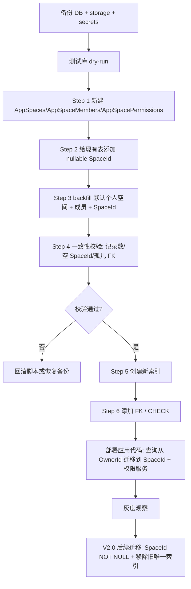

# ADR-04：V2.0 数据库迁移与回滚策略

> 状态：Accepted for V2.0-0 设计冻结<br>
> 日期：2026-07-16<br>
> 负责人：Hermes-DBA（db-dba）<br>
> 适用范围：PrivateCloudDrive V2.0 Space / SpaceMember / SpacePermission 数据底座<br>
> 参考：`docs/v2.0-pre-study.md` §2.2、`docs/release-plan-v2.0.md` §8.1

## 1. 背景与决策

V1.x 文件中心以 `TenantId + OwnerId` 作为个人云盘隔离边界。V2.0 的产品方向是从个人 OwnerId 云盘升级为 Space 云盘，因此数据库必须先提供稳定的空间归属、成员关系、角色权限、空间配额与可回滚迁移路径。

本 ADR 决定：

1. V2.0 首批迁移采用多步前向兼容策略：先新增表和可空 `SpaceId`，完成 backfill 与 dry-run，再逐步改应用查询，最后才把关键 `SpaceId` 收紧为必填。
2. 旧 `OwnerId` 字段不在首个迁移中删除；至少保留一个小版本作为兼容与回滚锚点。
3. 生产迁移必须先做 PostgreSQL dump + 文件存储快照 + `.env/.secrets` 备份，然后在测试库执行完整 dry-run。
4. 回滚分两类：应用级回滚（代码回退但保留新增列/表）优先；结构级回滚只允许在未产生 V2.0 新空间业务写入或已完成数据归档时执行。

## 2. V2.0 DB 迁移总览

### 2.1 新增表

| 表 | 目的 | 关键字段 | 关键约束 / 索引 |
|---|---|---|---|
| `AppSpaces` | 空间聚合根，表达个人/家庭/团队空间 | `Id`, `TenantId`, `OwnerUserId`, `Name`, `NormalizedName`, `SpaceType`, `IsDefaultPersonal`, `QuotaBytes`, `UsedBytesSnapshot`, 审计列 | `PK(Id)`；`UX(TenantId, OwnerUserId, IsDefaultPersonal)`；`IX(TenantId, OwnerUserId)`；`IX(TenantId, NormalizedName)` |
| `AppSpaceMembers` | 空间成员关系与空间内角色 | `Id`, `TenantId`, `SpaceId`, `UserId`, `Role`, `IsDisabled`, `JoinedTime` | `UX(TenantId, SpaceId, UserId)`；`IX(TenantId, UserId, IsDisabled)`；FK 到 `AppSpaces(Id)` |
| `AppSpacePermissions` | 角色到权限名的可审计映射，MVP 可由固定种子初始化 | `Id`, `TenantId`, `SpaceId`, `Role`, `PermissionName`, `IsGranted` | `UX(TenantId, SpaceId, Role, PermissionName)`；`IX(TenantId, SpaceId, Role)`；FK 到 `AppSpaces(Id)` |

角色枚举建议：`Owner=0`、`Admin=1`、`Member=2`、`Viewer=3`。权限名建议先使用字符串常量：`Files.View`、`Files.Upload`、`Files.Edit`、`Files.Delete`、`Files.PermanentDelete`、`Members.Manage`、`Space.Configure`、`Quota.Manage`。

### 2.2 现有表变更

| 表 | 新字段 | 迁移阶段 | 说明 |
|---|---|---|---|
| `AppFileCenterFileNodes` | `SpaceId uuid null` | V2.0-1 先可空，V2.0-2 后收紧 | 文件/文件夹空间归属主字段；根目录唯一约束需从 `OwnerId` 升级到 `SpaceId` |
| `AppFileCenterBlobObjects` | `SpaceId uuid null` | V2.0-1 | 物理对象归属，用于容量、审计和后续跨空间隔离 |
| `AppFileCenterUploadSessions` | `SpaceId uuid null` | V2.0-1 | 断点续传归属，上传前校验空间配额 |
| `AppFileCenterMediaAssets` | `SpaceId uuid null` | V2.0-1 | 媒体库查询按空间裁剪 |
| `AppFileCenterMediaAlbums` | `SpaceId uuid null` | V2.0-1 | 相册归属升级 |
| `AppFileCenterMediaAlbumItems` | `SpaceId uuid null` | V2.0-1 | 相册项冗余空间归属，便于一致性校验和查询 |
| `AppFileCenterFileShares` | `SpaceId uuid null` | V2.0-1 | 外链分享保留 owner，同时记录来源空间 |
| `AppFileCenterFileTags` | `SpaceId uuid null` | V2.0-1 | 标签按空间唯一，而不是只按用户唯一 |
| `AppFileCenterFileNodeTags` | `SpaceId uuid null` | V2.0-1 | 标签关联表空间归属 |
| `AppFileCenterOperationLogs` | `SpaceId uuid null`, `OperatorSpaceRole int null` | V2.0-4 | 审计可按空间筛选并记录操作者当时角色 |

### 2.3 索引变更

| 类型 | 建议 |
|---|---|
| 查询索引 | 为文件主链路新增 `IX_AppFileCenterFileNodes_TenantId_SpaceId_ParentId`、`IX_AppFileCenterFileNodes_TenantId_SpaceId_IsFavorite`；媒体新增 `TenantId + SpaceId + MediaType/TakenAt/ProcessStatus`；分享/标签新增 `TenantId + SpaceId + ...` |
| 唯一约束 | `FileNode` 同级重名从 `OwnerId + ParentId + NormalizedName` 改为 `SpaceId + ParentId + NormalizedName`，保留软删除过滤条件；`FileTag` 从 `TenantId + OwnerId + NormalizedName` 改为 `TenantId + SpaceId + NormalizedName` |
| 外键 | 所有新增 `SpaceId` FK 延后到 backfill 与一致性校验后再加；删除策略默认 `Restrict`，避免误删空间级数据 |
| 兼容索引 | 旧 `OwnerId` 查询索引至少保留到应用层全部切到 `SpaceId` 后的一个版本，避免旧客户端或回滚时性能骤降 |

## 3. Backfill 策略

### 3.1 默认个人空间生成规则

为每个已有用户/Owner 自动生成一个默认个人空间：

| 字段 | 值 |
|---|---|
| `AppSpaces.Id` | 由 `OwnerId` 派生的确定性 UUID，保证脚本可重跑且不重复 |
| `TenantId` | 与该用户历史数据中的 `TenantId` 一致；无租户则为 `NULL` |
| `OwnerUserId` | 原 `OwnerId` |
| `Name` | `个人空间` |
| `NormalizedName` | `PERSONAL-{OwnerId}` |
| `SpaceType` | `0`（Personal） |
| `IsDefaultPersonal` | `true` |
| `QuotaBytes` | 初始为空；后续可由用户级配额迁入 |

### 3.2 数据来源

Backfill 的 owner 集合来自：

1. `AppFileCenterFileNodes.OwnerId`
2. `AppFileCenterBlobObjects.OwnerId`
3. `AppFileCenterUploadSessions.OwnerId`
4. `AppFileCenterMediaAssets.OwnerId`
5. `AppFileCenterMediaAlbums.OwnerId`
6. `AppFileCenterMediaAlbumItems.OwnerId`
7. `AppFileCenterFileShares.OwnerId`
8. `AppFileCenterFileTags.OwnerId`
9. `AppFileCenterFileNodeTags.OwnerId`
10. 可选：`AbpUsers.Id`，用于让没有文件的既有用户也有默认个人空间

### 3.3 Backfill 更新规则

| 表 | 更新规则 |
|---|---|
| `AppFileCenterFileNodes` | `SpaceId = 默认个人空间 Id where SpaceId is null and OwnerId = OwnerUserId and TenantId 等价` |
| `AppFileCenterBlobObjects` | 同上 |
| `AppFileCenterUploadSessions` | 同上；过期 session 也填充，方便审计/清理 |
| `AppFileCenterMediaAssets` | 优先从关联 `FileNode.SpaceId` 回填；无 FileNode 时按 OwnerId 回填 |
| `AppFileCenterMediaAlbums` | 按 OwnerId 回填 |
| `AppFileCenterMediaAlbumItems` | 优先从 `FileNode.SpaceId` 或 `MediaAlbum.SpaceId` 回填，再按 OwnerId 回填 |
| `AppFileCenterFileShares` | 优先从分享目标 `FileNode.SpaceId` 回填，再按 OwnerId 回填 |
| `AppFileCenterFileTags` / `FileNodeTags` | 按 OwnerId 回填；后续业务需按 SpaceId 管理标签 |
| `AppFileCenterOperationLogs` | 优先从 `FileNode.SpaceId` / `MediaAsset.SpaceId` 回填，无法匹配的保留 null 并列为 WARN |

完整 SQL 草案见：`scripts/sql/v2.0-space-migration-postgresql.sql`。

## 4. 迁移顺序编排



### 4.1 为什么要多步迁移

1. 对大表新增非空列会锁表并需要全表重写；先可空、分批 backfill 更安全。
2. 应用代码切换前仍依赖 `OwnerId`；过早删除旧索引会造成性能退化。
3. `SpaceId` 的业务语义依赖权限服务和 Space API；DB 迁移不能与业务发布强绑定在同一个不可回滚步骤中。

### 4.2 推荐发布批次

| 批次 | 内容 | 可回滚性 |
|---|---|---|
| V2.0-DB-A | 新表 + 可空列 + backfill + 兼容索引 | 高；可删除新增表/列或应用忽略它们 |
| V2.0-App-A | 应用写入新数据时同时写 `OwnerId` 与 `SpaceId` | 中；代码可回退，数据保留 |
| V2.0-App-B | 查询路径改为 `SpaceId + SpaceMember` 权限裁剪 | 中；需保留旧 owner 查询开关 |
| V2.0-DB-B | 加 FK、唯一约束，关键表 `SpaceId` 改为 NOT NULL | 低；只在生产验证稳定后执行 |
| V2.0-DB-C | 废弃旧 owner-only 唯一索引，保留字段但不再作为权限边界 | 低；作为后续版本单独 ADR |

## 5. Dry-run 验证方案

### 5.1 测试库准备

1. 从生产或准生产导出 PostgreSQL dump：`pg_dump --format=custom --file=pcd-before-v2-space.dump <db>`。
2. 恢复到隔离测试库，不复用生产 volume。
3. 记录迁移前计数：
   - 文件节点总数、未删除节点数、根节点数
   - BlobObject、UploadSession、MediaAsset、MediaAlbum、FileShare、FileTag、OperationLog 记录数
   - distinct `OwnerId` 数量
   - 旧唯一索引冲突风险（同一 OwnerId 下是否已存在重复 NormalizedName）
4. 执行 `scripts/sql/v2.0-space-migration-postgresql.sql`。
5. 执行 dry-run 清单并保存输出到 `docs/validation/v2.0-space-migration-dry-run-YYYYMMDD.md`。

### 5.2 核心一致性校验 SQL

```sql
-- 1. 每个历史 Owner 至少有一个默认个人空间
WITH owners AS (
  SELECT "TenantId", "OwnerId" FROM "AppFileCenterFileNodes"
  UNION SELECT "TenantId", "OwnerId" FROM "AppFileCenterBlobObjects"
  UNION SELECT "TenantId", "OwnerId" FROM "AppFileCenterUploadSessions"
  UNION SELECT "TenantId", "OwnerId" FROM "AppFileCenterMediaAssets"
  UNION SELECT "TenantId", "OwnerId" FROM "AppFileCenterMediaAlbums"
  UNION SELECT "TenantId", "OwnerId" FROM "AppFileCenterFileShares"
  UNION SELECT "TenantId", "OwnerId" FROM "AppFileCenterFileTags"
)
SELECT count(*) AS missing_default_spaces
FROM owners o
LEFT JOIN "AppSpaces" s ON s."OwnerUserId" = o."OwnerId"
 AND s."IsDefaultPersonal" = true
 AND s."TenantId" IS NOT DISTINCT FROM o."TenantId"
WHERE s."Id" IS NULL;

-- 2. 核心表 SpaceId 空值必须为 0（OperationLogs 可在第一批允许 WARN）
SELECT 'FileNodes' AS table_name, count(*) AS null_space_id FROM "AppFileCenterFileNodes" WHERE "SpaceId" IS NULL
UNION ALL SELECT 'BlobObjects', count(*) FROM "AppFileCenterBlobObjects" WHERE "SpaceId" IS NULL
UNION ALL SELECT 'UploadSessions', count(*) FROM "AppFileCenterUploadSessions" WHERE "SpaceId" IS NULL
UNION ALL SELECT 'MediaAssets', count(*) FROM "AppFileCenterMediaAssets" WHERE "SpaceId" IS NULL
UNION ALL SELECT 'MediaAlbums', count(*) FROM "AppFileCenterMediaAlbums" WHERE "SpaceId" IS NULL
UNION ALL SELECT 'FileShares', count(*) FROM "AppFileCenterFileShares" WHERE "SpaceId" IS NULL
UNION ALL SELECT 'FileTags', count(*) FROM "AppFileCenterFileTags" WHERE "SpaceId" IS NULL;

-- 3. FileNode 记录数迁移前后不应变化；保存 before/after 人工比对
SELECT count(*) AS file_nodes_after FROM "AppFileCenterFileNodes";

-- 4. 新 SpaceId 同级唯一冲突检查，必须为 0
SELECT "TenantId", "SpaceId", "ParentId", "NormalizedName", count(*)
FROM "AppFileCenterFileNodes"
WHERE "IsDeleted" = false
GROUP BY "TenantId", "SpaceId", "ParentId", "NormalizedName"
HAVING count(*) > 1;
```

### 5.3 PASS / WARN / FAIL 口径

| 检查 | PASS | WARN | FAIL |
|---|---|---|---|
| 表记录数 | 核心表 before/after 完全一致 | OperationLog 因历史孤儿记录无法回填 SpaceId | FileNode/BlobObject/Share/Tag 记录丢失或重复 |
| `SpaceId` 空值 | 核心业务表为 0 | OperationLog 存在少量 null 且有解释 | FileNode 或 BlobObject 仍存在 null |
| 默认空间 | 每个 Owner 有且仅有一个默认个人空间 | 没有文件的 AbpUser 未创建空间（若产品接受懒创建） | 有文件 Owner 缺少默认空间 |
| FK | 无孤儿 SpaceId | 历史审计日志可保留 null | FK 添加失败 |
| 唯一索引 | 新唯一索引可创建 | 需要先清理软删除残留 | 同空间同父目录重名冲突 |

## 6. 回滚方案

### 6.1 回滚优先级

1. **应用级回滚（推荐）**：回退应用代码到 V1.x/V2.0-App-A 前版本，DB 新增表/列保留。因为旧代码仍按 `OwnerId` 查询，新增 `SpaceId` 不影响旧路径。
2. **结构级回滚（谨慎）**：仅当 V2.0 应用尚未允许创建非默认空间，或已将 V2.0 新数据导出/归档时执行 `scripts/sql/v2.0-space-rollback-postgresql.sql`。
3. **灾备恢复（最后手段）**：如果数据计数异常或 backfill 错误无法修复，恢复迁移前 DB dump 与文件存储快照。

### 6.2 每一步可回滚性

| 步骤 | 可回滚性 | 回滚方式 | 风险 |
|---|---|---|---|
| 新建 Space 表 | 高 | Drop FK 后 Drop 表 | 会丢失已创建的空间/成员数据 |
| 添加 nullable `SpaceId` | 高 | Drop FK/索引后 Drop Column | 不影响旧 `OwnerId` 数据 |
| Backfill | 中 | 将新增 `SpaceId` 置空或 Drop Column；删除默认空间 | 如果应用已写入 Space-only 数据，不能无损回滚 |
| 新索引 | 高 | Drop Index Concurrently | 无数据风险 |
| 外键 | 高 | Drop Constraint | 无数据风险 |
| `SpaceId NOT NULL` | 中低 | Alter Column Drop Not Null | 需要排查旧代码是否写 null |
| 删除旧 owner-only 索引/字段 | 低 | 重新创建旧索引/字段；字段删除后不可无损恢复 | 不建议在 V2.0 初期执行 |

完整回滚 SQL 草案见：`scripts/sql/v2.0-space-rollback-postgresql.sql`。

## 7. ABP EF Core 迁移注意事项

### 7.1 生成迁移命令

在隔离工作区执行：

```bash
cd aspnet-core
# 安装/恢复 dotnet-ef 后执行；如仓库已有本地工具，优先 dotnet tool restore
dotnet ef migrations add AddedSpaceDataModel \
  --project src/PrivateCloudDrive.EntityFrameworkCore/PrivateCloudDrive.EntityFrameworkCore.csproj \
  --startup-project src/PrivateCloudDrive.HttpApi.Host/PrivateCloudDrive.HttpApi.Host.csproj \
  --context PrivateCloudDrive.EntityFrameworkCore.PrivateCloudDriveDbContext \
  --output-dir Migrations

dotnet ef database update \
  --project src/PrivateCloudDrive.EntityFrameworkCore/PrivateCloudDrive.EntityFrameworkCore.csproj \
  --startup-project src/PrivateCloudDrive.HttpApi.Host/PrivateCloudDrive.HttpApi.Host.csproj \
  --context PrivateCloudDrive.EntityFrameworkCore.PrivateCloudDriveDbContext
```

### 7.2 EF Migration 编写规则

1. 大表字段先 `nullable: true`，不要在同一 migration 中直接设为 `nullable: false`。
2. 数据 backfill 使用 `migrationBuilder.Sql(...)`，并拆分为可审计的多个 SQL 块。
3. PostgreSQL 部分索引要显式写 filter：`"IsDeleted" = false AND "ParentId" IS NULL`。
4. FK 延后添加，避免历史脏数据导致 migration 半途失败。
5. `Down()` 不应假装无损：需要注释说明“若已产生非默认空间数据，Down 会丢失 Space 表数据”。
6. ABP FullAudited 实体新增表必须包含 `ExtraProperties`、`ConcurrencyStamp`、`CreationTime`、`CreatorId`、`LastModificationTime`、`LastModifierId`、`IsDeleted`、`DeleterId`、`DeletionTime` 等约定列。
7. 所有新实体保留 `TenantId` 并实现 `IMultiTenant`；空间成员查询必须始终带 Tenant 过滤。

### 7.3 DbMigrator / 生产环境注意事项

| 项 | 要求 |
|---|---|
| 备份 | `pg_dump` + storage volume snapshot + `.env/.secrets` 同时完成，记录恢复命令 |
| 连接串 | DbMigrator 只连接目标环境数据库，不允许误用开发库连接串 |
| 事务 | 建表/加列/backfill 可在事务内；`CREATE INDEX CONCURRENTLY` 不能在事务内，需独立脚本或避免 concurrent |
| 锁表 | 对大表索引优先使用低峰期；生产可拆成多个 migration/脚本窗口 |
| 幂等性 | SQL 脚本使用 `IF NOT EXISTS`、`ON CONFLICT DO NOTHING`，支持 dry-run 重复执行 |
| 审计 | 迁移日志保存 before/after count、脚本版本、git commit、执行人、开始/结束时间 |

## 8. 下游实施任务建议

| 任务 | 推荐员工 | 交接事项 |
|---|---|---|
| EF 实体与 DbContext 实现 | 后端工程师（backend-eng） | 按本 ADR 新增 `Space`、`SpaceMember`、`SpacePermission` 实体和 migration |
| DbMigrator dry-run 自动化 | 运维工程师（devops-eng） | 将 SQL 校验清单固化为脚本，输出 PASS/WARN/FAIL 报告 |
| 权限服务安全评审 | 安全评审员（security-reviewer） | 检查 `SpaceId` 查询是否可被参数篡改越权 |
| 多用户多空间测试矩阵 | QA 工程师（qa-eng） | 根据 §5.3 与 V2.0 发布计划 SP-15 建测试集 |

## 9. 验收清单

- [ ] `scripts/sql/v2.0-space-migration-postgresql.sql` 可在测试库执行，并生成默认个人空间。
- [ ] `scripts/sql/v2.0-space-rollback-postgresql.sql` 可在未产生 V2.0 新空间写入的测试库执行。
- [ ] dry-run 记录迁移前后核心表记录数一致。
- [ ] 核心业务表 `SpaceId` 空值为 0。
- [ ] 新唯一索引冲突检查为 0。
- [ ] EF Core migration 拆分为“新结构/回填/约束收紧”多个阶段。
- [ ] 生产执行前完成 DB、storage、secrets 三类备份并验证恢复命令。
