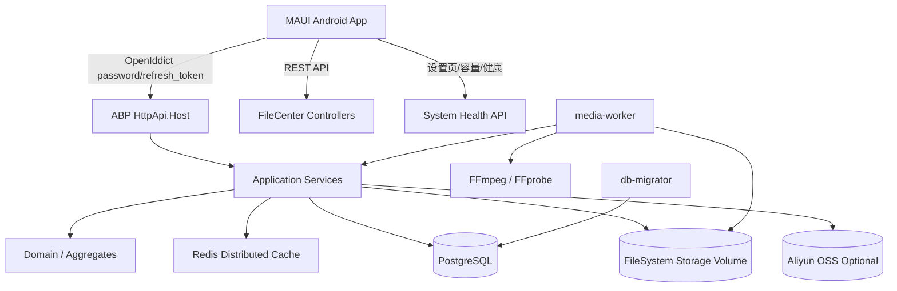

# PrivateCloudDrive V1.0 RC 架构边界与技术债务基线

日期：2026-06-17
负责人：Hermes-Architect
文档定位：V1.0 RC/Productization Sprint 的架构收口规格，用于约束后端、移动端、DevOps 在发布候选阶段“能改什么、不能改什么、必须修什么”。

---

## 1. 架构结论

PrivateCloudDrive 当前架构已具备发布候选基础：

- 后端保持 ABP 标准分层，身份体系继续使用 ABP Identity + OpenIddict，数据库使用 PostgreSQL，分布式缓存使用 Redis。
- 文件中心已覆盖文件/文件夹、上传下载、回收站、分享、标签、收藏、媒体资产、相册、容量和系统健康摘要等核心能力。
- 移动端以 MAUI Android 为主验收目标，现有信息架构覆盖登录、文件、照片、视频、上传、分享、设置、存储健康、日志等入口。
- 部署基线是 Docker Compose：`postgres`、`redis`、`db-migrator`、`api`、`media-worker`，本地文件系统存储卷是默认生产路径；MinIO/OSS 只能作为可选/后置能力，不作为 RC 主链路。

V1.0 RC 不应再引入新的架构平台、协议或重大重构。当前阶段的架构目标不是“更完美”，而是：

> 固定边界、补齐可观测性与发布验证、降低数据安全和部署失败风险。

整体风险等级：中高。

风险来源不是核心技术路线错误，而是发布收口项仍分散在安全、健康检查、构建脚本、部署环境变量、真实设备验收和备份恢复边界中。如果这些项不做基线化，RC 容易变成“功能很多但不可稳定交付”的版本。

---

## 2. 当前架构基线

### 2.1 总体架构

### 2.2 后端基线

| 组件 | 当前基线 | RC 结论 |
|---|---|---|
| 框架 | .NET 10、ABP 10.3.0、EF Core | 保持，不升级大版本 |
| 分层 | Domain.Shared / Domain / Application.Contracts / Application / EntityFrameworkCore / HttpApi / HttpApi.Host | 保持 ABP 分层，不做目录大迁移 |
| 认证 | ABP Identity + OpenIddict，`PrivateCloudDrive_App` public client，password + refresh_token | 保持，不自建 JWT，不绕过 OpenIddict |
| 数据库 | PostgreSQL | 保持，不切 SQL Server/MySQL/SQLite |
| 缓存 | Redis / ABP Distributed Cache | 保持，用于限流、临时票据、健康探针等 |
| 文件存储 | 默认 FileSystem，`FileCenter__StorageRootPath=/app/storage`，Docker volume 持久化 | RC 主路径固定为 FileSystem |
| 对象存储 | Aliyun OSS 有配置和实现迹象；MinIO Compose profile 存在 | 仅作为可选/实验，不作为 RC 必须项 |
| 媒体处理 | `media-worker` + FFmpeg/FFprobe，生成封面/元数据/处理状态 | 保持，不引入 HLS 转码 |
| 健康摘要 | `api/file-center/system-health/summary`，覆盖 API、DB、Redis、Storage、FFmpeg/FFprobe、容量 | 可优化探针准确性，但不替换架构 |

### 2.3 移动端基线

| 组件 | 当前基线 | RC 结论 |
|---|---|---|
| 技术栈 | .NET MAUI，Android 为 RC 主验收目标，Windows 可作为辅助构建目标 | 保持，不引入 Flutter/React Native/原生重写 |
| 认证存储 | SecureStorage 保存 token/server/user，不保存密码 | 保持，重点补充异常和备份边界验收 |
| 信息架构 | Startup/Login、Files、Photos、Videos、Uploads、Shares、Settings、StorageUsage、OperationLogs、MediaAlbums/Processing | 保持现有页面结构，只做文案/状态/错误提示收口 |
| 上传 | 小文件 + 分片上传 + 上传队列 | 保持，不重写传输协议 |
| 媒体体验 | 图片/视频列表、预览、相册、处理状态 | 保持，不做新媒体库架构 |
| 外部登录 | 微信/Google/GitHub 有设置或桥接迹象 | RC 只要求未配置时可降级，不要求全渠道真机闭环 |

### 2.4 部署基线

| 组件 | 当前基线 | RC 结论 |
|---|---|---|
| 编排 | `docker-compose.yml` | 保持 Compose，不引入 Kubernetes/Helm/Nomad |
| 服务 | postgres、redis、db-migrator、api、media-worker | 固定为 RC 标准栈 |
| 存储卷 | postgres data、redis data、storage、minio data | `privateclouddrive_stack_storage` 是必须备份对象 |
| 环境变量 | `.env` + Compose 变量映射 | 必须补齐敏感值、PUBLIC_URL、存储 provider、登录配置说明 |
| 验证脚本 | `scripts/verify-local-stack.ps1`、`scripts/verify-maui-build.sh/.ps1`、`scripts/secret-log-scan.py` | 必须作为 RC 验收入口 |
| 备份恢复 | 已有 `backup-local-stack.ps1`、`restore-local-stack.ps1`、`run-backup-restore-drill.ps1` | 必须文档化演练边界 |

---

## 3. V1.0 RC 架构边界

### 3.1 允许修改：必须服务于发布质量

| 允许项 | 允许范围 | 不允许越界 |
|---|---|---|
| 后端缺陷修复 | 修复鉴权、租户/用户隔离、文件访问控制、审计缺口、错误处理 | 不改变整体身份体系，不新增平行认证系统 |
| 健康检查增强 | 补强 API、DB、Redis、Storage、FFmpeg/FFprobe、环境变量和 Swagger/服务可达性检查 | 不引入新监控平台作为 RC 必需依赖 |
| 部署脚本增强 | 完善 Compose preflight、`.env` 校验、备份恢复演练、日志提示 | 不迁移到 Kubernetes，不重构部署模型 |
| MAUI 构建脚本 | 让 Windows/Android 构建可一键验证，输出明确 PASS/WARN/FAIL | 不做 UI 框架替换或全量导航重写 |
| 移动端可用性修复 | 登录、文件列表、上传下载、预览、删除恢复、分享、设置状态提示 | 不新增大功能，不扩展复杂协作模型 |
| 文档收口 | 发布说明、部署、备份、架构边界、已知限制 | 不把探索设计稿变成 RC 主线 |
| Secret/日志脱敏 | 扫描仓库、CI 输出和用户可见错误，隐藏 token/password/Authorization 等 | 不为脱敏重写日志框架，只做 RC 必要边界 |

### 3.2 允许优化但不允许替换的组件

| 组件 | 可优化 | 不允许替换 |
|---|---|---|
| ABP 分层 | 修正错位代码、补 DTO/接口命名、改 XML 注释顺序 | 不拆成微服务，不重写 Domain/Application 层 |
| OpenIddict | 修复 client 配置、grant 降级、token 刷新、撤销和审计 | 不换 IdentityServer/自研 JWT/第三方 SaaS Auth |
| PostgreSQL | 补迁移、索引、连接串校验、备份说明 | 不切换数据库产品 |
| Redis | 修复限流/缓存/临时票据使用，补连通性探针 | 不引入 MQ 或新缓存中间件作为必需项 |
| FileSystem 存储 | 修复路径、权限、容量和备份提示 | 不把 MinIO/OSS 变成默认主链路 |
| Media Worker | 修复 FFmpeg/FFprobe 可用性和任务状态 | 不引入 HLS/多码率转码流水线 |
| Docker Compose | 补健康检查、环境变量、日志和卷说明 | 不引入 Kubernetes/Helm |
| MAUI Android | 修复主链路、真机兼容、弱网/错误态 | 不迁移技术栈，不重做 Design System |

### 3.3 V1.0 RC 明确不做

| 不做项 | 原因 | 后置版本 |
|---|---|---|
| 微服务拆分 | 当前单体 ABP 更利于 RC 收口；拆分会放大部署和事务复杂度 | V2+，且需明确团队和运维能力 |
| 自研身份系统或自定义 JWT | OpenIddict 已能覆盖移动 token 生命周期；自研会增加安全风险 | 不建议 |
| 更换数据库 | PostgreSQL 已进入 Compose、迁移和代码基线 | 不进入 RC |
| 默认 MinIO/S3/OSS 多后端切换 | 对象存储会引入一致性、迁移、凭据、备份/回滚问题 | V1.3/V2 规划 |
| HLS/低清转码 | 媒体体验增强价值明确，但会引入任务队列、存储膨胀、清理策略 | V1.2/V2 后续增强 |
| 桌面同步客户端 | 数据一致性、冲突解决和离线策略成本高 | V2 候选 |
| 家庭空间/团队空间/文件夹级权限 | 权限模型会显著改变数据访问边界 | V2 候选 |
| AI 相册/AI 搜索/人脸识别 | 不影响 RC 发布可信度，会引入隐私和算力风险 | V2 候选 |
| 企业网盘/审批流/复杂组织架构 | 偏离个人/家庭/小团队定位 | 不进入当前路线 |
| NAS OS/RAID/SMB/NFS | 产品心智从“移动优先私有云盘”转向 NAS OS | 不进入当前路线 |
| 大规模 UI 风格重做 | RC 应优先稳定、清晰、可验收 | 设计探索池 |

---

## 4. 发布质量技术债务评分

评分规则：

- P0：阻塞 RC 发布或存在数据/安全/部署高风险，必须修复或明确降级。
- P1：不一定阻塞 RC，但会显著影响发布可信度，需要在 RC 前完成或写入已知限制。
- P2：后续可优化，不阻塞 RC。

| 编号 | 技术债务 | 优先级 | 影响范围 | 当前证据/判断 | RC 处理建议 |
|---|---|---|---|---|---|
| TD-01 | Secret 扫描与日志脱敏需要纳入发布门禁 | P0 | 安全、CI、公开仓库、支持排障 | 已有 `scripts/secret-log-scan.py`，但需确保作为 RC 验收入口执行；Compose 中存在多个 secret/env 映射，用户可见日志不能泄露 | 建立必跑命令，扫描 working tree 与发布包；失败时只输出 path/line/rule，不输出值 |
| TD-02 | Docker `.env` 与生产敏感值仍可能使用默认值 | P0 | 部署、安全、OpenIddict、数据库 | `docker-compose.yml` 默认值含 `privateclouddrive`、`change-this-32-character-secret`；`verify-local-stack.ps1` 已能 WARN | RC 文档要求复制 `.env.example` 后替换 `POSTGRES_PASSWORD`、`STRING_ENCRYPTION_PASSPHRASE`、`PUBLIC_URL` 等；默认值只允许本地验证 |
| TD-03 | 健康检查覆盖存在“配置存在”与“真实可执行”差距 | P0 | 部署、媒体处理、移动设置页 | AppService 对 FFmpeg/FFprobe 主要检查路径是否配置；Compose 脚本用 `command -v` 验证容器内命令 | 后端/脚本都应输出可观测结果；至少 RC 验收以 `verify-local-stack.ps1` 的容器级检查为准 |
| TD-04 | Storage 持久化与备份恢复边界必须显式写入发布文档 | P0 | 数据安全、升级回滚、用户信任 | Compose 使用 `privateclouddrive_stack_storage`；SystemHealthDto 已提示数据库、文件存储、部署密钥都需备份 | RC 发布前必须演练或至少记录 DB + storage + `.env/.secrets` 的备份恢复 SOP |
| TD-05 | OpenIddict / 外部登录降级边界需要固定 | P0 | 登录可用性、安全、移动端 UX | 账号密码是主链路；微信/Google/GitHub 配置存在但不应阻塞；规划文档要求未配置时隐藏/禁用 | RC 必须保证未配置外部登录时账号密码和 refresh token 可用；外部登录只作为可选能力 |
| TD-06 | MAUI Android 真机主链路验收不足 | P0 | 产品可发布性、移动端主场景 | 路线图明确要求 Android 真机登录、浏览、上传、下载、预览、删除、恢复 | QA 需输出真实设备记录；架构层不接受仅模拟器通过作为 RC 证据 |
| TD-07 | MAUI 构建脚本存在但需要纳入标准验收 | P1 | 构建/CI、发布可重复性 | `scripts/verify-maui-build.sh/.ps1` 已存在，支持 Windows/Android 顺序构建 | RC 验收清单固定执行脚本，并保存 PASS/WARN/FAIL 摘要 |
| TD-08 | ABP 代码组织整体正确，但仍需防止 RC 阶段越层修复 | P1 | 可维护性、后续扩展 | `docs/abp-code-organization-plan.md` 已定义分层约定和若干规范问题 | RC 修复必须按既有分层放置，不做大目录迁移；新增接口/DTO/服务按约定落位 |
| TD-09 | 审计日志完整性需覆盖关键文件与登录行为 | P1 | 安全、排障、合规 | 代码中有 OperationLogsAppService、MobileAuthAuditLog、ABP AuditLog 汇总 | RC 需验证登录失败、刷新失败、分享、删除/恢复、上传/下载关键行为可追踪；缺口列入已知限制或修复 |
| TD-10 | OSS/MinIO/多存储后端边界需明确 | P1 | 数据一致性、部署复杂度、备份恢复 | Compose 有 MinIO profile，应用有 AliyunOss 配置；但默认 FileSystem 是最稳主链路 | RC 发布说明声明对象存储为可选/实验或高级配置，不作为普通用户默认路径 |
| TD-11 | Swagger/公网暴露策略需明确 | P1 | 安全、部署 | Compose 默认 `Swagger__Enabled=true` 便于本地验证 | RC 文档要求生产或公网部署评估关闭 Swagger 或仅内网访问 |
| TD-12 | 媒体处理任务的失败可见性仍需验证 | P2 | 媒体库体验、排障 | 存在 MediaProcessingStatus 页面和处理状态模型 | 不阻塞文件云盘主链路；作为媒体体验已知限制或后续增强 |

---

## 5. 必修复项规格描述

### RC-FIX-01：发布门禁 Secret/日志扫描

推荐负责人：devops-eng + backend-eng

风险等级：P0

目标：确保 RC 前不会把本地 `.env`、私钥、Authorization、token、password、access key、refresh token 等敏感值提交、打包或打印到 CI/日志。

范围：

- 固定执行 `python scripts/secret-log-scan.py --include-working-tree` 或等价命令。
- 扫描 tracked files、working tree、发布包中的文本文件。
- 允许 `.env.example`、placeholder、`<redacted>` 等模板值。
- 失败输出只包含 path、line、rule，不打印命中的 secret 值。

验收标准：

- 工作区扫描通过或仅存在明确 allowlist。
- 扫描失败时不泄露实际 secret。
- Release Notes 或部署文档中说明“不要提交 `.env` 和 `.secrets`”。

回滚方案：

- 如果规则误报阻塞 RC，可临时添加精确 allowlist 注释/规则；不得关闭整项扫描。

### RC-FIX-02：Docker 本地栈与环境变量健康验收

推荐负责人：devops-eng

风险等级：P0

目标：把 Compose 配置、服务启动、API、DB、Redis、Storage、FFmpeg/FFprobe、关键环境变量统一纳入一条 RC 验证路径。

范围：

- 使用 `scripts/verify-local-stack.ps1` 作为 Windows 主入口。
- 校验 Docker CLI、Compose config、必需服务定义、`.env`、QA 测试账号、Compose up、服务健康、Swagger、storage 可写、FFmpeg/FFprobe 可用。
- 对缺失 `.env`、默认密码、本地 `PUBLIC_URL` 输出 WARN；对服务缺失和不可用输出 FAIL。

验收标准：

- 本地干净栈能执行并输出 PASS/WARN/FAIL 摘要。
- FAIL 为 0；WARN 必须逐项解释是否可接受。
- `privateclouddrive_stack_storage` 被明确标记为不可丢失数据卷。

回滚方案：

- 如果脚本改动导致误判，可回退脚本改动；保留手工 `docker compose config`、`docker compose up -d --build`、Swagger 200、容器内 `ffmpeg/ffprobe` 校验作为临时验收。

### RC-FIX-03：健康摘要探针准确性补强

推荐负责人：backend-eng

风险等级：P0

目标：确保移动端/设置页展示的系统健康不是“配置存在即健康”，而是能反映真实可用性，同时不泄露物理路径、密钥或内部连接串。

范围：

- 保持 `api/file-center/system-health/summary` 当前契约，不做破坏性 DTO 改名。
- DB：至少执行轻量查询或依赖当前 repository 查询异常判断。
- Redis：保留写入/读取/删除探针。
- Storage：本地存储检查路径存在/可写/磁盘空间；对象存储只展示 provider 与安全描述，不泄露 bucket/key。
- FFmpeg/FFprobe：从“路径已配置”升级为“可执行命令可调用”或通过部署脚本做权威检查，并在 DTO/Diagnostics 中区分 configured/available。

验收标准：

- 未登录用户不能读取敏感健康信息。
- 已授权用户可看到安全脱敏后的健康摘要。
- 故障场景至少能区分 Storage 不可写、Redis 不可用、FFmpeg 缺失。

回滚方案：

- 保持 DTO 向后兼容；如可执行探针在某些平台误判，可先降级为 Degraded + Diagnostics，避免阻断 API 主链路。

### RC-FIX-04：账号密码主链路与外部登录降级

推荐负责人：backend-eng + mobile-eng + security-reviewer

风险等级：P0

目标：确保微信/Google/GitHub 未配置、配置错误或不可达时，不影响账号密码登录、refresh token、退出登录和管理员入口。

范围：

- 账号密码登录继续走 `/connect/token` password grant。
- Refresh token 继续走 OpenIddict 标准 refresh_token grant。
- 外部登录 provider 的 Enabled=false 或缺少配置时，移动端隐藏或禁用入口。
- 登录失败、锁定、禁用、刷新失败必须给出可理解且不泄露内部异常的错误信息。
- 审计日志记录登录、刷新失败、绑定/解绑等行为。

验收标准：

- 不配置任何外部登录时，管理员和普通用户账号密码可登录并刷新 token。
- 外部登录配置错误不影响账号密码主链路。
- 日志不打印 token、Authorization、密码和第三方 access token。

回滚方案：

- 如外部登录影响主链路，RC 中直接关闭外部登录入口和相关配置，保留账号密码为唯一可验收路径。

### RC-FIX-05：备份/恢复和存储迁移边界文档化

推荐负责人：devops-eng + pm

风险等级：P0

目标：让用户清楚哪些数据必须备份，升级/回滚前要做什么，FileSystem 与 OSS/MinIO 的边界是什么。

范围：

- 文档明确必须同时备份：PostgreSQL 数据、storage volume、`.env`、`.secrets` 或等价密钥配置。
- 明确手机本地缓存和 SecureStorage 不能替代服务器备份。
- 明确 FileSystem 是 RC 推荐路径；OSS/MinIO 不作为默认迁移目标。
- 明确恢复演练命令或手工步骤。

验收标准：

- 新用户按文档能知道“哪个 Docker volume 丢了会丢文件”。
- 升级前检查清单包含备份步骤。
- Release Notes 写入已知限制：对象存储迁移/回滚不作为 RC 保证能力。

回滚方案：

- 如果恢复脚本在某环境不可用，至少保留手工备份/恢复 SOP；不得删除风险提示。

---

## 6. 后续协作建议

| 下游岗位/profile | 事项 | 优先级 | 交付物 |
|---|---|---|---|
| 丁 DevOps / devops-eng | 固化本地栈验证、环境变量检查、备份恢复演练和 release 前命令清单 | P0 | `scripts/verify-local-stack.ps1` 输出证据、部署/备份文档更新 |
| 包后端 / backend-eng | 补强系统健康探针、审计覆盖和外部登录降级后端契约 | P0 | 健康接口测试、审计用例、OpenIddict 降级验证 |
| 安安全 / security-reviewer | 复核 secret 扫描、日志脱敏、文件访问控制和分享边界 | P0 | 安全复核报告/阻塞项列表 |
| 莫移动 / mobile-eng | Android 真机主链路、外部登录未配置降级、设置页健康信息展示 | P0 | 真机验收记录、截图/日志、失败用例 |
| 齐 QA / qa-eng | 汇总 RC 验收矩阵，区分 PASS/WARN/FAIL/已知限制 | P1 | `docs/testing` 或验证报告 |

---

## 7. RC 验收标准

V1.0 RC 架构边界验收必须满足：

1. 架构边界
   - ABP 单体分层保持不变。
   - OpenIddict 保持唯一 token 签发体系。
   - FileSystem 存储作为默认主链路。
   - Docker Compose 作为唯一 RC 部署基线。

2. 不做清单
   - 未引入微服务、Kubernetes、数据库替换、自研 JWT、HLS 转码、桌面同步、家庭空间/团队空间、AI 搜索等重大复杂度。

3. 安全
   - secret/log 扫描通过。
   - 用户可见错误和 CI 输出不泄露 token/password/Authorization/secret。
   - 文件、分享、日志接口保留鉴权与当前用户/租户边界。

4. 健康与部署
   - 本地栈验证脚本 FAIL=0。
   - API、DB、Redis、Storage、FFmpeg/FFprobe 有可观测证据。
   - 存储卷和备份恢复边界写入发布文档。

5. 移动端
   - Android 真机完成登录、浏览、上传、下载、预览、删除、恢复、分享、设置健康查看的主链路验证。
   - 外部登录未配置时不影响账号密码登录。

6. 技术债务
   - P0 项必须修复或明确降级并写入 Release Notes。
   - P1 项必须完成或作为已知限制进入 RC 说明。
   - P2 项不得阻塞 RC，不得借机扩大架构范围。

---

## 8. 高风险变更回滚原则

V1.0 RC 所有高风险修复都必须保留回滚路径：

- 身份认证相关：优先通过配置关闭外部登录，回到账号密码 + refresh token 主链路。
- 健康检查相关：DTO 保持兼容，探针失败可降级为 Degraded，不得让设置页影响文件主链路。
- 存储相关：不得在 RC 中自动迁移用户文件；任何 OSS/MinIO 切换都必须手动、可回滚、有备份。
- 部署脚本相关：脚本误判可回退脚本，但不能取消手工验证标准。
- 移动端相关：UI 修复不得破坏已有导航和文件主链路；外部登录入口可隐藏。

---

## 9. 最终建议

推荐方案：以“冻结架构 + 修 P0 发布债 + 文档化边界”为 V1.0 RC 策略。

替代方案：如果团队无法在当前 Sprint 内完成全部 P0，则允许缩小 RC 范围：

- 外部登录全部作为已知限制关闭；
- OSS/MinIO 仅保留开发/高级配置说明，不进入普通部署；
- 媒体处理失败状态作为已知限制；
- 但账号密码登录、文件主链路、Docker 栈、secret 扫描、备份边界不能降级。

不推荐方案：继续新增功能或做架构替换。这会增加发布风险，并偏离当前产品化阶段“可稳定交付”的目标。
