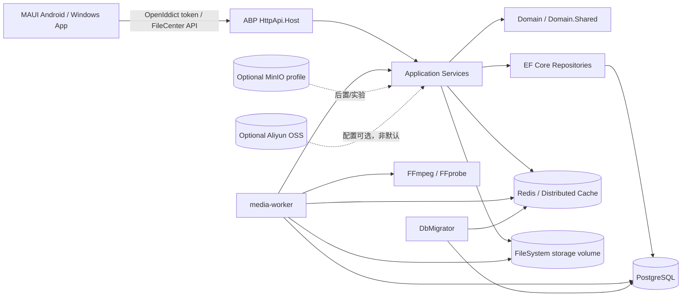

# V1.0 RC 架构边界与技术债务基线评估

日期：2026-06-17
负责人：Hermes-Architect
适用范围：PrivateCloudDrive V1.0 RC / Productization Sprint 收口阶段

## 1. 架构结论

PrivateCloudDrive 当前架构已经具备 V1.0 RC 发布候选的基本骨架：后端保持 ABP 标准分层，认证继续基于 ABP Identity + OpenIddict，数据层使用 PostgreSQL，分布式缓存/限流/临时票据依赖 Redis，文件中心以本地 FileSystem volume 为默认存储，MAUI Android/Windows 客户端已围绕“文件、相册、上传/备份、我的”形成移动优先信息架构，Docker Compose 已包含 API、DbMigrator、media-worker、PostgreSQL、Redis 与可选 MinIO profile。

V1.0 RC 的架构策略应是“冻结主干、补齐发布可信度”，而不是继续做平台化重构。允许做的变更必须服务于发布质量：安全边界、健康检查、构建脚本化、部署/备份恢复、真实设备验收和错误脱敏。不允许在 RC 阶段替换认证体系、存储抽象、ABP 分层、移动端导航主结构或 Compose 拓扑。

风险等级：中高。主要风险不在“架构选型错误”，而在“已经具备能力但发布证据不足”：secret/日志泄漏门禁、生产配置 fail-fast、健康检查深度、MAUI 构建与真机验收、存储迁移/备份恢复边界仍需要以 P0/P1 任务收口。

## 2. 当前架构基线

### 2.1 后端基线

| 组件 | 当前基线 | RC 结论 |
|---|---|---|
| 应用框架 | ABP 分层：Domain.Shared、Domain、Application.Contracts、Application、EntityFrameworkCore、HttpApi、HttpApi.Host | 保持，不做分层重构 |
| 认证授权 | ABP Identity + OpenIddict；账号密码与 refresh token 是主链路；WeChat/Google/GitHub 是可选外部登录 | 保持 OpenIddict，不自建 JWT，不绕过 token endpoint |
| 数据库 | PostgreSQL；DbMigrator 负责迁移和 OpenIddict client seed | 保持，RC 聚焦迁移可重复性和配置 guard |
| 缓存/限流 | Redis / ABP Distributed Cache；登录限流、外部登录票据、WeChat/Google/GitHub 限流依赖 Redis | 保持，必须纳入健康检查和 Compose 验证 |
| 存储层 | 默认 FileSystem volume；已有 Aliyun OSS 配置路径；MinIO 仅作为 compose profile | RC 默认 FileSystem；OSS 允许文档化和烟测，不允许迁移为默认存储 |
| 媒体处理 | media-worker 执行后台任务；镜像提供 FFmpeg/FFprobe；API 侧关闭后台任务执行 | 保持 worker 分离，RC 只补可观测性和失败诊断 |
| 安全边界 | Swagger/HTTP/local validation 通过环境变量控制；secret/log scan 已有脚本与 CI 迹象 | RC 必须把门禁证据纳入发布 checklist |

### 2.2 移动端基线

| 组件 | 当前基线 | RC 结论 |
|---|---|---|
| 技术栈 | .NET MAUI App；Android/Windows 可构建，Android 真机仍需发布验收记录 | 保持 MAUI，不切换 Flutter/React Native/UniApp |
| 导航结构 | Shell TabBar：文件、相册、创建/上传入口、备份、我的 | 保持当前 IA，只允许文案和状态反馈优化 |
| 登录 | OpenIddict token endpoint + SecureStorage；外部登录可选 | 账号密码必须始终可用；外部登录不可配置时必须降级隐藏/禁用 |
| 上传/备份 | UploadQueue、分片上传、上传会话契约已有代码与验证脚本 | 不改上传协议主契约；只允许修复失败重试、可见错误、队列稳定性 |
| 用户可见安全 | 已有错误脱敏与私有地址隐藏相关代码迹象 | RC 必须验证日志、Toast、异常页不暴露 token、secret、私有地址 |

### 2.3 部署基线

| 组件 | 当前基线 | RC 结论 |
|---|---|---|
| Compose 服务 | postgres、redis、db-migrator、api、media-worker、可选 minio | 保持，不引入 Kubernetes、Helm、外部网关依赖 |
| 持久化卷 | postgres data、redis data、FileCenter storage、MinIO data | 必须明确备份范围；storage volume 不可被重建脚本误删 |
| 环境变量 | PUBLIC_URL、AuthServer、Swagger、Security、StorageProvider、OSS、外部登录等 | RC 要做生产/本地配置分层校验，不能打印 secret |
| 验证脚本 | verify-local-stack.ps1、verify-maui-build.ps1、secret-log-scan.py、backup/restore drill 脚本 | RC 必须统一为发布前 checklist，不再靠人工记忆 |

## 3. V1.0 RC 架构图

## 4. V1.0 RC 修改允许列表

### 4.1 允许修改且建议优先做

| 范围 | 允许动作 | 边界 |
|---|---|---|
| 安全门禁 | 补齐 secret/log scan、release archive guard、脱敏证据、生产默认配置 fail-fast | 不输出匹配 secret 值；不把本地 `.env`、`.secrets` 纳入 Git |
| 健康检查 | 增强 API/DB/Redis/Storage/FFmpeg/FFprobe/OpenIddict Issuer 检查；统一脚本输出 PASS/WARN/FAIL 和修复建议 | 不引入 Prometheus/Grafana 等新观测平台 |
| Compose 验证 | 维护 `scripts/verify-local-stack.ps1` 和 preflight/full 模式；补全 storage volume 与 media-worker 检查 | 不改变现有服务拓扑 |
| MAUI 构建 | 维护 `scripts/verify-maui-build.ps1`，让 Android/Windows 构建命令可重复执行 | 不重写客户端框架，不调整主导航结构 |
| 登录降级 | 外部登录未配置时隐藏或禁用入口；账号密码始终可用；错误提示脱敏 | 不把 WeChat/Google/GitHub 变成 RC 阻塞主链路 |
| 存储文档 | 明确 FileSystem/OSS/MinIO 边界、备份、迁移、回滚和 volume 风险 | 不在 RC 默认切换到 OSS/MinIO |
| 审计日志 | 校验登录、刷新失败、退出、绑定/解绑、分享、文件操作日志完整性 | 不做复杂审计查询平台；先保证关键事件可追踪 |
| 发布证据 | 产出 Docker 栈、MAUI 构建、真机、secret scan、备份恢复 dry-run 的脱敏证据 | 不把原始 logcat、token、内网地址、密码写入公开文档 |

### 4.2 允许优化但不允许替换

| 组件 | 允许优化 | 不允许替换 |
|---|---|---|
| ABP 分层 | 调整错位类、补 XML 注释顺序、补 DTO/Contract 命名一致性 | 不拆成微服务，不改为非 ABP 架构 |
| OpenIddict | 补 client seed、issuer 配置校验、移动端 refresh token 体验 | 不自建认证服务，不手写 JWT 签发 |
| PostgreSQL | 补迁移验证、连接字符串 guard、备份恢复演练 | 不切换 SQL Server/MySQL，不引入多数据库适配 |
| Redis | 补健康探针、限流缓存验证、失败降级说明 | 不替换为内存缓存作为生产默认 |
| FileSystem storage | 补路径校验、磁盘空间提示、备份恢复脚本 | 不把对象存储作为 RC 默认 |
| MAUI UI | 优化状态文案、错误态、弱网态、设置页入口 | 不做全新视觉体系或主 IA 重构 |
| Docker Compose | 补校验脚本和环境变量说明 | 不迁移到 K8s/Swarm/Helm |

## 5. V1.0 RC 明确不做列表

| 不做项 | 原因 | 后置版本建议 |
|---|---|---|
| 微服务拆分 / 模块服务化 | 当前单体 ABP 足够支撑个人/家庭/小团队云盘；拆分会放大发布和调试复杂度 | V2 以后再评估 |
| 替换 ABP / OpenIddict / Identity | 认证和权限是高风险区域，当前设计已有明确基线 | 不建议替换；只做配置和安全收口 |
| 默认切换 MinIO / OSS 多后端 | 迁移、一致性、权限、备份、回滚风险高 | V1.3/V2 做迁移工具和管理页后再考虑 |
| HLS 转码 / 多码率视频 | 计算资源、队列、存储成本和播放策略复杂 | V1.2/V2 媒体增强候选 |
| AI 相册 / 语义搜索 / 人脸聚类 | 偏离 RC 发布质量目标，且带来隐私与算力风险 | V2 候选 |
| 桌面同步客户端 | 文件一致性、冲突解决、增量同步成本高 | 备份/灾备成熟后再立项 |
| 企业组织架构 / 审批流 / 复杂权限 | 当前定位不是企业协同网盘 | V2 小团队版再评估 |
| NAS OS / RAID / SMB/NFS | 会把产品拖向操作系统和协议平台 | 不纳入当前产品线 |
| 新 UI 风格大改 | RC 需要稳定、清晰、可验收；大改会破坏测试基线 | 单独设计 sprint |
| 多租户商业化隔离增强 | 当前重点是个人/家庭私有部署；多租户会放大授权和数据隔离验证量 | V2 或商业版再评估 |

## 6. 技术债务评分基线

评分口径：P0 = 阻塞或高概率影响 RC 发布质量；P1 = 不阻塞发布但必须进入 RC checklist 或短期修复；P2 = 可后置但需要记录边界，避免误判为已完成。

| 编号 | 技术债 | 等级 | 影响范围 | 证据/现状 | 推荐处理 |
|---|---|---|---|---|---|
| TD-01 | secret 与公开日志泄漏门禁需要成为发布硬门禁 | P0 | 安全、开源发布、用户信任 | 已有 `scripts/secret-log-scan.py` 与安全评审文档，但需纳入 RC 必跑清单 | devops-eng 负责 CI/本地门禁；security-reviewer 复核规则 |
| TD-02 | 生产配置默认值与 fail-fast 边界需复验 | P0 | 部署、安全、认证 | Compose 含 `change-this-32-character-secret`、Swagger/local validation 开关；文档要求生产替换 | backend-eng/devops-eng 确保生产模式对模板 secret、HTTP issuer、Swagger 暴露 fail-fast |
| TD-03 | Docker 健康检查需要覆盖 API/DB/Redis/Storage/FFmpeg/OpenIddict Issuer | P0 | 部署、排障、发布验收 | 已有 `verify-local-stack.ps1` 和 `FileCenterSystemHealthAppService`，但应统一 RC 输出标准 | devops-eng 主导脚本；backend-eng 补 API 侧缺口 |
| TD-04 | MAUI Android 真机主链路验收不足 | P0 | 移动端发布、用户体验 | 路线图多次标记真机验收为 RC 必需 | mobile-eng/qa-eng 记录登录、上传、下载、预览、删除、恢复、分享、媒体库 |
| TD-05 | MAUI 构建脚本化和平台差异证据不足 | P0 | 构建、交付稳定性 | 已有 `scripts/verify-maui-build.ps1`，需作为发布门禁运行并沉淀结果 | devops-eng + mobile-eng 补 Android/Windows 构建证据 |
| TD-06 | 存储备份/恢复与 OSS 切换边界需更严格标注 | P1 | 数据安全、灾备、运维 | `docs/deployment.md` 已说明 DB/storage/.env；OSS 不自动迁移 | devops-eng 维护 backup/restore drill；backend-eng 避免无迁移切换 provider |
| TD-07 | ABP XML 注释/Attribute 顺序规范债 | P1 | API 文档、可维护性 | `docs/abp-code-organization-plan.md` 已识别多处问题 | backend-eng 批量修复，不改变业务逻辑 |
| TD-08 | 外部登录降级与状态可见性仍需验收 | P1 | 登录体验、安全 | auth-design 要求账号密码始终可用，外部登录可选 | backend-eng/mobile-eng 验证未配置、配置错误、网络失败三类场景 |
| TD-09 | 审计日志完整性需要覆盖关键安全事件 | P1 | 安全审计、排障 | auth-design 要求登录、刷新失败、退出、绑定/解绑审计 | backend-eng/security-reviewer 列表化事件与测试覆盖 |
| TD-10 | 媒体处理失败状态与 worker 可观测性不足 | P1 | 媒体体验、排障 | media-worker 已分离，设置页/状态页已有基础模型 | backend-eng 补失败诊断；mobile-eng 显示用户可理解状态 |
| TD-11 | MinIO profile 容易被误解为正式多存储能力 | P2 | 部署预期、支持成本 | Compose 已包含 optional MinIO，但默认 FileSystem | 文档继续标记“后置/可选实验”，RC 不承诺支持 |
| TD-12 | HLS/低清预览未实现 | P2 | 大视频体验 | 路线图列为后续媒体增强 | 后置 V1.2/V2，不进入 RC |

## 7. 必修复项规格描述

### RC-FIX-01：发布前 secret/log scan 硬门禁

- 负责人建议：devops-eng；复核：security-reviewer。
- 目标：任何进入 RC 发布证据、文档、脚本、工作流的内容都不得包含真实 token、密码、私钥、本地 `.env`、原始 logcat 敏感片段或私有地址。
- 范围：`docs/`、`scripts/`、`.github/`、release archive path guard、工作区新增公开证据。
- 验收：
  - `python scripts/secret-log-scan.py --include-working-tree --archive-ref HEAD` 返回 0 findings。
  - `git ls-files -- .env .env.secret .secrets` 无跟踪结果。
  - 失败输出只给路径/规则/脱敏摘要，不打印 secret 值。
- 回滚：若误杀阻塞发布，只能缩小规则或白名单明显 placeholder，不允许删除门禁后裸奔发布。

### RC-FIX-02：本地栈/生产配置 preflight 标准化

- 负责人建议：devops-eng；协作：backend-eng。
- 目标：一条命令明确区分 PASS/WARN/FAIL，覆盖 Docker、Compose、PUBLIC_URL、AuthServer issuer、Swagger、安全开关、PostgreSQL、Redis、storage volume、media-worker、FFmpeg/FFprobe。
- 范围：`scripts/verify-local-stack.ps1`、`docs/deployment.md`、必要的后端健康摘要接口。
- 验收：
  - preflight 不启动服务也能识别缺失 `.env`、模板 secret、localhost PUBLIC_URL、生产不应开启 Swagger/HTTP 的风险。
  - full mode 能确认 postgres/redis healthy、db-migrator success、api/swagger、storage writable、media-worker running、ffmpeg/ffprobe available。
  - 输出不得包含密码、AccessKey、token。
- 回滚：保留当前 compose 文件；若新脚本误判，只回滚脚本规则，不改服务拓扑。

### RC-FIX-03：MAUI Android/Windows 构建与 Android 真机主链路证据

- 负责人建议：mobile-eng；协作：devops-eng、qa-eng。
- 目标：把“能构建”和“能在真实设备完成主链路”从口头状态变成可复查证据。
- 范围：`scripts/verify-maui-build.ps1`、Android 真机测试记录、`docs/testing.md`。
- 验收：
  - Windows/Android 构建脚本能在目标机器执行并记录版本、SDK、命令、结果。
  - Android 真机完成：登录、浏览、上传、下载、预览、删除、恢复、分享、媒体库/相册、上传失败重试或暂停。
  - 截图/日志证据必须脱敏，不暴露服务私有地址、token、真实文件隐私内容。
- 回滚：若某平台构建阻塞，RC 发布说明明确限制平台，不临时切换技术栈。

### RC-FIX-04：账号密码主链路与外部登录降级验收

- 负责人建议：backend-eng + mobile-eng；复核：security-reviewer。
- 目标：WeChat/Google/GitHub 无配置、配置错误、第三方不可达时，不影响账号密码登录、refresh token、退出登录和本地 SecureStorage 清理。
- 范围：OpenIddict client seed、外部登录 settings API、MAUI 登录页/设置页、错误提示与日志。
- 验收：
  - `WECHAT_ENABLED=false`、`GOOGLE_LOGIN_ENABLED=false`、`GITHUB_LOGIN_ENABLED=false` 时，外部登录入口隐藏或禁用，账号密码登录可完成。
  - 外部登录失败不把 provider secret、authorization code、token、私有 URL 输出到 UI 或日志。
  - 刷新失败会清理本地 token 并回到登录页。
- 回滚：保留账号密码登录；必要时临时关闭外部登录开关，不改认证主链路。

### RC-FIX-05：备份恢复与存储切换边界冻结

- 负责人建议：devops-eng；协作：backend-eng。
- 目标：RC 明确最小可恢复资产：PostgreSQL、FileCenter storage volume、实例 `.env`；OSS/MinIO 仅作为可选能力，不作为默认迁移目标。
- 范围：`docs/deployment.md`、`docs/disaster-recovery.md`、backup/restore 脚本、发布说明。
- 验收：
  - backup/restore dry-run 生成脱敏报告，明确 `.env` 是否包含、storage volume 名、恢复目标和破坏性步骤。
  - 文档明确：Aliyun OSS 不自动迁移历史本地文件；MinIO profile 不等于 RC 支持的多存储管理能力。
  - 恢复后至少验证登录、文件列表、下载/预览、媒体缩略图、回收站、分享链接。
- 回滚：若 OSS/MinIO 验收不足，发布说明标记为实验/后置，不影响 FileSystem 默认发布。

## 8. 推荐协作任务拆分

| 任务 | 建议员工 | 输入 | 输出 |
|---|---|---|---|
| RC 安全门禁复核 | 安全评审员 / security-reviewer | 本文 TD-01、RC-FIX-01 | secret/log scan 规则复核和发布前 PASS 证据 |
| RC 本地栈验证闭环 | DevOps 工程师 / devops-eng | TD-02、TD-03、RC-FIX-02 | `verify-local-stack.ps1` preflight/full PASS 证据 |
| RC 后端健康与登录降级 | 后端工程师 / backend-eng | TD-03、TD-08、TD-09、RC-FIX-04 | API/DB/Redis/Storage/FFmpeg/OpenIddict/审计测试覆盖 |
| RC MAUI 构建与真机验收 | 移动端工程师 / mobile-eng + QA 工程师 / qa-eng | TD-04、TD-05、RC-FIX-03 | Android/Windows 构建证据与真机主链路测试记录 |
| RC 灾备/存储边界验收 | DevOps 工程师 / devops-eng | TD-06、RC-FIX-05 | backup/restore dry-run 报告与 OSS/MinIO 后置说明 |

## 9. 验收标准

V1.0 RC 架构边界验收必须满足：

1. ABP、OpenIddict、PostgreSQL、Redis、FileSystem storage、MAUI、Docker Compose 主架构不被替换。
2. 本文第 4 节允许列表成为 RC 开发的变更边界；第 5 节不做列表进入 release notes 或 planning hub 引用。
3. P0 技术债 TD-01 至 TD-05 均有负责人、命令或真机验收证据；未完成时不得标记 RC 可发布。
4. P1 技术债至少有明确 owner、影响范围和后置/修复策略；P2 明确不阻塞发布但不能宣传为已完成能力。
5. devops-eng/backend-eng/mobile-eng/qa-eng/security-reviewer 的下游任务均可直接依据第 7、8 节开工，不需要重新解释架构边界。

## 10. 高风险变更回滚原则

- 认证相关：优先回滚外部登录开关和 UI 入口，保留账号密码 + refresh token 主链路。
- 存储相关：优先回滚到 FileSystem storage provider；任何 OSS/MinIO 切换前必须有数据备份和迁移回滚计划。
- 部署相关：优先回滚脚本和环境变量校验规则，不随意修改 compose 服务拓扑和 volume 名。
- 移动端相关：优先回滚单页面/单入口改动，不调整 Shell 主导航结构。
- 安全门禁相关：宁可阻塞发布并记录误报，也不在没有替代规则的情况下删除 secret/log scan。
