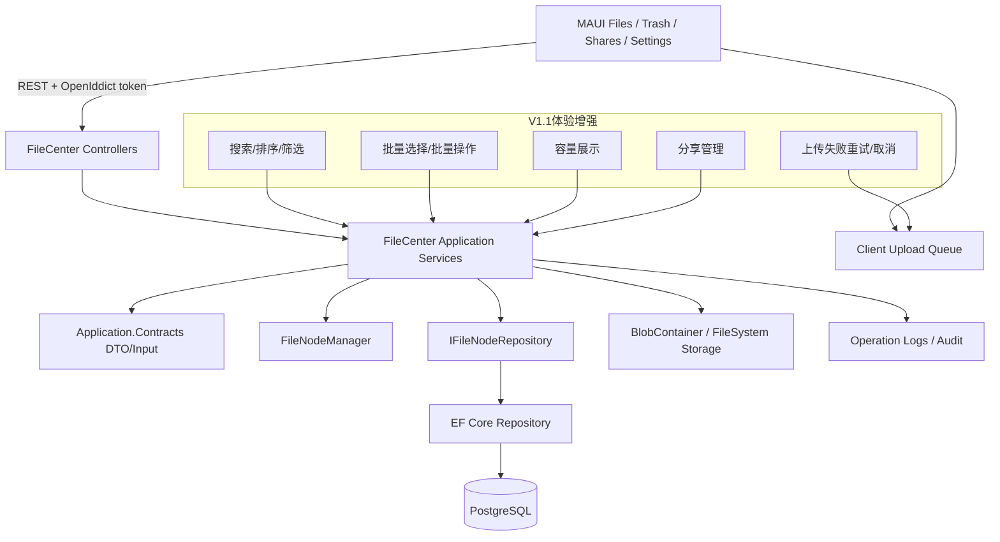

# PrivateCloudDrive V1.1 文件管理体验增强架构边界与技术债务基线

日期：2026-07-03
负责人：Hermes-Architect
文档定位：V1.1 文件管理体验增强的架构收口规格，用于约束后端、MAUI、DevOps 在搜索、排序筛选、批量操作、容量、分享管理、上传队列等能力上“能改什么、不能动什么、必须先修什么”。

---

## 1. 架构结论

V1.1 的核心目标不是重新设计云盘内核，而是在 V1.0 RC 的发布边界上，把“日常管理大量文件”这条用户路径补齐：搜索、排序/筛选、批量选择、重命名/移动、容量展示、上传失败处理和分享管理。

当前代码基线显示：

- 后端已经具备较完整的 V1.1 雏形：`GetFolderChildrenInput` 已包含 `SearchKeyword`、`SearchScope`、`NodeType`、`MediaType`、`Sorting`；`IFileCenterFoldersAppService` 已包含 `MoveManyAsync`、`DeleteManyAsync`、`RestoreManyAsync`、`PermanentDeleteManyAsync`、`SetFavoriteManyAsync`；批量输入 `BatchFileNodeInput` 已存在。
- EF Repository 已按 `TenantId + OwnerId` 过滤，并在 `EfCoreFileNodeRepository.CreateChildrenQueryAsync` 中处理当前目录/全局搜索、类型、媒体类型、收藏、标签过滤和排序。
- MAUI `FilesPage` 已有搜索框、类型/媒体/排序 Picker、全局搜索 Switch、选择模式、批量删除/收藏/移动到根目录等 UI 入口。
- V1.0 RC 架构边界已经明确：ABP 单体分层、OpenIddict、PostgreSQL、Redis、FileSystem 默认存储、Docker Compose、MAUI Android 主验收目标不替换。

因此 V1.1 推荐方案是：

> 复用现有 FileCenter 聚合与 ABP Application Service 契约，补齐体验闭环、测试矩阵、安全/越权验证和发布验证，不引入搜索引擎、队列平台、微服务、复杂权限模型或存储迁移。

整体风险等级：中。

主要风险不是能力缺失，而是“功能已分散实现但没有形成发布级规格”：搜索/批量/排序/容量/分享管理需要统一 API 契约、MAUI 状态、测试证据和部署/发布文档，否则会出现用户可见入口多但边界不一致、越权测试不足、批量操作误删、上传失败不可恢复等问题。

---

## 2. V1.1 范围与总体架构

### 2.1 范围边界

| 范围 | V1.1 结论 | 说明 |
|---|---|---|
| 文件搜索 | 进入 V1.1 P0 | 当前用户/租户范围，文件名搜索，先用 PostgreSQL/EF 查询，不引入全文搜索引擎 |
| 排序与筛选 | 进入 V1.1 P0 | 名称、时间、大小、类型、收藏、标签、媒体类型，复用文件列表 |
| 批量选择 | 进入 V1.1 P0 | 删除、恢复、永久删除、收藏、移动；危险动作二次确认 |
| 重命名/移动 UI | 进入 V1.1 P0 | 后端已有契约，移动端补齐入口与错误态 |
| 容量展示 | 进入 V1.1 P1 | Settings/上传失败提示展示 used/quota/available/maxSingleFileSize |
| 上传队列重试/取消 | 进入 V1.1 P1 | 客户端队列优先；服务端 UploadSession 状态后置到明确需要时 |
| 分享管理体验 | 进入 V1.1 P1 | 我的分享、复制链接、取消分享、密码/过期状态、访问次数；管理员全局管理谨慎后置 |
| 文件夹打包下载 | V1.1 P2/后置 | 需要压缩流、超时、异步任务、空间占用和取消策略，不作为 V1.1 必须项 |

### 2.2 推荐架构图

### 2.3 分层职责

| 层 | 职责 | V1.1 允许变化 | 禁止变化 |
|---|---|---|---|
| MAUI Views/Services | 搜索、筛选、排序、多选、确认弹窗、错误/空状态、上传队列反馈 | 小范围页面和 API client 增量；复用现有 Files/Trash/Shares/Settings | 不重写 App Shell，不替换 MAUI，不做大规模视觉重构 |
| HttpApi Controllers | 暴露 FileCenter 契约、保持路由兼容 | 如契约已存在，仅补缺路由/HTTP verb 映射和 Swagger 注释 | 不绕过 Application Service 直接操作 EF/Blob |
| Application.Contracts | DTO/Input/接口契约 | 补字段、补批量输入、补分享/容量 DTO；保持向后兼容 | 不破坏现有移动端字段名，不把 UI 状态塞进后端 DTO |
| Application | 权限、用户/租户隔离、批量操作编排、审计、业务异常 | 补批量限制、审计、错误码、可读异常 | 不在 Application 中拼接物理路径或输出敏感配置 |
| Domain | FileNode/FileShare/FileTag 等业务规则 | 只补命名、层级、归属、删除/恢复不变量 | 不引入团队空间/文件夹级权限新模型 |
| EntityFrameworkCore | 查询、排序、过滤、索引、迁移 | 补必要索引和测试；保持 PostgreSQL 主线 | 不引入 Elasticsearch/Meilisearch 等新搜索基础设施 |
| Storage/Blob | 文件内容删除、下载、容量统计 | 修复容量/清理准确性 | 不做 FileSystem -> OSS/MinIO 自动迁移 |
| DevOps/Docs | 验收脚本、发布说明、已知限制 | 补测试命令、真机记录、Docker/MAUI 验证说明 | 不改变 Docker Compose 主部署模型 |

---

## 3. 组件修改白名单

### 3.1 可以修改

| 组件/路径 | 可修改范围 | 必须遵守 |
|---|---|---|
| `aspnet-core/src/PrivateCloudDrive.Application.Contracts/FileCenter/*` | 输入 DTO、返回 DTO、接口增量字段；批量/搜索/分享/容量契约 | 字段向后兼容；新增 enum/string 排序值需要测试覆盖 |
| `aspnet-core/src/PrivateCloudDrive.Application/FileCenter/*` | 批量操作编排、错误处理、审计、用户/租户边界、容量/分享应用服务 | 所有查询/命令必须绑定 `CurrentUser.Id` 和 `CurrentTenant.Id` |
| `aspnet-core/src/PrivateCloudDrive.Domain/FileCenter/*` | 命名、移动、删除、恢复、收藏等领域不变量 | 不改变已持久化语义；危险动作需要可回滚/可测试 |
| `aspnet-core/src/PrivateCloudDrive.EntityFrameworkCore/FileCenter/*` | 搜索/过滤/排序查询、索引、迁移 | 搜索必须限制 owner/tenant；排序字段使用 allowlist |
| `aspnet-core/src/PrivateCloudDrive.HttpApi/Controllers/FileCenter/*` | 补路由、HTTP 方法、公开分享边界 | 不暴露未鉴权的私有文件操作 |
| `aspnet-core/test/*/FileCenter/*` | 搜索、排序、筛选、批量、分享、容量、安全测试 | 必须覆盖跨用户/跨租户不可见 |
| `maui/PrivateCloudDrive.App/Views/FilesPage*` | 搜索、筛选、排序、多选、批量操作、状态提示 | 不破坏文件浏览/上传主链路；危险动作二次确认 |
| `maui/PrivateCloudDrive.App/Views/TrashPage*` | 批量恢复/永久删除、清空回收站、状态提示 | 永久删除必须二次确认，且文案明确不可恢复 |
| `maui/PrivateCloudDrive.App/Views/SharesPage*` | 我的分享、复制链接、取消分享、密码/过期状态 | 不显示分享密码明文；不泄露他人分享 |
| `maui/PrivateCloudDrive.App/Views/StorageUsagePage*`、`SettingsPage*` | 容量卡片、上传限制提示、存储健康入口 | 不泄露服务器物理路径、密钥、连接串 |
| `maui/PrivateCloudDrive.App/Services/CloudDriveApiClient*` | query 参数、批量 API、分享/容量 API client | token 刷新和 AuthExpired 处理保持一致 |
| `docs/testing.md`、`docs/deployment.md`、`docs/release-notes-*` | V1.1 验收、已知限制、升级提示 | 与实际命令和测试证据一致 |

### 3.2 允许优化但不允许替换

| 组件 | 可优化 | 不允许替换 |
|---|---|---|
| 文件查询 | 增加 `NormalizedName` 搜索、过滤组合、索引、分页测试 | 不引入 Elasticsearch/Meilisearch/外部搜索服务作为必需依赖 |
| 排序 | 使用 allowlist 映射到 EF 表达式 | 不接受客户端传任意 Dynamic LINQ 字符串直入数据库 |
| 批量操作 | 限制数量、去重、逐项归属校验、事务/部分失败策略明确 | 不绕过 `FileNodeManager` 直接批量 SQL 改状态 |
| 容量统计 | 缓存、异步刷新、清晰提示 | 不把容量策略升级成复杂多用户配额系统 |
| 上传队列 | 客户端重试/取消/失败提示 | 不引入服务端任务队列作为 V1.1 必需项 |
| 分享管理 | 我的分享列表、停用、复制链接、访问状态 | 不做企业级分享审批/外部用户管理 |
| MAUI 文件页 | 小范围提升状态和交互 | 不迁移 Flutter/React Native，不重做底部导航和设计系统 |

### 3.3 明确不能动

| 禁止项 | 原因 | 后置版本 |
|---|---|---|
| 微服务拆分 | V1.1 只是体验增强，拆分会放大部署/事务/测试成本 | V2+ |
| 自研 JWT 或替换 OpenIddict | 会引入高安全风险并破坏移动端 token 生命周期 | 不建议 |
| 更换数据库 | 当前查询、迁移、Compose 均以 PostgreSQL 为基线 | 不进入 V1.1 |
| 默认迁移到 OSS/MinIO/S3 | 会引入备份、回滚、一致性和凭据风险 | V1.3/V2 规划 |
| 家庭空间/团队空间/文件夹级权限 | 会改变 owner/tenant 权限模型，超出 V1.1 | V2 候选 |
| 桌面同步客户端 | 涉及冲突解决、离线和双向同步 | V2 候选 |
| AI/语义搜索 | 隐私、索引、算力、模型治理风险高 | V2 候选 |
| 文件夹打包下载作为 P0 | 压缩流/异步任务/磁盘占用复杂度高 | V1.1 P2 或 V1.3+ |
| 大规模 UI 视觉重构 | V1.1 应补交互闭环，不改变工具型产品基线 | 独立设计任务 |

---

## 4. 技术债务评分

评分规则：

- P0：阻塞 V1.1 发布或存在数据/安全/越权/误删高风险，必须修复或明确降级。
- P1：不一定阻塞发布，但会显著影响可信度，需要在 V1.1 前完成或写入已知限制。
- P2：后续优化，不阻塞 V1.1。

| 编号 | 技术债务 | 优先级 | 影响范围 | 当前证据/判断 | V1.1 处理建议 |
|---|---|---|---|---|---|
| V11-TD-01 | 搜索/筛选/排序需要形成后端安全契约和测试矩阵 | P0 | 文件列表、隐私、越权 | `GetFolderChildrenInput` 与 EF 查询已存在，但需证明组合条件不会跨用户/租户 | 补 EF 集成测试：当前目录/全局搜索、类型、媒体、收藏、标签、排序、跨用户不可见 |
| V11-TD-02 | 批量操作存在误删/越权/部分失败边界 | P0 | 删除、恢复、永久删除、移动、收藏 | `MaxBatchItemCount=100`、逐项 `GetOwnerNodeAsync` 已存在，但 UI/测试/审计需闭环 | 固定 100 上限、二次确认、逐项归属校验、危险操作审计；明确失败时是否全失败或部分成功 |
| V11-TD-03 | 排序字段必须 allowlist，避免任意字段注入/不可预期查询 | P0 | 查询安全、稳定性 | EF Repository 当前使用 switch allowlist，这是正确方向 | 禁止引入客户端自由排序表达式；补未知 sorting fallback 测试 |
| V11-TD-04 | 重命名/移动 UI 与后端语义不一致风险 | P0 | 文件管理主链路 | 后端已有 Rename/Move/MoveMany；MAUI 现有批量只支持移动到根目录，重命名单项入口需确认 | MAUI 补完整入口或将缺口写入已知限制；同名冲突/循环移动/父目录删除需可读错误 |
| V11-TD-05 | 永久删除与 Blob/媒体衍生文件清理需要回归验证 | P0 | 数据安全、存储成本、不可恢复动作 | `CleanupPermanentDeletedFilesAsync` 会删除媒体缩略图/预览和未被引用 blob | 补删除树、共享 blob 引用、媒体资产清理测试；UI 二次确认写明不可恢复 |
| V11-TD-06 | 容量展示与上传失败原因需要一致 | P1 | Settings、上传体验 | `ICloudDriveApiClient.GetStorageUsageAsync` 已有；路线图要求 Settings 和上传失败展示容量原因 | 明确 used/quota/available/maxSingleFileSize 来源；上传超限给出可读错误 |
| V11-TD-07 | 上传队列重试/取消仍偏客户端状态 | P1 | 移动端弱网、用户体验 | `FilesPage` 已显示队列摘要，具体重试/取消能力需从 Uploads 页验收 | V1.1 先以客户端队列闭环；服务端 UploadSession 列表不作为 P0 |
| V11-TD-08 | 分享管理需要区分“我的分享”和管理员全局管理 | P1 | 分享安全、隐私 | API client 已有 `GetSharesAsync`、`DisableShareAsync`；路线图要求用户和管理员管理 | 普通用户只能管理自己的分享；管理员全局管理如未完成，写入后置 |
| V11-TD-09 | 操作日志对批量/分享/删除关键行为覆盖不足会削弱排障 | P1 | 审计、支持 | V1.0 RC 已要求日志覆盖关键文件与登录行为 | 批量删除、永久删除、分享停用、容量拒绝建议记录可审计事件 |
| V11-TD-10 | V1.1 功能进入发布后需同步测试/部署/发布文档 | P1 | 发布可信度 | V1.0 RC 已把文档列为发布闸门 | `docs/testing.md` 增加 V1.1 矩阵；Release Notes 写已知限制 |
| V11-TD-11 | 搜索性能随文件量增长可能下降 | P2 | 大目录体验 | 当前可先用 `NormalizedName.Contains`，适合个人/家庭规模起步 | 后续根据真实数据补索引/全文搜索方案；V1.1 不引入新服务 |
| V11-TD-12 | 文件夹打包下载缺少异步任务/取消/空间治理 | P2 | 下载体验、存储/CPU | 路线图列为 P2 | 仅做设计，不进入 V1.1 发布门禁 |

---

## 5. 必须修复/固化的规格

### V11-FIX-01：搜索、筛选、排序安全契约与测试

推荐负责人：包后端 / backend-eng

风险等级：P0

目标：确保搜索、筛选、排序只返回当前用户/租户可访问的文件，并且所有排序字段来自服务端 allowlist。

范围：

- `GetFolderChildrenInput.SearchKeyword` 继续仅作为文件名搜索条件，不做内容搜索。
- `SearchScope=CurrentFolder` 时必须限制 `ParentId`；`SearchScope=All` 时仍必须限制 `TenantId + OwnerId`。
- 过滤字段覆盖 `NodeType`、`MediaType`、`IsFavorite`、`TagId`。
- Sorting 只接受 allowlist：name、size、creationTime、lastModificationTime 的 asc/desc 组合。
- 未知排序值降级到默认排序，不抛内部异常、不拼接原始字符串。

验收标准：

- EF 集成测试覆盖：当前目录搜索、全局搜索、跨用户不可见、跨租户不可见、类型筛选、媒体筛选、收藏筛选、标签筛选、未知 sorting fallback。
- 搜索结果分页稳定，`TotalCount` 与分页项一致。
- 搜索接口不返回 `BlobName` 之外的内部物理路径、连接串、密钥等敏感信息。

回滚方案：

- 如全局搜索性能或安全测试不稳定，V1.1 可临时只开放当前目录搜索；保留后端参数但 MAUI 隐藏“全局搜索”开关。

### V11-FIX-02：批量操作误删/越权防护

推荐负责人：包后端 / backend-eng + 莫移动 / mobile-eng

风险等级：P0

目标：批量删除、恢复、永久删除、移动、收藏必须在 10+ 文件场景可用，同时防止越权、误删和不可恢复动作无提示。

范围：

- 批量输入去重、过滤空 Guid，保持最大 100 项限制。
- 每个节点执行 owner/tenant 校验；不能只信任客户端选中列表。
- 删除进入回收站，永久删除必须只作用于回收站节点。
- 批量移动必须校验目标父目录属于当前用户，禁止把目录移动到自身或子孙节点下。
- MAUI 批量危险动作必须二次确认，永久删除文案必须写明不可恢复。
- 批量失败时要返回可理解错误；如采用逐项处理，文档需明确是否可能部分成功。

验收标准：

- 10+ 文件批量删除、恢复、永久删除、收藏、移动可通过后端测试或真机/模拟器验收。
- 跨用户 ID 混入批量请求时不会操作他人文件。
- 永久删除后 Blob/媒体缩略图/预览清理有回归测试，且共享 Blob 引用不会被误删。

回滚方案：

- 如批量永久删除存在清理风险，V1.1 可先隐藏批量永久删除入口，仅保留单项永久删除和批量移入回收站。

### V11-FIX-03：重命名/移动端到端体验闭环

推荐负责人：莫移动 / mobile-eng + 包后端 / backend-eng

风险等级：P0

目标：用户可以从文件详情或更多菜单完成重命名、移动，错误状态可理解，不破坏文件浏览主链路。

范围：

- 后端保持 `RenameAsync`、`MoveAsync`、`MoveManyAsync` 契约，不破坏现有路由。
- 重命名需校验空名、非法字符、同级重名、长度。
- 移动需校验目标目录存在、归属正确、不能形成循环层级。
- MAUI 至少支持单项重命名和移动到根目录/当前可选目录中的一种清晰路径；未支持完整目录选择器时写入已知限制。

验收标准：

- 文件和文件夹均可重命名，重名冲突展示可读错误。
- 文件和文件夹移动后列表刷新正确，路径面包屑不混乱。
- 后端测试覆盖非法移动和跨用户移动失败。

回滚方案：

- 如目录选择器不稳定，保留后端能力和批量移动到根目录，隐藏复杂移动入口。

### V11-FIX-04：容量展示与上传失败原因一致性

推荐负责人：包后端 / backend-eng + 莫移动 / mobile-eng

风险等级：P1

目标：Settings 和上传失败提示能够解释“空间剩余、单文件上限、失败原因”，降低用户误判为网络或服务器故障。

范围：

- `StorageUsageDto` 或等价模型必须包含 used、quota、available、maxSingleFileSize。
- 上传前或上传失败时，客户端展示容量不足/单文件超限的可读原因。
- Settings/StorageUsage 页面展示不泄露服务器物理路径、Docker volume 内部路径或对象存储密钥。
- 如果个人配额尚未产品化，明确显示“当前实例限制/服务器存储限制”，不要伪装成多用户配额系统。

验收标准：

- Settings 能看到容量使用和剩余空间。
- 上传超限时错误文案可区分容量不足、单文件过大、网络失败、认证过期。
- 后端/移动端日志不输出本地绝对路径、token、secret。

回滚方案：

- 如果容量统计在某些存储 provider 下不准确，V1.1 可标记为 Degraded/未知，并保留上传失败原始安全错误。

### V11-FIX-05：分享管理安全边界

推荐负责人：包后端 / backend-eng + 安安全 / security-reviewer

风险等级：P1

目标：用户可以管理自己的分享，但不会看到、停用或推断他人的分享；公开分享访问继续保持密码/过期/下载限制和限流边界。

范围：

- 普通用户 `GetSharesAsync` 只返回自己的分享。
- Disable/Cancel 分享必须校验 owner/tenant。
- 分享列表可展示过期时间、下载允许状态、访问次数/最近访问时间（如已有），但不显示密码明文。
- 公开分享接口继续使用独立限流和密码校验，不因管理页改动放宽鉴权。

验收标准：

- 普通用户无法枚举或取消他人分享。
- 已取消、过期、需要密码的分享访问行为符合预期。
- 分享管理操作进入审计/操作日志或至少有测试证据。

回滚方案：

- 如果分享管理页无法完整验收，V1.1 可保留创建分享和取消当前文件分享，隐藏“我的分享”聚合入口。

---

## 6. V1.0 架构边界未完成项迁移说明

V1.1 不应绕过 V1.0 RC 未完成项。以下条目从 `docs/architecture-v1.0-rc-boundary.md` 迁移为 V1.1 的前置门禁或持续门禁：

| V1.0 RC 未完成/持续项 | 迁移到 V1.1 的处理 | 不能绕过的原因 |
|---|---|---|
| Secret/日志扫描 | 继续作为发布门禁；V1.1 搜索、批量、分享、上传错误日志也必须纳入扫描 | 文件管理会放大文件名、分享链接、token、路径泄露风险 |
| Docker `.env` 与生产敏感值默认值 | 不作为 V1.1 功能开发项，但发布前仍需检查默认密码、PUBLIC_URL、OpenIddict Issuer | 分享链接、上传回调、移动端 API 地址依赖部署配置 |
| 健康检查真实可用性 | 容量/上传/Settings 展示依赖 Storage/DB/Redis/FFmpeg 健康，不得只看配置存在 | 用户会根据设置页判断是否可继续上传/删除 |
| Storage 持久化和备份恢复边界 | 批量删除、永久删除、容量展示前必须再次强调 DB + storage + `.env/.secrets` 备份 | V1.1 增加批量和永久删除入口，数据安全风险更高 |
| OpenIddict/外部登录降级 | V1.1 文件页功能必须在外部登录未配置时仍支持账号密码和 refresh token | 文件管理主链路不能被可选登录能力阻塞 |
| Android 真机主链路验收 | 扩展为 V1.1 真机验收：搜索、排序、筛选、批量、分享、容量、上传失败 | 文件管理体验增强必须在真实移动设备上可用 |
| MAUI 构建脚本验收 | V1.1 所有 MAUI 改动后必须跑分平台构建脚本 | FilesPage/Trash/Shares/Settings 是高改动区域 |
| ABP 分层治理 | V1.1 新增契约/服务/测试必须按 Domain/Application/Contracts/HttpApi 分层落位 | 防止体验修复演变成越层技术债 |
| 审计日志覆盖 | 从 RC 登录/文件关键行为扩展到批量、分享、永久删除、容量拒绝 | V1.1 操作更危险，需要排障与追踪 |
| OSS/MinIO 边界 | 仍作为可选/实验，不因容量或分享管理把对象存储变成默认路径 | 避免 V1.1 被存储迁移风险拖垮 |
| Swagger/公网暴露策略 | 分享管理和批量接口上线前继续确认生产 Swagger 暴露策略 | 新增/暴露更多操作接口会扩大攻击面 |
| 媒体处理失败可见性 | 不阻塞 V1.1 文件管理，但容量/媒体类型筛选需能解释媒体处理失败与普通文件列表的区别 | 避免用户把媒体处理失败误认为文件丢失 |

迁移原则：

1. V1.0 P0 安全/部署/数据安全项在 V1.1 仍是发布前置，不因为新功能完成而自动关闭。
2. V1.0 P1 项如果直接影响 V1.1 用户路径，应升级为 V1.1 P0 或 P1 验收项。
3. V1.0 P2 媒体项不阻塞 V1.1 文件管理，但不能让媒体库异常破坏文件列表、搜索和下载。

---

## 7. 下游协作任务建议

| 下游岗位/profile | 事项 | 优先级 | 交付物 |
|---|---|---|---|
| 包后端 / backend-eng | 固化搜索/筛选/排序安全契约、批量操作防护、重命名/移动错误码、分享管理 owner/tenant 校验 | P0 | EF 集成测试、Application Service 测试、契约说明 |
| 莫移动 / mobile-eng | 补齐 Files/Trash/Shares/Settings 的 V1.1 端到端体验、错误态、二次确认、上传失败提示 | P0 | MAUI 页面改动、Android 真机验收记录、构建结果 |
| 丁 DevOps / devops-eng | 将 V1.1 验收命令、MAUI 构建、Docker/secret 扫描纳入发布清单 | P1 | `docs/testing.md`/Release Notes/验证脚本输出证据 |
| 安安全 / security-reviewer | 复核搜索越权、批量误删、永久删除、分享管理、日志脱敏 | P0 | 安全复核报告或阻塞项列表 |
| 齐 QA / qa-eng | 形成 V1.1 文件管理验收矩阵：搜索、排序、筛选、批量、重命名/移动、容量、分享、上传失败 | P1 | 真机/模拟器测试记录、PASS/WARN/FAIL 摘要 |

---

## 8. V1.1 验收标准

V1.1 架构边界验收必须满足：

1. 架构边界
   - 保持 ABP 单体分层。
   - 保持 OpenIddict 为唯一 token 签发体系。
   - 保持 PostgreSQL + Redis + FileSystem + Docker Compose 基线。
   - 不引入外部搜索引擎、微服务、对象存储默认迁移、团队空间权限模型。

2. 安全与权限
   - 搜索/筛选/排序只返回当前用户/租户数据。
   - 批量操作逐项校验 owner/tenant。
   - 分享管理只操作自己的分享；公开分享不放宽密码/过期/限流。
   - 日志和错误不泄露 token、Authorization、password、secret、服务器物理路径。

3. 文件体验
   - 文件页支持搜索、排序、筛选、清除条件和空结果/错误状态。
   - 10+ 文件可批量删除/恢复/永久删除或明确已知限制；危险操作二次确认。
   - 重命名/移动入口可用，或缺口明确写入 V1.1 已知限制。
   - 容量展示和上传失败原因可读。
   - 分享管理可以查看、复制、取消自己的分享。

4. 测试与发布
   - 后端 FileCenter 集成测试覆盖 V11-FIX-01/02/05 的 P0 安全路径。
   - MAUI Windows/Android 构建脚本通过，或失败有明确阻塞原因。
   - Android 真机至少完成：登录、文件列表、搜索、排序、筛选、上传、下载、删除、恢复、批量、分享、容量查看。
   - `docs/testing.md` 与 Release Notes 同步 V1.1 已知限制。

5. 回滚
   - 搜索：可通过 UI 隐藏全局搜索降级到当前目录。
   - 批量：可隐藏批量永久删除/移动，只保留安全子集。
   - 分享：可隐藏“我的分享”聚合页，保留单文件分享管理。
   - 容量：可标记为未知/Degraded，不阻塞文件主链路。
   - 上传队列：可保留失败提示，重试/取消后置。

---

## 9. 最终建议

推荐方案：以“复用现有 FileCenter 能力 + 补齐安全测试 + 收敛 MAUI 体验状态 + 维持 V1.0 发布门禁”为 V1.1 策略。

替代方案：如果团队无法一次性完成全部 V1.1 体验增强，建议分两批：

1. V1.1a：搜索、排序/筛选、批量删除/恢复、重命名、容量展示。
2. V1.1b：完整移动目录选择、批量永久删除、上传队列重试/取消、分享管理增强。

不推荐方案：为了 V1.1 引入搜索服务、队列平台、对象存储迁移、权限模型重构或 UI 大重做。这些会把“文件管理体验增强”拖成平台级改造，风险与收益不匹配。
