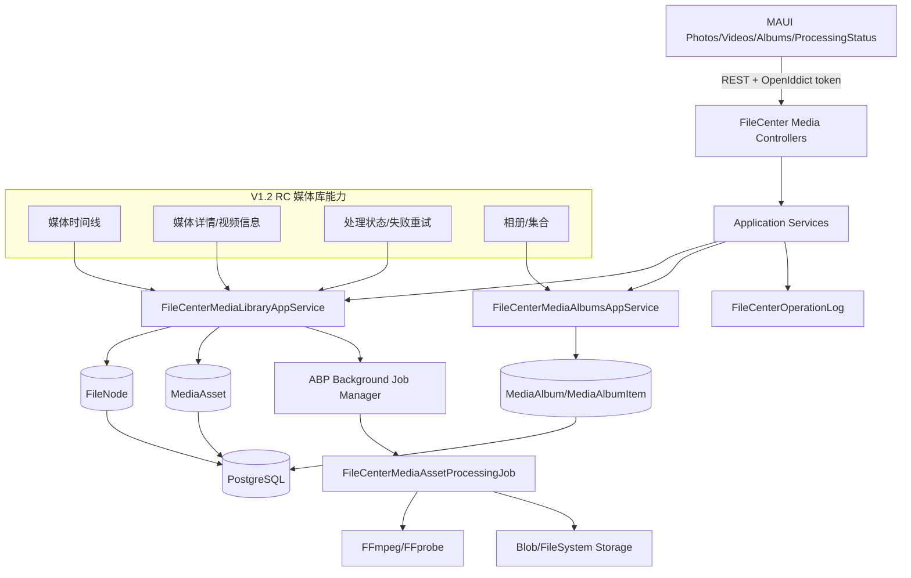

# PrivateCloudDrive V1.2 RC 媒体库架构边界与技术债务基线

日期：2026-07-09
负责人：Hermes-Architect
文档定位：V1.2 RC / Productization Sprint 的架构收口基线，用于约束媒体库、相册、媒体处理状态、MAUI 媒体页、发布门禁和 Git 工作区治理；本文件不替代 V1.0 RC / V1.1 基线，而是在其上收紧 V1.2 媒体库边界。

---

## 1. 架构结论

V1.2 RC 的核心目标不是重做云盘底座，而是把已经实现的媒体库能力收口成可发布、可验收、可长期维护的版本：

- 后端已经存在媒体库主应用服务：`FileCenterMediaLibraryAppService`，覆盖时间线、详情、处理状态、失败重试。
- 后端已经存在相册应用服务：`FileCenterMediaAlbumsAppService`，覆盖创建、更新、删除、添加/移除媒体、封面设置，并按 `TenantId + OwnerId` 隔离。
- 媒体处理由 `MediaAsset`、`MediaAssetProcessingJobArgs`、`FileCenterMediaAssetProcessingJob`、`FileCenterMediaAssetService` 等构成，状态流转覆盖 Pending/Processing/Completed/Failed。
- MAUI 端已有 `PhotosPage`、`VideosPage`、`MediaPreviewPage`、`MediaProcessingStatusPage`、`MediaAlbumsPage`、`MediaAlbumDetailPage`、`AddMediaToAlbumPage` 等页面和模型。
- V1.2 RC 当前最大风险不是代码完全缺失，而是：文档命名不一致、PR #45 文档同步冲突、Android 验收预算不足、媒体库边界缺少统一白名单/禁止清单。

推荐方案：

> 维持 ABP 单体分层 + OpenIddict + PostgreSQL + Redis/ABP BackgroundJob + FileSystem 默认存储 + MAUI Android 主验收目标；V1.2 只在 FileCenter 媒体库范围内做收口、测试、文档和验收，不引入 AI 相册、HLS 转码、桌面同步、复杂家庭空间或存储迁移。

整体风险等级：中。

主要风险集中在发布治理和验收：媒体库能力已存在，但若缺少 Android 真机/模拟器可复验、处理失败脱敏证据、相册越权测试、媒体衍生文件清理回归和 Git 工作区清洁基线，V1.2 RC 容易成为“功能已写但发布不可控”的状态。

---

## 2. V1.2 RC 范围与架构图

### 2.1 范围边界

| 范围 | V1.2 RC 结论 | 说明 |
|---|---|---|
| 媒体时间线 | P0，进入 RC | 图片/视频混合时间线，按 TakenAt 或 CreationTime 排序，客户端按月份分组 |
| 视频详情增强 | P0，进入 RC | 展示时长、分辨率、封面、大小、处理状态；不做 HLS 多码率 |
| 媒体处理状态 | P0，进入 RC | Pending/Processing/Failed/Completed 可见；失败原因必须脱敏 |
| 失败重试 | P0，进入 RC | `RetryProcessingAsync` 只允许当前用户自己的媒体，状态受控 |
| 相册/集合管理 | P1，进入 RC 但可降级 | 手动相册、添加/移除媒体、封面、删除相册不删原文件 |
| 后台任务管理 | P1，进入 RC 管理入口规划 | V1.2 保留基础处理状态页；管理员批量管理可后置 |
| OSS/多存储说明 | P1，进入文档和已知限制 | 不在 V1.2 做 FileSystem 到 OSS 自动迁移 |
| HLS/低清预览 | P2/后置 | 需要转码队列、空间治理、回滚策略，不作为 RC 必选 |
| AI 相册/人脸/语义搜索 | 禁止进入 V1.2 RC | 隐私、索引和算力治理风险高 |

### 2.2 推荐架构图



### 2.3 分层职责

| 层 | 职责 | V1.2 允许变化 | V1.2 禁止变化 |
|---|---|---|---|
| MAUI Views/Models | 媒体时间线、视频详情、相册、处理状态、错误/空状态 | 小范围修复媒体页入口、状态展示、重试/刷新体验 | 不替换 MAUI，不重做 Shell，不做大规模视觉重构 |
| HttpApi Controllers | 媒体库与相册 API 路由 | 补 Swagger 注释、缺失 HTTP verb、错误码说明 | 不暴露未鉴权私有媒体访问 |
| Application.Contracts | 媒体 DTO/Input/接口 | 补字段、分页、状态枚举，保持向后兼容 | 不把 UI 状态或物理路径塞进 DTO |
| Application | 用户/租户隔离、媒体查询、相册编排、失败重试、审计 | 加固 owner/tenant 校验、错误脱敏、日志 | 不直接拼物理路径，不绕过领域状态机 |
| Domain | MediaAsset、MediaAlbum、MediaAlbumItem 不变量 | 状态机、命名、唯一性、相册关系约束 | 不引入家庭空间/团队权限新模型 |
| EntityFrameworkCore | 媒体/相册查询、迁移、索引 | 补必要索引和集成测试 | 不调整既有迁移顺序和主键策略 |
| Storage/Blob | 原文件、缩略图、预览资产读写 | 修复媒体衍生文件清理/引用校验 | 不做默认存储迁移，不泄露服务器路径 |
| Background Jobs | 媒体处理任务投递和执行 | 失败重试、幂等、错误摘要脱敏 | 不引入新队列平台作为 RC 必需依赖 |
| DevOps/Docs | 验收脚本、发布说明、已知限制、工作区治理 | 补 V1.2 验收矩阵、Android 预算分档 | 不改变 Docker Compose 端口映射和发布模型 |

---

## 3. V1.2 RC 组件修改白名单

### 3.1 可以修改

| 组件/路径 | 可修改范围 | 必须遵守 |
|---|---|---|
| `aspnet-core/src/PrivateCloudDrive.Application.Contracts/FileCenter/*Media*` | 时间线、详情、处理状态、相册 DTO/Input | 字段向后兼容；状态 enum 明确；分页参数有上限 |
| `aspnet-core/src/PrivateCloudDrive.Application/FileCenter/FileCenterMediaLibraryAppService.cs` | 媒体时间线、详情、处理状态、失败重试、审计 | 所有查询必须绑定 `CurrentTenant.Id + CurrentUser.Id`；错误摘要必须脱敏 |
| `aspnet-core/src/PrivateCloudDrive.Application/FileCenter/FileCenterMediaAlbumsAppService.cs` | 相册增删改查、添加/移除媒体、封面设置 | 相册和媒体均需 owner/tenant 校验；删除相册不删除原文件 |
| `aspnet-core/src/PrivateCloudDrive.Application/FileCenter/FileCenterMediaAssetService.cs` | MediaAsset 创建、状态维护、衍生信息 | 只处理媒体文件；状态机可测试；不覆盖原文件 |
| `aspnet-core/src/PrivateCloudDrive.Application/FileCenter/FileCenterMediaAssetProcessingJob.cs` | FFmpeg/FFprobe 调用、缩略图/元数据提取、失败记录 | 命令参数安全、失败摘要脱敏、任务幂等 |
| `aspnet-core/src/PrivateCloudDrive.Domain/FileCenter/MediaAsset*.cs` | 状态机、媒体元数据、常量 | 不破坏已持久化语义；失败状态可回滚到 Pending/Processing |
| `aspnet-core/src/PrivateCloudDrive.Domain/FileCenter/MediaAlbum*.cs` | 相册命名、唯一性、关系约束 | 不删除原始 FileNode/Blob；不跨用户共享相册 |
| `aspnet-core/src/PrivateCloudDrive.HttpApi/Controllers/FileCenter/FileCenterMedia*Controller.cs` | 媒体/相册路由、返回码、注释 | 不新增匿名私有媒体接口；公开分享仍走原分享边界 |
| `aspnet-core/test/*/FileCenter/*Media*Tests.cs` | 时间线、相册、状态机、失败重试、越权测试 | 必须覆盖跨用户/跨租户不可见和失败脱敏 |
| `maui/PrivateCloudDrive.App/Views/PhotosPage*` | 时间线分组、筛选、空状态、刷新 | 不破坏文件页主链路；大列表避免一次性全量加载 |
| `maui/PrivateCloudDrive.App/Views/VideosPage*`、`MediaPreviewPage*` | 视频详情、播放状态、失败/处理中提示 | Range 播放失败可降级，不误导用户已完成处理 |
| `maui/PrivateCloudDrive.App/Views/MediaProcessingStatusPage*` | 处理状态列表、失败重试入口、状态筛选 | 不展示服务器路径、堆栈、密钥 |
| `maui/PrivateCloudDrive.App/Views/MediaAlbumsPage*`、`MediaAlbumDetailPage*`、`AddMediaToAlbumPage*` | 相册创建/删除/添加/移除/封面 | 删除相册提示“不会删除原文件”；重复添加幂等 |
| `maui/PrivateCloudDrive.App/Services/CloudDriveApiClient*` | 媒体 API client、错误映射、token 处理 | token 刷新和 AuthExpired 处理保持一致 |
| `docs/testing.md`、`docs/release-notes-v1.2*`、`docs/scenario-matrix-v1.2*` | V1.2 验收、已知限制、发布说明 | 文档命名必须收敛，避免 RC/正式版重复冲突 |

### 3.2 允许优化但不允许替换

| 组件 | 可优化 | 不允许替换 |
|---|---|---|
| 媒体查询 | TakenAt/CreationTime 排序、MediaType/Status 筛选、分页索引 | 不引入 Elasticsearch/Meilisearch/AI 向量库作为必需依赖 |
| 媒体处理 | FFmpeg 参数、失败重试、幂等、错误摘要脱敏 | 不引入外部转码集群作为 RC 依赖 |
| 相册 | 同名约束、封面、项目数量缓存 | 不把相册升级为团队共享空间或复杂权限模型 |
| 视频播放 | Range 支持、移动端状态提示、封面展示 | 不做 HLS/多码率转码为 RC 必需项 |
| MAUI 媒体页 | 空状态、加载状态、错误文案、刷新体验 | 不迁移 Flutter/React Native，不重做设计系统 |
| 发布文档 | 命名收敛、已知限制索引、验收矩阵 | 不把 RC 文档与正式版文档混用到冲突状态 |

### 3.3 明确禁止修改

| 禁止项 | 原因 | 后置版本 |
|---|---|---|
| OpenIddict 认证框架 / Token 生命周期 | 高安全风险，会影响移动端登录和刷新 | 不建议 |
| `IStorageProvider` 存储抽象与默认 FileSystem 行为 | V1.2 重点是媒体库，不做存储迁移 | V1.3+ 规划 |
| 数据库迁移顺序、主键策略、既有表语义 | 破坏升级和回滚可信度 | 不进入 RC |
| Docker Compose 发布端口映射 | 会影响部署文档、Android emulator 访问和既有验收 | 独立 DevOps 任务 |
| 家庭空间/团队空间/文件夹级权限 | 改变 owner/tenant 权限模型，超出 RC | V2 候选 |
| HLS/多码率/低清转码作为 P0 | 需要容量、队列、回滚和清理治理 | V1.3/V2 候选 |
| AI 人脸识别/OCR/语义搜索 | 隐私和算力治理复杂 | V2 候选 |
| iOS 作为 RC 强制验收 | 当前主验收目标是 Android；iOS 缺少完整环境 | 后续版本 |
| 删除或重排历史迁移以“整理代码” | 会破坏已有数据库升级路径 | 禁止 |
| 直接清理未确认来源的本地 worktree 内容 | 可能删除人工残留分析脚本或未合并证据 | 先记录/确认，再 prune/remove |

---

## 4. Git 工作区健康评估

### 4.1 当前发现

本次检查执行了：

```text
git status --short
git worktree list --porcelain
gh pr view 45 --repo 253513374/PrivateCloudDrive --json files,commits,mergeStateStatus,statusCheckRollup,headRefName,baseRefName
```

结论：

| 项 | 发现 | 处理结论 |
|---|---|---|
| `.worktrees/pr-cleanup-temp` | 注册为一个 detached worktree，HEAD=`f799716...`，路径在仓库内 | 不建议直接删除；其内部有未跟踪 `check_prs.py`、`check_reviews.py`、`check_status.py`，先作为残留分析工作树记录 |
| `.worktrees/` dirty | `.gitignore` 原先未包含 `.worktrees/`，导致仓库内 worktree 被 `git status` 展示为未跟踪 | 已在 `.gitignore` 增加 `.worktrees/`，后续不应污染主工作区状态 |
| PR #45 | `docs-sync-v12`，`mergeStateStatus=DIRTY`，CI/Security Gate 已通过 | 冲突不是质量门禁失败，而是文档同步与 main 上 V1.2 RC 命名/内容并行演进冲突 |
| PR #45 涉及文件 | `docs/product-planning-hub.md`、`docs/release-notes-v1.2.md`、`docs/scenario-matrix-v1.2.md`、`docs/testing.md` | 需要 rebase 时统一 `v1.2` 与 `v1.2-rc` 文档命名，避免双版本文档互相覆盖 |
| 当前工作区其它变更 | `docs/release-closeout-v1.1.md`、`docs/scenario-matrix-v1.2-rc.md`、`pcd_android_login_inject.py` 等未跟踪 | 不是本架构任务生成的源代码改动；不建议架构岗擅自删除，需由对应作者/发布岗确认归档 |

### 4.2 是否需要 `git worktree prune`

当前不建议立即执行 `git worktree prune` 作为自动清理动作，原因：

1. `.worktrees/pr-cleanup-temp` 仍出现在 `git worktree list --porcelain` 中，是 Git 认识的工作树，不是简单失效元数据。
2. 该 worktree 内部有未跟踪脚本，直接 `git worktree remove --force` 可能丢失人工分析残留。
3. V1.2 RC 当前更需要“工作区状态可解释”，而不是为了看起来干净而删除未知来源内容。

推荐治理：

```text
# 仅在确认 pr-cleanup-temp 无保留价值后执行
git -C D:/Devs/Projects/Personal/PrivateCloudDrive/.worktrees/pr-cleanup-temp status --short
git -C D:/Devs/Projects/Personal/PrivateCloudDrive worktree remove .worktrees/pr-cleanup-temp
# 若 metadata 已失效，再执行
git -C D:/Devs/Projects/Personal/PrivateCloudDrive worktree prune
```

### 4.3 是否应配置 `.gitconfig` worktree 行为

不建议通过全局 `.gitconfig` 隐藏或改变 worktree 行为。推荐做法是项目级治理：

- 约定临时 worktree 不放在主仓库内部，优先放到 `D:/Devs/Projects/Personal/PrivateCloudDrive-tasks/...` 或 Hermes 外部 worktree 根目录。
- 若必须放仓库内，则保持 `.worktrees/` 在 `.gitignore` 中。
- PR 关闭后由创建者执行 `git worktree remove <path>`，而不是依赖全局 prune。

---

## 5. PR #45 冲突根因分析

PR #45 当前状态：OPEN，`mergeStateStatus=DIRTY`；CI 和 Security Gate 均通过。

冲突根因判断：

1. PR #45 的 head 分支 `agent/t_302cdbbf/docs-sync-v12` 在 2026-07-07 增加 `docs/release-notes-v1.2.md`、`docs/scenario-matrix-v1.2.md`，并修改 `docs/product-planning-hub.md`、`docs/testing.md`。
2. 当前本地/主线已经出现 `docs/release-notes-v1.2-rc.md`、`docs/scenario-matrix-v1.2-rc.md` 这类 RC 命名文档，并且 `product-planning-hub.md` 引用 `docs/release-plan-v1.2.md`，但本地未找到该文件。
3. 冲突本质是“V1.2 正式版文档同步”和“V1.2 RC 产品化收口文档”并行演进，命名口径不一致，而不是代码层面冲突。

推荐 rebase 策略：

| 文件 | 推荐处理 |
|---|---|
| `docs/product-planning-hub.md` | 保留 V1.2 RC / Productization Sprint 作为当前阶段命名；引用必须指向真实存在的发布范围文档或补齐缺失文档 |
| `docs/release-notes-v1.2.md` vs `docs/release-notes-v1.2-rc.md` | 短期以 `release-notes-v1.2-rc.md` 为 RC 发布说明，正式版 `release-notes-v1.2.md` 仅在 RC 验收完成后生成或从 RC 提升 |
| `docs/scenario-matrix-v1.2.md` vs `docs/scenario-matrix-v1.2-rc.md` | 当前阶段以 `scenario-matrix-v1.2-rc.md` 为验收矩阵；如保留正式版文件，需明确它是 RC 后固化版 |
| `docs/testing.md` | 合并 V1.2 AC 清单，但避免与 RC 矩阵重复冲突；以 AC 编号和已知限制索引为稳定引用 |

---

## 6. 迭代预算治理建议

当前问题：Android 验收任务默认 `goal_max_turns=60`，但 5/8 个验收项耗尽预算。V1.2 RC 不应简单把所有任务都调高预算，而应按复杂度分档。

| 任务类型 | 建议 goal_max_turns | 适用范围 | 退出条件 |
|---|---:|---|---|
| 一般实现/文档任务 | 60 | 架构文档、普通后端修复、Release Gate 文档检查 | 产物完成 + 基础命令/引用检查通过 |
| Android 模拟器/真机验收 | 120 | APK install、启动、登录、媒体页触控、截图证据、adb 排障 | 明确 PASS/WARN/FAIL + 设备/构建/日志证据 |
| Release Gate / 审核任务 | 60 | 发布门禁判断、安全复核、文档审查 | 给出放行/阻塞结论和证据路径 |
| 长时间环境排障 | 120 或拆分子任务 | Emulator 冷启动、依赖恢复、Docker/MAUI 双栈联调 | 每 30-45 分钟有 heartbeat；超过 120 应拆卡 |

治理建议：

1. Android 验收卡默认 120，但必须要求证据模板：设备、系统版本、APK 路径、后端 URL、截图/日志路径、结果。
2. 若 120 仍不足，不再继续同一卡无限追加，应拆分为：环境准备、登录主链路、媒体时间线、相册、处理状态、视频播放。
3. Release Gate 保持 60，避免发布岗在单卡中承担实际修复工作；发现问题后创建后端/移动/QA 子卡。
4. delivery-manager 应维护预算档位配置；release-manager 应在发布门禁中检查超预算任务是否有明确阻塞原因。

---

## 7. 技术债务评分

评分规则：

- P0：阻塞 V1.2 RC 发布或存在数据/安全/越权/误删/泄密高风险，必须修复或明确降级。
- P1：不一定阻塞发布，但会显著影响可信度，需要在 RC 前完成或写入已知限制。
- P2：后续优化，不阻塞 V1.2 RC。

| 编号 | 技术债务 | 优先级 | 影响范围 | 当前证据/判断 | V1.2 RC 处理建议 | 推荐负责人 |
|---|---|---|---|---|---|---|
| V12-TD-01 | 媒体时间线必须证明 owner/tenant 隔离和分页稳定 | P0 | 媒体隐私、性能 | `FileCenterMediaLibraryAppService` 查询按 owner/tenant 设计，但发布需测试证据 | 补/确认 EF 集成测试：跨用户不可见、跨租户不可见、MediaType/Status 筛选、分页总数一致 | backend-eng |
| V12-TD-02 | 媒体处理失败摘要必须脱敏 | P0 | 安全、日志、用户可见错误 | Release Notes 已要求 Failed 不暴露堆栈/路径/密钥 | 测试或扫描失败摘要不含物理路径、连接串、token、stack trace；UI 只显示可读原因 | backend-eng + security-reviewer |
| V12-TD-03 | 失败重试状态机和任务幂等需要固化 | P0 | 媒体处理一致性 | `RetryProcessingAsync` 限定 Pending/Failed，但需并发/重复点击证据 | 补状态机测试：Completed/Processing 不可重复重试；重复点击不投递多份危险任务 | backend-eng |
| V12-TD-04 | 相册 owner/tenant 和“删除不删原文件”必须回归 | P0 | 数据安全、隐私 | `FileCenterMediaAlbumsAppService` 按 owner/tenant 查询，删除只删关系 | 补测试：跨用户相册不可见、跨用户媒体不可加入、删除相册不删除 FileNode/Blob | backend-eng |
| V12-TD-05 | 媒体衍生文件清理与永久删除联动需验证 | P0 | 存储成本、不可恢复动作 | V1.1 已关注 Blob/缩略图清理；V1.2 新增更多媒体资产 | 永久删除后确认缩略图/预览/MediaAsset 清理，不误删共享 Blob 引用 | backend-eng |
| V12-TD-06 | MAUI 媒体页 Android 验收预算不足 | P1 | 发布可信度 | 5/8 Android 验收项曾耗尽 60 turn 预算 | Android 验收卡使用 120 turn 档，并拆分媒体时间线/相册/处理状态/视频播放 | delivery-manager + qa-eng + mobile-eng |
| V12-TD-07 | PR #45 文档命名和冲突治理 | P1 | 发布文档一致性 | PR #45 DIRTY；`v1.2` 与 `v1.2-rc` 文件并存 | rebase 前先确定 RC 文档命名策略；缺失 `release-plan-v1.2.md` 需补齐或改引用 | release-manager + pm |
| V12-TD-08 | `.worktrees/pr-cleanup-temp` 残留 worktree | P1 | 工作区可维护性 | 注册 worktree 在仓库内部且有未跟踪脚本 | `.worktrees/` 已加入 ignore；由创建者确认后 remove/prune，不直接强删 | delivery-manager |
| V12-TD-09 | 后台任务管理入口仍偏基础 | P1 | 运维、失败自助 | 当前有处理状态页，管理员批量任务治理不完整 | V1.2 写入已知限制；V1.3 做任务管理增强 | mobile-eng + backend-eng |
| V12-TD-10 | HLS/低清预览未做容量治理 | P2 | 大视频播放体验 | 路线图列 P2，Release Notes 明确不包含 | 保持后置；先用 Range/原文件播放和明确不支持提示 | backend-eng + mobile-eng |

---

## 8. 必须修复/固化的规格

### V12-FIX-01：媒体时间线隔离与分页稳定

推荐负责人：包后端 / backend-eng
风险等级：P0

目标：确保媒体时间线只返回当前用户/租户可访问的图片/视频，分页、筛选和排序稳定。

范围：

- 时间线查询必须限制 `TenantId == CurrentTenant.Id` 和 `OwnerId == CurrentUser.Id`。
- MediaType 筛选只允许 Image/Video/All 等服务端定义值。
- ProcessStatus 筛选必须使用 enum，不接受客户端任意字符串拼接。
- TakenAt 缺失时回退 CreationTime；排序稳定。
- MaxResultCount 应有上限，避免移动端一次拉取过多。

验收标准：

- EF 集成测试覆盖：当前用户媒体、跨用户不可见、跨租户不可见、图片筛选、视频筛选、状态筛选、分页 TotalCount 和 Items 一致。
- API 不返回服务器物理路径、连接串、密钥。

回滚方案：

- 如时间线分页或全量混合不稳定，V1.2 可临时拆为 Photos/Videos 两个入口，隐藏“全部媒体”混合时间线。

### V12-FIX-02：媒体处理失败脱敏与重试状态机

推荐负责人：包后端 / backend-eng + 安安全 / security-reviewer
风险等级：P0

目标：用户可看到处理失败并重试，但不能看到服务器路径、堆栈、命令行、密钥或连接串。

范围：

- 失败摘要只保留用户可理解的分类原因，如“缩略图生成失败”“不支持的媒体格式”“FFmpeg 不可用”。
- `RetryProcessingAsync` 只允许 Pending/Failed；Processing/Completed 不允许重复投递。
- 重试必须仍绑定当前 owner/tenant。
- 记录操作日志，但日志值不得包含 token/password/secret/物理路径。

验收标准：

- 单元/集成测试覆盖 Pending→Processing、Failed→Processing、Completed 禁止重试、跨用户禁止重试。
- 失败摘要安全扫描 0 findings。

回滚方案：

- 如重试链路存在幂等风险，V1.2 可保留状态可见，隐藏“重新处理”按钮，由管理员/后台任务手工处理。

### V12-FIX-03：相册安全边界和数据不破坏

推荐负责人：包后端 / backend-eng + 莫移动 / mobile-eng
风险等级：P0

目标：相册只管理媒体组织关系，不改变文件目录结构，不删除原始文件，不跨用户泄露。

范围：

- 创建/重命名相册按当前用户唯一性校验。
- 添加媒体时必须确认媒体节点属于当前用户/租户且为图片/视频。
- 删除相册只删除 `MediaAlbum`/`MediaAlbumItem` 关系，不删除 `FileNode`、Blob 或 MediaAsset 原始记录。
- MAUI 删除相册文案必须明确“原文件不会被删除”。

验收标准：

- 跨用户 albumId/fileNodeId 混入请求不成功。
- 删除相册后原文件仍在文件列表/媒体时间线可见。
- 重复添加同一媒体幂等，不产生重复项。

回滚方案：

- 如相册边界无法在 RC 前完成验证，V1.2 可隐藏相册入口，仅保留媒体时间线和视频详情 P0 能力。

### V12-FIX-04：Android 媒体库验收预算与证据模板

推荐负责人：丁交付 / delivery-manager + 齐 QA / qa-eng + 莫移动 / mobile-eng
风险等级：P1

目标：避免 Android 验收卡因 60 turn 默认预算耗尽而反复阻塞。

范围：

- Android 模拟器/真机验收卡默认 `goal_max_turns=120`。
- 每张验收卡只覆盖一个主场景：登录、媒体时间线、相册、处理状态、视频详情/播放。
- 每次验收必须记录：设备/模拟器型号、Android 版本、APK 路径或构建号、后端 URL、截图/日志、PASS/WARN/FAIL。

验收标准：

- 5 个 V1.2 媒体主链路场景至少各有一次 PASS/WARN/FAIL 记录。
- 失败项不继续无边界重试，而是创建后端/移动/DevOps 子卡。

回滚方案：

- 如真机资源不足，以 Android Emulator + 明确 WARN 放行，但 Release Notes 必须写明真实设备媒体库全流程未完成。

---

## 9. 发布门禁与验收标准

| 闸门 | 标准 | 责任人 |
|---|---|---|
| G0 工作区清洁 | `git status --short` 只显示预期变更；`.worktrees/` 不再污染 dirty；残留 worktree 有记录 | delivery-manager |
| G1 范围冻结 | 只允许媒体库/相册/处理状态/文档/验收修复，不新增 AI/HLS/权限大功能 | architect + release-manager |
| G2 后端构建测试 | `dotnet build/test aspnet-core/PrivateCloudDrive.slnx` 或等效分项目测试通过 | backend-eng |
| G3 安全合规 | 时间线/相册/重试不跨用户；失败摘要和日志不泄密 | security-reviewer |
| G4 MAUI 构建 | Windows/Android 构建通过；媒体页入口不崩溃 | mobile-eng |
| G5 Android 验收 | 媒体时间线、视频详情、处理状态、相册至少有模拟器或真机证据 | qa-eng |
| G6 文档同步 | Release Notes、testing、scenario matrix、planning hub 命名一致，无缺失引用 | pm + release-manager |
| G7 回滚就绪 | P0 能力都有隐藏入口、降级或后置方案 | architect |

放行标准：

```text
P0 = 0 个无规避阻塞项
P1 = 可带 WARN 放行，但每个 WARN 必须有 owner、后置版本和用户可见说明
P2 = 已记录到已知限制或路线图，不阻塞 RC
```

---

## 10. 回滚与降级方案

| 风险 | 降级/回滚 |
|---|---|
| 媒体混合时间线不稳定 | 暂时拆回 Photos/Videos 两个入口，隐藏“全部媒体”混合时间线 |
| 失败重试幂等风险 | 隐藏“重新处理”按钮，只展示状态和联系管理员提示 |
| 相册越权或删除边界未验证 | 隐藏相册入口，保留已创建数据不删除，后续修复后重新开放 |
| 视频播放兼容性不足 | 保留下载/外部播放器入口，视频详情显示“不支持在线播放” |
| Android 真实设备验收不足 | 以 Emulator 证据 + Release Notes WARN 放行；真实设备作为 Release Gate 后置任务 |
| PR #45 文档冲突 | 先不合并 PR；由 release-manager 做 rebase/命名收敛后再进入 release branch |
| `.worktrees/pr-cleanup-temp` 未确认 | 保持 ignore + 已知问题记录，不强删；确认后再 worktree remove/prune |

---

## 11. 下游协作建议

| 中文姓名 + 岗位 | profile | 事项 | 优先级 | 交付物 |
|---|---|---|---|---|
| 丁交付 / Delivery Manager | delivery-manager | 落地 goal_max_turns 分档：一般 60、Android 模拟器/真机 120、Release Gate 60；清理或确认 `pr-cleanup-temp` | P1 | Kanban 配置/任务模板更新 + worktree 处置记录 |
| 雷发布 / Release Manager | release-manager | 处理 PR #45 rebase 和 V1.2/V1.2-RC 文档命名冲突 | P1 | PR #45 可合并或关闭重开建议 |
| 包后端 / Backend Engineer | backend-eng | 补媒体时间线/相册/重试/衍生文件清理 P0 测试证据 | P0 | EF/Application 测试与结果 |
| 莫移动 / Mobile Engineer | mobile-eng | 媒体时间线、处理状态、相册、视频页 Android 可达性修复 | P0/P1 | MAUI 构建 + Android 验收证据 |
| 安安全 / Security Reviewer | security-reviewer | 复核失败摘要、日志、媒体 API 越权风险 | P0 | 安全复核结论 |
| 齐 QA / QA Engineer | qa-eng | 拆分 Android 验收矩阵并回填 PASS/WARN/FAIL | P1 | `docs/testing.md` 或验证记录 |

---

## 12. 本次基线验收记录

本次架构基线任务完成项：

- 已创建 `docs/architecture-v1.2-rc-boundary.md`。
- 已将 `.worktrees/` 加入 `.gitignore`，避免仓库内临时 worktree 污染主工作区 dirty 状态。
- 已记录 `.worktrees/pr-cleanup-temp` 来源判断：注册 worktree、detached、包含未跟踪分析脚本；不建议架构岗直接强删。
- 已分析 PR #45 冲突根因：文档命名和产品阶段口径冲突，而不是 CI 或安全门禁失败。
- 已给出 V1.2 RC 组件修改白名单、禁止修改清单、P0/P1/P2 技术债务评分、预算治理和回滚方案。

后续检查命令建议：

```text
git status --short
git check-ignore -v .worktrees/pr-cleanup-temp
git diff --check docs/architecture-v1.2-rc-boundary.md .gitignore
```
