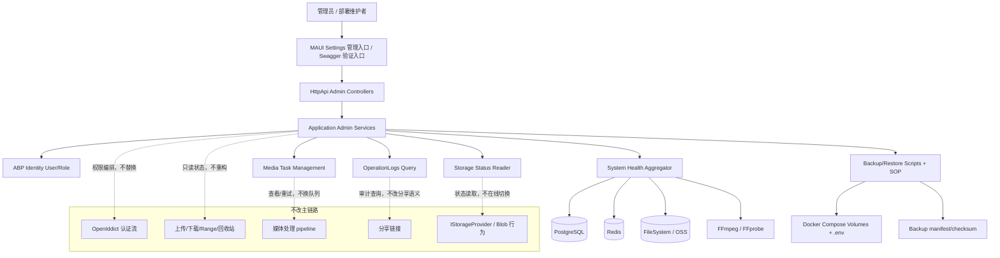

# PrivateCloudDrive V1.3 管理与运维架构边界与技术债务基线

日期：2026-07-09
负责人：Hermes-Architect
文档定位：V1.3 = 管理与运维版的架构边界、组件修改 allowlist、禁止修改清单与技术债务基线。本文约束管理员用户管理、系统健康、存储健康、备份恢复、升级回滚 SOP、操作日志增强、媒体任务管理、Docker Compose 验证与安全门禁的实现边界。

---

## 1. 架构结论

V1.3 的目标不是重做云盘、认证、存储或媒体链路，而是在现有 ABP 单体分层上补齐“非开发者能长期维护私有部署实例”的最小闭环。

推荐方案：

> 维持 ABP 单体分层 + OpenIddict + PostgreSQL + Redis + FileSystem/OSS 存储抽象 + Docker Compose/IIS 部署基线；V1.3 只在 Admin API、健康摘要、只读存储状态、操作日志筛选、备份恢复脚本、升级回滚 SOP、媒体任务管理和部署验证脚本范围内扩展，严禁改认证流、存储抽象、文件上传下载主链路、媒体处理 pipeline 和分享公开访问边界。

整体风险等级：中高。

风险来源：

1. 管理员能力涉及创建/禁用用户、重置密码、容量配额、日志查看与系统配置摘要，越权风险高。
2. 健康页与存储状态天然接触路径、连接串、AccessKey、磁盘信息，脱敏失败会造成信息泄露。
3. 备份/恢复、OSS 迁移、升级回滚直接关系数据可恢复性，脚本默认行为必须保守，不能自动覆盖生产数据。
4. Docker Compose 部署体验改进不能演化成平台替换，V1.3 不引入 Kubernetes、微服务拆分或在线存储切换。

当前 PR 与实现影响范围（2026-07-09 当前 open PR 列表校准）：

- PR #61（已合并）：管理员用户管理、系统健康扩展、操作日志增强、存储配置、媒体任务等后端 API；后续重点转为权限回归、审计证据、前端入口与安全复核。
- PR #62（open）：公开分享密码哈希、限流分区和 secret/log 扫描门禁；V1.3 可复用其门禁，但不得改变分享公开访问语义。
- PR #63（open）：Git 仓库治理规范；属于工程治理文档，不应扩大 V1.3 产品/代码范围。
- PR #64（open）：MAUI Settings 管理入口、分享风险、回收站清理建议；属于 V1.3 P1/P2 前端整合，必须通过角色可见性与主链路回归后才能放行。
- PR #65（open）：分享风险提示 + 回收站清理建议 API；属于 V1.3 P1，不能改变分享公开访问模型和回收站永久删除语义。
- PR #66（open）：Health/Storage 详情分层与脱敏；属于 V1.3 P0，必须满足 live/ready/detail 分层、敏感信息脱敏和测试覆盖。
- PR #67（open / 当前分支）：AdminIdentity 安全契约 + 集成测试；这是 Admin 能力发布闸门的一部分，合并前不得把管理员用户管理视为已安全放行。
- PR #68（open）：DTO 文档注释与实际行为修正；用于收口 `StorageBytes` / health DTO 文档漂移，但不能替代运行时权限、脱敏和容量语义测试。
- 当前分支工作区还包含 `scripts/run-backup-restore-drill.ps1`、备份恢复验证记录、AdminIdentity/OperationLogs 测试变更与大量 `docs/validation/*` 证据文件，均应按本文 P0 门禁验收；临时验证脚本和截图不得进入发布包。

替代方案与取舍：

| 方案 | 结论 | 取舍 |
|---|---|---|
| 独立 Blazor/Web 管理后台 | 后置到 V2 或 V1.3b | 表格管理体验更好，但新增 OAuth client、CORS、部署、构建和安全验收成本，不适合作为 V1.3 P0 |
| 独立 Admin Host/微服务 | 不进入 V1.3 | 部署和认证复杂度上升，当前收益小于风险 |
| 完整监控告警平台 | 后置 | V1.3 只做健康页和脚本探针，不引入 Prometheus/Grafana/告警平台作为必需依赖 |
| 在线 OSS 迁移/存储切换 | 禁止作为 P0 | 存储切换涉及一致性、回滚和密钥治理；V1.3 只允许脚本化迁移、验证与回滚 SOP |

---

## 2. V1.3 范围与架构图

### 2.1 范围边界

| 模块 | V1.3 结论 | 说明 |
|---|---|---|
| 管理员用户管理 | P0，需权限与审计回归 | 创建/禁用用户、重置密码、容量配额；复用 ABP Identity，不改 OpenIddict |
| 系统健康页 | P0 | DB、Redis、Storage、FFmpeg/FFprobe、版本、磁盘空间、API 可达性；详细信息仅 Admin 可见 |
| 存储健康页 | P0/P1 | 只读展示 provider、容量、可用空间、备份边界；不提供在线修改/删除/切换 |
| 备份恢复脚本 | P0 | DB + storage + `.env`/配置边界；默认 dry-run，破坏性恢复必须显式确认 |
| 升级回滚 SOP | P0 文档/SOP | 升级前备份、迁移验证、失败回滚、健康检查；不承诺全自动在线升级 |
| 操作日志增强 | P1 | 管理员按用户、动作、文件、时间筛选；详情脱敏、分页上限明确 |
| 媒体任务管理 | P1 | 管理员查看队列、失败原因、重试；不改媒体处理 pipeline 和队列平台 |
| Docker Compose 部署体验 | P0/P1 | `.env` 校验、健康探针、卷/备份提示、日志脱敏；不改为 Kubernetes |
| 分享风险/回收站清理建议 | P1 | 可做运维提醒，不改变分享访问模型和回收站删除语义 |
| 家庭空间/团队空间/文件夹级权限 | 禁止进入 V1.3 | 改变 owner/tenant 权限模型，属于 V2 候选 |
| AI/OCR/桌面同步/NAS OS | 禁止进入 V1.3 | 范围与运维闭环目标不一致 |

### 2.2 推荐架构图



### 2.3 分层职责

| 层 | V1.3 职责 | 允许变化 | 禁止变化 |
|---|---|---|---|
| MAUI Views/Models | Settings 管理入口、健康摘要、存储状态、无权限降级 | 新增 Admin/SystemHealth/Storage/MediaTasks 页面或 Settings 子页 | 不重做 App 主导航，不影响文件/媒体主链路 |
| HttpApi Controllers | Admin、Health、Storage、OperationLogs、MediaTasks 路由 | 增加受限路由和 Swagger 注释 | 不新增匿名管理接口，不改变 OpenIddict endpoint |
| Application.Contracts | Admin/Operations/SystemStatus DTO、Input、权限常量 | 分页上限、筛选字段、脱敏字段 | 不返回物理绝对路径、连接串、secret、完整环境变量 |
| Application | 权限校验、Identity 编排、健康聚合、日志查询、配置只读摘要 | 复用 ABP Identity/Authorization/Audit | 不直接操作 token 生命周期，不绕过 ABP 权限 |
| Domain | 文件、媒体、日志、配额不变量 | 可补配额、媒体任务状态常量 | 不引入家庭空间/组织架构/文件夹级权限 |
| EntityFrameworkCore | 日志筛选、媒体任务、用户配额相关索引 | 只追加迁移和索引 | 不重排历史迁移，不改主键策略 |
| HttpApi.Host | Health Checks、中间件、Swagger、启动诊断 | live/ready/detail 分层、生产配置校验 | 不放业务管理逻辑，不执行危险恢复 |
| Scripts/Docs | 备份、恢复、升级回滚、Compose 验证 | PASS/WARN/FAIL 输出、dry-run、manifest | 不硬编码密钥，不自动覆盖生产数据 |

---

## 3. V1.3 组件修改 allowlist

### 3.1 允许新增/修改

| 路径/组件 | 可修改范围 | 必须遵守 |
|---|---|---|
| `aspnet-core/src/PrivateCloudDrive.Application.Contracts` | Admin/SystemStatus/Storage/Backup/MediaTasks DTO、Input、接口、权限常量 | DTO 不含密钥、物理绝对路径、连接串；分页默认值和上限明确 |
| `aspnet-core/src/PrivateCloudDrive.Application` | 管理员用户编排、健康聚合、备份状态只读、日志增强、媒体任务查询 | 所有管理接口必须授权；操作写审计；跨租户过滤 |
| `aspnet-core/src/PrivateCloudDrive.HttpApi` | `Controllers/Admin*`、Health/Storage/MediaTasks 路由 | 禁止 `[AllowAnonymous]` 管理接口；Swagger 分组清晰 |
| `aspnet-core/src/PrivateCloudDrive.HttpApi.Host` | ASP.NET Core Health Checks、启动安全校验、配置诊断脱敏 | live/ready/detail 分层；生产环境不放松 Swagger/CORS/HTTPS |
| `aspnet-core/src/PrivateCloudDrive.EntityFrameworkCore` | 日志筛选、配额、媒体任务索引或迁移 | 只追加迁移；必须可从旧库升级 |
| `aspnet-core/test/*` | Admin 权限、Health、Storage、Backup、OperationLogs、MediaTasks 测试 | 覆盖普通用户 403、跨租户、敏感值脱敏、分页上限；测试凭据不触发 secret gate |
| `maui/PrivateCloudDrive.App/Views/SettingsPage*` | 运维入口卡片、健康摘要、备份提醒、管理员入口 | 普通用户隐藏管理入口；403 文案清晰 |
| `maui/PrivateCloudDrive.App/Services/CloudDriveApiClient*` | Admin API client、错误映射、权限不足提示 | AuthExpired/token refresh 处理保持一致 |
| `scripts/backup-*`、`scripts/restore-*`、`scripts/verify-*` | 备份/恢复/健康/Docker 验证脚本 | 输出 PASS/WARN/FAIL；不打印密钥；破坏性操作显式确认 |
| `docs/deployment.md`、`docs/testing.md`、`docs/backup-restore-guide.md`、`docs/release-notes-v1.3.md` | 部署、备份恢复、升级回滚、验收说明 | 每条危险操作要有前置备份、验证和回滚 |

### 3.2 允许优化但不允许替换

| 组件 | 可优化 | 不允许替换 |
|---|---|---|
| 管理 API | 增加 Admin 路由、权限、DTO、审计 | 不拆独立微服务，不新增独立认证服务器 |
| 管理前端 | MAUI Settings 管理页；Swagger/API 作为验证入口 | 不把 V1.3 P0 绑定到新 Web 管理端上线 |
| Health Checks | ASP.NET Core Health Checks + 现有系统健康摘要 | 不用未鉴权详情端点替代分层健康检查 |
| 备份脚本 | PowerShell 优先、manifest/checksum、dry-run | 不把备份恢复写进文件服务，不自动覆盖生产数据 |
| 操作日志 | 过滤、分页、脱敏、管理员视角 | 不展示原始请求体、token、密钥或完整异常 |
| 存储状态 | 展示 provider、容量、可用空间、备份范围 | 不做在线 provider 切换或自动迁移作为 P0 |
| Docker Compose | `.env` 校验、卷说明、健康检查、启动验证 | 不迁移 Kubernetes/Helm/Nomad，不改变默认服务拓扑 |

---

## 4. 明确“不允许改”清单

| 不允许改项 | 原因 | 后置版本 |
|---|---|---|
| OpenIddict 认证流、token 生命周期、endpoint 路由 | 高安全风险，会影响 MAUI 登录、刷新和禁用用户后的行为 | 不建议 |
| ABP Identity 数据模型大改或自研用户体系 | PR #61 已基于 ABP Identity 编排，重做风险高 | V2 专题评估 |
| `IStorageProvider` / Blob 行为 / 默认 FileSystem 语义 | 备份和 OSS 迁移应外挂，不破坏现有数据访问 | V2 多存储专题 |
| 文件上传/下载/HTTP Range 主链路 | 运维版本不能破坏已发布核心云盘能力 | 不进入 V1.3 |
| 回收站/永久删除语义 | 数据安全边界已固化，管理端不能绕过二次确认 | 不进入 V1.3 |
| 媒体处理 pipeline 和队列平台 | V1.3 只查看/重试，不重构处理器 | V2 媒体任务专题 |
| 分享公开访问边界 | 分享链路涉及匿名访问、密码、限流，V1.3 只增强审计/风险提示 | V1.3b/V2 |
| 历史数据库迁移顺序 | 重排迁移破坏升级路径和回滚可信度 | 禁止 |
| 家庭空间/团队空间/文件夹级权限 | 改变 owner/tenant 权限模型 | V2 |
| Docker Compose/IIS 基础发布模型 | V1.3 是部署体验改进，不做平台替换 | V2+ |
| NAS OS、RAID、磁盘池、SMB/NFS | 偏离移动优先私有云盘定位 | Not Now |

---

## 5. 技术债务评分

评分规则：

- P0：阻塞 V1.3 发布，或存在越权、泄密、数据丢失、认证破坏、不可恢复升级高风险。
- P1：不一定阻塞发布，但显著影响运维可信度，需在 V1.3 前完成或写入已知限制。
- P2：后续优化，不阻塞 V1.3。

| 编号 | 技术债务 | 优先级 | 影响范围 | 当前证据/判断 | 推荐处理 | 负责人 |
|---|---|---|---|---|---|---|
| V13-TD-01 | Admin 权限与审计回归需以 PR #61/#67 固化 | P0 | 用户管理、安全、审计 | 后端已实现，但发布前必须证明普通用户 403、管理员操作审计、跨租户不可见 | 补/复跑 Admin 权限集成测试与安全复核 | backend-eng + security-reviewer |
| V13-TD-02 | `IsCurrentUserAdmin()` 硬编码 `admin` 角色字符串 | P0 | Admin 权限、安全契约 | Copilot review thread 指出硬编码角色名会绕过 ABP 权限常量治理 | 改为 ABP 权限/角色常量或授权策略，并用 PR #67 安全契约固化 | backend-eng |
| V13-TD-03 | Secret/log 扫描门禁必须保持 0 阻塞项 | P0 | 测试代码、验证证据、公开仓库安全门禁 | 已知 `EfCoreAdminIdentityUserAppServiceTests.cs` 曾触发 6 处 `SECRET_ASSIGNMENT`；Release Gate 曾显示旧 `docs/validation/*` 与登录脚本存在 28 个 findings；本次复扫已回到 0 findings，但新增验证证据仍有回归风险 | 测试凭据改为工厂/脱敏常量；旧验证证据脱敏或移出发布包；调试脚本不得进入发布包；扫描规则例外必须可解释、有 owner | backend-eng + devops-eng + security-reviewer |
| V13-TD-04 | Health/Storage 详情脱敏仍是高风险 | P0 | 系统健康、存储健康、日志 | 健康/存储会接触路径、连接串、OSS 配置和工具错误；PR #66 正在收口分层和脱敏 | 建立统一脱敏器与测试样本，覆盖路径、connection string、token、AccessKey；release gate 以 scan 0 或可解释例外为准 | backend-eng + security-reviewer |
| V13-TD-05 | 备份恢复与升级回滚演练证据需与脚本保持同步 | P0 | 数据安全、升级、回滚 | 备份脚本/指南存在，但破坏性恢复和升级回滚不可凭文档口头放行 | 补 dry-run/演练记录、恢复前确认、升级前备份、健康验证 SOP；临时截图/脚本不得污染发布包 | devops-eng |
| V13-TD-06 | Docker Compose 默认配置与生产安全校验不足 | P0 | 部署安全、可维护性 | `.env`、默认密码、PUBLIC_URL、Swagger/CORS、volume 备份边界都影响真实部署 | 强化 `verify-local-stack.ps1` / `verify-health.ps1` 与部署文档，不打印密钥 | devops-eng + backend-eng |
| V13-TD-07 | NuGet/依赖漏洞基线需要发布门禁化 | P0 | 安全、CI、公开仓库 | Release Gate 指出 Scriban/Microsoft.OpenApi 登记文档与实际 `.csproj` 版本不一致，存在“声称已升级但代码未升级”的风险 | 由后端复跑漏洞扫描；实际升级并验证，或更正为带 owner/期限/规避措施的风险接受；Release Gate 不得静默忽略高危 | backend-eng + security-reviewer |
| V13-TD-08 | `FileNodeId` 过滤条件从未匹配 | P1 | 操作日志、审计定位 | Copilot review thread 指出过滤字段与持久化/查询字段不一致 | 对齐 OperationLog 文件字段模型，补集成测试覆盖“按文件定位日志” | backend-eng |
| V13-TD-09 | `StorageBytes` 文档与实际赋值不一致 | P1 | 管理员用户容量、前端展示 | 文档语义与实际写入/返回值不一致会导致容量配额误判 | 明确单位和含义（used/quota/available），修正文档或 DTO 命名 | backend-eng |
| V13-TD-10 | `StorageProvider` 只允许 FileSystem/AliyunOss，和 V1.3 OSS/MinIO 文档存在漂移 | P1 | 存储状态、OSS 迁移、部署文档 | Provider allowlist 过窄会让 MinIO/S3 规划与实现不一致 | 明确 V1.3 支持矩阵：FileSystem 默认、AliyunOss 可选、MinIO/S3 为后置或兼容别名 | backend-eng + devops-eng |
| V13-TD-11 | 操作日志增强查询可能存在性能与隐私边界 | P1 | 审计日志页 | 管理员组合筛选可能跨源聚合，若内存过滤/分页不当会慢或泄露 | 限制时间范围和 MaxResultCount，尽量下推过滤，详情参数脱敏 | backend-eng |
| V13-TD-12 | MAUI Settings 管理入口与无权限降级体验未完全收口 | P1 | 移动端运维体验 | V1.3 后端能力多于当前移动入口；普通用户不应看到管理入口 | 管理区按角色展示；403 显示“需要管理员权限” | mobile-eng |
| V13-TD-13 | 媒体任务管理重试策略需防止重试风暴 | P1 | 媒体处理、队列、存储 | 管理员全局重试容易批量触发 FFmpeg/IO 压力 | 单任务间隔、批量上限、失败次数阈值、错误脱敏 | backend-eng |
| V13-TD-14 | Blazor/Web 管理端范围膨胀风险 | P2 | 交付节奏 | V1.3 P0 不需要独立 Web 管理端 | 作为 V2 候选，不阻塞 MAUI/Swagger/API 入口 | architect + pm |
| V13-TD-15 | 完整监控告警缺失 | P2 | 长期运维 | V1.3 只做健康页，不做告警平台 | 后续接入日志导出/指标平台 | sre-observability |
| V13-TD-16 | 自动化在线升级/回滚尚未产品化 | P2 | 升级体验 | 当前更适合 SOP + 手工脚本 | 先文档化，自动化后置 | devops-eng |

---

## 6. 必须修复/固化的技术债务项目

### V13-FIX-01：Admin 权限、审计与安全契约回归

推荐负责人：包后端 / backend-eng
协作复核：安安全 / security-reviewer
风险等级：P0

目标：以 PR #61 的管理员用户管理实现与 PR #67 的安全契约为基线，证明 Admin API 不被普通用户访问，管理员操作可追踪，禁用/启用/重置密码不会破坏文件数据，且权限实现不依赖硬编码 `admin` 字符串或测试硬编码密码。

范围：

- 复跑或补充 Admin 用户管理集成测试。
- 普通用户调用 Admin API 返回 403。
- 管理员不能禁用自己；禁用用户无法继续登录或刷新会话。
- 创建/禁用/启用/重置密码/配额变更写入审计日志。
- 跨租户 userId 不可见或被租户过滤。
- 移除或解释 `EfCoreAdminIdentityUserAppServiceTests.cs` 中触发 `SECRET_ASSIGNMENT` 的 6 处硬编码测试密码；同时清理或隔离旧 `docs/validation/*`、登录模拟脚本和调试脚本中的历史 secret scan findings。
- `IsCurrentUserAdmin()` 不直接比较裸字符串 `admin`；改用 ABP 角色/权限常量、授权策略或集中安全契约。

验收标准：

- Admin 权限测试通过。
- 操作日志中能查询到管理动作，日志不包含密码/token。
- 禁用用户不删除其文件、分享、媒体记录。
- PR #67 或等效测试覆盖普通用户 403、管理员自禁用、硬编码角色字符串回归和 secret scan 0 阻塞项；若历史验证证据保留在仓库中，必须全部脱敏或纳入有 owner 的例外清单。

回滚方案：

- 若权限或禁用会话无法过审，隐藏用户管理入口，仅保留只读系统健康和备份文档。

### V13-FIX-02：Health/Storage 详情分层与脱敏

推荐负责人：包后端 / backend-eng
协作复核：安安全 / security-reviewer
风险等级：P0

目标：部署系统能判断 live/ready，管理员能看到可操作健康摘要，但任何端点都不泄露密钥、连接串、物理绝对路径、OSS AccessKey 或完整堆栈。

范围：

- `/health/live` 只表示进程存活。
- `/health/ready` 只返回低敏依赖 readiness。
- Admin detail/summary 才返回组件详情和修复建议。
- 统一脱敏器覆盖 Windows/Linux 路径、connection string、token、AccessKey。
- Storage 页只展示 provider、容量、可用空间和脱敏路径。

验收标准：

- 单元/集成测试覆盖健康端点与脱敏样本。
- FFmpeg/Redis/Storage 不可用时返回 Degraded/FAIL，不导致 API 进程无法启动。
- 响应中 secret scan 0 findings。

回滚方案：

- 若 detail 脱敏不过审，只开放 live/ready 和用户级健康摘要，隐藏 Admin detail。

### V13-FIX-03：备份恢复 + 升级回滚 SOP 演练基线

推荐负责人：戴运维 / devops-eng
协作：包后端 / backend-eng
风险等级：P0

目标：部署管理员可以按文档完成 DB、storage、配置的完整备份，知道恢复前置条件，并能在升级失败时按 SOP 回滚。

范围：

- 固化 `backup-local-stack.ps1`、`restore-local-stack.ps1`、`run-backup-restore-drill.ps1` 的使用方式。
- 备份输出 manifest/checksum。
- restore 默认 dry-run，破坏性恢复必须显式确认。
- 升级 SOP 包含：升级前备份、停止写入/维护窗口、迁移、健康验证、失败回滚、日志留存。
- 文档明确 FileSystem、OSS、`.env`/appsettings、OpenIddict key/cert 的备份边界。

验收标准：

- 至少一次 dry-run 演练记录进入 `docs/validation/`。
- 恢复 SOP 明确“仅 DB 或仅 storage 不可恢复”。
- 脚本输出不包含 DB 密码、OSS access key、OAuth client secret。

回滚方案：

- 若自动 restore 风险高，V1.3 只交付 backup + verify + 手工 restore SOP，不交付自动 restore。

### V13-FIX-04：Docker Compose 部署体验安全化

推荐负责人：戴运维 / devops-eng
协作：包后端 / backend-eng
风险等级：P0

目标：让非开发者能通过脚本判断 Docker Compose 栈是否可用，并在生产前发现默认密码、PUBLIC_URL、Swagger、volume、storage、FFmpeg 等配置风险。

范围：

- `verify-local-stack.ps1` / `verify-docker-stack.ps1` / `verify-health.ps1` 输出 PASS/WARN/FAIL。
- 检查 Docker CLI、compose config、postgres/redis/api/media-worker/db-migrator、Swagger/API、storage volume、FFmpeg/FFprobe。
- `.env` 缺失或默认值给 WARN/FAIL；不打印敏感值。
- 文档说明 storage volume、PostgreSQL volume、`.env` 都是备份对象。

验收标准：

- 干净环境下脚本失败原因可读。
- 生产危险默认值有明确 WARN/FAIL。
- Docker Compose 改进不改变服务拓扑和端口基线，除非 release-manager 批准。

回滚方案：

- 若脚本误报过多，Release Gate 暂以人工 checklist 替代，但保留不打印密钥原则。

### V13-FIX-05：依赖漏洞与发布门禁登记

推荐负责人：包后端 / backend-eng
协作复核：安安全 / security-reviewer
风险等级：P0

目标：V1.3 发布前，已知高危依赖漏洞必须升级、规避或形成带 owner 的风险接受记录。

范围：

- 复跑 `dotnet list package --vulnerable` / `dotnet list package --outdated`，覆盖 Host、Application、测试项目、MAUI 项目。
- 对高危项给出：包名、当前版本、建议版本、影响范围、是否可升级、阻断/接受结论。
- 对登记文档和 `.csproj` 真实版本做一致性校验；不得出现“登记声称已升级、代码仍停留旧版本”的状态。
- 升级后至少跑后端目标测试与 MAUI restore/build smoke；不能升级时写入 Release Gate 风险接受。

验收标准：

- 高危漏洞 0 个未解释项。
- CI/Release Gate 能区分“新引入高危”和“已登记暂缓高危”。
- 风险接受有 owner、期限和规避措施。

回滚方案：

- 依赖升级引发回归时回滚依赖版本，但保留风险登记和外部暴露面限制；不得静默忽略。

---

## 7. 发布门禁与验收标准

| 闸门 | 标准 | 责任人 |
|---|---|---|
| G0 范围冻结 | 只做管理、健康、备份、存储状态、日志、媒体任务、部署验证；不改认证/存储/上传/分享主链路 | architect + pm |
| G1 Admin 权限 | Admin API 独立权限；普通用户 403；跨租户不可见；管理操作有审计；无硬编码 `admin` 权限判断和未解释测试密码扫描项 | backend-eng + security-reviewer |
| G2 健康与脱敏 | live/ready/detail 分层；健康和存储详情不泄露路径、连接串、secret | backend-eng + security-reviewer |
| G3 备份恢复 | DB + storage + 配置备份脚本/SOP 可跑；manifest/checksum 可验证；restore 默认 dry-run | devops-eng |
| G4 升级回滚 | 升级前备份、迁移、健康验证、失败回滚 SOP 完整 | devops-eng + release-manager |
| G5 Docker Compose 验证 | compose config、服务可达性、volume、FFmpeg、`.env` 检查有 PASS/WARN/FAIL | devops-eng |
| G6 依赖安全 | 高危 NuGet/依赖告警已升级、规避或登记风险接受；登记文档必须与 `.csproj` 实际版本一致 | backend-eng + security-reviewer |
| G7 MAUI 管理入口 | Settings 运维入口角色可见性正确；无权限降级清晰；不影响文件/媒体主链路 | mobile-eng + qa-eng |
| G8 文档完整 | deployment/testing/backup/release notes/known limitations 同步 | pm + release-manager |

放行标准：

```text
P0 = 0 个无规避阻塞项
P1 = 可带 WARN 放行，但必须有 owner、后置版本、用户可见说明和回滚方式
P2 = 记录到路线图或已知限制，不阻塞 V1.3
```

---

## 8. 下游协作建议

| 中文姓名 + 岗位 | profile | 事项 | 优先级 | 交付物 |
|---|---|---|---|---|
| 包后端 / Backend Engineer | backend-eng | Admin 权限与审计回归、硬编码角色清理、Health/Storage 脱敏、依赖漏洞登记 | P0 | 后端测试、漏洞清单、修复 PR |
| 戴运维 / DevOps Engineer | devops-eng | 备份恢复演练、升级回滚 SOP、Docker Compose 验证脚本安全化、secret gate 解释性 | P0 | `docs/validation/*`、SOP、脚本修复 |
| 安安全 / Security Reviewer | security-reviewer | Admin 越权、健康详情脱敏、依赖风险接受复核 | P0 | 安全复核结论与阻塞项 |
| 莫移动 / Mobile Engineer | mobile-eng | MAUI Settings 管理入口、健康/存储/媒体任务入口、403 降级体验 | P1 | 页面、API client、构建结果 |
| 齐 QA / QA Engineer | qa-eng | 管理员/普通用户矩阵、备份演练、健康页、Docker Compose 验收 | P1 | PASS/WARN/FAIL 验收记录 |
| 雷发布 / Release Manager | release-manager | V1.3 Release Gate、已知限制、风险接受记录 | P1 | 发布门禁清单与放行建议 |

---

## 9. 本次基线验收记录

本次架构基线任务完成项：

- 已输出 `docs/architecture-v1.3-boundary.md`。
- 已阅读并对齐：
  - `docs/product-roadmap-next.md` §4.4 V1.3 管理与运维
  - `docs/product-planning-hub.md` §6 Next: V1.3 运维与规划版
  - `docs/release-plan-v1.3.md`
  - `docs/release-gate-v1.3-assessment.md`
  - 当前 open PR 影响范围：PR #62、#63、#64、#65、#66、#67、#68
- 已明确 V1.3 组件修改 allowlist 与禁止修改清单。
- 已将技术债按 P0/P1/P2 评分，并将必须修复项目压缩为 5 项。
- 已对 Copilot review / secret gate / release gate 已知问题建档：硬编码 `admin` 角色、`FileNodeId` 过滤、`StorageBytes` 语义、`StorageProvider` allowlist、测试硬编码密码、历史验证证据/调试脚本 secret scan findings、依赖漏洞登记与 `.csproj` 版本不一致。

建议验证命令：

```bash
git diff --check -- docs/architecture-v1.3-boundary.md
python scripts/secret-log-scan.py --include-working-tree
```
