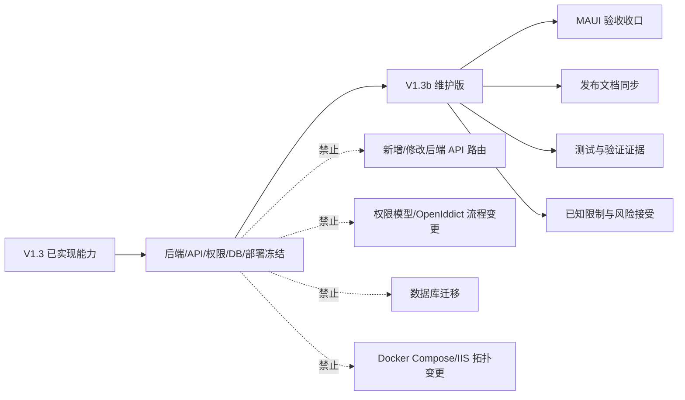

# PrivateCloudDrive V1.3b 架构边界与技术债基线评估

| 元数据 | 值 |
|---|---|
| 文档版本 | 1.0 |
| 日期 | 2026-07-11 |
| 负责人 | Hermes-Architect |
| 版本定位 | V1.3 维护版 / 移动端验收收口版 |
| 参考基线 | `docs/release-plan-v1.3.md`、`docs/dependency-vulnerability-register-v1.3.md`、`docs/known-limitations.md`、`docs/testing.md`、Kanban 任务 `t_81f982c4` 的 V1.3b 边界评估 |

> 说明：当前工作区未检出任务描述中提到的 `docs/release-plan-v1.3b.md`、`docs/scenario-matrix-v1.3b.md`、`docs/release-gate-v1.3-assessment.md` 与 `docs/architecture-v1.3-boundary.md`。本文件按当前仓库可见的 V1.3 发布计划、依赖漏洞登记、测试/已知限制文档，以及已完成的 V1.3b Kanban 评估结论建立 V1.3b 架构边界。

---

## 1. 架构结论

V1.3b 不应被定义为“新增能力版本”，而应被定义为 V1.3 的维护与验收收口版本。

### 结论

- 推荐方案：冻结后端能力边界，只允许 MAUI 端验收收口、发布文档同步、已知限制同步、测试/验证文档补齐。
- 风险等级：中低。只要不触碰后端 API、权限模型、数据库迁移和 Docker 部署拓扑，V1.3b 不会引入新的系统级架构风险。
- 发布目标：将 V1.3 已完成能力稳定交付给用户，而不是扩大功能范围。
- 核心原则：V1.3b 的所有改动都必须能被解释为“验收、说明、规避、脱敏、放行证据”，不能被解释为“新平台能力”。

---

## 2. 组件修改白名单

### 2.1 允许修改的组件

| 组件 | 允许修改范围 | 边界条件 | 负责人建议 | 风险 |
|---|---|---|---|---|
| `maui/PrivateCloudDrive.App/` | V1.3 已有管理入口、分享风险提示、回收站清理建议、Settings 导航的显示修正与验收缺陷修复 | 不新增后端调用契约；不新增登录/授权流程；不引入新权限判断来源 | mobile-eng | 中 |
| `docs/known-limitations.md` | 追加/同步 V1.3/V1.3b 已知限制、风险接受、规避说明 | 不删除历史限制；不掩盖 P0/P1 风险；不得记录 secret/token/私有 URL | pm / docs-writer | 低 |
| `docs/release-notes*.md` | 同步 V1.3b 发布说明、已知限制、验证结果、未做事项 | 不承诺未验证功能；不描述未交付平台为“已支持” | pm / release-manager | 低 |
| `docs/testing.md` | 增加 V1.3b 验收矩阵、手动验收步骤、证据要求、验证命令 | 证据必须脱敏；命令应区分 Windows PowerShell、Git Bash、CI 环境 | qa-eng | 低 |
| `docs/validation/` | 增加 V1.3b 验收记录、截图索引、PASS/WARN/FAIL 结果 | 禁止真实密码、token、连接串、私有文件内容、完整私有 URL | qa-eng / security-reviewer | 中低 |
| `docs/dependency-vulnerability-register-v1.3.md` | 仅更新依赖风险接受复审状态、V1.3b 目标处理结果 | 不在 V1.3b 内扩大框架升级范围；如需升级必须另开 backend/devops 任务 | backend-eng / devops-eng | 中 |

### 2.2 可改但需特别审查的组件

| 组件 | 条件 | 审查要求 |
|---|---|---|
| MAUI API client / 页面代码 | 仅为修正现有 V1.3 管理入口或移动端展示问题 | 必须证明未新增后端路由依赖；必须执行 MAUI 构建验证或记录阻塞原因 |
| 测试项目 | 仅补充现有能力的回归/安全契约测试 | 不改变生产行为；若引入测试依赖，需要更新漏洞登记 |
| CI Security Gate | 仅做门禁表达、扫描路径或脱敏规则修正 | 不降低 secret 扫描、安全扫描、依赖漏洞门槛 |

### 2.3 不允许修改的组件

| 组件 | 禁止事项 | 原因 |
|---|---|---|
| 后端 API 路由 / Controller 契约 | 禁止新增、重命名、删除或改变返回结构 | 会破坏 V1.3 已验收范围，并带来客户端兼容风险 |
| 权限模型 / Role / Policy / OpenIddict | 禁止新增角色、放宽授权、改变 token 流程 | 鉴权授权属于高风险边界，维护版不应触碰 |
| 数据库迁移 / 实体结构 | 禁止新增 migration、表、列、索引语义变更 | 会放大发布、回滚、数据迁移风险 |
| Docker Compose / 部署拓扑 | 禁止新增服务、端口、volume、网络依赖 | 会改变部署验收基线和用户升级成本 |
| 存储抽象 / 文件主链路 | 禁止改上传、下载、预览、分享公开访问、Blob 映射 | 涉及数据安全和用户文件可访问性 |
| 媒体处理 pipeline | 禁止改变队列、状态机、FFmpeg 调用、重试语义 | V1.3b 只验收展示和文档，不改处理链路 |
| 备份/恢复破坏性脚本 | 禁止改变默认恢复目标或自动执行破坏性恢复 | 数据破坏风险高，必须独立任务和人工授权 |

---

## 3. “不改动”清单

以下边界在 V1.3b 期间冻结，除非用户明确批准升级为新版本范围：

1. 不新增后端 API 路由。
2. 不修改既有 API URL、HTTP method、DTO 字段语义、分页/排序契约。
3. 不修改 `admin` 权限模型、ABP Identity 权限、OpenIddict 登录/刷新 token 流程。
4. 不新增数据库 migration，不改实体关系，不改租户隔离字段语义。
5. 不修改 Docker Compose 服务拓扑、端口、volume、网络、健康检查主链路。
6. 不修改 IIS/生产部署拓扑，不引入新的外部中间件。
7. 不修改文件上传、下载、缩略图、公开分享访问、Range 响应主链路。
8. 不修改媒体处理后台任务状态机、FFmpeg/FFprobe 调用链路。
9. 不引入 Elasticsearch/Meilisearch、消息队列、对象存储迁移自动化等新基础设施。
10. 不将 V2 候选能力提前进入 V1.3b，包括 AI 搜索、智能相册、桌面同步、企业审批、Office 协作、iOS 首版。
11. 不降低安全门禁，不以“维护版”为理由绕过 secret/log scan、依赖漏洞登记和发布证据脱敏。

---

## 4. 技术债评分

### 4.1 评分标准

| 等级 | 判定标准 | V1.3b 处理原则 |
|---|---|---|
| P0 | 会阻断发布，或导致越权、数据丢失、生产部署不可用 | 必须修复或阻断发布 |
| P1 | 不一定阻断发布，但影响安全合规、验收可信度或维护成本 | 必须登记，有 owner，有规避方案；能小修则修 |
| P2 | 不阻断发布，主要影响体验、自动化程度或后续维护效率 | 可接受，但需进入已知限制/后续计划 |

### 4.2 V1.3/V1.3b 遗留技术债

| 编号 | 技术债 | 等级 | 当前结论 | 接受/修复策略 | Owner |
|---|---|:---:|---|---|---|
| TD-V13B-01 | Scriban/ABP 依赖版本锁定风险 | P1 | 当前仓库登记显示 ABP 已升级至 10.5.0，并以 Scriban 7.2.5 直接覆盖解决已知 Scriban CVE；V1.3b 不继续扩大框架升级范围 | 风险接受：V1.3b 只复核 `dotnet list package --vulnerable`，不做新一轮 ABP 大版本升级；若发现新 CVE，另开 backend/devops 任务 | backend-eng |
| TD-V13B-02 | SQLitePCLRaw.lib.e_sqlite3 测试依赖漏洞接受项 | P1 | 仅测试项目引用，生产 PostgreSQL 不加载；已在依赖漏洞登记表中登记 | 风险接受到 V1.3b：测试环境不公网暴露，不持久化敏感数据；发布前复审一次 | backend-eng |
| TD-V13B-03 | 旧验证文件与截图证据脱敏维护 | P1 | V1.3/V1.3b 发布证据容易泄漏 token、私有 URL、bucket/object key、真实文件名 | 必须维持脱敏策略；新增 validation 文件需通过 secret/log scan；不追求重写历史证据，但不得新增泄漏 | qa-eng / security-reviewer |
| TD-V13B-04 | MAUI 端管理入口验收依赖手工截图 | P2 | 当前移动端 UI 自动化不足，验收可信度依赖人工记录 | V1.3b 可接受；必须在 `docs/testing.md` 写清设备、构建、截图清单和 WARN 项 | mobile-eng / qa-eng |
| TD-V13B-05 | `known-limitations.md`、release notes、testing 三处口径同步靠人工 | P2 | 文档漂移会导致用户预期错误，但不直接破坏系统 | V1.3b 放行前做一次交叉核对；后续可由 docs-writer 建立模板化检查 | pm / docs-writer |
| TD-V13B-06 | 故障诊断/系统状态部分页面可能为静态说明 | P2 | 不应被用户误认为实时系统诊断 | 在发布说明和已知限制中声明；避免在 UI 文案中承诺实时诊断 | mobile-eng / pm |

### 4.3 风险接受结论

- P0：当前架构评估未发现必须通过 V1.3b 修改后端/DB/部署才能解决的 P0 架构问题。
- P1：依赖风险与证据脱敏属于 V1.3b 发布前必须复审项，但不要求扩大功能范围。
- P2：移动端自动化、文档同步和静态诊断说明可作为已知限制接受，不阻塞维护版发布。

---

## 5. 推荐方案与替代方案

### 推荐方案：冻结后端，收口移动端和发布证据

| 维度 | 决策 |
|---|---|
| API | 冻结，不新增、不改名、不改变 DTO 语义 |
| 权限 | 冻结，维持 admin-only 管理能力边界 |
| 数据库 | 冻结，不新增 migration |
| 部署 | 冻结，不改 Docker/IIS 主链路 |
| MAUI | 只做现有能力入口、文案、展示、验收缺陷修复 |
| 文档 | 补齐 V1.3b 边界、已知限制、测试矩阵、release notes |
| 安全 | 复核依赖漏洞登记、secret/log scan、证据脱敏 |

优点：交付成本低、回归面小、符合维护版定位。
缺点：不能解决所有 P2 自动化与文档流程问题。

### 替代方案 A：V1.3b 包含轻量后端修复

仅在发现 P0/P1 安全缺陷时考虑，例如 admin API 越权、敏感信息泄漏、生产依赖高危 CVE。

- 使用条件：有可复现证据，且不修复会阻断发布。
- 风险：需要重新执行后端 build/test、安全复核和 MAUI 回归。
- 回滚：撤销后端提交，回到 V1.3 已验收 API 基线。

### 替代方案 B：推迟 V1.3b，合并为 V1.4

当需求开始涉及新 API、新表、新部署服务或新客户端平台时，应停止 V1.3b 维护版路线，改为 V1.4 规划。

- 使用条件：范围超过文档/验收/移动端展示修正。
- 风险：发布周期延长。
- 收益：可以重新设计架构边界，不被维护版冻结约束。

---

## 6. 必修复规格（供下游执行）

> 这些任务是“发布前必须有结论”的规格，不代表全部都要在本任务中改代码。若进入执行，应由对应 profile 独立领取，并按本文件边界执行。

### FIX-V13B-01：依赖漏洞登记复审

| 字段 | 说明 |
|---|---|
| Profile | backend-eng |
| 优先级 | P1 |
| 范围 | 复跑生产项目与测试项目 `dotnet list package --vulnerable --include-transitive` |
| 必须输出 | 更新或确认 `docs/dependency-vulnerability-register-v1.3.md` 中 Scriban、Microsoft.OpenApi、SQLitePCLRaw 风险状态 |
| 禁止 | 不因复审而顺手升级 ABP 大版本；不修改业务代码 |
| 验收 | 生产项目无未登记 High/Critical；测试项目风险接受项有 owner、影响范围、规避措施 |

### FIX-V13B-02：V1.3b 发布证据脱敏检查

| 字段 | 说明 |
|---|---|
| Profile | security-reviewer |
| 优先级 | P1 |
| 范围 | `docs/validation/`、release notes、known limitations、测试报告、截图索引 |
| 必须输出 | secret/log scan 结果；人工抽查结论；发现项修复清单 |
| 禁止 | 禁止把真实 token、cookie、AppSecret、连接串、bucket/object key、真实私密文件内容写入文档 |
| 验收 | 新增发布证据中无敏感凭据；如存在疑似项必须有误报说明或修复记录 |

### FIX-V13B-03：MAUI V1.3 管理入口验收矩阵

| 字段 | 说明 |
|---|---|
| Profile | qa-eng / mobile-eng |
| 优先级 | P1 |
| 范围 | Settings 管理入口、分享风险提示、回收站清理建议、后台任务/系统日志入口、错误态文案 |
| 必须输出 | `docs/testing.md` 或 `docs/validation/` 下的 AC-V1.3b 验收结果，使用 PASS/WARN/FAIL |
| 禁止 | 不新增后端接口；不修改登录/权限模型；不把截图中的真实隐私内容提交 |
| 验收 | Android 或 Windows MAUI 构建可验证；每个 WARN 有可理解规避说明 |

### FIX-V13B-04：发布文档一致性核对

| 字段 | 说明 |
|---|---|
| Profile | pm / docs-writer |
| 优先级 | P1 |
| 范围 | `known-limitations.md`、release notes、`testing.md`、release plan 中 V1.3/V1.3b 口径 |
| 必须输出 | 一致性核对表：功能范围、已知限制、Not Now、验证命令、放行标准 |
| 禁止 | 不承诺未验证平台；不把 P2 限制描述成已解决 |
| 验收 | 用户从 release notes 看到的能力与 testing/known-limitations 完全一致 |

### FIX-V13B-05：后端冻结边界保护

| 字段 | 说明 |
|---|---|
| Profile | backend-eng |
| 优先级 | P1 |
| 范围 | 对 V1.3b 分支 diff 做 API/DB/权限冻结检查 |
| 必须输出 | 确认没有新增 Controller route、没有 migration、没有 OpenIddict/Role/Policy 变更、没有 Docker Compose 变更 |
| 禁止 | 以“修小问题”为名调整 API 契约 |
| 验收 | `git diff --name-only` 与必要的 route/migration 检查证明 V1.3b 只包含白名单范围内改动 |

---

## 7. 改造步骤

1. 建立本文件作为 V1.3b 架构边界基线。
2. 由 PM/QA 将 V1.3b 验收项映射到 `docs/testing.md` 或 `docs/validation/`。
3. 由 security-reviewer 复核新增证据和 release notes 的脱敏状态。
4. 由 backend-eng 只做冻结边界检查和依赖漏洞复审，不主动扩大后端实现范围。
5. 由 mobile-eng/qa-eng 回填 MAUI 管理入口验收结果。
6. 发布前由 release-manager 核对：本文件、known limitations、testing、release notes 四处口径一致。

---

## 8. 回滚方案

| 变更类型 | 回滚方案 |
|---|---|
| 文档新增/修正 | 直接 revert 对应 markdown 文件；不影响运行时 |
| MAUI 展示修正 | revert MAUI 相关提交，回到 V1.3 已验收 UI；保留已知限制说明 |
| 依赖复审文档更新 | revert 文档或追加更正记录；不得删除历史风险接受依据 |
| 误触后端 API/DB/权限 | 必须立即回滚相关代码提交，重新执行后端 build/test 和安全复核 |
| 误触 Docker/IIS 部署 | 回滚部署配置，重新执行 `docker compose config` 或对应 IIS 部署检查 |

---

## 9. 验收标准

V1.3b 架构边界通过标准：

- [ ] `docs/architecture-v1.3b-boundary.md` 存在并被 release notes 或 release plan 引用。
- [ ] 组件修改白名单和禁止清单已被下游执行任务采用。
- [ ] V1.3b diff 未新增后端 API、权限模型、数据库迁移或 Docker Compose 变更。
- [ ] P1 技术债有 owner、风险接受或修复结论。
- [ ] 新增验证证据完成脱敏检查。
- [ ] `known-limitations.md`、release notes、`testing.md` 与本文件口径一致。
- [ ] MAUI 管理入口、分享风险提示、回收站清理建议等 V1.3b 验收项以 PASS/WARN/FAIL 记录。

---

## 10. 最终判定

V1.3b 可以按“维护版 + 验收收口版”推进。架构上不建议新增后端能力、数据库结构、部署服务或认证授权改动。若后续出现必须修改后端/DB/权限/部署的需求，应停止作为 V1.3b 处理，改由 V1.4 或安全热修任务承接。
