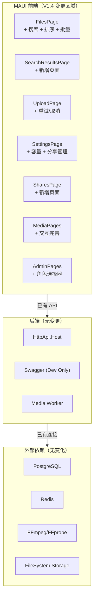

# PrivateCloudDrive V1.4 架构边界与技术债务基线

| 文档版本 | 日期 | 负责人 |
|:-------:|:----:|:------:|
| 1.0 | 2026-07-12 | 产品总监 (pm) |
| 适用范围 | 体验增强版 UX Polish & KNFix | |

---

## 1. 架构边界声明

### 1.1 核心原则

> **V1.4 不改变架构边界。所有变更限制在 MAUI 前端层。**

| 层 | V1.4 是否变更 | 说明 |
|:--:|:------------:|------|
| 数据库 (PostgreSQL) | ❌ 不变更 | 不新增表、不新增字段、不新增迁移 |
| 后端 API 契约 | ❌ 不变更 | 所有 P0/P1 功能复用现有 API 端点 |
| 后端业务逻辑 | ❌ 不变更 | 不在服务层新增方法或修改现有行为 |
| 认证/授权 | ❌ 不变更 | OpenIddict 流、权限系统、角色系统维持冻结 |
| Docker/部署 | ❌ 不变更 | 不改变 Dockerfile、docker-compose、.env、存储路径 |
| 存储层 | ❌ 不变更 | FileSystem / OSS / MinIO profile 维持现状 |
| 媒体处理 | ❌ 不变更 | FFmpeg 管线、后台 worker 维持现状 |
| MAUI 前端 | ✅ 可变更 | 新增页面、修改现有页面、增加 UI 控件和交互逻辑 |
| 文档 | ✅ 可变更 | 新增/更新 V1.4 相关文档 |

### 1.2 已验证的现有 API 清单（V1.4 复用）

以下 API 已在 V1.0~V1.3b 中实现并验证，V1.4 仅在前端集成：

| 功能 | API 端点 | 已测试 | V1.4 前端使用 |
|------|---------|:------:|:------------:|
| 文件搜索 | `GET /api/file-center/files/search?keyword=xxx&skipCount=0&maxResultCount=10` | ✅ | UX-01 搜索 |
| 排序参数 | `GetFolderChildrenInput.Sorting` (`"Name"`, `"CreationTime"`, `"Size"`, `"FileName"`) | ✅ | UX-04 排序筛选 |
| 类型筛选 | `GetFolderChildrenInput.FileType` (枚举: All/Folder/File/Image/Video/Document/Archive) | ✅ | UX-04 排序筛选 |
| 收藏筛选 | `GetFolderChildrenInput.IsFavorite` (bool?) | ✅ | UX-04 排序筛选 |
| 标签筛选 | `GetFolderChildrenInput.TagId` (Guid?) | ✅ | UX-04 排序筛选 |
| 批量操作 | `POST /api/file-center/files/batch-delete` (Body: `{fileNodeIds: []}`) | ✅ | UX-02 批量操作 |
| 批量恢复 | `POST /api/file-center/files/batch-restore` | ✅ | UX-02 批量操作 |
| 批量永久删除 | `POST /api/file-center/files/batch-permanent-delete` | ✅ | UX-02 批量操作 |
| 容量信息 | `GET /api/file-center/storage/usage` → `StorageUsageDto` | ✅ | UX-03 容量可视化 |
| 分享列表 | `GET /api/file-center/shares` (用户自己的分享列表) | ✅ (V1.3) | UX-05 分享管理 |
| 取消分享 | `DELETE /api/file-center/shares/{id}` | ✅ (V1.3) | UX-05 分享管理 |
| 用户角色分配 | `POST /api/app/admin/users/{id}/roles` (Body: `{roleNames: ["admin"]}`) | ✅ (V1.3) | KN-03 角色选择 |

### 1.3 不需要变更的 API（V1.4 确认）

针对 UX-06（上传队列重试/取消），确认以下 API 为已有能力：

| 场景 | API 端点 | 状态 |
|------|---------|:----:|
| 分片上传状态 | `GET /api/file-center/files/upload/{uploadId}/status` | ✅ 存在 |
| 取消分片上传 | `DELETE /api/file-center/files/upload/{uploadId}` | ✅ 存在 |
| 小文件上传 | `POST /api/file-center/files` (multipart) | ✅ 存在 |
| 上传进度查询 | 目前客户端驱动，服务端 `UploadSession` 状态列表可用 | ✅ 存在 |

---

## 2. 技术实现约束

### 2.1 MAUI 前端约束

| 约束 | 规则 |
|------|------|
| 目标框架 | `net10.0-android`（保持不变） |
| UI 框架 | .NET MAUI XAML（保持不变） |
| 新增页面 | 搜索结果页、我的分享页（作为独立 ContentPage） |
| 新增控件 | BottomSheet / 底部弹窗（排序筛选选择器） |
| 新增 ViewModel | 若需独立 ViewModel，保持 MVVM 模式 |
| API Client | `CloudDriveApiClient.cs` 中已有方法，无需新增调用方法 |
| 同步方式 | 不引入 SignalR/WebSocket，使用 Pull refresh |
| 图片/视频缓存 | 维持当前缓存策略，不新增本地缓存层 |

### 2.2 后端零变更举证

| 变更类型 | 是否允许 | 理由 |
|---------|:-------:|------|
| 现有 API 参数扩展（添加可选字段到 Input DTO） | ❌ 不允许 | 不属于"零变更"范围 |
| 现有 API 返回值扩展（添加可选字段到 Output DTO） | ❌ 不允许 | 前端已经可以按需取字段 |
| 新增 API 端点 | ❌ 不允许 | 所有场景已有对应 API |
| 新增 ApplicationService 方法 | ❌ 不允许 | 不符合范围冻结原则 |
| 数据库迁移 | ❌ 不允许 | 零架构变更 |
| 修改 HTTP 测试 | ❌ 不允许 | 测试应反映不变的 API |
| DDos/限流/安全策略微调 | ⚠️ 仅 PM+security-reviewer 批准 | 如发现安全漏洞 |
| 日志中敏感信息脱敏 | ⚠️ 仅 security-reviewer 批准 | 如发现遗漏 |

### 2.3 后端零变更的风险

| 风险 | 影响 | 缓解措施 |
|------|------|---------|
| 搜索使用 ILIKE + 无索引，大数据集可能慢 | 用户体验降级 | 当前数据集规模不大，V1.4 不改变搜索实现 |
| 批量操作上限 100 个 | 用户单次最多 100 个 | V1.4 接受此限制，不作为缺陷 |
| 容量数据非实时（缓存） | 更新有延迟 | 前端展示时标注"数据可能有延迟" |
| 分享列表 API 无前端使用记录 | 可能需调整调用参数 | 确认 API 调用方式后再集成 |

---

## 3. 技术债务基线

### 3.1 V1.4 引入的新增债务

| 编号 | 债务 | 引入原因 | 影响 | 计划偿还版本 |
|:----:|------|---------|------|:-----------:|
| TD-V1.4-01 | 搜索使用 ILIKE 无 Elasticsearch 或 PostgreSQL 全文索引 | 沿用 V1.1 设计决策 | 文件数量 >10 万时搜索性能下降 | V1.5 |
| TD-V1.4-02 | 搜索结果页 UI 复用文件列表组件，无法独立优化 | 为减少新代码量复用现有组件 | 搜索结果页展示能力受限（不能有额外操作栏） | V1.5 |
| TD-V1.4-03 | 批量操作无 Undo 能力 | 不符合后端"不可逆操作"原则设计 | 误操作需通过回收站恢复 | V2.0 |
| TD-V1.4-04 | 排序筛选弹窗为原生底部弹窗，非自定义动画 | 降低开发成本 | 视觉效果不够平滑 | 长期 |

### 3.2 继承自 V1.3 的技术债务（V1.4 不处理）

| 编号 | 债务 | 来源 | 影响 | 计划版本 |
|:----:|------|:----:|------|:-------:|
| TD-V1.3-01 | MAUI UI 无自动化验收框架 | KN-V1.3b-02 | 验收回归成本高 | V1.5 |
| TD-V1.3-02 | known-limitations.md 依赖人工同步 | KN-V1.3b-03 | 文档一致性风险 | V1.5 |
| TD-V1.3-03 | 管理端仅 MAUI Settings + Swagger | KN-V1.3-09 | 操作平台受限 | V2.0 |
| TD-V1.3-04 | ABP 测试项目仍使用 10.3.0 | V1.3 release | 测试环境与生产不一致 | V1.5 |
| TD-V1.3-05 | 故障诊断页为静态内容 | KN-V1.3-08 | 诊断准确性受限 | V1.5 |
| TD-V1.3-06 | 搜索无全文索引 | V1.1 设计决策 | 大数据集搜索性能 | V1.5 |
| TD-V1.3-07 | 操作日志不支持 CSV 导出 | KN-V1.3-05 | 审计导出不便 | V1.5 |
| TD-V1.3-08 | 存储状态页不支持在线切换后端 | KN-V1.3-04 | 运维灵活性受限 | V2.0 |
| TD-V1.3-09 | iOS 客户端不在范围内 | KN-V1.3-10 | 平台覆盖不完整 | V2.0+ |

### 3.3 债务偿还优先级

| 优先级 | 债务 | 理由 |
|:------:|------|------|
| P0 | TD-V1.3-01 (UI 自动化验收) | 每次版本验收成本过高 |
| P0 | TD-V1.3-02 (known-limitations 自动同步) | 文档内容一致性风险 |
| P1 | TD-V1.3-06 (全文索引) | 用户量增长后搜索性能关键 |
| P1 | TD-V1.4-01 (ILIKE 搜索性能) | 同上，与 TD-V1.3-06 绑定 |
| P1 | TD-V1.3-07 (CSV 导出) | 运维人员离线分析需求 |
| P2 | TD-V1.3-04 (测试项目版本) | 不影响生产 |
| P2 | TD-V1.3-05 (故障诊断动态化) | 静态覆盖基本可用 |
| P3 | TD-V1.3-03/-08, TD-V1.4-02~04 | 功能增强类，非阻塞 |

---

## 4. 数据流与安全边界

### 4.1 V1.4 数据流无变化

```
┌──────────────┐     HTTPS/TLS      ┌──────────────────┐
│   MAUI App   │ ◄──────────────────►│   API (HttpApi)  │
│  (Android)   │     Bearer Token    │   .NET / ABP     │
└──────────────┘                     └────────┬─────────┘
                                              │
                                    ┌─────────▼─────────┐
                                    │  PostgreSQL / Redis │
                                    │  + FileSystem Store │
                                    └───────────────────┘
```

- 所有新增前端交互使用 **已有 API 端点**
- 无新增外部依赖
- 无新增数据持久化路径
- Token 认证和隔离逻辑维持现有设计

### 4.2 安全边界

| 边界 | 描述 | V1.4 是否影响 |
|------|------|:------------:|
| 用户数据隔离 | 搜索结果/列表数据按 CurrentUser 过滤 | ✅ 维持不变 |
| Token 认证 | Bearer Token + Refresh Token | ✅ 维持不变 |
| 权限控制 | 管理员/普通用户角色区分 | ✅ 维持不变 |
| 日志脱敏 | 日志中无密码/token/secret | ✅ 维持不变 |
| 分享安全 | 密码分享 + 过期 + 下载限制 | ✅ 维持不变 |
| 跨站请求 | API 仅限同源或授权客户端调用 | ✅ 维持不变 |
| 容量限制 | 用户上传受配额约束 | ✅ 维持不变 |

---

## 5. 性能基线

### 5.1 现有性能基线（V1.3b）

| 指标 | 当前值 | 来源 |
|------|:-----:|------|
| 后端总测试 | 237/237 PASS | V1.3 release gate |
| MAUI 构建警告数 | 48（NU1608 Xamarin 约束） | V1.3b |
| 后端构建警告数 | 68（NU190x 漏洞警告） | V1.3 |
| Docker 栈验证 | 17 PASS, 0 WARN, 0 FAIL | V1.3b |

### 5.2 V1.4 性能目标

| 指标 | 当前值 | 目标值 | 影响 |
|------|:-----:|:------:|------|
| 搜索响应时间（ILike, <10k 文件） | 未测量 | <500ms | UX-01 |
| 批量删除 100 文件响应时间 | 未测量 | <3s | UX-02 |
| 容量信息加载 | 未测量 | <500ms | UX-03 |
| 文件列表排序切换响应 | 未测量 | <300ms | UX-04 |
| 文件列表筛选应用响应 | 未测量 | <500ms | UX-04 |
| MAUI 页面切换流畅度 | 当前可用 | 不退化 | 全部 |

---

## 6. 依赖关系图



---

## 7. 回滚计划

### 7.1 变更最小化策略

V1.4 的所有变更限制在 MAUI 前端，因此回滚策略简单：

| 场景 | 回滚方式 | 影响 |
|------|---------|------|
| 搜索入口导致编译失败 | 还原 FilesPage 相关 XAML + ViewModel 变更 | 文件页恢复 V1.3b 状态 |
| 批量操作导致交互缺陷 | 还原多选模式相关代码 | 回退到逐个文件操作 |
| 容量卡片显示不正确 | 还原 Settings 页面容量组件 | Settings 恢复 V1.3b 状态 |
| 排序筛选弹窗不兼容 | 还原排序筛选相关代码 | 文件列表恢复默认排序 |
| 新增页面（搜索/分享）崩溃 | 不注册新增页面的路由 | 搜索入口/分享入口不可用，不崩溃 |

### 7.2 PR 分离策略

建议每个 P0 项拆分为独立 PR，降低回滚影响面：

| PR | 内容 | 风险 | 回滚影响 |
|:--:|------|:----:|---------|
| PR-01 | UX-01 搜索入口+搜索结果页 | 中（新增页面） | 仅搜索不可用 |
| PR-02 | UX-02 批量多选模式 | 高（交互改动大） | 回退多选，文件操作不受影响 |
| PR-03 | UX-03 容量卡片 | 低（新增 UI 组件） | 仅容量不可见 |
| PR-04 | UX-04 排序筛选弹窗 | 中（新增控件） | 回退排序筛选 |
| PR-05 | KN-03 角色选择器 | 低（管理页控件） | 管理员用户创建时无角色选择 |

---

*本文档由 Hermes 产品总监 (pm) 基于代码审查和 V1.4 发布范围定义生成。*
