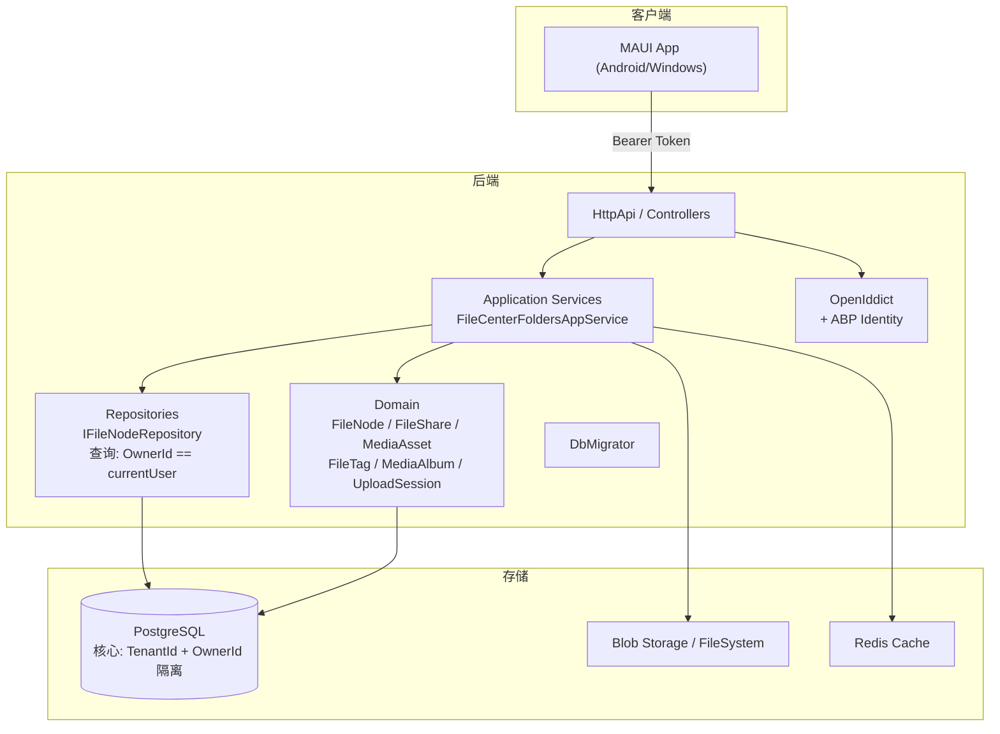
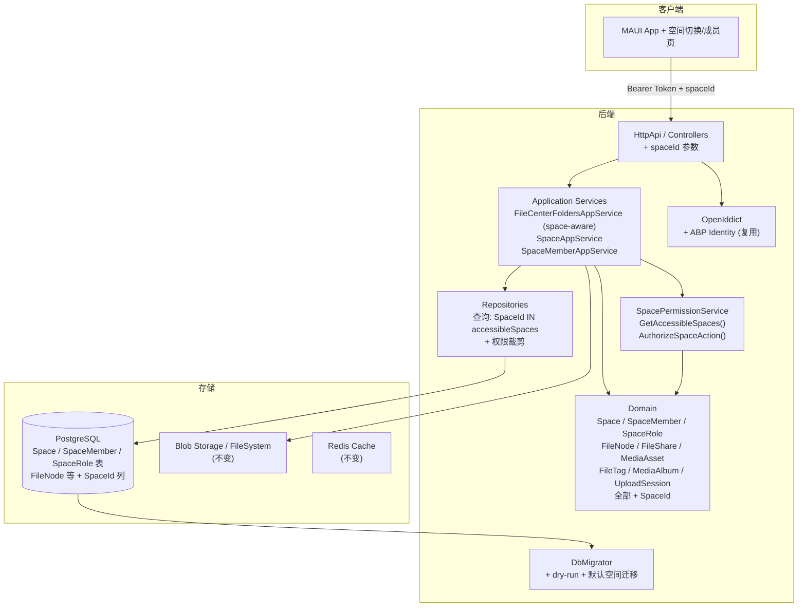
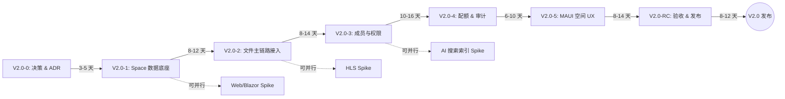

# PrivateCloudDrive V2.0 架构边界与技术债务基线

| 元数据 | 值 |
|:------:|:---:|
| 文档版本 | 1.0 |
| 日期 | 2026-07-14 |
| 负责人 | Hermes-Architect（architect） |
| 适用范围 | V2.0 MVP 家庭/团队空间底座（Space Model + 成员 + 最小权限 + 空间配额 + 审计升级） |
| 前置依赖 | V1.4 已发布稳定 ✅（8 道闸门全部通过，G1 MAUI 编译已修复） |
| 参考输入 | `docs/v2.0-pre-study.md`、`docs/product-roadmap-next.md` §4.6、`docs/architecture-v1.4-boundary.md`、`docs/release-plan-v2.0.md`、`docs/release-gate-v1.4-assessment.md`、当前代码结构 |

---

## 目录

1. [架构边界声明](#1-架构边界声明)
2. [组件修改允许列表（Allowlist）](#2-组件修改允许列表allowlist)
3. [禁止修改列表（Frozen）](#3-禁止修改列表frozen)
4. [技术债务基线评分](#4-技术债务基线评分)
5. [必须修复规格（P0 必备级）](#5-必须修复规格p0-必备级)
6. [迁移与回滚方案要点](#6-迁移与回滚方案要点)
7. [架构演进对照图](#7-架构演进对照图)
8. [各层影响范围矩阵](#8-各层影响范围矩阵)

---

## 1. 架构边界声明

### 1.1 核心原则

> **V2.0 = 从个人 OwnerId 云盘升级为 Space（空间）云盘的架构版本。**

所有变更的核心目标是：**在现有个人云盘能力不中断的前提下，引入空间隔离层，使文件归属从 `TenantId + OwnerId` 演进为 `TenantId + SpaceId + 权限裁剪`。**

### 1.2 版本范围界定

```
V2.0 MVP = Space 数据底座 + 成员管理 + 最小权限模型 + 空间配额 + 审计升级 + 文件主链路接入 Space
```

**明确不属于 V2.0 MVP 的变更**（即使代码结构相似，也禁止在 MVP 阶段进入）：

- AI 语义搜索 / 智能相册 / OCR / 人脸识别 — V2.1+
- 桌面同步客户端 — V3.0 候选
- iOS 正式发布 — 技术预研可在 MVP 末期并行
- 完整 Web/Blazor 管理后台 — V2.0-4 后可做 Spike
- HLS 转码 / 低清预览 — V2.1+
- 外部登录全平台关闭环 — V1.5 或 V2.x 独立增强
- 复杂组织架构 / 部门 / 审批流 — 永不进入
- Office 在线协同编辑 — 永不进入
- 任意层级 ACL 编辑器 — V2.2
- 企业级审计报表 / CSV 导出 — V2.2+
- S3/MinIO 多存储后端切换 — V3.0 候选

---

## 2. 组件修改允许列表（Allowlist）

### 2.1 ⚡ 必须修改（P0 阻塞项）

| 模块 | 修改内容 | 风险等级 | 说明 |
|:----:|---------|:--------:|------|
| **Domain.Shared / Domain** | 新增 `Space`、`SpaceMember`、`SpaceRole` 领域实体 | 🔴 高 | 空间底座的核心新增实体，无现成可复用模型 |
| **Domain / FileCenter** | `FileNode` 增加 `SpaceId` 字段（可为空，迁移后非空） | 🔴 高 | 需要修改构造函数、工厂方法、唯一索引 |
| **Domain / FileCenter** | `BlobObject` 增加 `SpaceId` | 🟡 中 | 若 BlobObject 为独立实体，需迁移；若通过 FileNode 关联则影响小 |
| **Domain / FileCenter** | `UploadSession` 增加 `SpaceId` | 🟡 中 | 上传上下文需要记录空间归属 |
| **Domain / FileCenter** | `MediaAsset`、`MediaAlbum` 增加 `SpaceId` 并添加空间隔离查询 | 🟡 中 | 媒体库不能跨空间展示 |
| **Domain / FileCenter** | `FileShare`、`FileTag` 增加 `SpaceId` | 🟡 中 | 分享与标签也要空间隔离 |
| **Domain / FileCenter** | `FileCenterOperationLog` 增加 `SpaceId`、`SpaceRole` | 🟡 中 | 审计升级 |
| **Domain / FileCenter** | 新增 `ISpaceRepository`、`ISpaceMemberRepository` | 🟡 中 | 空间持久化 |
| **EF Core** | 新增 `SpaceDbContext` 配置、EF 迁移脚本 | 🔴 高 | 高风险 DB schema 变更 |
| **EF Core** | 修改现有 `FileNode` / `MediaAsset` / `FileShare` / `FileTag` / `UploadSession` / `MediaAlbum` EntityTypeConfiguration | 🔴 高 | 需要补 `SpaceId` 字段映射、唯一索引更新 |
| **Application** | 新增 `SpaceAppService`（CRUD 空间） | 🟡 中 | 空间管理的应用服务 |
| **Application** | 新增 `SpaceMemberAppService`（成员管理） | 🟡 中 | 添加/移除/角色切换 |
| **Application** | 新增 `SpacePermissionService`（权限校验服务） | 🔴 高 | 所有空间内操作的权限判断入口 |
| **Application** | 修改 `FileCenterFoldersAppService` 空间感知查询 | 🔴 高 | 列表/上传/下载/删除全链路改为 SpaceId + 权限校验 |
| **Application** | 修改 `StorageAppService` 增加空间用量聚合 | 🟡 中 | 空间级配额统计 |
| **Application** | 修改搜索 API 增加空间隔离 | 🟡 中 | 搜索按 SpaceId + 权限裁剪 |
| **Application** | 修改 `OperationLogsAppService` 增加 SpaceId 字段 | 🟢 低 | 审计字段扩展 |
| **Repository** | 修改 `IFileNodeRepository` 查询条件 | 🔴 高 | 所有查询从 `TenantId + OwnerId` 改为 `TenantId + SpaceId IN (...) + 权限过滤` |
| **Repository** | 修改 `IMediaAssetRepository`、`IFileShareRepository`、`IFileTagRepository` | 🟡 中 | 同上查询模式 |
| **DbMigrator** | 新增 V2.0 迁移逻辑 + 默认个人空间创建 + 数据迁移 | 🔴 高 | `--dry-run` 支持 + 回滚脚本 |
| **MAUI** | 空间选择器（文件页顶部） | 🟡 中 | 登录后进入默认个人空间，可切换 |
| **MAUI** | 空间设置页（名称/描述/配额） | 🟡 中 | 空间信息编辑和配额查看 |
| **MAUI** | 成员管理页（添加/移除/角色切换/禁用） | 🟡 中 | 空间成员管理全流程 |
| **MAUI** | 权限不足提示弹窗 | 🟢 低 | 无权限操作时前端提示 |
| **API 契约** | 文件列表/上传/搜索/分享/容量 API 增加 `spaceId` 参数 | 🟡 中 | 可选参数，向下兼容 |

### 2.2 ⚠️ 可选修改（P1 建议级）

| 模块 | 修改内容 | 风险等级 |
|:----:|---------|:--------:|
| **MAUI** | 空间邀请链接/邀请码 UI | 🟢 低 |
| **MAUI** | 空间头像/图标设置 | 🟢 低 |
| **MAUI** | 空间内回收站按空间隔离展示 | 🟡 中 |
| **MAUI** | 媒体相册按 SpaceId 隔离展示 | 🟢 低 |
| **MAUI** | 空间用量可视化图表 | 🟢 低 |
| **MAUI** | 空间级日志查看 | 🟢 低 |
| **API 兼容层** | API 版本协商 + 默认个人空间适配 | 🟡 中 |

### 2.3 ✅ 不修改（仅复用的现有组件）

| 模块 | 说明 |
|:----:|------|
| OpenIddict / 认证流 | 不修改，完全复用（Bearer Token 认证不变） |
| ABP Identity / 全局角色系统 | 不修改（空间角色在空间内独立管理，不改变全局 Identity） |
| 媒体处理 Worker | 不修改（转码/缩略图生成逻辑不变，仅查询层感知 SpaceId） |
| 文件存储层（Blob Storage） | 不修改（文件存取路径不因 SpaceId 改变） |
| 基础设施（Docker/Redis/PostgreSQL 连接） | 不修改 |
| 多租户基础（IMultiTenant） | 复用，不改变现有 TenantId 隔离逻辑 |

---

## 3. 禁止修改列表（Frozen）

以下模块在 V2.0 MVP 期间 **禁止做任何业务功能变更**：

| 模块 | 冻结理由 | 例外条件 |
|:----:|---------|:--------:|
| **AI 搜索 / 智能相册** | 不进入 V2.0 MVP 范围；工程量大且与空间底座正交 | 仅在 ADR 阶段做架构评估，不进代码 |
| **桌面同步客户端** | 独立产品线，依赖变更日志和冲突处理，非 MVP | 无例外 |
| **iOS 发布** | MAUI 当前基线为 Android/Windows；证书和推送未验证 | 末期可做技术预研 Spike |
| **Web/Blazor 管理后台** | 完整后台替代 MAUI Settings 是另一产品线 | V2.0-4 后可做 Spike |
| **HLS 转码 / 低清预览** | 转码队列和存储膨胀策略与空间底座无关 | V2.1+ |
| **外部登录全平台关闭环** | 与空间权限低耦合 | V1.5 或 V2.x 独立增强 |
| **复杂组织架构 / 审批流** | 永不进入产品路线图 | — |
| **Office 协同编辑** | 永不进入产品路线图 | — |
| **S3/MinIO 多存储后端** | 独立存储抽象层工作 | V3.0 候选 |
| **企业级审计报表 / CSV 导出** | V2.0 聚焦空间基线 | V2.2+ |
| **V1.x 已有 API 契约的删除/破坏性变更** | 旧客户端仍可用 | 仅添加可选参数 |

> **设计纪律**：若某个修改同时触及"允许列表"和"禁止列表"，则只做允许列表的部分。例如搜索：只做 SpaceId 查询过滤（允许），不做全文搜索引擎替换（禁止）。

---

## 4. 技术债务基线评分

### 4.1 现有技术债务（V1.4 继承，V2.0 MVP 必须处理）

#### P0 — 阻塞 V2.0 路径的技术债务

| 编号 | 债务 | 来源 | 影响 | 建议偿还方式 | 预估人天 |
|:----:|------|:----:|------|------------|:--------:|
| **TD-V2.0-01** | `FileNode.OwnerId` 作为唯一数据隔离键，缺少 `SpaceId` | V1.0 设计 | 无法表达空间共享边界；所有查询强制 `OwnerId` 过滤 | 迁移 `SpaceId` 到 `FileNode` 并更新唯一索引 | 3-5 |
| **TD-V2.0-02** | `BlobObject` / `UploadSession` / `MediaAsset` / `FileShare` / `FileTag` / `MediaAlbum` 均无 `SpaceId` | V1.x 逐版本设计 | 除 FileNode 外，关联实体不能按空间隔离查询 | 为上述实体补 `SpaceId` 字段 + 迁移 + 查询改造 | 4-7 |
| **TD-V2.0-03** | 所有仓储查询使用 `OwnerId == currentUserId` 写死，无权限抽象层 | V1.0 设计 | 加入空间后无法统一做权限裁剪；每增加一个查询都要单独处理权限 | 抽取 `SpacePermissionService` 服务，所有仓储统一走 `ResolveAccessibleSpaces()` | 3-5 |
| **TD-V2.0-04** | 搜索使用 ILIKE + 无索引 + 无空间感知 | V1.1 设计 | 大数据集搜索性能差，且无空间权限裁剪 | 搜索 API 增加 `SpaceId` 参数 + ILIKE 查询条件增加空间过滤 | 2-3 |

#### P1 — 进入 V2.0 前建议清理的中等债务

| 编号 | 债务 | 来源 | 影响 | 建议偿还方式 |
|:----:|------|:----:|------|------------|
| **TD-V2.0-05** | ABP 测试项目仍使用 10.3.0（生产已升级至 10.5.0） | V1.3 | 测试环境与生产环境不一致，可能漏测版本差异 | 测试项目升级到 10.5.0 |
| **TD-V2.0-06** | 无统一 `CurrentUserAccessor` 获取当前用户信息 | 各 AppService 各自实现 | 每个服务在注入 CurrentUser，重复且不统一 | 抽取统一访问器（或者集成 ABP `ICurrentUser`） |
| **TD-V2.0-07** | MAUI UI 无自动化验收框架 | V1.3/v1.4 | 回归测试完全人工，V2.0 多空间多角色测试矩阵将更难覆盖 | Spike MAUI UI 自动化选型（Appium / Xamarin.UITest 替代方案） |

#### P2 — 可随 V2.0 正代清理的低优先级债务

| 编号 | 债务 | 说明 |
|:----:|------|------|
| **TD-V2.0-08** | 操作日志不支持按 CSV 导出 | 不影响 V2.0 空间基线，可顺带添加 |
| **TD-V2.0-09** | 故障诊断页为静态内容 | 对 V2.0 无影响，可随后续运维增强处理 |
| **TD-V2.0-10** | 管理端仅 MAUI Settings + Swagger | V2.0 不做 Web 后台，此债务延续 |
| **TD-V2.0-11** | known-limitations.md 人工同步 | 建议做自动化检查脚本或集成到发布门禁 |
| **TD-V2.0-12** | 批量操作上限 100 文件无用户提示 | 可顺带增加前端提示 |

### 4.2 V2.0 引入的新增债务

| 编号 | 债务 | 引入原因 | 影响 | 计划偿还版本 |
|:----:|------|---------|------|:-----------:|
| **TD-V2.0-N01** | SpaceId 可为空（向后兼容期） | 迁移完成后仍有历史数据可能缺失 | 查询需要处理 `SpaceId == null` 兼容逻辑 | V2.1 迁移完成且旧数据清零后去掉 |
| **TD-V2.0-N02** | API `spaceId` 参数为可选参数 | 旧客户端不传 spaceId 时 fallback 到默认个人空间 | 增加服务端默认逻辑复杂度 | V2.1+ 旧客户端强制升级后移除 |
| **TD-V2.0-N03** | 空间内角色固定 4 级矩阵，不支持自定义 ACL | V2.0 MVP 简化为 4 级固定角色 | 少数场景可能不够灵活（如只读+下载禁止） | V2.2 |
| **TD-V2.0-N04** | 空间切换 MAUI 体验非动画过渡 | 降低开发成本 | UX 平滑度不及预期 | V2.1 体验增强 |
| **TD-V2.0-N05** | 空间内回收站未独立展示（仍混在个人回收站） | MVP 范围内未完成 | 无法按空间查看回收站 | V2.1 |

---

## 5. 必须修复规格（P0 必备级）

基于 `docs/release-plan-v2.0.md` §5 的 P0 验收标准，结合架构边界约束产出以下 **3 个跨领域必须修复规格**。每个规格明确 assignee、验收标准和回滚条件。

### R1: Space 领域实体 + DB 迁移底座（devops-eng + backend-eng）

**目标**：完成新实体定义、EF 迁移、默认个人空间创建、数据迁移 dry-run。

**任务要点**：

1. 新增 `Space` 实体（`Id`, `TenantId`, `Name`, `Description`, `AvatarBlobName`, `CreatorId`, `QuotaBytes`, `IsActive`, `CreationTime`）
2. 新增 `SpaceMember` 实体（`Id`, `SpaceId`, `UserId`, `Role`（枚举: Owner/Admin/Member/Viewer）, `IsDisabled`, `JoinTime`）
3. 新增 `SpaceRole` 枚举（在 Domain.Shared 中定义）
4. EF Core 配置：`SpaceConfiguration`、`SpaceMemberConfiguration`、唯一索引（`SpaceId + UserId`）
5. DbMigrator：创建默认个人空间（`{User.Name} 的个人空间`），将现有 `FileNode`、`BlobObject`、`MediaAsset`、`FileShare`、`FileTag`、`MediaAlbum`、`UploadSession` 数据按 `OwnerId` → `DefaultSpaceId` 迁移
6. Dry-run 模式：`--dry-run` 参数，输出迁移前后计数 + 校验报告

**验收标准**：

- `dotnet ef migrations add V2.0_SpaceModel` 生成成功
- `Space`、`SpaceMember` 表在测试库创建成功
- `DbMigrator --dry-run` 输出迁移前/后 FileNode/MediaAsset/FileShare/FileTag/MediaAlbum 计数一致
- `DbMigrator` 实际运行后数据安全迁移到默认个人空间
- 测试：`dotnet test --filter "SpaceModelMigration"` 通过

**回滚条件**：

- 回滚到 V1.4 代码基线 + 迁移前 DB 备份
- 回滚后执行 `dotnet ef migrations remove` 并恢复 DB dump

**估计人天**：5-8

---

### R2: FileCenter 主链路 Space 感知 + 权限校验（backend-eng）

**目标**：所有文件主链路操作（列表/上传/下载/删除/恢复/永久删除/移动/重命名）从 `OwnerId` 模式升级为 `SpaceId + 权限校验` 模式。

**任务要点**：

1. 新增 `SpacePermissionService`（注入 `ISpaceMemberRepository` + `ICurrentUser`）
   - `GetUserAccessibleSpaces()` — 返回用户可访问的 SpaceId 列表
   - `AuthorizeSpaceAction(spaceId, requiredRole)` — 校验当前用户在空间内是否 >= 指定角色
   - `ResolveDefaultSpace()` — 若用户未传 spaceId 则返回默认个人空间
2. 修改 `IFileNodeRepository`：
   - `GetFolderChildrenAsync()` 增加 `spaceId` 参数 + `SpaceId IN accessibleSpaces` 过滤
   - `GetNodeAsync()` / `FindNodeAsync()` 增加空间范围过滤
   - 软删除查询：回收站查询也按 `SpaceId` 过滤
3. 修改 `FileCenterFoldersAppService`：
   - 所有方法增加 `spaceId` 参数（可选，默认当前空间）
   - 方法开头调用 `AuthorizeSpaceAction()` 校验
   - 上传时写入 `FileNode.SpaceId` + `BlobObject.SpaceId` + `UploadSession.SpaceId`
4. 修改 `FileShare` 管理：
   - 创建分享需要 `AuthorizeSpaceAction(spaceId, Member)`
   - 取消分享/查看分享列表按空间隔离
5. 修改搜索（`GetFolderChildrenInput.SearchKeyword`）：
   - 在当前用户可见空间的范围内搜索

**验收标准**：

- Owner/Admin/Member/Viewer 角色下各主链路操作符合以下权限矩阵：

| 操作 | Owner | Admin | Member | Viewer |
|:---:|:-----:|:-----:|:------:|:------:|
| 文件列表 | ✅ | ✅ | ✅ | ✅ |
| 上传 | ✅ | ✅ | ✅ | ❌ |
| 下载 | ✅ | ✅ | ✅ | ✅ |
| 删除/恢复 | ✅ | ✅ | ✅ | ❌ |
| 永久删除 | ✅ | ✅ | ❌ | ❌ |
| 移动/重命名 | ✅ | ✅ | ✅ | ❌ |
| 创建分享 | ✅ | ✅ | ✅ | ❌ |
| 取消分享 | ✅ | ✅ | ✅ | ✅（仅自己的） |

- API 参数篡改测试：修改 `spaceId` 参数无法访问无权限空间的文件
- EF 集成测试覆盖所有角色 + 权限边界场景
- 270+ 现有后端测试全部 PASS（回归）

**回滚条件**：

- 保留 `OwnerId` 查询作为降级路径（所有 API 的 `spaceId` 为可选参数，不传时退化为 `OwnerId == currentUser`）
- 旧 API 路径不受影响

**估计人天**：12-16

---

### R3: 多用户多空间安全门禁 + 迁移演练（qa-eng + devops-eng + security-reviewer）

**目标**：验证 V2.0 空间权限隔离的有效性，并确保在真实环境下可安全迁移和回滚。

**任务要点**：

1. 构建多用户多空间测试矩阵：
   - 3 个用户 × 2 个空间 × 4 种角色组合
   - 验证：同一空间内角色差异 → 权限路径测试
   - 验证：不同空间之间完全隔离
   - 验证：退出/被移除空间后立即失去访问
   - 验证：API 参数篡改（`spaceId`、`fileNodeId` 越权尝试）
   - 验证：搜索隔离（A 空间搜索不返回 B 空间文件）
   - 验证：媒体库隔离（相册列表不跨空间）
   - 验证：分享隔离（空间外用户不能访问空间内文件分享）
   - 验证：配额隔离（A 空间超配额不影响 B 空间上传）
2. 迁移演练：
   - 在测试 Docker 环境执行 full migration
   - 迁移前后数据计数对比 + 数据完整性校验
   - 演练回滚流程：恢复备份 → 确认数据完整
3. 安全审计：
   - 自动化越权测试脚本或手工测试套件
   - 安全门禁报告输出

**验收标准**：

- 多用户多空间全矩阵测试 0 越权
- API 参数篡改模拟 0 异常访问
- 迁移 dry-run: 数据计数完全一致
- 迁移回滚演练: 从备份恢复后数据完整无损
- secret-log-scan: 不新增敏感信息暴露

**回滚条件**：

- 发现任何越权 → 立即关闭 V2.0 功能入口开关
- 迁移失败 → 恢复 V1.4 备份 + 代码回滚

**估计人天**：5-8

---

## 6. 迁移与回滚方案要点

### 6.1 数据迁移策略

```
┌─────────────────────────────────────────────────────┐
│                   迁移前状态                          │
│  FileNode.OwnerId = userA  (无 SpaceId 的概念)      │
│  BlobObject.OwnerId = userA                         │
│  MediaAsset.OwnerId = userA                         │
└─────────────────────┬───────────────────────────────┘
                      │
                      ▼
┌─────────────────────────────────────────────────────┐
│           Step 1: 创建默认个人空间                     │
│  INSERT INTO Spaces (Id, Name, OwnerId, CreatedAt)   │
│  VALUES (newGuid(), "userA 的个人空间", userA.Id, utc)│
└─────────────────────┬───────────────────────────────┘
                      │
                      ▼
┌─────────────────────────────────────────────────────┐
│    Step 2: 自动添加 Owner 到 SpaceMember             │
│  INSERT INTO SpaceMembers (SpaceId, UserId, Role)    │
│  VALUES (spaceId, userA.Id, Owner)                   │
└─────────────────────┬───────────────────────────────┘
                      │
                      ▼
┌─────────────────────────────────────────────────────┐
│    Step 3: 迁移现有数据到 SpaceId                    │
│  UPDATE FileNode SET SpaceId = defaultSpaceId        │
│  WHERE OwnerId = userA.Id AND SpaceId IS NULL         │
│  (同理: BlobObject, MediaAsset, MediaAlbum,          │
│   FileShare, FileTag, UploadSession)                 │
└─────────────────────┬───────────────────────────────┘
                      │
                      ▼
┌─────────────────────────────────────────────────────┐
│    Step 4: 更新唯一索引                               │
│  原本: (TenantId, OwnerId, ParentId, NormalizedName) │
│  改为: (TenantId, SpaceId, ParentId, NormalizedName) │
└─────────────────────┬───────────────────────────────┘
                      │
                      ▼
┌─────────────────────────────────────────────────────┐
│                 迁移后状态                             │
│  FileNode.OwnerId + FileNode.SpaceId = defaultSpace  │
│  所有查询: WHERE SpaceId IN (user's accessible spaces) │
└─────────────────────────────────────────────────────┘
```

### 6.2 回滚方案

| 场景 | 回滚方式 | 影响范围 | 预估恢复时长 |
|:----:|---------|:--------:|:-----------:|
| **ADR/设计阶段发现过大** | 不进入实现，退回 V1.5 路线 | 无代码/数据影响 | 0 |
| **DB 迁移 dry-run 失败** | 丢弃测试库迁移结果，修正迁移脚本 | 不影响生产 | 0 |
| **生产迁移失败** | 停止服务 → 恢复迁移前 DB dump + storage 备份 → 回滚代码到 V1.4 基线 | 全服务停机，数据无损 | 15-30 min |
| **越权缺陷（发现越权）** | 立即关闭 V2.0 功能入口（feature flag）或回滚到 V1.4；保留公开分享限流 | 空间功能不可用，个人云盘不受影响 | 5 min（feature flag）/ 30 min（回滚） |
| **MAUI 编译失败** | 回滚前端空间入口代码，后端可先隐藏 Space API | 仅空间 UX 不可用 | 按 PR 回滚 |
| **性能退化严重** | 回滚到 V1.4 基线，优化后再上线 | 全服务回滚 | 30-60 min |

### 6.3 回滚前提条件

1. **迁移前必须对 DB 做完整 pg_dump 备份**（`pg_dump --format=custom --compress=9 --file=v1.4-pre-v2.0.dump`）
2. **storage 目录必须备份**（`tar czf storage-v1.4.tar.gz /path/to/storage/`）
3. **迁移脚本必须支持 `--dry-run` 模式**，仅输出 SQL 和数据统计，不实际写入
4. **所有迁移 SQL 必须包裹在事务中**，支持 `ROLLBACK`
5. **回滚文档必须包含具体的执行命令**，以便 devops-eng 在不依赖开发者的情况下完成回滚

### 6.4 API 兼容策略

为确保旧版客户端在 V2.0 升级过程中不受影响：

```text
1. 所有新增 API 参数（spaceId）均为可选（nullable）
2. 不传 spaceId → 服务端通过 SpacePermissionService.ResolveDefaultSpace() 自动映射为用户的默认个人空间
3. 旧 API 路径完全保留，不做删除或破坏性变更
4. 旧客户端行为：默认个人空间，不变
5. 新客户端行为：可传入 spaceId 选择空间
```

---

## 7. 架构演进对照图

### V1.x（当前架构）



### V2.0（目标架构）



---

## 8. 各层影响范围矩阵

| 层 | 影响等级 | V2.0 需要改造的内容 | 可复用内容 |
|:--:|:--------:|-------------------|:---------:|
| **DB schema** | 🔴 **高** | 新增 Space/ SpaceMember / SpaceRole 表；FileNode/BlobObject/UploadSession/MediaAsset/MediaAlbum/FileShare/FileTag 增加 SpaceId 列；更新唯一索引 | 已有表结构不变，仅增加列 |
| **Domain** | 🔴 **高** | 新增 Space/SpaceMember 实体；FileNode 增加 SpaceId 属性；关联实体增加 SpaceId；新增空间不变量（如成员唯一性） | FileNode 现有逻辑（创建/重命名/移动/删除/恢复/收藏）不变 |
| **Application** | 🔴 **高** | 新增 SpaceAppService + SpaceMemberAppService + SpacePermissionService；FileCenter 服务改为 SpaceId + 权限校验 | 大部分业务逻辑可复用，仅增加前置权限校验 |
| **Repository** | 🔴 **高** | 查询条件从 `OwnerId == currentUser` 改为 `SpaceId IN accessibleSpaces + 权限角色过滤` | 查询结构可复用，仅修改 where 条件 |
| **API 契约** | 🟡 **中高** | 文件列表/上传/搜索/分享 API 增加可选 `spaceId` 参数；新增空间管理 API 端点 | 现有端点路径和返回结构不变 |
| **MAUI** | 🟡 **中高** | 新增空间选择器、空间设置页、成员管理页、权限不足提示 | 文件页/媒体页/设置页主体结构可复用 |
| **DbMigrator** | 🔴 **高** | 新增 V2.0 迁移逻辑 + 默认空间创建 + 数据迁移 + dry-run + 回滚 | V1.x 迁移逻辑不变 |
| **测试** | 🔴 **高** | 新增多用户/多空间/多角色权限测试矩阵；迁移 dry-run 测试；安全越权测试 | 现有 270+ 测试可回归 |
| **Docker/部署** | 🟢 **低** | 无基础设施变更；迁移文档和回滚文档更新 | V1.x 部署配置不变 |
| **OpenIddict/认证** | 🟢 **低** | 不修改 | 完全复用 |
| **媒体处理 Worker** | 🟢 **低** | 不修改 Worker 逻辑；仅查询层感知 SpaceId | 完全复用 |
| **Blob 存储层** | 🟢 **低** | 不修改文件存储路径或存取逻辑 | 完全复用 |

---

## 附录：V2.0 关键路径时间线



**关键路径**：V2.0-0 → V2.0-1 → V2.0-2 → V2.0-3 → V2.0-5 → V2.0-RC

**最短串行长度**：约 47-73 天（不含并行 Spike）

---

*本文档由 Hermes-Architect（architect）基于 V2.0 预研报告、V1.4 架构边界、V2.0 发布计划和当前代码结构综合评估产出。待用户授权进入 V2.0 后，将以此为基础创建 ADR 和子阶段 Kanban 任务。*
