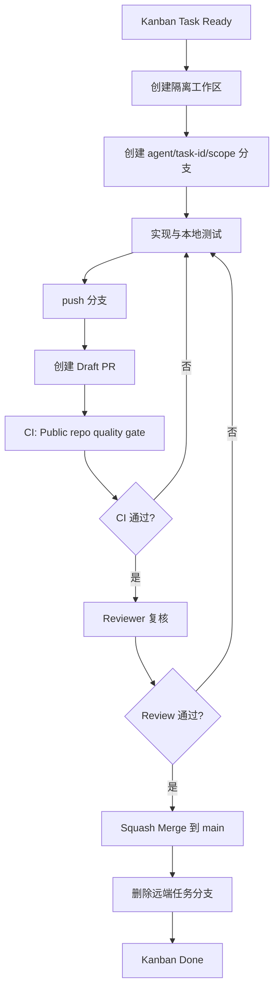

# PrivateCloudDrive Git 仓库治理规范

> 目标：主库 `main` 永远只代表“已通过门禁、可追溯、可回滚”的集成状态。任何员工、Agent、脚本都不得把未验证成果直接写入主库。

## 1. 问题本质

2026-05-22 的 Git 混乱事故不是单纯的 `.git` 损坏问题，而是仓库治理缺失：

1. 多个 Kanban worker 共享同一个主仓库工作区。
2. worker 在主库目录中直接修改文件、创建临时 clone、尝试修复 `.git`。
3. 缺少强制分支/PR 门禁，main 原本没有保护，直接 push/合并没有制度阻断。
4. 任务产物、临时修复、验证产物混在主库，导致无法判断哪些改动属于哪个任务。
5. 一旦 `.git` 损坏，所有依赖主库的 worker 同时失败，形成看板死锁。

因此，真正的治理对象是：**主库写入权、集成入口、任务隔离、合并门禁、责任追溯**。

## 2. 分支模型

### 2.1 永久分支

| 分支 | 用途 | 写入规则 |
|---|---|---|
| `main` | 稳定集成主线 | 只能通过 PR 合并，禁止直接 push |

### 2.2 临时任务分支

每个 Kanban 任务必须使用独立分支：

```text
agent/<task-id>/<scope>
```

示例：

```text
agent/t_d0ad75b8/share-kdf-rate-limit
agent/t_8849deee/android-login-error-classification
agent/t_40140fce/validation-secret-scan
```

规则：

1. 一个任务一个分支。
2. 一个分支只解决一个明确问题。
3. 禁止多个任务共用同一分支。
4. 禁止 worker 在 `main` 上 commit。
5. 分支完成后必须开 PR，不得直接合并。

## 3. 工作区模型

主仓库：

```text
D:/Devs/Projects/Personal/PrivateCloudDrive
```

定位：Hermes 参考副本，仅用于：

- 健康检查
- `git fetch/pull`
- 查看状态
- 运行只读巡检

任务工作区：

```text
D:/Devs/Projects/Personal/PrivateCloudDrive-tasks/t_<task_id>/
```

定位：worker 实际工作区。

启动任务第一步必须运行：

```bash
WORKSPACE=$(bash D:/Devs/Projects/Personal/PrivateCloudDrive/scripts/git-workspace-guard.sh | grep '^WORKSPACE=' | cut -d= -f2)
cd "$WORKSPACE"
git checkout -b agent/<task-id>/<scope>
```

## 4. PR 门禁

`main` 已启用 GitHub Branch Protection：

| 门禁 | 状态 |
|---|---|
| 禁止直接 push 到 main | 已启用 |
| 管理员也受保护 | 已启用 |
| 必须 PR | 已启用 |
| 至少 1 个 approving review | 已启用 |
| 最后一次 push 后需要非提交者批准 | 已启用 |
| 必须通过 CI `Public repo quality gate` | 已启用 |
| 合并前分支必须与 main 同步 | 已启用 |
| 必须解决所有对话 | 已启用 |
| 禁止 force push | 已启用 |
| 禁止删除 main | 已启用 |
| 线性历史 | 已启用 |

## 5. 合并流程



## 6. 角色职责

| 角色 | 职责 |
|---|---|
| Worker | 只能在任务分支提交代码，负责最小测试和 PR 描述 |
| Reviewer/QA | 检查 diff、证据、测试、敏感信息，批准或退回 |
| Release Manager | 合并 PR，确认 main 仍健康 |
| Hermes 总控 | 管理分支保护、看门狗、死锁恢复和跨任务冲突 |

## 7. 禁止事项

1. 禁止 worker 在 `main` 分支直接 commit。
2. 禁止任何人直接 push 到 `main`。
3. 禁止把临时 clone、patch 文件、日志残留放进主库根目录。
4. 禁止未经过 CI 和 Review 的代码进入 main。
5. 禁止用 `git reset --hard` 覆盖他人工作成果。
6. 禁止一个 PR 混入多个无关 Kanban 任务。

## 8. 异常处理

### 8.1 主仓库写脏

看门狗检测到主库有未提交改动且有 worker 运行时：

1. 不自动 reset，避免丢失成果。
2. 记录报警。
3. Hermes 总控人工分类：
   - 属于某任务 → 搬迁到对应任务分支/PR。
   - 属于临时产物 → 删除或移入 validation 证据目录。
   - 不确定 → 暂存备份后再清理。

### 8.2 分支冲突

1. worker rebase 或 merge `origin/main` 到任务分支。
2. 修复冲突。
3. 重新跑测试。
4. push 更新 PR。

### 8.3 CI 失败

1. 不得合并。
2. worker 读取失败日志。
3. 提交修复 commit。
4. CI 重新通过后再进入 review。

## 9. 成功标准

仓库治理合格的标准：

1. `main` 永远可 `git clone`、可构建、可追溯。
2. 每个改动都能追溯到 task id、branch、PR、CI、review。
3. 看板任务完成不等于进入 main；只有 PR 合并后才进入 main。
4. 主库没有未归属改动。
5. 临时工作区可随时删除，不影响主库。
