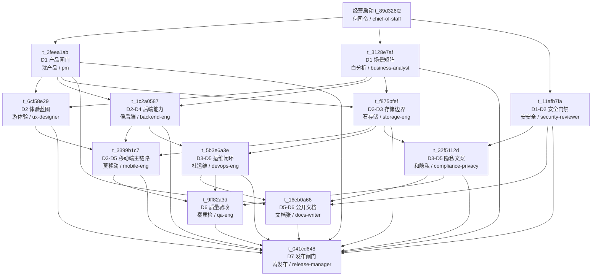

# PrivateCloudDrive 未来 7 天自主推进作战图

日期：2026-05-22
负责人：何司令（公司执行中枢 / chief-of-staff）
适用范围：Private Backup MVP / V1.0 Public RC 前 7 天自主经营推进

---

## 1. 管理结论

未来 7 天不再扩张泛网盘功能，全部动作围绕一个北极星问题：

> PrivateCloudDrive 是否已经能让普通用户信任地用手机把照片、视频和文件备份到自己的后端，并理解数据位置、失败重试、恢复和隐私边界。

当前仓库状态给出的经营判断：

| 维度 | 当前证据 | 经营判断 |
|---|---|---|
| 产品方向 | `docs/hermes-autonomous-operating-charter.md`、`docs/team-operating-model-private-backup.md`、`docs/roadmap-public.md` 均指向“手机优先私有备份网盘” | 方向已收敛，禁止回到大而全网盘 |
| 代码主线 | Git 当前分支 `main`，最近提交 `8ab5211 管理：启动自主经营机制` | 可以进入自主任务编排 |
| 公开 Issue | GitHub open：#1 备份可信闭环、#4 公开文档、#5 安全边界 | 7 天主线直接映射三大公开缺口 |
| CI | 最近 GitHub Actions CI 成功，最新成功 run `26230780617` 对应 `753837f` | CI 基线可用，但新改动仍需逐项验证 |
| 最新验收 | 2026-05-18 已有 Android 登录后存储信任边界截图和后端 107 个 EF 测试通过记录 | 已有局部可信证据，但 D6 必须补完整备份主链路 E2E |

---

## 2. 7 天目标与硬门槛

### D7 必须达成

1. Android App 可见完成：连接后端、登录、文件/照片/视频备份、进度、失败重试、下载/预览、删除/恢复、容量/健康、恢复说明、隐私边界。
2. Docker 本地栈、备份脚本、恢复演练和灾备文档无阻塞 FAIL。
3. 公开文档能让新用户理解：如何部署、如何备份、如何恢复、哪些风险不由产品自动兜底。
4. 安全/隐私门禁至少清零 P0；P1 必须有明确降级或后续任务。
5. Release Manager 给出继续/暂停/降级裁决；只有达到阶段满意状态才升级用户最终人工验收。

### 明确不做

| 不做 | 原因 |
|---|---|
| NAS OS / RAID / 磁盘池 | 偏离手机备份网盘主线 |
| SMB/NFS/AFP | 不解决当前 Android 备份可信闭环 |
| 桌面同步客户端 | 数据一致性成本过高 |
| AI 相册 / AI 搜索 | 必须晚于稳定备份和恢复 |
| 企业审批流 / Office 协作 | 当前定位为个人、家庭、小团队私有备份 |
| 纯视觉探索 | 当前需要状态清晰和验收证据，不是品牌探索 |

---

## 3. Day-by-Day 作战节奏

| 日期 | 闸门 | 目标 | 负责人 |
|---|---|---|---|
| D1 | 产品和场景闸门 | 锁定 7 天游标、场景矩阵、安全初审 | 沈产品（产品总监 / pm）、白分析（业务分析师 / business-analyst）、安安全（安全审查 / security-reviewer） |
| D2 | 体验和技术差距 | 备份中心信息架构、后端 API 缺口、存储边界 | 游体验（UX / ux-designer）、侯后端（后端 / backend-eng）、石存储（存储 / storage-eng） |
| D3 | 契约收口 | 后端/存储/运维/隐私对齐，明确移动端依赖 | 侯后端、石存储、杜运维、和隐私 |
| D4 | 实现主链路 | 移动端备份中心、后端状态/失败/健康、运维脚本修复 | 莫移动（移动端 / mobile-eng）、侯后端、杜运维 |
| D5 | 文档和隐私收口 | README/部署/灾备/已知限制、安全文案 | 文档张（文档 / docs-writer）、和隐私（合规隐私 / compliance-privacy）、安安全 |
| D6 | E2E 验收 | Android 真实页面证据、后端/本地栈/恢复 smoke | 秦质检（QA / qa-eng） |
| D7 | 发布裁决 | 汇总证据、Issue 状态、CI、风险，决定是否升级用户验收 | 芮发布（发布经理 / release-manager）、何司令 |

---

## 4. Kanban 任务图

---

## 5. 已创建 Kanban 子任务

| 顺序 | Kanban ID | 中文员工 | 岗位 / Profile | 任务 | 依赖 |
|---:|---|---|---|---|---|
| 1 | `t_3feea1ab` | 沈产品 | 产品总监 / pm | D1 产品闸门：定义 Private Backup MVP 7 天游标与验收口径 | `t_89d326f2` |
| 2 | `t_3128e7af` | 白分析 | 业务分析师 / business-analyst | D1 场景矩阵：梳理手机备份可信闭环与异常状态 | `t_89d326f2` |
| 3 | `t_11afb7fa` | 安安全 | 安全审查工程师 / security-reviewer | D1-D2 安全门禁：公开仓库密钥、分享与权限边界审查 | `t_89d326f2` |
| 4 | `t_6cf58e29` | 游体验 | UX 设计师 / ux-designer | D2 体验蓝图：收口备份中心与恢复说明信息架构 | 产品闸门、场景矩阵 |
| 5 | `t_1c2a0587` | 侯后端 | .NET 后端工程师 / backend-eng | D2-D4 后端能力：补齐备份任务状态、失败原因与健康 API 缺口 | 产品闸门、场景矩阵 |
| 6 | `t_f875bfef` | 石存储 | 文件存储工程师 / storage-eng | D2-D3 存储边界：容量、位置、生命周期与恢复范围审计 | 产品闸门、场景矩阵 |
| 7 | `t_3399b1c7` | 莫移动 | 移动端工程师 / mobile-eng | D3-D5 移动端主链路：落地 Android 备份中心与失败重试体验 | 体验、后端、存储 |
| 8 | `t_5b3e6a3e` | 杜运维 | DevOps 工程师 / devops-eng | D3-D5 运维闭环：本地栈、备份恢复脚本与部署文档验收 | 后端、存储 |
| 9 | `t_32f5112d` | 和隐私 | 合规隐私工程师 / compliance-privacy | D3-D5 隐私文案：数据位置、密钥边界和恢复责任收口 | 安全、存储 |
| 10 | `t_16eb0a66` | 文档张 | 文档工程师 / docs-writer | D5-D6 公开文档：整理新用户入门、部署、恢复与已知限制 | 产品、运维、隐私、安全 |
| 11 | `t_9ff82a3d` | 秦质检 | QA 工程师 / qa-eng | D6 质量验收：Android 备份可信闭环端到端证据 | 移动端、运维、隐私 |
| 12 | `t_041cd648` | 芮发布 | 发布经理 / release-manager | D7 发布闸门：汇总证据并裁决是否升级用户最终验收 | 全部上游 |

---

## 6. 风险与升级规则

| 风险 | 影响 | 处理方式 | 是否升级用户 |
|---|---|---|---|
| Android 设备/模拟器不可用 | 无法给出可见 App 证据 | 秦质检阻塞并要求设备；不能用构建通过替代截图/日志 | 需要设备时升级 |
| 后端契约与移动端实现不同步 | D6 E2E 失败 | 侯后端、莫移动在 Kanban 评论内对齐；必要时调用齐契约 | 不默认升级 |
| 备份/恢复涉及真实数据破坏性操作 | 数据丢失风险 | 只允许隔离栈或 dry-run；真实数据恢复必须先问用户 | 必须升级 |
| 安全审查发现 token/secret 泄露 | 阻塞公开发布 | 安安全创建修复任务并阻塞发布闸门 | 视严重性升级 |
| 文档误导恢复范围或对象存储责任 | 用户信任受损 | 和隐私、文档张修正文案；芮发布门禁检查 | 不默认升级 |
| CI 或本地构建失败 | 不能进入 RC | 对应工程角色修复后再 QA | 不默认升级 |

---

## 7. 何司令裁决

本轮不需要打扰用户。已经按授权章程直接建立 7 天作战图和 Kanban 子任务，后续由各岗位在看板内推进。只有出现真实数据破坏性操作、重大安全/隐私风险、外部付费/公开发布，或 D7 判断已达到可交付满意状态需要最终人工验收时，才升级用户。
