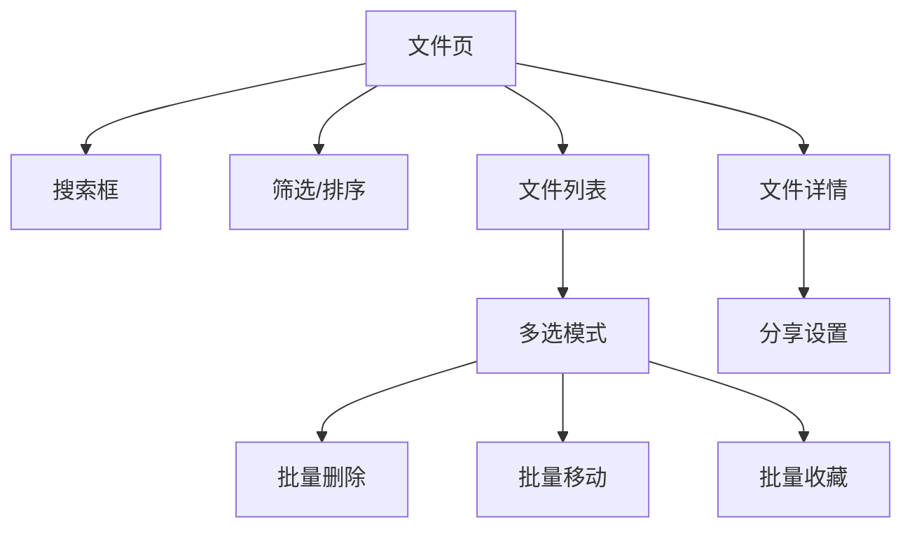
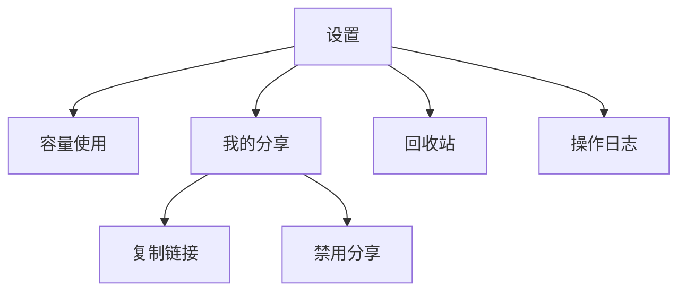

# PrivateCloudDrive V1.1 PRD：文件管理体验增强

日期：2026-05-09
负责人：Hermes 产品总监
版本范围：V1.1
状态：规划中

## 1. 产品目标

V1.1 的目标是提升用户在真实文件量增长后的日常管理效率，让 PrivateCloudDrive 从“能上传和访问文件”升级为“能快速找到、批量整理、理解容量占用、管理分享”的私有云盘。

## 2. 用户问题

| 场景 | 当前问题 | V1.1 目标 |
| --- | --- | --- |
| 找文件 | 只能按目录浏览，文件多时查找成本高 | 支持关键词搜索和类型过滤 |
| 整理文件 | 删除、恢复、移动等只能单个操作 | 支持多选批量处理 |
| 浏览列表 | 默认排序固定，无法按时间/大小/类型调整 | 支持排序和筛选 |
| 容量感知 | 上传失败时才知道超额，不知道还剩多少 | 展示已用容量、总容量、剩余容量 |
| 分享管理 | 只能创建分享，缺少统一管理入口 | 支持查看、复制、禁用、识别过期/受密码保护分享 |

## 3. 功能范围

### 3.1 搜索

| 编号 | 功能 | 优先级 | 说明 |
| --- | --- | --- | --- |
| V11-S1 | 当前目录搜索 | P0 | 在当前目录下按文件/文件夹名称模糊搜索 |
| V11-S2 | 全盘搜索 | P1 | 不限定 ParentId，在当前用户文件树中搜索 |
| V11-S3 | 类型筛选 | P0 | 全部/文件夹/文件/图片/视频 |
| V11-S4 | 收藏/标签组合筛选 | P1 | 与已有收藏、标签能力复用 |
| V11-S5 | 搜索空状态 | P0 | 明确显示“未找到相关文件” |

### 3.2 排序与筛选

| 编号 | 功能 | 优先级 | 说明 |
| --- | --- | --- | --- |
| V11-F1 | 名称排序 | P0 | A-Z / Z-A，默认文件夹优先 |
| V11-F2 | 时间排序 | P0 | 最近修改/创建时间排序 |
| V11-F3 | 大小排序 | P0 | 大文件优先/小文件优先，文件夹大小默认 0 或后续聚合 |
| V11-F4 | 类型筛选 | P0 | 文件夹、图片、视频、其他文件 |
| V11-F5 | 筛选状态提示 | P1 | 列表顶部显示当前筛选条件，支持一键清除 |

### 3.3 批量操作

| 编号 | 功能 | 优先级 | 说明 |
| --- | --- | --- | --- |
| V11-B1 | 多选模式 | P0 | 长按或工具栏进入多选 |
| V11-B2 | 批量删除到回收站 | P0 | 多选后删除，需二次确认 |
| V11-B3 | 批量恢复 | P0 | 回收站多选恢复 |
| V11-B4 | 批量永久删除 | P0 | 回收站多选永久删除，强确认 |
| V11-B5 | 批量移动 | P1 | 选择目标目录后移动 |
| V11-B6 | 批量收藏/取消收藏 | P1 | 对多个文件统一设置收藏状态 |

### 3.4 容量展示

| 编号 | 功能 | 优先级 | 说明 |
| --- | --- | --- | --- |
| V11-C1 | 容量摘要接口 | P0 | 返回已用、配额、剩余、使用率 |
| V11-C2 | 设置页容量卡片 | P0 | 显示进度条和文本 |
| V11-C3 | 上传前容量提示 | P1 | 文件超出剩余容量时尽早提示 |
| V11-C4 | 容量异常状态 | P0 | 配额未配置或统计失败时显示可理解提示 |

### 3.5 分享体验

| 编号 | 功能 | 优先级 | 说明 |
| --- | --- | --- | --- |
| V11-H1 | 我的分享列表 | P0 | 当前用户查看自己创建的分享 |
| V11-H2 | 分享状态 | P0 | 有效/已禁用/已过期/有密码/允许下载 |
| V11-H3 | 复制分享链接 | P0 | MAUI 端复制公开链接 |
| V11-H4 | 禁用分享 | P0 | 用户可禁用自己的分享 |
| V11-H5 | 分享详情入口 | P1 | 从文件详情进入现有分享状态 |
| V11-H6 | 管理员分享管理增强 | P2 | 后续可支持搜索和按状态筛选 |

## 4. 后端接口建议

### 4.1 文件列表增强

复用现有：

```text
GET /api/app/file-center-folders
```

扩展 `GetFolderChildrenInput`：

| 字段 | 类型 | 说明 |
| --- | --- | --- |
| ParentId | Guid? | 为空表示根目录 |
| SearchKeyword | string? | 文件/文件夹名模糊搜索 |
| SearchScope | enum/string | CurrentFolder / All |
| NodeType | FileNodeType? | 文件夹/文件 |
| MediaType | enum/string? | Image / Video / Other |
| TagId | Guid? | 已有标签筛选 |
| IsFavorite | bool? | 已有收藏筛选 |
| Sorting | string? | name asc, size desc, creationTime desc, lastModificationTime desc |
| SkipCount | int | 分页 |
| MaxResultCount | int | 分页 |

### 4.2 批量操作

建议新增输入 DTO：

```text
BatchFileNodeInput
- List<Guid> Ids

BatchMoveFileNodesInput
- List<Guid> Ids
- Guid? ParentId

BatchSetFavoriteInput
- List<Guid> Ids
- bool IsFavorite
```

建议扩展 `IFileCenterFoldersAppService`：

```text
DeleteManyAsync(BatchFileNodeInput input)
RestoreManyAsync(BatchFileNodeInput input)
PermanentDeleteManyAsync(BatchFileNodeInput input)
MoveManyAsync(BatchMoveFileNodesInput input)
SetFavoriteManyAsync(BatchSetFavoriteInput input)
```

### 4.3 容量摘要

建议新增：

```text
GET /api/file-center/storage/usage
```

返回 DTO：

```text
StorageUsageDto
- UsedBytes
- QuotaBytes
- RemainingBytes
- UsagePercent
- IsQuotaConfigured
```

### 4.4 分享体验

复用已有：

```text
GET /api/app/file-center-shares
GET /api/app/file-center-shares/all
```

建议新增/确认：

```text
POST /api/file-center/shares/{id}/disable
```

MAUI 侧需要：

- 我的分享列表页或设置页入口
- 复制链接按钮
- 禁用分享按钮
- 过期/密码/允许下载状态显示

## 5. 页面与交互

### 5.1 文件页

新增元素：

- 搜索框
- 排序入口
- 筛选入口
- 多选入口
- 批量操作工具栏



### 5.2 设置页

新增：

- 容量使用卡片
- 我的分享入口



## 6. 验收标准

| 模块 | 验收标准 |
| --- | --- |
| 搜索 | 能按名称搜索当前目录；空结果有提示；分页正常 |
| 排序筛选 | 名称、时间、大小排序结果稳定；筛选和搜索可组合 |
| 批量删除 | 多选删除后列表刷新；回收站出现对应项目；不影响未选项目 |
| 批量恢复 | 回收站批量恢复成功；同名冲突有明确错误 |
| 批量永久删除 | 二次确认；删除后不可恢复；相关 blob 清理沿用既有逻辑 |
| 容量展示 | 设置页显示已用/总量/剩余/百分比；配额不足有提示 |
| 分享体验 | 能看到自己的分享、复制链接、禁用分享；不暴露 token 以外的敏感信息 |
| 安全 | 所有查询限定 CurrentUser + CurrentTenant；不能访问他人文件或分享 |
| 兼容 | 未使用新参数时，旧列表行为保持不变 |

## 7. 非目标

- 不做全文内容搜索。
- 不做 OCR / AI 搜索。
- 不做文件夹递归容量实时统计。
- 不做复杂团队空间权限。
- 不做桌面同步。

## 8. 分期建议

| 阶段 | 内容 | 目标 |
| --- | --- | --- |
| V1.1 Phase 1 | 后端列表搜索、排序、筛选、容量 DTO/API | 先打通数据能力 |
| V1.1 Phase 2 | 批量删除/恢复/永久删除/移动/收藏 | 提升整理效率 |
| V1.1 Phase 3 | MAUI 文件页搜索/排序/筛选/多选 | 交互可用 |
| V1.1 Phase 4 | 设置页容量卡片 + 我的分享管理 | 产品体验闭环 |
| V1.1 Phase 5 | 真机验收、缺陷修复、文档回填 | 发布 V1.1 |
