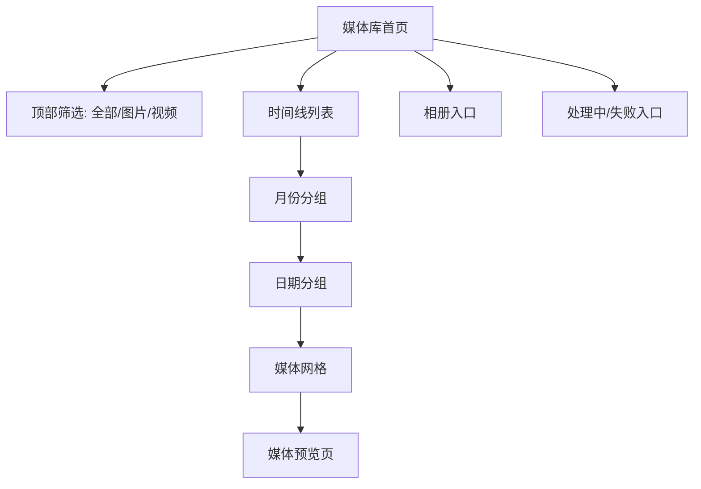
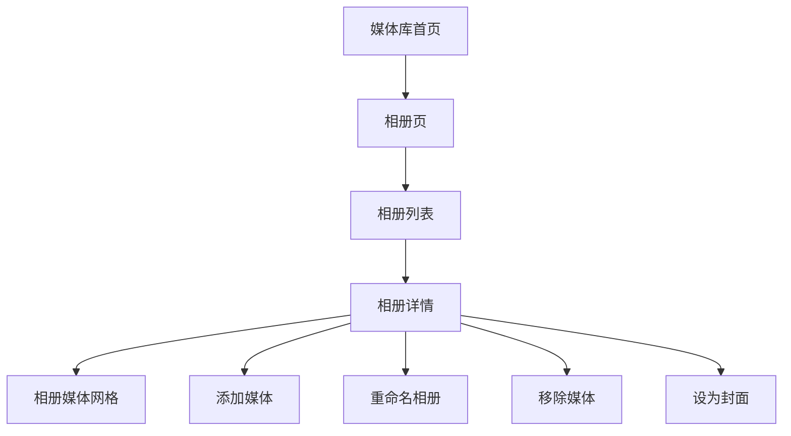
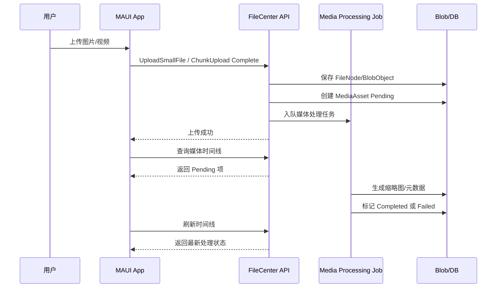
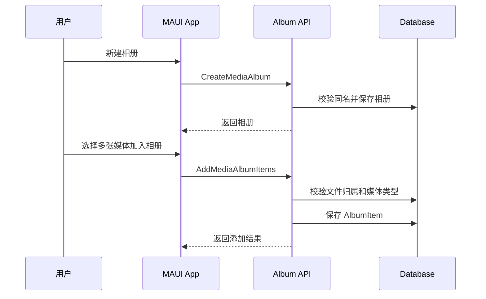
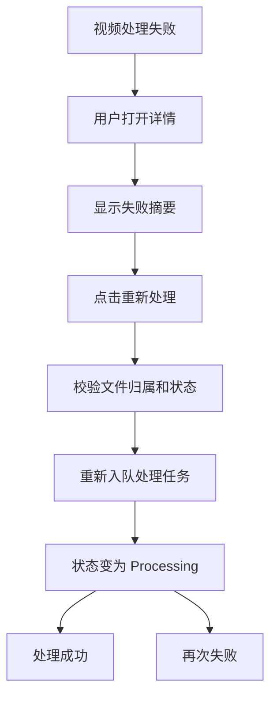

# PrivateCloudDrive V1.2 PRD：媒体库体验增强

日期：2026-05-09
负责人：Hermes 产品总监
版本范围：V1.2
状态：已完成
关联版本：V1.0 RC 私有部署收口、V1.1 文件管理效率增强

完成记录：2026-05-09 已完成后端时间线/详情/处理状态/相册 API、EF 迁移、MAUI 媒体库时间线、相册页面、处理状态页面和预览页失败重试体验。验证结果见 `docs/progress.md` 与 `docs/testing.md`。

---

## 1. 产品定位

V1.2 的核心目标是把 PrivateCloudDrive 从“文件型云盘”进一步升级为“移动优先的私人媒体库”。

用户在手机里最常上传和回看的内容是照片、截图、视频、家庭影像和旅行素材。V1.2 不追求复杂 AI 相册，也不做专业 NAS 媒体中心，而是先解决四个高频问题：

1. 按时间快速回看照片和视频。
2. 把媒体整理到相册中。
3. 视频播放体验稳定、可理解、可恢复。
4. 明确知道媒体是否正在处理、处理失败还是已可预览。

产品形态：

```text
PrivateCloudDrive V1.2 = 私有云盘基础上的轻量媒体库 + 时间线 + 相册 + 视频预览体验 + 媒体处理状态可视化
```

---

## 2. 背景与现状盘点

当前项目已经具备媒体库基础能力：

| 能力 | 当前状态 | 相关文件 |
|---|---|---|
| 图片/视频列表 | 已有基础接口 | `IFileCenterMediaLibraryAppService`, `FileCenterMediaLibraryAppService` |
| 图片/视频过滤 | 已按 ContentType / 扩展名识别 | `GetImagesAsync`, `GetVideosAsync` |
| 媒体资产表 | 已有 | `MediaAsset` |
| 处理状态 | 已有 Pending / Processing / Completed / Failed 基础 | `MediaAssetProcessStatus` |
| 图片缩略图 | 已有后台生成基础 | `FileCenterMediaAssetProcessingJob` |
| 视频缩略图/元数据 | 已有 ffmpeg/ffprobe 处理基础 | `IFileCenterVideoProcessor` |
| MAUI 媒体预览页 | 已有 | `MediaPreviewPage.xaml(.cs)` |
| MAUI 媒体模型 | 已有基础模型 | `MediaLibraryItem` |

当前不足：

| 问题 | 用户影响 |
|---|---|
| 媒体列表只是图片/视频分页，不是时间线 | 用户无法按月份/日期快速回看 |
| 没有相册概念 | 用户无法按旅行、家庭、项目整理媒体 |
| 媒体处理状态没有充分暴露到前端 | 用户看到缩略图缺失时不知道是在处理中还是失败 |
| 视频预览体验偏基础 | 大视频加载、失败、重试、封面、时长展示不够明确 |
| 缺少媒体库专属验收标准 | 容易变成“能打开文件”而不是“像媒体库一样好用” |

---

## 3. V1.2 产品目标

| 目标 | 说明 | 验收口径 |
|---|---|---|
| 时间线可用 | 图片和视频按拍摄/创建时间聚合 | 用户能按月份/日期浏览媒体 |
| 相册可用 | 用户可创建相册并添加/移除媒体 | 相册能独立展示媒体集合 |
| 视频体验稳定 | 视频列表有封面/时长，播放页有加载/错误/重试 | 大部分 mp4/mov/webm 可预览或给出明确失败原因 |
| 状态透明 | 媒体处理状态可见 | Pending/Processing/Failed 不再表现为空白缩略图 |
| 移动优先 | MAUI 端优先落地 | Android 真机可完成主链路 |

---

## 4. 用户角色与核心场景

| 用户 | 场景 | 用户故事 |
|---|---|---|
| 个人用户 | 回看手机照片 | 作为用户，我希望打开媒体库后按月份看到照片和视频，快速找到最近或某次旅行的内容 |
| 家庭用户 | 整理家庭照片 | 作为用户，我希望创建“宝宝成长”“春节”“旅行”等相册，并把照片加入对应相册 |
| 小团队用户 | 查看项目素材 | 作为用户，我希望把视频和图片整理成项目相册，并能快速预览视频 |
| 私有部署管理员 | 排查媒体处理 | 作为管理员/高级用户，我希望知道哪些媒体处理失败，失败原因是什么，方便修复环境或重新处理 |

---

## 5. 功能范围总览

| 模块 | 功能 | 优先级 | V1.2 是否包含 |
|---|---|---:|---|
| 媒体库时间线 | 按月份/日期分组 | P0 | 包含 |
| 媒体库时间线 | 图片+视频混合时间线 | P0 | 包含 |
| 媒体库时间线 | 按媒体类型过滤 | P0 | 包含 |
| 媒体库时间线 | 按年份快速跳转 | P1 | 可选 |
| 相册 | 创建/重命名/删除相册 | P0 | 包含 |
| 相册 | 添加/移除媒体 | P0 | 包含 |
| 相册 | 相册封面 | P1 | 包含基础版 |
| 相册 | 相册排序 | P1 | 可选 |
| 视频体验 | 视频封面、时长展示 | P0 | 包含 |
| 视频体验 | 播放错误提示和重试 | P0 | 包含 |
| 视频体验 | 转码多码率/视频在线播放优化 | P2 | 不包含 |
| 媒体处理状态 | 状态 badge | P0 | 包含 |
| 媒体处理状态 | 失败原因展示 | P0 | 包含基础版 |
| 媒体处理状态 | 重新处理按钮 | P1 | 建议包含 |
| 媒体处理状态 | 批量重新处理 | P2 | 不包含 |

---

## 6. 模块一：媒体库时间线

### 6.1 产品说明

媒体库首页从“图片列表/视频列表”升级为“时间线”。时间线默认混合展示图片和视频，按日期倒序排列，并按月份或日期分组。

时间来源优先级：

```text
MediaAsset.TakenAt > FileNode.CreationTime > FileNode.LastModificationTime
```

对于没有 EXIF 拍摄时间的视频或图片，使用上传/创建时间作为回退。

### 6.2 页面结构



### 6.3 功能清单

| 编号 | 功能 | 优先级 | 说明 |
|---|---|---:|---|
| V12-T1 | 混合媒体时间线 | P0 | 同一列表展示图片和视频 |
| V12-T2 | 月份分组 | P0 | 如“2026 年 5 月” |
| V12-T3 | 日期分组 | P1 | 如“5 月 9 日 星期六” |
| V12-T4 | 类型过滤 | P0 | 全部/图片/视频 |
| V12-T5 | 缩略图占位 | P0 | 无缩略图时显示处理状态或文件类型占位 |
| V12-T6 | 空状态 | P0 | 未上传媒体时给出上传引导 |
| V12-T7 | 下拉刷新 | P1 | 移动端刷新媒体处理结果 |

### 6.4 后端接口建议

新增或扩展：

```text
GET /api/app/file-center-media-library/timeline
```

输入 DTO：

```text
GetMediaTimelineInput : PagedResultRequestDto
- MediaAssetMediaType? MediaType
- DateTime? StartTime
- DateTime? EndTime
- Guid? AlbumId
- bool? IsFavorite
- Guid? TagId
- MediaAssetProcessStatus? ProcessStatus
```

输出 DTO：

```text
MediaTimelineItemDto
- Guid FileNodeId
- Guid? MediaAssetId
- string Name
- MediaAssetMediaType MediaType
- long Size
- string? ContentType
- DateTime TimelineTime
- DateTime CreationTime
- Guid? ThumbnailBlobObjectId
- MediaAssetProcessStatus ProcessStatus
- string? ProcessErrorSummary
- int? Width
- int? Height
- long? DurationMilliseconds
- bool IsFavorite
```

可选聚合 DTO：

```text
MediaTimelineGroupDto
- string GroupKey        // 2026-05 or 2026-05-09
- string DisplayName     // 2026 年 5 月
- List<MediaTimelineItemDto> Items
```

建议第一阶段后端返回扁平分页列表，由 MAUI 端按月份/日期分组，避免服务端分页和分组边界复杂化。

### 6.5 验收标准

| 验收点 | 标准 |
|---|---|
| 时间排序 | 默认按 TimelineTime 倒序 |
| 时间来源 | 有 TakenAt 用 TakenAt，无 TakenAt 用 CreationTime |
| 权限 | 只返回当前用户当前租户媒体 |
| 类型过滤 | 图片/视频过滤准确 |
| 状态展示 | Pending/Processing/Failed/Completed 均可返回 |
| 兼容 | 旧 GetImagesAsync/GetVideosAsync 不受影响 |

---

## 7. 模块二：相册

### 7.1 产品说明

相册是用户主动整理媒体的集合。相册不改变文件原目录结构，一个媒体可以属于多个相册。

相册适合：

- 家庭照片集合
- 旅行照片集合
- 项目素材集合
- 临时分享前整理

### 7.2 数据模型建议

新增聚合：

```text
MediaAlbum
- Id
- TenantId
- OwnerId
- Name
- Description
- CoverFileNodeId
- ItemsCount
- CreationTime
- LastModificationTime
```

新增关联：

```text
MediaAlbumItem
- Id
- TenantId
- OwnerId
- AlbumId
- FileNodeId
- SortOrder
- CreationTime
```

唯一性规则：

| 规则 | 说明 |
|---|---|
| 同一用户同名相册不重复 | OwnerId + TenantId + NormalizedName 唯一 |
| 同一媒体不能重复加入同一相册 | AlbumId + FileNodeId 唯一 |
| 只能加入图片/视频文件 | FileNode.NodeType = File 且媒体类型有效 |
| 不能加入他人文件 | OwnerId 必须一致 |

### 7.3 后端接口建议

```text
GET    /api/app/file-center-media-albums
POST   /api/app/file-center-media-albums
GET    /api/app/file-center-media-albums/{id}
PUT    /api/app/file-center-media-albums/{id}
DELETE /api/app/file-center-media-albums/{id}

GET    /api/app/file-center-media-albums/{id}/items
POST   /api/app/file-center-media-albums/{id}/items
DELETE /api/app/file-center-media-albums/{id}/items/{fileNodeId}
POST   /api/app/file-center-media-albums/{id}/cover
```

DTO：

```text
MediaAlbumDto
- Id
- Name
- Description
- CoverFileNodeId
- CoverThumbnailBlobObjectId
- ItemsCount
- CreationTime
- LastModificationTime

CreateMediaAlbumInput
- Name
- Description

UpdateMediaAlbumInput
- Name
- Description

AddMediaAlbumItemsInput
- List<Guid> FileNodeIds

SetMediaAlbumCoverInput
- Guid FileNodeId
```

### 7.4 MAUI 页面建议



页面：

| 页面 | 功能 |
|---|---|
| 相册列表页 | 展示封面、名称、数量、更新时间 |
| 相册详情页 | 展示相册内媒体，支持预览、移除、设封面 |
| 新建/编辑相册弹窗 | 输入名称、描述 |
| 添加到相册弹窗 | 从媒体预览/多选工具栏加入相册 |

### 7.5 验收标准

| 验收点 | 标准 |
|---|---|
| 创建相册 | 名称必填，同名提示清晰 |
| 删除相册 | 只删除相册关系，不删除原文件 |
| 添加媒体 | 只能添加当前用户图片/视频 |
| 移除媒体 | 不删除原文件 |
| 封面 | 默认使用最新一张媒体；可手动设置 |
| 权限 | 不能看到或操作他人相册 |

---

## 8. 模块三：视频体验

### 8.1 产品说明

V1.2 不做复杂转码平台，优先把“能理解、能播放、失败可恢复”的移动端视频体验做好。

目标：

- 视频列表显示封面、时长、处理状态。
- 视频详情页加载状态明确。
- 播放失败时展示原因与重试入口。
- 处理未完成时不误导用户，以“处理中”占位。

### 8.2 功能清单

| 编号 | 功能 | 优先级 | 说明 |
|---|---|---:|---|
| V12-V1 | 视频封面 | P0 | 使用媒体处理生成的缩略图 |
| V12-V2 | 视频时长 | P0 | 网格角标显示 mm:ss 或 hh:mm:ss |
| V12-V3 | 加载状态 | P0 | 播放页显示加载中 |
| V12-V4 | 错误状态 | P0 | 播放失败展示错误和重试 |
| V12-V5 | 处理未完成提示 | P0 | Pending/Processing 时展示“视频处理中” |
| V12-V6 | Android 真机播放验收 | P0 | 至少验证 mp4/mov/webm 主链路 |
| V12-V7 | 断点续播 | P2 | 不纳入 V1.2 |
| V12-V8 | 多码率转码 | P2 | 不纳入 V1.2 |

### 8.3 MAUI 体验要求

视频卡片：

```text
[缩略图]
左下角：处理状态 badge，可选
右下角：时长
点击：进入 MediaPreviewPage
```

播放页状态：

| 状态 | UI |
|---|---|
| Loading | 居中加载中 |
| Completed | 显示播放器 |
| Pending/Processing | 显示“视频处理中，稍后刷新” |
| Failed | 显示“处理失败”，可查看简短原因，支持重试处理 |
| NetworkError | 显示“网络异常”，支持重试加载 |

### 8.4 后端接口建议

媒体详情：

```text
GET /api/app/file-center-media-library/{fileNodeId}/detail
```

返回：

```text
MediaDetailDto
- FileNodeId
- MediaAssetId
- Name
- MediaType
- Size
- ContentType
- Width
- Height
- DurationMilliseconds
- Codec
- TakenAt
- ThumbnailBlobObjectId
- PreviewBlobObjectId
- ProcessStatus
- ProcessErrorSummary
- CanPreview
- CanRetryProcessing
```

重新处理：

```text
POST /api/app/file-center-media-library/{fileNodeId}/retry-processing
```

规则：

- 仅 Failed 或长期 Pending 可重试。
- 重试前校验当前用户拥有该文件。
- 不返回原始异常堆栈，只返回可理解摘要。
- 记录审计日志但不记录存储路径、token、连接字符串。

---

## 9. 模块四：媒体处理状态

### 9.1 产品说明

媒体处理状态要从“后台技术细节”变成“用户可理解的反馈”。用户看到空白缩略图时，应知道：

- 是还没处理。
- 正在处理。
- 已失败。
- 已完成但无缩略图。

### 9.2 状态定义

| 状态 | 用户文案 | 行为 |
|---|---|---|
| Pending | 等待处理 | 可刷新；可在详情页看到等待中 |
| Processing | 正在处理 | 显示处理中 badge |
| Completed | 已完成 | 展示缩略图/尺寸/时长 |
| Failed | 处理失败 | 展示失败 badge，可重试 |

### 9.3 状态入口

建议新增“媒体处理”入口，放在媒体库顶部或设置页：

```text
媒体处理中：3
处理失败：1
```

点击进入处理状态页：

| Tab | 内容 |
|---|---|
| 处理中 | Pending + Processing |
| 失败 | Failed |
| 已完成 | 可选，默认不展示 |

### 9.4 接口建议

```text
GET /api/app/file-center-media-library/processing-status
```

输入：

```text
GetMediaProcessingStatusInput : PagedResultRequestDto
- MediaAssetProcessStatus? Status
- MediaAssetMediaType? MediaType
```

输出：复用 `MediaTimelineItemDto` 或单独 `MediaProcessingItemDto`。

---

## 10. 权限与安全规则

| 规则 | 说明 |
|---|---|
| 用户隔离 | 所有媒体、相册、处理状态查询必须限定 CurrentUser.Id |
| 租户隔离 | 所有查询必须限定 CurrentTenant.Id |
| 文件归属校验 | 加入相册、设封面、重试处理必须校验 FileNode.OwnerId |
| 错误信息脱敏 | ProcessErrorSummary 不允许包含物理路径、连接字符串、secret、token |
| 分享边界 | V1.2 不改变分享权限；相册默认不等同于分享 |
| 删除关系 | 删除相册不删除文件，移除相册项不删除文件 |

---

## 11. 数据与迁移设计

### 11.1 新增表建议

```text
PcdMediaAlbums
PcdMediaAlbumItems
```

### 11.2 索引建议

| 表 | 索引 |
|---|---|
| PcdMediaAlbums | TenantId, OwnerId, NormalizedName |
| PcdMediaAlbums | TenantId, OwnerId, LastModificationTime |
| PcdMediaAlbumItems | TenantId, OwnerId, AlbumId |
| PcdMediaAlbumItems | TenantId, OwnerId, FileNodeId |
| PcdMediaAlbumItems | AlbumId, FileNodeId unique |
| PcdMediaAssets | TenantId, OwnerId, TakenAt |
| PcdMediaAssets | TenantId, OwnerId, ProcessStatus |

### 11.3 兼容策略

- 不迁移现有文件结构。
- 现有 MediaAsset 表继续使用。
- 没有 MediaAsset 的历史媒体，在查询时可按 FileNode 内容类型识别，并显示为 Pending 或 MetadataMissing。
- 若后端已有补偿任务，可后续加入“扫描历史媒体并创建 MediaAsset”的后台任务。

---

## 12. API 分期建议

| 阶段 | API | 目标 |
|---|---|---|
| Phase 1 | timeline/detail/processing-status | 先打通媒体库状态和时间线 |
| Phase 2 | albums CRUD | 建立相册基础 |
| Phase 3 | album items add/remove/cover | 完成相册整理能力 |
| Phase 4 | retry-processing | 提升失败恢复能力 |
| Phase 5 | MAUI UI 接入 | 移动端可用 |

---

## 13. MAUI 页面清单

| 页面 | 类型 | 说明 |
|---|---|---|
| MediaLibraryPage | 改造 | 媒体库时间线首页 |
| MediaPreviewPage | 改造 | 增强视频加载、状态、错误、重试 |
| MediaAlbumsPage | 新增 | 相册列表 |
| MediaAlbumDetailPage | 新增 | 相册详情媒体网格 |
| EditMediaAlbumPopup | 新增 | 新建/编辑相册 |
| AddToAlbumPopup | 新增 | 添加媒体到相册 |
| MediaProcessingStatusPage | 新增 | 处理中/失败列表 |

---

## 14. 字段清单

### 14.1 MediaTimelineItemDto

| 字段 | 类型 | 必填 | 说明 |
|---|---|---|---|
| FileNodeId | Guid | 是 | 文件节点 ID |
| MediaAssetId | Guid? | 否 | 媒体资产 ID |
| Name | string | 是 | 文件名 |
| MediaType | enum | 是 | Image / Video |
| Size | long | 是 | 文件大小 |
| ContentType | string? | 否 | MIME 类型 |
| TimelineTime | DateTime | 是 | 时间线时间 |
| ThumbnailBlobObjectId | Guid? | 否 | 缩略图 Blob |
| ProcessStatus | enum | 是 | 处理状态 |
| ProcessErrorSummary | string? | 否 | 脱敏错误摘要 |
| Width | int? | 否 | 宽 |
| Height | int? | 否 | 高 |
| DurationMilliseconds | long? | 否 | 视频时长 |
| IsFavorite | bool | 是 | 是否收藏 |

### 14.2 MediaAlbumDto

| 字段 | 类型 | 必填 | 说明 |
|---|---|---|---|
| Id | Guid | 是 | 相册 ID |
| Name | string | 是 | 名称 |
| Description | string? | 否 | 描述 |
| CoverFileNodeId | Guid? | 否 | 封面文件 |
| CoverThumbnailBlobObjectId | Guid? | 否 | 封面缩略图 |
| ItemsCount | int | 是 | 媒体数量 |
| CreationTime | DateTime | 是 | 创建时间 |
| LastModificationTime | DateTime? | 否 | 修改时间 |

---

## 15. 业务流程

### 15.1 上传媒体并进入时间线



### 15.2 创建相册并添加媒体



### 15.3 视频处理失败后重试



---

## 16. 验收标准

### 16.1 时间线验收

| 编号 | 验收项 | 标准 |
|---|---|---|
| A1 | 图片和视频混合展示 | 同一时间线能看到图片和视频 |
| A2 | 时间倒序 | 最新媒体排在前面 |
| A3 | 月份分组 | 同月媒体归到同一组 |
| A4 | 类型过滤 | 选择图片时不出现视频，选择视频时不出现图片 |
| A5 | 状态可见 | 处理中/失败媒体不显示为空白无解释 |

### 16.2 相册验收

| 编号 | 验收项 | 标准 |
|---|---|---|
| B1 | 创建相册 | 名称必填，创建后出现在相册列表 |
| B2 | 添加媒体 | 可把图片/视频加入相册 |
| B3 | 移除媒体 | 移除后原文件仍存在 |
| B4 | 删除相册 | 删除相册不删除文件 |
| B5 | 权限隔离 | 不能访问他人相册和媒体 |

### 16.3 视频验收

| 编号 | 验收项 | 标准 |
|---|---|---|
| C1 | 视频封面 | 处理完成的视频显示封面 |
| C2 | 视频时长 | 视频卡片显示时长 |
| C3 | 播放加载 | 加载中有明确提示 |
| C4 | 播放失败 | 有错误提示和重试入口 |
| C5 | Android 真机 | mp4 至少完成上传、处理、播放主链路 |

### 16.4 媒体处理状态验收

| 编号 | 验收项 | 标准 |
|---|---|---|
| D1 | Pending | 显示等待处理 |
| D2 | Processing | 显示正在处理 |
| D3 | Failed | 显示失败摘要，不泄露敏感信息 |
| D4 | Retry | 失败项可重新处理 |
| D5 | Completed | 成功项显示缩略图/元数据 |

---

## 17. 风险与约束

| 风险 | 影响 | 应对 |
|---|---|---|
| 视频格式兼容性 | 部分视频无法播放 | V1.2 只承诺主流格式，失败可解释 |
| ffmpeg 环境缺失 | 视频处理失败 | 健康检查脚本需覆盖 ffmpeg/ffprobe |
| 时间线分页+分组复杂 | 月份边界可能跨页 | 第一版后端返回扁平列表，前端分组 |
| 相册封面缺失 | 相册列表观感差 | 默认选最新一张已完成缩略图 |
| 历史媒体无 MediaAsset | 状态不完整 | 查询兜底 + 后续补偿扫描任务 |
| 错误信息泄露 | 安全风险 | ProcessErrorSummary 必须脱敏和截断 |

---

## 18. 非目标

V1.2 不包含：

- AI 人脸识别。
- OCR 搜索。
- 地图相册。
- 多码率视频转码。
- HLS/DASH 流媒体服务。
- 桌面端同步相册。
- 复杂家庭成员共享相册权限。
- 相册对外公开分享增强。

---

## 19. 版本路线建议

| 版本 | 内容 |
|---|---|
| V1.2 Phase 1 | 时间线 API、媒体详情 API、处理状态 API |
| V1.2 Phase 2 | 相册表结构、相册 CRUD、相册项管理 |
| V1.2 Phase 3 | MAUI 媒体库时间线 UI |
| V1.2 Phase 4 | MAUI 相册 UI |
| V1.2 Phase 5 | 视频体验增强、处理失败重试 |
| V1.2 RC | Android 真机验收、性能优化、文档回填 |

---

## 20. 开发执行提示词

### 20.1 给 Codex / Cursor：V1.2 Phase 1

```text
你现在在 PrivateCloudDrive 项目中执行 V1.2 Phase 1：媒体库时间线、媒体详情、媒体处理状态 API。

项目路径：
D:\Devs\Projects\Personal\PrivateCloudDrive

技术栈：
ABP Framework、.NET 10、EF Core、PostgreSQL、.NET MAUI。

现有基础：
- MediaAsset 已存在，包含 TakenAt、ThumbnailBlobObjectId、DurationMilliseconds、ProcessStatus、ProcessError。
- IFileCenterMediaLibraryAppService 已有 GetImagesAsync / GetVideosAsync。
- FileCenterMediaAssetProcessingJob 已可生成图片/视频缩略图和元数据。

目标：
1. 新增 GetTimelineAsync(GetMediaTimelineInput input)。
2. 新增 GetDetailAsync(Guid fileNodeId)。
3. 新增 GetProcessingStatusAsync(GetMediaProcessingStatusInput input)。
4. 所有查询必须限定 CurrentUser.Id + CurrentTenant.Id。
5. 返回 ProcessStatus，Pending/Processing/Failed/Completed 都要可见。
6. ProcessErrorSummary 必须脱敏和截断，不允许返回物理路径、连接字符串、secret、token。
7. 保持 GetImagesAsync/GetVideosAsync 兼容。

必须 TDD：
先在 EfCoreFileCenterMediaLibraryAppServiceTests 中新增失败测试，再实现。

至少新增测试：
- Should_Get_Mixed_Media_Timeline_Ordered_By_TimelineTime_Descending
- Should_Use_TakenAt_Before_CreationTime_For_Timeline
- Should_Filter_Timeline_By_MediaType
- Should_Not_Return_Other_User_Media_In_Timeline
- Should_Return_Media_Detail_With_ProcessStatus
- Should_Return_Processing_Status_Items
- Should_Not_Expose_Sensitive_ProcessError

验证命令：
dotnet test aspnet-core/test/PrivateCloudDrive.EntityFrameworkCore.Tests/PrivateCloudDrive.EntityFrameworkCore.Tests.csproj --no-restore --filter "FullyQualifiedName~EfCoreFileCenterMediaLibraryAppServiceTests"
dotnet build aspnet-core/PrivateCloudDrive.slnx --no-restore
```

### 20.2 给 Codex / Cursor：V1.2 Phase 2

```text
你现在在 PrivateCloudDrive 项目中执行 V1.2 Phase 2：媒体相册后端。

目标：
1. 新增 MediaAlbum 聚合。
2. 新增 MediaAlbumItem 聚合。
3. 新增 EF Core 配置和迁移。
4. 新增 IFileCenterMediaAlbumsAppService。
5. 实现相册 CRUD、添加/移除媒体、设置封面。

规则：
- 删除相册不删除原文件。
- 移除相册媒体不删除原文件。
- 同一用户相册名不可重复。
- 同一媒体不可重复加入同一相册。
- 只能加入当前用户当前租户的图片/视频文件。
- 不能操作他人相册或文件。

必须 TDD。

至少新增测试：
- Should_Create_Media_Album
- Should_Reject_Duplicate_Album_Name_For_Same_User
- Should_Add_Media_Items_To_Album
- Should_Not_Add_Non_Media_File_To_Album
- Should_Not_Add_Other_User_File_To_Album
- Should_Remove_Item_Without_Deleting_File
- Should_Delete_Album_Without_Deleting_Files
- Should_Set_Album_Cover

验证命令：
dotnet test aspnet-core/test/PrivateCloudDrive.EntityFrameworkCore.Tests/PrivateCloudDrive.EntityFrameworkCore.Tests.csproj --no-restore --filter "FullyQualifiedName~MediaAlbum"
dotnet build aspnet-core/PrivateCloudDrive.slnx --no-restore
```

### 20.3 给 Codex / Cursor：V1.2 MAUI

```text
你现在在 PrivateCloudDrive 项目中执行 V1.2 MAUI 媒体库体验。

目标：
1. 改造 MediaLibraryPage 为时间线首页。
2. 新增 MediaAlbumsPage、MediaAlbumDetailPage。
3. 改造 MediaPreviewPage，显示视频处理状态、加载、错误、重试。
4. 在媒体卡片显示缩略图、视频时长、处理状态 badge。
5. 支持图片/视频筛选、下拉刷新。

要求：
- 移动优先，优先 Android 真机体验。
- Pending/Processing/Failed 不能显示为空白卡片。
- 网络错误和处理失败要区分。
- 不把 ProcessError 原文完整展示给用户，只展示摘要。

验证命令：
powershell -NoProfile -ExecutionPolicy Bypass -File ./scripts/verify-maui-build.ps1 -SkipAndroid -NoRestore
```

---

## 21. 产品总监建议

V1.2 应优先做“媒体库可理解”，而不是“媒体能力堆叠”。

建议开发顺序：

1. 后端时间线 + 状态 API。
2. MAUI 时间线页面。
3. 相册后端。
4. 相册 MAUI 页面。
5. 视频体验和失败重试。

原因：

- 时间线是媒体库的第一感知，优先级最高。
- 状态透明能显著降低用户对缩略图缺失、视频不可播的困惑。
- 相册是整理能力，但依赖时间线选择媒体的体验。
- 多码率转码、AI 相册、地图相册应延后，否则会拖慢 V1.2 发布。
