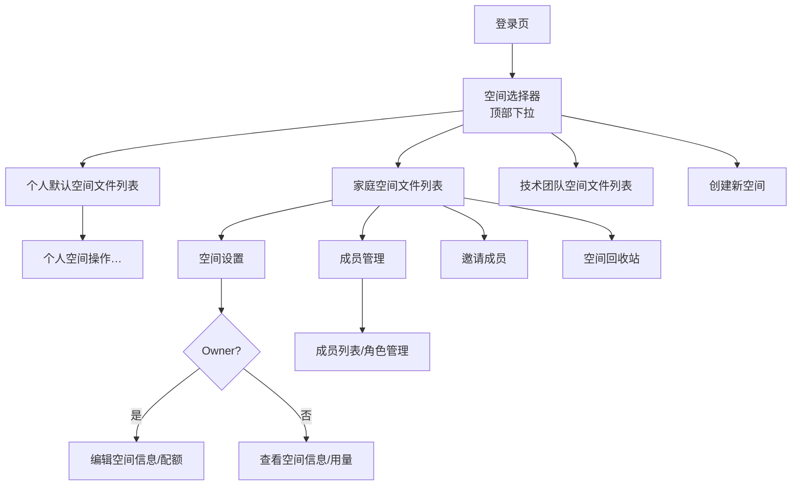
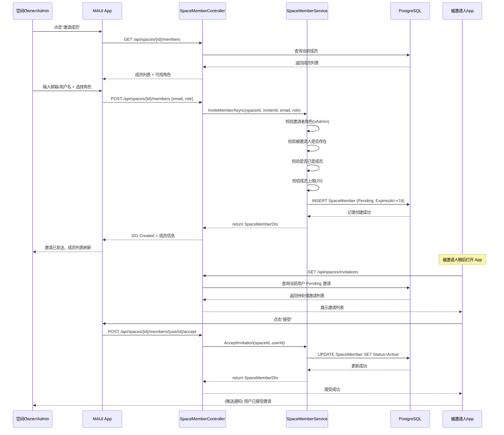
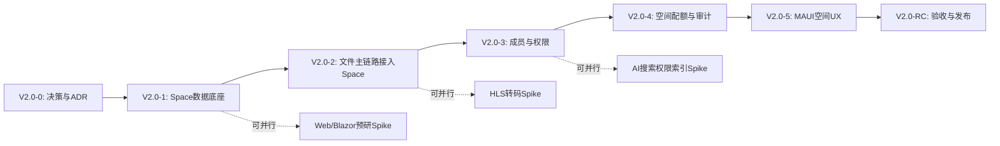

# PrivateCloudDrive V2.0 PRD：空间架构升级 — 家庭/团队共享云盘

| 元数据 | 值 |
|:------|:---:|
| 文档版本 | 1.0 |
| 日期 | 2026-07-16 |
| 负责人 | Hermes-PM（pm） |
| 产品定位 | V2.0 MVP — 从个人 OwnerId 云盘升级为 Space（空间）云盘 |
| 前置输入 | `docs/release-plan-v2.0.md`、`docs/scenario-matrix-v2.0.md`、`docs/architecture-v2.0-boundary.md`、`docs/v2.0-pre-study.md` |
| 后续产出 | ADR × 4（Space/权限/归属升级/迁移策略）→ V2.0-1~R 子阶段 Kanban 任务 |

---

## 目录

1. [产品概述与方向](#1-产品概述与方向)
2. [P0 功能详细规格](#2-p0-功能详细规格)
3. [端到端用户流程](#3-端到端用户流程)
4. [错误与异常总表](#4-错误与异常总表)
5. [国际化需求决策](#5-国际化需求决策)
6. [非功能需求规格](#6-非功能需求规格)
7. [API 变更总览](#7-api-变更总览)
8. [数据字典摘要](#8-数据字典摘要)
9. [页面变更清单](#9-页面变更清单)
10. [验收门禁矩阵](#10-验收门禁矩阵)
11. [附录：工作量与批次](#11-附录工作量与批次)

---

## 1. 产品概述与方向

### 1.1 一句话定位

> **V2.0 = 从个人 OwnerId 云盘升级为 Space（空间）云盘的架构版本。**

PrivateCloudDrive V2.0 不是"所有 V1.x 没做的功能合集"，而是把产品形态从"一个人独有"升级为"家庭/小团队共享"。

### 1.2 核心方向变化

| 维度 | V1.x（当前） | V2.0（目标） |
|------|-------------|-------------|
| 数据隔离边界 | `TenantId + OwnerId` | `TenantId + SpaceId + 权限裁剪` |
| 用户角色 | 普通用户 / 管理员 | Owner / Admin / Member / Viewer（空间内） |
| 容量归属 | 用户级配额 | 用户级配额 + 空间级独立配额 |
| 文件共享 | 公开外链分享 | 公开外链 + 空间内成员自动可见/可写 |
| 搜索范围 | 当前用户文件 | 当前用户在可见空间内的文件 |
| 产品形态 | 个人私有云盘 | 家庭/小团队私有云盘中心 |

### 1.3 V2.0 MVP 范围定义

```
V2.0 MVP = Space 数据底座 + 成员管理 + 最小权限模型 + 空间配额 + 审计升级 + 文件主链路接入 Space
```

### 1.4 明确不进入 V2.0 MVP 的范围

| 能力 | 不进理由 | 建议路线 |
|------|---------|:-------:|
| AI 语义搜索 / 智能相册 | 依赖 embedding 服务、OCR/人脸模型，与空间底座无直接依赖但工程量过大 | V2.1+ |
| 桌面同步客户端 | 需要变更日志、冲突处理、客户端状态库，完全独立产品 | V3.0 候选 |
| iOS 正式发布 | 证书、推送、平台差异未验证；MAUI 基线为 Android/Windows | 技术预研可在 V2.0 末期并行 |
| 完整 Web/Blazor 管理后台 | 独立产品线，替代 MAUI Settings | V2.0-4 后可做 Spike |
| HLS 转码 / 低清预览 | 与空间底座无关 | V2.1+ |
| 外部登录全平台关闭环 | 与空间权限低耦合 | V1.5 或 V2.x 增强 |
| 复杂组织架构 / 部门 / 审批流 | 产品定位为小团队/家庭 | 永不进入 |
| Office 在线协同编辑 | 完全独立产品 | 永不进入 |

---

## 2. P0 功能详细规格

以下为 15 个 P0 功能的详细规格，每项包含功能描述、用户故事、验收条件、UI 示意和异常处理。

---

### SP-01：Space / SpaceMember / SpaceRole 领域实体 + DB Schema

**功能描述：** 新增 Space（空间）、SpaceMember（空间成员）、SpaceRole（空间角色枚举）三个领域实体，配套 EF Core 配置和数据库迁移，作为 V2.0 的空间数据底座。

**用户故事：**

> **As a** 系统架构师  
> **I want** 定义 Space、SpaceMember、SpaceRole 的实体结构、索引约束和 EF 配置  
> **So that** 所有上层功能（创建空间、成员邀请、权限校验）有可依赖的数据模型

**验收条件：**

| # | 验收项 | 方法 | 预期 |
|:-:|--------|------|------|
| AC01 | Space 实体定义完整 | 检查实体类 | 包含 Id, Name, AvatarUrl, OwnerId, SpaceType, Status, CreatedAt, UpdatedAt, DeletedAt |
| AC02 | SpaceMember 实体定义完整 | 检查实体类 | 包含 Id, SpaceId, UserId, Role, Status, InvitedBy, InvitedAt, ActivatedAt, ExpiresAt, LeftAt |
| AC03 | SpaceRole 枚举定义 | 检查枚举 | Owner=5, Admin=4, Member=2, Viewer=1（预留等级递进） |
| AC04 | 唯一索引配置 | EF migration 检查 | UQ_SpaceMember_SpaceId_UserId 唯一约束 |
| AC05 | EF Migration 生成成功 | `dotnet ef migrations add V2.0_SpaceModel` | 生成成功无错误 |
| AC06 | 空间名同用户唯一索引 | 检查 | UQ_Space_OwnerId_Name 唯一约束 |
| AC07 | 成员过期时间索引 | 检查 | IX_SpaceMember_ExpiresAt，用于定时清理 |

**UI 示意：** 无直接 UI，为后台数据底座。

**异常处理：** 实体约束违反时由 EF Core 抛出 `DbUpdateException`，由仓储层统一转换。

---

### SP-02：默认个人空间迁移 + DbMigrator Dry-Run

**功能描述：** 将现有 V1.x 用户的文件数据按 `OwnerId` 自动归入一个默认个人空间（PersonalSpace），提供 `--dry-run` 模式预览迁移影响。

**用户故事：**

> **As a** 部署管理员  
> **I want** 在升级到 V2.0 时自动为每个用户创建默认个人空间，并将所有现有文件迁入其中  
> **So that** 现有用户数据不会丢失，且迁移过程可通过 dry-run 预览风险

**验收条件：**

| # | 验收项 | 方法 | 预期 |
|:-:|--------|------|------|
| AC01 | 默认个人空间创建 | 迁移运行后检查 DB | 每个现有用户有一条 Space + SpaceMember（Owner）记录 |
| AC02 | FileNode 迁移计数一致 | 迁移前后对比 | FileNode 总数不变，全部有 SpaceId 映射到对应空间 |
| AC03 | BlobObject/MediaAsset 迁移 | 迁移前后对比 | 计数一致 |
| AC04 | --dry-run 正常输出报告 | 执行 `DbMigrator --dry-run` | 输出迁移前/后计数 + 差异说明，不实际写入 DB |
| AC05 | 个人空间命名规则 | 检查 Space.Name | 格式为 `{用户显示名} 的个人空间` |
| AC06 | dry-run 回滚 | dry-run 后 DB 状态 | 无任何数据变更 |
| AC07 | 多用户一致性 | 3 用户测试 | 每个用户数据正确归入其空间 |
| AC08 | 重复运行幂等 | 迁移脚本执行两次 | 第二次不创建重复空间，idempotent |

**UI 示意：** 无直接 UI。迁移进度可通过控制台日志查看。

**异常处理：**

| 异常 | 行为 | 提示 |
|------|------|------|
| 迁移中断 | 事务回滚 | "迁移中断，数据已回滚至迁移前状态" |
| 某用户迁移失败 | 跳过该用户（批次模式） | "用户 X 迁移失败，原因：..." |
| dry-run 超时 | dry-run 报告不完整 | "dry-run 预计时间较长，请耐心等待" |

---

### SP-03：FileNode 增加 SpaceId + 仓储查询升级

**功能描述：** `FileNode` 实体增加 `SpaceId (Guid?, FK)` 字段，将所有仓储查询从 `OwnerId == currentUser` 模式升级为 `SpaceId IN (accessibleSpaces)` + 权限角色过滤模式。

**用户故事：**

> **As a** 后端工程师  
> **I want** FileNode 具有 SpaceId 字段，仓储查询按空间隔离  
> **So that** 不同空间的文件列表互不可见，为权限校验提供基础

**验收条件：**

| # | 验收项 | 方法 | 预期 |
|:-:|--------|------|------|
| AC01 | FileNode.SpaceId 字段存在 | 检查实体 | Guid? 类型，可为空（兼容 V1.x 遗留数据） |
| AC02 | 空间内文件列表查询 | GET files | 仅返回指定 SpaceId 的文件 |
| AC03 | 跨空间查询隔离 | 用户 A 查询空间 B | 返回空列表或 403 |
| AC04 | 查询升级不影响 V1.x 兼容路径 | 不传 spaceId 调用 | 退化为默认个人空间查询 |
| AC05 | EF 集成测试 PASS | `dotnet test --filter FileNodeQuery` | 全部通过 |
| AC06 | 文件夹子文件查询 | GET folders/{id}/children | 按 SpaceId 隔离 |
| AC07 | 回收站查询隔离 | GET trash | 按 SpaceId 隔离 |

**UI 示意：** 无直接 UI。后端数据层变更，前端通过 API 感知隔离效果。

---

### SP-04：BlobObject / UploadSession 增加 SpaceId

**功能描述：** `BlobObject` 和 `UploadSession` 实体增加 `SpaceId` 字段，确保上传链路和存储元数据的空间归属一致。

**用户故事：**

> **As a** 后端工程师  
> **I want** BlobObject 和 UploadSession 记录 SpaceId  
> **So that** 上传流程的存储层也能按空间隔离审计和查询

**验收条件：**

| # | 验收项 | 方法 | 预期 |
|:-:|--------|------|------|
| AC01 | BlobObject.SpaceId 写入 | 上传文件后检查 | BlobObject 记录含 SpaceId |
| AC02 | UploadSession.SpaceId 写入 | 创建上传会话 | UploadSession 记录含 SpaceId |
| AC03 | 迁移兼容 | 迁移后检查 | 已有 BlobObject 补上 SpaceId |
| AC04 | 上传时权限校验关联 | 空间内上传流程 | 上传前校验用户角色 >= Member |
| AC05 | 断点续传携带 SpaceId | 分片上传 | 每个分片请求都有 SpaceId |

---

### SP-05：MediaAsset / MediaAlbum 增加 SpaceId

**功能描述：** 媒体库实体（MediaAsset、MediaAlbum）增加 SpaceId，实现媒体内容按空间隔离展示。

**用户故事：**

> **As a** 空间成员  
> **I want** 切换到某个空间时，只能看到该空间的图片、视频和相册  
> **So that** 不同家庭的空间媒体内容不会混淆

**验收条件：**

| # | 验收项 | 方法 | 预期 |
|:-:|--------|------|------|
| AC01 | 媒体时间线按 SpaceId 隔离 | 切换空间后查看 | 只显示当前空间媒体 |
| AC02 | 视频列表按 SpaceId 隔离 | 切换空间后查看 | 只显示当前空间视频 |
| AC03 | 相册（MediaAlbum）按 SpaceId 隔离 | 切换空间后查看 | 只显示当前空间相册 |
| AC04 | 迁移前后媒体计数一致 | 迁移检查 | 全部媒体文件正确归入个人空间 |
| AC05 | Viewer 角色只能查看 | 媒体页测试 | Viewer 可浏览不可上传/删除 |

**UI 示意（文字描述）：** 媒体标签页顶部集成空间选择器，选中后图片/视频时间线自动刷新为该空间内容。相册列表增加 SpaceId 过滤条件。

---

### SP-06：FileShare / FileTag 增加 SpaceId

**功能描述：** 文件分享（FileShare）和标签（FileTag）实体增加 SpaceId，实现分享链接和标签按空间隔离。

**用户故事：**

> **As a** 空间管理员  
> **I want** 空间内创建的分享链接只分享该空间的文件，标签只在该空间范围内可用  
> **So that** 分享和标签管理不会跨空间泄露

**验收条件：**

| # | 验收项 | 方法 | 预期 |
|:-:|--------|------|------|
| AC01 | 分享列表按 SpaceId 隔离 | GET shares | 只返回当前空间分享 |
| AC02 | 标签列表按 SpaceId 隔离 | GET tags | 只返回当前空间标签 |
| AC03 | 跨空间分享访问 | 非空间成员访问 | 403 或密码拦截 |
| AC04 | 标签不跨空间搜索 | 搜索测试 | 不返回其他空间标签 |
| AC05 | 分享链接撤权即时 | 修改权限后 | 原链接不再有效 |

---

### SP-07：空间成员管理（添加/移除/角色切换/禁用）

**功能描述：** 完整的空间成员管理功能，支持 Owner/Admin 添加成员、设置角色、切换角色、移除成员、禁用成员。

**用户故事：**

> **As a** 空间拥有者 (SPACE_OWNER)  
> **I want** 通过邮箱或用户名邀请其他用户加入空间，设置他们的角色，随时调整或移除  
> **So that** 我可以精细控制谁能访问我的家庭空间及其权限

**验收条件：**

| # | 验收项 | 方法 | 预期 |
|:-:|--------|------|------|
| AC01 | Owner 邀请成员 | 输入邮箱 → 选择角色 → 发送 | SpaceMember 创建为 Pending |
| AC02 | Admin 邀请成员 | Admin 操作 | 成功，但不可邀请为 Admin |
| AC03 | 被邀请人接受 | 接受邀请 | SpaceMember → Active |
| AC04 | 被邀请人拒绝 | 拒绝邀请 | SpaceMember → Rejected |
| AC05 | 角色切换（Owner） | Owner 修改角色 | 即时生效 |
| AC06 | 角色切换（Admin） | Admin 修改角色 | 只能改非 Admin 角色 |
| AC07 | 移除成员 | Owner/Admin 操作 | SpaceMember → Removed |
| AC08 | 成员禁用 | Admin 操作 | 临时禁止访问 |
| AC09 | 邀请自己 | 测试 | 400 错误 |
| AC10 | 邀请已存在成员 | 测试 | 409 错误 |
| AC11 | 达到成员上限（20人） | 测试 | 403 错误 |
| AC12 | 邀请 7 天过期 | 等待 7 天 | 自动 Expired |

**UI 示意（文字描述）：**

```
┌─────────────────────────────────────┐
│  空间设置 > 成员管理                  │
│                                      │
│  [+ 邀请成员]                        │
│                                      │
│  📍 成员列表 (5/20)                  │
│  ┌─────────────────────────────────┐ │
│  │ 张三   Owner   已加入 2026-07-16│ │
│  │ 李四   Admin   已加入 2026-07-16│ │
│  │ 王五  [Member] 待接受            │ │
│  │ 赵六   Viewer  已禁用 ⏸         │ │
│  └─────────────────────────────────┘ │
│                                      │
│  邀请弹窗：                            │
│  ┌─────────────────────────────────┐ │
│  │ 用户邮箱/用户名: [___________]   │ │
│  │ 角色: [▼ Admin / Member / Viewer]│ │
│  │                 [取消] [发送邀请] │ │
│  └─────────────────────────────────┘ │
└─────────────────────────────────────┘
```

---

### SP-08：空间内文件主链路权限校验

**功能描述：** 所有文件操作（列表/上传/下载/删除/恢复/永久删除/移动/重命名）按空间角色权限矩阵执行校验，确保权限边界安全。

**用户故事：**

> **As a** 空间成员 (SPACE_MEMBER)  
> **I want** 在空间内上传、下载、删除文件时，系统检查我的角色是否有权操作  
> **So that** 只有 Member 及以上的用户可以上传，Viewer 只能查看，Admin/Owner 可管理全部文件

**权限矩阵：**

| 操作 | Owner | Admin | Member | Viewer |
|:---:|:-----:|:-----:|:------:|:------:|
| 文件列表 | ✅ | ✅ | ✅ | ✅ |
| 上传 | ✅ | ✅ | ✅ | ❌ |
| 下载 | ✅ | ✅ | ✅ | ✅ |
| 删除自己上传的文件 | ✅ | ✅ | ✅ | ❌ |
| 删除他人上传的文件 | ✅ | ✅ | ❌ | ❌ |
| 永久删除 | ✅ | ✅ | ❌ | ❌ |
| 恢复 | ✅ | ✅ | ✅ | ❌ |
| 移动/重命名 | ✅ | ✅ | ✅ | ❌ |
| 创建分享 | ✅ | ✅ | ✅ | ❌ |
| 取消任何分享 | ✅ | ✅ | ❌ | ❌ |
| 取消自己的分享 | ✅ | ✅ | ✅ | ✅ |

**验收条件：**

| # | 验收项 | 方法 | 预期 |
|:-:|--------|------|------|
| AC01 | Member 上传文件 | POST upload | 成功，FileNode.SpaceId 正确 |
| AC02 | Viewer 上传文件 | POST upload | 403 "无上传权限" |
| AC03 | Member 下载文件 | GET download | 成功 |
| AC04 | Viewer 删除文件 | DELETE | 403 "无删除权限" |
| AC05 | Member 删除自己文件 | DELETE | 成功 → 回收站 |
| AC06 | Member 删除他人文件 | DELETE | 403 "无权删除其他成员文件" |
| AC07 | Admin 删除任意文件 | DELETE | 成功 |
| AC08 | API 参数篡改测试 | 修改 spaceId | 403 无法越权 |

**UI 示意（文字描述）：** 权限不足时弹窗：

```
┌─────────────────────────────────┐
│ ⚠️ 权限不足                      │
│                                  │
│ 您的角色「查看者」无上传权限。    │
│ 如需上传，请联系空间拥有者升级角色。│
│                                  │
│            [知道了]               │
└─────────────────────────────────┘
```

---

### SP-09：创建/管理空间（含切换）

**功能描述：** 用户可在 MAUI App 中创建新空间、查看空间列表、切换当前活动空间、编辑空间信息、删除空间。

**用户故事：**

> **As a** 拥有私有云盘的用户 (PERSONAL)  
> **I want** 在 App 内创建一个名为"我的家庭"的共享空间，设置 50GB 配额上限，邀请我的家人加入  
> **So that** 他们可以共享照片和文件

**正常路径（Mermaid）：**

```mermaid
flowchart TD
    A[登录 App] --> B[侧边栏/顶部空间选择器]
    B --> C[点击"创建新空间"]
    C --> D[输入空间名称（1-64字符）]
    D --> E[可选：设置头像/配额]
    E --> F[点击确认创建]
    F --> G{后端校验}
    G -->|校验通过| H[POST /api/spaces]
    H --> I[DB：创建Space + SpaceMember + SpaceQuota]
    I --> J[返回 SpaceDto]
    J --> K[前端自动切换至新空间]
    G -->|校验失败| L[展示错误信息]
```

**验收条件：**

| # | 验收项 | 方法 | 预期 |
|:-:|--------|------|------|
| AC01 | 创建空间 | 输入名称 → 确认 | 创建成功，自动切换到新空间 |
| AC02 | 空间列表 | 切换空间 | 展示用户所属的所有空间 |
| AC03 | 切换空间 | 点选其他空间 | 文件列表/媒体库刷新为对应空间内容 |
| AC04 | 编辑空间信息 | 修改名称/描述 | PUT 成功，前端更新 |
| AC05 | 删除空间 | Owner 操作 | 空间删除，成员失去访问 |
| AC06 | 个人默认空间不可删除 | 尝试操作 | 无删除入口或操作失败 |
| AC07 | 空名称创建 | 测试 | 400 "空间名称不能为空" |
| AC08 | 名称超 64 字符 | 测试 | 400 "最多64个字符" |
| AC09 | 创建第 6 个空间 | 测试 | 403 "已达空间创建上限(5个)" |

**UI 示意（文字描述）：**

```
┌─────────────────────────────────────┐
│ ☰ Home     ▼ 我的家庭 ▾            │
│              ┌───────────────────┐  │
│              │ 📁 我的个人空间    │  │
│              │ 📁 我的家庭 ← 当前 │  │
│              │ 📁 技术团队       │  │
│              │ ───────────────   │  │
│              │ ✚ 创建新空间      │  │
│              └───────────────────┘  │
│                                      │
│  文件列表（我的家庭）                │
│  ┌─────────────────────────────────┐ │
│  │ 📁 家庭照片      2026-07-16    │ │
│  │ 📁 证件文档      2026-07-15    │ │
│  │ 📄 水电费清单.pdf 2026-07-14  │ │
│  └─────────────────────────────────┘ │
└─────────────────────────────────────┘
```

---

### SP-10：空间级配额 + 上传前校验

**功能描述：** 空间总容量上限设置、用量统计、上传前校验空间可用容量，超限拒绝。

**用户故事：**

> **As a** 空间拥有者 (SPACE_OWNER)  
> **I want** 为空间设置 50GB 的总容量上限，随时查看已用容量  
> **So that** 空间不会被单个成员无节制占用

**业务规则：**

| 规则 | 说明 |
|------|------|
| BR-QUOTA-01 | 空间配额系统最大值默认 100GB（可在 Settings 调整） |
| BR-QUOTA-02 | 配额修改不影响已上传文件，仅影响后续上传校验 |
| BR-QUOTA-03 | 减少配额低于已用量 → 允许修改 + 禁止新上传，直到用量降下来 |
| BR-QUOTA-04 | 上传前必须校验：UsedBytes + 新文件大小 ≤ QuotaBytes |
| BR-QUOTA-05 | 配额超额返回 HTTP 409 + 明确剩余空间提示 |

**验收条件：**

| # | 验收项 | 方法 | 预期 |
|:-:|--------|------|------|
| AC01 | 空间配额展示准确 | GET quota | 总量/已用/剩余/百分比 |
| AC02 | 上传超配额被拒绝 | 填满空间后上传 | 409 "空间容量不足，剩余 X.X GB" |
| AC03 | Owner 调整配额 | PUT quota | 即时生效 |
| AC04 | 调整超系统最大值 | 测试 | 400 "不能超过系统上限(100 GB)" |
| AC05 | 减少配额低于已用量 | 测试 | 允许修改 + 提示 ± 禁止新上传 |
| AC06 | 前端配额可视化 | 查看空间设置 | 用量进度条/饼图 |

**UI 示意（文字描述）：**

```
┌─────────────────────────────────────┐
│  空间设置 > 配额管理                  │
│                                      │
│  📊 空间使用情况                      │
│  已用: 12.5 GB / 总量: 50 GB (25%)  │
│  ████████░░░░░░░░░░░░░░░░░░░░░░░░░  │
│                                      │
│  修改空间配额上限: [_____50_____] GB │
│  [保存]                              │
│                                      │
│  ⚠️ 当前已用 12.5 GB，新配额 10 GB   │
│     将禁止新增上传。                  │
└─────────────────────────────────────┘
```

---

### SP-11：搜索按空间隔离 + 权限裁剪

**功能描述：** 全文搜索 API 增加 `SpaceId` 参数，搜索结果限定在当前用户当前空间可见的文件范围内，不跨空间泄露。

**用户故事：**

> **As a** 空间成员  
> **I want** 在当前空间中搜索文件时，只看到该空间内的文件  
> **So that** 我不会意外看到其他空间的私人文件

**验收条件：**

| # | 验收项 | 方法 | 预期 |
|:-:|--------|------|------|
| AC01 | 空间内搜索 | 搜索关键词 | 仅返回当前空间匹配文件 |
| AC02 | 跨空间搜索隔离 | A 空间搜索 B 空间文件 | 不返回 B 空间结果（用户无感知） |
| AC03 | Viewer 搜索可用 | Viewer 搜索 | 可搜索空间内文件（只读） |
| AC04 | 搜索 + 角色过滤 | Member/Viewer 搜索 | 搜索结果经过权限裁剪 |

**UI 示意：** 搜索栏位于当前空间文件列表顶部，搜索范围自动限定在当前选中空间。

---

### SP-12：操作日志增加 SpaceId

**功能描述：** `OperationLog` 实体增加 `SpaceId`、`OperatorRole`、操作目标资源关联，支持管理员按空间筛选查看审计日志。

**用户故事：**

> **As a** 系统管理员  
> **I want** 每条操作日志记录 SpaceId 和操作者在空间中的角色  
> **So that** 审计可追溯"谁在哪个空间做了什么操作"

**验收条件：**

| # | 验收项 | 方法 | 预期 |
|:-:|--------|------|------|
| AC01 | 日志记录 SpaceId | 文件操作后检查 | OperationLog.SpaceId 非空 |
| AC02 | 日志记录操作者角色 | 检查日志 | 记录 OperatorRole |
| AC03 | 按空间筛选日志 | 管理端操作 | 可查看指定空间日志 |
| AC04 | 日志记录越权尝试 | 测试 | 含 UserId/SpaceId/请求路径/响应码 |

---

### SP-13：迁移演练 + 回滚方案

**功能描述：** 在测试环境执行全量迁移 dry-run，备份策略验证，回滚文档完整。

**用户故事：**

> **As a** 部署管理员  
> **I want** 在正式迁移前通过 dry-run 确认迁移安全，并准备好完整的回滚方案  
> **So that** 生产迁移风险可控，出现问题时可在 30 分钟内回滚

**验收条件：**

| # | 验收项 | 方法 | 预期 |
|:-:|--------|------|------|
| AC01 | 测试库 dry-run | 执行 dry-run | 所有校验通过，计数一致 |
| AC02 | 备份脚本可用 | 执行 pg_dump | dump 文件生成成功 |
| AC03 | 回滚文档完整 | 检查文档 | 包含具体命令、步骤、验证条件 |
| AC04 | 回滚演练 | 备份 → 恢复 → 验证 | 30 分钟内完成回滚 |
| AC05 | Storage 目录备份 | tar czf | 完整备份 |

---

### SP-14：MAUI 空间切换 UX + 空间设置 + 成员页

**功能描述：** MAUI 前端实现空间选择器、空间设置页、成员管理页、权限不足提示。Android 构建通过。

**用户故事：**

> **As a** 移动端用户  
> **I want** 在 App 顶部的空间选择器中切换空间，进入空间设置页查看信息，在成员页管理成员  
> **So that** 所有空间操作在手机上即可完成

**页面清单：**

| 页面 | 功能 | 角色 |
|:----:|------|:----:|
| 空间选择器 | 顶部下拉菜单，展示所有空间，支持切换和创建 | 所有用户 |
| 创建空间页 | 名称/头像/配额表单 | 登录用户 |
| 空间文件列表 | 当前空间文件浏览，按角色显示操作按钮 | 空间成员 |
| 成员管理页 | 成员列表/角色切换/移除/禁用 | Owner/Admin |
| 邀请成员页 | 搜索用户/选择角色/发送邀请 | Owner/Admin |
| 空间设置页 | 空间信息编辑/配额查看 | Owner/Admin |
| 空间回收站 | 空间内回收站列表 | ≥Member |
| 邀请通知页 | 显示待接受的邀请 | 所有用户 |

**验收条件：**

| # | 验收项 | 方法 | 预期 |
|:-:|--------|------|------|
| AC01 | MAUI Android 构建 | `dotnet build -f net10.0-android` | 0 errors |
| AC02 | 空间选择器可见 | 登录后顶部 | 显示当前空间名，点击可展开列表 |
| AC03 | 空间切换 | 点击其他空间 | 文件列表刷新 |
| AC04 | 空间设置页 | Owner 进入 | 可编辑名称，查看配额 |
| AC05 | 成员管理页 | Owner/Admin 进入 | 成员列表 + 操作按钮 |
| AC06 | 权限不足提示 | Viewer 操作上传 | 弹窗提示 |
| AC07 | 创建空间表单 | 输入有效数据 | 创建成功 |
| AC08 | 真机验收 | Android 设备 | 空间切换/成员/设置页运行正常 |

**Mermaid 页面导航示意：**



---

### SP-15：多用户多空间权限测试矩阵 + 安全审计

**功能描述：** 构建多用户 x 多空间 x 多角色的测试矩阵，验证权限隔离、越权防护、搜索隔离、配额隔离、分享安全。

**用户故事：**

> **As a** QA 工程师  
> **I want** 执行完整的权限测试矩阵，模拟所有角色组合和越权攻击场景  
> **So that** 确保 V2.0 空间权限隔离无泄露风险

**测试矩阵：**

```
3 个用户 × 2 个空间 × 4 种角色组合
= 至少 24 个权限场景

每个场景测试：
- 文件列表/上传/下载/删除
- 搜索（不跨空间）
- 参数篡改（SpaceId/FileNodeId/HTTP Method）
- 媒体库隔离
- 分享隔离
- 配额隔离
```

**验收条件：**

| # | 验收项 | 方法 | 预期 |
|:-:|--------|------|------|
| AC01 | 全矩阵测试 PASS | 自动化/手动 | 0 越权 |
| AC02 | 参数篡改测试 | 修改 spaceId/fileId | 403 拒绝 |
| AC03 | 搜索隔离测试 | A 空间搜索 B 空间 | 空结果 |
| AC04 | 媒体隔离测试 | 切换空间查看媒体 | 互不可见 |
| AC05 | 配额隔离测试 | A 空间满后 B 空间 | B 空间上传正常 |
| AC06 | 分享安全测试 | 外链被空间外用户访问 | 403/密码拦截 |
| AC07 | 安全审计报告 | 输出 | 内容完整，无 BLOCKER |

---

## 3. 端到端用户流程

### 3.1 完整注册 → 空间操作流程

```mermaid
flowchart TD
    A[用户注册/登录] --> B[首次登录检测]
    B --> C{已有默认个人空间?}
    C -->|否| D[自动创建个人空间\nSpace: "xxx的个人空间"\nSpaceMember: Owner]
    C -->|是| E[进入个人空间文件列表]
    D --> E
    E --> F[空间选择器]
    F --> G{切换/创建空间?}
    G -->|切换已有空间| H[切换到目标空间]
    G -->|创建新空间| I[创建新空间表单]
    I --> J[输入名称/设置配额]
    J --> K[POST /api/spaces]
    K --> L[自动成为 Owner]
    L --> H
    H --> M[空间首页文件列表]
    
    M --> N{成员操作?}
    N -->|邀请成员| O[搜索用户/选择角色]
    O --> P[POST 邀请]
    P --> Q[被邀请人收到通知]
    Q --> R[被邀请人接受]
    R --> S[成员可访问空间]
    
    N -->|文件操作| T[上传/下载/删除/搜索]
    T --> U{权限校验}
    U -->|通过| V[正常执行]
    U -->|拒绝| W[权限不足弹窗]
    
    N -->|管理操作| X{角色=Owner/Admin?}
    X -->|是| Y[成员管理/配额设置]
    X -->|否| Z[仅查看/上传权限]
```

### 3.2 邀请成员完整时序



### 3.3 空间切换 → 空间内文件操作流程

```mermaid
flowchart TD
    A[当前空间文件列表] --> B[点击顶部空间选择器]
    B --> C[展示用户所有空间]
    C --> D[选择目标空间]
    D --> E[API: GET /api/spaces/{id}/files]
    E --> F[后端: SpacePermissionService]
    F --> G{用户在该空间是 Active?}
    G -->|是| H{用户角色 >= Viewer?}
    H -->|是| I[返回文件列表\n(按角色权限裁剪)]
    H -->|否| J[返回空列表]
    G -->|否| K[返回 403 + 弹窗]
    I --> L[用户浏览/操作文件]
    L --> M{操作类型}
    M -->|上传| N[空间配额校验]
    N -->|充足| O[POST 上传\n写入 SpaceId]
    N -->|不足| P[弹窗 "容量不足"]
    M -->|下载| Q[权限 >= Viewer?\n→ 允许下载]
    M -->|删除| R{角色 >= Member?}
    R -->|是| S{删除自己的?}\n→ 允许
    R -->|否| T[403 弹窗]
    S -->|删除他人的| U{角色 >= Admin?}
    U -->|是| V[允许]
    U -->|否| T
```

---

## 4. 错误与异常总表

以下为 V2.0 MVP 所有错误场景的汇总，按模块分类：

### 4.1 空间管理错误

| 错误码 | HTTP | 触发条件 | 用户可见信息 | 解决方案 |
|:------:|:----:|---------|-------------|---------|
| SPACE-001 | 400 | 空间名称为空 | "空间名称不能为空" | 修改后重试 |
| SPACE-002 | 400 | 空间名称超 64 字符 | "空间名称最多 64 个字符" | 修改后重试 |
| SPACE-003 | 403 | 已达空间创建上限(5个) | "您已达到空间创建上限(5个)" | 删除一个空间后再创建 |
| SPACE-004 | 400 | 配额超系统最大值 | "空间配额上限不能超过 X GB" | 减小配额值 |
| SPACE-005 | 409 | 同名空间（同用户） | "您已有一个同名空间" | 修改空间名称 |
| SPACE-006 | 404 | 空间不存在或已删除 | "空间不存在或已被删除" | 刷新空间列表 |
| SPACE-007 | 403 | 个人默认空间不可删除 | "默认个人空间不可删除" | 无操作 |

### 4.2 成员管理错误

| 错误码 | HTTP | 触发条件 | 用户可见信息 | 解决方案 |
|:------:|:----:|---------|-------------|---------|
| MEMBER-001 | 404 | 被邀请用户不存在 | "未找到该用户" | 检查输入后重试 |
| MEMBER-002 | 409 | 用户已在空间中 | "该用户已在空间中" | 无需重复邀请 |
| MEMBER-003 | 409 | 已有待处理的邀请 | "该用户已有待处理的邀请" | 等待响应或取消 |
| MEMBER-004 | 400 | 邀请自己 | "不能邀请自己" | 无操作 |
| MEMBER-005 | 400 | 邀请角色为 Owner | "Owner 不可通过邀请分配" | 选 Admin/Member/Viewer |
| MEMBER-006 | 403 | 成员已达上限(20人) | "空间成员已达上限(20人)" | 移除不活跃成员 |
| MEMBER-007 | 403 | Admin 分配 Admin 角色 | "您无权分配 Admin 角色" | 邀请为 Member/Viewer |
| MEMBER-008 | 403 | 用户账号已禁用 | "该用户账号已被禁用" | 联系系统管理员 |
| MEMBER-009 | 403 | 非 Owner/Admin 访问成员管理 | "您无权管理空间成员" | 联系 Owner |
| MEMBER-010 | 400 | 尝试移除 Owner | "空间拥有者不可被移除" | 不可操作 |
| MEMBER-011 | 403 | Admin 修改其他 Admin 角色 | "您无权修改管理员角色" | 联系 Owner |

### 4.3 文件操作错误

| 错误码 | HTTP | 触发条件 | 用户可见信息 | 解决方案 |
|:------:|:----:|---------|-------------|---------|
| FILE-001 | 403 | Viewer 尝试上传 | "您的角色为查看者，无上传权限" | 联系 Owner 升级角色 |
| FILE-002 | 409 | 空间配额不足 | "空间容量不足，剩余仅 X.X GB" | 清理空间或扩容 |
| FILE-003 | 403 | 不在空间中的用户访问 | "您已不在该空间中" | 切换至个人空间 |
| FILE-004 | 403 | Member 删除他人文件 | "您无权删除其他成员上传的文件" | 联系 Admin/Owner |
| FILE-005 | 403 | 尝试删除→永久删除（Member） | "您无权永久删除文件" | 无操作 |
| FILE-006 | 403 | Viewer 删除（任何） | "您的角色无删除权限" | 联系 Owner |

### 4.4 迁移错误

| 错误码 | HTTP | 触发条件 | 用户可见信息 | 解决方案 |
|:------:|:----:|---------|-------------|---------|
| MIGRATE-001 | 403 | 包含非本人文件 | "部分文件不属于您，无法迁移" | 仅选择自己上传的文件 |
| MIGRATE-002 | 409 | 目标空间配额不足 | "目标空间容量不足" | 清理目标空间或扩容 |
| MIGRATE-003 | 403 | 目标空间无权写入 | "您无权向该空间迁移文件" | 联系目标空间 Owner |
| MIGRATE-004 | 400 | 一次迁移超 50 个文件 | "一次最多迁移 50 个文件" | 分批迁移 |

### 4.5 通用错误

| 错误码 | HTTP | 触发条件 | 用户可见信息 | 解决方案 |
|:------:|:----:|---------|-------------|---------|
| COMMON-001 | 401 | Token 过期 | "登录已过期，请重新登录" | 跳转登录页 |
| COMMON-002 | 401 | Token 无效 | "登录信息无效" | 重新登录 |
| COMMON-003 | 500 | 服务器内部错误 | "操作失败，请稍后重试" | 刷新重试或联系管理员 |
| COMMON-004 | 503 | 服务暂时不可用 | "服务暂时不可用，请稍后重试" | 稍后重试 |
| COMMON-005 | — | 网络断开 | "网络连接已断开" | 检查网络后重试 |

---

## 5. 国际化需求决策

### 5.1 决策：MVP 不支持多语言

**结论：V2.0 MVP 不支持多语言切换（i18n）。**

理由：

| 因素 | 评估 | 决策依据 |
|------|:----:|---------|
| 目标用户 | 当前用户全部为中文用户 | 无多语言需求 |
| 工程量 | MAUI 全量字符串提取 + 翻译 + 运行时切换 | 估计额外 5-8 人天，不阻塞空间底座 |
| 数据影响 | 用户生成内容（文件名、空间名）本身是多语言的 | 数据层已有 Unicode 支持，无需额外工作 |
| 兼容性 | 后端异常信息当前为中文 | 可以在 V2.1 做统一 i18n 改造 |

### 5.2 后置条件

- 后端异常消息统一抽取为资源文件（.resx）→ V2.1 候选
- MAUI 字符串资源文件（.resx）结构建立 → V2.1 候选
- 空间名、描述等用户输入字段的 Unicode 支持已在 V1.x 验证，无需额外工作

---

## 6. 非功能需求规格

### 6.1 响应时间

| 指标 | 目标 | 测量方法 |
|------|:----:|---------|
| 空间列表加载 | ≤ 500ms (100 空间内) | API 响应时间 |
| 空间切换后文件列表 | ≤ 1s (1000 文件内) | 用户感知时间 |
| 成员管理操作 | ≤ 300ms | API 响应时间 |
| 文件搜索（空间内） | ≤ 2s | 用户感知时间 |
| 空间创建 | ≤ 800ms | API 响应时间 |

### 6.2 并发访问

| 场景 | 目标 | 说明 |
|------|:----:|------|
| 单空间并发操作 | 10 并发用户 | 家庭空间典型场景 |
| 空间创建并发 | 5 TPS | 非高频操作 |
| 文件上传并发 | 5 并发上传 | 家庭使用场景 |
| 搜索并发 | 10 QPS | 近期峰值 |

### 6.3 备份策略

| 策略 | 说明 | 频率 |
|------|------|:----:|
| 迁移前全量备份 | pg_dump (custom format, compress 9) | 迁移前一次 |
| Storage 目录备份 | tar czf 完整备份 | 迁移前一次 |
| 迁移后校验 | 迁移前后数据计数对比 | dry-run + 正式迁移各一次 |
| 回滚恢复演练 | 从 dump 恢复并验证 | V2.0-RC 阶段 |

### 6.4 兼容性要求

| 要求 | 策略 |
|------|------|
| V1.x API 完全保留 | 不做破坏性变更，仅增加可选参数 |
| 旧客户端可用 | 不传 spaceId → 自动映射到默认个人空间 |
| 新增 API 参数为可选 | spaceId 参数 nullable |
| 旧 API 路径不变 | 文件列表/上传/搜索/分享路径不变 |
| OpenIddict / 认证流 | 完全不修改 |

### 6.5 安全性要求

| 要求 | 实现方式 |
|------|---------|
| 防止 IDOR 越权 | 每个空间级 API 调用 `SpacePermissionService.CheckAsync()` |
| 搜索隔离 | 搜索限定 `SpaceId IN accessibleSpaces` |
| 媒体隔离 | 媒体查询限定当前空间 |
| 配额隔离 | A 空间配额不影响 B 空间 |
| 分享访问控制 | 分享链接校验 SpaceId + 用户权限 |
| 审计追溯 | 操作日志记录 SpaceId + 操作者角色 |

---

## 7. API 变更总览

### 7.1 新增 API

| 端点 | 方法 | 说明 | 角色限制 |
|------|:----:|------|:--------:|
| `/api/spaces` | GET | 获取用户空间列表（含角色） | 登录用户 |
| `/api/spaces` | POST | 创建新空间 | 登录用户 |
| `/api/spaces/{id}` | GET | 获取空间详情 | Active 空间成员 |
| `/api/spaces/{id}` | PUT | 更新空间信息 | Owner / Admin |
| `/api/spaces/{id}` | DELETE | 删除空间 | Owner |
| `/api/spaces/{id}/members` | GET | 获取空间成员列表 | Owner / Admin / Member / Viewer |
| `/api/spaces/{id}/members` | POST | 邀请成员 | Owner / Admin |
| `/api/spaces/{id}/members/{userId}` | PUT | 修改成员角色 | Owner / Admin（受限） |
| `/api/spaces/{id}/members/{userId}` | DELETE | 移除成员 | Owner / Admin |
| `/api/spaces/{id}/members/{userId}/accept` | POST | 接受邀请 | 被邀请用户 |
| `/api/spaces/{id}/members/{userId}/reject` | POST | 拒绝邀请 | 被邀请用户 |
| `/api/spaces/{id}/members/{userId}/leave` | POST | 退出空间 | Active 非 Owner |
| `/api/spaces/{id}/quota` | GET | 获取空间配额/用量 | Active 空间成员 |
| `/api/spaces/{id}/quota` | PUT | 更新空间配额 | Owner |
| `/api/spaces/{id}/files` | GET | 空间内文件列表 | ≥Viewer |
| `/api/spaces/{id}/files/upload` | POST | 空间内上传 | ≥Member |
| `/api/spaces/{id}/files/{fileId}/download` | GET | 空间内下载 | ≥Viewer |
| `/api/spaces/{id}/files/search` | GET | 空间内搜索 | ≥Viewer |
| `/api/spaces/{id}/trash` | GET | 空间内回收站 | ≥Member |
| `/api/spaces/{id}/migrate` | POST | 个人文件迁移到空间 | ≥Member（仅限本人文件） |

**API 总数：新增 20 个端点**

### 7.2 修改的 API

| 端点 | 变更内容 | 兼容性 |
|------|---------|:------:|
| `GET /api/file-center/folders` | 增加可选 `spaceId` 参数 | ✅ 向后兼容 |
| `POST /api/file-center/files/upload` | 增加可选 `spaceId` 参数 | ✅ 向后兼容 |
| `GET /api/file-center/files/{id}/download` | 增加可选 `spaceId` 参数 | ✅ 向后兼容 |
| `GET /api/file-center/search` | 增加可选 `spaceId` 参数 | ✅ 向后兼容 |
| `GET /api/media-center/videos` | 增加可选 `spaceId` 参数 | ✅ 向后兼容 |
| `GET /api/media-center/videos/{id}/detail` | 增加可选 `spaceId` 参数 | ✅ 向后兼容 |
| `GET /api/share-center/shares` | 增加可选 `spaceId` 参数 | ✅ 向后兼容 |

---

## 8. 数据字典摘要

### 8.1 Space（空间）

| 字段 | 类型 | 约束 | 说明 |
|------|------|:----:|------|
| Id | Guid (UUID v7) | PK | 空间唯一标识 |
| Name | string(1~64) | NOT NULL | 空间名称 |
| AvatarUrl | string(500)? | NULL | 空间头像 |
| OwnerId | Guid | FK → IdentityUser, NOT NULL | 空间创建者 |
| SpaceType | enum | NOT NULL | Personal / Family / Team |
| Status | enum | NOT NULL, default: Active | Active / Archived / Deleted |
| CreatedAt | DateTime | NOT NULL | 创建时间 |
| UpdatedAt | DateTime? | NULL | 修改时间 |
| DeletedAt | DateTime? | NULL | 删除时间（软删除预留） |

### 8.2 SpaceMember（空间成员）

| 字段 | 类型 | 约束 | 说明 |
|------|------|:----:|------|
| Id | Guid (UUID v7) | PK | 关系标识 |
| SpaceId | Guid | FK → Space, NOT NULL | 所属空间 |
| UserId | Guid | FK → IdentityUser, NOT NULL | 成员用户 |
| Role | enum | NOT NULL | Owner / Admin / Member / Viewer |
| Status | enum | NOT NULL, default: Pending | Pending / Active / Expired / Rejected / Removed / Left |
| InvitedBy | Guid? | FK → IdentityUser | 邀请者 |
| InvitedAt | DateTime | NOT NULL | 邀请时间 |
| ActivatedAt | DateTime? | NULL | 接受时间 |
| ExpiresAt | DateTime? | NULL | 邀请过期（InvitedAt + 7d） |
| LeftAt | DateTime? | NULL | 退出/移除时间 |

### 8.3 SpaceQuota（空间配额）

| 字段 | 类型 | 约束 | 说明 |
|------|------|:----:|------|
| Id | Guid (UUID v7) | PK | 配额标识 |
| SpaceId | Guid | FK → Space, UNIQUE, NOT NULL | 一空间一配额 |
| QuotaBytes | long | NOT NULL, default: 10GB | 总配额 |
| UsedBytes | long | NOT NULL, default: 0 | 已用空间 |
| WarnThresholdPercent | int? | NULL, default: 90 | 预警阈值 |
| UpdatedAt | DateTime | NOT NULL | 最后更新 |

### 8.4 受影响实体的字段变更

| 实体 | V2.0 变更 | 说明 |
|------|-----------|------|
| FileNode | +SpaceId (Guid?, FK) | 文件归属空间（迁移后非空） |
| | +MigratedBy (Guid?, FK) | 迁移者 |
| | OwnerId → UploaderId 语义明确化 | 上传者标识 |
| BlobObject | +SpaceId (Guid?, FK) | 存储层空间归属 |
| MediaAsset | +SpaceId (Guid?, FK) | 媒体文件空间归属 |
| MediaAlbum | +SpaceId (Guid?, FK) | 相册空间归属 |
| FileShare | +SpaceId (Guid?, FK) | 分享关联空间 |
| FileTag | +SpaceId (Guid?, FK) | 标签空间范围 |
| UploadSession | +SpaceId (Guid?, FK) | 上传会话空间关联 |
| OperationLog | +SpaceId (Guid?, FK) | 审计日志空间上下文 |
| | +OperatorRole (enum?) | 操作者空间角色 |

---

## 9. 页面变更清单

### 9.1 新增页面（9 页）

| # | 页面 | 功能 | 角色 | 开发阶段 |
|:-:|------|------|:----:|:--------:|
| P01 | 空间选择器 | 顶部下拉菜单切换空间 | 所有用户 | V2.0-5 |
| P02 | 创建空间页 | 名称/头像/配额 | 登录用户 | V2.0-5 |
| P03 | 空间文件列表 | 空间内文件浏览 | 空间成员 | V2.0-5 |
| P04 | 成员管理页 | 成员列表/角色管理 | Owner/Admin | V2.0-5 |
| P05 | 邀请成员页 | 搜索用户/发送邀请 | Owner/Admin | V2.0-5 |
| P06 | 空间设置页 | 信息编辑/配额管理 | Owner/Admin | V2.0-5 |
| P07 | 空间回收站 | 空间内回收站 | ≥Member | V2.0-5 |
| P08 | 邀请通知页 | 待接受邀请列表 | 所有用户 | V2.0-5 |
| P09 | 迁移文件页 | 从个人空间迁移到其他空间 | ≥Member | V2.0-5 |

### 9.2 修改页面（4 页）

| # | 页面 | V1.4 状态 | V2.0 变化 |
|:-:|------|:---------:|-----------|
| M01 | 个人默认空间列表页 | ✅ 已有 | 增加"迁移到空间"菜单项 |
| M02 | 图片时间线页 | ✅ 已有 | 按当前选择的空间隔离 |
| M03 | 视频列表页 | ✅ 已有 | 按当前选择的空间隔离 |
| M04 | 上传页 | ✅ 已有 | 关联当前选中空间 |

### 9.3 无变化页面（9 页）

登录页、管理员页面（×8）— 完全不变。

---

## 10. 验收门禁矩阵

### 10.1 门禁定义

| 闸门 | 标准 | 对应 P0 | 放行条件 |
|:----:|------|:-------:|:--------:|
| **G0** 范围冻结 | 只做空间底座，不夹带 AI/同步/iOS/HLS/Web 后台 | 全部 | 用户确认范围 |
| **G1** 迁移安全 | 测试库 dry-run PASS；迁移前后数据计数一致或差异可解释 | SP-02/13 | dry-run 报告 |
| **G2** 权限隔离 | 多用户多空间测试 0 越权；API 参数篡改无法访问无权文件 | SP-08/15 | 安全测试报告 |
| **G3** 文件主链路 | 每个角色下列表/上传/下载/删除/恢复/永久删除/移动/重命名符合矩阵 | SP-08 | 端到端测试 PASS |
| **G4** 搜索隔离 | 搜索结果只返回当前用户当前空间可见文件 | SP-11 | 搜索隔离测试 |
| **G5** 媒体隔离 | 图片/视频/相册只展示当前空间可见媒体 | SP-05 | 媒体隔离测试 |
| **G6** 分享安全 | 空间内分享创建/禁用/过期/密码/下载限制仍可用；撤权不影响外链 | SP-06 | 分享安全测试 |
| **G7** 配额 | 空间容量展示准确；上传超空间配额被拒绝并提示 | SP-10 | 配额边界测试 |
| **G8** 审计 | 操作日志记录 SpaceId、操作者、动作、目标资源 | SP-12 | 日志内容检查 |
| **G9** 分布式配额 | 多空间同时上传各自配额校验互不影响 | SP-10/15 | 并发配额测试 |
| **G10** 客户端 | MAUI Android 构建通过；空间切换/成员/设置页真机验收 PASS | SP-14 | 构建 + 真机记录 |
| **G11** 运维 | 备份恢复演练 + 迁移回滚文档 + release notes | SP-13 | 运维文档完整 |

### 10.2 放行公式

```
V2.0 放行条件 = G0(用户授权) + G1~G11 全部 PASS
P0 阻断缺陷 = 0
P1 缺陷 = 0 或每项有明确规避方案
```

---

## 11. 附录：工作量与批次

### 11.1 人天估算

| 阶段 | 内容 | 依赖 | 人天 | 核心风险 | 核心 Assignee |
|:----:|------|:----:|:----:|:--------:|:------------:|
| V2.0-0 决策与设计 | ADR × 4 + PRD 完善 | 用户授权 | 3-5 | 设计返工 | pm, architect |
| V2.0-1 Space 数据底座 | SP-01/02/13 | V2.0-0 | 8-12 | **DB 迁移高风险** | backend-eng, devops-eng |
| V2.0-2 文件主链路接入 | SP-03/04/05/06 | V2.0-1 | 8-14 | 查询性能回归 | backend-eng |
| V2.0-3 成员与权限 | SP-07/08/11/12 + 安全测试 | V2.0-1/2 | 10-16 | **越权安全高风险** | backend-eng |
| V2.0-4 配额与审计 | SP-09/10 | V2.0-2 | 6-10 | 配额校验一致性 | backend-eng |
| V2.0-5 MAUI 空间 UX | SP-14 全页面 | V2.0-2/3/4 | 8-14 | 前端编译 + 真机 | mobile-eng |
| V2.0-RC 验收发布 | SP-15 全矩阵测试 + 安全审计 | 全部 | 8-12 | 权限泄露 | qa-eng |
| **合计** | | | **51-83** | | |

### 11.2 关键路径

```
SP-01 → SP-03 → SP-08 → SP-11 → SP-15 → V2.0-RC
                ↓
            SP-14 (MAUI 需等 SP-07/08/09/10)
```

### 11.3 子阶段依赖关系图



---

*本文档由 Hermes-PM 产出。输出参考：`docs/release-plan-v2.0.md`、`docs/scenario-matrix-v2.0.md`、`docs/architecture-v2.0-boundary.md`、`docs/v2.0-pre-study.md`。待用户授权后进入 V2.0-0 ADR 阶段。*
