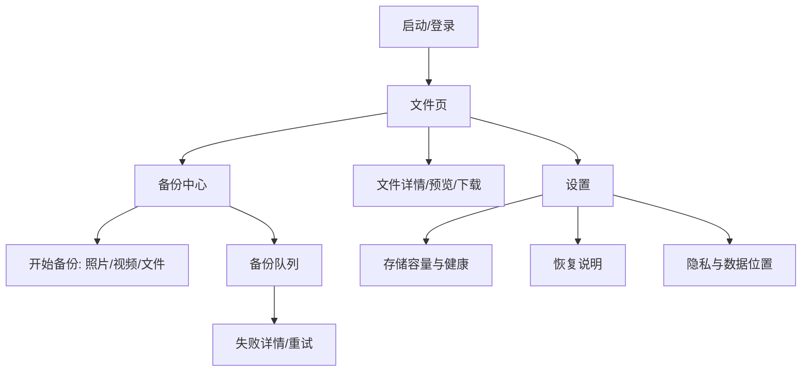

# Private Backup D2 体验蓝图

日期：2026-05-22
目标：收口备份中心、队列、存储/健康和恢复说明的信息架构。

## 1. 体验原则

1. 先让用户知道“连接的是自己的后端”，再让用户开始备份。
2. 每个上传任务必须有可解释状态：等待、上传中、完成、失败、可重试、登录过期。
3. App 只展示用户能行动的信息，不展示内部配置键、服务器绝对路径、bucket、AccessKey、连接串、token/cookie 或 raw exception。
4. 恢复能力必须诚实：手机缓存不能单独恢复服务器；服务器恢复由管理员按 DR Runbook 执行。

## 2. 信息架构

## 3. 页面状态规范

| 页面 | 空状态 | 加载/弱网 | 错误 | 主要 CTA |
| --- | --- | --- | --- | --- |
| 登录/连接 | 未配置后端或未登录 | 正在检查后端 | 后端不可达、凭据错误、限流 | 重试、修改服务器地址、登录 |
| 备份中心 | 暂无备份任务 | 正在读取队列 | 队列读取失败 | 开始备份、查看失败项 |
| 文件选择 | 未选择文件 | 系统 FilePicker 处理中 | 权限不足或取消选择 | 重新选择 |
| 队列详情 | 无进行中任务 | 上传中/等待中 | 后端不可达、登录过期、容量不足、文件冲突 | 重试、重新登录、打开文件页 |
| 存储/健康 | 无健康摘要 | 正在读取 | 后端健康接口失败 | 重试、查看恢复说明 |
| 恢复说明 | 不适用 | 不适用 | 不适用 | 打开 DR Runbook |

## 4. 推荐文案

| 场景 | 用户文案 |
| --- | --- |
| 后端不可达 | 暂时连不上你的 PrivateCloudDrive 后端。请确认服务器正在运行，手机和服务器在可访问的网络中，然后重试。 |
| 登录过期 | 登录已过期。重新登录后，你可以继续处理未完成的备份任务。 |
| 上传失败可重试 | 上传中断，文件还没有完成备份。请检查网络或后端状态后重试。 |
| 容量不足 | 服务器可用空间不足，无法继续备份。请释放空间或扩容后再试。 |
| 恢复边界 | 手机端只保存当前会话和缓存，不能单独恢复服务器文件。请按部署文档备份并恢复数据库、storage 和匹配的环境配置。 |
| 隐私边界 | PrivateCloudDrive 默认不是端到端加密产品。部署管理员、数据库/存储/备份介质访问者可能接触原始文件，请保护好服务器和备份介质。 |

## 5. Android 截图验收清单

| 编号 | 画面 | 通过标准 |
| --- | --- | --- |
| UX-A01 | clean install 启动页 | 不崩溃，登录/连接状态清晰 |
| UX-A02 | 后端不可达 | 有可重试错误，不暴露私有 URL 全量细节 |
| UX-A03 | 登录成功后文件页 | 文件页可见，状态栏/导航不遮挡 |
| UX-A04 | 备份中心空状态 | 有“开始备份”入口 |
| UX-A05 | 选择照片/视频/文件 | 系统选择器返回后进入队列 |
| UX-A06 | 队列等待/上传中 | 状态与进度可读 |
| UX-A07 | 上传完成 | 可打开文件页或详情 |
| UX-A08 | 失败可重试 | 失败原因可读，重试 CTA 明确 |
| UX-A09 | 重试成功 | 同一任务或新任务完成，不保留误导失败结论 |
| UX-A10 | 登录过期 | 引导重新登录，不打印 token |
| UX-A11 | 容量/健康页 | 展示摘要，不展示密钥/路径/bucket |
| UX-A12 | 恢复说明 | 明确管理员按 DR Runbook 恢复 |
| UX-A13 | 隐私边界 | 不承诺 E2EE/零知识 |
| UX-A14 | 文件页命中 | 备份完成文件可见 |
| UX-A15 | 预览/下载 | 成功或失败都有可读状态 |
| UX-A16 | 删除/回收站/恢复 | 永久删除前有确认 |
| UX-A17 | 设置/退出登录 | 退出后 token 清理，回到登录页 |
| UX-A18 | logcat/报告 | 不含 secret、token、cookie、private URL、真实用户内容 |

## 6. 下游验收标准

- 移动端实现不必一次性完成所有高级备份能力，但不能留下空白、误导或泄密状态。
- QA 最终报告必须用 PASS/WARN/FAIL 标注每个截图项；历史“尚未完成”说明必须清理或改为已知限制。
- Release Manager 只在 UX-A01~UX-A18 中 P0 项全部 PASS 或有明确非阻断 WARN 时，才可升级用户最终验收。
