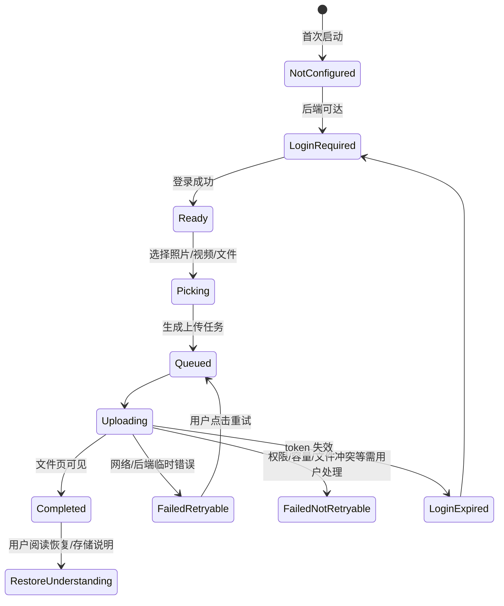

# Private Backup 可信闭环场景矩阵

日期：2026-05-22
角色：业务分析 / 发布验收口径

## 1. 管理结论

Private Backup MVP 的核心不是“上传按钮”，而是用户能够信任手机端已经把重要文件备份到自己控制的后端，并能理解失败、重试、容量、恢复和隐私边界。下表作为 UX、移动端、后端、存储、隐私和 QA 的共同验收矩阵。

## 2. 状态机

## 3. 场景矩阵

| 编号 | 场景 | 用户问题 | 系统行为 | 验收重点 |
| --- | --- | --- | --- | --- |
| CON-01 | 首次启动 | 我该连到哪台服务器？ | 展示当前 API 地址/连接状态/重试入口 | 不显示内部配置键或 raw exception |
| CON-02 | 后端不可达 | 是我操作错了吗？ | 解释网络或后端不可达，可重试 | 不泄漏私有内网 URL 全量细节 |
| CON-03 | 登录成功 | 我的账号生效了吗？ | 进入文件页或备份中心 | 后端审计不含密码/token |
| CON-04 | 登录失败 | 密码错还是服务坏了？ | 展示可读错误，保留重试 | 不记录密码；限流错误可读 |
| CON-05 | 登录过期 | 为什么上传停了？ | 队列标记登录过期，引导重新登录 | 不自动丢弃已排队任务 |
| PICK-01 | 选择照片 | 我能备份照片吗？ | FilePicker 返回图片并入队 | 支持单张/多张，失败可读 |
| PICK-02 | 选择视频 | 大文件会怎样？ | 生成上传任务并显示进度 | 大小限制/网络失败有说明 |
| PICK-03 | 选择普通文件 | 文档也能备份吗？ | 进入文件上传链路 | 文件名冲突有明确提示 |
| UP-01 | 等待上传 | 它开始了吗？ | 队列显示等待/待上传 | 不显示空白卡片 |
| UP-02 | 上传中 | 传到哪一步了？ | 显示进度、已上传分片/字节或简化进度 | 进度为后端契约或客户端可信估算 |
| UP-03 | 上传完成 | 文件在哪里？ | 队列完成并提示打开文件页 | 文件页能命中该文件 |
| UP-04 | 重复文件 | 会覆盖吗？ | 不静默覆盖；展示冲突处理 | 与后端重名策略一致 |
| ERR-01 | 后端中断 | 网络断了怎么办？ | 失败可重试，重试后继续或重建会话 | 截图覆盖失败和恢复成功 |
| ERR-02 | 登录过期 | 是否要重新登录？ | 引导登录，登录后可重试 | token/cookie 不进入日志 |
| ERR-03 | 容量不足 | 为什么不能传？ | 说明容量/配额不足 | 链接到存储/健康入口 |
| ERR-04 | 权限不足 | 我是否能访问目标目录？ | 说明无权限或文件不可见 | 不暴露其他用户资源 |
| TRUST-01 | 存储位置 | 文件到底在哪？ | App 和文档说明默认 FileSystem storage volume | 不展示服务器绝对路径给普通用户 |
| TRUST-02 | 健康状态 | 后端是否健康？ | 展示数据库/存储/媒体处理摘要 | 不展示 bucket、AccessKey、连接串 |
| TRUST-03 | 恢复说明 | 手机缓存能恢复服务器吗？ | 明确不能；需按 DR Runbook 恢复数据库和 storage | 避免夸大承诺 |
| TRUST-04 | 隐私边界 | 管理员能看到文件吗？ | 明确自托管管理员/存储访问者可能接触原始文件 | 不承诺 E2EE/零知识 |
| TRUST-05 | 分享边界 | 分享会扩大访问吗？ | 说明分享链接与密码边界 | 禁止完整分享 URL 进入公开证据 |
| TRUST-06 | 删除与恢复 | 删除后还能找回吗？ | 回收站恢复与永久删除区分 | 永久删除需强确认 |

## 4. QA 用例入口

| 用例 | 目标 |
| --- | --- |
| PB-TL-001 | clean install 后启动、连接后端、登录成功 |
| PB-TL-002 | 后端不可达时备份入口/登录页显示可重试错误 |
| PB-TL-003 | 选择图片、视频、普通文件并进入队列 |
| PB-TL-004 | 上传完成后文件页命中并可预览/下载 |
| PB-TL-005 | 上传中断后显示失败并可重试成功 |
| PB-TL-006 | 登录过期后队列状态可解释，重新登录后恢复 |
| PB-TL-007 | 容量/健康页不泄漏内部密钥或路径 |
| PB-TL-008 | 恢复说明明确数据库 + storage + `.env` 责任边界 |
| PB-TL-009 | 删除/回收站/恢复链路可见 |
| PB-TL-010 | logcat、validation 报告和截图不含 secret/token/cookie/private URL |

## 5. 下游交接

- UX：把场景矩阵落到页面状态、空/错/弱网/登录过期文案。
- 移动端：实现队列状态、失败重试、登录过期恢复和安全摘要展示。
- 后端：保证上传会话、系统健康、容量、公开分享和权限错误契约稳定。
- 存储：明确 FileSystem/Aliyun OSS/MinIO 边界。
- 隐私：统一 README、deployment、DR 和 App 文案。
- QA：按 PB-TL-001~010 形成最终可见验收包。
