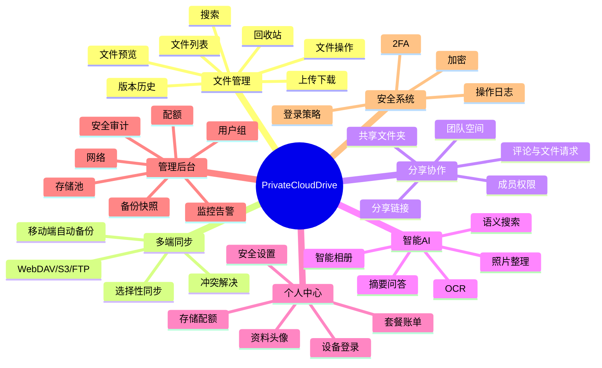

# PrivateCloudDrive 功能地图与版本边界

日期：2026-05-17
负责人：Hermes 产品总监
文档定位：把“私有云盘 · 功能地图”整理成可落地的产品信息架构、优先级、版本路线与验收边界。本文不是一次性全量开发清单，而是长期产品地图。

---

## 1. 产品总监结论

用户提供的功能地图方向完整，覆盖了一个成熟私有云盘/NAS 协同产品的主要能力。但按 PrivateCloudDrive 当前阶段，必须拆成四层：

| 层级 | 含义 | 处理策略 |
|---|---|---|
| Core 已有/必须稳定 | 文件管理、上传下载、预览、回收站、分享、个人中心、基础管理 | V1.2 RC 收口，不继续扩范围 |
| V1.3 产品化增强 | 运维设置、存储健康、备份恢复、管理员基础能力、设备/登录安全 | 下一阶段主线 |
| V2 成长能力 | 团队空间、文件夹权限、移动端自动备份、内容搜索、WebDAV/S3 接入 | 在稳定发布后逐步进入 |
| V3/探索 | AI 相册、语义搜索、Office 协作、桌面同步、NAS OS 能力、Docker/应用市场 | 暂不进入近期开发，防止范围爆炸 |

一句话原则：

> PrivateCloudDrive 可以长成完整私有云盘，但当前不能同时做“网盘 + NAS OS + AI 相册 + Office 协作 + 同步盘”。近期目标仍是先把移动优先私有云盘做稳、做可信、做可交付。

---

## 2. 一级功能地图

---

## 3. 功能分级与版本建议

### 3.1 文件管理（核心）

| 功能 | 用户价值 | 当前建议 | 版本 |
|---|---|---|---|
| 文件列表（网格/列表）、文件夹层级、面包屑 | 找文件、理解当前位置 | 已是核心，继续打磨状态与移动端体验 | V1.2 RC |
| 上传（拖拽、断点续传、文件夹上传） | 把数据放进私有云 | 先稳定普通上传/移动端上传；断点续传、文件夹上传后置 | V1.2/V2 |
| 下载（批量、打包） | 批量取回资料 | 单文件下载先稳定；批量打包进入 V2 | V1.2/V2 |
| 重命名/移动/复制/删除/收藏/标签 | 日常整理 | 重命名、删除、收藏、标签优先；复制/复杂移动后置 | V1.2/V1.3 |
| 文件预览（图片、视频、音频、PDF、Office、代码、Markdown） | 降低下载成本 | 图片/视频/音频/PDF/Markdown 优先；Office 只做预览不做协作 | V1.2/V2 |
| 在线编辑（Office/Markdown） | 内容生产 | Markdown 可探索；Office 协作暂不做 | V2/V3 |
| 搜索（文件名、内容、标签、时间、类型） | 快速定位 | 文件名/标签/时间/类型优先；全文内容搜索后置 | V1.2/V2 |
| 回收站 | 防误删 | 必须稳定 | V1.2 RC |
| 版本历史 | 防覆盖、可追溯 | 建议先记录文件变更日志，真正版本历史后置 | V2 |

### 3.2 多端同步

| 功能 | 用户价值 | 当前建议 | 版本 |
|---|---|---|---|
| 选择性同步 | 节省本地空间 | 需要桌面客户端，后置 | V3 |
| 忽略规则 | 避免同步垃圾文件 | 跟桌面同步一起做 | V3 |
| 同步状态 | 让用户知道是否完成 | 移动端上传/备份可先做任务状态 | V2 |
| 冲突解决 | 避免覆盖数据 | 数据一致性复杂，必须在同步前设计 | V3 |
| 移动端自动备份（相册） | 个人云盘高频场景 | 建议作为 V2 主线之一 | V2 |
| 移动端自动备份（通讯录） | 私人数据备份 | 涉及隐私与权限，后置 | V3 |
| WebDAV/S3/FTP 接入 | 生态连接 | S3/OSS 作为存储后端优先；WebDAV 作为外部访问协议后置；FTP 不推荐优先 | V1.3/V2/V3 |

### 3.3 分享与协作

| 功能 | 用户价值 | 当前建议 | 版本 |
|---|---|---|---|
| 分享链接（密码、有效期、提取码、下载限制） | 对外分享文件 | 当前核心能力，继续补风险提示和管理入口 | V1.2 RC/V1.3 |
| 团队空间 | 家庭/小团队分区 | 进入 V2，但必须先有权限模型 | V2 |
| 共享文件夹 | 长期协作 | 跟团队空间一起做 | V2 |
| 成员权限（只读/读写/管理） | 安全协作 | 权限模型先于团队空间实现 | V2 |
| 协作评论、@提及 | 团队沟通 | 不符合近期主线，后置 | V3 |
| 文件请求收件箱 | 让别人上传给我 | 可作为分享能力增强，适合 V2 | V2 |

### 3.4 智能（AI）

| 功能 | 用户价值 | 当前建议 | 版本 |
|---|---|---|---|
| 照片自动整理（人脸、地点、场景） | 自动归类照片 | 依赖媒体库稳定与隐私策略，后置 | V3 |
| 智能相册、记忆回顾 | 情感价值 | 可作为媒体库成熟后的亮点 | V3 |
| 文件 OCR | 扫描件可搜索 | 比语义搜索更实用，可先做本地/异步 OCR | V2 |
| 语义搜索 | 找“内容含义” | 成本与隐私较高，后置 | V3 |
| AI 摘要/问答 | 文档理解 | 需要索引、权限过滤、模型配置，后置 | V3 |

### 3.5 个人中心

| 功能 | 用户价值 | 当前建议 | 版本 |
|---|---|---|---|
| 个人资料、头像 | 账号识别 | 基础能力即可 | V1.3 |
| 安全设置 | 修改密码、2FA、登录策略 | V1.3 主线 | V1.3 |
| 存储配额、流量统计 | 知道空间是否够用 | 容量优先，流量统计后置 | V1.3/V2 |
| 设备管理、登录历史 | 发现异常登录 | V1.3/V2 | V1.3/V2 |
| 套餐订阅、扩容、账单 | 商业化 | 私有部署产品暂不作为近期主线 | V3/商业化 |

### 3.6 管理后台（NAS/团队管理员）

| 功能 | 用户价值 | 当前建议 | 版本 |
|---|---|---|---|
| 用户/组管理、配额分配 | 多人使用 | 管理员基础用户和配额进入 V1.3/V2 | V1.3/V2 |
| 存储池、磁盘阵列、卷管理 | NAS OS 能力 | 不做近期主线，避免变成操作系统 | Not Now/V3 |
| 备份策略、快照、远程灾备 | 数据安全 | 备份恢复文档/脚本优先，快照后置 | V1.3/V2 |
| 监控（CPU/内存/带宽/IO）、告警 | 便于维护 | 服务健康/存储健康优先，完整监控后置 | V1.3/V2 |
| 应用市场、Docker、套件 | NAS 生态 | 暂不做 | Not Now |
| 网络（DDNS、内网穿透、端口） | 外网访问 | 文档指导优先，内置网络管理后置 | V1.3/V3 |
| 安全（防火墙、双因子、审计日志） | 防入侵、可追溯 | 2FA/审计优先；防火墙不内置 | V1.3/V2 |

### 3.7 安全 & 系统

| 功能 | 用户价值 | 当前建议 | 版本 |
|---|---|---|---|
| 双因子 2FA | 降低账号风险 | V1.3 高优先级 | V1.3 |
| 登录策略 | 异常登录保护 | V1.3/V2 | V1.3/V2 |
| 端到端加密 | 极高隐私 | 会影响预览、搜索、分享，后置专题设计 | V3 |
| 卷加密 | 部署层能力 | 通过部署文档指导，不做应用层卷管理 | V1.3 文档 |
| 操作日志、审计 | 可追溯 | 当前已有基础，继续完善筛选与导出 | V1.2/V1.3 |

---

## 4. 推荐版本路线

### V1.2 RC：收口当前已实现的核心云盘体验

目标：让 PrivateCloudDrive 成为可真实试用的移动优先私有云盘。

P0：
- 文件列表、上传、下载、预览、删除、回收站主链路稳定。
- 搜索、排序、筛选、批量操作无明显阻塞。
- 分享链接可创建、访问、管理、撤销。
- 媒体库/相册基础体验可用。
- Android 真机主链路完成验收。
- Docker、本地部署、测试、发布说明完成。

明确不做：
- 不做桌面同步。
- 不做 NAS OS 管理。
- 不做 Office 协作。
- 不做 AI。
- 不做复杂团队协作。

### V1.3：私有部署运维与安全产品化

目标：让用户知道系统是否健康、空间是否够用、数据如何备份、出问题如何恢复。

P0：
- 设置页信息架构定版。
- 服务健康页。
- 存储状态页。
- 备份与恢复清单/脚本。
- 管理员基础用户管理。
- 配额展示与容量预警。
- 登录历史与安全设置。
- 审计日志入口增强。

P1：
- 分享风险提醒。
- OSS/MinIO 存储配置说明与健康检查。
- 媒体处理任务管理增强。
- 首次部署向导文档。

### V2：家庭/小团队与移动备份

目标：从个人云盘升级为家庭/小团队可长期使用的私有数据中心。

P0 候选：
- 家庭空间/团队空间。
- 共享文件夹。
- 文件夹级权限。
- 成员角色：只读、读写、管理。
- 移动端相册自动备份。
- 文件请求收件箱。
- OCR 与内容索引第一版。
- WebDAV 第一版。

### V3：智能化、同步盘与 NAS 生态探索

目标：在核心可信后，探索差异化能力。

候选：
- 桌面同步客户端。
- 冲突解决系统。
- AI 相册、语义搜索、摘要问答。
- 端到端加密专题。
- 智能相册/记忆回顾。
- NAS 应用市场/套件生态。
- Office 在线协作。

---

## 5. 信息架构建议

### 5.1 移动端底部导航

| Tab | 目标 | 页面 |
|---|---|---|
| 文件 | 管理所有文件 | 最近、全部文件、文件夹、收藏、标签、回收站入口 |
| 相册 | 浏览图片视频 | 时间线、相册、处理状态 |
| 分享 | 管理对外分享 | 我创建的分享、收到的请求、风险提醒 |
| 设置 | 管理账号与系统 | 账号、安全、容量、服务器、备份、日志 |

### 5.2 Web 管理端导航

| 模块 | 目标 | 页面 |
|---|---|---|
| 仪表盘 | 看系统是否健康 | 服务健康、存储容量、最近告警 |
| 文件 | 文件管理 | 文件列表、上传、搜索、回收站 |
| 分享 | 分享治理 | 分享链接、访问记录、过期策略 |
| 媒体 | 媒体任务 | 处理队列、失败重试、相册 |
| 用户 | 管理成员 | 用户、角色、配额 |
| 存储 | 管理存储配置 | 本地存储、OSS/MinIO、备份状态 |
| 安全 | 管理风险 | 2FA、登录历史、审计日志 |
| 系统 | 部署维护 | 环境信息、版本、诊断、导出日志 |

---

## 6. 关键业务对象

| 对象 | 说明 | 近期是否需要 |
|---|---|---|
| FileObject | 文件/文件夹元数据 | 是 |
| BlobObject | 实际存储对象 | 是 |
| Folder | 文件夹层级 | 是 |
| Tag | 标签 | 是 |
| Favorite | 收藏 | 是 |
| ShareLink | 分享链接 | 是 |
| TrashItem | 回收站项目 | 是 |
| AuditLog | 操作日志 | 是 |
| StorageQuota | 存储配额 | V1.3 |
| DeviceSession | 设备/登录会话 | V1.3 |
| BackupJob | 备份任务 | V1.3/V2 |
| TeamSpace | 团队/家庭空间 | V2 |
| PermissionRule | 文件夹权限 | V2 |
| SyncClient | 同步客户端 | V3 |
| AiIndex | AI/OCR/语义索引 | V2/V3 |

---

## 7. 发布闸门

任何功能进入版本前必须满足：

| 闸门 | 标准 |
|---|---|
| 用户价值明确 | 能说清楚解决谁的哪个问题 |
| 数据安全明确 | 不误删、不越权、不泄露分享、不破坏存储一致性 |
| 移动端体验明确 | App 端有清晰入口、状态、错误提示 |
| 后端边界明确 | API、权限、审计、迁移、后台任务明确 |
| 部署影响明确 | 环境变量、存储、反向代理、备份边界明确 |
| 验收可执行 | 有命令、有真机步骤、有失败判定 |

---

## 8. 当前立即执行建议

基于现有项目状态，下一步不建议直接展开全部功能地图，而是按下面顺序继续：

1. 完成 V1.2 RC 收口：构建、测试、Docker、Android 真机验收、发布说明。
2. 用本文档校准 `docs/product-planning-hub.md` 和 `docs/product-roadmap-next.md`，避免路线图继续漂移。
3. 启动 V1.3 PRD：设置页、服务健康、存储健康、备份恢复、安全中心。
4. 将 V2 候选池固定为：团队空间、文件夹权限、移动相册自动备份、OCR、WebDAV。
5. 将 NAS OS、Office 协作、AI 语义问答、桌面同步明确放入 V3/探索，不进入近期开发。

---

## 9. 对用户原始功能地图的产品判断

原始地图可以作为长期北极星，但不能作为当前版本的开发范围。正确用法：

- 它是“产品全景”，不是“一期需求”。
- 它能指导信息架构，但不能绕过发布闸门。
- 它能帮助我们避免遗漏长期方向，但近期必须坚持移动优先、文件可信、部署可信。
- 如果要向用户展示愿景，可展示全图；如果要安排开发，只取 V1.2/V1.3 的 P0/P1。

最终建议：

> 继续推进时，Hermes 团队应把 PrivateCloudDrive 定义为“个人/家庭/小团队私有云盘”，而不是一开始就定义为“完整 NAS 系统”。当前所有设计都应服务于稳定、可信、可部署、可验收。
