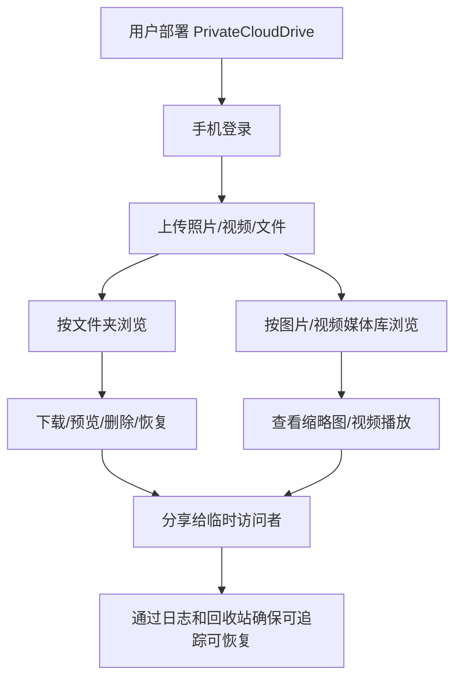
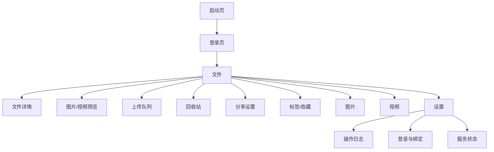

# PrivateCloudDrive 下一阶段产品形态与路线图

日期：2026-07-11（末次同步：V1.3 / V1.3b 已发布）

## 1. 产品总监结论

PrivateCloudDrive 当前已经不再是“从 0 到 1 的 MVP 工程验证”，而是进入“从可用到可长期使用”的产品化阶段。

建议下一阶段不要继续堆功能，而是重新收敛产品形态：

> PrivateCloudDrive = 面向个人、家庭和小团队的私有部署移动优先云盘 + 媒体库。
>
> 核心竞争力不是替代 NAS，也不是做企业网盘，而是让用户能在自己的服务器/NAS/迷你主机上，稳定、安全、低心智地管理文件、照片和视频。

下一步优先级建议：

1. 先做 V1.0 Release Candidate：稳定性、真实设备验收、部署体验、数据安全边界。
2. 再做 V1.1 产品体验增强：搜索、批量操作、排序视图、容量可视化、分享体验完善。
3. 再做 V1.2 媒体库增强：时间线、相册、视频体验、后台任务状态。
4. 最后再考虑 V2.0 多用户家庭空间/团队空间/AI 搜索等更大产品形态。

## 2. 当前产品现状

### 2.1 已具备的产品能力

| 模块 | 当前状态 | 产品价值 |
|---|---|---|
| 账号密码登录 | 已实现 | 用户可安全进入私有云盘 |
| OpenIddict Token / Refresh Token | 已实现 | 移动端可保持登录状态 |
| 登录失败限流 | 已实现 | 降低暴力破解风险 |
| 文件夹/文件列表 | 已实现 | 已具备云盘主链路 |
| 小文件上传 | 已实现 | 支持普通文档/图片上传 |
| 分片上传 | 已实现 | 支持大视频上传基础能力 |
| 文件下载 | 已实现 | 文件可取回 |
| HTTP Range | 已实现 | 视频拖动播放基础能力 |
| 图片缩略图 | 已实现 | 图片浏览体验基础 |
| 视频封面/元数据 | 已实现 | 视频库体验基础 |
| 回收站 | 已实现 | 降低误删风险 |
| 分享链接 | 已实现 | 文件临时对外分享 |
| 标签/收藏 | 已实现 | 文件组织能力起步 |
| 操作日志 | 已实现 | 审计和排查能力起步 |
| MAUI Android/Windows 构建 | 已通过 | 移动端和桌面端可验证 |
| Docker Compose 部署 | 已实现 | 私有部署基础可用 |
| 微信登录 | 后端和 Android 桥接基本完成，真机/正式凭据未完成 | 中国用户便捷登录能力，但不应阻塞主产品 |
| Google/GitHub 外部登录 | 已有设计与代码迹象 | 面向开发者/国际化用户的可选登录能力 |

### 2.2 当前主要风险

| 风险 | 等级 | 说明 | 建议 |
|---|---|---|---|
| 阶段 8 微信登录仍未真机闭环 | 高 | Android 正式 AppId/AppSecret、签名、iOS SDK 尚未完成 | 作为 V1.0 可选项，不阻塞主线发布 |
| 当前产品功能多，但体验闭环仍偏工程化 | 高 | 文件、图片、视频、分享、标签都有，但缺少搜索/批量/容量/状态反馈 | V1.1 聚焦体验闭环 |
| 部署对普通用户仍有门槛 | 高 | Docker、环境变量、URL、OAuth、存储目录对非开发者复杂 | V1.0 必须做部署向导和健康检查 |
| 数据安全能力需要加强 | 高 | 私有云盘核心是数据，备份/恢复/迁移/存储检查非常关键 | V1.0 增加备份恢复文档和健康检查，V1.1 做产品化入口 |
| MAUI 真机验收覆盖不足 | 中 | Android 模拟器已验收，真实 Android/iOS 仍需补充 | V1.0 RC 必须补齐 |
| 管理端能力不足 | 中 | 用户、容量、系统状态、任务状态尚不完整 | V1.1/V1.2 后台管理规划 |

## 3. 重新定义产品形态

### 3.1 不建议的方向

当前不建议把 PrivateCloudDrive 做成：

- 完整 NAS OS：不要做 RAID、磁盘池、SMB/NFS、Docker App Store。
- 企业网盘：不要优先做复杂组织架构、审批流、部门权限。
- 在线协作文档：不要做 Office 协同编辑。
- 下载器平台：不要优先做 BT/磁力/Aria2。
- AI 相册平台：人脸识别、语义搜索可以进入 V2，但不应先做。

### 3.2 建议的核心形态

建议聚焦为：

```text
私有部署移动优先云盘
+ 家庭照片/视频媒体库
+ 安全分享
+ 简单可运维部署
```

一句话定位：

> 把自己的服务器变成一个可被手机稳定访问的私有文件与媒体中心。

### 3.3 用户路径重心



## 4. 新版本路线图

### 4.1 V1.0 Release Candidate：产品可发布收口

**状态：✅ 已完成（2026-06 ~ 2026-07 发布收口）**

目标：让当前产品能作为"私有部署内测/小范围发布版本"交付。

| 优先级 | 功能/任务 | 说明 | 验收标准 |
|---|---|---|---|
| P0 | 清理工作区和版本状态 | 当前只剩 `appsettings.json` 修改需确认 | `git status --short` 只包含预期变更或为空 |
| P0 | 全量后端测试 | 确认注释和外部登录变更后没有回归 | `dotnet test aspnet-core/PrivateCloudDrive.slnx` 通过 |
| P0 | Docker 一键启动复验 | 确认新代码能从干净环境启动 | `docker compose up -d --build` 后 Swagger 200 |
| P0 | Android 真机主链路验收 | 登录、浏览、上传、下载、预览、删除、恢复 | 真实 Android 完成测试记录 |
| P0 | Windows/Android MAUI 构建脚本化 | 降低重复验证成本 | 提供 `scripts/verify-maui-build.*` |
| P0 | 部署健康检查 | 检查 API、DB、Redis、Storage、FFmpeg、OpenIddict Issuer | 一条命令输出健康状态和修复建议 |
| P0 | 存储目录安全提示 | 明确 storage volume、备份、迁移风险 | 部署文档和 README 明确不可丢失数据目录 |
| P1 | 微信登录降级策略 | 未配置/不可用时隐藏或禁用，不影响账号密码 | 未配置微信时账号密码完整可用 |
| P1 | 外部登录统一状态页 | Settings 展示 WeChat/Google/GitHub 启用和绑定状态 | 用户能理解哪些登录方式可用 |
| P1 | 发布说明 | 说明功能边界、部署方式、已知限制 | 生成 `docs/release-notes-v1.0-rc.md` |

V1.0 RC 不建议新增大功能。重点是发布质量。

### 4.2 V1.1：文件管理体验增强

**状态：🚀 已发布（2026-07-07，见 `docs/release-notes-v1.1.md`）**

目标：让用户日常管理大量文件时更顺手。

| 优先级 | 功能 | 说明 | 验收标准 |
|---|---|---|---|
| P0 | 搜索 | 按文件名搜索，先做当前用户范围 | 输入关键词后返回文件/文件夹，支持分页 |
| P0 | 排序与筛选 UI | 名称、时间、大小、类型、收藏、标签 | MAUI 文件页可切换排序/筛选 |
| P0 | 批量选择 | 批量删除、恢复、永久删除、下载准备 | 10+ 文件可批量操作，有二次确认 |
| P0 | 重命名/移动 UI 完善 | 后端已有相关能力迹象，移动端体验要闭环 | 文件详情或更多菜单可完成重命名/移动 |
| P1 | 容量使用展示 | 用户已用/剩余容量、单文件限制 | Settings 和上传失败提示展示容量原因 |
| P1 | 上传队列重试/取消 | 上传失败后可重试，上传中可取消 | 上传页可操作单个任务 |
| P1 | 分享管理体验 | 我的分享、复制链接、取消分享、密码状态 | Settings 或文件详情能管理分享 |
| P2 | 文件夹打包下载 | 后续能力，不作为 V1.1 必须项 | 服务端流式压缩或异步任务设计完成 |

### 4.3 V1.2：媒体库产品化

**状态：🔍 验收中（当前 Sprint 为 V1.2 RC 收口，见 `docs/product-planning-hub.md` §6）**

目标：把"图片/视频入口"从文件筛选升级成真正媒体库体验。

| 优先级 | 功能 | 说明 | 验收标准 |
|---|---|---|---|
| P0 | 图片时间线 | 按拍摄时间/上传时间分组 | 图片页按月份/日期分组浏览 |
| P0 | 视频列表增强 | 显示时长、分辨率、封面、大小 | 视频页信息完整且可播放 |
| P0 | 媒体处理状态 | Pending/Processing/Failed 可见 | 处理失败时用户可看到原因和重试入口 |
| P1 | 相册/集合 | 用户手动创建相册，添加图片视频 | 一个媒体可加入多个相册 |
| P1 | 后台任务管理 | 管理员查看媒体任务、失败重试 | Settings 或管理页可查看任务状态 |
| P2 | HLS/低清预览 | 大视频移动网络播放优化 | 可选转码，不影响原文件 |

### 4.4 V1.3/V1.3b：管理与运维（已发布）

**状态：✅ 已发布（2026-07-11，含 V1.3b 移动端验收收口维护版）**

目标：让非开发者能长期维护私有部署实例。

| 优先级 | 功能 | 说明 | 验收标准 |
|---|---|---|---|
| P0 | 管理员用户管理 | 创建/禁用用户、重置密码、容量配额 | Admin 可管理普通用户 |
| P0 | 系统健康页 | DB、Redis、Storage、FFmpeg、版本、磁盘空间 | 管理员能看到健康状态 |
| P0 | 备份/恢复指南产品化 | 数据库 + storage + .env | 文档和脚本可完成备份恢复演练 |
| P1 | 操作日志增强 | 按用户、动作、文件、时间筛选 | 审计查询可定位问题 |
| P1 | 存储配置页 | 展示当前存储路径、容量、可用空间 | 不直接改危险配置，先只读展示 |

V1.3b 维护版修复了 V1.3 QA 验收发现的 4 项 P0 阻断缺陷，完成 MAUI 前端 6 页模拟器验收闭环，并补齐 known-limitations.md 同步。

详见 [release-notes-v1.3.md](release-notes-v1.3.md) 和 [release-notes-v1.3b.md](release-notes-v1.3b.md)。

### 4.5 V1.4：产品化体验增强与已知限制收口

**状态：📋 规划中（下一冲刺阶段）**

目标：补齐文件管理日常体验缺口（搜索、批量、排序、容量），修复已知限制中影响用户感知的项，完成全链路真机验收闭环，为 V2.0 建立稳定的产品基线。

| 优先级 | 功能/任务 | 说明 | 验收标准 |
|--------|-----------|------|---------|
| P0 | 搜索体验闭环 | 搜索 API 已有，补齐前端的搜索入口、搜索结果页、空状态、清除搜索 | 各文件页顶部搜索框可用，搜索结果分页正确且无跨用户泄露 |
| P0 | 批量操作 MAUI 体验 | 多选模式、全选、批量删除/恢复/永久删除，危险操作二次确认 | 10+ 文件可批量选择并操作，有进度反馈和二次确认弹窗 |
| P0 | 容量可视化 | Settings 已占空间/配额/可用空间，上传超限提示 | 用户能清晰看到已用容量和配额，超限时不可上传且有提示 |
| P0 | 排序与筛选 UI | 名称、时间、大小、类型；按文件类型/收藏/标签筛选 | 文件页可通过底部弹窗切换排序和筛选条件 |
| P0 | 已知限制 P0 修复 | 从 known-limitations.md 15 条中筛选影响日常用户的 P0 项 | 每条修复有独立 AC 和回归验证 |
| P0 | 真机验收补完 | Android 真机主链路（登录→浏览→上传→下载→预览→删除→恢复→分享） | 真实设备完成全链路记录，G3 从 WARN 升级为 PASS |
| P1 | 分享管理增强 | 我的分享列表、复制链接、取消分享、密码状态、访问统计 | Settings 中分享管理入口可用，可查看和管理自己的分享 |
| P1 | 上传队列重试/取消 | 上传失败可重试，上传中可取消，错误信息可理解 | 上传页可操作单个上传任务，失败时有重试入口 |
| P1 | 媒体库交互完善 | 图片时间线交互增强、视频列表信息完整、媒体处理失败重试入口 | 媒体库页面交互流畅，处理失败可见并支持重试 |
| P1 | 设置页 IA 最终调优 | 管理员/普通用户入口差异化、操作路径一致性检查 | 多角色测试无链路断裂 |

**明确不做：**
- ⛔ 不做多用户/家庭空间（V2.0 候选）
- ⛔ 不做 AI 搜索/智能相册
- ⛔ 不做桌面同步客户端
- ⛔ 不做 iOS 支持
- ⛔ 不做架构层重构（数据库、存储抽象、认证流）

### 4.6 V2.0：家庭空间 / 团队空间 / 智能能力

**状态：🔮 候选（不早于 V1.4 稳定）**

目标：从个人私有网盘升级为家庭或小团队中心。

候选能力：

- 家庭共享空间。
- 团队共享文件夹。
- 文件夹级权限。
- 多用户容量策略。
- 桌面端同步客户端。
- Web 管理端/Blazor 管理后台。
- AI 图片/文件语义搜索。
- 人脸聚类/智能相册。
- S3/MinIO 多存储后端切换。

V2.0 必须等 V1.x 稳定后再进入，否则会拖垮当前产品主线。

## 5. 下一步建议：先做 V1.0 RC，而不是继续扩功能

### 5.1 为什么先做 RC

当前项目已经拥有：

- 文件管理主链路。
- 媒体预览主链路。
- 分享、标签、收藏、日志等 V1 能力。
- 多种登录能力雏形。
- Docker 部署能力。

继续做新功能会带来更大复杂度，但不能显著提升“能不能长期使用”的信心。

真正阻碍发布的是：

- 真机验收不足。
- 部署体验不够产品化。
- 健康检查和备份恢复不足。
- 微信/外部登录可选能力边界需要收口。
- 管理员运维能力不足。

所以 V1.0 RC 应该是“质量和交付版本”。

### 5.2 V1.0 RC 推荐任务拆解

| 任务 | 类型 | 建议负责人 | 产出 |
|---|---|---|---|
| RC-01 清理当前 Git 状态 | 工程 | backend-eng | 确认 `appsettings.json` 是否应保留，提交或还原 |
| RC-02 全量验证脚本 | DevOps | devops-eng | `scripts/verify-local-stack.*`、`scripts/verify-maui-build.*` |
| RC-03 Docker 健康检查 API/脚本 | 后端/DevOps | backend-eng + devops-eng | 健康检查端点或脚本，输出 DB/Redis/Storage/FFmpeg 状态 |
| RC-04 Android 真机验收 | QA | qa-eng | `docs/testing.md` 回填真实设备结果 |
| RC-05 登录能力收口 | 安全/移动端 | security-reviewer + mobile-eng | 账号密码主链路稳定，外部登录不可用时不干扰 |
| RC-06 部署文档重写 | PM/DevOps | pm + devops-eng | 面向用户的一键部署、升级、备份恢复文档 |
| RC-07 Release Notes | PM | pm | `docs/release-notes-v1.0-rc.md` |

## 6. 产品信息架构建议

### 6.1 V1.0 RC App 信息架构



### 6.2 推荐底部导航

V1.0 RC 保留当前 5 个入口：

| Tab | 是否保留 | 理由 |
|---|---|---|
| 文件 | 保留 | 主入口 |
| 图片 | 保留 | 已实现媒体库入口，价值明显 |
| 视频 | 保留 | 私有媒体库核心场景 |
| 上传 | 保留 | 移动端上传必须可见 |
| 设置 | 保留 | 服务状态、回收站、日志、登录绑定入口 |

不建议把回收站放回底部导航。回收站是重要但低频能力，放 Settings 更符合工具型产品。

## 7. 后端能力规划

### 7.1 V1.0 RC 后端不新增业务大模型

优先补齐：

- 健康检查。
- 部署配置检查。
- 存储路径可用性检查。
- FFmpeg/FFprobe 可用性检查。
- OpenIddict issuer/redirect 配置检查。
- 日志脱敏检查。

### 7.2 V1.1 后端新增能力

| 能力 | 建议设计 |
|---|---|
| 搜索 | 先用 PostgreSQL `ILIKE` + 当前用户/租户过滤，后续再做全文索引 |
| 批量操作 | Application.Contracts 增加 `BatchFileNodeInput`，每次限制数量，如 100 |
| 容量展示 | 增加 `StorageUsageDto`，返回 used/quota/available/maxSingleFileSize |
| 上传任务状态 | 当前客户端队列为主，服务端补充 UploadSession 状态列表 |
| 分享管理增强 | 增加复制链接所需字段、访问次数、最近访问时间 |

## 8. MAUI 客户端规划

### 8.1 V1.0 RC

重点不是大改 UI，而是确保：

- 所有失败都有可理解错误。
- 上传/下载/登录失败不吞异常。
- Settings 展示当前 API 地址、登录状态、可用登录方式。
- 外部登录按钮只有在后端启用且平台可用时才显性展示或可操作。
- 真实 Android 设备可以连接局域网 API。

### 8.2 V1.1

重点体验：

- 文件页搜索框。
- 排序/筛选底部弹窗。
- 批量选择模式。
- 文件更多菜单：重命名、移动、分享、收藏、标签。
- 容量使用卡片。

## 9. 验收标准

### 9.1 V1.0 RC 验收标准

| 类别 | 验收项 |
|---|---|
| 构建 | 后端 solution build 通过，MAUI Windows/Android build 通过 |
| 测试 | 后端测试通过，关键 API 探针通过 |
| 部署 | Docker Compose 干净环境启动成功，Swagger 200 |
| 登录 | 账号密码登录、刷新、退出正常；错误密码限流生效 |
| 文件 | 列表、上传、下载、Range、删除、恢复、永久删除正常 |
| 媒体 | 图片缩略图、视频封面、视频播放基础可用 |
| 分享 | 创建分享、密码分享、下载限制可用 |
| 移动端 | Android 真机完成主链路验收 |
| 安全 | 日志不包含密码、token、OAuth code、client secret |
| 运维 | 部署文档、备份恢复说明、健康检查说明完整 |

### 9.2 V1.1 验收标准

| 类别 | 验收项 |
|---|---|
| 搜索 | 当前用户文件可按名称搜索，结果分页 |
| 批量 | 多选删除/恢复/永久删除可用，危险操作二次确认 |
| 排序 | 文件页支持名称、时间、大小、类型排序 |
| 容量 | Settings 可查看容量和剩余空间，上传超限提示清晰 |
| 分享 | 用户可管理自己的分享，管理员可管理全部分享 |
| 上传 | 上传失败可重试/取消，错误可读 |

## 10. 立即可执行的开发提示词

### 10.1 给 Codex/Cursor：V1.0 RC 健康检查与验证脚本

```text
你现在在 PrivateCloudDrive 仓库中工作。目标是完成 V1.0 RC 的本地部署健康检查和验证脚本，不要新增业务功能。

请先阅读：
- docs/product-roadmap-next.md
- docs/deployment.md
- docs/testing.md
- README.md

任务：
1. 新增或完善 scripts/verify-local-stack 脚本，检查 Docker CLI、docker compose、PostgreSQL、Redis、DbMigrator、API Host、Media Worker、Swagger、Storage volume、FFmpeg/FFprobe 可用性。
2. 新增 MAUI 构建验证脚本，分别顺序构建 Windows 和 Android 目标，避免多目标 restore 冲突。
3. 脚本输出必须清晰区分 PASS/WARN/FAIL，并给出修复建议。
4. 不要把密码、token、OAuth code、client secret 打印到日志。
5. 更新 docs/testing.md 和 docs/deployment.md，说明如何运行这些脚本。

验收：
- dotnet build aspnet-core/PrivateCloudDrive.slnx --no-restore 通过。
- dotnet test aspnet-core/PrivateCloudDrive.slnx --no-restore 通过或说明没有可发现测试的项目。
- MAUI Windows/Android 构建脚本可顺序执行。
- docker compose config 通过。
```

### 10.2 给 Codex/Cursor：V1.1 搜索和排序

```text
你现在在 PrivateCloudDrive 仓库中工作。目标是实现 V1.1 的文件搜索、排序和筛选基础能力。

请先阅读：
- docs/product-roadmap-next.md
- docs/requirements.md
- docs/product-ui-baseline.md

后端任务：
1. 扩展 GetFolderChildrenInput 或新增文件搜索 Input，支持 Keyword、NodeType、IsFavorite、TagId、Sorting。
2. Application 层查询必须按 CurrentUser/Tenant 隔离，不能返回其他用户文件。
3. PostgreSQL 先使用 ILIKE 实现名称搜索，避免引入复杂全文搜索。
4. 补充 EF 集成测试：按名称搜索、按类型筛选、按收藏筛选、按标签筛选、排序。

MAUI 任务：
1. 文件页增加搜索入口和排序/筛选入口。
2. 搜索结果仍复用文件列表项，不新增复杂页面。
3. 空结果、加载失败、清除搜索必须有明确状态。

验收：
- 后端测试通过。
- MAUI Windows/Android 构建通过。
- 搜索不会跨用户泄露文件。
```

## 11. 最终建议

下一步不要重新推翻产品，而是“调整产品形态并进入 RC 收口”。

推荐决策：

```text
PrivateCloudDrive V1.0 RC = 当前功能集 + 发布质量 + 真机验收 + 部署健康检查 + 备份恢复说明。
```

暂缓：

- AI 搜索。
- 桌面同步客户端。
- 团队空间。
- 复杂权限矩阵。
- NAS OS 化能力。

立即推进：

1. 清理当前工作区。
2. 建立 V1.0 RC 验证脚本。
3. 补齐 Android 真机主链路验收。
4. 把微信/Google/GitHub 登录定位为可选增强，不阻塞账号密码主链路。
5. 准备 V1.0 RC 发布说明。
