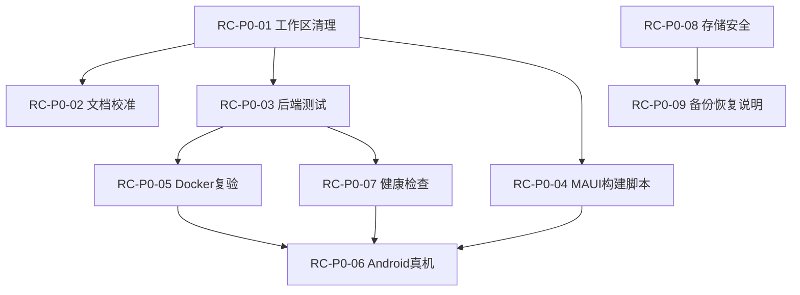

# PrivateCloudDrive V1.0 RC 发布范围定义与验收口径

日期：2026-06-17
负责人：Hermes 产品总监（PM）
文档定位：V1.0 RC 版本发布范围边界、P0/P1 验收标准、明确的 Out-of-Scope、推荐负责人与依赖顺序。

---

## 1. 版本认识处理

| 文档 | 版本命名 | 时间 |
|---|---|---|
| `product-roadmap-next.md` | V1.0 RC | 2026-05-09 |
| `product-planning-hub.md` | V1.2 RC / Productization Sprint | 2026-05-14 |
| `product-feature-map.md` | V1.2 RC | 2026-05-17 |
| 本次任务（tasks t_75bfc9bc） | **V1.0 RC** | 2026-06-17 |

### 版本命名差异说明

- `roadmap-next.md` 当时将当前阶段命名为 V1.0 RC，后续按 V1.1 → V1.2 → V1.3 → V2 演进。
- 但实际上 V1.1 范围（搜索、排序、筛选、批量操作）在 roadmap-next 撰写前已基本实现，`planning-hub.md` 修正后称为 V1.2 RC。
- **本次计划以 task 指定的 V1.0 RC 为准**，同义于 planning-hub 的 V1.2 RC。该阶段的交付目标是：**当前全量功能收口为可发布候选，不新增大功能。**

---

## 2. 版本目标

> PrivateCloudDrive V1.0 RC = 当前功能集 + 发布质量 + 真机验收 + 部署健康检查 + 数据安全边界。

### 用户价值

- 用户可以真实地在 Android 手机上登录、上传、浏览、下载、预览、删除、恢复自己的文件。
- 用户可以在一台干净的服务器上用 Docker Compose 一键启动并看到健康状态。
- 用户知道数据存在哪里、丢失风险是什么、如何备份。
- 用户不会被未完成的外部登录、调试日志、未分类设计稿干扰。

### 当前问题

- 真机验收不足：MAUI 模拟器已验，真实 Android 设备未完成主链路闭环。
- 部署体验不产品化：Docker 启动后缺少健康检查，用户不知道系统是否就绪。
- 数据安全不明确：存储目录、备份、恢复、OSS 边界未向用户说明。
- 工作区存在未提交设计稿和配置变更，发布前需清理。
- 微信/Google/GitHub 登录能力未完全闭环，可能干扰账号密码主链路。
- 文档系统存在命名不一致和状态不匹配。

---

## 3. 范围定义

### 3.1 P0（发布阻塞项 — 必须通过才能发布 RC）

| 编号 | 任务 | 类型 | 风险等级 | 依赖项 |
|---|---|---|---|---|
| RC-P0-01 | 工作区清理 | 工程/文档 | 中 | 无 |
| RC-P0-02 | 文档状态校准 | 文档 | 中 | RC-P0-01 |
| RC-P0-03 | 全量后端测试 | 测试 | 高 | RC-P0-01 |
| RC-P0-04 | MAUI Windows/Android 构建脚本化 | DevOps | 中 | RC-P0-01 |
| RC-P0-05 | Docker 一键启动复验 | DevOps | 高 | RC-P0-03 |
| RC-P0-06 | Android 真机主链路验收 | QA | 高 | RC-P0-04 |
| RC-P0-07 | 部署健康检查 | 后端/DevOps | 高 | RC-P0-03 |
| RC-P0-08 | 存储目录安全提示 | 文档 | 中 | 无 |
| RC-P0-09 | 备份恢复说明 | 文档 | 中 | 无 |

### 3.2 P1（发布应做项 — 可作为已知限制发布）

| 编号 | 任务 | 类型 | 替代/规避策略 |
|---|---|---|---|
| RC-P1-01 | 微信登录降级策略 | 移动端/后端 | 未配置时不显示入口，不影响账号密码主链路 |
| RC-P1-02 | 外部登录统一状态页 | 移动端 UI | Settings 展示可用登录方式及其绑定状态 |
| RC-P1-03 | OSS 存储说明文档 | 文档 | 说明本地存储 vs OSS/MinIO 边界，不做迁移工具 |
| RC-P1-04 | 设置页信息架构收口 | 文档/设计 | 明确服务、账号、容量、存储、日志、分享入口 |
| RC-P1-05 | 发布说明 | 文档 | 输出 `docs/release-notes-v1.0-rc.md`，包含功能边界、已知限制、部署方式 |

---

## 4. 明确不做（Explicit Out-of-Scope）

以下能力明确不属于 V1.0 RC 范围，不进入开发，不在发布说明中承诺：

| 方向 | 理由 |
|---|---|
| 桌面同步客户端 | 数据一致性成本高，需要灾备和权限模型后再做（V3 候选） |
| NAS OS / RAID / 磁盘池 / SMB/NFS | 会把产品拖向操作系统级复杂度，偏离移动优先云盘主线 |
| Office 在线协作 | 技术复杂度高，偏离文件与媒体中心主线 |
| AI 相册 / AI 搜索 / OCR / 人脸识别 | 成本与隐私较高（V3 候选） |
| 团队空间 / 家庭空间 / 共享文件夹 | 需要先有权限模型和稳定发布（V2 候选） |
| 文件夹级权限 | 需要完整权限模型设计（V2 候选） |
| 媒体转码 / HLS 低清预览 | 不影响 V1.0 RC 核心发布（V1.2/V2 候选） |
| 文件版本历史 | 需要存储策略和 UI（V2 候选） |
| 下载器平台 / BT / 磁力链接 | 会改变产品心智，不适合当前阶段 |
| Kubernetes 高可用 / 多节点部署 | 个人/家庭部署场景暂不需要 |
| 端到端加密（E2EE） | 影响预览、搜索、分享，需要专题设计（V3 候选） |

---

## 5. 各项 P0 的验收标准（产品验收口径）

以下验收标准不限定工程实现方式，而是面向产品总监的"是否可发布"判定依据。

### RC-P0-01：工作区清理

| 验收项 | 产品验收标准 |
|---|---|
| Git 状态可解释 | `git status --short` 只包含预期变更（如文档更新），无临时构建产物、敏感配置、未分类设计稿 |
| 设计稿分类完成 | Design.md、docs/assets/、docs/plans/settings-page-trend-redesign.md 已分类到 `docs/design-explorations/` 或合并入基线 |
| 敏感配置已脱敏 | 无 token、AppSecret、AccessKey、连接串、privte URL、真实 bucket key 暴露在工作区 |
| **产品总监判定** | 工作区状态可交付给外部贡献者或真实试用用户，无需解释"为什么有多余文件" |

### RC-P0-02：文档状态校准

| 验收项 | 产品验收标准 |
|---|---|
| `docs/progress.md` 与实际 Git 历史一致 | 阶段状态描述不早于最新提交 |
| 产品路线图版本命名统一 | V1.0 RC / V1.2 RC 分歧已有明确处理，不再误导后续开发 |
| README 与当前版本一致 | README 不承诺未实现功能，部署步骤可实际执行 |
| **产品总监判定** | 新接手项目的开发者或用户能从文档理解当前状态和下一步 |

### RC-P0-03：全量后端测试

| 验收项 | 产品验收标准 |
|---|---|
| `dotnet build` 通过 | 后端 solution 编译零错误、零警告（允许已知外部依赖警告） |
| `dotnet test` 通过 | 所有可发现测试通过，不存在因测试框架缺失而跳过测试的项目 |
| 无回归 | 最近变更（外部登录、媒体处理、分享）未导致已有测试失败 |
| **产品总监判定** | 发布前的核心 API 功能未因工程调整而回归 |

### RC-P0-04：MAUI Windows/Android 构建脚本化

| 验收项 | 产品验收标准 |
|---|---|
| 脚本可重复执行 | 提供 `scripts/verify-maui-build.*`，Windows 和 Android 分平台构建成功 |
| 构建产物可用 | MAUI Windows 生成 exe/可安装包，MAUI Android 生成 apk |
| 无平台阻塞 | 不存在 nuget 依赖冲突、目标框架不匹配等阻塞性构建错误 |
| **产品总监判定** | 每次变更后可一键验证移动端构建是否仍然可用，降低人工重复成本 |

### RC-P0-05：Docker 一键启动复验

| 验收项 | 产品验收标准 |
|---|---|
| 干净环境启动 | `docker compose up -d --build` 在全新 clone 的仓库中执行成功 |
| Swagger 可访问 | `http://localhost:5000/swagger` 返回 200，API 可调用 |
| 所有容器健康 | API、DbMigrator、PostgreSQL、Redis、media-worker 均为 Up 且无重启 |
| 登录可用 | 默认账号可在 Swagger 或 MAUI 客户端成功登录 |
| **产品总监判定** | 用户按照 README 步骤可以在一台新服务器上完成启动并进入产品 |

### RC-P0-06：Android 真机主链路验收

| 验收项 | 产品验收标准 |
|---|---|
| 登录 | 真实 Android 设备连接局域网/公网 PrivateCloudDrive 实例，账号密码登录成功 |
| 文件列表浏览 | 进入首页后文件列表正常展示，文件夹可进入/返回 |
| 图片/视频上传 | 选择系统相册图片或视频上传，进度可见，上传完成后出现在列表中 |
| 文件下载/预览 | 点击文件可下载或预览（图片缩略图、视频封面/播放） |
| 文件删除/恢复 | 删除文件进入回收站，从回收站还原回到原位置 |
| 分享 | 生成分享链接，访问链接可浏览文件 |
| **产品总监判定** | 一次完整的"部署→登录→上传→浏览→分享→删除→恢复"链路在真机上无阻断缺陷 |

### RC-P0-07：部署健康检查

| 验收项 | 产品验收标准 |
|---|---|
| 一键健康检查 | 单条命令或 API 输出 DB、Redis、Storage volume、FFmpeg/FFprobe 可用性状态 |
| 状态分级 | 输出清晰区分 PASS / WARN / FAIL，FAIL 项给出修复建议 |
| 敏感信息保护 | 输出不包含密码、token、OAuth code、client secret、完整私有 URL |
| **产品总监判定** | 非开发者在部署后可通过一条命令确认系统是否就绪，不需要读懂容器日志 |

### RC-P0-08：存储目录安全提示

| 验收项 | 产品验收标准 |
|---|---|
| 文档明确数据边界 | 部署文档和 README 明确说明哪些目录是"不可丢失数据目录"（PostgreSQL data、FileCenter storage volume） |
| 数据丢失风险 | 明确告知用户存储 volume 不是备份，删除容器或 volume 将永久丢失数据 |
| 迁移风险 | 提醒用户 storage 挂载路径变更、公网 URL 变更的影响 |
| **产品总监判定** | 用户阅读后理解"我的数据存在哪里"和"数据丢失的最可能原因是什么" |

### RC-P0-09：备份恢复说明

| 验收项 | 产品验收标准 |
|---|---|
| 覆盖范围 | 说明 PostgreSQL 元数据 + FileCenter storage volume 的备份和恢复步骤 |
| 边界声明 | 明确 Aliyun OSS bucket/object 不由默认备份覆盖，需要独立云侧策略 |
| 演练计划 | 至少有一次 dry-run 验证记录，或有明确的演练 SOP |
| **产品总监判定** | 非开发者可以按照文档完成一次全量数据备份和模拟恢复 |

---

## 6. 推荐负责人与依赖顺序

### 6.1 依赖关系图



### 6.2 分配与建议

| 编号 | 任务 | 推荐负责人（profile） | 依赖 | 建议工期 |
|---|---|---|---|---|
| RC-P0-01 | 工作区清理 | **backend-eng** + **pm** | 无，可并行启动 | 1d |
| RC-P0-02 | 文档状态校准 | **pm** | RC-P0-01 | 0.5d |
| RC-P0-03 | 全量后端测试 | **backend-eng** | RC-P0-01 | 1d |
| RC-P0-04 | MAUI 构建脚本化 | **devops-eng** | RC-P0-01 | 1d |
| RC-P0-05 | Docker 一键启动复验 | **devops-eng** | RC-P0-03 | 0.5d |
| RC-P0-06 | Android 真机主链路验收 | **qa-eng** | RC-P0-04, RC-P0-05, RC-P0-07 | 1~2d |
| RC-P0-07 | 部署健康检查 | **backend-eng** + **devops-eng** | RC-P0-03 | 1~2d |
| RC-P0-08 | 存储目录安全提示 | **pm** | 无，可并行启动 | 0.5d |
| RC-P0-09 | 备份恢复说明 | **pm** + **devops-eng** | RC-P0-08 | 0.5d |
| RC-P1-01 | 微信登录降级策略 | **mobile-eng** + **backend-eng** | RC-P0-03 | 1d |
| RC-P1-02 | 外部登录统一状态页 | **mobile-eng** | RC-P0-04 | 1d |
| RC-P1-03 | OSS 存储说明 | **pm** | RC-P0-08 | 0.5d |
| RC-P1-04 | 设置页信息架构收口 | **pm** + **frontend-eng** | RC-P0-02 | 1d |
| RC-P1-05 | 发布说明 | **pm** | 全部 P0 | 0.5d（最后做） |

### 6.3 建议执行顺序

```
Week 1（第 1~3 天）：可并行
  ├─ backend-eng: RC-P0-01（工作区）+ RC-P0-03（测试）
  ├─ devops-eng: RC-P0-04（MAUI 脚本）
  ├─ pm: RC-P0-01（设计稿分类）+ RC-P0-08（存储安全提示）
  └─ 合并：RC-P0-02（文档校准）

Week 1（第 3~5 天）：依赖满足后
  ├─ backend-eng + devops-eng: RC-P0-07（健康检查）
  ├─ devops-eng: RC-P0-05（Docker 复验）
  └─ pm: RC-P0-09（备份恢复说明）

Week 2（第 6~8 天）：依赖满足后
  ├─ qa-eng: RC-P0-06（Android 真机验收）
  ├─ pm: RC-P0-02（文档校准）+ RC-P1-04（设置页 IA）
  └─ 并行：RC-P1-01（微信降级）、RC-P1-02（外部登录状态页）

Week 2（第 9~10 天）：收口
  └─ pm: RC-P1-05（发布说明）+ 全量发布审核
```

---

## 7. 发布闸门（Release Gates）

| 闸门 | 标准 | 校验方式 |
|---|---|---|
| G0 范围冻结 | 不新增大功能，仅收口、缺陷、文档、验证 | PM 确认 boards 无新增开发任务 |
| G1 工作区清理 | `git status --short` 可解释 | 终端命令 |
| G2 构建测试 | 后端 build/test 通过，MAUI Windows/Android 构建通过 | 脚本验证 |
| G3 部署健康 | Docker Compose 启动成功 + 健康检查 PASS | 健康检查命令 |
| G4 真机验收 | Android 真机主链路无阻断缺陷 | 验收报告（docs/reports/） |
| G5 安全隐私 | 无 token/密码/secret 泄露，日志脱敏 | secret scan 或手动复核 |
| G6 数据安全 | 备份恢复说明明确，存储边界声明 | 文档复核 |
| G7 文档完整 | README、deployment、testing、release notes、已知限制同步 | 文档一致性检查 |

**放行公式：**

```
P0 = 0 个未关闭
P1 = 所有项有规避方案或已关闭
全部闸门 = PASS（或已有 explicit waiver 记录）
```

---

## 8. 发布后风险登记

| 风险 | 等级 | 说明 | 缓解措施 |
|---|---|---|---|
| iOS 真机未验收 | 中 | 仅 Android 完成，iOS 用户可能遇到平台特有缺陷 | 发布说明中标注"当前仅验证 Android" |
| 微信登录非完整闭环 | 低 | 默认不受影响，配置微信后需自行完善凭据 | 降级策略实施后完全不可见/不可操作 |
| 长期运行稳定性未验证 | 中 | 7×24 连续运行、日志轮转、磁盘满等边界未覆盖 | V1.3 运维规划版覆盖 |
| OSS 存储迁移无工具 | 低 | 用户迁移 OSS bucket 需手动操作 | 文档说明边界，不做迁移工具 |
| MAUI iOS 构建无脚本 | 中 | 需要 Mac + Apple Developer 账号 | 发布说明标注，iOS 构建步骤单独文档 |

---

## 9. 下一阶段待派工任务

V1.0 RC 发布后，下一阶段（V1.3 运维与规划版）的 P0 候选：

| 优先级 | 任务 | 类型 |
|---|---|---|
| P0 | 设置页信息架构定版与落地 | UI/设计 |
| P0 | 服务健康页（API/DB/Redis/Storage/FFmpeg） | 后端/移动端 |
| P0 | 存储状态与容量展示 | 后端/移动端 |
| P0 | 管理员基础用户管理（创建/禁用/重置密码/配额） | 后端/移动端 |
| P0 | 备份恢复脚本产品化 | DevOps |
| P0 | 升级与回滚 SOP | 文档/DevOps |
| P1 | 操作日志增强（筛选、导出） | 后端/移动端 |
| P1 | 分享风险提醒 | 移动端 UI |
| P1 | OSS 迁移/回滚工具 | 后端 |

以上任务将在 V1.0 RC 发布后通过 Kanban 创建并逐项派工。
