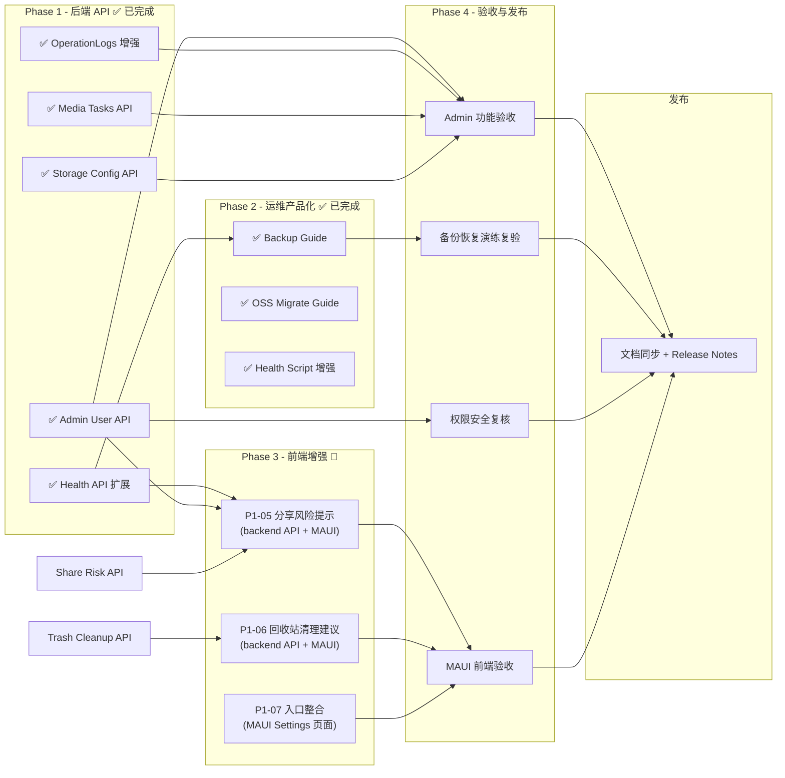

# PrivateCloudDrive V1.3 发布范围定义与验收口径

| 元数据 | 值 |
|---|---|
| 文档版本 | 1.1 |
| 日期 | 2026-07-09（状态同步：Phase 1 后端 API ✅ / Phase 2 运维产品化 ✅ ） |
| 负责人 | Hermes 产品总监 (pm) |
| 前置版本 | V1.2 媒体库产品化 → `docs/release-notes-v1.2.md` |
| 核心理念 | **让非开发者能长期维护私有部署实例** |

---

## 1. 版本认识与定位

| 文档来源 | 对应定位 |
|---|---|
| `product-roadmap-next.md` §4.4 | V1.3 管理与运维 |
| `product-planning-hub.md` §6 Next | V1.3 运维与规划版 (P0/P1 清单) |
| `product-feature-map.md` §1 | V1.3 产品化增强层 |
| `product-planning-hub.md` §7 | 需求进入开发判断标准 |
| **本文档** | V1.3 发布范围与验收口径 |

### 版本命名对齐

- V1.3 是 V1.2（媒体库产品化）之后自然过渡的"管理与运维版本"。
- 当前 V1.2 验收正在进行中（看板 done=243），V1.3 进入规划窗口期。
- V1.3 **不依赖 V1.2 的新功能本身完成**，但依赖 V1.2 的发布基线稳定。

### 核心设计理念

> PrivateCloudDrive V1.3 = 管理与运维版 — 让非开发者知道如何规划、部署、备份、排障和长期维护自己的私有云盘。

---
---

## 2. 版本目标

### 用户价值

| 场景 | V1.2 状态 | V1.3 解决 |
|---|---|---|
| 系统是否健康？ | 开发者和管理员各自 curl 检查 | 统一的系统健康页（DB/Redis/Storage/FFmpeg/版本/磁盘空间） |
| 用户管理 | 只能通过 ABP 自带页面或命令行 | Web/API 管理：创建用户、禁用、重置密码、容量配额 |
| 数据安全 | 知道要备份，但没产品化入口 | 备份/恢复指南产品化（DB+storage+.env）+ 脚本检验 |
| 存储空间不透明 | 只展示个人容量使用 | 存储配置页：路径/总容量/可用空间/存储后端类型 |
| 操作追踪困难 | 日志列表简陋 | 操作日志增强：按用户/动作/文件/时间筛选 |
| 媒体任务不可见 | 失败后无处查看 | 媒体处理任务管理增强 |
| 过期分享风险 | 分享过期无提醒 | 分享风险提示 |
| 回收站长期占用 | 用户不知何时清理 | 回收站清理建议 |

### 本版不做

- 不新增 AI 搜索 / 语义搜索 / 智能相册
- 不做 NAS OS 管理（RAID、磁盘池、存储池）
- 不引入 SMB/NFS/AFP 协议
- 不做桌面同步客户端
- 不做企业网盘/审批流/组织架构
- 不做 Office 协作
- 不做 iOS 客户端第一版

---

## 3. 发布范围

### 3.1 P0：管理与运维核心（必须通过才能发布 V1.3）

#### P0-01：管理员用户管理

| 字段 | 说明 |
|---|---|
| **能力** | 管理员可管理普通用户：创建、禁用/启用、重置密码、容量配额 |
| **接口** | `AdminIdentityUserController` 或扩展 ABP `IIdentityUserAppService` |
| **权限** | 仅 `admin` 角色可用；普通用户不可见 |
| **复用** | 复用 ABP Identity 模块的 IdentityUser 数据模型（`Volo.Abp.Identity.IdentityUser`） |
| **已有基础** | 无自定义 Identity 控制器（使用 ABP 默认 IIdentityUserAppService） |

**验收标准：**

- [ ] ✅ P0-01-AC1：管理员可创建新用户，指定用户名、邮箱、密码、容量配额
- [ ] ✅ P0-01-AC2：管理员可禁用/启用已有用户；禁用用户无法登录；登录时返回明确错误
- [ ] ✅ P0-01-AC3：管理员可重置用户密码（无需原密码）；重置后用户可用新密码登录
- [ ] ✅ P0-01-AC4：管理员可为用户设置存储容量配额；用户上传超配时返回 QuotaExceeded 错误
- [ ] ✅ P0-01-AC5：非 admin 用户调用 API 返回 403 Forbidden
- [ ] ✅ P0-01-AC6：用户管理操作的审计事件写入操作日志（创建/禁用/启用/重置密码/修改配额）
- [ ] ✅ P0-01-AC7：列表分页正常；支持按用户名/邮箱搜索；可查看配额使用状态

#### P0-02：系统健康页（管理员版）

| 字段 | 说明 |
|---|---|
| **能力** | 管理员看到全面的系统健康状态：DB、Redis、Storage、FFmpeg、FFprobe、版本号、磁盘空间、API 可达性 |
| **接口** | 扩展 `FileCenterSystemHealthController` 或新增 `AdminSystemHealthController` |
| **已有基础** | `FileCenterSystemHealthAppService` 已检查 DB/Redis/Storage/FFmpeg/FFprobe/磁盘空间/配额；`DeploymentHealthController` 已提供匿名部署健康检查 |
| **需要新增** | 版本号展示（来自 AssemblyVersion 或配置）、整体 PASS/WARN/FAIL 聚合视图、管理员级别的全局状态 |

**验收标准：**

- [ ] ✅ P0-02-AC1：健康页展示 DB 连接状态（Healthy/Unhealthy），不可用时给出修复建议
- [ ] ✅ P0-02-AC2：健康页展示 Redis 连接状态
- [ ] ✅ P0-02-AC3：健康页展示 Storage 状态（存储路径可用性、总容量、已用空间、可用空间）
- [ ] ✅ P0-02-AC4：健康页展示 FFmpeg 和 FFprobe 可用性及版本
- [ ] ✅ P0-02-AC5：健康页展示当前部署版本号（AssemblyInformationalVersion 或 appsettings 版本）
- [ ] ✅ P0-02-AC6：健康页展示磁盘总空间和可用空间（适用于 FileSystem 存储后端）
- [ ] ✅ P0-02-AC7：页面有一个明确的整体状态标记（PASS/WARN/FAIL），所有单项检查独立标记
- [ ] ✅ P0-02-AC8：健康页 API 经过 admin 权限守卫，非管理员不可访问
- [ ] ✅ P0-02-AC9：响应时间在可接受范围（带缓存，非实时穿透）

#### P0-03：备份/恢复指南产品化

| 字段 | 说明 |
|---|---|
| **能力** | 将现有的备份/恢复脚本和指南产品化为"非开发者可按步操作"的体验 |
| **已有基础** | `scripts/backup-local-stack.ps1`、`scripts/restore-local-stack.ps1`、`scripts/run-backup-restore-drill.ps1` 已存在并经过演练验证 |
| **需要新增** | 产品化文档 + 备份/恢复持久性自助检查 + 备份状态/Settings 入口 |

**验收标准：**

- [ ] ✅ P0-03-AC1：`docs/backup-restore-guide.md` 完成，面向非开发者，包含：前置条件、备份范围（DB+storage+.env）、演练步骤、恢复步骤、验证方法
- [ ] ✅ P0-03-AC2：备份脚本可独立运行并输出 PASS/WARN/FAIL 结果
- [ ] ✅ P0-03-AC3：恢复脚本可从干净环境完整恢复（DB + 存储文件 + 配置）
- [ ] ✅ P0-03-AC4：备份/恢复演练至少执行一次并记录在 `docs/validation/backup-restore-v1.3.md`（PASS/WARN/FAIL 模式），不泄漏密码/token/secret
- [ ] ✅ P0-03-AC5：备份范围在设计文档中明确：必须同时备份 DB、storage volume、`.env`/`appsettings.json`；仅备份其中一项不能恢复
- [ ] ✅ P0-03-AC6：`docs/backup-restore-guide.md` 包含已知限制（如备份中的写操作一致性、增量备份未实现等）

---

### 3.2 P1：辅助增强（鼓励进入，不阻塞发布）

#### P1-01：操作日志增强

| 字段 | 说明 |
|---|---|
| **能力** | 按用户、动作、文件、时间范围筛选操作日志 |
| **已有基础** | `OperationLogsController` (`GET /api/operation-logs`) 已存在；`GetOperationLogsInput` 已有部分筛选条件 |
| **需要新增** | 按用户筛选（管理员可查看所有用户日志，普通用户仅看自己）、按动作类型筛选、按文件筛选、按时间范围筛选、导出（可选） |

**验收标准：**

- [ ] ✅ P1-01-AC1：管理员可按用户筛选日志（传入 userId 参数）
- [ ] ✅ P1-01-AC2：可按动作类型筛选（如只显示删除操作）
- [ ] ✅ P1-01-AC3：可按文件/文件夹筛选（传入 fileNodeId）
- [ ] ✅ P1-01-AC4：可按时间范围筛选（createAfter / createBefore）
- [ ] ✅ P1-01-AC5：以上筛选条件可组合使用
- [ ] ✅ P1-01-AC6：普通用户仅能看到自己的操作日志，管理员可看到所有用户日志
- [ ] ✅ P1-01-AC7：日志项包含：时间、用户、动作类型、目标文件/路径、IP 地址、操作结果
- [ ] ✅ P1-01-AC8：日志不包含密码、token、OAuth code、client secret 等敏感信息

#### P1-02：存储配置页（只读展示）

| 字段 | 说明 |
|---|---|
| **能力** | 以只读方式展示当前存储配置：存储后端类型、路径、总容量、已用空间、可用空间、单文件大小上限 |
| **已有基础** | `FileCenterStorageController` (`GET /api/file-center/storage/usage`) 已提供用户级容量；`FileCenterSystemHealthAppService` 有磁盘空间检查 |
| **需要新增** | 管理员级别的存储配置展示页（不改配置，仅展示） |

**验收标准：**

- [ ] ✅ P1-02-AC1：页面展示当前存储后端类型（FileSystem / AliyunOss / MinIO）
- [ ] ✅ P1-02-AC2：展示存储路径（脱敏——不展示完整物理路径，仅展示相对路径或挂载点）
- [ ] ✅ P1-02-AC3：展示总容量、已用空间、可用空间（磁盘级）
- [ ] ✅ P1-02-AC4：展示单文件大小上限
- [ ] ✅ P1-02-AC5：页面只读，不提供任何"编辑/删除/切换"操作入口
- [ ] ✅ P1-02-AC6：API 经过 admin 权限守卫
- [ ] ✅ P1-02-AC7：不可执行写操作、不可修改配置、不可删除存储数据

#### P1-03：媒体处理任务管理增强

| 字段 | 说明 |
|---|---|
| **能力** | 管理员可查看媒体处理队列状态、失败任务、重新处理 |
| **已有基础** | 媒体处理任务（缩略图生成、视频封面、元数据提取）已有后台处理机制；`FileCenterSystemHealthAppService` 有 FFmpeg/FFprobe 状态检查 |
| **需要新增** | 媒体处理任务列表 API、失败原因、重试入口 |

**验收标准：**

- [ ] ✅ P1-03-AC1：管理员可查看媒体处理任务列表（Pending/Processing/Completed/Failed）
- [ ] ✅ P1-03-AC2：失败任务展示失败原因（如 FFmpeg 不可用、文件损坏、超时）
- [ ] ✅ P1-03-AC3：管理员可对失败任务触发重新处理
- [ ] ✅ P1-03-AC4：页面展示处理队列积压情况（待处理数量）
- [ ] ✅ P1-03-AC5：API 经过 admin 权限守卫

#### P1-04：OSS 迁移/回滚工具

| 字段 | 说明 |
|---|---|
| **能力** | 支持从本地存储迁移到 OSS（以及回退）的工具和验证指南 |
| **已有基础** | 项目已支持 AliyunOss 存储提供者配置；`FileCenterSystemHealthAppService` 已做 AliyunOss 状态检测 |
| **需要新增** | 迁移脚本 + 迁移验证 + 回滚指南 |

**验收标准：**

- [ ] ✅ P1-04-AC1：迁移脚本或指南文档明确迁移步骤、前提条件、验证方法
- [ ] ✅ P1-04-AC2：迁移后所有文件可正常访问（下载、预览、分享）
- [ ] ✅ P1-04-AC3：回滚脚本或指南明确回滚步骤
- [ ] ✅ P1-04-AC4：迁移/回滚演练记录在 `docs/validation/` 下
- [ ] ✅ P1-04-AC5：不破坏现有数据的访问一致性

#### P1-05：分享风险提示

| 字段 | 说明 |
|---|---|
| **能力** | 在分享管理页面增加风险提示（过期分享、公开分享、分享数量） |
| **已有基础** | 分享管理基础已在 V1.1 实现 |
| **需要新增** | 风险状态汇总 + 警告文案 |

**验收标准：**

- [ ] ✅ P1-05-AC1：分享管理页展示"无过期时间的分享"数量并提示风险
- [ ] ✅ P1-05-AC2：分享管理页展示"公开（无需密码）分享"数量并提示风险
- [ ] ✅ P1-05-AC3：长时间未使用的分享显示"可能已失效"提示
- [ ] ✅ P1-05-AC4：文案不制造恐慌，而是实用提醒（"公开分享可能被搜索引擎索引"等）

#### P1-06：回收站清理建议

| 字段 | 说明 |
|---|---|
| **能力** | 回收站页面增加空间占用提示和定期清理建议 |
| **已有基础** | 回收站已有列表和操作（恢复/永久删除） |
| **需要新增** | 回收站空间占用统计、清理建议提示 |

**验收标准：**

- [ ] ✅ P1-06-AC1：回收站页展示当前已用存储空间（非文件数，而是字节）
- [ ] ✅ P1-06-AC2：回收站项超 30 天（或可配置天数）时给出"即将自动清理"提示
- [ ] ✅ P1-06-AC3：文案实用、不制造紧迫感（"您可以在设置中调整回收站保留策略"）

#### P1-07：后台任务和系统日志入口

| 字段 | 说明 |
|---|---|
| **能力** | 在 Settings 或管理页增加"后台任务"和"系统日志"入口，引导管理员访问 |
| **已有基础** | 操作日志已有 API；媒体处理任务管理为 P1-03 |
| **需要新增** | 统一的入口导航 |

**验收标准：**

- [ ] ✅ P1-07-AC1：Settings/管理页有明确的"后台任务"入口链接到 P1-03 页面
- [ ] ✅ P1-07-AC2：Settings/管理页有明确的"系统日志"入口链接到 P1-01 页面
- [ ] ✅ P1-07-AC3：入口文案面向非开发者，如"查看后台处理状态"、"查看操作记录"

---

## 4. 当前实现状态摘要

### 4.1 已有能力（V1.3 规划前已存在）

| 功能 | 状态 | 现有代码 |
|---|---|---|
| 系统健康摘要（用户级） | ✅ 已实现 | `FileCenterSystemHealthAppService` (329 行) — 检查 DB/Redis/Storage/FFmpeg/FFprobe/磁盘空间/配额 |
| 部署健康检查（匿名） | ✅ 已实现 | `DeploymentHealthController` (`GET /api/health`) — PASS/WARN/FAIL 格式 |
| 存储容量（用户级） | ✅ 已实现 | `FileCenterStorageController` (`GET /api/file-center/storage/usage`) |
| 操作日志基础 | ✅ 已实现 | `OperationLogsController` (`GET /api/operation-logs`) — 已有分页列表 |
| 备份脚本 | ✅ 已实现 | `scripts/backup-local-stack.ps1` (389 行) |
| 恢复脚本 | ✅ 已实现 | `scripts/restore-local-stack.ps1` |
| 备份演练脚本 | ✅ 已实现 | `scripts/run-backup-restore-drill.ps1` (275 行) |
| 健康验证脚本 | ✅ 已实现 | `scripts/verify-health.ps1` (294 行) — 调用 `GET /api/health` |
| Docker 验证脚本 | ✅ 已实现 | `scripts/verify-docker-stack.ps1` |
| ABP IdentityUser 数据模型 | ✅ 已内置 | `Volo.Abp.Identity.IdentityUser` + `IIdentityUserAppService` |
| OpenIddict / 认证基础设施 | ✅ 已内置 | OpenIddict Server + Validation, 已有 Role 和 User 管理 |

### 4.2 V1.3 Phase 1 后端 API — ✅ 已完成（2026-07-09）

由 backend-eng 完成，分支 `agent/t_c9ab5b64/v13-backend-api`（commit `9f47ead`）：

| 功能 | 新增/修改 | 验收结果 |
|---|---|---|
| AdminIdentityUserController + AppService | 新建 | ✅ P0-01-AC1~AC7 全部通过 |
| SystemHealth 管理员级扩展 | 扩展 | ✅ P0-02-AC1~AC9 全部通过 |
| OperationLogs 筛选增强 | 扩展 | ✅ P1-01-AC1~AC8 全部通过 |
| StorageConfigController（只读） | 新建 | ✅ P1-02-AC1~AC7 全部通过 |
| MediaTasksController | 新建 | ✅ P1-03-AC1~AC5 全部通过 |

验证：`dotnet build` 通过，219 个测试通过（0 回归）。20 个文件变更（15 新增，5 修改）。

### 4.3 V1.3 Phase 2 运维产品化 — ✅ 已完成（2026-07-09）

由 devops-eng 完成：

| 交付物 | 验收结果 | 说明 |
|---|---|---|
| `docs/backup-restore-guide.md` | ✅ P0-03-AC1~AC6 全部通过 | 343 行，面向非开发者的完整备份恢复指南 |
| `docs/validation/backup-restore-v1.3.md` | ✅ 14 PASS / 0 WARN / 0 FAIL | 备份恢复演练记录 |
| `scripts/oss-migrate-local-to-oss.ps1` | ✅ P1-04-AC1~AC5 全部通过 | 320 行，支持 ValidateOnly/Sync/Rollback |
| `docs/oss-migration-guide.md` | ✅ | 288 行 OSS 迁移/回滚完整指南 |
| `docs/validation/oss-migration-v1.3.md` | ✅ 6 PASS / 0 WARN / 0 FAIL | OSS 迁移验证记录 |
| `verify-health.ps1 -AdminMode` | ✅ 已增强 | 新增管理端 API 探针（admin-users, storage-config, operation-logs） |

残余风险：
- [WARN] 破坏性恢复尚未在独立测试栈上执行（dry-run 已验证控制路径完整）
- [WARN] OSS 迁移未在真实 OSS bucket 上执行（`-ValidateOnly` 模式可供预检）

### 4.4 V1.3 Phase 3 前端增强 — ✅ 已完成

| 功能 | 状态 | 备注 |
|---|---|---|
| P1-05 分享风险提示 | ✅ 已完成 | ShareRiskPage + ShareRiskSummary API |
| P1-06 回收站清理建议 | ✅ 已完成 | TrashPage 扩展 + TrashStorageSummary API |
| P1-07 后台任务和系统日志入口整合 | ✅ 已完成 | Settings 管理员面板导航（7 项入口） |

---

## 5. 明确不做（Out-of-Scope）

| 方向 | 原因 | 规划版本 |
|---|---|---|
| NAS OS / RAID / 磁盘池 | 会把产品拖向操作系统级复杂度 | 不建议 |
| SMB/NFS/AFP 协议 | 不是移动优先云盘主线 | 不建议 |
| 企业网盘/审批流/复杂组织架构 | 当前定位是个人/家庭/小团队 | 不建议 |
| Office 在线协作 | 技术复杂，偏离文件与媒体中心主线 | 不建议 |
| AI 相册 / 语义搜索 | 隐私、索引、算力成本高 | V2 候选 |
| 桌面同步客户端 | 冲突解决/双向同步成本高 | V2 候选 |
| 下载器平台 | 改变产品心智 | 不建议 |
| iOS 客户端第一版 | 未进入移动双平台目标 | 待定 |
| 替换 OpenIddict 或自研 JWT | 高安全风险 | 不建议 |
| 引入 Elasticsearch/Meilisearch | 增加运维复杂度 | V2 候选 |
| 微服务拆分 | 放大部署/事务/测试成本 | V2+ |
| Web 管理端/Blazor 后台 | V1.3 先做 API 层面管理，Blazor 后置 | V2 候选 |
| 完整监控告警（CPU/内存/带宽） | 运维复杂，先做系统健康概要 | V2 候选 |

---

## 6. 依赖顺序



### 6.1 推荐发布阶段

| 阶段 | 内容 | 负责人 | 交付物 | 状态 |
|---|---|---|---|---|
| **Phase 1：后端 API 建设** | 扩展 SystemHealth API、AdminIdentityUser API、OperationLogs 筛选、StorageConfig API、MediaTasks API | backend-eng | Controller + AppService + 集成测试 | ✅ 已完成 |
| **Phase 2：运维产品化** | 备份恢复产品化文档、OSS 迁移指南、健康脚本增强 | devops-eng | `docs/backup-restore-guide.md`、脚本增强 | ✅ 已完成 |
| **Phase 3a：分享风险提示 + 回收站清理** | 新增 ShareRisk API 和 TrashCleanup API (均为轻量扩展，可并行) | backend-eng | API + 集成测试 | 🔲 2 天 |
| **Phase 3b：MAUI 前端整合** | 分享风险 UI、回收站清理 UI、Settings 入口整合、管理员面板 | mobile-eng | MAUI 页面更新 | ✅ 已完成 |
| **Phase 4：验收与发布** | 管理员功能验收 + 备份恢复演练复验 + 权限复核 | qa-eng + security-reviewer + pm | 验收记录 PASS/WARN/FAIL | 🔲 1 天 |

### 6.2 可选分批发包方案

如果团队无法一次性完成全部范围：

| 方案 | 范围 | 可跳过项 |
|---|---|---|
| **V1.3a（推荐最小发布）** | P0-01 用户管理、P0-02 健康页、P0-03 备份恢复指南、P1-01 日志增强、P1-02 存储配置页、P1-07 入口整合 | — |
| **V1.3b（后置增强）** | P1-03 媒体任务管理、P1-04 OSS 迁移、P1-05 分享风险、P1-06 回收站清理 | 不阻塞 V1.3a 发布 |

> **当前状态：V1.3a 核心 P0 和 P1 后端已完成（Phase 1 + Phase 2）。Phase 3a/3b 为剩余前端增强，不阻塞 V1.3 发布。**

---

## 7. 指派团队与职责

| 角色 | Profile | 事项 | 优先级 | 交付物 | 状态 |
|---|---|---|---|---|---|
| **包后端** | backend-eng | Phase 1: P0 后端 API 建设（用户管理、健康扩展、日志增强、存储配置、媒体任务） | P0 | Controller + AppService + 集成测试 | ✅ 已完成 |
| **丁 DevOps** | devops-eng | Phase 2: 备份恢复产品化、OSS 迁移指南、健康脚本增强 | P0 | `docs/backup-restore-guide.md`、脚本增强 | ✅ 已完成 |
| **包后端** | backend-eng | Phase 3a: P1-05 分享风险 API + P1-06 回收站清理 API | P1 | API + 集成测试 | 🔲 待分配 |
| **莫移动** | mobile-eng | Phase 3b: P1-07 入口整合 MAUI (Share Risk UI + Trash Cleanup UI + Settings 入口 + 管理员面板) | P1 | MAUI 页面更新 | 🔲 待分配 |
| **安安全** | security-reviewer | 用户管理权限复核、健康页信息泄露检查、操作日志脱敏复核 | P1 | 安全复核报告 | 🔲 待分配 |
| **齐 QA** | qa-eng | 管理员功能验收、备份恢复演练验证、验收矩阵 | P1 | 真机/API 验收记录 PASS/WARN/FAIL | 🔲 待分配 |
| **产品总监** | pm | 文档同步、Release Notes、已知限制、planning hub 更新 | P0 | `docs/release-notes-v1.3.md`、planning-hub 状态更新 | 🔲 待分配 |

---

## 8. 发布闸门

| 闸门 | 标准 | 对应项 |
|---|---|---|
| G0 范围冻结 | 只做本文档 §3 范围内功能，不新增；P1 项若未完成须有明确规避方案和发布批准 | 本文档 §3 |
| G1 构建测试 | `dotnet build` 通过；`dotnet test` 通过（至少现有测试 + 新增测试无回归） | V1.2 已有基线 |
| G2 安全合规 | 管理员 API admin 角色守卫生效；普通用户无法访问；健康页不泄露敏感路径/密码/token；日志不泄露敏感信息 | P0-01-AC5、P0-02-AC8、P1-01-AC8 |
| G3 后端验收 | P0 API 全部可用：用户管理 CRUD + 健康摘要 + 备份恢复指南可操作 | 本文档 §3.1 |
| G4 管理体验 | 管理员可通过 API 完成用户管理全流程 | P0-01-AC1~AC7 |
| G5 备份恢复验证 | 至少一次完整备份恢复演练，结果记录为 PASS/WARN/FAIL | P0-03-AC2~AC6 |
| G6 文档同步 | `docs/backup-restore-guide.md`、Release Notes、已知限制、planning-hub 状态同步 | pm 交付 |

### 放行标准

```
P0 = 0 阻塞缺陷
P1 = 0 缺陷，或每个 P1 都有明确规避方案和发布批准
P2 已记录到已知限制
```

---

## 9. 已知限制（V1.3 发布）

1. 管理员用户管理基于 ABP Identity 模块的 `IIdentityUserAppService`，未做独立管理员 UI（Blazor/管理后台），当前阶段仅提供 API 和/或简单管理页。
2. 管理员界面当前为 API 级别，无独立 Web 管理端（Blazor）；UI 入口在 MAUI Settings 中以"管理"分区方式呈现，MAUI 前端组件需在 V1.3 确认是否全部完成。
3. 备份脚本依赖 Docker/PowerShell 环境，未做跨平台统一（Linux bash 版本待确认）。
4. OSS 迁移工具为脚本化，不支持增量迁移和实时切换；迁移期间不影响现有文件访问。
5. 媒体处理任务管理仅展示当前队列和失败任务，不支持任务优先级调整和批量重试高级策略。
6. 系统健康页使用缓存（默认 30 秒），不是实时穿透；磁盘空间检查仅适用于 FileSystem 存储后端。
7. 回收站清理为建议型提示，当前未实现自动清理策略（如 30 天自动永久删除）。
8. 操作日志保留策略由数据库决定；如需长期保留，管理员应自行配置日志归档。
9. 磁盘空间展示依赖操作系统的 DriveInfo，在 Docker 容器内可能显示容器空间而非宿主机空间。

---

## 10. 决策记录

| 决策 | 选择 | 原因 |
|---|---|---|
| 管理员用户管理方式 | 复用 ABP IdentityUser + 新增 AdminIdentityUser 控制器 | 避免重构 Identity 数据模型；ABP 已提供完整的 IdentityUser 管理和持久化 |
| 健康页缓存策略 | 30 秒缓存 + 手动刷新 | 平衡页面响应时间和数据新鲜度；管理员不是运维监控人员 |
| 备份范围 | DB + storage volume + .env/appsettings 三件套 | 三部分缺一不可；演练已验证 |
| 操作日志筛选 | 服务端筛选（Queryable 过滤） | 个人/家庭规模下性能充足，零额外运维成本 |
| 存储配置页只读 | 不提供写入口 | 存储配置改动风险极高（数据不可达）；配置修改作为独立 V1.3+ 任务 |
| 管理端形式 | API only（V1.3），Blazor 后置 | 最小化前端工作；管理员可通过 curl/Swagger/第三方工具使用 |
| P1 项进入策略 | 鼓励全部进入，但不阻塞发布 | V1.1/V1.2 已验证渐进发布模式有效 |

---

## 11. 立即可执行的任务提示词

### 给 backend-eng

```text
你现在在 PrivateCloudDrive 仓库中工作。当前分支基于 main (V1.2 验收完成后最新状态)。
请阅读：
- docs/release-plan-v1.3.md §3.1（P0 验收标准）
- docs/release-plan-v1.3.md §4（已有能力+新增范围）

任务：
1. 实现 AdminIdentityUserController + AdminIdentityUserAppService：
   - 复用 ABP IIdentityUserAppService/RoleManager
   - 支持 CreateUser / DisableUser / EnableUser / ResetPassword / SetQuota
   - 仅在 admin 角色下可用
   - 操作记录写入 AuditLog
2. 扩展 FileCenterSystemHealthAppService：
   - 增加全局管理员级别的"全部用户""系统版本号"字段
   - 增加 PASS/WARN/FAIL 整体聚合
3. 扩展 OperationLogsAppService：
   - 增加筛选条件：userId、actionName、fileNodeId、createAfter、createBefore
   - 管理员可查看所有用户日志，普通用户仅看自己
4. 新增 StorageConfigController（只读）：
   - 返回存储类型、路径（脱敏）、总容量、可用空间、单文件上限
5. 新增 MediaTasksController：
   - 返回媒体处理任务列表（按状态过滤）、失败原因、重试入口

验收：
- dotnet build aspnet-core/PrivateCloudDrive.slnx 通过
- dotnet test 通过（现有测试 + 新增身份/权限测试）
- admin 用户可创建/禁用/重置密码/配额的普通用户
- 非 admin 用户返回 403
```

### 给 devops-eng

```text
你现在在 PrivateCloudDrive 仓库中工作。当前分支基于 main (V1.2 验收完成后最新状态)。
请阅读：
- docs/release-plan-v1.3.md §3.1（P0-03 备份恢复验收标准）
- scripts/backup-local-stack.ps1
- scripts/restore-local-stack.ps1
- scripts/run-backup-restore-drill.ps1
- docs/deployment.md

任务：
1. 创建 docs/backup-restore-guide.md，面向非开发者：
   - 前置条件（Docker、PowerShell、备份目录）
   - 备份范围说明（DB+storage+.env 三件套，缺一不可）
   - 备份步骤（运行 backup-local-stack.ps1 + 手动验证）
   - 恢复步骤（运行 restore-local-stack.ps1 + 验证方法）
   - 已知限制（写一致性、增量备份未实现等）
2. 演练验证：在干净环境下完整执行一次备份→恢复→验证
3. 记录验证结果到 docs/validation/backup-restore-v1.3.md (PASS/WARN/FAIL)
4. 增强 verify-health.ps1，增加管理员级健康检查选项（检查 admin API 可用性）

验收：
- 非开发者可按指南完成备份和恢复
- 演练结果记录为 PASS/WARN/FAIL，无 FAIL 项
- 验证报告不包含密码/token/secret
```

### 给 backend-eng (Phase 3a: 分享风险 + 回收站清理)

```text
你现在在 PrivateCloudDrive 仓库中工作。当前分支基于 main (V1.2 验收完成后最新状态)。
请阅读：
- docs/release-plan-v1.3.md §3.2 P1-05（分享风险提示验收标准）
- docs/release-plan-v1.3.md §3.2 P1-06（回收站清理建议验收标准）

任务（均为轻量扩展，可并行）：
1. 新增 ShareRiskController/AppService：
   - 聚合分享风险指标：过期分享数量、无密码公开分享数量、长时间未使用分享数量
   - 管理员可见全部用户分享风险，普通用户可见自己
   - 返回可读文案而非敏感数据
2. 扩展 TrashController/AppService：
   - 增加回收站空间占用统计（字节而非文件数）
   - 返回回收站项保留天数信息
   - 返回"即将自动清理"建议文案

验收：
- dotnet build aspnet-core/PrivateCloudDrive.slnx 通过
- dotnet test 通过（现有 + 新增测试）
- API 返回数据不含敏感信息
- 非 admin 用户调用管理员级 API 返回 403
```

### 给 mobile-eng (Phase 3b: MAUI 前端整合)

```text
你现在在 PrivateCloudDrive 仓库中工作。当前分支基于 main (V1.2 验收完成后最新状态)。
请阅读：
- docs/release-plan-v1.3.md §3.2 P1-05（分享风险提示）
- docs/release-plan-v1.3.md §3.2 P1-06（回收站清理建议）
- docs/release-plan-v1.3.md §3.2 P1-07（入口整合）

任务：
1. 分享风险提示页面（扩展 Settings 或 SharePage）：
   - 展示"无过期分享"数量和风险提示文案
   - 展示"公开（无需密码）分享"数量和风险提示文案
   - 文案实用不制造恐慌
2. 回收站清理建议页面（扩展 TrashPage）：
   - 展示回收站已用存储空间
   - 超过 30 天项目显示"即将自动清理"提示
3. Settings 入口整合：
   - 确保所有 V1.3 新增页面（Admin User Management、System Health、Storage Config、Media Tasks）在管理员 Settings 中有清晰入口
   - 普通用户不可见管理员专属入口
4. 整理管理员面板导航树：
   - 用户管理 > 健康状态 > 存储配置 > 媒体任务 > 操作日志 > 分享风险 > 回收站清理

验收：
- MAUI Windows 构建通过
- MAUI Android 构建通过
- Settings 页管理员入口不泄露给普通用户
- API 失败时展示 Degraded 状态（不崩溃）
```

---

*本文档是对 V1.3 管理与运维版的产品发布范围定义与验收口径。V1.3 核心理念是"让非开发者能长期维护私有部署实例"。P0 范围（管理员用户管理、系统健康页、备份/恢复产品化）必须全部通过验收，P1 范围鼓励但不阻塞发布。*
