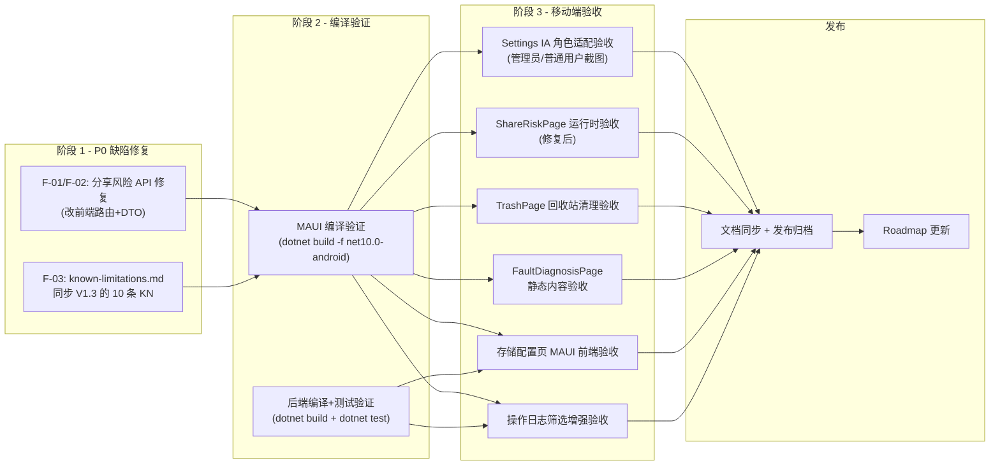

# PrivateCloudDrive V1.3b 发布范围定义与验收口径

| 元数据 | 值 |
|---|---|
| 文档版本 | 1.0 |
| 日期 | 2026-07-10 |
| 负责人 | 产品总监 (pm) |
| 前置版本 | V1.3 管理与运维版 → `docs/release-plan-v1.3.md` |
| 版本类型 | 维护版 / Hotfix & 验证收口 |

---

## 1. 版本认识与定位

V1.3 已发布（API + 后端 + MAUI 前端基础功能全部完成），但 QA 验收发现以下三项 P0 阻断缺陷和多项 P1 待验收项：

| 来源 | 问题 | 严重级别 |
|------|------|---------|
| QA 报告 Settings IA (v1.3-mobile-accept-settings-ia.md) | 2 个编译错误（均已修复） | P0 ✅ 已修复 |
| QA 报告 分享+媒体 (v1.3-mobile-accept-media-share.md) | ShareRisk API 路由+DTO 不匹配 | **P0 ❌ 未修复** |
| QA 报告 回收站 (v1.3-mobile-accept-trash-settings.md) | Trash API 路由+DTO 不匹配（已修复） | P0 ✅ 已修复 |
| QA 报告 回收站 (同上) | FaultDiagnosis 入口处理器缺失（已修复） | P1 ✅ 已修复 |
| Release Notes V1.3 | known-limitations.md 需要同步 10 条 KN | P0 🔲 待同步 |
| 验收矩阵 | 移动端各页面需实机/模拟器验收 | P1 🔲 |

V1.3b 的目标是：**修复全部 P0 缺陷、补齐已知限制同步、完成 MAUI 前端各页面的完整验收闭环。** 发布后 V1.3 系列视为完全结项。

### 本版不做（同 V1.3 范围）
- 不新增后端 API 或权限扩展
- 不做 V2.0 任何功能（家庭空间、团队空间、AI 搜索）
- 不做 iOS 验收
- 不做外部登录（微信/Google/GitHub）真机关闭环

---

## 2. 范围概述

### 2.1 V1.3 已完成内容（V1.3b 基线）

| 模块 | 状态 | 备注 |
|------|------|------|
| 管理员用户管理 (P0-01) | ✅ 已发布 | API + 权限 + 测试全部通过 |
| 系统健康页 (P0-02) | ✅ 已发布 | API + MAUI 展示完整 |
| 备份恢复指南 (P0-03) | ✅ 已发布 | 文档 + 脚本 + 演练记录 |
| 操作日志增强 (P1-01) | ✅ 已发布 | API 筛选增强 |
| 存储配置页 (P1-02) | ✅ 已发布 | API 只读展示 |
| 媒体任务管理 (P1-03) | ✅ 已发布 | API + MAUI 页面 |
| OSS 迁移工具 (P1-04) | ✅ 已发布 | 脚本 + 文档 |
| 故障诊断页 | ✅ 代码完整 | BUG-001/BUG-002 **已修复**（2026-07-09 后） |
| Settings 管理员面板 8 项 | ✅ 代码完整 | 含 OnFaultDiagnosisClicked 处理器（已补充） |

### 2.2 V1.3b 修复范围

| # | 模块 | 当前状态 | V1.3b 动作 | 优先级 |
|---|------|---------|-----------|--------|
| F-01 | 分享风险 API 路由 | ❌ 前端调用 `/api/file-center/shares/risk-summary`，后端路由为 `shares/risk` | 修复路由: 改前端的 URL 路径 | **P0** |
| F-02 | 分享风险 DTO 属性名 | ❌ MAUI `ShareRiskSummaryDto` 用 `NoExpiryShareCount/PublicShareCount/LongUnusedShareCount`，后端 `ShareRiskDto` 用 `NoExpirationCount/PublicNoPasswordCount/LongUnusedCount` | 统一 DTO 属性名（推荐改前端匹配后端） | **P0** |
| F-03 | 已知限制同步 V1.3 | ⚠️ known-limitations.md 只有 9 条（1-9），但 V1.3 有 10 条 KN | 新增 KN-V1.3-01~10 到 known-limitations.md | **P0** |
| F-04 | Release Notes 同步 | ⚠️ 已创建但发布时间待定 | 最终确认 V1.3b 发布时间后更新 | P1 |
| F-05 | Settings IA 角色适配验收 | ⚠️ QA 已确认代码逻辑但无模拟器截图证据 | 需真机/模拟器截图：管理员看到 8 项面板、普通用户不可见 | **P0** |
| F-06 | 分享风险 UI 交互验收 | ⚠️ QA 报告代码完整性，但编译阻断尚未验证运行时 | 修复 F-01/F-02 后验收 ShareRiskPage 运行时行为 | P0 |
| F-07 | 回收站清理 UI 交互验收 | ✅ API 路由已修复，DTO 已对齐 | 修复后验收 TrashPage 运行时显示 | P1 |
| F-08 | 故障诊断页静态内容验收 | ✅ 代码已修正（Ellipse 类型+导航处理器） | 编译验证 + 模拟器页面截图 | P1 |
| F-09 | 存储配置页 MAUI 展示验收 | ⚠️ 后端 API 确认，MAUI 前端需验证 | 检查 Settings 中存储配置页数据显示正确 | P1 |
| F-10 | 操作日志增强 MAUI 筛选验收 | ⚠️ 后端筛选逻辑确认，MAUI 前端筛选控件需验证 | 前端筛选条件组合使用验证 | P1 |

---

## 3. P0 范围详解

### F-01 / F-02：分享风险 API 前后端疏通

**当前问题**：

| 维度 | MAUI 前端（当前） | 后端 API（实际） |
|------|-----------------|-----------------|
| URL 路径 | `GET /api/file-center/shares/risk-summary` | `GET /api/file-center/shares/risk` |
| 计数属性 | `NoExpiryShareCount` / `PublicShareCount` / `LongUnusedShareCount` | `NoExpirationCount` / `PublicNoPasswordCount` / `LongUnusedCount` |
| 文案属性 | `NoExpiryWarning` / `PublicWarning` / `LongUnusedWarning` | `NoExpirationMessage` / `PublicShareMessage` / `UnusedShareMessage` |

**影响范围**：ShareRiskPage 完全不可用——所有计数显示 "--"，页面显示"无法读取分享安全状态"错误。

**修复方案**（推荐改前端匹配后端，不改后端以免影响其他客户端）：

1. `CloudDriveApiClient.cs` line 1182：`"/api/file-center/shares/risk-summary"` → `"/api/file-center/shares/risk"`
2. `CloudDriveApiClient.cs` ShareRiskSummaryDto（L2333-2346）：属性名与后端 `ShareRiskDto` 对齐
3. `CloudDriveApiClient.cs` L1192-1198：构造函数传参同步更新

**验收标准**：

| AC | 描述 | 验证方式 |
|----|------|---------|
| AC-F01-A | ShareRiskPage 加载时不报错，不显示"无法读取分享安全状态" | 模拟器截图 |
| AC-F01-B | 页面展示无过期分享数量（=0 时显示合理文案） | 模拟器截图 |
| AC-F01-C | 页面展示公开分享数量 | 模拟器截图 |
| AC-F01-D | 页面展示长期未使用分享数量 | 模拟器截图 |
| AC-F01-E | 文案不制造恐慌，展示实用提醒 | 文案审查 |
| AC-F01-F | 编译通过，无 MAUI 编译错误 | `dotnet build` 通过 |

---

### F-03：known-limitations.md 同步 V1.3

**当前问题**：`docs/known-limitations.md` 仅包含 9 个已知限制项，但 `docs/release-notes-v1.3.md` 列出了 10 条 KN（KN-V1.3-01~10）。

**需要添加的 KN**（摘自 release-notes-v1.3.md §已知限制）：

| 编号 | 限制 | 影响 | 规避 |
|:----:|------|------|------|
| KN-V1.3-01 | 禁用用户后已有 access_token 缓存最长 5 分钟失效 | 安全边界非实时 | 5 分钟后验证；可重启 API |
| KN-V1.3-02 | 系统健康检测结果有 30 秒缓存 | 监控时效性 | 间隔 30 秒以上刷新 |
| KN-V1.3-03 | 备份脚本依赖主机安装 pg_dump | 备份可用性 | 确保 Docker 宿主机安装 PostgreSQL 客户端 |
| KN-V1.3-04 | 存储状态页仅展示当前 provider 容量概览 | 运维灵活性 | 切换后端需独立迁移计划 |
| KN-V1.3-05 | 操作日志不支持 CSV 导出 | 审计导出 | 可通过 API 分页自行处理 |
| KN-V1.3-06 | 创建用户时无法通过 UI 分配角色 | 管理效率 | 通过 Swagger 分配角色 |
| KN-V1.3-07 | Settings 页面 IA 有调整，管理员需适应 | 体验过渡 | 管理入口集中在 Settings 顶部 |
| KN-V1.3-08 | 故障诊断清单为静态内容 | 诊断灵活性 | 静态内容覆盖常见问题 |
| KN-V1.3-09 | 管理端仅通过 MAUI Settings 和 Swagger/API 提供 | 操作平台 | 独立 Web 管理端为 V2 候选 |
| KN-V1.3-10 | iOS 客户端不在 V1.3 范围内 | 平台覆盖 | 参考 V1.2 已知限制 |

**验收标准**：

| AC | 描述 |
|----|------|
| AC-F03-A | known-limitations.md 包含全部 10 条 V1.3 已知限制 |
| AC-F03-B | 每条 KN 格式一致（编号、限制描述、影响、规避/备注） |
| AC-F03-C | KN 文案面向非开发者，清晰易懂 |
| AC-F03-D | KN 与 release-notes-v1.3.md 口径一致，无矛盾 |

---

### F-05 / F-06：移动端验收（Settings IA + ShareRiskPage + TrashPage）

**验收范围**：

| 页面 | 验收项 | 期望结果 |
|------|--------|---------|
| SettingsPage | 管理员登录后 8 项管理面板可见 | 模拟器截图 + 管理员登录状态 |
| SettingsPage | 普通用户登录后管理面板隐藏 | 模拟器截图 + 普通用户登录状态 |
| SettingsPage | HealthStatusDot 四色逻辑（绿/橙/红/灰） | 模拟器截图 |
| ShareRiskPage | 风险摘要正常展示（修复 F-01/F-02 后） | 模拟器截图 |
| TrashPage | 回收站占用空间 + 清理建议文本显示 | 模拟器截图 |

---

## 4. P1 范围详解

### F-08：故障诊断页静态内容验收

**来源**：QA 报告已确认页面结构完整，6 类展开区域正确，编译 BUG-001/BUG-002 已修复。

**验收标准**：

| AC | 描述 |
|----|------|
| AC-F08-A | 编译通过（dotnet build -f net10.0-android） |
| AC-F08-B | 页面 6 个展开区（API/数据库/Redis/存储/FFmpeg/诊断信息）可正常展开和收起 |
| AC-F08-C | 整体状态圆点颜色正确映射（健康/降级/异常） |
| AC-F08-D | 从 Settings 管理员面板可导航到故障诊断页 |
| AC-F08-E | 返回按钮正常回到上一页 |
| AC-F08-F | 加载/错误/空闲三种状态 UI 表现正常 |

### F-09：存储配置页 MAUI 展示验收

**验收标准**：

| AC | 描述 |
|----|------|
| AC-F09-A | 存储后端类型正确显示（FileSystem/AliyunOss/MinIO） |
| AC-F09-B | 总容量/已用空间/可用空间数据显示正确 |
| AC-F09-C | 存储路径脱敏展示（不暴露完整物理路径） |
| AC-F09-D | 页面只读，无编辑/删除/切换按钮 |

### F-10：操作日志增强 MAUI 筛选验收

**验收标准**：

| AC | 描述 |
|----|------|
| AC-F10-A | 管理员可按用户筛选日志（日期组件选择用户） |
| AC-F10-B | 可按动作类型筛选（如仅显示删除操作） |
| AC-F10-C | 可按时间范围筛选（开始日期/结束日期） |
| AC-F10-D | 多项筛选条件可组合使用 |
| AC-F10-E | 筛选结果分页正常 |
| AC-F10-F | 日志项包含：时间、用户、动作类型、目标文件、操作结果 |
| AC-F10-G | 日志不包含敏感信息（密码/token/secret） |

---

## 5. 明确不做

- ⛔ 不做 V2.0 任何功能（家庭空间、团队空间、AI 搜索）
- ⛔ 不做新的后端 API 或权限扩展
- ⛔ 不做 iOS 验收
- ⛔ 不做外部登录（微信/Google/GitHub）真机关闭环
- ⛔ 不做 NuGet 包版本冲突降级（不影响编译通过）
- ⛔ 不做全新的 MAUI 页面开发（只验收已有页面）

---

## 6. 依赖顺序



### 6.1 推荐发布阶段

| 阶段 | 内容 | 负责人 | 交付物 | 状态 |
|------|------|--------|--------|------|
| **阶段 1：P0 缺陷修复** | F-01/F-02 分享风险 API 修复 + F-03 known-limitations 同步 | mobile-eng + docs-writer | API 路由修正 + known-limitations.md 更新 | 🔲 |
| **阶段 2：编译验证** | MAUI + 后端编译 & 单元测试 | mobile-eng + backend-eng | 编译通过 + 测试通过 | 🔲 |
| **阶段 3：移动端验收** | 6 个页面的真机/模拟器验收，截取证据 | qa-eng | Screenshots + 验收记录 PASS/WARN/FAIL | 🔲 |
| **阶段 4：发布闭包** | 文档同步 + Release Notes 更新 + Roadmap 更新 | pm | 发布归档 | 🔲 |

---

## 7. 团队指派

| 岗位 | Profile | 事项 | 优先级 | 交付物 |
|------|---------|------|--------|--------|
| **莫移动** | mobile-eng | F-01/F-02: 修复 ShareRisk API 路由+DTO | P0 | CloudDriveApiClient.cs 修正 + 编译验证 |
| **丁文档** | docs-writer | F-03: known-limitations.md 同步 V1.3 的 10 条 KN | P0 | known-limitations.md 更新 PR |
| **莫移动** | mobile-eng | 阶段 2: MAUI 编译验证（dotnet build -f net10.0-android） | P0 | 编译通过 |
| **包后端** | backend-eng | 阶段 2: 后端编译+测试验证 | P1 | dotnet test 通过 |
| **齐 QA** | qa-eng | 阶段 3: 6 页移动端验收 + 截图证据 | P1 | 验收报告 PASS/WARN/FAIL + screenshots |
| **产品总监** | pm | 阶段 4: 发布闭包 + Roadmap 同步 | P0 | 发布归档 + product-roadmap-next.md 更新 |

---

## 8. 发布闸门

| 闸门 | 标准 | 对应项 |
|------|------|--------|
| G0 范围冻结 | 只做本文档 §2.2 范围内修复，不新增功能 | 本文档 §2.2 |
| G1 编译测试 | `dotnet build -f net10.0-android` 通过；`dotnet build` + `dotnet test` 后端通过 | F-01/F-02 修复后 |
| G2 API 连通 | ShareRiskPage + TrashPage 调用 API 返回 200 而非 404 | F-01/F-02 |
| G3 文档同步 | known-limitations.md 包含全部 10 条 V1.3 KN | F-03 |
| G4 移动端验收 | 6 个页面截图证据收集完毕，验收记录汇总到 testing.md | 阶段 3 |

### 放行标准

```
P0 = 0 阻断缺陷
P1 = 0 缺陷，或每个 P1 都有明确规避方案
所有截图证据存入 docs/validation/screenshots/v1.3b/
验收记录合并到 docs/testing.md
```

---

## 9. V1.3b 新增已知限制（合并后）

V1.3b 本身不产生新的已知限制。已知限制以 `docs/known-limitations.md` 同步后的 V1.3 10 条 KN 为准，增补以下 V1.3b 客观限制：

| 编号 | 限制 | 影响 | 规避 |
|:----:|------|------|------|
| KN-V1.3b-01 | V1.3b 仅验证了之前 QA 报告的修复，未引入新的后端功能 | 发布范围 | 新功能规划在之后版本 |

---

## 10. 当前已知缺陷状态快照

| 缺陷 ID | 模块 | 严重级别 | 状态 | 修复人 | 备注 |
|---------|------|---------|------|--------|------|
| BUG-001 | FaultDiagnosisPage OverallDot 类型 | P0 | ✅ **已修复** | — | XAML Ellipse 已替换 Border |
| BUG-002 | SettingsPage OnFaultDiagnosisClicked 缺失 | P0 | ✅ **已修复** | — | 处理器已补充到 xaml.cs |
| BUG-003 | ShareRisk API 路由不匹配 | **P0** | ❌ **未修复** | mobile-eng | 前端调用 `/risk-summary`，后端 `/risk` |
| BUG-004 | ShareRisk DTO 属性名不匹配 | **P0** | ❌ **未修复** | mobile-eng | 6 个属性名全部不匹配 |
| BUG-005 | Trash API 路由不匹配 | P0 | ✅ **已修复** | — | 已改为 `/cleanup-advice` |
| BUG-006 | Trash DTO 属性名不匹配 | P0 | ✅ **已修复** | — | DTO 字段已对齐 |

---

## 11. 立即可执行的任务提示词

### 给 mobile-eng

```text
你现在在 PrivateCloudDrive 仓库的 main 分支上。

任务 1：修复 ShareRisk API 路由（CloudDriveApiClient.cs L1182）
- 文件: maui/PrivateCloudDrive.App/Services/CloudDriveApiClient.cs
- 当前: "/api/file-center/shares/risk-summary"
- 改为: "/api/file-center/shares/risk"

任务 2：修复 ShareRisk DTO 属性名（CloudDriveApiClient.cs L2333-2346）
- 当前 ShareRiskSummaryDto 属性（前端命名）:
  - NoExpiryShareCount → 改为 NoExpirationCount
  - PublicShareCount → 改为 PublicNoPasswordCount
  - LongUnusedShareCount → 改为 LongUnusedCount
  - NoExpiryWarning → 改为 NoExpirationMessage
  - PublicWarning → 改为 PublicShareMessage
  - LongUnusedWarning → 改为 UnusedShareMessage

任务 3：更新 GetShareRiskSummaryAsync 中的传参映射（L1192-1198）
- 构造函数参数名同步上述修改

验收：
- dotnet build -f net10.0-android 编译通过
- dotnet build 后端通过
```

### 给 docs-writer

```text
将 docs/release-notes-v1.3.md §已知限制 中的 10 条 KN（KN-V1.3-01 到 KN-V1.3-10）
同步写入 docs/known-limitations.md。

当前 known-limitations.md 只有 9 条（截止到 V1.2 的内容），
需要增补 V1.3 新增的已知限制。

格式模板：
| 编号 | 限制 | 影响 | 规避/备注 |
|:----:|------|------|-----------|
```
---

*本文档由 Hermes 产品总监 (pm) 基于代码审查、已有 QA 报告和 V1.3 发布文档生成。*
