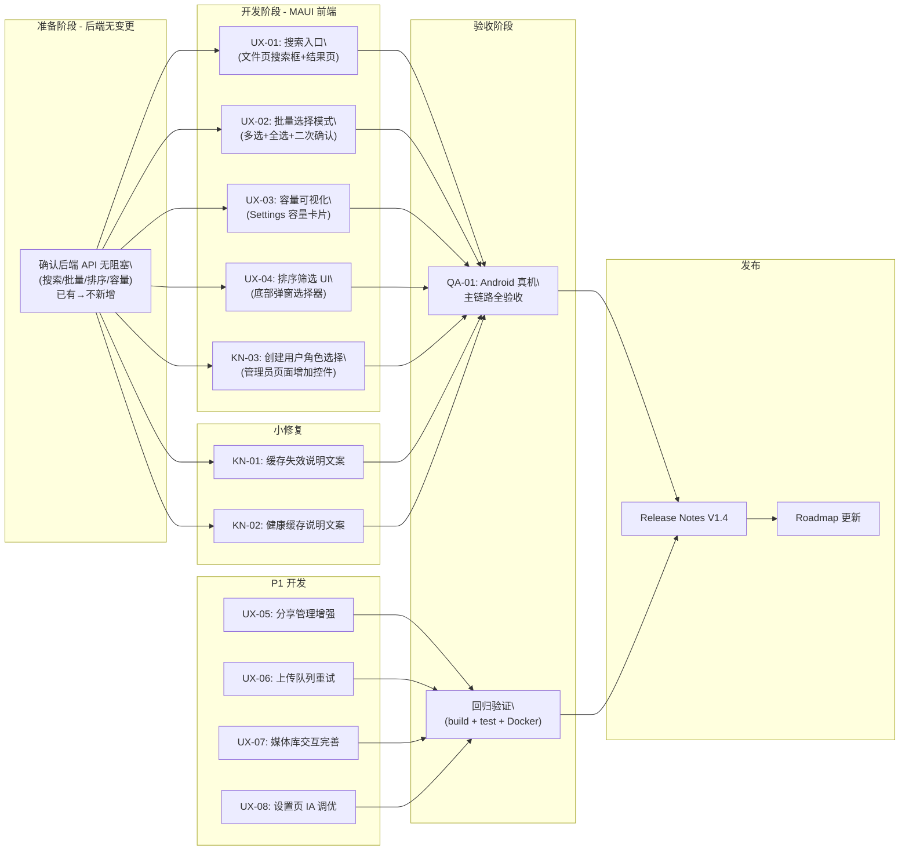

# PrivateCloudDrive V1.4 发布范围定义与验收口径

| 元数据 | 值 |
|--------|-----|
| 文档版本 | 1.0 |
| 日期 | 2026-07-12 |
| 负责人 | 产品总监 (pm) |
| 前置版本 | V1.3b 移动端验收收口维护版 → `docs/release-plan-v1.3b.md` |
| 版本类型 | 体验增强版 / UX Polish & Known Limitations Fix |
| 下一版本 | V2.0（候选，待 V1.4 稳定后重评估） |

---

## 1. 版本认识与定位

### 1.1 为什么是 V1.4

V1.0~V1.3b 所有 326 个看板任务已于 2026-07-12 全部完成，项目已具备：

- ✅ 文件管理主链路（上传/下载/列表/删除/回收站）
- ✅ 媒体库基础体验（图片/视频/缩略图/时间线）
- ✅ 分享能力（创建分享/密码/过期/风险提醒）
- ✅ 管理员能力（用户管理/健康页/备份恢复/操作日志）
- ✅ 移动端 6 页设置 IA 验收闭环

但当前产品仍有以下缺口：

| 缺口 | 影响 | 来源 |
|------|------|------|
| 搜索入口缺失 | 用户无法快速找到文件 | V1.1 搜索 API 已完成但前端未闭环 |
| 批量操作体验不完整 | 删除/恢复多个文件需逐个操作 | V1.1 批量后端已完成但前端未闭环 |
| 容量信息不可见 | 用户不知道已用空间和配额 | 后端容量接口存在但前端未集成 |
| 排序/筛选 UX 缺失 | 文件列表只有默认排序 | V1.1 排序筛选后端已完成 |
| 15 条已知限制中多条影响日常使用 | 用户可能遇到问题无规避指引 | known-limitations.md |
| V1.3 G3 移动端真机验收未完成 | 发布残留 WARN | V1.3 release gate 遗留项 |

V1.4 的目标是：**补齐这些体验缺口，把"能用"变成"好用"**，同时不引入新的后端架构变更。

### 1.2 本版定位

> V1.4 = 体验增强版，不是新功能版，不是重构版。

核心原则：
- **不改后端架构**：不新增数据库表、不新增业务实体、不改变认证流。
- **不改已有 API 契约**：复用现有 API 接口，只补充前端调用的缺失部分。
- **不改部署方式**：不改变 Docker / .env / 存储路径 / OSS 配置结构。
- **不改已有 UI 信息架构**：在现有页面结构上补充控件和交互，不重建页面导航。

### 1.3 本版明确不做

| ⛔ 不做 | 原因 |
|---------|------|
| 多用户/家庭空间（V2.0 候选） | 架构影响大，需 V1.4 稳定后评估 |
| AI 搜索/智能相册 | 属于 V2.0 候选 |
| 桌面同步客户端 | 数据一致性成本高 |
| iOS 支持 | 平台覆盖不成熟 |
| 后端架构重构（DB/存储/认证） | 当前架构无阻塞问题 |
| Web/Blazor 管理后台 | 属于 V2.0 候选 |
| HLS 转码/低清预览 | 属于 V2.0 候选 |
| 外部登录（微信/Google/GitHub）真机关闭环 | 已有降级策略，非当前重点 |

---

## 2. 范围概述

### 2.1 当前基线能力（V1.0~V1.3b 已交付）

| 模块 | 状态 | 备注 |
|------|:----:|------|
| 账号密码登录/刷新/退出/限流 | ✅ | 主链路稳定 |
| 文件列表/上传/下载/Range/删除/恢复/永久删除 | ✅ | 主链路稳定 |
| 回收站（占用空间+清理建议+批量清空） | ✅ | V1.3b 已验收 |
| 图片缩略图/视频封面/视频播放 | ✅ | 基础体验正常 |
| 图片时间线/视频列表增强 | ✅ | V1.2 已交付 |
| 创建分享/密码分享/下载限制 | ✅ | 基础功能正常 |
| 搜索 API（ILIKE + 当前用户隔离） | ✅ | 后端已验证，前端待集成 |
| 排序/筛选 API（名称/时间/大小/类型/收藏/标签） | ✅ | 后端已验证，前端待集成 |
| 批量操作 API（BatchFileNodeInput，100 限制） | ✅ | 后端已验证，前端待集成 |
| 容量 API（StorageUsageDto：used/quota/available/maxSingleFileSize） | ✅ | 后端已验证，前端待集成 |
| 管理员用户管理（创建/禁用/角色/容量配额） | ✅ | V1.3 已交付 |
| 系统健康页（DB/Redis/Storage/FFmpeg/版本） | ✅ | V1.3 已交付 |
| 备份恢复指南+脚本 | ✅ | 4 次演练全部 PASS |
| 操作日志增强筛选 API | ✅ | V1.3 已交付 |
| 存储配置页（只读展示） | ✅ | V1.3 已交付 |
| 媒体任务管理 | ✅ | V1.3 已交付 |
| 故障诊断页（静态 6 类排障） | ✅ | V1.3b 已验收 |
| 分享风险页 | ✅ | V1.3b 已修复并验收 |
| Settings 管理员面板 8 项 IA | ✅ | V1.3b 已验收 |
| known-limitations.md（15 条） | ✅ | V1.3b 已同步 |
| secret scan + 依赖安全基線 | ✅ | V1.3 release gate PASS |

### 2.2 V1.4 范围

| # | 模块 | 当前状态 | V1.4 动作 | 优先级 |
|---|------|---------|-----------|--------|
| UX-01 | 搜索前端体验 | 搜索 API 存在但 MAUI 无搜索入口 | 文件页顶部搜索框 + 搜索结果页 + 空状态 | **P0** |
| UX-02 | 批量操作前端体验 | 批量 API 存在但 MAUI 无多选模式 | 多选模式 + 全选 + 批量删除/恢复/永久删除 + 二次确认 | **P0** |
| UX-03 | 容量可视化前端集成 | 容量 API 存在但 Settings 无展示 | Settings 容量卡片 + 上传超限提示 | **P0** |
| UX-04 | 排序/筛选前端 UI | 排序筛选 API 存在但 MAUI 无交互 | 文件页底部弹窗切换排序方向 + 筛选条件 | **P0** |
| UX-05 | 分享管理增强 | 分享列表 API 需确认，前端无管理入口 | 我的分享列表 + 复制链接 + 取消分享 + 密码状态 | P1 |
| UX-06 | 上传队列重试/取消 | 上传中可取消需验证，失败重试需实现 | 上传页单个任务操作：重试/取消/清除 | P1 |
| UX-07 | 媒体库交互完善 | 时间线交互待增强，处理失败重试入口待加 | 列表信息补充 + 失败重试控件 | P1 |
| UX-08 | 设置页 IA 最终调优 | 管理员/普通用户入口已分离，路径一致性待检 | 多角色验收 + 操作路径一致性修复 | P1 |

| # | 模块 | 当前状态 | V1.4 动作 | 优先级 |
|---|------|---------|-----------|--------|
| KN-01 | 禁用用户 access_token 缓存 5 分钟（KN-V1.3-01） | 后台行为，前端可增加说明 | Settings 或管理面板增加缓存失效提示 | **P0** |
| KN-02 | 健康检测 30 秒缓存（KN-V1.3-02） | 用户可感知，需前端提示 | 健康页增加"数据缓存30秒"说明文案 | **P0** |
| KN-03 | 创建用户无法通过 UI 分配角色（KN-V1.3-06） | 管理效率影响 | 管理员用户创建页增加角色选择器 | **P0** |
| KN-04 | 故障诊断页静态内容不动态（KN-V1.3-08） | P1，当前静态覆盖可接受 | 记录到技术债务基线，V1.4 不做 | P1 |
| KN-05 | 管理端仅限 MAUI+Swagger（KN-V1.3-09） | 属于 V2.0 Web 管理后台 | 记录到技术债务基线，V1.4 不做 | P1 |
| KN-06 | V1.3b UI 验收无自动化框架（KN-V1.3b-02） | 验收效率问题 | 评估 MAUI UI 自动化框架可行性 | P1 |
| KN-07 | known-limitations.md 人工同步（KN-V1.3b-03） | 文档一致性 | 设计同步检查清单或脚本 | P1 |

| # | 模块 | 当前状态 | V1.4 动作 | 优先级 |
|---|------|---------|-----------|--------|
| QA-01 | Android 真机主链路验收 | 仅模拟器验收，G3 WARN | 真实 Android 设备完成全链路验收记录 | **P0** |
| QA-02 | 回归测试 | V1.3b 后无全量回归 | 后端 237 测试 + MAUI 构建 + Docker 栈验证 | P1 |
| QA-03 | 搜索+批量+排序排序筛选集成测试 | 后端 API 已测试，前端待验收 | 前端联调验收记录 | P1 |

---

## 3. P0 范围详解

### UX-01：搜索前端体验闭环

**当前问题**：搜索 API 已存在（`GET /api/file-center/files/search?keyword=xxx`，PostgreSQL ILIKE + 当前用户隔离），但 MAUI 客户端无搜索入口。用户只能通过文件夹浏览找到文件。

**影响范围**：
- `maui/PrivateCloudDrive.App/Pages/FilesPage.xaml` — 增加搜索栏
- `maui/PrivateCloudDrive.App/ViewModels/FilesPageViewModel.cs` — 绑定搜索逻辑
- 可能新增 `SearchResultsPage.xaml` 独立搜索结果页
- 或复用当前文件列表，通过搜索触发刷新

**验收标准**：

| AC | 描述 | 验证方式 |
|----|------|---------|
| AC-UX01-A | 文件页顶部有搜索图标或搜索框入口 | 模拟器截图 |
| AC-UX01-B | 输入关键词后触发搜索请求，返回文件/文件夹列表 | 网络请求日志 + 页面显示结果 |
| AC-UX01-C | 搜索结果分页正确，支持下拉加载更多 | 多关键词测试 |
| AC-UX01-D | 搜索结果不包含其他用户文件（跨用户隔离） | 多用户测试 |
| AC-UX01-E | 空结果有明确"未找到匹配文件"状态 | 模拟器截图 |
| AC-UX01-F | 清除搜索后恢复默认文件列表 | 交互测试 |
| AC-UX01-G | 搜索状态下退回到文件列表不丢失状态 | 交互测试 |
| AC-UX01-H | 编译通过（`dotnet build -f net10.0-android`） | 构建日志 |

### UX-02：批量操作 MAUI 体验

**当前问题**：后端批量删除/恢复/永久删除 API 已存在（`BatchFileNodeInput`，每次最多 100 个），但 MAUI 前端没有多选模式入口。用户只能逐个文件操作。

**影响范围**：
- `maui/PrivateCloudDrive.App/Pages/FilesPage.xaml` — 增加多选模式切换
- `maui/PrivateCloudDrive.App/ViewModels/FilesPageViewModel.cs` — 多选状态管理
- 批量操作触发二次确认弹窗
- 批量操作进度反馈

**验收标准**：

| AC | 描述 | 验证方式 |
|----|------|---------|
| AC-UX02-A | 文件页有进入多选模式的入口（长按或顶部按钮） | 模拟器截图 |
| AC-UX02-B | 多选模式下每个文件项显示复选框 | 模拟器截图 |
| AC-UX02-C | 支持全选（Select All） | 模拟器截图 |
| AC-UX02-D | 多选模式下底部操作栏显示：删除/恢复/永久删除 | 模拟器截图 |
| AC-UX02-E | 批量删除操作有二次确认弹窗（"确定删除 X 个文件？"） | 模拟器截图 |
| AC-UX02-F | 批量永久删除有更强警告（"此操作不可恢复"） | 模拟器截图 |
| AC-UX02-G | 批量操作有进度反馈（加载指示器或 toast） | 交互测试 |
| AC-UX02-H | 批量操作完成后自动退出多选模式 | 交互测试 |
| AC-UX02-I | 批量选择数在操作栏上实时显示 | 模拟器截图 |
| AC-UX02-J | 编译通过 | 构建日志 |

### UX-03：容量可视化

**当前问题**：后端容量 API `StorageUsageDto`（used/quota/available/maxSingleFileSize）已存在，但 MAUI 前端未集成展示。用户不知道当前已用容量和配额。

**影响范围**：
- `maui/PrivateCloudDrive.App/Pages/SettingsPage.xaml` — 增加容量卡片区域
- `maui/PrivateCloudDrive.App/ViewModels/SettingsViewModel.cs` — 调用容量 API
- 上传前检查容量，超限时提示"容量不足"

**验收标准**：

| AC | 描述 | 验证方式 |
|----|------|---------|
| AC-UX03-A | Settings 页面展示"已用容量 / 总容量"信息 | 模拟器截图 |
| AC-UX03-B | 容量信息以进度条+文字方式展示 | 模拟器截图 |
| AC-UX03-C | 显示可用空间和单文件大小限制 | 模拟器截图 |
| AC-UX03-D | 上传超过配额时提示"存储空间不足" | 上传测试 |
| AC-UX03-E | 容量数据定期刷新或页面加载时刷新 | 交互测试 |
| AC-UX03-F | 编译通过 | 构建日志 |

### UX-04：排序与筛选 UI

**当前问题**：后端排序/筛选 API 已存在（`GetFolderChildrenInput` 支持 `Sorting` 和筛选参数），但 MAUI 前端无排序切换和筛选条件选择交互。

**影响范围**：
- `maui/PrivateCloudDrive.App/Pages/FilesPage.xaml` — 增加排序/筛选弹窗入口
- `maui/PrivateCloudDrive.App/ViewModels/FilesPageViewModel.cs` — 排序/筛选状态管理
- 新增底部弹出式选择器（Sort & Filter Bottom Sheet）

**验收标准**：

| AC | 描述 | 验证方式 |
|----|------|---------|
| AC-UX04-A | 文件页有排序切换入口（底部弹窗或顶部按钮） | 模拟器截图 |
| AC-UX04-B | 排序选项包含：名称A→Z、名称Z→A、时间最新→最旧、时间最旧→最新、大小大→小、大小小→大、类型分组 | 交互测试 |
| AC-UX04-C | 筛选选项包含：全部文件、仅文件、仅文件夹、收藏、我的标签 | 交互测试 |
| AC-UX04-D | 当前排序/筛选条件在文件页有可视化指示 | 模拟器截图 |
| AC-UX04-E | 切换排序/筛选后列表数据正确刷新 | 多条件组合测试 |
| AC-UX04-F | 排序/筛选不触发额外加载延迟（UI 响应 < 500ms） | 交互感受测试 |
| AC-UX04-G | 排序/筛选状态在页面切换后不丢失 | 交互测试 |
| AC-UX04-H | 编译通过 | 构建日志 |

### KN-01~03：已知限制修复

**KN-01：access_token 缓存失效说明（KN-V1.3-01）**

| AC | 描述 |
|----|------|
| AC-KN01-A | 管理员用户禁用页面增加提示："禁用后最长 5 分钟生效" |
| AC-KN01-B | 提示文案清晰可读，非开发者能理解 |

**KN-02：健康检测缓存说明（KN-V1.3-02）**

| AC | 描述 |
|----|------|
| AC-KN02-A | 健康页增加文案："数据缓存 30 秒，刷新以获取最新状态" |
| AC-KN02-B | 用户可理解为何健康页状态不实时 |

**KN-03：创建用户角色分配 UI（KN-V1.3-06）**

| AC | 描述 |
|----|------|
| AC-KN03-A | 管理员创建用户页面增加角色选择器（管理员/普通用户） |
| AC-KN03-B | 角色选择器默认值为"普通用户" |
| AC-KN03-C | 角色分配调用后端 `/api/app/admin/users/{id}/roles` API |
| AC-KN03-D | 新建用户时可直接分配角色，无需后续 Swagger 操作 |

### QA-01：Android 真机主链路验收

**当前问题**：V1.3 release gate 的 G3 为 WARN，原因是移动端验收仅通过模拟器截图完成，无真实 Android 设备验收记录。

**验收范围**：

| # | 验收项 | 期望结果 | 验证方式 |
|---|--------|---------|---------|
| QA-01-A | 登录（账号密码） | 输入正确凭据后登录成功 | 真机操作 |
| QA-01-B | token 续期 | 关闭 App 再打开后不需重新登录 | 真机操作 |
| QA-01-C | 文件列表浏览 | 目录结构正确，滚动流畅 | 真机操作 |
| QA-01-D | 小文件上传（<10MB） | 上传成功后列表刷新 | 真机操作 |
| QA-01-E | 大文件上传（>100MB，分片） | 分片上传完成，文件完整 | 真机操作 |
| QA-01-F | 文件下载 | 下载到本地后可打开 | 真机操作 |
| QA-01-G | 图片预览 | 缩略图加载，点击后全屏预览 | 真机操作 |
| QA-01-H | 视频播放 | 封面显示，点击后播放（HTTP Range） | 真机操作 |
| QA-01-I | 删除到回收站 | 删除后文件出现在回收站 | 真机操作 |
| QA-01-J | 从回收站恢复 | 恢复后文件回到原目录 | 真机操作 |
| QA-01-K | 永久删除 | 文件从回收站彻底删除 | 真机操作 |
| QA-01-L | 创建分享 | 生成分享链接可被浏览器访问 | 真机操作 |
| QA-01-M | 密码分享 | 输入密码后才可访问分享内容 | 真机操作 |
| QA-01-N | 图片时间线 | 按月份/日期分组浏览 | 真机操作 |
| QA-01-O | 视频列表 | 时长、分辨率、封面显示 | 真机操作 |
| QA-01-P | 设置页各面板入口 | 管理员 8 项面板可访问 | 真机操作 |
| QA-01-Q | 系统健康页 | 各组件状态正确 | 真机操作 |
| QA-01-R | 分享风险页 | 计数正常，文案不恐慌 | 真机操作 |
| QA-01-S | 故障诊断页 | 6 个展开区可操作 | 真机操作 |

**通过标准**：QA-01-A~S **全部 PASS**，G3 从 WARN 升级为 PASS。

---

## 4. P1 范围详解

### UX-05：分享管理增强

**验收标准**：

| AC | 描述 |
|----|------|
| AC-UX05-A | Settings 或文件详情中有"我的分享"管理入口 |
| AC-UX05-B | 分享列表显示：文件名、创建时间、过期时间、访问次数、密码状态 |
| AC-UX05-C | 可复制分享链接到剪贴板 |
| AC-UX05-D | 可取消单个分享（取消后链接失效） |
| AC-UX05-E | 可调整分享密码和过期时间（API 支持情况下） |
| AC-UX05-F | 分享管理不影响文件所有者对文件的正常访问 |

### UX-06：上传队列重试/取消

**验收标准**：

| AC | 描述 |
|----|------|
| AC-UX06-A | 上传中可看到每个文件的上传进度（百分比或分片数） |
| AC-UX06-B | 上传中可取消单个上传任务 |
| AC-UX06-C | 上传失败时显示错误原因（"网络不可用"、"文件过大"等可读信息） |
| AC-UX06-D | 上传失败的文件显示"重试"按钮 |
| AC-UX06-E | 重试后从断点继续（分片上传场景）或从头开始 |
| AC-UX06-F | 上传队列不阻塞用户浏览其他页面（后台上传） |

### UX-07：媒体库交互完善

**验收标准**：

| AC | 描述 |
|----|------|
| AC-UX07-A | 图片时间线页可按月份快速跳转 |
| AC-UX07-B | 视频列表显示时长、分辨率、文件大小、封面 |
| AC-UX07-C | 媒体处理失败的状态可在媒体库内看到（非仅后台） |
| AC-UX07-D | 处理失败的媒体项显示"重新处理"按钮 |
| AC-UX07-E | 重新处理成功后状态自动更新 |

### UX-08：设置页 IA 最终调优

**验收标准**：

| AC | 描述 |
|----|------|
| AC-UX08-A | 管理员登录后看到完整管理面板（1 系统健康 / 2 用户管理 / 3 存储配置 / 4 操作日志 / 5 媒体任务 / 6 故障诊断 / 7 分享风险 / 8 回收站） |
| AC-UX08-B | 普通用户登录后看不到管理面板项 |
| AC-UX08-C | 每个管理面板项的入口名称和图标符合用户预期 |
| AC-UX08-D | 从 Settings 进入各管理页后，返回按钮正确回到 Settings |
| AC-UX08-E | 没有断链或死链入口 |

---

## 5. 明确不做

| ⛔ 不做 | 原因 |
|---------|------|
| 多用户/家庭空间 | V2.0 候选，架构影响大 |
| AI 搜索/智能相册 | V2.0 候选 |
| 桌面同步客户端 | 数据一致性复杂度高 |
| iOS 支持 | 平台覆盖待成熟 |
| 后端架构重构 | 当前架构无阻塞问题 |
| Web/Blazor 管理后台 | V2.0 候选 |
| HLS 转码/低清预览 | V2.0 候选 |
| 外部登录真机关闭环 | 已有降级策略，非当前重点 |
| NuGet 包版本冲突 | 不影响编译通过，已登记风险接受 |

---

## 6. 依赖顺序



### 6.1 推荐发布阶段

| 阶段 | 内容 | 负责人 | 交付物 | 状态 |
|------|------|--------|--------|------|
| **阶段 1：P0 前端开发** | UX-01~04 + KN-01~03：搜索/批量/容量/排序/小修复 | mobile-eng | 相应 MAUI 页面修改 | 🔲 |
| **阶段 2：P1 前端开发** | UX-05~08：分享/上传/媒体/设置 | mobile-eng | 相应 MAUI 页面修改 | 🔲 |
| **阶段 3：真机验收** | QA-01：Android 真机 19 项主链路验收 | qa-eng | 真机验收记录 PASS/WARN/FAIL | 🔲 |
| **阶段 4：回归验证** | 后端 build + test + MAUI 构建 + Docker 栈 | backend-eng + devops-eng | 验证通过报告 | 🔲 |
| **阶段 5：发布闭包** | Release Notes + Roadmap 同步 | pm | 发布归档 | 🔲 |

---

## 7. 团队指派

| 岗位 | Profile | 事项 | 优先级 | 交付物 |
|------|---------|------|--------|--------|
| **莫移动** | mobile-eng | UX-01~04: P0 MAUI 前端开发（搜索/批量/容量/排序筛选） | P0 | MAUI 页面修改 PR |
| **莫移动** | mobile-eng | KN-03: 创建用户角色选择器 | P0 | 管理员用户管理页面修改 PR |
| **莫移动** | mobile-eng | UX-05~08: P1 MAUI 前端开发（分享/上传/媒体/设置） | P1 | MAUI 页面修改 PR |
| **齐 QA** | qa-eng | QA-01: Android 真机 19 项主链路验收 + 截图证据 | P0 | 真机验收记录 + screenshots |
| **包后端** | backend-eng | 阶段 4: 后端回归验证 + API 确认无阻塞 | P1 | dotnet build + test 通过 |
| **德运维** | devops-eng | 阶段 4: Docker 栈回归验证 | P1 | verify-local-stack 通过 |
| **产品总监** | pm | 阶段 5: 发布闭包 + Roadmap + Release Notes | P0 | 发布归档 + 文档更新 |

---

## 8. 发布闸门

| 闸门 | 标准 | 对应项 |
|------|------|--------|
| G0 范围冻结 | 只做本文档 §2.2 范围内体验增强，不新增后端 API 或架构变更 | 本文档 §2.2 |
| G1 MAUI 编译 | `dotnet build -f net10.0-android` 通过 | UX-01~08 修改后 |
| G2 后端回归 | `dotnet build` + `dotnet test` 后端全部通过（>=237 pass） | 阶段 4 |
| G3 Docker 栈 | `scripts/verify-local-stack` 无阻塞 FAIL | 阶段 4 |
| G4 真机验收 | Android 真机 19 项主链路全部 PASS | QA-01 |
| G5 搜索隔离 | 搜索结果不跨用户泄露文件 | AC-UX01-D |
| G6 安全脱敏 | secret scan 0 findings | V1.3 基線维持 |
| G7 文档完整 | Release Notes + known-limitations 同步 + Roadmap 更新 | 阶段 5 |

### 放行标准

```
P0 = 0 阻断缺陷
P1 = 0 缺陷，或每个 P1 有明确规避方案
真机验收记录存入 docs/validation/screenshots/v1.4/
验收记录合并到 docs/testing.md
```

---

## 9. 技术债务基线（V1.4 不处理）

以下项记录为技术债务基线，不再阻塞 V1.4 发布：

| 编号 | 债务 | 影响 | 目标版本 |
|:----:|------|------|:--------:|
| TD-01 | MAUI UI 无自动化验收框架 | 验收回归成本高 | V1.5/V2.0 |
| TD-02 | known-limitations.md 人工同步 | 文档一致性无法自动保证 | V1.5 |
| TD-03 | 管理端仅 MAUI Settings+Swagger | 操作平台受限 | V2.0 |
| TD-04 | 搜索使用 PostgreSQL ILIKE 无全文索引 | 大数据集性能可能下降 | V1.5 |
| TD-05 | ABP 测试项目仍使用 10.3.0 | 生产项目已升级至 10.5.0 | V1.5 |
| TD-06 | 故障诊断页为静态内容 | 诊断准确性受限 | V1.5 |

---

*本文档由 Hermes 产品总监 (pm) 基于 V1.3b 完成后的产品现状分析生成。*
