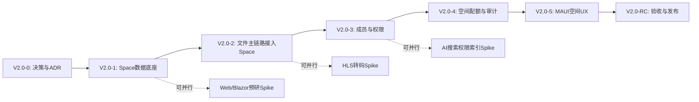

# PrivateCloudDrive V2.0 发布范围定义与验收口径

> **文档版本**：v1.0  
> **日期**：2026-07-14  
> **负责人**：Hermes-PM（pm）  
> **参考输入**：`docs/v2.0-pre-study.md`、`docs/product-roadmap-next.md` §4.6、`docs/release-gate-v1.4-assessment.md`  
> **目标产出**：本文件 — V2.0 MVP 范围、优先级、依赖、工作量、验收口径、启动条件

---

## 目录

1. [产品方向定义](#1-产品方向定义)
2. [MVP 范围](#2-mvp-范围)
3. [P0/P1/P2 优先级划分](#3-p0p1p2-优先级划分)
4. [明确不做范围](#4-明确不做范围)
5. [P0 验收标准与推荐 Assignee](#5-p0-验收标准与推荐-assignee)
6. [依赖关系图](#6-依赖关系图)
7. [启动条件](#7-启动条件)
8. [工作量评估与批次建议](#8-工作量评估与批次建议)
9. [附录：验收门禁矩阵](#9-附录验收门禁矩阵)

---

## 1. 产品方向定义

### 1.1 一句话定位

> **V2.0 = 从个人 OwnerId 云盘升级为 Space（空间）云盘的架构版本。**

V2.0 不是"所有 V1.x 没做的功能合集"，而是把 PrivateCloudDrive 从"一个人独有"的产品形态升级为"家庭/小团队共享"形态。

### 1.2 核心方向变化

| 维度 | V1.x（当前） | V2.0（目标） |
|------|-------------|-------------|
| 数据隔离边界 | `TenantId + OwnerId` | `TenantId + SpaceId + 权限裁剪` |
| 用户角色 | 普通用户 / 管理员 | Owner / Admin / Member / Viewer（空间内） |
| 容量归属 | 用户级配额 | 用户级配额 + 空间级独立配额 |
| 文件共享 | 公开外链分享 | 公开外链 + 空间内成员自动可见/可写 |
| 搜索范围 | 当前用户文件 | 当前用户在可见空间内的文件 |
| 产品形态 | 个人私有云盘 | 家庭/小团队私有云盘中心 |

### 1.3 前置条件已满足

根据 `docs/release-gate-v1.4-assessment.md` 门禁结论：

| 前置条件 | 状态 | 证据 |
|---------|:----:|------|
| V1.4 已正式发布 | ✅ **已完成** | 8 道闸门全部 PASS/WARN，无 BLOCKER |
| G1 MAUI 编译阻塞清零 | ✅ **已完成** | PR #88 已合并，`dotnet build -f net10.0-android` 0 errors |
| V1.4 后端测试全绿 | ✅ **已完成** | 270 passed, 0 failed |
| V1.4 真机验收 | ✅ **有条件 PASS** | 19 项中 17 PASS + 2 WARN |

> ⚠️ **但 V2.0 仍需要用户明确授权**（见第 7 节）。

---

## 2. MVP 范围

基于 `docs/v2.0-pre-study.md` 架构预研结论，V2.0 MVP 定义为：

### 2.1 空间模型（Space Model）

| 功能 | 说明 | 前置依赖 |
|------|------|---------|
| 默认个人空间 | 每个用户注册时自动创建个人默认空间 | 无 |
| 家庭/团队空间 | 用户可创建额外空间（名称、描述、头像可选） | Space 实体 |
| 空间列表 | 用户可查看自己所属的全部空间 | SpaceMember |
| 空间停用/删除 | 空间创建者可删除空间（MVP 使用硬删除，数据不可恢复；V2.x 候选软删除+30天保留） | 成员管理 |

### 2.2 成员管理（Space Member）

| 功能 | 说明 | 前置依赖 |
|------|------|---------|
| 添加成员 | 空间创建者/管理员可添加其他用户入空间 | 空间模型 |
| 移除成员 | 从空间中移除用户 | 成员管理 |
| 角色切换 | 在空间中修改成员角色 | 角色模型 |
| 成员禁用 | 临时禁止某成员访问空间 | 成员管理 |

### 2.3 角色权限（Space Role / Permission）

| 角色 | 文件查看 | 文件上传/编辑 | 文件删除 | 成员管理 | 空间配置 |
|------|:--------:|:------------:|:--------:|:--------:|:--------:|
| **Owner** | ✅ | ✅ | ✅ | ✅ | ✅ |
| **Admin** | ✅ | ✅ | ✅ | ✅ | ❌ |
| **Member** | ✅ | ✅ | ❌ | ❌ | ❌ |
| **Viewer** | ✅ | ❌ | ❌ | ❌ | ❌ |

### 2.4 文件主链路接入 Space

| 功能 | 当前 OwnerId 模式 | V2.0 空间模式 |
|------|------------------|--------------|
| 文件列表 | `Where(OwnerId == currentUser)` | `Where(SpaceId IN accessibleSpaces) AND 权限校验` |
| 上传 | `OwnerId = currentUser` | `SpaceId = targetSpace` AND `角色 >= Member` |
| 下载 | `OwnerId == currentUser` | `SpaceId IN accessibleSpaces` AND `角色 >= Viewer` |
| 删除/恢复 | `OwnerId == currentUser` | `SpaceId IN accessibleSpaces` AND `角色 >= Member` |
| 永久删除 | `OwnerId == currentUser` | `SpaceId IN accessibleSpaces` AND `角色 >= Admin` |
| 移动/重命名 | `OwnerId == currentUser` | `SpaceId IN accessibleSpaces` AND `角色 >= Member` |
| 回收站 | `OwnerId == currentUser` | `SpaceId IN accessibleSpaces` AND 按角色过滤 |

### 2.5 空间级配额（Space Quota）

| 功能 | 说明 |
|------|------|
| 空间配额设置 | 空间 Owner 可设置空间总容量上限 |
| 空间用量汇总 | 统计空间内所有文件占用的存储量 |
| 上传前校验 | 上传前检查空间可用容量，超限拒绝 |
| 空间用量可视化 | MAUI 空间设置页展示用占比/剩余 |

### 2.6 审计升级（Audit）

| 功能 | 说明 |
|------|------|
| 操作日志增加 SpaceId | 每条操作日志记录 SpaceId |
| 记录操作者角色 | 记录操作者在空间内的角色 |
| 日志按空间筛选 | 管理员可查看指定空间的审计日志 |

### 2.7 关联模块归属升级

| 模块 | 当前 | V2.0 变更 |
|------|------|----------|
| `FileNode` | `TenantId + OwnerId` | 增加 `SpaceId`（可为空，向下兼容） |
| `BlobObject` | `OwnerId` | 增加 `SpaceId` |
| `UploadSession` | `OwnerId` | 增加 `SpaceId` |
| `MediaAsset` | `OwnerId` | 增加 `SpaceId` |
| `MediaAlbum` | `OwnerId` | 增加 `SpaceId` |
| `FileShare` | `OwnerId` | 增加 `SpaceId` |
| `FileTag` | `OwnerId` | 增加 `SpaceId` |

### 2.8 MAUI 前端最小空间 UX

| 功能 | 说明 |
|------|------|
| 空间选择器 | 文件页顶部显示当前空间名称，点击可切换空间 |
| 空间设置页 | 空间名称/描述编辑、空间配额查看 |
| 成员管理页 | 成员列表、添加、移除、角色变更 |
| 权限不足提示 | 无权限操作时弹窗提示原因 |

---

## 3. P0/P1/P2 优先级划分

### 3.1 P0 — 必做（阻塞发布）

| ID | 项 | 影响 |
|:--:|----|------|
| SP-01 | Space/SpaceMember/SpaceRole 领域实体 + DB schema | 无此实体无法表达空间边界 |
| SP-02 | 默认个人空间迁移 + DbMigrator dry-run | 现有数据必须安全迁入个人空间 |
| SP-03 | FileNode 增加 SpaceId + 仓储查询升级 | 文件主链路的空间归属基础 |
| SP-04 | BlobObject/UploadSession 增加 SpaceId | 存储层与上传层归属升级 |
| SP-05 | MediaAsset/MediaAlbum 增加 SpaceId | 媒体库的空间归属 |
| SP-06 | FileShare/FileTag 增加 SpaceId | 分享与标签的空间归属 |
| SP-07 | 空间成员管理（添加/移除/角色切换/禁用） | 空间底座交互的核心功能 |
| SP-08 | 空间内文件列表/上传/下载/删除/恢复权限校验 | 主链路在空间内的安全闭环 |
| SP-09 | 创建/管理空间（含切换） | 用户 UX 基础 |
| SP-10 | 空间级配额 + 上传前校验 | 空间资源管控 |
| SP-11 | 搜索按空间隔离 + 权限裁剪 | 搜索结果不泄露 |
| SP-12 | 操作日志增加 SpaceId + 操作者 | 审计闭环 |
| SP-13 | 迁移演练 + 回滚方案 | 数据安全防线 |
| SP-14 | MAUI 空间切换 UX + 空间设置 + 成员页 | 用户可见的前端空间能力 |
| SP-15 | 多用户多空间权限测试矩阵 + 安全审计 | 防止越权 |

### 3.2 P1 — 应该做（不阻塞发布，但建议 V2.0 内完成）

| ID | 项 | 说明 |
|:--:|----|------|
| SP-16 | 空间邀请链接（内部邀请码/链接） | 替代手动添加用户名，提升 UX |
| SP-17 | 空间头像/图标设置 | 空间列表可视化区分 |
| SP-18 | 空间内回收站按空间隔离 | 当前回收站按 OwnerId，需升级 |
| SP-19 | 媒体相册按 SpaceId 隔离展示 | 相册列表不跨空间 |
| SP-20 | 空间用量可视化（MAUI 图表） | 折线图/饼图展示空间使用趋势 |
| SP-21 | 空间级日志查看（MAUI 设置页） | 管理员可查看空间操作日志 |
| SP-22 | API 兼容层 + 版本协商 | 旧版 MAUI 客户端仍可用（默认个人空间） |

### 3.3 P2 — 后续做（不进 V2.0 首批）

| ID | 项 | 建议版本 |
|:--:|----|:--------:|
| SP-23 | 跨空间复制/移动文件 | V2.1 |
| SP-24 | 空间模板（预设角色和配额） | V2.1 |
| SP-25 | 空间成员活动日志 | V2.1 |
| SP-26 | 空间自定义权限矩阵（细粒度 ACL） | V2.2 |
| SP-27 | 空间快捷键/空间书签 | V2.2 |
| SP-28 | 空间批量操作（批量添加/移除成员） | V2.2 |

---

## 4. 明确不做范围

以下能力 **不进 V2.0 MVP**，并明确理由：

| 能力 | 不进 V2.0 的理由 | 建议路线 |
|------|-----------------|---------|
| ⛔ **AI 语义搜索 / 智能相册** | 依赖 embedding 服务、OCR/人脸模型、权限裁剪索引，与空间底座无直接依赖但工程量过大 | V2.1+ 或独立能力线 |
| ⛔ **桌面同步客户端** | 需要文件变更日志、冲突处理、客户端状态库，完全独立产品 | V3.0 候选 |
| ⛔ **iOS 正式发布** | 证书、推送、平台差异未验证；MAUI 当前在 Android/Windows 基线 | iOS 技术预研可在 V2.0 末期并行 |
| ⛔ **完整 Web/Blazor 管理后台** | 完整后台替代 MAUI Settings 是另一产品线；可按空间观察预研 | V2.0-4 后可做 Spike |
| ⛔ **HLS 转码 / 低清预览** | 转码队列、存储膨胀、码率策略与空间底座无关 | V2.1+ |
| ⛔ **外部登录全平台关闭环** | 微信/Google/GitHub 凭据配置与空间权限低耦合 | V1.5 或 V2.x 独立增强 |
| ⛔ **复杂组织架构 / 部门 / 审批流** | 产品定位是小团队/家庭，不是企业网盘 | 永不进入路线图 |
| ⛔ **Office 在线协同编辑** | 文档协同需完全独立产品 | 永不进入路线图 |
| ⛔ **任意层级 ACL 编辑器** | V2.0 角色固定矩阵已覆盖 95% 场景 | V2.2 |
| ⛔ **企业级审计报表 / CSV 导出** | V2.0 聚焦空间基础，不做大报表 | V2.2+ |
| ⛔ **S3/MinIO 多存储后端切换** | 存储抽象层是独立架构工作 | V3.0 候选 |

---

## 5. P0 验收标准与推荐 Assignee

每条 P0 须有可验证的验收标准和推荐执行人员。

| P0 ID | 验收标准 | 推荐 Assignee | 估计人天 |
|:-----:|---------|:-------------:|:-------:|
| **SP-01** | `Space`、`SpaceMember`、`SpaceRole` 表迁移成功；C# Entity 可 CRUD；EF 测试通过 | backend-eng | 3–4 |
| **SP-02** | 现有用户数据自动创建 `Default Space`；FileNode/BlobObject/MediaAsset 计数迁移前后一致；dry-run 脚本可回滚 | backend-eng | 3–5 |
| **SP-03** | `FileNode.SpaceId` 非空（默认空间）；仓储查询 `SpaceId IN (...)` + 权限过滤；EF 测试通过 | backend-eng | 2–3 |
| **SP-04** | `BlobObject.SpaceId` + `UploadSession.SpaceId` 迁移成功；上传创建 Session 写入 SpaceId | backend-eng | 1–2 |
| **SP-05** | `MediaAsset.SpaceId` 迁移 + `MediaAlbum.SpaceId` 迁移；媒体查询按 SpaceId 隔离；EF 测试通过 | backend-eng | 2–3 |
| **SP-06** | `FileShare.SpaceId` + `FileTag.SpaceId` 迁移；分享与标签查询按 SpaceId 过滤；EF 测试通过 | backend-eng | 1–2 |
| **SP-07** | MAUI 成员管理页：添加/移除/角色切换/禁用可用；后端测试覆盖 4 种角色 + 权限不足场景 | mobile-eng + backend-eng | 4–6 |
| **SP-08** | Owner/Admin/Member/Viewer 下各主链路操作符合权限矩阵（列表/上传/下载/删除/恢复/永久删除/移动/重命名）；API 参数篡改测试无越权 | backend-eng | 5–8 |
| **SP-09** | MAUI 可创建新空间、查看空间列表、切换空间；默认个人空间可进入；后端 API 测试通过 | mobile-eng + backend-eng | 3–5 |
| **SP-10** | 空间配额设置/用量查询 API 返回正确值；上传超配额被拒绝（HTTP 403）+ 前端提示；EF 测试通过 | backend-eng + mobile-eng | 3–4 |
| **SP-11** | 空间内搜索结果仅返回当前用户在当前空间可见文件；多用户搜索隔离测试 0 泄露 | backend-eng | 2–3 |
| **SP-12** | OperationLog 记录 SpaceId、OperatorUserId、目标文件、空间内角色；管理端可按空间筛选查看 | backend-eng | 2–3 |
| **SP-13** | 测试库 dry-run 通过；迁移脚本支持 `--dry-run`；snapshot 备份可恢复；回滚文档完整 | devops-eng | 3–5 |
| **SP-14** | MAUI Android 构建通过；空间选择器可见可操作；空间设置页与成员页真机运行通过；权限不足时弹窗提示 | mobile-eng | 5–8 |
| **SP-15** | 多用户 x 多空间 x 4 角色测试矩阵全部 PASS；API 参数篡改攻击模拟 0 越权；安全 gate 放行 | qa-eng + security-reviewer | 3–5 |

---

## 6. 依赖关系图

### 6.1 阶段依赖



### 6.2 P0 任务间依赖明细

| 任务 | 依赖 | 可并行？ |
|:----:|------|:-------:|
| SP-01 Space 实体 | 无（起点） | — |
| SP-02 默认空间迁移 | SP-01 | ❌ 必须串行 |
| SP-03 FileNode + SpaceId | SP-01 | ❌ 必须串行 |
| SP-04 BlobObject + SpaceId | SP-01 | ✅ 可与 SP-03 并行 |
| SP-05 MediaAsset + SpaceId | SP-01 | ✅ 可与 SP-03 并行 |
| SP-06 FileShare + SpaceId | SP-01 | ✅ 可与 SP-03 并行 |
| SP-07 成员管理（后端） | SP-01 | ✅ 可与 SP-02/03 并行 |
| SP-07 成员管理（MAUI） | SP-14（MAUI 基建） | ✅ 可与后端并行 |
| SP-08 文件权限校验 | SP-03 | ❌ 必须串行 |
| SP-09 创建/管理空间 | SP-01 + SP-07 | ❌ 必须串行 |
| SP-10 空间配额 | SP-03 | ✅ 可与 SP-08 并行 |
| SP-11 搜索隔离 | SP-03 + SP-08 | ❌ 必须串行 |
| SP-12 审计升级 | SP-03 | ✅ 可与 SP-08 并行 |
| SP-13 迁移演练 | SP-02 完成 | ❌ 必须串行 |
| SP-14 MAUI 空间 UX | SP-07 + SP-08 + SP-09 + SP-10 | ❌ 依赖后端 P0 完成 |
| SP-15 权限测试 | SP-08 + SP-11 | ❌ 依赖后端权限闭环 |

### 6.3 关键路径

**最短关键路径**（串行不可压缩）：

```
SP-01 → SP-03 → SP-08 → SP-11 → SP-15 → V2.0-RC
                ↓
            SP-14 (MAUI 需等 SP-07/08/09/10)
```

---

## 7. 启动条件

### 7.1 V2.0 不早于以下条件启动

| 条件 | 当前状态 | 如何处理 |
|------|:--------:|---------|
| **① 用户明确授权 V2.0 方向** | ⏳ **需用户确认** | 见下方确认清单 |
| ② V1.4 已发布稳定 | ✅ **已完成** | 见门禁评估报告 |
| ③ 现有数据有完整备份 | ⏳ **需用户确认备份策略** | 迁移前必须 dump |
| ④ 测试环境可用 | ⏳ **需用户确认** | 建议 Docker 干净实例 |

### 7.2 用户确认清单

请用户确认以下 5 项决策：

```text
1. 是否同意 V2.0 核心方向 = "家庭/团队空间"，不是 AI 搜索或桌面同步？
2. 是否接受 V2.0 MVP 只做空间底座 + 最小权限，不做复杂企业网盘？
3. 是否接受一次涉及 DB schema + 数据迁移的高风险架构版本？
4. 是否有可用于迁移演练的测试数据环境（Docker 干净实例）？
5. 是否可以授权进入 V2.0-0 决策与 ADR 产出阶段？

如果以上 5 项全部为「是」→ 立即进入 V2.0-0 阶段。
如果有任何一项为「否」或「暂不确定」→ 建议走 V1.5 稳定增强路线（见 V2.0 预研报告 §4.3）。
```

---

## 8. 工作量评估与批次建议

### 8.1 总量概览

| 口径 | 数量 |
|:----|:----:|
| **P0 任务数** | 15 项 |
| **P1 任务数** | 7 项 |
| **P2 任务数** | 6 项 |
| **V2.0 MVP 端到端人天** | **55–85 人天** |
| **Kanban 任务总数（含 P1）** | 55–85 张 |
| **高风险任务** | 约 20–30 张（DB 迁移、权限、安全测试） |
| **推荐最小团队** | backend-eng × 2、mobile-eng × 1、qa-eng × 1、devops-eng × 1、architect × 1、pm × 1 |

> 注意：以上估算不包含 AI 搜索、桌面同步、iOS、完整 Web 后台、HLS、外部登录全平台关闭环。

### 8.2 推荐批次拆分

V2.0 建议拆为 6 个子阶段 + 1 个 RC 验收阶段：

| 阶段 | 内容 | 依赖 | 人天 | 核心风险 |
|:----:|------|:----:|:----:|:--------:|
| **V2.0-0 决策与设计冻结** | ADR × 4（Space、权限、归属升级、迁移策略）+ PRD 完善 | 用户授权 | 3–5 | 设计返工 |
| **V2.0-1 Space 数据底座** | SP-01/02/13 + 测试 + dry-run | V2.0-0 | 8–12 | **DB 迁移高风险** |
| **V2.0-2 文件主链路接入** | SP-03/04/05/06 + 仓储查询升级 | V2.0-1 | 8–14 | 查询性能回归 |
| **V2.0-3 成员与权限** | SP-07/08/11/12 + 权限测试矩阵 | V2.0-1/2 | 10–16 | **越权安全高风险** |
| **V2.0-4 空间配额与审计** | SP-09/10 + 空间管理 API | V2.0-2 | 6–10 | 配额校验一致性 |
| **V2.0-5 MAUI 空间 UX** | SP-14（空间切换/设置/成员页）+ 权限不足提示 | V2.0-2/3/4 | 8–14 | 前端编译 + 真机 |
| **V2.0-RC 验收与发布** | SP-15 全矩阵测试 + 安全审计 + Docker + 文档 | 全部 | 8–12 | 权限泄露 |

### 8.3 可并行事项

| 可并行事项 | 前置要求 | 建议 Assignee |
|-----------|:---------:|:-------------:|
| Web/Blazor 管理后台 Spike | V2.0-0 后 | frontend-eng |
| HLS 转码技术评估 | 不依赖 V2.0 | media-eng / architect |
| AI 搜索权限索引概念验证 | Space 权限模型草案 | architect / backend-eng |
| 外部登录真机闭环 | 与 V2.0 主线低耦合 | mobile-eng |
| MAUI UI 自动化测试 Spike | 任意阶段 | qa-eng / mobile-eng |

---

## 9. 附录：验收门禁矩阵

V2.0 MVP 的验收门禁定义（基于 `docs/v2.0-pre-study.md` §4.6 扩展）：

| 闸门 | 标准 | 对应 P0 | 放行条件 |
|:----:|------|:-------:|:--------:|
| **G0** 范围冻结 | 只做空间底座，不夹带 AI/同步/iOS/HLS/Web 后台 | 全部 | 用户确认范围 |
| **G1** 迁移安全 | 测试库 dry-run PASS；迁移前后数据计数一致或差异可解释 | SP-02/13 | dry-run 报告 |
| **G2** 权限隔离 | 多用户多空间测试 0 越权；API 参数篡改无法访问无权文件 | SP-08/15 | 安全测试报告 |
| **G3** 文件主链路 | 每个角色下列表/上传/下载/删除/恢复/永久删除/移动/重命名符合矩阵 | SP-08 | 端到端测试 PASS |
| **G4** 搜索隔离 | 搜索结果只返回当前用户当前空间可见文件 | SP-11 | 搜索隔离测试 |
| **G5** 媒体隔离 | 图片/视频/相册只展示当前空间可见媒体 | SP-05 | 媒体隔离测试 |
| **G6** 分享安全 | 空间内分享创建/禁用/过期/密码/下载限制仍可用；撤权不影响外链 | SP-06 | 分享安全测试 |
| **G7** 配额 | 空间容量展示准确；上传超空间配额被拒绝并提示 | SP-10 | 配额边界测试 |
| **G8** 审计 | 操作日志记录 SpaceId、操作者、动作、目标资源 | SP-12 | 日志内容检查 |
| **G9** 客户端 | MAUI Android 构建通过；空间切换/成员/设置页真机验收 PASS | SP-14 | 构建 + 真机记录 |
| **G10** 运维 | 备份恢复演练 + 迁移回滚文档 + release notes | SP-13 | 运维文档完整 |

### 放行公式

```text
V2.0 放行条件 = G0(用户授权) + G1~G10 全部 PASS
P0 阻断缺陷 = 0
P1 缺陷 = 0 或每项有明确规避方案
```

---

*本文档由 Hermes-PM 产出。待用户授权后，进入 V2.0-0 阶段创建 ADR 和子阶段 Kanban 任务。*
