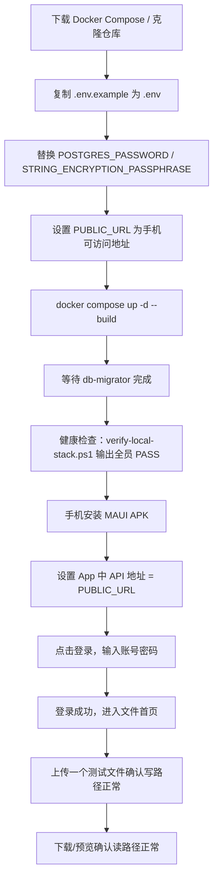
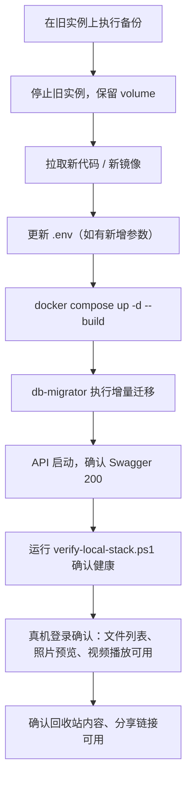
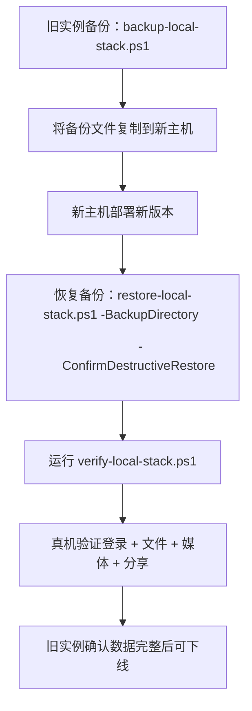
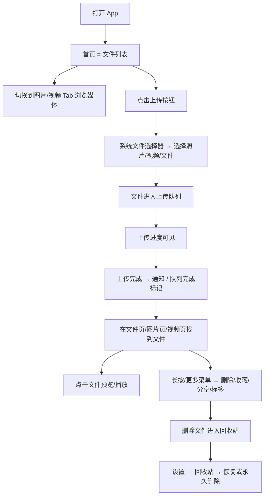
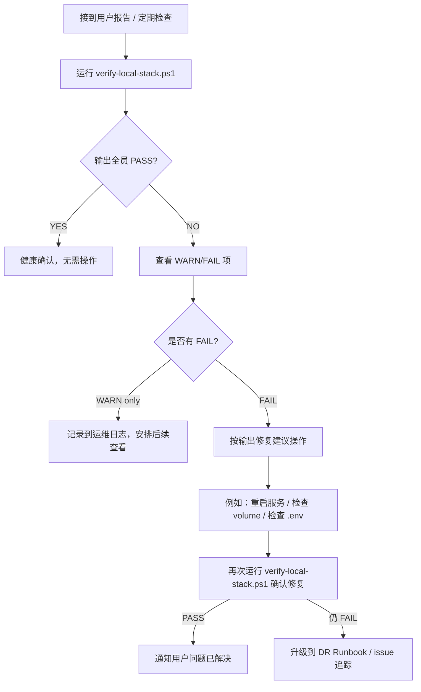
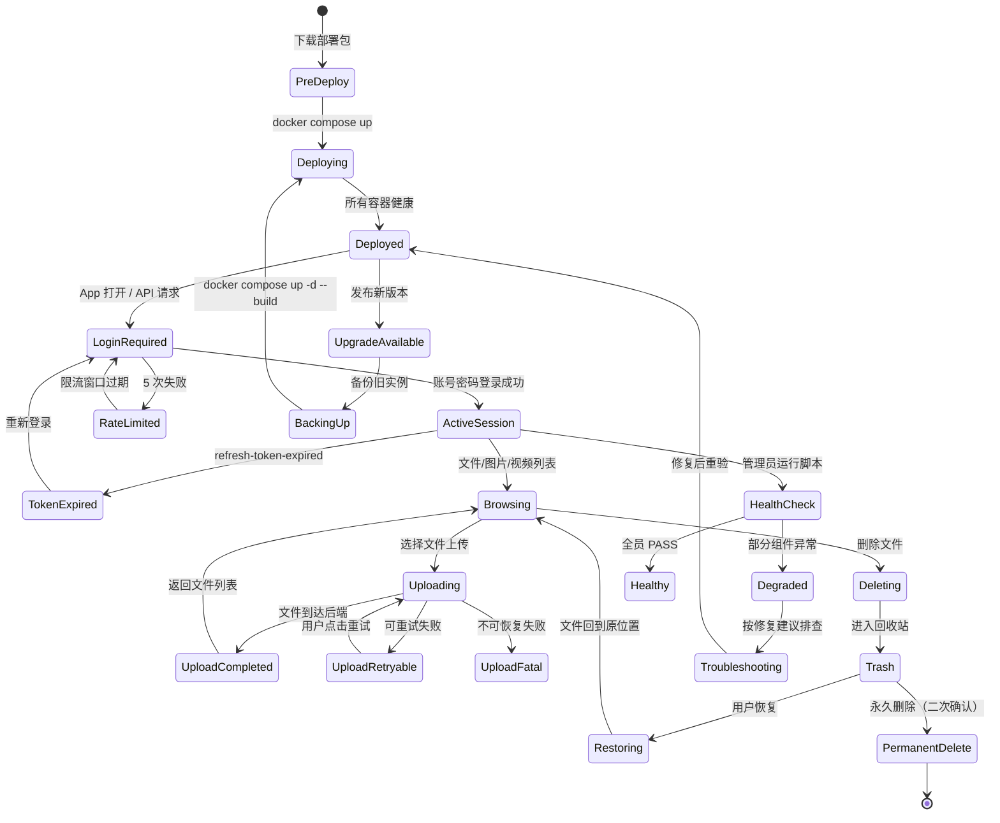

# PrivateCloudDrive V1.0 RC 用户旅程与场景矩阵

日期：2026-06-17
角色：业务分析师 / Hermes-Business-Analyst
基线来源：`docs/private-backup-trusted-loop-scenario-matrix-2026-05-22.md`（D7 场景矩阵）
版本定位：V1.0 Release Candidate — 发布质量收口、部署体验、数据安全与验收口径

## 1. 管理结论

V1.0 RC 阶段的核心目标是**把当前 MVP 能力收口为可部署、可验收、可长期使用的发布候选版本**。
新增大功能不是本阶段任务。本场景矩阵覆盖以下五个用户旅程，作为 UX、后端、移动端、QA 和 DevOps 的共同验收口径：

| 优先级 | 用户旅程 | 目标用户 | 对应 V1.0 RC 质量维度 |
|--------|----------|----------|----------------------|
| P0 | 新用户第一次部署与登录 | 非技术用户/独立部署者 | 部署体验、首次启动引导 |
| P0 | 现有用户升级/迁移 | 已有部署实例的维护者 | 升级安全、数据不丢失 |
| P0 | 非技术用户日常文件管理 | 个人/家庭日常用户 | 主链路稳定性、错误可读性 |
| P0 | 管理员健康检查与排障 | 部署管理员 | 运维可信度、问题诊断 |
| P0 | 忘记密码/登录失败恢复 | 所有用户 | 账号安全、限流合理性 |

## 2. 用户角色定义

| 角色 | 代号 | 技术能力 | 主要关注 | 设备 |
|------|------|----------|----------|------|
| 独立部署者 | DEPLOYER | 能执行命令行、编辑 .env | 部署成功、数据安全 | 桌面端 + Docker |
| 日常文件用户 | USER | 只使用 MAUI App | 文件能上传/下载/预览/删除 | Android 手机 |
| 家庭媒体用户 | MEDIA_USER | 只使用 MAUI App，以照片/视频为主 | 媒体能预览、不丢失 | Android 手机 |
| 部署管理员 | ADMIN | 熟悉 Docker、CLI 和基本排障 | 系统健康、故障定位 | 桌面端 + Docker |
| 非技术使用者 | NON_TECH | 只使用 App，不接触命令行 | 一切能在 App 内完成 | Android 手机 |

> 注：V1.0 RC 阶段 ADMIN 和 DEPLOYER 通常是同一人，但本矩阵按职责分离，以便 V1.3 管理端完成后能独立演化为不同角色。

## 3. 用户故事全集

### 3.1 US-01：新用户第一次部署与登录

**As a** 独立部署者 (DEPLOYER)
**I want** 第一次将 PrivateCloudDrive 部署到我的服务器或 NAS 后，能从手机安全登录
**So that** 我能确信部署成功了，并且移动端可以正常访问我的私有云盘

#### 3.1.1 正常路径



**业务规则：**

| 规则编号 | 规则 | 原因 |
|----------|------|------|
| BR-DEP-01 | `.env.example` 必须随仓库保持最新，且模板密码/加密短语必须标注 `CHANGE_ME` | 防止默认凭证进入生产 |
| BR-DEP-02 | `PUBLIC_URL` 必须显式设置；不能使用 `localhost` 作为 Android 真机的 API 地址 | 手机需要通过 LAN/WAN 访问后端 |
| BR-DEP-03 | db-migrator 必须在 API 启动前完成数据库迁移和种子数据创建 | 首次登录依赖 OpenIddict 客户端 |
| BR-DEP-04 | 首次部署后必须进行写/读双向验证（上传+下载） | 确认 storage volume 挂载和权限正确 |
| BR-DEP-05 | MAUI App 首次启动时必须展示当前配置的 API 地址，并允许用户修改 | 用户需要确认连接目标 |

#### 3.1.2 异常路径与用户可见错误

| 异常场景 | 触发条件 | 系统行为 | 用户可见信息 | 解决方案入口 |
|----------|----------|----------|-------------|-------------|
| DEP-ERR-01 | `.env` 未配置或缺少关键变量 | Compose 启动后 API crash-loop | "后端配置不完整，请检查 .env 文件（参考 .env.example）" | 指向 deployment.md |
| DEP-ERR-02 | `POSTGRES_PASSWORD` 未修改为模板值 | API 日志警告，但不阻止启动 | 日志："WARNING: Using default database password is insecure for production" | 建议修改 .env 后重建 |
| DEP-ERR-03 | `PUBLIC_URL` 与手机实际访问地址不匹配 | OpenIddict token 验证失败，登录 400 | "服务器地址不匹配，请检查 PUBLIC_URL 是否是手机能访问的地址" | 设置页修改 API 地址 |
| DEP-ERR-04 | Docker volume 权限不足 | API 启动后上传失败 | "存储目录不可写，请检查 Docker volume 权限" | 指向 deployment.md 存储说明 |
| DEP-ERR-05 | db-migrator 失败（数据库不可达或 SQL 错误） | API 启动后返回 500 | "数据库初始化失败，请检查 PostgreSQL 是否正常运行" | 运行 verify-local-stack.ps1 |
| DEP-ERR-06 | 手机无法连接 API（网络不通 / 防火墙阻止） | 连接超时或拒绝 | "无法连接到服务器，请检查 API 地址和网络连接" | 设置页修改地址 / 检查网络 |
| DEP-ERR-07 | 首次登录账号密码错误 | 登录返回 401 | "账号或密码错误"（不提示哪个字段错） | 重试 / 联系管理员 |
| DEP-ERR-08 | 手机端 `ApiBaseUrl` 未更新（模拟器地址用于真机） | 所有 API 请求失败 | "服务器地址似乎不正确，当前指向 [地址]，是否修改？" | 弹窗引导修改地址 |

#### 3.1.3 验收条件

| 验收项 | 方法 | 预期 |
|--------|------|------|
| US-01-AC01 | 干净环境 docker compose up -d --build 成功 | 所有容器健康，Swagger 200 |
| US-01-AC02 | 运行 verify-local-stack.ps1 | 全员 PASS，无 FAIL |
| US-01-AC03 | 手机安装 APK，设置 API 地址，输入默认 admin 账号密码 | 登录成功，进入首页 |
| US-01-AC04 | 上传一个图片文件 | 上传完成通知可见 |
| US-01-AC05 | 在文件页找到该文件并预览 | 缩略图/预览正常 |

---

### 3.2 US-02：现有用户升级/迁移

**As a** 已有部署实例的管理员 (ADMIN/DEPLOYER)
**I want** 将现有 PrivateCloudDrive 实例升级到 V1.0 RC 版本，或将数据从旧主机迁移到新主机
**So that** 我能获得新版本能力，且用户文件、账号和分享数据不丢失

#### 3.2.1 正常路径



**迁移（换主机）路径：**



**业务规则：**

| 规则编号 | 规则 | 原因 |
|----------|------|------|
| BR-UPG-01 | 升级前必须先执行完整备份（DB + storage + .env） | 回滚保障 |
| BR-UPG-02 | db-migrator 增量迁移必须向下兼容；不允许破坏性 Schema 变更 | 保证升级不丢数据 |
| BR-UPG-03 | 备份文件中的 `.env.secret` 禁止提交到 Git，恢复后必须校验密码和加密短语一致 | 安全原则 |
| BR-UPG-04 | 迁移后必须重新验证所有第三方登录绑定是否正常 | 外部登录依赖回调 URL |
| BR-UPG-05 | 迁移后 `PUBLIC_URL` 必须更新为对应的新主机地址 | OpenIddict issuer 验证 |

#### 3.2.2 异常路径与用户可见错误

| 异常场景 | 触发条件 | 系统行为 | 用户可见信息 | 解决方案入口 |
|----------|----------|----------|-------------|-------------|
| UPG-ERR-01 | 备份文件不完整或损坏 | 恢复脚本解析 manifest.json 失败 | "备份文件不完整，请检查 manifest.json 是否存在" | 重新备份 / 检查备份目录 |
| UPG-ERR-02 | 备份版本与新版本不兼容 | db-migrator 执行迁移时 schema 冲突 | "数据库版本不兼容，请确认备份来自兼容版本" | 按版本号对照表选择回滚版本 |
| UPG-ERR-03 | PostgreSQL 备份恢复失败 | pg_restore 报错 | "数据库恢复失败：详细原因"（保留 pg_restore 输出但不暴露密码） | 检查 PostgreSQL 日志 |
| UPG-ERR-04 | storage.tar.gz 解压后文件权限异常 | 容器内文件不可读 | "存储文件权限异常，请检查 Docker volume 映射" | 运行 verify-local-stack.ps1 |
| UPG-ERR-05 | 升级后 `STRING_ENCRYPTION_PASSPHRASE` 不一致 | ABP 解密失败，部分功能异常 | "数据加密密钥不匹配，请检查 .env 中的加密短语" | 恢复旧 .env 或回滚 |
| UPG-ERR-06 | 缓存数据不一致（Redis 老数据） | 升级后出现奇怪行为（如分享链接状态异常） | "缓存数据来自旧版本，建议重启 Redis 或等待自动过期" | docker compose restart redis |

#### 3.2.3 验收条件

| 验收项 | 方法 | 预期 |
|--------|------|------|
| US-02-AC01 | 执行 backup-local-stack.ps1 | manifest.json PASS，备份目录包含 postgres.dump + storage.tar.gz |
| US-02-AC02 | 在干净环境执行 restore-local-stack.ps1 dry-run | 不覆盖数据，dry-run 报告 PASS |
| US-02-AC03 | 恢复后真机登录 | 旧账号、文件、分享均不丢失 |
| US-02-AC04 | 升级后原有分享链接仍然可用 | 分享链接访问正常 |
| US-02-AC05 | docker compose down --volumes 后重新部署 | 恢复过程不依赖旧容器残留 |

---

### 3.3 US-03：非技术用户日常文件管理

**As a** 日常文件用户/家庭媒体用户 (USER / MEDIA_USER / NON_TECH)
**I want** 通过手机 App 稳定地上传、浏览、预览、下载和删除我的文件、照片和视频
**So that** 我能把自己的服务器当作可靠的私有云盘来使用，而不需要理解 Docker、API 或存储配置

#### 3.3.1 正常路径



**业务规则：**

| 规则编号 | 规则 | 原因 |
|----------|------|------|
| BR-DAILY-01 | 所有上传、下载、删除等变更操作必须在队列/状态中有明确反馈 | 用户需要知道操作是否在执行 |
| BR-DAILY-02 | 上传失败必须显示可读错误，包括但不限于：网络中断、容量不足、文件名冲突、权限拒绝 | 用户不能看到 raw exception |
| BR-DAILY-03 | 大文件上传（>100MB）必须显示分片上传进度或字节进度 | 用户需要知道不是卡死 |
| BR-DAILY-04 | 照片/视频缩略图必须在列表中优先加载，失败时显示占位图标 | 空占位比错误图更友好 |
| BR-DAILY-05 | 文件/图片/视频三个 Tab 必须状态一致：在同一后端上操作一个文件后，另一个 Tab 也应反映变更 | 跨 Tab 数据一致性 |
| BR-DAILY-06 | 永久删除前必须有二次确认弹窗，文案需说明"此操作不可恢复" | 防误删 |
| BR-DAILY-07 | 登录过期时，队列中的上传任务不能丢弃；重新登录后可继续 | 上传任务可靠性 |
| BR-DAILY-08 | 文件页、图片页、视频页为空时展示友好空状态，而非空白页面 | 非技术用户理解"还没有文件" |

#### 3.3.2 异常路径与用户可见错误

| 异常场景 | 触发条件 | 系统行为 | 用户可见信息 | 解决方案入口 |
|----------|----------|----------|-------------|-------------|
| DAILY-ERR-01 | 网络断开或 Wi-Fi 切换 | 上传队列暂停，自动重试（有限次） | "网络连接已断开，正在等待恢复" | 检查网络连接 |
| DAILY-ERR-02 | 上传过程中后端不可达 | 队列标记失败，保留重试按钮 | "上传失败：无法连接到服务器，请检查网络后重试" | 手动点击重试 |
| DAILY-ERR-03 | 容量不足（已达到配额或磁盘满） | 上传拒绝，队列不生成任务 | "存储空间不足，无法保存此文件，请联系管理员或释放空间" | 设置 → 服务状态查看容量 |
| DAILY-ERR-04 | 文件名冲突（同名文件已存在） | 不上传或静默覆盖，展示冲突提示 | "此文件已存在，是否覆盖旧文件？"（提供覆盖/跳过/重命名选项） | 用户选择操作 |
| DAILY-ERR-05 | 文件过大超出单文件限制 | 文件选择器过滤或上传拒绝 | "此文件超过最大上传限制（当前限制：X GB）" | 联系管理员调整 |
| DAILY-ERR-06 | 登录过期（token 失效） | 队列暂停，引导重新登录 | "登录已过期，请重新登录后继续上传" | 点击后跳转登录页 |
| DAILY-ERR-07 | 缩略图生成失败（FFmpeg 不可用或媒体损坏） | 占位图替代，不阻塞列表 | 缩略图区域显示文件类型图标 | 不影响主功能；可联系管理员检查 FFmpeg |
| DAILY-ERR-08 | 预览不支持的文件格式 | App 不调用预览，展示文件信息 | "此文件格式暂不支持预览，您可以下载后查看" | 点击下载 |
| DAILY-ERR-09 | 视频播放失败（格式不支持或编码问题） | 播放器展示错误，不退出 | "视频播放失败，请尝试下载后通过本地播放器查看" | 下载按钮可用 |
| DAILY-ERR-10 | 分享链接访问失败（链接已取消/过期） | 分享页展示错误 | "该分享链接已失效，请联系分享者" | 不暴露文件路径或文件列表 |
| DAILY-ERR-11 | 删除时后端异常 | 删除失败，文件仍存在 | "删除失败，请稍后重试" | 用户可重试 |
| DAILY-ERR-12 | 弱网环境列表加载缓慢 | 显示加载中状态，超时后展示降级提示 | "加载文件列表较慢，当前是 [已加载 X 项/共 Y 项]" | 等待或刷新 |

#### 3.3.3 验收条件

| 验收项 | 方法 | 预期 |
|--------|------|------|
| US-03-AC01 | 上传 3 种文件：文档(.pdf)、图片(.jpg)、视频(.mp4) | 三个文件均上传成功，队列完成 |
| US-03-AC02 | 在文件 Tab 浏览到上传的文件 | 文件名、大小、上传时间正确 |
| US-03-AC03 | 在图片 Tab 浏览图片缩略图 | 缩略图可见，点击可预览 |
| US-03-AC04 | 在视频 Tab 浏览视频封面 | 封面可见，点击可播放 |
| US-03-AC05 | 删除文件，进入设置→回收站，恢复文件 | 文件恢复后在原目录可见 |
| US-03-AC06 | 永久删除文件，确认弹窗正常 | 二次确认文案包含"不可恢复"，确认后文件消失 |
| US-03-AC07 | 上传中断后（断网/断电）重试 | 重试后上传继续完成 |
| US-03-AC08 | 空文件页/图片页/视频页展示 | 友好空状态而非空白 |
| US-03-AC09 | 弱网环境操作（通过模拟器或代理模拟） | 加载状态可见，超时有降级提示 |

---

### 3.4 US-04：管理员健康检查与排障

**As a** 部署管理员 (ADMIN / DEPLOYER)
**I want** 在部署后或怀疑系统异常时，快速了解所有服务组件的健康状态，并得到修复建议
**So that** 我能判断私有云盘是否正常运行，以及在用户报告问题前主动发现潜在故障

#### 3.4.1 正常路径



**业务规则：**

| 规则编号 | 规则 | 原因 |
|----------|------|------|
| BR-ADMIN-01 | `verify-local-stack.ps1` 输出的健康检查摘要不得包含密码、secret、token、access key 或完整连接字符串 | 安全原则；该输出可能被截图用于排障沟通 |
| BR-ADMIN-02 | 健康检查覆盖：Docker CLI、Compose config、PostgreSQL、Redis、db-migrator 状态、API 容器、Swagger、media-worker、storage volume 挂载、FFmpeg/FFprobe 可用性 | 完整覆盖 V1.0 RC 所有依赖 |
| BR-ADMIN-03 | 每个 FAIL 必须附带一条具体修复建议，而非仅状态码 | 管理员需要知道如何处理 |
| BR-ADMIN-04 | WARN 项允许存在（如 `.env` 使用模板密码、PUBLIC_URL 为 localhost），但必须有说明 | 开发环境可接受，生产环境需修复 |
| BR-ADMIN-05 | 所有敏感配置（`*_SECRET`、`*_PASSWORD`、`*_KEY`）在脚本输出中必须脱敏或仅输出 `[SET]`/`[MISSING]` | 防止日志泄漏 |
| BR-ADMIN-06 | 健康检查必须可离线/离线模式下运行部分检查（如 Docker CLI、Compose config），不强制依赖正在运行的容器 | 排障时栈可能未启动 |

#### 3.4.2 异常路径与用户可见错误

| 异常场景 | 触发条件 | 系统行为 | 用户可见信息 | 修复建议 |
|----------|----------|----------|-------------|----------|
| HEALTH-ERR-01 | Docker CLI 不可用 | 脚本前置检查失败 | "Docker CLI 未找到，请安装 Docker Desktop 或 Docker Engine" | 下载 Docker / 检查 PATH |
| HEALTH-ERR-02 | 关键容器未运行（postgres / api） | 对应项 FAIL | "PostgreSQL 容器未运行，请检查 docker compose ps" | docker compose up -d postgres |
| HEALTH-ERR-03 | API 返回非 200 | HTTP 探针 FAIL | "API 服务未正常响应，可能正在重启或配置错误" | 检查 API 日志：docker compose logs api |
| HEALTH-ERR-04 | media-worker 容器已退出 | 进程检查 FAIL | "媒体处理服务已退出，缩略图和视频封面将无法生成" | 检查日志：docker compose logs media-worker |
| HEALTH-ERR-05 | storage volume 不可写 | 写检查 FAIL | "存储目录不可写，文件上传将失败" | 检查 Docker volume 权限和磁盘空间 |
| HEALTH-ERR-06 | FFmpeg/FFprobe 缺失 | 工具检查 FAIL | "FFmpeg 未安装，缩略图和视频元数据将不可用" | 检查 API 镜像或手动安装 |
| HEALTH-ERR-07 | OpenIddict issuer 配置异常 | 登录/Token 检查 FAIL | "认证服务配置异常，登录可能失败" | 检查 PUBLIC_URL 和 OPENIDDICT_* 配置 |
| HEALTH-ERR-08 | Redis 不可达 | 容器检查 PASS 但连接检查 FAIL | "Redis 不可达，限流和缓存功能不可用" | 检查 Redis 容器和网络配置 |
| HEALTH-ERR-09 | 磁盘空间不足 | 空间检查 FAIL | "存储空间不足（已用 X%，可用 Y GB），请及时清理" | 删除临时文件 / 扩充存储 |
| HEALTH-ERR-10 | Docker compose config 展开失败 | Compose 语法检查 FAIL | "Docker Compose 配置有语法错误，请检查 docker-compose.yml" | 检查 yaml 格式 |

#### 3.4.3 验收条件

| 验收项 | 方法 | 预期 |
|--------|------|------|
| US-04-AC01 | 在健康栈上运行 verify-local-stack.ps1 | 全员 PASS，摘要无敏感信息 |
| US-04-AC02 | 停掉 PostgreSQL 后运行验证脚本 | 对应 FAIL 项输出修复建议 |
| US-04-AC03 | 移除 FFmpeg 后运行验证脚本 | FFmpeg 项 WARN/FAIL，说明影响范围 |
| US-04-AC04 | 检查输出是否包含敏感信息 | 无 `*_SECRET`、`*_PASSWORD`、`*_KEY` 明文 |
| US-04-AC05 | 验证脚本输出格式 | PASS/WARN/FAIL 清晰可区分，FAIL 有建议 |

---

### 3.5 US-05：忘记密码/登录失败恢复

**As a** 云盘用户 (USER / NON_TECH)
**I want** 在忘记密码或多次登录失败后，能够安全地恢复访问
**So that** 我不会因为忘记密码而永久失去对自己文件的访问

#### 3.5.1 正常路径

```mermaid
flowchart TD
    A[登录页输入密码] --> B{认证结果}
    B -->|成功| C[进入首页]
    B -->|失败| D[显示错误：\"账号或密码错误\"]
    D --> E{剩余的尝试次数}
    E -->|还有机会| F[用户重试或记忆密码]
    E -->|达到限制| G[显示限流提示]
    G --> H{管理员可用?}
    H -->|是| I[联系管理员重置密码]
    H -->|否| J[等待限流窗口过期后重试]
    I --> K[管理员（ADMIN）登录管理端或通过支持流程重置]
    K --> L[用户收到新密码 / 重置链接]
    L --> M[用户用新密码登录]
    M --> N[建议用户修改密码]
```

**业务规则：**

| 规则编号 | 规则 | 原因 |
|----------|------|------|
| BR-LOGIN-01 | 登录失败提示仅为"账号或密码错误"，不区分账号不存在与密码错误 | 防止用户枚举攻击 |
| BR-LOGIN-02 | 登录限流按 username + IP 维度双因子计数 | 防止单一用户爆破和 IP 级攻击 |
| BR-LOGIN-03 | 限流窗口过后自动恢复，无需管理员介入 | 用户能在合理时间内自行恢复 |
| BR-LOGIN-04 | 限流提示不得透露剩余窗口时间或已尝试次数 | 防止攻击者调整节奏 |
| BR-LOGIN-05 | V1.0 RC 无自助重置密码功能（无邮箱/短信验证），必须联系管理员 | 功能边界清晰 |
| BR-LOGIN-06 | 管理员重置密码后，旧 token 和 session 应立即失效 | 安全切换 |
| BR-LOGIN-07 | 登录相关日志不得记录密码明文或密文 | 审计原则 |

#### 3.5.2 异常路径与用户可见错误

| 异常场景 | 触发条件 | 系统行为 | 用户可见信息 | 解决方案入口 |
|----------|----------|----------|-------------|-------------|
| AUTH-ERR-01 | 账号不存在 | 401，但不区分不存在 vs 密码错 | "账号或密码错误" | 联系管理员确认账号是否存在 |
| AUTH-ERR-02 | 密码错误（有限次内） | 401，计数器递增 | "账号或密码错误" | 重试 |
| AUTH-ERR-03 | 密码错误达到限流阈值 | 429，拒绝继续尝试 | "登录尝试次数过多，请稍后重试" | 等待后重试/联系管理员 |
| AUTH-ERR-04 | 限流窗口内继续尝试 | 429，拒绝 | "登录尝试次数过多，请稍后重试" | 等待 |
| AUTH-ERR-05 | 后端服务不可达（网络/服务故障） | 超时或 502/503 | "登录服务暂时不可用，请检查服务器状态" | 联系管理员 |
| AUTH-ERR-06 | 管理员重置密码时指定不存在的用户 | 操作失败 | "用户不存在" | 确认用户名正确 |
| AUTH-ERR-07 | 管理员重置密码后用户立即用旧密码尝试 | 旧密码失效，仍然返回 401 | "账号或密码错误" | 使用新密码 |
| AUTH-ERR-08 | Redis 不可达导致限流无法计数 | 退化为服务端速率控制，或允许继续 | 正常登录行为（限流不生效） | 日志记录限流失效警告 |
| AUTH-ERR-09 | OpenIddict token 签发异常 | 登录返回 500 | "登录服务异常，请稍后重试或联系管理员" | 检查后端日志 |
| AUTH-ERR-10 | Refresh Token 过期 | 移动端静默刷新失败 | 无明显提示（App 引导重新登录） | 无需用户操作 |

#### 3.5.3 验收条件

| 验收项 | 方法 | 预期 |
|--------|------|------|
| US-05-AC01 | 输入正确密码登录 | 登录成功进入首页 |
| US-05-AC02 | 输入错误密码 | 显示"账号或密码错误" |
| US-05-AC03 | 连续输入错误密码达到限流阈值（默认 5 次） | 第 6 次显示"登录尝试次数过多"并拒绝 |
| US-05-AC04 | 限流窗口内再次尝试 | 仍然拒绝，提示不变 |
| US-05-AC05 | 尝试登录不存在的账号 | 显示"账号或密码错误"（不区分） |
| US-05-AC06 | 管理员通过后台重置密码 | 用户可用新密码登录 |
| US-05-AC07 | 旧密码在重置后失效 | 旧密码登录返回 401 |
| US-05-AC08 | 检查登录日志 | 无密码明文或密文 |

---

## 4. 状态机总览（V1.0 RC）



## 5. 用户状态/页面状态定义

所有涉及用户交互的页面，必须覆盖以下状态：

| 状态 | 定义 | 通用处理 |
|------|------|----------|
| 加载中 | 数据正在从后端获取，不超过 10 秒 | 骨架屏或加载指示器；超时后展示降级状态 |
| 空状态 | 数据已返回但不为空 | 友好提示 + 操作引导按钮（如"上传第一个文件"） |
| 数据正常 | 无错误，数据完整 | 正常展示 |
| 错误态 | 后端返回错误或网络中断 | 可读错误 + 重试按钮 |
| 弱网态 | 请求超时或速度缓慢 | 加载中 + 超时降级提示 |
| 空错误 | 后端返回但因后端错误数据为空 | 错误信息 + 重试 + 联系管理员的入口 |
| 权限不足 | 当前用户无权限访问该数据或操作 | 说明无权限 + 不暴露其他用户资源 |
| 已过期 | token/cookie 失效 | 引导重新登录，不丢弃导航上下文 |

## 6. 接口/页面依赖矩阵

| 场景 | 依赖 API | 依赖页面 | 依赖配置 |
|------|----------|----------|----------|
| US-01 部署与登录 | `/api/token` (OpenIddict), `/api/account/login` | 登录页、设置页（API 地址配置） | `.env`; `ApiBaseUrl` |
| US-02 升级迁移 | 备份/恢复脚本 | 无 App 页面 | 备份脚本兼容性 |
| US-03 日常文件管理 | `/api/file-manager/*`, `/api/upload/*`, `/api/media/*` | 文件页、图片页、视频页、上传队列、回收站 | `FILECENTER_STORAGE_*` |
| US-04 健康检查 | `verify-local-stack.ps1`（无 HTTP API 依赖） | 无 App 页面 | Docker Compose |
| US-05 登录失败 | `/api/token`, `/api/account/login` | 登录页 | `PASSWORD_LOGIN_RATE_LIMIT_*` |

## 7. 权限矩阵（V1.0 RC）

| 角色 | 登录 | 文件读写 | 回收站 | 分享 | 标签/收藏 | 设置查看 | 健康检查脚本 | 系统管理 |
|------|------|----------|--------|------|-----------|----------|-------------|----------|
| 管理员 (admin) | ✓ | 全部 | 全部 | 管理 | 管理 | 全部 | ✓ | 用户管理 |
| 普通用户 (user) | ✓ | 自己 | 自己 | 管理 | 管理 | 自己 | — | — |
| 匿名访问者 | — | 仅公开分享 | — | — | — | — | — | — |

注：V1.0 RC 阶段未实现"管理员"和"用户"的完整 RBAC 权限系统。上表为 V1.3 管理端完成后的目标权限边界。当前实际的权限粒度取决于 ABP 框架默认权限。

## 8. 数据字典 - 关键业务字段

| 字段 | 所属实体 | 类型 | 说明 | 安全约束 |
|------|----------|------|------|----------|
| `UserName` | User | string | 登录用户名，通常为邮箱 | 不视为敏感 |
| `Password` | User (Auth) | — | 不存储在可读字段中，仅 PasswordHash | 任何日志/响应不输出 |
| `Token` | OpenIddict | JWT string | 访问令牌 | 不应出现在日志、url 参数 |
| `RefreshToken` | OpenIddict | opaque string | 刷新令牌 | 同 Token |
| `BlobId` | FileNode | Guid | 文件存储标识 | 非敏感，但不应暴露给非授权者 |
| `ShareLinkCode` | Share | string | 分享链接唯一码 | 公开链接的一部分 |
| `SharePassword` | Share | string? | 分享密码（可选） | 哈希存储 |
| `StoragePath` | FileCenter (config) | string | 容器内存储路径 | 不应暴露给普通用户 |
| `ClientSecret` | OpenIddict app | string | OAuth 客户端密钥 | 仅服务端使用 |
| `ExternalProviderToken` | UserLogin | string | 外部登录提供商令牌 | 仅后端使用，不进入日志 |

## 9. 业务术语表

| 术语 | 定义 | 不应混用 |
|------|------|----------|
| 上传队列 | App 端维护的待上传文件列表，包含进度和状态 | 不与"通知"、"后台任务"混用 |
| 回收站 | 已删除文件的暂存区，支持恢复和永久删除 | 不与"已删除"状态混淆；永久删除不可逆 |
| 健康检查 | 通过脚本或 API 验证所有依赖服务状态的过程 | 不与"监控"、"报警"混用 |
| 分享链接 | 文件/文件夹对外临时访问的加密链接 | 不与"公开目录"、"共享文件夹"混用 |
| 升级 | 在同一主机上替换镜像并运行 db-migrator 的过程 | 不与"迁移"混用（迁移涉及换主机） |
| 迁移 | 将数据和配置从旧主机完整转移到新主机的过程 | 同上 |
| 限流窗口 | 登录失败计数器的过期时间窗口 | 不与"账户锁定"混用（窗口到期自动恢复） |

## 10. 下游交接

| 下游角色 | 交付物 | 说明 |
|----------|--------|------|
| UX | 「用户状态/页面状态定义」第 5 节 | 空/错/弱网/已过期文案和状态行为 |
| 移动端 (mobile-eng) | 「异常路径」各表的"用户可见信息"列 | 上传、登录、预览等场景的错误文案，以及 US-03 日常路径 |
| 后端 (backend-eng) | 「业务规则」表 + 「接口/页面依赖矩阵」 | 登录限流、上传会话、存储权限的契约边界 |
| 测试 (qa-eng) | 「验收条件」各节 +「QA 用例入口」 | 可直接映射为测试用例 |
| 存储/隐私 | 「已知限制」「业务规则 BR-DEP 系列」 | 存储路径、数据备份、安全口径 |
| 部署 (devops-eng) | US-02 升级迁移路径 +「状态机」 | 备份恢复脚本、健康检查覆盖范围 |

## 11. QA 用例入口

| 用例 | 目标 | 关联用户故事 |
|------|------|-------------|
| V1RC-TC-001 | 干净环境首次部署 + 健康检查全员 PASS | US-01 |
| V1RC-TC-002 | Android 真机登录 + 上传图片/视频/文件 + 下载 + 预览 | US-03 |
| V1RC-TC-003 | 上传中断后重试（断网/后端停止/登录过期） | US-03 |
| V1RC-TC-004 | 连续 N+1 次错误密码后限流触发，窗口期过后恢复 | US-05 |
| V1RC-TC-005 | 执行 backup-local-stack 并验证 manifest PASS | US-02 |
| V1RC-TC-006 | 执行 restore-local-stack dry-run + 确认恢复后数据完整 | US-02 |
| V1RC-TC-007 | 删除 + 回收站恢复 + 永久删除二次确认 | US-03 |
| V1RC-TC-008 | health check 输出无敏感信息 + 停容器后 FAIL 带修复建议 | US-04 |
| V1RC-TC-009 | 空文件页/图片页/视频页显示友好空状态 | US-03 |
| V1RC-TC-010 | verify-local-stack 输出脱敏检查 | US-04 |

## 12. 与 D7 矩阵差异说明

本文件是 D7 场景矩阵 `docs/private-backup-trusted-loop-scenario-matrix-2026-05-22.md` 的 V1.0 RC 升级版。主要变化：

| 维度 | D7 矩阵 | V1.0 RC 矩阵 |
|------|---------|-------------|
| 范围 | 手机备份可信闭环为主 | 完整产品发布旅程：部署→日常→运维→故障恢复 |
| 用户角色 | 未明确定义角色 | 定义 5 个角色（DEPLOYER/USER/MEDIA_USER/ADMIN/NON_TECH） |
| 用户故事格式 | 未使用 As a/I want/So that | 5 个完整用户故事 |
| 异常路径 | 以错误码（ERR-0x）列出，无用户可见文案 | 每场景独立异常路径表，含用户可见信息 + 解决方案入口 |
| 业务规则 | 无 | 每个用户故事有独立 BR 表 |
| 验收条件 | 无 | 每个用户故事有独立 AC 表 |
| 状态机 | 手机端上传状态机 | 完整产品级状态机（部署→登录→日常→升级） |
| 下游交接 | 简单列表 | 结构化的角色→交付物→说明表 |
| QA 用例 | PB-TL-001~010 | V1RC-TC-001~010 |
| 数据字典 | 无 | 关键业务字段 + 安全约束 |
| 业务术语表 | 无 | 术语定义 + 避免混用说明 |

## 13. 已知限制与风险

| 编号 | 限制/风险 | 影响 | 缓解措施 |
|------|-----------|------|----------|
| R01 | V1.0 RC 无自助密码重置功能 | US-05 用户无法自行恢复忘记密码 | 明确写在登录页文案和已知限制中 |
| R02 | iOS 平台尚未完成真机验收 | US-03 不可用于 iOS | V1.0 RC 发布范围限定 Android |
| R03 | 微信/Google/GitHub 外部登录为可选增强 | US-01 部署后默认仅账号密码登录 | 文档明确外部登录边界 |
| R04 | 多用户容量配额尚未实现 | US-03 容量不足时无法区分用户 | 容量不足提示统一指向管理员 |
| R05 | 无服务端上传队列管理 | US-03 上传队列状态仅客户端可见 | 已在 known-limitations.md 记录 |
