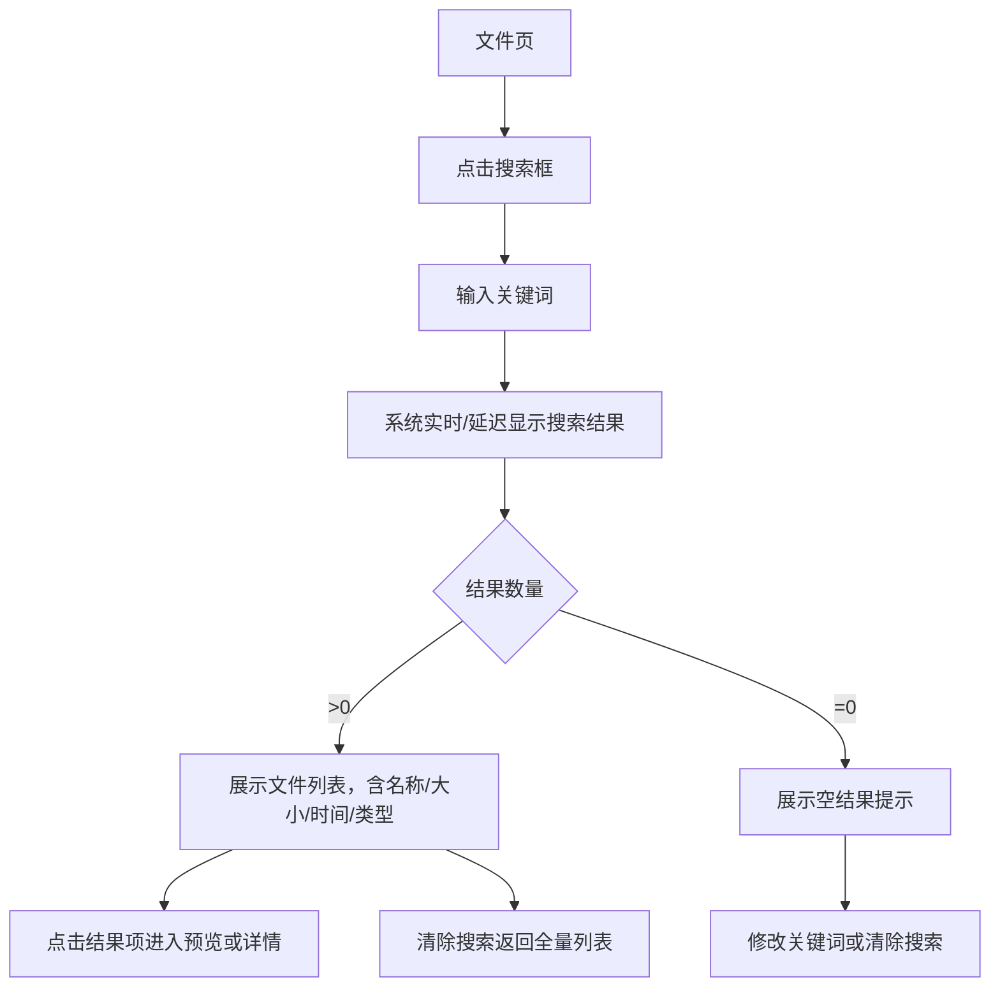
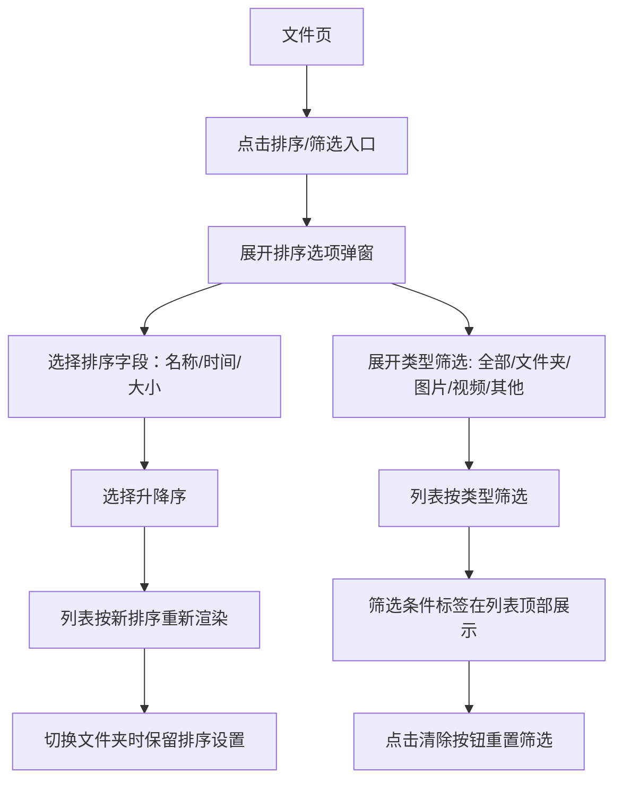
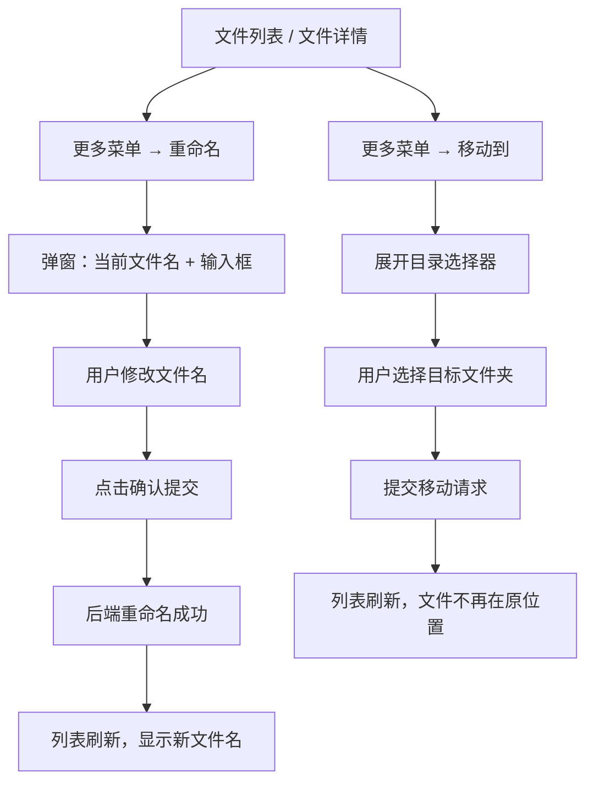
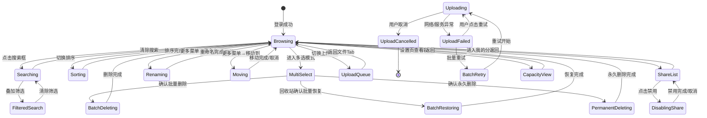

# PrivateCloudDrive V1.1 文件管理体验增强 — 用户旅程与场景矩阵

日期：2026-07-03（v2 同步架构边界）
角色：业务分析师 / Hermes-Business-Analyst
基线来源：`docs/scenario-matrix-v1.0-rc.md`（V1.0 RC 场景矩阵）、`docs/architecture-v1.1-file-management-boundary.md`（V1.1 架构边界文档）
版本定位：V1.1 文件管理体验增强 — 搜索、排序筛选、批量操作、容量展示、分享管理、上传队列管理、重命名移动

---

## 1. 管理结论

V1.1 阶段的目标是把 V1.0 RC 的"文件能上传和访问"升级为"能快速找到、批量整理、理解容量占用、管理分享"的私有云盘体验。本场景矩阵基于 `docs/architecture-v1.1-file-management-boundary.md` 的架构收口规格，在 V1.0 RC 场景矩阵基础上增加以下 7 个用户旅程，约束后端 API、MAUI 前端和验收口径：

| 优先级 | 用户旅程 | 目标用户 | 对应 V1.1 能力 |
|--------|----------|----------|----------------|
| P0 | 搜索文件 | 日常文件用户 / 家庭媒体用户 | 按名称搜索、类型筛选、分页 |
| P0 | 排序与筛选列表 | 日常文件用户 / 家庭媒体用户 | 名称/时间/大小排序、类型筛选 |
| P0 | 批量操作 | 日常文件用户 / 家庭媒体用户 | 批量删除/恢复/永久删除 |
| P0 | 容量感知 | 所有用户 / 管理员 | 容量摘要、配额展示 |
| P0 | 分享管理 | 日常文件用户 | 查看/复制/禁用分享 |
| P1 | 上传队列管理 | 所有用户 | 上传重试、取消 |
| P0 | 重命名与移动 | 日常文件用户 | 文件详情页重命名/移动 |

---

## 2. 用户角色定义

沿用 V1.0 RC 角色体系，新增「批量整理者」视角：

| 角色 | 代号 | 技术能力 | 主要关注 | 设备 |
|------|------|----------|----------|------|
| 独立部署者 | DEPLOYER | 能执行命令行、编辑 .env | 部署成功、数据安全 | 桌面端 + Docker |
| 日常文件用户 | USER | 只使用 MAUI App | 文件能上传/下载/预览/删除 | Android 手机 |
| 家庭媒体用户 | MEDIA_USER | 只使用 MAUI App，以照片/视频为主 | 媒体能预览、不丢失 | Android 手机 |
| 部署管理员 | ADMIN | 熟悉 Docker、CLI 和基本排障 | 系统健康、故障定位 | 桌面端 + Docker |
| 非技术使用者 | NON_TECH | 只使用 App，不接触命令行 | 一切能在 App 内完成 | Android 手机 |

> V1.1 不引入新角色。USER / MEDIA_USER / NON_TECH 均受益于搜索、排序、批量操作和容量感知。

---

## 3. 用户故事全集

---

### 3.1 US-V11-01：搜索文件

**As a** 日常文件用户 (USER / MEDIA_USER / NON_TECH)
**I want** 按文件名搜索我的文件，并可按类型缩小范围
**So that** 我不需要在多层文件夹中逐个翻找，可以快速定位到目标文件

#### 3.1.1 正常路径



**业务规则：**

| 规则编号 | 规则 | 原因 |
|----------|------|------|
| BR-SEARCH-01 | 搜索范围默认为当前文件夹（ParentId）；提供「全盘搜索」开关 | 层级清晰；用户可自行扩大范围 |
| BR-SEARCH-02 | 搜索使用 PostgreSQL `ILIKE` 匹配，不引入全文索引 | V1.1 不做复杂搜索，避免引入 Elasticsearch |
| BR-SEARCH-03 | 搜索结果必按当前用户 + 当前租户隔离，不能泄露其他用户文件 | 安全原则；V1.0 RC 已有贯彻 |
| BR-SEARCH-04 | 搜索关键词为空或仅空白字符时，恢复为正常列表 | 空搜索不应当作全盘搜索 |
| BR-SEARCH-05 | 搜索中可叠加类型筛选（全部/文件夹/图片/视频/其他文件） | 更精准定位 |
| BR-SEARCH-06 | 搜索与排序可组合使用（搜索后仍可按时间/大小/名称排序） | 用户预期能排列搜索结果 |
| BR-SEARCH-07 | 搜索最低支持 2 个字符，1 个字符应提示"至少输入 2 个字符" | 避免全盘 ILIKE '%x%' 性能问题 |
| BR-SEARCH-08 | 搜索 API 支持分页（SkipCount / MaxResultCount） | 防止大结果集全部返回 |
| BR-SEARCH-09 | 搜索 API 不返回 `BlobName` 之外的服务端物理路径、连接字符串、密钥等敏感信息 | 安全原则；防止信息泄露 |

#### 3.1.2 异常路径与用户可见错误

| 异常场景 | 触发条件 | 系统行为 | 用户可见信息 | 解决方案入口 |
|----------|----------|----------|-------------|-------------|
| SEARCH-ERR-01 | 关键词过短（单字符） | 不发起 API 请求 | "请输入至少 2 个字符" | 继续输入 |
| SEARCH-ERR-02 | 后端搜索超时或返回 500 | 搜索 API 报错 | "搜索服务异常，请稍后重试" | 刷新或重试 |
| SEARCH-ERR-03 | 网络断开 | 搜索请求失败 | "网络连接已断开，无法搜索" | 检查网络后重试 |
| SEARCH-ERR-04 | 搜索结果列表渲染时后续操作（删除/移动）导致结果不准确 | 不主动刷新结果 | 用户手动清除搜索或下拉刷新 | 清除搜索重新搜索 |
| SEARCH-ERR-05 | 数据库连接异常导致 ILIKE 失败 | API 返回 500 | "搜索暂时不可用，请稍后重试" | 联系管理员检查数据库 |
| SEARCH-ERR-06 | 搜索时 token 过期 | API 返回 401 | "登录已过期，请重新登录" | 引导跳转登录页 |

#### 3.1.3 验收条件

| 验收项 | 方法 | 预期 |
|--------|------|------|
| US-V11-01-AC01 | 在当前文件夹输入关键词搜索 | 返回匹配的文件/文件夹列表 |
| US-V11-01-AC02 | 搜索不存在的关键词 | 显示"未找到相关文件"空状态 |
| US-V11-01-AC03 | 单字符搜索 | 提示至少输入 2 个字符，不发起请求 |
| US-V11-01-AC04 | 搜索结果中叠加类型筛选 | 筛选后结果正确 |
| US-V11-01-AC05 | 搜索后排序（如按时间） | 排序正确作用于搜索结果 |
| US-V11-01-AC06 | 清除搜索回到全量列表 | 还原当前文件夹原始列表 |
| US-V11-01-AC07 | 全盘搜索 | 返回用户所有文件夹中的匹配文件 |
| US-V11-01-AC08 | 用户 A 搜索，用户 B 不应看到 A 的文件 | 权限隔离正确 |

---

### 3.2 US-V11-02：排序与筛选列表

**As a** 日常文件用户 (USER / MEDIA_USER / NON_TECH)
**I want** 按名称、时间、大小排序文件列表，并按类型筛选
**So that** 我能快速找到最新文件、大文件或特定类型的文件

#### 3.2.1 正常路径



**业务规则：**

| 规则编号 | 规则 | 原因 |
|----------|------|------|
| BR-SORT-01 | 排序默认：文件夹优先（按名称 asc），再按文件（按创建时间 desc） | 符合用户直观认知 |
| BR-SORT-02 | 文件夹始终排在文件前面，无论何种排序方式 | 保持目录结构清晰 |
| BR-SORT-03 | 排序选择在切换文件夹时保持，返回根目录时重置为默认 | 减少重复操作 |
| BR-SORT-04 | 排序与搜索可组合：搜索后仍然可以切换排序方式 | 搜索结果是文件子集 |
| BR-SORT-05 | 筛选条件在列表顶部以标签形式展示，支持一键清除 | 明确当前状态 |
| BR-SORT-06 | 类型筛选支持多选：如同时选"图片"和"视频" | 更灵活的筛选需求 |
| BR-SORT-07 | 文件夹本身的"大小"显示为 "--" 或空，不参与大小排序的实际值 | 文件夹大小不是 V1.1 目标 |
| BR-SORT-08 | 排序字段仅接受后端白名单：`name`、`size`、`creationTime`、`lastModificationTime`，升/降序为 `asc`/`desc`；未知排序值降级为默认排序，不抛内部异常、不拼接原始字符串 | 防止 SQL/EF 注入或不可预期查询 |

#### 3.2.2 异常路径与用户可见错误

| 异常场景 | 触发条件 | 系统行为 | 用户可见信息 | 解决方案入口 |
|----------|----------|----------|-------------|-------------|
| SORT-ERR-01 | 排序字段后端不认识或拼写错误 | 排序降级为默认排序 | 排序结果使用默认顺序 | 刷新后重试 |
| SORT-ERR-02 | 筛选后列表为空 | 展示空状态 | "没有符合条件的文件"（非"没有文件"） | 修改或清除筛选条件 |
| SORT-ERR-03 | 网络中断时切换排序 | 排序后列表加载失败 | "加载失败，请检查网络连接后重试" | 重试按钮 |
| SORT-ERR-04 | token 过期时切换排序 | API 返回 401 | "登录已过期，请重新登录" | 引导登录 |

#### 3.2.3 验收条件

| 验收项 | 方法 | 预期 |
|--------|------|------|
| US-V11-02-AC01 | 按名称升序/降序查看 | 名称排序正确，文件夹优先 |
| US-V11-02-AC02 | 按创建时间降序 | 最新文件在最前 |
| US-V11-02-AC03 | 按文件大小降序 | 最大文件在最前，文件夹排在最前但大小值显示为空 |
| US-V11-02-AC04 | 筛选仅显示图片 | 只显示图片文件 |
| US-V11-02-AC05 | 筛选 + 搜索组合 | 筛选和搜索同时生效 |
| US-V11-02-AC06 | 清除筛选 | 回到全量列表 |
| US-V11-02-AC07 | 切换文件夹后排序保持 | 排序不变 |
| US-V11-02-AC08 | 空筛选结果展示友好提示 | "没有符合条件的文件" |

---

### 3.3 US-V11-03：批量操作

**As a** 日常文件用户 / 家庭媒体用户 (USER / MEDIA_USER)
**I want** 能同时选择多个文件进行删除、恢复或永久删除
**So that** 我不需要逐个文件操作，可以一次整理大量文件

#### 3.3.1 正常路径

```mermaid
flowchart TD
    A[文件列表] --> B[长按或点击多选入口]
    B --> C[进入多选模式]
    C --> D[勾选文件：勾选框可见]
    D --> E{选择数量}
    E -->|≥1| F[底部工具栏显示操作按钮/数量]
    E -->|0| G[底部工具栏隐藏]
    F --> H[点击删除]
    H --> I[二次确认弹窗：\"删除 X 个文件到回收站？\"]
    I --> J[确认后逐个删除]
    J --> K[成功：列表刷新，显示成功条数]
    F --> L[点击收藏]
    L --> M[批量设置/取消收藏]
```

**回收站内的批量操作：**

```mermaid
flowchart TD
    A[设置→回收站] --> B[进入多选模式]
    B --> C[勾选多个回收站文件]
    C --> D[点击恢复]
    D --> E[二次确认：\"恢复 X 个文件？\"]
    E --> F[恢复成功，列表刷新]
    C --> G[点击永久删除]
    G --> H[强确认弹窗：\"永久删除 X 个文件？此操作不可恢复\"]
    H --> I[确认后永久删除]
    I --> J[列表刷新，显示删除条数]
```

**业务规则：**

| 规则编号 | 规则 | 原因 |
|----------|------|------|
| BR-BATCH-01 | 批量删除：每次最多 100 个文件 | 防止一次性超大请求导致后端/数据库压力 |
| BR-BATCH-02 | 批量删除后文件进入回收站，不影响其他用户在同一文件夹的操作 | 隔离性 |
| BR-BATCH-03 | 批量恢复时如果目标位置存在同名文件，后恢复的文件自动重命名（添加后缀） | 文件名冲突处理 |
| BR-BATCH-04 | 批量恢复时原文件夹已被删除或 parentId 无效，提示用户选择新目标位置 | 异常场景处理 |
| BR-BATCH-05 | 批量永久删除必须展示强确认弹窗，文案包含"此操作不可恢复" | 防误操作 |
| BR-BATCH-06 | 批量操作期间中途退出多选模式时，已选择的文件不执行操作 | 避免非预期操作 |
| BR-BATCH-07 | 批量操作 API 采用事务：全部成功或全部失败（单次请求），不做部分成功 | 数据一致性 |
| BR-BATCH-08 | 批量操作过程中如果某些文件已被他人删除，返回明确失败原因 | 用户需要知道为什么失败 |
| BR-BATCH-09 | 批量操作按钮在未选中任何文件时置灰或隐藏 | 防误触 |
| BR-BATCH-10 | 多选模式下，切换页面（退出）应退出多选模式 | 防止遗留多选状态 |
| BR-BATCH-11 | 批量操作服务端必须逐项校验 owner/tenant，不能只信任客户端提交的 ID 列表 | 防止越权操作他人文件 |
| BR-BATCH-12 | 批量永久删除只作用于回收站节点中的文件，不能跳过回收站直接永久删除未删除文件 | 防止误操作导致数据不可恢复 |

#### 3.3.2 异常路径与用户可见错误

| 异常场景 | 触发条件 | 系统行为 | 用户可见信息 | 解决方案入口 |
|----------|----------|----------|-------------|-------------|
| BATCH-ERR-01 | 批量删除时部分文件已被其他用户删除 | 整体请求失败（BR-BATCH-07） | "批量删除失败：部分文件已不存在，请刷新后重试" | 刷新列表重新选择 |
| BATCH-ERR-02 | 批量恢复时同名冲突 | 冲突文件自动重命名 | "部分文件恢复时因同名冲突已自动重命名" | 可在列表查看新文件名 |
| BATCH-ERR-03 | 批量永久删除时选择数量超过 100 | 前端限制不发起请求 | "一次最多选择 100 个文件" | 减少选择数量分次操作 |
| BATCH-ERR-04 | 批量操作时网络断开 | 请求未发出 | "网络连接已断开，操作未执行" | 检查网络后重试 |
| BATCH-ERR-05 | 批量操作时 token 过期 | API 返回 401 | "登录已过期，请重新登录后再次操作" | 引导登录，保留已选 |
| BATCH-ERR-06 | 批量删除时后端容量导致异常 | API 返回 500 | "批量删除失败，请稍后重试" | 重试或联系管理员 |
| BATCH-ERR-07 | 批量恢复时目标父目录不存在 | API 返回错误 | "目标文件夹已不存在，请取消操作后手动选择位置" | 取消后单独处理 |

#### 3.3.3 验收条件

| 验收项 | 方法 | 预期 |
|--------|------|------|
| US-V11-03-AC01 | 选择 3 个文件批量删除 → 二次确认 → 确认 | 3 个文件进入回收站，列表刷新 |
| US-V11-03-AC02 | 回收站选择 3 个文件批量恢复 | 3 个文件回到原位置 |
| US-V11-03-AC03 | 回收站选择 3 个文件批量永久删除 → 强确认 | 3 个文件消失，无法恢复 |
| US-V11-03-AC04 | 未选择任何文件时，批量操作按钮不可用 | 置灰或隐藏 |
| US-V11-03-AC05 | 批量选择 1 个文件 | 可与单个文件操作同样效果 |
| US-V11-03-AC06 | 批量删除 API 事务性验证：模拟后端异常 | 全部失败或无变化 |
| US-V11-03-AC07 | 批量操作不影响未选择文件 | 未选中文件列表正常 |
| US-V11-03-AC08 | 退出多选模式后再次进入 | 所有勾选清除 |

---

### 3.4 US-V11-04：容量感知

**As a** 所有云盘用户 (USER / NON_TECH / ADMIN)
**I want** 在设置页查看当前存储的已用容量、总容量和剩余空间
**So that** 我能了解自己的文件占用了多少空间，避免在上传失败时才知道容量不足

#### 3.4.1 正常路径

```mermaid
flowchart TD
    A[设置页] --> B[展示容量卡片]
    B --> C[已用容量 / 总容量 / 可用容量]
    C --> D[进度条可视化]
    C --> E[使用百分比]
    D --> F{剩余容量状态}
    F -->|充足| G[正常展示，颜色为蓝/绿]
    F -->|不足（>80%）| H[进度条变为橙色，显示警告提示]
    F -->|已满或超限| I[进度条变为红色，显示"容量不足"提示]
    G --> J[用户可点击容量卡片查看详细信息]
```

**业务规则：**

| 规则编号 | 规则 | 原因 |
|----------|------|------|
| BR-CAP-01 | 容量摘要返回当前用户已用字节 + 全盘实例配额（如果已配置）+ 剩余字节。如果个人配额尚未产品化，明确展示为"当前实例限制/服务器存储限制"，勿伪装成多用户配额系统 | V1.1 以全盘为主，用户级配额为 V1.3 目标 |
| BR-CAP-02 | 如果配额未配置（`QuotaBytes = 0` 或 `null`），展示"未设置容量限制，当前已使用 X GB" | 配额未配置不等于无限容量提示，要包含实际已用 |
| BR-CAP-03 | 展示最大单文件限制 | 用户需要了解上传上限 |
| BR-CAP-04 | 上传前应检查剩余容量，快速返回容量不足提示（无需等待上传开始） | 尽早阻止失败操作 |
| BR-CAP-05 | 容量展示数据缓存周期不超过 60 秒，上传完成后应主动刷新 | 避免用户看到过期数据 |
| BR-CAP-06 | 容量计算以存储后端实际占用为准，不依赖手动维护 | 准确性优先 |

#### 3.4.2 异常路径与用户可见错误

| 异常场景 | 触发条件 | 系统行为 | 用户可见信息 | 解决方案入口 |
|----------|----------|----------|-------------|-------------|
| CAP-ERR-01 | 容量统计 API 返回 500 | 容量卡片展示降级状态 | "容量信息暂时不可用" | 下拉刷新 |
| CAP-ERR-02 | 存储后端不可达（volume 挂载异常） | 容量 API 返回错误 | "存储服务异常，无法获取容量信息" | 联系管理员检查存储 |
| CAP-ERR-03 | 同步延迟（上传完成后容量未及时更新） | 缓存数据展示 | 展示缓存数据，标注"最近更新：X 分钟前" | 手动刷新 |
| CAP-ERR-04 | 配额未配置 | 前端展示友好文案 | "未设置容量限制，当前已使用 X.X GB" | 联系管理员配置配额 |
| CAP-ERR-05 | 上传时实际空间超过配额（边界竞争条件） | 上传失败返回容量不足 | "容量不足（当前剩余 X MB），请删除部分文件后重试" | 清理文件或联系管理员调整配额 |

#### 3.4.3 验收条件

| 验收项 | 方法 | 预期 |
|--------|------|------|
| US-V11-04-AC01 | 上传文件后查看设置页容量卡片 | 已用容量增加，剩余容量减少 |
| US-V11-04-AC02 | 配额未配置时查看容量卡片 | 展示"未设置容量限制" |
| US-V11-04-AC03 | 上传时容量不足 | 提示文案明确：剩余多少、缺少多少 |
| US-V11-04-AC04 | API 不可用时查看容量卡片 | 降级展示不阻塞页面 |
| US-V11-04-AC05 | 不同用户的容量隔离 | 用户 A 的上传不影响用户 B 的容量统计 |
| US-V11-04-AC06 | 容量数据缓存 60 秒内自动刷新 | 上传完成后 60 秒内容量数字更新 |

---

### 3.5 US-V11-05：分享管理

**As a** 日常文件用户 (USER / NON_TECH)
**I want** 能统一查看我创建的所有分享链接，并能复制链接和禁用分享
**So that** 我能管理哪些文件对外共享，以及及时撤销不再需要的分享

#### 3.5.1 正常路径

```mermaid
flowchart TD
    A[设置页 / 文件详情] --> B[进入"我的分享"列表]
    B --> C[展示所有分享，含文件名/创建时间/状态]
    C --> D{分享状态}
    D -->|有效| E[展示：复制链接、禁用按钮]
    D -->|已禁用| F[展示：已禁用状态，无操作按钮]
    D -->|已过期| G[展示：已过期标识]
    C --> H[点击复制链接]
    H --> I[系统复制到剪贴板]
    I --> J[确认提示："链接已复制"]
    C --> K[点击禁用]
    K --> L[二次确认："禁用后该分享链接将立即失效？"]
    L --> M[确认后禁用成功]
    M --> N[状态更新为"已禁用"]
```

**业务规则：**

| 规则编号 | 规则 | 原因 |
|----------|------|------|
| BR-SHARE-01 | 我的分享列表仅展示当前用户创建的分享，不展示其他用户的分享 | 权限隔离 |
| BR-SHARE-02 | 分享列表每项展示：文件名、分享时间、访问次数、是否含密码、是否允许下载、状态 | 用户需要足够信息判断是否需管理 |
| BR-SHARE-03 | 禁用分享后，已有链接立即无法访问（无需等待缓存过期） | 安全原则 |
| BR-SHARE-04 | 复制链接时直接复制完整 URL，不需要用户拼接 | 降低心智负担 |
| BR-SHARE-05 | 点击禁用分享必须二次确认，文案说明"不可逆（需重新创建）" | 防误操作 |
| BR-SHARE-06 | 分享列表支持按状态排序（有效在前 / 已禁用在最后） | 用户优先关注有效分享 |
| BR-SHARE-07 | 分享详情中可看到密码状态（是否有密码保护），但不展示密码明文 | 隐私与安全 |
| BR-SHARE-08 | 管理员（ADMIN）可看到所有用户的分享（复用 `/api/app/file-center-shares/all`） | V1.1 沿用 V1.0 RC 管理能力 |

#### 3.5.2 异常路径与用户可见错误

| 异常场景 | 触发条件 | 系统行为 | 用户可见信息 | 解决方案入口 |
|----------|----------|----------|-------------|-------------|
| SHARE-ERR-01 | 分享列表 API 超时或 500 | 列表展示失败 | "分享列表加载失败，请稍后重试" | 刷新重试 |
| SHARE-ERR-02 | 复制链接失败（系统剪贴板不可用） | 展示链接文本 | "复制失败，您可以手动复制以下链接：[链接]" | 手动复制 |
| SHARE-ERR-03 | 禁用分享 API 失败 | 展示错误，状态不变 | "禁用分享失败，请稍后重试" | 重试 |
| SHARE-ERR-04 | 关闭分享后访问原链接 | 链接返回 404/410 | "该分享链接已失效" | 联系分享者 |
| SHARE-ERR-05 | token 过期时进入分享管理 | API 401 | "登录已过期，请重新登录" | 引导登录 |
| SHARE-ERR-06 | 分享对应的原文件已删除 | 列表分享项展示"文件已不存在" | "此分享的文件已不存在" | 删除此分享条目 |
| SHARE-ERR-07 | Admin 查看全部分享时无任何分享 | 空列表 | "暂无分享记录" | — |

#### 3.5.3 验收条件

| 验收项 | 方法 | 预期 |
|--------|------|------|
| US-V11-05-AC01 | 创建一个分享 → 进入我的分享列表 | 该分享出现在列表中，状态为"有效" |
| US-V11-05-AC02 | 点击复制链接 → 粘贴到浏览器 | 链接有效可访问 |
| US-V11-05-AC03 | 禁用分享 → 确认 | 状态变为"已禁用"，原链接失效 |
| US-V11-05-AC04 | 分享列表查看分享详情 | 显示有/无密码、是否允许下载 |
| US-V11-05-AC05 | 用户 A 只能看到自己的分享 | 用户 B 的分享不可见 |
| US-V11-05-AC06 | Admin 查看全部分享 | 所有用户的分享可见 |
| US-V11-05-AC07 | 空分享列表 | 展示"暂无分享" |

---

### 3.6 US-V11-06：上传队列管理（P1）

**As a** 所有上传文件的用户 (USER / MEDIA_USER / NON_TECH)
**I want** 在上传队列中对单个上传任务进行重试或取消
**So that** 当网络不稳定或选错文件时，我能灵活管理正在上传和已失败的任务

#### 3.6.1 正常路径

```mermaid
flowchart TD
    A[上传 Tab / 上传中通知] --> B[展示上传队列]
    B --> C{任务状态}
    C -->|上传中| D[显示进度条 + 文件名 + 大小]
    C -->|已完成| E[显示完成标记]
    C -->|失败| F[显示失败原因 + 重试按钮]
    C -->|待上传| G[等待队列中]
    D --> H[点击取消按钮]
    H --> I[二次确认："取消后已上传部分将丢弃？"]
    I --> J[确认后取消，任务移除]
    F --> K[点击重试]
    K --> L[重新开始上传任务]
    C --> M[批量取消/重试]
    M --> N[批量操作所有待处理任务]
```

**业务规则：**

| 规则编号 | 规则 | 原因 |
|----------|------|------|
| BR-UPLOAD-01 | 每个上传任务显示：文件名、总大小、当前进度（百分比或分片）、状态 | 用户需要了解任务详情 |
| BR-UPLOAD-02 | 上传任务取消后，已上传的分片不自动清理（由后端定时清理未完成分片） | 性能考虑；用户可能重试 |
| BR-UPLOAD-03 | 上传队列在登录过期后保留，不自动清空 | 重新登录后可继续上传 |
| BR-UPLOAD-04 | 上传队列最大任务数为 500，超过时提示"上传队列已满" | 防止内存占用过度 |
| BR-UPLOAD-05 | 失败任务可单独重试，也可批量重试所有失败任务 | 灵活操作 |
| BR-UPLOAD-06 | 取消上传中的任务应尽快终止上传请求（HTTP Abort），不解锁界面 | 响应快速 |
| BR-UPLOAD-07 | 上传完成的任务在队列中保留 30 秒后自动清除 | 给用户确认时间，又不长期占用 |


#### 3.6.2 异常路径与用户可见错误

| 异常场景 | 触发条件 | 系统行为 | 用户可见信息 | 解决方案入口 |
|----------|----------|----------|-------------|-------------|
| UPLOAD-ERR-01 | 上传失败（网络断开） | 任务标记失败，保留重试按钮 | "上传失败：网络连接已断开" | 点击重试 |
| UPLOAD-ERR-02 | 上传失败（服务器拒绝 - 容量不足） | 任务标记失败，不可重试 | "上传失败：存储空间不足" | 清理文件后重新选择 |
| UPLOAD-ERR-03 | 上传失败（服务器拒绝 - 文件超过最大限制） | 任务标记失败，不可重试 | "上传失败：文件超过最大上传限制（当前限制：X MB）" | 联系管理员调整限制 |
| UPLOAD-ERR-04 | 上传取消后已上传部分 | 任务从队列移除 | 无（已移除） | 重新选择文件 |
| UPLOAD-ERR-05 | token 过期时上传队列中的任务 | 所有待处理任务暂停 | "登录已过期，上传已暂停，请重新登录" | 点击登录 |
| UPLOAD-ERR-06 | 批量重试时部分任务继续失败 | 单个任务失败不影响其他 | 失败条目显示"上传失败" | 单独处理 |
| UPLOAD-ERR-07 | 后端分片上传 session 过期（长时间未上传） | 重试时重新创建 session | "上传会话已过期，正在重新开始"（自动处理） | 无需用户操作 |

#### 3.6.3 验收条件

| 验收项 | 方法 | 预期 |
|--------|------|------|
| US-V11-06-AC01 | 上传多个文件 → 查看上传队列 | 每个任务显示文件名和进度 |
| US-V11-06-AC02 | 模拟网络断开 → 上传失败 → 点击重试 | 重试后上传成功 |
| US-V11-06-AC03 | 上传中点击取消 → 确认 | 任务从队列移除 |
| US-V11-06-AC04 | 批量重试所有失败任务 | 所有失败任务重新开始上传 |
| US-V11-06-AC05 | token 过期后上传任务暂停 → 重新登录 → 继续 | 队列不丢失 |
| US-V11-06-AC06 | 已完成任务 30 秒后自动消失 | 上传完成后等待 30 秒，任务自动移除 |

---

### 3.7 US-V11-07：重命名与移动

**As a** 日常文件用户 (USER / NON_TECH)
**I want** 在文件详情页或更多菜单中直接重命名文件或移动到其他文件夹
**So that** 我不需要切换到 Web 端或其他工具，App 内即可完成文件整理

#### 3.7.1 正常路径



**业务规则：**

| 规则编号 | 规则 | 原因 |
|----------|------|------|
| BR-RNMOVE-01 | 重命名时校验文件名合法性（禁止特殊字符、路径分隔符、空文件名） | 文件系统安全 |
| BR-RNMOVE-02 | 重命名时检查目标文件名在当前文件夹是否已存在 | 防止重名覆盖 |
| BR-RNMOVE-03 | 重命名不能修改文件扩展名（extension 固定），只允许修改主文件名 | 防止用户意外改变文件类型 |
| BR-RNMOVE-04 | 移动时目标文件夹不能是自身或其子文件夹 | 防止循环引用 |
| BR-RNMOVE-05 | 移动后文件的上传时间、创建时间、缩略图等元数据不丢失 | 数据完整性 |
| BR-RNMOVE-06 | 移动操作具有事务性：全部成功或全部不执行（单文件移动） | 数据一致性 |
| BR-RNMOVE-07 | 目录选择器只能选择文件夹（不能选择文件为目标） | 逻辑约束 |
| BR-RNMOVE-08 | 移动后原有分享链接不受影响（如果分享的是文件本身，而非所在文件夹） | 防止误操作导致分享失效 |

#### 3.7.2 异常路径与用户可见错误

| 异常场景 | 触发条件 | 系统行为 | 用户可见信息 | 解决方案入口 |
|----------|----------|----------|-------------|-------------|
| RNMOVE-ERR-01 | 重命名时新文件名包含非法字符 | 前端校验拒绝 | "文件名包含非法字符，请修改" | 修改文件名 |
| RNMOVE-ERR-02 | 重命名时目标文件名已存在 | API 返回冲突 | "此文件夹中已存在同名文件，请使用不同名称" | 修改文件名 |
| RNMOVE-ERR-03 | 移动时选择了自身或子文件夹 | 前端校验拒绝 | "不能将文件移动到自己或子文件夹中" | 重新选择目标 |
| RNMOVE-ERR-04 | 移动时目标文件夹已被删除 | API 返回错误 | "目标文件夹已不存在，请重新选择" | 重新选择目标 |
| RNMOVE-ERR-05 | 重命名/移动时网络断开 | 请求失败 | "操作失败：网络连接已断开，请稍后重试" | 重试 |
| RNMOVE-ERR-06 | 重命名/移动时 token 过期 | API 返回 401 | "登录已过期，请重新登录后重试" | 跳转登录页 |
| RNMOVE-ERR-07 | 移动后文件在旧路径的分享链接 | — | 分享链接继续有效（BR-RNMOVE-08） | — |

#### 3.7.3 验收条件

| 验收项 | 方法 | 预期 |
|--------|------|------|
| US-V11-07-AC01 | 文件详情 → 重命名 → 输入新名称 → 确认 | 文件列表刷新，显示新名称 |
| US-V11-07-AC02 | 文件详情 → 移动到 → 选择目标文件夹 → 确认 | 文件从原位置消失，出现在目标位置 |
| US-V11-07-AC03 | 重命名时输入非法字符（如 `/`） | 前端拒绝，弹窗提示 |
| US-V11-07-AC04 | 移动到自身文件夹 | 前端拒绝 |
| US-V11-07-AC05 | 移动后文件缩略图、元数据正常 | 预览与原文件一致 |
| US-V11-07-AC06 | 重命名扩展名 | 扩展名不可修改或修改后自动恢复 |
| US-V11-07-AC07 | 移动后原有分享链接 | 链接仍可访问 |

---

## 4. 状态机总览（V1.1 新增状态）



---

## 5. 用户状态/页面状态定义（V1.1 补充）

在 V1.0 RC 页面状态基础上，V1.1 新增以下页面级状态：

| 状态 | 定义 | 通用处理 |
|------|------|----------|
| 搜索进行中 | 用户输入关键词后，等待搜索结果返回 | 搜索指示器 + 输入框保持焦点 |
| 搜索空结果 | 有搜索词但无匹配文件 | 友好提示"未找到相关文件" + 建议更换词 |
| 筛选激活中 | 类型筛选或排序切换后列表重新加载 | 列表刷新指示器 |
| 多选模式 | 可选择多个文件进行操作 | 勾选框 + 底部操作工具栏（含数量） |
| 容量不足 | 已用容量接近或达到配额 | 进度条变色 + 警告提示 |
| 容量统计失败 | API 返回错误 | 降级展示"容量信息暂时不可用" |
| 分享禁用中 | 正在提交禁用分享请求 | 按钮禁用 + 加载指示器 |
| 上传管理中 | 上传队列展示可操作的任务列表 | 每个任务有状态/进度/操作按钮 |
| 重命名中 | 弹窗内输入新名称，等待提交 | 弹窗不消失，确认按钮加载中 |
| 移动选择中 | 目录选择器展开等待用户选择 | 当前路径展示 + 文件夹列表 |

---

## 6. 接口/页面依赖矩阵

| 场景 | 依赖 API | 依赖页面 | 依赖配置 |
|------|----------|----------|----------|
| US-V11-01 搜索 | 扩展 `GET /api/app/file-center-folders`（新增 `SearchKeyword`, `SearchScope`, `MediaType`） | 文件页搜索框 | 无新增配置 |
| US-V11-02 排序筛选 | 扩展 `GET /api/app/file-center-folders`（新增 `Sorting`, `MediaType`） | 文件页排序/筛选弹窗 | 无新增配置 |
| US-V11-03 批量操作 | `POST /api/app/file-center-folder/delete-many`, `restore-many`, `permanent-delete-many`（新增接口） | 文件列表多选模式、回收站多选模式 | 批量上限 100（前端/后端） |
| US-V11-04 容量展示 | `GET /api/file-center/storage/usage`（新增接口） | 设置页容量卡片 | 无前端新增配置（后端的 `QuotaBytes`） |
| US-V11-05 分享管理 | `GET /api/app/file-center-shares`, `POST /api/file-center/shares/{id}/disable` | 设置页→我的分享、文件详情→分享入口 | 无新增配置 |
| US-V11-06 上传队列管理 | 复用 `POST /api/upload/*`, `DELETE /api/upload/session/{id}`（取消时） | 上传 Tab | 上传队列最大 500 |
| US-V11-07 重命名与移动 | `PUT /api/app/file-center-folder/{id}`（重命名），`PUT /api/app/file-center-folder/move`（移动） | 文件详情/更多菜单 | 无新增配置 |

---

## 7. 权限矩阵（V1.1 增量）

| 操作 | 管理员 (admin) | 普通用户 (user) | 匿名访问者 | 说明 |
|------|--------------|----------------|------------|------|
| 搜索文件 | 自己 + 管理全部 | 自己 | — | 按 CurrentUser/CurrentTenant 隔离 |
| 排序/筛选 | 全盘范围 | 自己范围 | — | 无新增权限 |
| 批量删除 | 全盘文件 | 自己的文件 | — | 同单文件删除权限 |
| 批量恢复 | 全盘回收站 | 自己的回收站项 | — | — |
| 批量永久删除 | 全盘 | 自己的文件 | — | 需强确认 |
| 查看容量 | 全盘信息 | 自己的使用量 + 全盘摘要 | — | 总配额可能暴露全盘数据 |
| 管理自己的分享 | ✓ | ✓ | — | 自己创建的分享。禁用分享需二次确认 |
| 管理全部分享 | ✓（需经 `/api/app/file-center-shares/all`） | — | — | 管理员可查看/禁用所有用户的分享。V1.1 要求管理员入口可控，不暴露过多其他用户数据 |
| 查看分享详情（密码状态/访问次数） | 自己的分享 ✓ | 自己的分享 ✓ | — | 不展示密码明文 |
| Disable 他人分享 | ✓ | — | — | 必须有管理员权限校验 |
| 批量恢复（回收站） | 全盘回收站 | 自己的回收站项 | — | — |
| 重命名自己的文件 | ✓ | ✓ | — | 同文件写权限 |
| 移动自己的文件 | ✓ | ✓ | — | 需要目标和来源都有权限 |

---

## 8. 数据字典 — V1.1 新增业务字段

| 字段 | 所属实体/DTO | 类型 | 说明 | 安全约束 |
|------|------------|------|------|----------|
| `SearchKeyword` | GetFolderChildrenInput | string? | 文件名模糊搜索关键词 | 不涉及安全；SQL INJECTION 防护必要 |
| `SearchScope` | GetFolderChildrenInput | enum | CurrentFolder / All | 无敏感信息 |
| `MediaType` | GetFolderChildrenInput | enum? | Image / Video / Other / null | 无敏感信息 |
| `Sorting` | GetFolderChildrenInput | string? | 排序表达式：如 "name asc" | 需后端白名单校验字段名 |
| `BatchFileNodeInput.Ids` | BatchFileNodeInput | List\<Guid\> | 批量操作文件 ID 列表 | 后端校验权限 |
| `UsedBytes` | StorageUsageDto | long | 已使用字节数 | 用户本人可见 |
| `QuotaBytes` | StorageUsageDto | long | 配额字节数（0=未配置） | 管理员可配置，用户可读 |
| `RemainingBytes` | StorageUsageDto | long | 剩余字节数 | 用户本人可见 |
| `UsagePercent` | StorageUsageDto | double | 使用率百分比 | 用户本人可见 |
| `IsQuotaConfigured` | StorageUsageDto | bool | 是否已配置配额 | 用户本人可见 |
| `UploadTaskStatus` | UploadTask (Client) | enum | Pending / Uploading / Completed / Failed / Cancelled | 仅客户端本地状态 |
| `ShareStatus` | Share | enum | Active / Disabled / Expired | 用户自己的分享可见 |
| `ShareAccessCount` | Share | int | 分享访问次数 | 用户自己的分享可见 |
| `NewFileName` | RenameInput | string | 重命名后的主文件名 | 后端校验合法性 |
| `TargetParentId` | MoveInput | Guid | 移动目标文件夹 ID | 后端校验不可移动到自身或子节点 |

---

## 9. 业务术语表（V1.1 补充）

| 术语 | 定义 | 不应混用 |
|------|------|----------|
| 全盘搜索 | 在当前用户所有文件中搜索，不限定文件夹 | 不与"全文内容搜索"混用（后者为 V2.0） |
| 多选模式 | 列表页可勾选多个文件的状态，底部展示操作工具栏 | 不与"全选"混用（全选是多选的一个快捷操作） |
| 批量操作 | 对多个文件同时执行同一操作（删除/恢复/永久删除） | 不与"批量上传"混用 |
| 容量配额 | 管理员为用户或全盘设置的最大存储上限 | 不与"磁盘使用量"混用（后者是实际占用） |
| 分享状态 | 分享链接的当前状态：有效、已禁用、已过期 | 不与"文件状态"混用 |
| 上传队列 | App 端维护的待上传/上传中/失败/完成的任务列表 | 不与"通知消息"混用 |
| 重命名 | 修改文件主文件名，不改变扩展名和存储标识 | 不与"移动"混用（移动改变文件位置而非名称） |

---

## 10. 下游交接

本矩阵与 `docs/architecture-v1.1-file-management-boundary.md` 中定义的 V11-FIX 项对应，各下游岗位的交付物和关注点如下：

| 下游角色 | 交付物 | 说明 | 对应架构 FIX |
|----------|--------|------|-------------|
| 后端 (backend-eng) | US-V11-01 至 US-V11-07 的接口扩展/新增（§6 接口矩阵）+ 业务规则 | 搜索 ILIKE 实现、批量操作 DTO、容量 API、分享禁用、重命名移动。需特别关注排序 allowlist 实现、批量操作逐项 owner 校验、容量统计缓存 | V11-FIX-01, V11-FIX-02, V11-FIX-03, V11-FIX-04 |
| 移动端 (mobile-eng) | 各场景的「用户可见信息」列 + 页面状态定义（§5）+ 正常路径流程 | 搜索框、排序弹窗、多选 UI、容量卡片、分享列表、上传队列、重命名/移动弹窗。危险操作必须二次确认，永久删除文案写明不可恢复 | V11-FIX-02, V11-FIX-03, V11-FIX-04 |
| 测试 (qa-eng) | 各场景的「验收条件」表 + 异常路径表 | 可直接映射为测试用例。需补充 EF 集成测试覆盖跨用户/跨租户隔离、排序 fallback、批量事务、容量缓存刷新 | V11-FIX-01, V11-FIX-02, V11-FIX-05 |
| UX | 「页面状态定义」§5 的 11 种状态 | 空/错/加载/多选/容量不足等状态的交互规范 | — |
| 安全 (security-reviewer) | 权限矩阵（§7）、数据字典安全约束（§8） | 搜索越权隔离、批量操作逐项 owner 校验、分享管理只能操作自己的分享、容量数据不泄露物理路径、日志脱敏 | V11-FIX-01, V11-FIX-02, V11-FIX-05 |
| 部署 (devops-eng) | V1.1 验收命令、MAUI 构建验证、Docker/secret 扫描纳入发布清单 | `docs/testing.md`/Release Notes/验证脚本输出证据 | V11-FIX-01 全局验证 |

---

## 11. QA 用例入口

| 用例 | 目标 | 关联用户故事 |
|------|------|-------------|
| V11-TC-001 | 搜索已有文件（精确匹配 + 模糊匹配） | US-V11-01 |
| V11-TC-002 | 搜索无结果 + 单字符搜索拒绝 | US-V11-01 |
| V11-TC-003 | 搜索结果中叠加类型筛选 | US-V11-01 + US-V11-02 |
| V11-TC-004 | 搜索 + 排序组合验证 | US-V11-01 + US-V11-02 |
| V11-TC-005 | 搜索跨用户隔离验证 | US-V11-01 |
| V11-TC-006 | 4 种排序（名称/时间/大小/类型）稳定验证 | US-V11-02 |
| V11-TC-007 | 类型筛选（文件夹/图片/视频/其他），空筛选结果 | US-V11-02 |
| V11-TC-008 | 批量删除 3 个文件 + 二次确认 + 回收站验证 | US-V11-03 |
| V11-TC-009 | 回收站批量恢复 + 同名冲突处理 | US-V11-03 |
| V11-TC-010 | 回收站批量永久删除 + 强确认 + 不可恢复验证 | US-V11-03 |
| V11-TC-011 | 批量选择超过 100 个文件限制 | US-V11-03 |
| V11-TC-012 | 容量展示：上传前后容量变化 | US-V11-04 |
| V11-TC-013 | 容量展示：未配置配额时的降级展示 | US-V11-04 |
| V11-TC-014 | 容量不足时上传拒绝 | US-V11-04 |
| V11-TC-015 | 设置页查看我的分享列表 | US-V11-05 |
| V11-TC-016 | 复制分享链接 + 浏览器验证 | US-V11-05 |
| V11-TC-017 | 禁用分享 + 二次确认 + 链接失效 | US-V11-05 |
| V11-TC-018 | 上传队列：正常上传进度可见 | US-V11-06 |
| V11-TC-019 | 上传队列：失败后重试 | US-V11-06 |
| V11-TC-020 | 上传队列：取消上传中的任务 | US-V11-06 |
| V11-TC-021 | 上传队列：token 过期后保留队列 | US-V11-06 |
| V11-TC-022 | 文件重命名：正常修改 + 非法字符校验 | US-V11-07 |
| V11-TC-023 | 文件移动：选择目标目录 + 不可移动到自身 | US-V11-07 |
| V11-TC-024 | 移动后文件缩略图、元数据、分享链接完整性 | US-V11-07 |
| V11-TC-025 | 批量操作与搜索排序筛选组合验证 | US-V11-01 + US-V11-02 + US-V11-03 |

---

## 12. 与 V1.0 RC 矩阵的差异说明

本文件是 V1.0 RC 场景矩阵 `docs/scenario-matrix-v1.0-rc.md` 的 V1.1 垂直扩展版。主要变化：

| 维度 | V1.0 RC 矩阵 | V1.1 矩阵 |
|------|-------------|-----------|
| 范围 | 5 个用户旅程：部署、升级、日常、健康检查、忘记密码 | 7 个用户旅程全部聚焦文件管理体验增强 |
| 用户故事 | 产品级全旅程（部署→运维→日常） | 文件管理专精：搜索、排序筛选、批量操作、容量、分享、上传队列、重命名移动 |
| 新增接口 | 无（V1.0 RC 不新增后端能力） | 新增 4 个批量操作 API + 1 个容量 API + 现有 API 扩展参数 + 分享禁用 API |
| 页面/交互 | 基础文件列表、上传、预览 | 搜索框、排序弹窗、筛选标签、多选模式工具栏、容量卡片、分享管理列表、重命名/移动弹窗、上传队列管理面板 |
| 页面状态 | 8 种通用状态（§5 V1.0 RC） | 补充 11 种 V1.1 特有状态（§5 V1.1） |
| 权限增量 | 基础权限矩阵（管理员/用户/匿名） | 7 个 V1.1 操作的权限定义 |
| 数据字典增量 | 12 个登录/文件/安全字段 | 9 个 V1.1 新增业务字段 |
| 术语表增量 | 7 个部署/上传/安全术语 | 7 个文件管理术语 |
| QA 用例 | V1RC-TC-001 至 010 | V11-TC-001 至 025，覆盖所有 V1.1 场景的组合验证 |
| 状态机 | 部署→登录→日常→运维全状态 | V1.1 新增搜索/排序/多选/批量/容量/分享/重命名/移动状态的子状态机 |
| 依赖用户故事 | 依赖于已有 API | 独立场景，不依赖 V1.0 RC 新增功能 |

### V1.1 未覆盖场景

以下场景已在 V1.0 RC 矩阵中完整覆盖，V1.1 不作修改：

- 新用户部署与登录（US-01 V1.0 RC）
- 现有用户升级/迁移（US-02 V1.0 RC）
- 管理员健康检查与排障（US-04 V1.0 RC）
- 忘记密码/登录失败恢复（US-05 V1.0 RC）

V1.1 作为 V1.0 RC 的平行增强版本，上述场景的异常路径、业务规则和验收条件仍然有效。

---

## 13. 已知限制与风险

| 编号 | 限制/风险 | 影响 | 后续版本 |
|------|----------|------|----------|
| LIM-V11-01 | 搜索基于 ILIKE，不索引文件内容（只搜文件名） | 无法搜索文件内容、OCR 文字 | V2.0 全文搜索 |
| LIM-V11-02 | 批量移动（P1）和批量收藏（P1）列为 P1，非 P0 | 核心整理能力不完全 | V1.2 补齐 |
| LIM-V11-03 | 容量配额为全盘级别，无用户级配额 | ADMIN 无法按用户限制容量 | V1.3 用户管理 |
| LIM-V11-04 | 文件夹打包下载（P2）未纳入本矩阵 | 用户需要逐个文件下载 | V2.0 |
| LIM-V11-05 | 分享管理不支持修改过期时间和密码 | 用户只能禁用/重建分享 | V1.2 |
| LIM-V11-06 | 上传队列管理为 P1，可能延迟到 V1.2 实施 | 用户无法重试/取消单个上传 | V1.2 |
