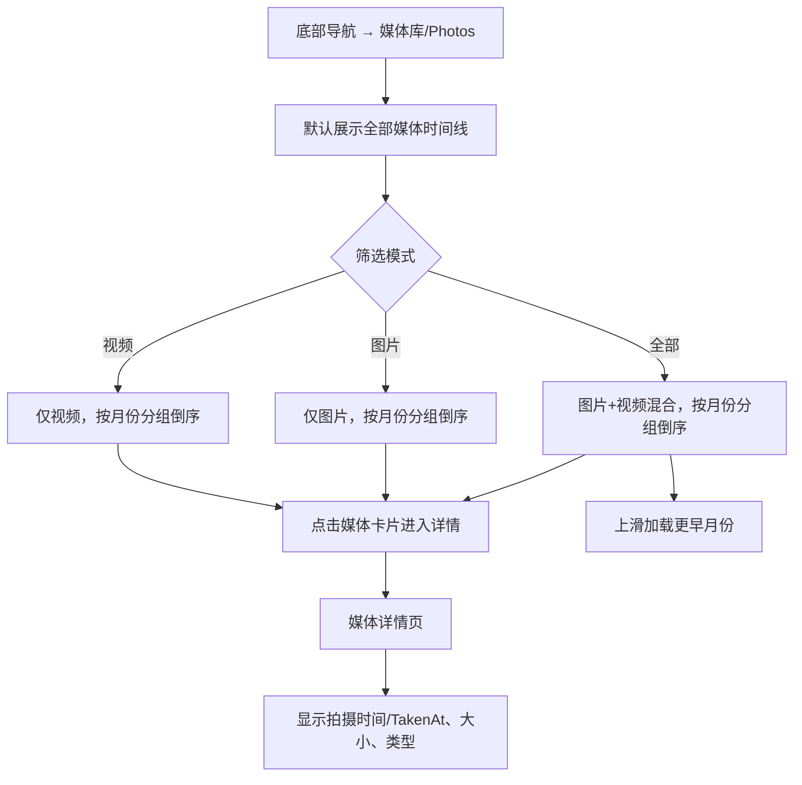
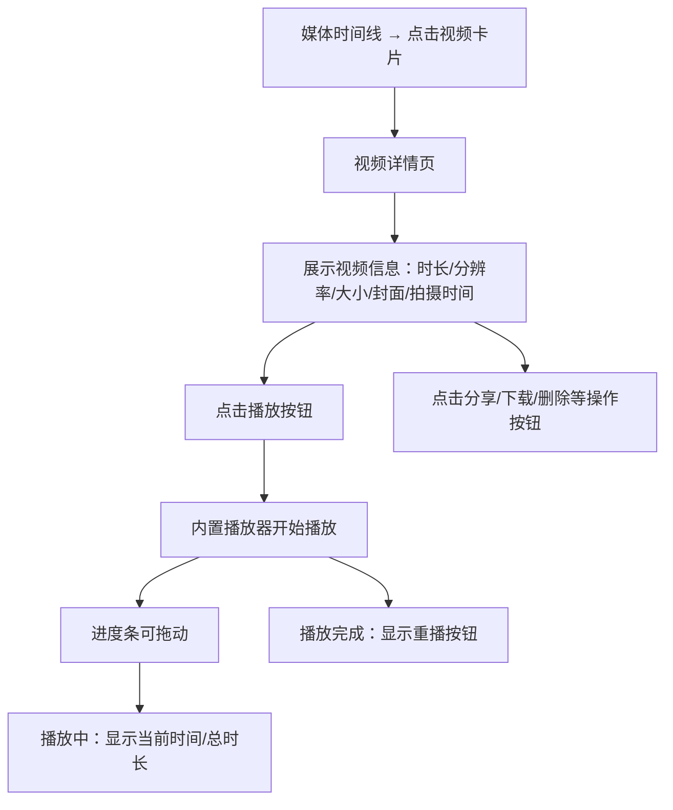
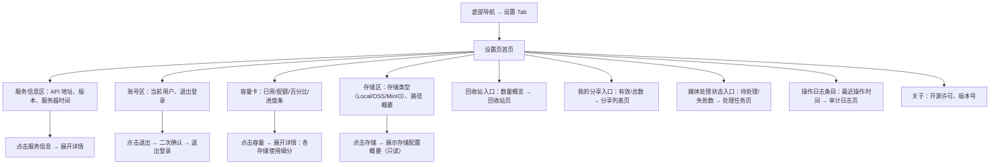
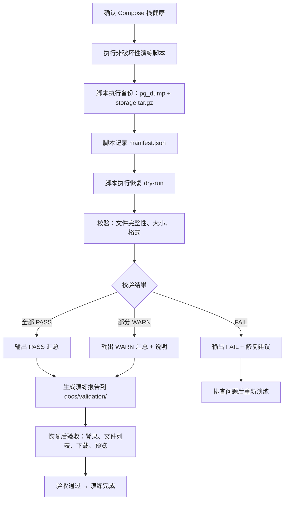
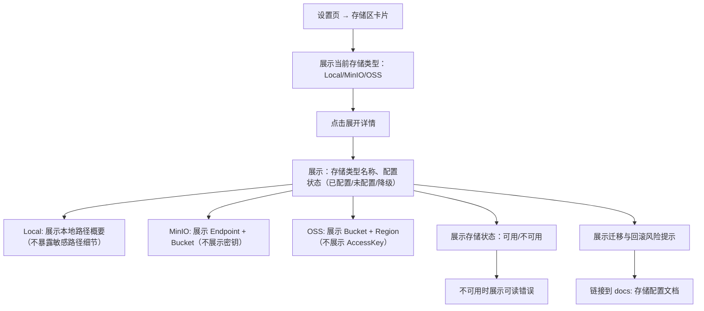
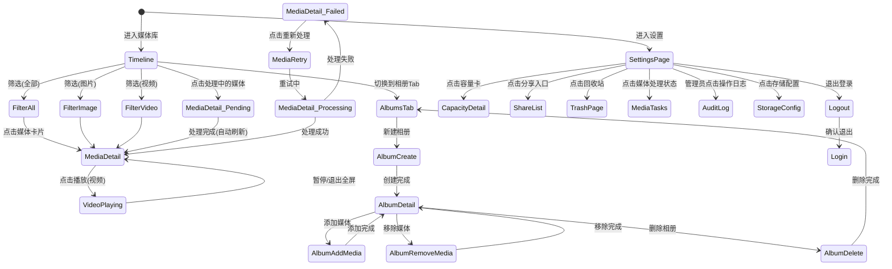

# PrivateCloudDrive V1.2 RC — 用户旅程与场景矩阵

日期：2026-07-09
角色：业务分析师 / Hermes-Business-Analyst
基线来源：`docs/scenario-matrix-v1.1.md`（V1.1 文件管理场景矩阵）、`docs/scenario-matrix-v1.0-rc.md`（V1.0 RC 场景矩阵）、`docs/product-planning-hub.md`（§6 Now 矩阵）、`docs/product-roadmap-next.md`（§4.3 V1.2 媒体库产品化）、`docs/release-plan-v1.1.md`、`docs/disaster-recovery.md`
版本定位：V1.2 RC（Productization Release Candidate）— 把已实现的媒体库、文件管理、分享、OSS 等能力收口为可发布、可部署、可验收、可长期使用的版本

---

## 1. 管理结论

V1.2 RC 的核心目标不是新增大规模功能，而是 **把已有的 V1.2 媒体库能力（时间线、相册、处理状态、视频增强）和 V1.0 RC/V1.1 已实现的全部文件管理能力，收口为可发布、可部署、可验收、可长期使用的发布候选版本**。

本场景矩阵在 V1.0 RC（部署/升级/健康/忘记密码）和 V1.1（搜索/排序/批量/容量/分享管理/上传队列/重命名移动）基础上，聚焦以下 7 个 V1.2 RC 新增与增强用户旅程：

| 优先级 | 用户旅程 | 类型 | 对应 V1.2 RC 产品化维度 |
|--------|----------|------|--------------------------|
| P0 | 媒体时间线浏览 | 新增 V1.2 | 按拍摄时间/上传时间分组浏览图片与视频 |
| P0 | 媒体处理状态可见与重试 | 新增 V1.2 | Pending/Processing/Failed 状态可见，失败原因脱敏，重试入口 |
| P0 | 视频详情与播放体验增强 | 新增 V1.2 | 视频时长、分辨率、封面、大小展示，播放器交互优化 |
| P1 | 相册创建与管理 | 新增 V1.2 | 手动创建相册，添加/移除媒体，设置封面，删除不删原文件 |
| P0 | 设置页信息架构收口 | 产品化 | 服务状态、容量、存储、日志、分享、回收站、媒体处理入口统一 |
| P0 | 数据备份与恢复演练 | 产品化 | 非破坏性演练流程、演练报告、恢复后验收清单 |
| P1 | OSS 存储理解与边界 | 产品化 | 本地/MinIO/Aliyun OSS 边界说明、配置风险、迁移与回滚注意 |

**本矩阵不重复 V1.0 RC 和 V1.1 已完整覆盖的场景**（部署、升级、日常文件管理、健康检查排障、忘记密码、搜索、排序筛选、批量操作、容量展示、分享管理、上传队列、重命名移动），上述场景的验收条件在本版本中仍然有效。本矩阵只定义 V1.2 RC 新增和增强内容。

---

## 2. 用户角色定义

沿用 V1.0 RC 角色体系，新增「媒体浏览者」视角：

| 角色 | 代号 | 技术能力 | 主要关注 | 设备 |
|------|------|----------|----------|------|
| 独立部署者 | DEPLOYER | 能执行命令行、编辑 .env | 部署成功、数据安全 | 桌面端 + Docker |
| 日常文件用户 | USER | 只使用 MAUI App | 文件能上传/下载/预览/删除 | Android 手机 |
| 家庭媒体用户 | MEDIA_USER | 只使用 MAUI App，以照片/视频为主 | 媒体能预览、不丢失、按时间查看 | Android 手机 |
| 部署管理员 | ADMIN | 熟悉 Docker、CLI 和基本排障 | 系统健康、故障定位、备份恢复 | 桌面端 + Docker |
| 非技术使用者 | NON_TECH | 只使用 App，不接触命令行 | 一切能在 App 内完成 | Android 手机 |

> V1.2 RC 不引入新角色。MEDIA_USER 是 V1.2 媒体库功能的核心受益者。

---

## 3. 用户故事全集

---

### 3.1 US-V12RC-01：媒体时间线浏览（P0）

**As a** 家庭媒体用户 (MEDIA_USER / USER)
**I want** 按拍摄时间或上传时间以时间线形式浏览我的所有图片和视频，并可筛选只看图片或只看视频
**So that** 我不需要在文件夹中翻找，可以像手机相册一样按时间回顾我的媒体内容

#### 3.1.1 正常路径



**业务规则：**

| 规则编号 | 规则 | 原因 |
|----------|------|------|
| BR-TIMELINE-01 | 时间线优先按 `TakenAt`（拍摄时间）排序，无 `TakenAt` 时降级为 `CreationTime`（上传时间） | 用户期望按拍摄时间回顾照片 |
| BR-TIMELINE-02 | 时间线按月份分组（如"2026 年 6 月"），每组内按日倒序 | 符合手机相册的用户预期 |
| BR-TIMELINE-03 | 筛选切换时保持当前滚动位置，不跳回顶部 | 避免用户丢失浏览上下文 |
| BR-TIMELINE-04 | 时间线范围限制为当前用户 + 当前租户，不能看到其他用户的媒体 | 安全隔离 |
| BR-TIMELINE-05 | 媒体卡片展示缩略图（图片/视频封面），缩略图不泄露物理路径 | 安全原则 |
| BR-TIMELINE-06 | 无 `TakenAt` 的媒体使用 `CreationTime` 并标注"未知拍摄时间，按上传时间显示" | 透明降级 |
| BR-TIMELINE-07 | 分页加载，每次加载 50 条，上滑追加 | 性能考虑，避免一次性加载过多 |
| BR-TIMELINE-08 | 删除操作后从时间线移除，回收站可见 | 与 V1.0 RC 回收站行为一致 |

#### 3.1.2 异常路径与用户可见错误

| 异常场景 | 触发条件 | 系统行为 | 用户可见信息 | 解决方案入口 |
|----------|----------|----------|-------------|-------------|
| TIMELINE-ERR-01 | 时间线 API 超时或 500 | 展示网络错误状态 | "时间线加载失败，请下拉刷新重试" | 下拉刷新 |
| TIMELINE-ERR-02 | 网络断开 | 请求失败 | "网络连接已断开" | 检查网络后刷新 |
| TIMELINE-ERR-03 | 无媒体文件 | 展示空状态 | "暂无媒体文件，上传您的第一张照片吧" | 引导上传 |
| TIMELINE-ERR-04 | 筛选切换后无匹配结果 | 展示空状态 | "没有找到符合条件的媒体" | 切换筛选 |
| TIMELINE-ERR-05 | token 过期 | API 401 | "登录已过期，请重新登录" | 跳转登录页 |
| TIMELINE-ERR-06 | 媒体文件已在服务端被删除（并发操作） | 卡片展示"文件已不存在" | "此文件已不存在" | 刷新时间线 |

#### 3.1.3 验收条件

| 验收项 | 方法 | 预期 |
|--------|------|------|
| US-V12RC-01-AC01 | 进入媒体库页面 | 默认展示全部媒体时间线，按月份分组 |
| US-V12RC-01-AC02 | 拍摄时间不同的图片和视频混合上传 | 按 TakenAt 倒序正确分组 |
| US-V12RC-01-AC03 | 切换筛选为"图片" | 仅显示图片，不显示视频 |
| US-V12RC-01-AC04 | 上滑加载更多 | 追加更早月份的内容 |
| US-V12RC-01-AC05 | 上传无 EXIF/无 TakenAt 的图片 | 使用上传时间显示，无崩溃 |
| US-V12RC-01-AC06 | 媒体详情页点击打开 | 显示拍摄时间、大小、类型 |
| US-V12RC-01-AC07 | 空媒体库页面 | 显示引导上传的空状态 |

---

### 3.2 US-V12RC-02：媒体处理状态可见与重试（P0）

**As a** 家庭媒体用户 (MEDIA_USER / USER)
**I want** 上传图片或视频后，能看到它们的处理进度（缩略图生成、元数据提取），失败时能看到原因并可重试
**So that** 我不必猜测后台工作是否正常，并能自行解决处理失败的媒体

#### 3.2.1 正常路径

```mermaid
flowchart TD
    A[上传图片/视频] --> B[后端创建 MediaAsset]
    B --> C[MediaAsset 状态: Pending]
    C --> D[media-worker 开始处理]
    D --> E[MediaAsset 状态: Processing]
    E --> F{处理结果}
    F -->|成功| G[MediaAsset 状态: Completed]
    F -->|失败| H[MediaAsset 状态: Failed]
    G --> I[缩略图、元数据、封面就绪]
    H --> J[记录脱敏错误摘要]
    C --> K[用户在媒体库/详情页看到 Pending 状态]
    E --> L[用户在媒体库/详情页看到 Processing 状态]
    H --> M[用户在详情页看到失败状态 + 脱敏原因]
    M --> N[点击"重新处理"按钮]
    N --> O[后端重置为 Pending → media-worker 重新处理]
    O --> P[状态流转 Processing → Completed/Failed]
```

**业务规则：**

| 规则编号 | 规则 | 原因 |
|----------|------|------|
| BR-MEDIASTAT-01 | 媒体处理状态为：Pending → Processing → Completed / Failed | 清晰的状态机 |
| BR-MEDIASTAT-02 | Pending 和 Processing 状态在卡片上使用"处理中"标签，不展示空白 | 状态透明 |
| BR-MEDIASTAT-03 | Failed 状态的媒体，详情页展示脱敏错误摘要（如"缩略图生成失败"），不暴露堆栈或服务器路径 | 安全原则 |
| BR-MEDIASTAT-04 | Failed 媒体在详情页提供"重新处理"按钮 | 用户自助修复 |
| BR-MEDIASTAT-05 | 重新处理后，状态重新流转 Pending → Processing → Completed/Failed | 完整状态循环 |
| BR-MEDIASTAT-06 | Pending/Processing 媒体在预览时不展示缩略图/封面，展示"处理中"占位图 | 不展示已删除/错误内容 |
| BR-MEDIASTAT-07 | 已完成处理的媒体，缩略图和元数据在重新处理前保持不变 | 不影响正常使用 |
| BR-MEDIASTAT-08 | Failed 媒体的错误摘要不允许包含：服务器物理路径、DB 连接字符串、密钥、堆栈详情 | 安全脱敏 |
| BR-MEDIASTAT-09 | 媒体处理失败不影响媒体文件本身的存在和可下载性 | 文件本身不受影响 |
| BR-MEDIASTAT-10 | 管理员可通过设置页查看全部分媒体任务状态和批量重试入口（P1 见 US-V12RC-06） | 管理运维 |

#### 3.2.2 异常路径与用户可见错误

| 异常场景 | 触发条件 | 系统行为 | 用户可见信息 | 解决方案入口 |
|----------|----------|----------|-------------|-------------|
| MEDIASTAT-ERR-01 | 媒体处理持续失败（如 FFmpeg 不可用） | 状态卡在 Failed | "媒体处理失败：请检查服务端 FFmpeg 配置" | 联系管理员 |
| MEDIASTAT-ERR-02 | 重新处理后仍然失败 | 状态回到 Failed | "重新处理失败，请稍后重试或联系管理员" | 再次重试/联系管理员 |
| MEDIASTAT-ERR-03 | 媒体文件在后台处理期间被用户删除 | 处理完成后清理 | 媒体在时间线中不再可见 | 回收站可恢复 |
| MEDIASTAT-ERR-04 | 详情页加载时网络断开 | 状态信息不可用 | "处理状态加载失败" | 刷新 |
| MEDIASTAT-ERR-05 | 并发重试（用户快速多次点击） | 后端幂等处理，仅触发一次 | 无异常 | 正常流程 |
| MEDIASTAT-ERR-06 | 媒体格式不被 FFmpeg 识别 | 处理失败，记录错误 | "不支持的媒体格式，无法生成预览" | 重新处理（如格式已修正） |

#### 3.2.3 验收条件

| 验收项 | 方法 | 预期 |
|--------|------|------|
| US-V12RC-02-AC01 | 上传一张图片，立即刷新媒体库 | 卡片显示"处理中"状态标签 |
| US-V12RC-02-AC02 | 等待处理完成 | 状态变为 Completed，缩略图可见 |
| US-V12RC-02-AC03 | 模拟处理失败（如删除 FFmpeg） → 上传视频 | 卡片或详情页显示 Failed 状态和脱敏错误 |
| US-V12RC-02-AC04 | Failed 媒体点击"重新处理" | 状态回到 Processing，处理完成后为 Completed |
| US-V12RC-02-AC05 | Failed 媒体的详情页 | 不暴露堆栈/路径/密钥，错误摘要可读 |
| US-V12RC-02-AC06 | Pending/Processing 媒体打开详情 | 展示"处理中"占位图，不是空白/错误 |
| US-V12RC-02-AC07 | 快速多次点击重新处理 | 仅触发一次重新处理 |

---

### 3.3 US-V12RC-03：视频详情与播放体验增强（P0）

**As a** 家庭媒体用户 (MEDIA_USER / USER)
**I want** 在视频详情页看到视频的时长、分辨率、文件大小和封面，并能流畅地播放和拖动进度
**So that** 我在下载或分享前就能了解视频的基本信息，并且无需下载即可预览

#### 3.3.1 正常路径



**业务规则：**

| 规则编号 | 规则 | 原因 |
|----------|------|------|
| BR-VIDEO-01 | 视频详情页展示：时长（mm:ss/hh:mm:ss）、分辨率（宽×高）、文件大小、封面（视频首帧/指定帧） | 用户决策所需信息 |
| BR-VIDEO-02 | 视频封面优先使用 media-worker 提取的首帧或指定帧，无封面时使用文件类型图标 | 一致性体验 |
| BR-VIDEO-03 | 视频播放器支持 HTTP Range 请求，拖动进度条时可跳转到近似的未缓冲位置 | 流畅播放体验 |
| BR-VIDEO-04 | 播放器不自动下载完整文件，仅流式加载 | 节省移动流量 |
| BR-VIDEO-05 | 视频元数据（时长/分辨率）由媒体处理任务提取，Completed 后才展示完整 | 数据完整性 |
| BR-VIDEO-06 | 播放器适配屏幕方向：全屏时可横屏播放 | 移动设备预期行为 |
| BR-VIDEO-07 | 视频播放器提供基本的播放控制：播放/暂停、进度条、全屏、音量 | 用户控制权 |
| BR-VIDEO-08 | 视频分辨率列表不包含"4K/8K"标签，仅展示实际像素值（如 1920×1080） | 数据真实性 |

#### 3.3.2 异常路径与用户可见错误

| 异常场景 | 触发条件 | 系统行为 | 用户可见信息 | 解决方案入口 |
|----------|----------|----------|-------------|-------------|
| VIDEO-ERR-01 | 视频处理未完成（Pending/Processing） | 展示"处理中"状态，播放按钮不可用 | "视频正在处理中，请稍后查看" | 稍后刷新 |
| VIDEO-ERR-02 | 视频处理失败 | 展示 Failed 状态，播放按钮不可用 | "视频处理失败，无法播放" | 重试处理（US-V12RC-02） |
| VIDEO-ERR-03 | Range 请求失败/不支持 | 降级为完整下载后播放 | "视频加载中..."（进度条不精确） | 等待完整缓冲 |
| VIDEO-ERR-04 | 网络中断导致播放停止 | 播放器暂停，显示缓冲图标 | "网络连接已断开，视频暂停播放" | 网络恢复后继续 |
| VIDEO-ERR-05 | 视频格式不被播放器支持 | 播放按钮不可用或播放失败 | "此视频格式暂不支持播放，请下载后使用本地播放器" | 下载后用本地播放器 |
| VIDEO-ERR-06 | 视频文件在播放前被用户（或其他端）删除 | 详情页返回 404 | "视频文件已不存在" | 返回时间线 |
| VIDEO-ERR-07 | token 过期时尝试播放 | API 401 | "登录已过期，请重新登录" | 跳转登录页 |

#### 3.3.3 验收条件

| 验收项 | 方法 | 预期 |
|--------|------|------|
| US-V12RC-03-AC01 | 上传一个 MP4 视频，处理完成后打开详情页 | 展示时长、分辨率、大小、封面 |
| US-V12RC-03-AC02 | 点击播放按钮 | 视频开始播放，进度条可用 |
| US-V12RC-03-AC03 | 拖动进度条到后半部分 | 视频跳转到对应位置继续播放 |
| US-V12RC-03-AC04 | 进入全屏模式 | 视频横屏全屏播放 |
| US-V12RC-03-AC05 | Pending 状态的视频打开详情 | 展示"处理中"，播放按钮不可用 |
| US-V12RC-03-AC06 | 播放时断开网络 | 播放器暂停，显示网络断开提示 |

---

### 3.4 US-V12RC-04：相册创建与管理（P1）

**As a** 家庭媒体用户 (MEDIA_USER)
**I want** 创建命名的相册，从时间线中选择图片和视频加入相册，可移除或设置封面
**So that** 我可以按事件或主题（如"旅行"、"宝宝的第一个月"）组织我的媒体内容

#### 3.4.1 正常路径

```mermaid
flowchart TD
    A[媒体库 → 相册 Tab] --> B[展示相册列表（含封面和媒体数量）]
    B --> C[点击"新建相册"]
    C --> D[输入相册名称]
    D --> E[相册创建成功]
    E --> F[进入相册详情页（当前为空）]
    F --> G[点击"添加媒体"]
    G --> H[从时间线勾选媒体]
    H --> I[确定添加]
    I --> J[媒体出现在相册中]
    F --> K[点击封面设置]
    K --> L[从相册中选择一张图片设为封面]
    F --> M[点击移除媒体（长按或编辑模式）]
    M --> N[确认移除（不删除原文件）]
    B --> O[点击删除相册]
    O --> P[确认删除相册]
    P --> Q[相册删除，原媒体不受影响]
```

**业务规则：**

| 规则编号 | 规则 | 原因 |
|----------|------|------|
| BR-ALBUM-01 | 相册名称不能为空，最大 100 字符 | 数据完整性 |
| BR-ALBUM-02 | 相册名称在用户范围内可重名（不强制唯一） | 用户可以有"旅行"等同名不同相册 |
| BR-ALBUM-03 | 一个媒体可以加入多个相册（多对多关系） | 灵活组织 |
| BR-ALBUM-04 | 从相册中移除媒体不删除原文件，原文件仍在时间线中 | 防止误删 |
| BR-ALBUM-05 | 删除相册不删除相册内的任何原始媒体文件 | 安全性设计 |
| BR-ALBUM-06 | 相册封面默认为最近添加的图片；用户可手动更换 | 用户控制 |
| BR-ALBUM-07 | 相册列表展示：封面缩略图、相册名、媒体数量 | 足够信息一览 |
| BR-ALBUM-08 | 相册仅自己可见，其他用户/租户不共享相册 | 权限隔离 |
| BR-ALBUM-09 | 添加媒体时，时间线按倒序展示，可选择多个媒体 | 操作效率 |

#### 3.4.2 异常路径与用户可见错误

| 异常场景 | 触发条件 | 系统行为 | 用户可见信息 | 解决方案入口 |
|----------|----------|----------|-------------|-------------|
| ALBUM-ERR-01 | 相册名称超出字符限制 | 前端校验 | "相册名称不能超过 100 个字符" | 修改名称 |
| ALBUM-ERR-02 | 媒体已存在于相册中 | 添加时自动跳过重复项 | 部分媒体已存在，跳过添加；提示"X 个媒体已在相册中" | 无需操作 |
| ALBUM-ERR-03 | 添加媒体时选中了 0 个 | 确认按钮不可用 | 弹窗提示"请选择至少一个媒体" | 选择媒体后重试 |
| ALBUM-ERR-04 | 相册封面设置失败（API 错误） | 保持原封面 | "封面设置失败，请稍后重试" | 重试 |
| ALBUM-ERR-05 | 删除相册时网络断开 | 弹窗后无响应 | "操作失败，请稍后重试" | 重试 |
| ALBUM-ERR-06 | 相册中唯一媒体被服务器端删除 | 相册显示"文件已不存在" | "此媒体已不存在" | 移除该条目 |

#### 3.4.3 验收条件

| 验收项 | 方法 | 预期 |
|--------|------|------|
| US-V12RC-04-AC01 | 新建相册 → 输入名称 | 相册出现在列表中 |
| US-V12RC-04-AC02 | 进入相册 → 从时间线添加 3 张图片 | 图片出现在相册中 |
| US-V12RC-04-AC03 | 从相册中移除一张图片 | 图片从相册消失，仍存在于时间线 |
| US-V12RC-04-AC04 | 设置相册封面 | 封面更新为用户选择的图片 |
| US-V12RC-04-AC05 | 删除相册 | 相册消失，原媒体仍在时间线中 |
| US-V12RC-04-AC06 | 空相册列表 | 显示引导文案"创建第一个相册" |
| US-V12RC-04-AC07 | 同一媒体加入两个不同相册 | 两个相册中都能看到该媒体 |

---

### 3.5 US-V12RC-05：设置页信息架构收口（P0）

**As a** 所有用户 (USER / MEDIA_USER / ADMIN / NON_TECH)
**I want** 在设置页一个入口中看到服务信息、账号信息、容量使用、存储配置、操作日志、分享管理、回收站和媒体处理状态的统一入口
**So that** 我不需要在 App 的多个地方寻找配置和运维功能，所有管理和了解系统的地方集中在一起

#### 3.5.1 正常路径



**业务规则：**

| 规则编号 | 规则 | 原因 |
|----------|------|------|
| BR-SETTINGS-01 | 设置页首页按功能区分为若干卡片/分组，排列顺序按重要性递减 | 信息架构清晰 |
| BR-SETTINGS-02 | 服务信息卡展示：API BaseUrl（不可编辑）、后端版本号、服务器当前时间 | 诊断用信息 |
| BR-SETTINGS-03 | 容量卡展示已用/配额/剩余/百分比，API 失败时降级展示"容量信息暂时不可用" | 可靠性设计 |
| BR-SETTINGS-04 | 容量卡不展示服务器物理路径、磁盘挂载点等敏感信息 | 安全原则 |
| BR-SETTINGS-05 | 存储区仅展示存储类型（Local/MinIO/OSS）和配置状态（已配置/未配置），不展示凭据 | 只读展示 |
| BR-SETTINGS-06 | 回收站入口展示回收站中文件数量（字符串，如"3 项"），点击进入回收站页 | 导航入口 |
| BR-SETTINGS-07 | 我的分享入口展示有效分享数量（如"2 个有效"），点击进入分享管理页 | 导航入口 |
| BR-SETTINGS-08 | 媒体处理状态入口展示待处理和失败任务数量，点击进入处理任务页 | 运维闭环 |
| BR-SETTINGS-09 | 退出登录必须有二次确认弹窗 | 防误触 |
| BR-SETTINGS-10 | 设置页所有 API 调用失败时展示 Degraded 状态，不阻塞其他功能 | 容错设计 |
| BR-SETTINGS-11 | 管理员可见隐藏入口：操作日志（全量/按用户筛选）、健康状态简版 | 与普通用户区分 |

#### 3.5.2 异常路径与用户可见错误

| 异常场景 | 触发条件 | 系统行为 | 用户可见信息 | 解决方案入口 |
|----------|----------|----------|-------------|-------------|
| SETT-ERR-01 | 容量 API 失败 | 容量卡展示 Degraded | "容量信息暂时不可用" | 下拉刷新 |
| SETT-ERR-02 | 服务信息 API 失败 | 服务区部分信息不可用 | "服务状态暂时不可用" | 刷新 |
| SETT-ERR-03 | 回收站、分享、媒体任务计数 API 部分失败 | 单个入口展示错误，其他正常 | 失败入口: "—" 或 "状态不可用" | 单独点击刷新 |
| SETT-ERR-04 | token 过期 | 设置页加载失败 | "登录已过期，请重新登录" | 跳转登录页 |
| SETT-ERR-05 | 管理员可见入口但非管理员访问 | 隐藏入口不显示 | — | — |
| SETT-ERR-06 | 退出登录 API 失败 | 不退出，展示错误 | "退出失败，请稍后重试" | 重试 |

#### 3.5.3 验收条件

| 验收项 | 方法 | 预期 |
|--------|------|------|
| US-V12RC-05-AC01 | 打开设置页 | 展示服务信息、账号、容量、存储、回收站、分享、媒体任务、关于等卡片 |
| US-V12RC-05-AC02 | 查看容量进度条 | 显示已用/配额/百分比 |
| US-V12RC-05-AC03 | 点击我的分享入口 | 跳转到分享管理页 |
| US-V12RC-05-AC04 | 点击回收站入口 | 进入回收站页 |
| US-V12RC-05-AC05 | 点击退出登录 | 二次确认后退出到登录页 |
| US-V12RC-05-AC06 | 管理员查看设置页 | 可见操作日志、健康状态等管理员专属入口 |
| US-V12RC-05-AC07 | 普通用户查看设置页 | 不可见管理员入口 |
| US-V12RC-05-AC08 | 中断 API 后刷新设置页 | 各卡片展示 Degraded 状态，不崩溃 |

---

### 3.6 US-V12RC-06：数据备份与恢复演练（P0）

**As a** 部署管理员 (ADMIN / DEPLOYER)
**I want** 能执行非破坏性的备份恢复演练，生成可验证的演练报告，了解灾难恢复的完整流程
**So that** 当真实灾难发生时，我有经过演练的恢复 SOP，可以自信地恢复全部数据

#### 3.6.1 正常路径



**业务规则：**

| 规则编号 | 规则 | 原因 |
|----------|------|------|
| BR-BACKUP-01 | 备份必须包含：PostgreSQL 导出（pg_dump）、Local storage 归档（storage.tar.gz）、manifest.json | 最小恢复数据集 |
| BR-BACKUP-02 | 备份必须脱敏：.env 中的密码/密钥不进入备份包；演练报告禁止记录密码/token/密钥 | 安全原则 |
| BR-BACKUP-03 | 非破坏性演练 dry-run 不能改动数据库和 storage volume | 安全演练 |
| BR-BACKUP-04 | 破坏性恢复只能在一次性测试栈或明确授权的目标栈上执行 | 保护生产数据 |
| BR-BACKUP-05 | 演练报告写入 `docs/validation/backup-restore-drill-YYYYMMDD-HHMMSS.md` | 可追溯可审计 |
| BR-BACKUP-06 | 恢复后验收必须覆盖：登录、文件列表、下载、图片预览、视频播放、分享链接、回收站 | 全链路验证 |
| BR-BACKUP-07 | 演练报告不能包含：.env 原文、access token、refresh token、OAuth code、client secret | 安全审计 |
| BR-BACKUP-08 | `.env` 建议存储在加密备份介质，明确"本仓库不存储 .env.secret" | 安全操作规范 |

#### 3.6.2 异常路径与用户可见错误

| 异常场景 | 触发条件 | 系统行为 | 用户可见信息 | 解决方案入口 |
|----------|----------|----------|-------------|-------------|
| BACKUP-ERR-01 | PostgreSQL 不可达 | 备份脚本退出 | "数据库连接失败，请确认 PostgreSQL 是否正常运行" | 检查 DB 健康 |
| BACKUP-ERR-02 | storage volume 找不到 | 备份脚本警告并跳过 | "Storage volume 未找到，文件归档已跳过" | 检查 volume 名 |
| BACKUP-ERR-03 | 备份目录已存在 | 备份脚本提示覆盖选择 | "备份目录已存在，请指定新目录或确认覆盖" | 用户确认 |
| BACKUP-ERR-04 | pg_dump 导出文件为空 | 备份脚本校验失败 | "数据库导出异常：pg_dump 输出为空" | 检查数据库和权限 |
| BACKUP-ERR-05 | 恢复 dry-run 时 manifest.json 缺失 | dry-run 失败 | "备份目录无效：manifest.json 缺失" | 检查备份完整性 |
| BACKUP-ERR-06 | 恢复后验收失败（如文件数量不匹配） | 演练报告标记 FAIL | "恢复后验收失败：[具体项]" | 按失败项排查 |
| BACKUP-ERR-07 | 磁盘空间不足无法创建备份 | 备份脚本退出 | "磁盘空间不足，无法创建备份" | 清理磁盘后重试 |
| BACKUP-ERR-08 | Compose 项目名与备份记录不匹配 | dry-run 警告 | "当前 Compose 项目名与备份记录不一致，请确认" | 确认后继续 |

#### 3.6.3 验收条件

| 验收项 | 方法 | 预期 |
|--------|------|------|
| US-V12RC-06-AC01 | 运行 `run-backup-restore-drill.ps1` | 脚本完成，输出 PASS 汇总 |
| US-V12RC-06-AC02 | 检查备份目录 | 存在 manifest.json、postgres.dump、storage.tar.gz |
| US-V12RC-06-AC03 | 检查演练报告 | 报告写入 docs/validation/，不含敏感信息 |
| US-V12RC-06-AC04 | 运行 dry-run | 仅校验，不修改数据库和 volume |
| US-V12RC-06-AC05 | PostgreSQL 断开时运行备份 | 脚本拒绝，输出可读错误 |
| US-V12RC-06-AC06 | 恢复后验收清单完成 | 登录、列表、下载、预览、分享、回收站均正常 |
| US-V12RC-06-AC07 | 演练报告无 secret/密码/token 泄露 | 报告内容符合脱敏规范 |

---

### 3.7 US-V12RC-07：OSS 存储理解与边界（P1）

**As a** 部署管理员 (ADMIN / DEPLOYER)
**I want** 在设置页能看到当前存储配置的类型（Local/MinIO/Aliyun OSS），了解其边界和风险，知道如何配置和迁移
**So that** 我能评估当前存储方案的适用性，并理解切换到 OSS 或 MinIO 的前提条件和风险

#### 3.7.1 正常路径



**业务规则：**

| 规则编号 | 规则 | 原因 |
|----------|------|------|
| BR-OSS-01 | 存储配置页只读展示，不提供修改入口 | 修改存储配置风险高，需要 CLI/运维操作 |
| BR-OSS-02 | 不展示 AccessKey、SecretKey、连接字符串等凭据信息 | 安全原则 |
| BR-OSS-03 | 不展示物理路径细节（如 `/app/storage/...`） | 安全原则 |
| BR-OSS-04 | 不可用的存储展示 Degraded 状态和原因，不阻塞 App 其他功能 | 容错 |
| BR-OSS-05 | 存储详情页提供文档链接指向存储配置和管理说明 | 用户自助 |
| BR-OSS-06 | 迁移和回滚风险提示包括：数据一致性、迁移期间上传不可用、回滚可能丢失增量数据 | 风险透明 |
| BR-OSS-07 | OSS/MinIO 的配置状态可从 API 获取（`GET /api/settings/storage-config`） | 统一数据来源 |

#### 3.7.2 异常路径与用户可见错误

| 异常场景 | 触发条件 | 系统行为 | 用户可见信息 | 解决方案入口 |
|----------|----------|----------|-------------|-------------|
| OSS-ERR-01 | 存储配置 API 超时或 500 | 设置页展示 Degraded | "存储配置信息暂时不可用" | 刷新 |
| OSS-ERR-02 | OSS/MinIO 凭据无效导致存储不可用 | 状态展示为不可用 | "对象存储连接失败，请检查配置" | 更新配置后重启 |
| OSS-ERR-03 | 非管理员用户打开存储配置 | 存储区不展示详情 | 仅"当前存储类型: Local" | — |
| OSS-ERR-04 | 存储类型配置变更但未重启 API | API 缓存的配置与运行时不匹配 | "存储配置可能已变更，建议重启服务" | 重启 API |
| OSS-ERR-05 | 存储 API 返回的配置包含敏感字段未脱敏 | 后端 DTO 已保证不泄露 | — | 后端审计 |

#### 3.7.3 验收条件

| 验收项 | 方法 | 预期 |
|--------|------|------|
| US-V12RC-07-AC01 | 打开设置页存储区 | 展示当前存储类型 |
| US-V12RC-07-AC02 | 管理员展开存储详情 | 展示配置状态（已配置/未配置）和连接端点(脱敏) |
| US-V12RC-07-AC03 | 检查存储详情页 | 不展示 AccessKey/SecretKey/物理路径 |
| US-V12RC-07-AC04 | 存储不可用时的页面 | 展示 Degraded 状态，App 不崩溃 |
| US-V12RC-07-AC05 | 普通用户查看存储 | 仅展示存储类型名称，无详情 |
| US-V12RC-07-AC06 | 存储详情页包含文档链接 | 链接指向存储配置文档 |

---

## 4. 状态机总览（V1.2 RC 新增状态）



---

## 5. 用户状态/页面状态定义（V1.2 RC 补充）

在 V1.0 RC 和 V1.1 页面状态基础上，V1.2 RC 新增以下页面级状态：

| 状态 | 定义 | 通用处理 |
|------|------|----------|
| 时间线加载中 | 进入媒体库/刷新后首次加载时间线 | 骨架屏或加载指示器 |
| 时间线空结果 | 筛选后无匹配媒体 | 友好提示 + 上传引导 |
| 时间线加载更多中 | 上滑触发分页加载 | 底部加载指示器 |
| 媒体详情加载中 | 点击媒体卡片后加载详情 | 骨架屏 |
| 媒体处理中 | Pending 或 Processing 状态的媒体卡片 | 标签展示"处理中" |
| 媒体处理失败 | Failed 状态媒体，展示可读错误 + 重试按钮 | "失败：[原因]" + 重新处理按钮 |
| 相册列表空 | 无相册 | "创建您的第一个相册"引导按钮 |
| 相册媒体空 | 相册内无媒体 | "添加媒体"引导按钮 |
| 相册添加媒体中 | 从时间线选择媒体 | 勾选框 + 已选计数 + 确认按钮 |
| 视频播放中 | 视频在播放器中播放 | 显示当前时间/总时长、进度条 |
| 视频缓冲中 | 网络慢时播放器缓冲 | 缓冲图标 + 已缓冲进度 |
| 设置页加载中 | 设置页多个数据源聚合加载 | 分卡片加载（先加载容量，再加载分享计数等） |
| 设置页 Degraded | 部分数据源不可用 | 单卡片降级，其他正常 |
| 存储配置只读 | 管理员存储详情页 | 不展示修改/编辑入口 |
| 备份演练进行中 | 后台脚本执行备份和 dry-run | 终端显示进度（非 App 内） |
| 备份演练完成 | 脚本执行完毕 | 终端输出 PASS/WARN/FAIL 汇总 |

---

## 6. 接口/页面依赖矩阵

| 场景 | 依赖 API | 依赖页面 | 依赖配置 |
|------|----------|----------|----------|
| US-V12RC-01 媒体时间线 | `GET /api/file-center/media/timeline`（V1.2 新增/扩展） | 媒体库 Photos 页，时间线容器 | 无新增配置 |
| US-V12RC-01 筛选切换 | `GET /api/file-center/media/timeline?type={all|image|video}` | 筛选 Tabs 组件 | 无新增配置 |
| US-V12RC-01 分页 | `GET /api/file-center/media/timeline?...&skipCount=X&maxResultCount=50` | 上滑加载触发 | 每页 50 条 |
| US-V12RC-02 处理状态 | 已有 MediaAsset 扩展返回状态字段；`POST /api/file-center/media/{id}/retry`（新增） | 媒体详情页，媒体卡片 | 无新增配置 |
| US-V12RC-03 视频详情 | `GET /api/file-center/media/{id}` 扩展返回 duration/resolution/coverUrl | 视频详情页，播放器组件 | FFmpeg（已有） |
| US-V12RC-03 视频播放 | `GET /api/file-storage/{id}/download`（Range 支持已有） | 视频播放器页面 | 无新增配置 |
| US-V12RC-04 相册 CRUD | `POST /api/file-center/albums`、`GET ...`、`PUT ...`、`DELETE ...`（V1.2 新增） | 相册 Tab，相册详情页，添加媒体页 | 无新增配置 |
| US-V12RC-04 相册成员管理 | `POST /api/file-center/albums/{id}/media`、`DELETE .../media/{mediaId}`、`PUT .../cover` | 相册详情编辑模式 | 无新增配置 |
| US-V12RC-05 设置页数据聚合 | `GET /api/file-center/storage/usage`（V1.1 已有），`GET /api/settings/overview`（V1.2 新增聚合接口或客户端聚合） | 设置页首页 | 无新增配置 |
| US-V12RC-05 媒体任务计数 | `GET /api/file-center/media/tasks/summary`（V1.2 新增） | 设置页媒体任务入口 | 无新增配置 |
| US-V12RC-06 备份恢复 | `scripts/backup-local-stack.ps1`、`scripts/restore-local-stack.ps1`、`scripts/run-backup-restore-drill.ps1` | 终端/CLI | Docker Compose，PostgreSQL，Storage volume |
| US-V12RC-07 存储配置 | `GET /api/settings/storage-config`（V1.2 新增） | 设置页存储详情 | OSS/MinIO 配置项 |

---

## 7. 权限矩阵（V1.2 RC 增量）

| 操作 | 管理员 (admin) | 普通用户 (user) | 匿名访问者 | 说明 |
|------|--------------|----------------|------------|------|
| 浏览媒体时间线 | 所有用户的媒体 | 自己的媒体 | — | 按 CurrentUser/CurrentTenant 隔离 |
| 查看媒体详情 | 所有用户 | 自己的媒体 | — | 同文件详情权限 |
| 重新处理 Failed 媒体 | 所有用户 | 自己的媒体 | — | 需媒体状态为 Failed |
| 创建相册 | ✓ | ✓ | — | 所有登录用户可创建 |
| 编辑自己相册（添加/移除媒体、设封面） | ✓ | 仅自己的相册 | — | 不可操作他人相册 |
| 删除自己相册 | ✓ | 仅自己的相册 | — | 删除不删媒体文件 |
| 查看他人相册 | — | — | — | V1.2 RC 相册仅自己可见 |
| 查看设置页容量 | 全盘概览 | 自己的使用量 | — | 同 V1.1 |
| 查看设置页存储配置（详情） | ✓ | 仅类型名称 | — | 凭据不泄露 |
| 查看设置页媒体任务（全量） | ✓ | 仅自己的任务 | — | — |
| 查看操作日志（设置页入口） | ✓ | — | — | 仅管理员可见 |
| 执行备份恢复演练 | ✓ | — | — | 需要使用 CLI/终端 |
| 退出登录 | ✓ | ✓ | — | 所有登录用户 |

---

## 8. 数据字典 — V1.2 RC 新增业务字段

| 字段 | 所属实体/DTO | 类型 | 说明 | 安全约束 |
|------|------------|------|------|----------|
| `TakenAt` | MediaAsset | DateTime? | 拍摄时间（EXIF），为空则降级为 CreationTime | 无敏感信息 |
| `MediaStatus` | MediaAsset | enum | Pending / Processing / Completed / Failed | 无敏感信息 |
| `ErrorSummary` | MediaAsset | string? | 处理失败的脱敏错误摘要 | 禁止包含堆栈/路径/密钥 |
| `Duration` | MediaAsset | long? | 视频时长（秒） | 无敏感信息 |
| `Width` | MediaAsset | int? | 视频/图片宽度（像素） | 无敏感信息 |
| `Height` | MediaAsset | int? | 视频/图片高度（像素） | 无敏感信息 |
| `AlbumId` | Album | Guid | 相册 ID | 按用户隔离 |
| `AlbumName` | Album | string | 相册名称（最大 100 字符，可重名） | 无敏感信息 |
| `AlbumCoverMediaId` | Album | Guid? | 相册封面媒体 ID | 无敏感信息 |
| `AlbumMediaCount` | Album | int | 相册中媒体数量 | 无敏感信息 |
| `StorageType` | StorageConfigDto | enum | Local / MinIO / OSS | 无敏感信息 |
| `StorageConfigStatus` | StorageConfigDto | enum | Configured / NotConfigured / Degraded | 无敏感信息 |
| `StorageEndpoint` | StorageConfigDto | string? | MinIO/OSS 的 Endpoint URL（脱敏展示） | 禁止包含 AccessKey/SecretKey |
| `MediaTaskSummary` | MediaTaskSummaryDto | 复合 | pendingCount / processingCount / failedCount | 按用户/管理员隔离 |
| `SettingsOverview` | SettingsOverviewDto | 复合 | 容量 + 分享计数 + 回收站计数 + 媒体任务摘要 + 服务版本 | 聚合多个数据源 |

---

## 9. 业务术语表（V1.2 RC 补充）

| 术语 | 定义 | 不应混用 |
|------|------|----------|
| 媒体时间线 | 按拍摄时间/上传时间分组的图片与视频混合浏览视图 | 不与"文件列表"混用（后者按文件夹层级组织） |
| TakenAt | EXIF 中的拍摄时间戳，优先用于时间线排序 | 不与"上传时间/CreationTime"混用（后者是文件上传到服务器的时间） |
| 媒体处理状态 | MediaAsset 的生命周期状态：Pending/Processing/Completed/Failed | 不与"上传状态"混用（上传完成 ≠ 媒体处理完成） |
| 脱敏错误摘要 | 处理失败时展示给用户的可读错误，不包含堆栈/路径/密钥 | 不与"服务器错误日志"混用（后者包含详情） |
| 相册 | 用户手动创建的媒体集合，支持多对多关系 | 不与"文件夹"混用（相册不改变文件存储位置） |
| 非破坏性演练 | 执行数据备份和恢复 dry-run，但不实际修改数据库和 volume | 不与"破坏性恢复"混用（后者会覆盖数据） |
| 设置页信息架构 | 设置页中服务、容量、存储、回收站、分享、媒体任务、日志等功能的统一布局 | 不与"菜单列表"混用（信息架构包含逻辑分组和优先级） |
| 存储配置只读 | 在 App 内仅展示存储配置信息，不提供修改入口 | 不与"存储管理"混用（后者包含修改和迁移操作） |

---

## 10. 下游交接

本矩阵与 `docs/product-planning-hub.md` §6 Now 矩阵中定义的 V1.2 RC 任务对应，各下游岗位的交付物和关注点如下：

| 下游角色 | 交付物 | 说明 | 对应规划中枢任务 |
|----------|--------|------|-----------------|
| 后端 (backend-eng) | US-V12RC-01 至 US-V12RC-07 的接口新增/扩展（§6 接口矩阵）+ 业务规则 | 媒体时间线 API、MediaAsset 状态扩展、重新处理 API、相册 CRUD API、设置页聚合 API、存储配置 API。需关注：TakenAt 排序、错误摘要脱敏、相册多对多关系、设置页聚合性能 | §6 P0 后端构建与测试 |
| 移动端 (mobile-eng) | 各场景的「用户可见信息」列 + 页面状态定义（§5）+ 正常路径流程 | 时间线 UI（分组、月份标签、筛选 Tab）、媒体卡片（含处理状态标签）、视频播放器、相册 CRUD 页、设置页 IA 改版、媒体处理任务列表页 | §6 P0 MAUI Windows/Android 构建 |
| 测试 (qa-eng) | 各场景的「验收条件」表 + 异常路径表 + 系统测试 | 可直接映射为测试用例。需补充：时间线排序和分页、Failed 状态重试循环、相册多对多关系完整性、设置页 Degraded 容错、备份演习脚本验收 | §6 P0 Android 真机主链路；P1 已知限制 |
| UX | 「页面状态定义」§5 的 13 种 V1.2 RC 状态 | 时间线骨架屏/加载更多/空状态、处理中/失败/重试交互、视频播放器控件、相册编辑模式、设置页 IA 布局 | §6 P1 设置页信息架构收口 |
| 安全 (security-reviewer) | 权限矩阵（§7）、数据字典安全约束（§8） | 媒体时间线越权隔离、重新处理权限校验、相册仅自己可见、错误摘要脱敏规范、存储配置不暴露凭据 | §6 P0 文档状态校准 |
| 部署 (devops-eng) | V1.2 RC 验收命令、备份恢复演练、Docker/secret 扫描纳入发布清单 | `docs/testing.md` 更新 V1.2 RC 验收部分、演练脚本作为发布门禁 | §6 P0 Docker 本地栈验证；P0 备份恢复说明 |
| 产品 (pm) | 更新 planning-hub、release-notes、已知限制索引 | V1.2 RC 发布后更新 `product-planning-hub.md` §6 状态、生成 `release-notes-v1.2-rc.md`、同步已知限制 | §6 P0 文档状态校准 |

---

## 11. QA 用例入口

| 用例 | 目标 | 关联用户故事 |
|------|------|-------------|
| V12RC-TC-001 | 媒体时间线显示正确月份分组和排序 | US-V12RC-01 |
| V12RC-TC-002 | 筛选切换（全部/图片/视频） | US-V12RC-01 |
| V12RC-TC-003 | 上滑分页加载更早月份 | US-V12RC-01 |
| V12RC-TC-004 | 无 EXIF 媒体降级为上传时间 | US-V12RC-01 |
| V12RC-TC-005 | 媒体时间线跨用户隔离 | US-V12RC-01 |
| V12RC-TC-006 | 媒体上传后状态从 Pending → Completed | US-V12RC-02 |
| V12RC-TC-007 | 媒体处理 Failed 时查看脱敏错误 + 重试 | US-V12RC-02 |
| V12RC-TC-008 | Failed 媒体重新处理后正常完成 | US-V12RC-02 |
| V12RC-TC-009 | Failed 媒体错误摘要无堆栈/路径泄露 | US-V12RC-02 |
| V12RC-TC-010 | 视频详情页展示时长/分辨率/大小/封面 | US-V12RC-03 |
| V12RC-TC-011 | 视频流式播放 + 拖动进度条（Range） | US-V12RC-03 |
| V12RC-TC-012 | 视频全屏播放和退出 | US-V12RC-03 |
| V12RC-TC-013 | Pending/Processing 视频播放按钮不可用 | US-V12RC-03 |
| V12RC-TC-014 | 新建相册 + 添加多个媒体 | US-V12RC-04 |
| V12RC-TC-015 | 一个媒体加入多个相册 | US-V12RC-04 |
| V12RC-TC-016 | 从相册移除媒体（原文件仍在时间线） | US-V12RC-04 |
| V12RC-TC-017 | 删除相册（原媒体不删除） | US-V12RC-04 |
| V12RC-TC-018 | 设置页 IA：所有卡片正确展示、点击导航正确 | US-V12RC-05 |
| V12RC-TC-019 | 容量卡 API 失败时降级展示 | US-V12RC-05 |
| V12RC-TC-020 | 管理员可见操作日志入口、普通用户不可见 | US-V12RC-05 |
| V12RC-TC-021 | 备份恢复 non-destructive drill 全部 PASS | US-V12RC-06 |
| V12RC-TC-022 | 演练报告生成且无敏感信息泄露 | US-V12RC-06 |
| V12RC-TC-023 | 备份恢复 dry-run 不修改数据库和 volume | US-V12RC-06 |
| V12RC-TC-024 | 存储配置页展示类型+状态+端点(脱敏) | US-V12RC-07 |
| V12RC-TC-025 | 存储配置页不展示 AccessKey/SecretKey | US-V12RC-07 |
| V12RC-TC-026 | 媒体时间线 + 处理状态 + 重试的组合场景 | US-V12RC-01 + US-V12RC-02 |
| V12RC-TC-027 | 相册添加媒体后时间线上的处理状态同步正确 | US-V12RC-02 + US-V12RC-04 |
| V12RC-TC-028 | 设置页所有入口导航后返回 | US-V12RC-05 + 全部 |
| V12RC-TC-029 | Android 真机：登录 → 媒体库 → 相册 → 设置页全链路 | US-V12RC-01 至 07 |
| V12RC-TC-030 | 媒体处理失败 + 重新处理 + 最终成功的完整循环 | US-V12RC-02 |

---

## 12. 与 V1.0 RC / V1.1 矩阵的差异说明

本文件是 V1.0 RC 场景矩阵 `docs/scenario-matrix-v1.0-rc.md` 和 V1.1 场景矩阵 `docs/scenario-matrix-v1.1.md` 的 V1.2 RC 垂直扩展版。主要变化：

| 维度 | V1.0 RC / V1.1 矩阵 | V1.2 RC 矩阵 |
|------|---------------------|-------------|
| 范围 | 部署、升级、日常文档、搜索、排序、批量、容量、分享、上传、重命名移动 | V1.2 媒体库 + 产品化收口：时间线、处理状态、视频增强、相册、设置页 IA、备份恢复、OSS 存储 |
| 用户故事 | US-V1RC-01 至 05 + US-V11-01 至 07（共 12 个） | US-V12RC-01 至 07（7 个新增） |
| 新增接口 | V1.0 无新增；V1.1 新增 4 个批量 API + 1 个容量 API | 媒体时间线 API、重新处理 API、相册 CRUD API、设置页聚合 API、存储配置 API、媒体任务统计 API |
| 页面/交互 | 文件列表、上传、搜索框、排序弹窗、多选工具栏、容量卡片、分享管理 | 媒体时间线（月份分组+筛选Tab）、媒体卡片含状态标签、视频播放器、相册列表+详情+添加媒体、设置页 IA 改版（存储+媒体任务+日志入口） |
| 页面状态 | 19 种通用状态（V1.0 RC 8 + V1.1 11） | 补充 13 种 V1.2 RC 特有状态（§5） |
| 权限增量 | V1.0 基础权限矩阵 + V1.1 7 个操作权限定义 | 9 个 V1.2 RC 新增操作权限定义（§7） |
| 数据字典增量 | V1.0 12 个字段 + V1.1 9 个字段 | 15 个 V1.2 RC 新增业务字段（§8） |
| 术语表增量 | V1.0 7 个 + V1.1 7 个 | 8 个 V1.2 RC 新增术语（§9） |
| QA 用例 | V1RC-TC-001 至 010 + V11-TC-001 至 025 | V12RC-TC-001 至 030，覆盖所有 V1.2 RC 场景 |
| 状态机 | 部署→登录→日常 V1.0 全状态 + V1.1 搜索/排序/多选/批量等子状态 | V1.2 新增媒体时间线→筛选、相册 CRUD、媒体处理状态流转、视频播放、设置页 IA 导航状态 |

### V1.2 RC 未覆盖场景

以下场景已在 V1.0 RC 或 V1.1 矩阵中完整覆盖，V1.2 RC 不作修改：

- 新用户部署与登录（US-01 V1.0 RC）
- 现有用户升级/迁移（US-02 V1.0 RC）
- 管理员健康检查与排障（US-04 V1.0 RC）
- 忘记密码/登录失败恢复（US-05 V1.0 RC）
- 文件搜索（US-V11-01）
- 排序与筛选（US-V11-02）
- 批量操作（US-V11-03）
- 容量感知与展示（US-V11-04）
- 分享管理（US-V11-05）
- 上传队列管理（US-V11-06）
- 重命名与移动（US-V11-07）

V1.2 RC 产品化收口阶段，上述场景的异常路径、业务规则和验收条件仍然有效。

---

## 13. 已知限制与风险

| 编号 | 限制/风险 | 影响 | 后续版本 |
|------|----------|------|----------|
| LIM-V12RC-01 | 媒体时间线排序无「最新上传」/「最早上传」切换，仅按 TakenAt/CreationTime 降序 | 用户不能切换为升序查看最早的内容 | V1.3 |
| LIM-V12RC-02 | 相册不支持排序、搜索、分享相册 | 用户不能查找或分享整个相册 | V1.3 |
| LIM-V12RC-03 | 相册封面不支持从相册外选择 | 封面只能是相册内的媒体 | V1.3 |
| LIM-V12RC-04 | HLS 低清转码（P2）未纳入 V1.2 RC | 大视频在弱网环境播放体验受限 | V2.0 |
| LIM-V12RC-05 | 媒体处理失败重试不保证第三方依赖（如 FFmpeg bug）被修复 | 需要管理员手动修复服务端问题 | — |
| LIM-V12RC-06 | 设置页 IA 为只读展示，不提供直接修改配置（如存储切换）的入口 | 用户需要 CLI/文档完成配置操作 | V1.3 管理规划 |
| LIM-V12RC-07 | OSS/MinIO 的迁移无产品化工具 | 用户需要手动迁移数据并承担一致性风险 | V1.3 |
| LIM-V12RC-08 | 备份恢复演练为 CLI 脚本，不是 App 内操作 | 非技术用户可能不敢执行 | V1.3 运维版 |
| LIM-V12RC-09 | 备份不包含 Redis 数据（默认），仅限 DB + Storage | 丢失限流计数和临时缓存 | — |
| LIM-V12RC-10 | 微信/Google/GitHub 外部登录保持 V1.0 RC 降级策略 | 未配置时不显示入口，不影响账号密码主链路 | — |
| LIM-V12RC-11 | iOS 客户端不在 V1.2 RC 范围内 | MAUI iOS 构建未验收 | 待定 |
| LIM-V12RC-12 | 单个媒体最大尺寸限制保持当前后端设置 | 超大文件上传体验未优化 | 独立任务 |
| LIM-V12RC-13 | 媒体时间线无「搜索媒体」功能 | 不能按文件名/拍摄时间范围筛选媒体 | V2.0 |
| LIM-V12RC-14 | 相册数量无上限但未测试 >1000 相册场景 | 大量相册时的列表性能未验证 | V1.3 |

---

## 14. 发布验证清单

以下验证必须全部 PASS 才能标记 V1.2 RC 为可发布状态：

| 编号 | 验证项 | 验证方法 | 关联验收条件 |
|------|--------|----------|-------------|
| V12RC-RELEASE-01 | 后端完整构建与测试 | `dotnet build && dotnet test aspnet-core/PrivateCloudDrive.slnx` | 全部测试通过 |
| V12RC-RELEASE-02 | MAUI Windows 构建 | `scripts/verify-maui-build.ps1 -SkipAndroid` | PASS |
| V12RC-RELEASE-03 | MAUI Android 构建 | `scripts/verify-maui-build.ps1 -SkipWindows` | PASS |
| V12RC-RELEASE-04 | Docker 本地栈 | `docker compose up -d --build && scripts/verify-local-stack.ps1` | 全员 PASS |
| V12RC-RELEASE-05 | Android 真机主链路 | 登录 → 文件上传 → 媒体时间线 → 视频播放 → 设置页 → 退出 | 完整记录 |
| V12RC-RELEASE-06 | 媒体处理流程 | 上传图片+视频 → 等待处理完成 → 验证缩略图和元数据 | 图片缩略图可见，视频时长/封面正确 |
| V12RC-RELEASE-07 | 媒体处理失败重试 | 模拟 FFmpeg 不可用 → 上传视频 → Failed → 恢复 FFmpeg → 重新处理 | 处理完成 |
| V12RC-RELEASE-08 | 相册 CRUD | 创建 → 添加媒体 → 移除 → 设封面 → 删除相册 | 全部通过 |
| V12RC-RELEASE-09 | 设置页 IA 验证 | 打开设置页 → 验证各卡片展示、导航、降级 | 全部通过 |
| V12RC-RELEASE-10 | 备份恢复演练 | `scripts/run-backup-restore-drill.ps1` | PASS 汇总，演练报告生成 |
| V12RC-RELEASE-11 | 存储配置展示 | 设置页存储区 → 展示类型和状态（脱敏） | 不泄露凭据 |
| V12RC-RELEASE-12 | Secret/日志扫描 | 运行 secret-log-scan | 无密码/令牌泄露 |
| V12RC-RELEASE-13 | 文档同步验证 | `git status --short` 只包含预期变更；`docs/progress.md`、Release Notes 与 Git 历史一致 | 通过 |

---

*本场景矩阵由 Hermes-Business-Analyst 于 2026-07-09 生成，作为 V1.2 RC 阶段下游开发、测试、部署和验收的共同基线。*
