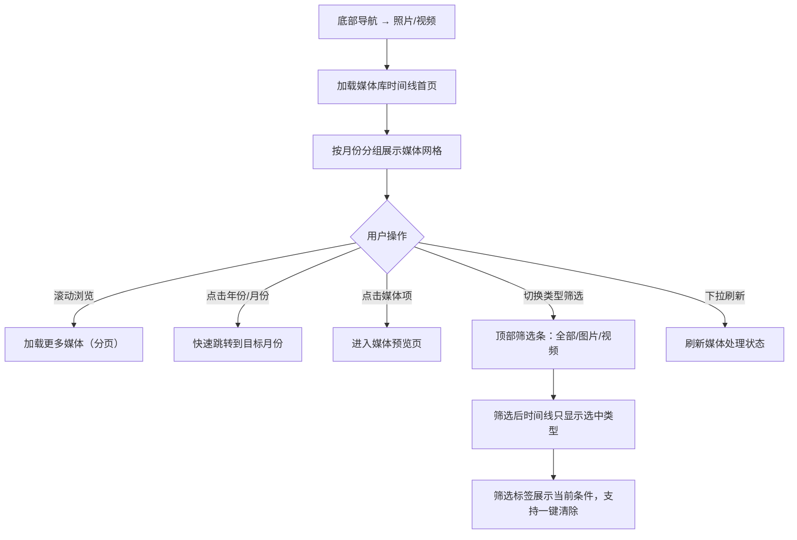
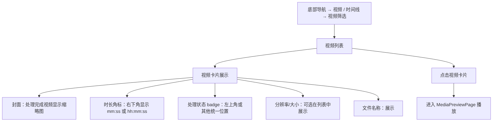
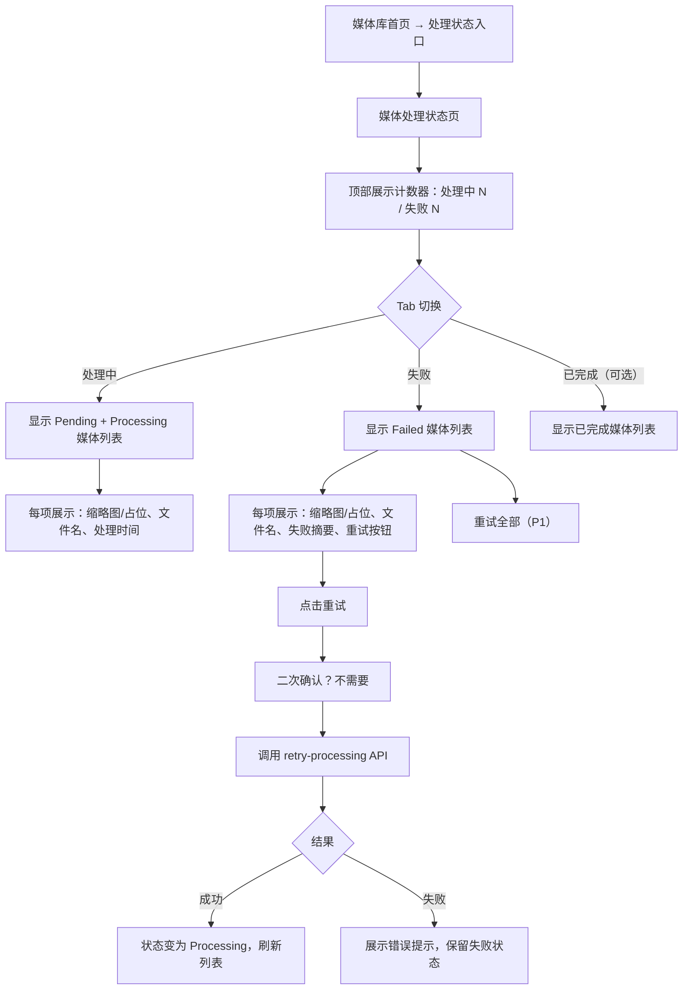
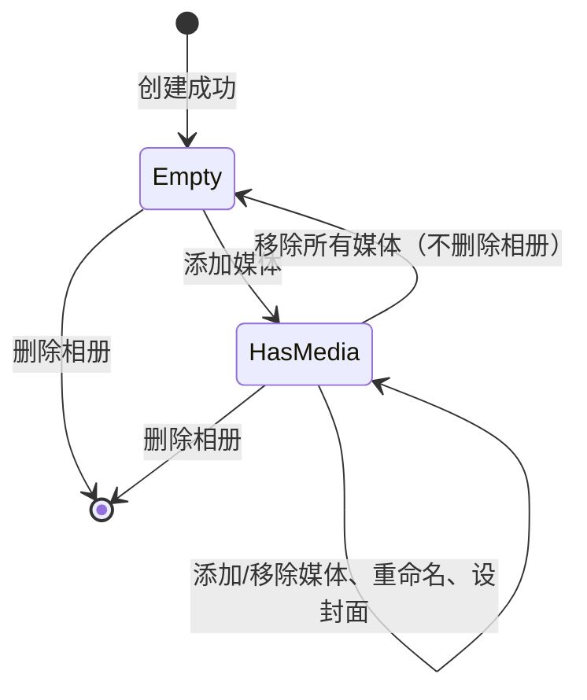
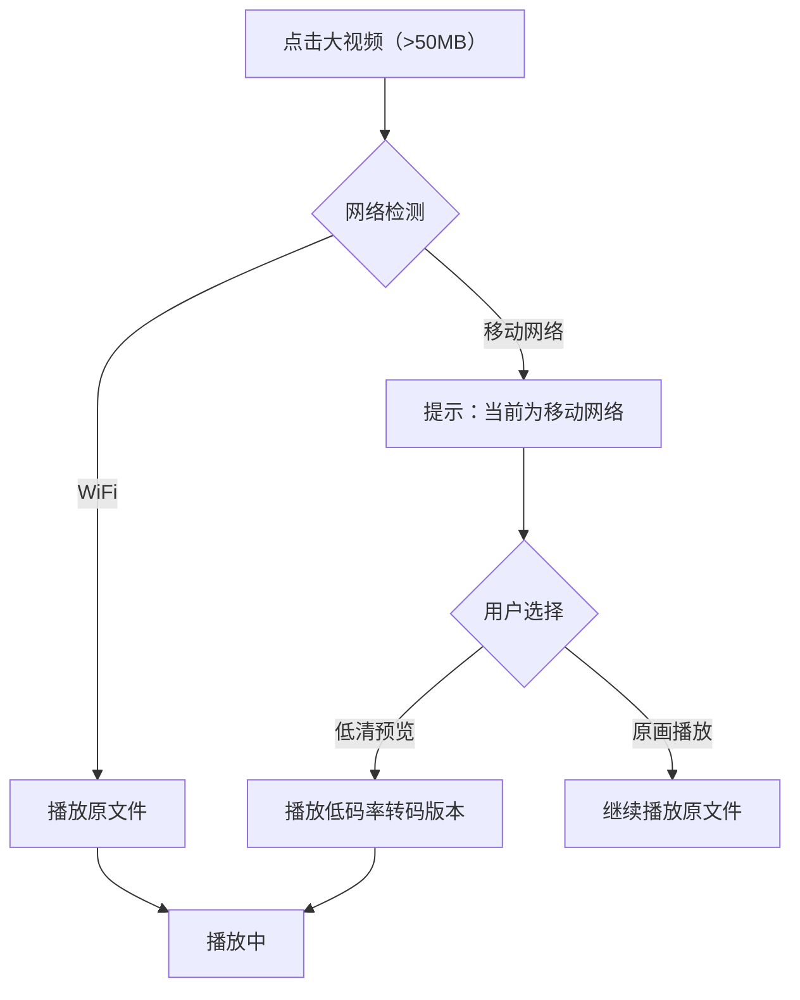
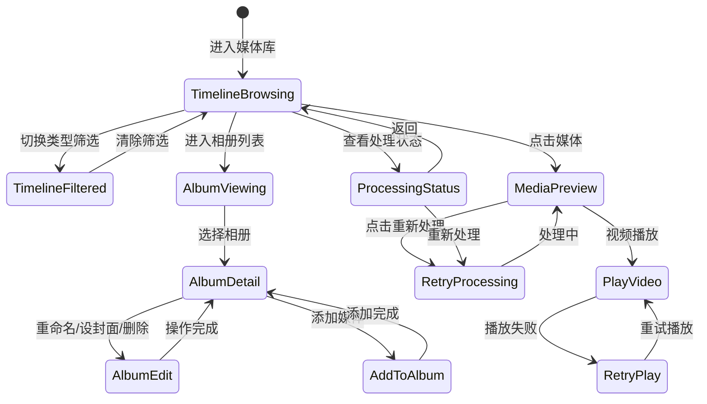
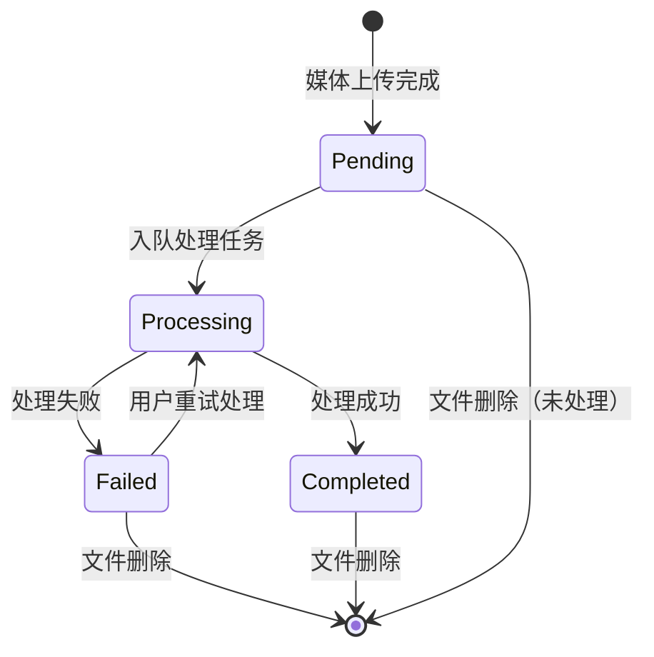

# PrivateCloudDrive V1.2 媒体库产品化 — 用户旅程与场景矩阵

日期：2026-07-07
角色：业务分析师 / Hermes-Business-Analyst
基线来源：`docs/prd-v1.2-media-library-experience.md`（V1.2 PRD）、`docs/scenario-matrix-v1.1.md`（V1.1 场景矩阵格式参考）、`docs/architecture-v1.1-file-management-boundary.md`（V1.1 架构边界）、`docs/architecture-v1.0-rc-boundary.md`（V1.0 架构基线）
版本定位：V1.2 媒体库产品化 — 图片时间线、视频列表增强、处理状态可视化、相册管理、视频播放体验

---

## 1. 管理结论

V1.2 阶段的目标是把 PrivateCloudDrive 从"文件型云盘"升级为"移动优先的私人媒体库"。本场景矩阵在 V1.1 文件管理体验增强（搜索、排序、批量、容量、分享）基础上，叠加以下 7 个用户旅程，约束后端 API、MAUI 前端和验收口径：

| 优先级 | 用户旅程 | 目标用户 | 对应 V1.2 能力 |
|--------|----------|----------|----------------|
| P0 | 图片时间线浏览 | 个人用户 / 家庭媒体用户 | 按拍摄/上传时间分组、图片+视频混合、类型过滤 |
| P0 | 视频列表增强 | 个人用户 / 家庭媒体用户 | 封面、时长、分辨率、大小、处理状态 |
| P0 | 媒体处理状态查看与失败重试 | 所有用户 / 管理员 | Pending/Processing/Failed 可视化、失败原因、重新处理 |
| P1 | 手动创建和管理相册 | 家庭媒体用户 / 小团队用户 | 创建/重命名/删除相册、封面设置 |
| P1 | 媒体加入多个相册 | 家庭媒体用户 / 小团队用户 | 添加/移除媒体、跨相册归属 |
| P0 | 视频播放体验增强 | 个人用户 / 家庭媒体用户 | 加载/错误/重试状态、处理未完成提示 |
| P2 | 大视频移动网络播放优化 | 所有用户 | HLS/低清预览（如适用，V1.2 仅设计） |

### V1.2 与 V1.1 的关系

| 维度 | 关系说明 |
|------|----------|
| 定位 | V1.2 是**叠加**于 V1.1 之上，而非并行或替代。用户从底部导航"照片"/"视频"入口进入 V1.2 增强体验 |
| 依赖 | V1.2 依赖 V1.1 的文件上传、分片上传、缩略图生成、文件权限隔离等基础能力 |
| 数据 | V1.2 新增 `PcdMediaAlbums` / `PcdMediaAlbumItems` 表，不改变 V1.1 `FileNode` / `MediaAsset` / `FileShare` 结构 |
| 权限 | V1.2 复用 V1.0 RC / V1.1 的 OwnerId + TenantId 隔离体系，不引入新角色 |
| 分享 | V1.2 不改变 V1.1 分享机制；相册默认不等同于分享，不扩展分享范围 |
| 部署 | V1.2 不新增 Docker 服务、不改变 Docker Compose 架构基线 |

---

## 2. 用户角色定义

沿用 V1.1 角色体系，新增「媒体整理者」视角：

| 角色 | 代号 | 技术能力 | 主要关注 | 设备 |
|------|------|----------|----------|------|
| 独立部署者 | DEPLOYER | 能执行命令行、编辑 `.env` | 部署成功、数据安全 | 桌面端 + Docker |
| 日常文件用户 | USER | 只使用 MAUI App | 文件能上传/下载/预览/删除 | Android 手机 |
| 家庭媒体用户 | MEDIA_USER | 只使用 MAUI App，以照片/视频为主 | 媒体能预览、整理、不丢失 | Android 手机 |
| 部署管理员 | ADMIN | 熟悉 Docker、CLI 和基本排障 | 系统健康、媒体处理任务状态 | 桌面端 + Docker |
| 媒体整理者 | CURATOR | 使用 MAUI App 主动整理媒体 | 相册管理、多相册归属、封面 | Android 手机 |
| 非技术使用者 | NON_TECH | 只使用 App，不接触命令行 | 一切能在 App 内完成 | Android 手机 |

> V1.2 不引入新身份角色。CURATOR 是 MEDIA_USER 的子视角，代表更主动整理媒体的用户行为模式。

---

## 3. 用户故事全集

---

### 3.1 US-V12-01：图片时间线浏览

**As a** 家庭媒体用户 (MEDIA_USER / NON_TECH)
**I want** 打开媒体库后按月份看到照片和视频，支持按类型过滤
**So that** 我能快速找到最近或某次旅行的内容，不需要在文件夹中逐层翻找

#### 3.1.1 正常路径



**业务规则：**

| 规则编号 | 规则 | 原因 |
|----------|------|------|
| BR-TL-01 | 时间线默认混合展示图片和视频，按 `TimelineTime` 倒序排列 | 用户期望最新内容在最前面 |
| BR-TL-02 | 时间来源优先级：`MediaAsset.TakenAt` > `FileNode.CreationTime` > `FileNode.LastModificationTime` | 拍摄时间优先于上传时间 |
| BR-TL-03 | 月份分组显示为"2026 年 5 月"，日期分组（P1）显示为"5 月 9 日 星期六" | 用户友好分组 |
| BR-TL-04 | 媒体卡片展示缩略图（Completed）、处理状态 badge（非 Completed）、视频时长角标 | 状态透明 |
| BR-TL-05 | Pending/Processing/Failed 的媒体不显示空白缩略图，显示状态占位 + 文案 | 避免用户困惑 |
| BR-TL-06 | 时间线只返回当前用户当前租户的媒体，不泄露其他用户文件 | 权限隔离 |
| BR-TL-07 | 类型过滤支持全部/图片/视频，互斥选择，三方切换 | 精准定位 |
| BR-TL-08 | 时间线列表使用平铺分页（非服务端分组），MAUI 端按月份/日期分组 | 避免复杂跨页分组 |
| BR-TL-09 | 媒体卡片占位：图片和视频均展示文件名、大小、类型图标；完成状态展示缩略图 | 缩略图缺失时不展示空白 |
| BR-TL-10 | 空状态：未上传任何媒体时展示"还没有媒体，去上传吧" + 上传引导按钮 | 用户引导明确 |

#### 3.1.2 异常路径与用户可见错误

| 异常场景 | 触发条件 | 系统行为 | 用户可见信息 | 解决方案入口 |
|----------|----------|----------|-------------|-------------|
| TL-ERR-01 | 时间线 API 超时或 500 | 列表展示失败，保留上次缓存 | "媒体库加载失败，请稍后重试" | 下拉刷新 |
| TL-ERR-02 | 网络断开时滚动加载更多 | 分页请求失败 | "网络连接已断开，无法加载更多" | 检查网络后重试 |
| TL-ERR-03 | Token 过期时访问时间线 | API 返回 401 | "登录已过期，请重新登录" | 引导跳转登录页 |
| TL-ERR-04 | 所有媒体处理未完成（全 Pending/Processing） | 展示状态占位网格 | 所有卡片显示"等待处理"/"处理中" | 下拉刷新查看进展 |
| TL-ERR-05 | 用户无任何媒体（空账户） | 展示空状态 | "还没有媒体，快去上传你的第一张照片或视频吧" | 上传引导按钮 |
| TL-ERR-06 | 筛选后无匹配媒体 | 展示空筛选结果 | "没有符合条件的媒体" | 清除筛选条件 |
| TL-ERR-07 | 媒体已删除但时间线缓存未过期 | 点击媒体项时返回 404 | "该媒体已不存在" | 刷新时间线 |
| TL-ERR-08 | 时间线 API 分页因媒体处理状态变化出现不一致 | 不主动刷新已有数据 | 用户下拉刷新或退出重进 | 下拉刷新 |

#### 3.1.3 验收条件

| 验收项 | 方法 | 预期 |
|--------|------|------|
| US-V12-01-AC01 | 打开媒体库时间线首页 | 图片和视频混合展示，按时间倒序，月份分组 |
| US-V12-01-AC02 | 切换类型筛选为"图片" | 只显示图片，视频隐藏 |
| US-V12-01-AC03 | 切换类型筛选为"视频" | 只显示视频，图片隐藏 |
| US-V12-01-AC04 | 筛选后清除条件 | 回到混合时间线 |
| US-V12-01-AC05 | 上传新图片/视频 → 回到时间线 | 新媒体出现在时间线最前面 |
| US-V12-01-AC06 | 时间线中处理中的媒体 | 不显示空白，显示处理状态占位 |
| US-V12-01-AC07 | 无媒体时访问时间线 | 显示空状态引导 |
| US-V12-01-AC08 | 用户 A 无法看到用户 B 的媒体 | 权限隔离正确 |

---

### 3.2 US-V12-02：视频列表增强

**As a** 家庭媒体用户 (MEDIA_USER)
**I want** 在视频列表中看到封面、时长、分辨率、大小和处理状态
**So that** 我不用逐个打开就能了解视频内容和可用性，方便选择要观看的视频

#### 3.2.1 正常路径



**业务规则：**

| 规则编号 | 规则 | 原因 |
|----------|------|------|
| BR-VIDLIST-01 | 视频封面使用媒体处理生成的缩略图；无缩略图时显示视频类型占位图标 | 一致性体验 |
| BR-VIDLIST-02 | 视频时长格式：短于 1 小时显示 `mm:ss`，超过 1 小时显示 `hh:mm:ss` | 用户友好 |
| BR-VIDLIST-03 | Pending/Processing 视频不展示时长（元数据未生成），显示"视频处理中" | 避免误导 |
| BR-VIDLIST-04 | Failed 视频展示失败 badge 但不阻塞列表展示 | 用户可选择重试 |
| BR-VIDLIST-05 | 视频卡片点击后进入 MediaPreviewPage；如果视频处理未完成，展示处理状态而非播放器 | 用户预期管理 |
| BR-VIDLIST-06 | 视频列表过滤仅搜索当前用户当前租户 | 权限隔离 |
| BR-VIDLIST-07 | 空视频列表时展示"还没有视频" + 上传引导 | 空状态引导 |

#### 3.2.2 异常路径与用户可见错误

| 异常场景 | 触发条件 | 系统行为 | 用户可见信息 | 解决方案入口 |
|----------|----------|----------|-------------|-------------|
| VIDLIST-ERR-01 | 视频列表 API 超时或 500 | 列表加载失败 | "视频列表加载失败，请稍后重试" | 下拉刷新 |
| VIDLIST-ERR-02 | 视频封面/缩略图缺失 | 展示类型占位图标 | 显示视频文件图标（不显示空白） | 等待处理完成 |
| VIDLIST-ERR-03 | 时长元数据未生成（Pending/Processing） | 不显示时长角标 | 角标位置显示"---"或不展示 | 等待处理完成 |
| VIDLIST-ERR-04 | 网络断开时加载视频列表 | 请求失败 | "网络连接已断开，无法加载视频" | 检查网络后重试 |
| VIDLIST-ERR-05 | 用户无任何视频 | 展示空状态 | "还没有视频，去上传吧" | 上传引导 |
| VIDLIST-ERR-06 | 视频处理失败（Failed） | 卡片显示失败 badge | 卡片显示"处理失败" badge | 进入详情页查看原因和重试 |

#### 3.2.3 验收条件

| 验收项 | 方法 | 预期 |
|--------|------|------|
| US-V12-02-AC01 | 上传 mp4 文件 → 进入视频列表 | 显示视频卡片，处理完成后显示封面 |
| US-V12-02-AC02 | 上传视频后立刻查看列表 | 显示处理状态（Pending/Processing） |
| US-V12-02-AC03 | 视频处理完成后 | 显示时长角标（mm:ss） |
| US-V12-02-AC04 | 点击视频卡片 | 进入 MediaPreviewPage |
| US-V12-02-AC05 | 无视频时访问 | 显示空状态引导 |
| US-V12-02-AC06 | 视频处理失败 | 卡片展示失败 badge |

---

### 3.3 US-V12-03：媒体处理状态查看与失败重试

**As a** 所有用户 / 部署管理员 (USER / ADMIN)
**I want** 能集中查看所有媒体的处理状态（Pending/Processing/Failed），对失败项了解原因并重新处理
**So that** 我知道哪些媒体已经可用、哪些还在处理、哪些失败了需要干预

#### 3.3.1 正常路径



**业务规则：**

| 规则编号 | 规则 | 原因 |
|----------|------|------|
| BR-PROC-01 | 处理状态页入口显示摘要数字："处理中：3 ｜ 失败：1"，放在媒体库顶部 | 通知式入口 |
| BR-PROC-02 | 处理中 Tab：包含 Pending + Processing 状态的媒体 | 用户需要了解哪些尚未完成 |
| BR-PROC-03 | 失败 Tab：仅包含 Failed 状态的媒体 | 聚焦可干预项 |
| BR-PROC-04 | 已完成 Tab：可选实现，默认不展示；如实现则为已完成媒体，可进一步跳转到时间线 | 减少信息密度 |
| BR-PROC-05 | 失败摘要（ProcessErrorSummary）必须脱敏和截断，不允许包含物理路径、连接字符串、secret、token | 安全原则 |
| BR-PROC-06 | 仅 Failed 状态可重试，长期 Pending（>30 分钟）可重试 | 防止无效重试 |
| BR-PROC-07 | 重试前校验当前用户拥有该文件（FileNode.OwnerId == CurrentUser.Id） | 防越权操作 |
| BR-PROC-08 | 重试后状态变为 Processing，触发媒体处理 Job | 状态流转正确 |
| BR-PROC-09 | 批处理重试（P1）每次不超过 20 个，逐项校验 | 性能与安全 |
| BR-PROC-10 | 处理状态页仅返回当前用户当前租户的媒体 | 权限隔离 |
| BR-PROC-11 | 处理状态页刷新通过下拉刷新实现，不自动轮询（V1.2 以手动刷新为主） | 避免过量请求 |

#### 3.3.2 异常路径与用户可见错误

| 异常场景 | 触发条件 | 系统行为 | 用户可见信息 | 解决方案入口 |
|----------|----------|----------|-------------|-------------|
| PROC-ERR-01 | 处理状态 API 超时或 500 | 页面加载失败 | "处理状态加载失败，请稍后重试" | 下拉刷新 |
| PROC-ERR-02 | 重试 API 失败（网络断开） | 重试请求未发出 | "重试失败：网络连接已断开" | 检查网络后重试 |
| PROC-ERR-03 | 重试 API 返回 400（文件状态不可重试） | 弹出错误提示 | "此媒体当前无法重新处理" | 查看媒体详情 |
| PROC-ERR-04 | 重试 API 返回 404（文件已删除） | 弹出错误提示 | "文件已不存在，无法重新处理" | 刷新列表 |
| PROC-ERR-05 | 重试 API 返回 403（权限不足） | 弹出错误提示 | "您无权重新处理此文件" | 联系管理员 |
| PROC-ERR-06 | Token 过期时访问处理状态页 | API 返回 401 | "登录已过期，请重新登录" | 跳转登录页 |
| PROC-ERR-07 | 所有媒体均已完成（无 Pending/Processing/Failed） | 处理状态页显示空态 | "所有媒体已完成处理" | 返回媒体库 |
| PROC-ERR-08 | ProcessErrorSummary 为空（无错误详情） | 展示通用失败信息 | "处理失败，暂无详细信息" | 联系管理员检查日志 |

#### 3.3.3 验收条件

| 验收项 | 方法 | 预期 |
|--------|------|------|
| US-V12-03-AC01 | 上传媒体后打开处理状态页 | 新上传媒体显示在"处理中" Tab |
| US-V12-03-AC02 | 等待处理完成 → 刷新 | 媒体从"处理中"消失或移至"已完成" |
| US-V12-03-AC03 | 模拟处理失败（如删除 ffmpeg） | 媒体出现在"失败" Tab，显示失败摘要 |
| US-V12-03-AC04 | 在失败 Tab 点击重试 | 状态变为 Processing，媒体移至处理中 |
| US-V12-03-AC05 | 重试后再次失败 | 回到失败 Tab，可再次重试 |
| US-V12-03-AC06 | 用户 A 不能看到用户 B 的处理状态 | 权限隔离正确 |
| US-V12-03-AC07 | 失败摘要不包含敏感信息（路径、密钥等） | 摘要文案安全脱敏 |

---

### 3.4 US-V12-04：手动创建和管理相册

**As a** 媒体整理者 / 家庭媒体用户 (CURATOR / MEDIA_USER)
**I want** 能创建相册、重命名、删除相册，并设置封面
**So that** 我能把媒体按主题（旅行、家庭、项目）整理到不同相册

#### 3.4.1 正常路径

```mermaid
flowchart TD
    A[媒体库首页 → 相册入口] --> B[相册列表页]
    B --> C[展示所有相册：封面/名称/数量/更新时间]
    C --> D[点击"+" → 新建相册]
    D --> E[弹出新建相册弹窗]
    E --> F[输入名称 → 点击确认]
    F --> G[创建成功，返回相册列表]
    B --> H[点击相册项 → 进入相册详情]
    H --> I[展示相册内媒体网格]
    I --> J[更多菜单→重命名]
    J --> K[弹窗修改名称]
    K --> L[保存成功]
    I --> M[更多菜单→删除相册]
    M --> N[二次确认："删除相册不会删除其中的文件？"]
    N --> O[确认后删除成功]
    I --> P[点击媒体项 → 进入预览/详情]
```

**业务规则：**

| 规则编号 | 规则 | 原因 |
|----------|------|------|
| BR-ALBUM-01 | 相册名称必填，同一用户相册名不可重复（OwnerId + TenantId + NormalizedName 唯一） | 防止混淆 |
| BR-ALBUM-02 | 新建相册默认无封面，创建成功后显示空相册状态 | 初始状态清晰 |
| BR-ALBUM-03 | 删除相册时只删除相册关系（MediaAlbumItem），不删除原文件（FileNode） | 数据安全 |
| BR-ALBUM-04 | 删除相册需要二次确认，文案明确"删除相册不会删除文件" | 防误操作 |
| BR-ALBUM-05 | 相册封面默认使用最新一张处理完成的媒体缩略图；可手动设置 | 视觉一致性 |
| BR-ALBUM-06 | 手动设封面功能只有当相册非空时才可用 | 逻辑约束 |
| BR-ALBUM-07 | 相册列表按最后修改时间倒序（最新操作的相册排最前） | 用户习惯 |
| BR-ALBUM-08 | 相册详情展示媒体网格，复用时间线媒体卡片样式 | UI 一致性 |
| BR-ALBUM-09 | 相册操作（CRUD、封面）必须校验 OwnerId == CurrentUser.Id | 权限隔离 |
| BR-ALBUM-10 | 不能查看和操作其他用户的相册 | 隐私边界 |

**相册状态机：**



#### 3.4.2 异常路径与用户可见错误

| 异常场景 | 触发条件 | 系统行为 | 用户可见信息 | 解决方案入口 |
|----------|----------|----------|-------------|-------------|
| ALBUM-ERR-01 | 创建时名称已存在 | API 返回冲突 | "此相册名称已存在，请使用其他名称" | 修改名称后重试 |
| ALBUM-ERR-02 | 创建时名称为空 | 前端校验拒绝 | "相册名称不能为空" | 输入名称 |
| ALBUM-ERR-03 | 创建/编辑相册 API 超时或 500 | 请求失败 | "操作失败，请稍后重试" | 重试 |
| ALBUM-ERR-04 | 删除相册时网络断开 | 请求未发出 | "删除失败：网络连接已断开" | 检查网络后重试 |
| ALBUM-ERR-05 | 删除相册 API 返回 404（相册已删除） | 展示错误 | "相册已不存在" | 刷新列表 |
| ALBUM-ERR-06 | 删除相册 API 返回 403（越权） | 展示错误 | "您无权删除此相册" | 联系管理员 |
| ALBUM-ERR-07 | 设置封面时媒体文件已不存在 | API 返回 404 | "封面设置失败：该媒体已不存在" | 选择其他封面 |
| ALBUM-ERR-08 | 重命名时名称包含非法字符 | 前端校验拒绝 | "相册名称包含非法字符" | 修改名称 |
| ALBUM-ERR-09 | Token 过期时操作相册 | API 返回 401 | "登录已过期，请重新登录" | 跳转登录页 |
| ALBUM-ERR-10 | 未创建任何相册时查看相册列表 | 展示空状态 | "还没有相册，创建一个吧" | 创建相册引导 |

#### 3.4.3 验收条件

| 验收项 | 方法 | 预期 |
|--------|------|------|
| US-V12-04-AC01 | 新建相册 → 输入名称 → 确认 | 相册出现在列表，显示正确名称 |
| US-V12-04-AC02 | 创建同名相册 | 提示名称已存在，创建失败 |
| US-V12-04-AC03 | 重命名相册 → 修改名称 → 确认 | 相册列表名称更新 |
| US-V12-04-AC04 | 删除相册 → 确认 | 相册从列表消失，原文件仍在 |
| US-V12-04-AC05 | 删除相册二次确认文案 | 文案包含"不会删除文件" |
| US-V12-04-AC06 | 相册详情 → 设为封面 | 封面更新为新选的媒体缩略图 |
| US-V12-04-AC07 | 空相册列表 | 显示空状态引导 |
| US-V12-04-AC08 | 用户 A 不能看到用户 B 的相册 | 权限隔离正确 |
| US-V12-04-AC09 | 空相册设置封面 | 不可用或提示"相册为空" |

---

### 3.5 US-V12-05：媒体加入多个相册

**As a** 媒体整理者 (CURATOR / MEDIA_USER)
**I want** 能把一张照片或视频同时加入多个相册，也能从相册中移除
**So that** 一个媒体可以归属到多个主题集合（如同时属于"旅行"和"2026 年夏天"）

#### 3.5.1 正常路径

```mermaid
flowchart TD
    A[媒体预览页 / 时间线媒体项] --> B[更多菜单 → 加入相册]
    B --> C[弹出"添加到相册"弹窗]
    C --> D[展示当前用户的所有相册列表]
    D --> E[勾选目标相册（可多选）]
    E --> F[已在该相册的项显示已勾选]
    F --> G[点击确认]
    G --> H[API 批量添加，返回成功]
    H --> I[弹窗关闭，展示"已加入 N 个相册"提示]
    A --> J[进入相册详情]
    J --> K[长按/多选媒体 → 从相册移除]
    K --> L[二次确认？不需要]
    L --> M[确认后从相册移除，原文件不受影响]
    M --> N[相册内媒体列表刷新]
```

**业务规则：**

| 规则编号 | 规则 | 原因 |
|----------|------|------|
| BR-ALBUMITEM-01 | 同一媒体不可重复加入同一相册（AlbumId + FileNodeId 唯一） | 去重保护 |
| BR-ALBUMITEM-02 | 只能加入图片/视频文件（FileNode.NodeType = File 且媒体类型有效） | 约束合理 |
| BR-ALBUMITEM-03 | 加入相册时校验文件归属（FileNode.OwnerId == CurrentUser.Id） | 防越权 |
| BR-ALBUMITEM-04 | 从相册中移除媒体不删除原文件 | 数据安全 |
| BR-ALBUMITEM-05 | "添加到相册"弹窗显示当前媒体已加入的相册（已勾选状态） | 避免重复加入 |
| BR-ALBUMITEM-06 | 批量添加媒体到相册支持多个 FileNodeIds 一次提交 | 批量操作便利性 |
| BR-ALBUMITEM-07 | 加入相册操作对媒体总数无影响，相册 itemsCount 原子计数更新 | 准确性 |
| BR-ALBUMITEM-08 | 移除相册中的媒体后，相册封面如果刚好是被移除的媒体，自动降级为最新一张 | 封面兜底 |
| BR-ALBUMITEM-09 | 媒体详情/预览页可查看该媒体属于哪些相册（"此照片在：旅行、2026 夏天"） | 归属透明 |

#### 3.5.2 异常路径与用户可见错误

| 异常场景 | 触发条件 | 系统行为 | 用户可见信息 | 解决方案入口 |
|----------|----------|----------|-------------|-------------|
| ALBUMITEM-ERR-01 | 添加媒体到相册时媒体已在相册中 | 去重忽略已存在项，返回其他项结果 | "部分媒体已在相册中" | 无操作 |
| ALBUMITEM-ERR-02 | 添加非图片/视频文件到相册 | API 校验拒绝 | "只能将图片和视频加入相册" | 重新选择媒体 |
| ALBUMITEM-ERR-03 | 添加非当前用户的文件到相册 | API 返回 403 | "您无权将其他用户的文件加入相册" | 联系分享者 |
| ALBUMITEM-ERR-04 | 移除媒体 API 超时或 500 | 请求失败 | "移除失败，请稍后重试" | 重试 |
| ALBUMITEM-ERR-05 | 移除媒体时网络断开 | 请求未发出 | "移除失败：网络连接已断开" | 检查网络后重试 |
| ALBUMITEM-ERR-06 | 添加到相册时目标相册已被删除 | API 返回 404 | "目标相册已不存在" | 刷新相册列表 |
| ALBUMITEM-ERR-07 | Token 过期时操作 | API 返回 401 | "登录已过期，请重新登录" | 跳转登录页 |
| ALBUMITEM-ERR-08 | 媒体已从文件系统删除，但仍在相册中 | 点击该媒体时返回 404 | "该文件已不存在" | 刷新后媒体从相册消失 |

#### 3.5.3 验收条件

| 验收项 | 方法 | 预期 |
|--------|------|------|
| US-V12-05-AC01 | 媒体预览页 → 添加到相册 → 选择相册 A → 确认 | 相册 A 中能看到该媒体 |
| US-V12-05-AC02 | 同一媒体再次添加到同一相册 | 提示已在相册中，不重复添加 |
| US-V12-05-AC03 | 媒体加入相册 A 和相册 B → 删除相册 A | 媒体仍在相册 B，原文件不受影响 |
| US-V12-05-AC04 | 相册详情 → 移除媒体 | 媒体从相册消失，原文件仍在时间线可见 |
| US-V12-05-AC05 | 媒体被移除后，相册封面（如果刚好是该媒体） | 自动降级为最新一张媒体 |
| US-V12-05-AC06 | 尝试把文本文件加入相册 | 提示只能加入图片/视频 |
| US-V12-05-AC07 | 用户 A 的文件加入用户 A 的相册 → 用户 B 不应看到 | 权限隔离正确 |
| US-V12-05-AC08 | 媒体详情页查看所属相册 | 显示该媒体属于哪些相册 |

---

### 3.6 US-V12-06：视频播放体验增强

**As a** 家庭媒体用户 (MEDIA_USER)
**I want** 在视频预览页看到明确的加载状态、播放失败原因和重试入口，处理未完成的视频不误导我
**So that** 我播放视频时能知道发生了什么以及如何恢复

#### 3.6.1 正常路径

```mermaid
flowchart TD
    A[时间线/视频列表 → 点击视频卡片] --> B[MediaPreviewPage]
    B --> C{视频处理状态}
    C -->|Completed| D[加载播放器]
    D --> E[显示播放控件]
    E --> F[用户播放视频]
    F --> G{播放结果}
    G -->|成功| H[正常观看至结束]
    G -->|播放错误| I[展示错误提示 + 重试按钮]
    I --> J[点击重试]
    J --> K[重新加载播放器]
    C -->|Pending/Processing| L[展示"视频处理中"状态]
    L --> M[提示"请稍后刷新查看"]
    C -->|Failed| N[展示失败摘要 + 重试处理按钮]
    N --> O[点击重新处理]
    O --> P[调用 retry-processing]
    P --> Q{结果}
    Q -->|成功| R[状态变为 Processing, 页面刷新]
    Q -->|失败| S[保留失败状态]
```

**业务规则：**

| 规则编号 | 规则 | 原因 |
|----------|------|------|
| BR-VIDEO-01 | Completed 视频展示播放器，包含播放/暂停、进度条、全屏按钮 | 基础播放体验 |
| BR-VIDEO-02 | Pending/Processing 视频不展示播放器，展示"视频处理中，请稍后刷新" | 避免点击播放无效 |
| BR-VIDEO-03 | Failed 视频展示失败摘要（脱敏）和"重新处理"按钮 | 用户可干预恢复 |
| BR-VIDEO-04 | 播放加载中显示居中 loading 指示器 | 加载状态明确 |
| BR-VIDEO-05 | 播放错误与处理失败分开对待：播放错误是可恢复的（重试加载），处理失败需要重新处理 | 错误分类明确 |
| BR-VIDEO-06 | 视频详情页展示：名称、大小、分辨率（宽×高）、时长、编码格式（如可用）、处理状态 | 信息完整 |
| BR-VIDEO-07 | 不展示 ProcessError 原文，只展示脱敏摘要 | 安全原则 |
| BR-VIDEO-08 | 视频 URL 使用临时签名或安全 token，不暴露永久存储路径 | 安全防护 |
| BR-VIDEO-09 | Android 真机验收至少覆盖 mp4/mov/webm 主链路 | 移动优先 |

#### 3.6.2 异常路径与用户可见错误

| 异常场景 | 触发条件 | 系统行为 | 用户可见信息 | 解决方案入口 |
|----------|----------|----------|-------------|-------------|
| VIDEO-ERR-01 | 视频详情 API 超时或 500 | 页面加载失败 | "视频详情加载失败，请稍后重试" | 返回重进 |
| VIDEO-ERR-02 | 视频播放器初始化失败（格式不兼容） | 展示错误提示 | "此视频格式暂不支持播放" | 下载到本地播放 |
| VIDEO-ERR-03 | 网络断开时加载视频 | 播放器加载失败 | "视频加载失败：网络连接已断开" | 检查网络后重试 |
| VIDEO-ERR-04 | 网络恢复后重试播放 | 手动重试 | 播放器重新加载 | 重试按钮 |
| VIDEO-ERR-05 | 视频源文件已被删除 | API 返回 404 | "视频文件已不存在" | 返回列表刷新 |
| VIDEO-ERR-06 | Token 过期 | API 返回 401 | "登录已过期，请重新登录" | 跳转登录页 |
| VIDEO-ERR-07 | 视频在播放过程中网络中断 | 播放器暂停/报错 | "网络连接已断开，正在尝试重连" | 等待自动重连或手动重试 |
| VIDEO-ERR-08 | FFmpeg 处理失败但 Blob 仍存在 | 详情页展示失败状态 | "视频处理失败：[脱敏原因]" | 重新处理按钮 |

#### 3.6.3 验收条件

| 验收项 | 方法 | 预期 |
|--------|------|------|
| US-V12-06-AC01 | 点击处理完成的视频 → 进入预览页 | 显示播放器和控件，可正常播放 |
| US-V12-06-AC02 | 点击处理中的视频 | 显示"视频处理中，请稍后" |
| US-V12-06-AC03 | 点击处理失败的视频 | 显示失败摘要 + 重新处理按钮 |
| US-V12-06-AC04 | 重新处理 → 成功后回到页面 | 状态变为 Processing 或 Completed |
| US-V12-06-AC05 | 视频播放中模拟断网 | 播放器报错网络断开，有重试按钮 |
| US-V12-06-AC06 | 安卓真机播放 mp4 | 音画同步，可拖动进度条 |
| US-V12-06-AC07 | 安卓真机播放 mov | 正常播放或给出格式不支持提示 |
| US-V12-06-AC08 | 视频详情页展示基本信息 | 名称、大小、分辨率、时长可见 |

---

### 3.7 US-V12-07：大视频移动网络播放优化（设计阶段）

**As a** 所有用户 (USER / MEDIA_USER)
**I want** 在移动网络下播放大视频时能自动使用低清预览或 HLS 流
**So that** 我不需要下载整个大文件，就可以快速预览视频内容，节省流量

> **V1.2 状态：P2 / 设计阶段，不进入实现。** 以下规格作为架构设计参考和后版本输入。

#### 3.7.1 正常路径（设计）



**业务规则（设计）：**

| 规则编号 | 规则 | 说明 |
|----------|------|------|
| BR-HLS-01 | 视频转码为低码率版本（720p/480p，1-2 Mbps）存储为单独 Blob | 不覆盖原文件 |
| BR-HLS-02 | 移动网络下首次播放大于 50MB 的视频时提示"当前为移动网络" | 用户知情 |
| BR-HLS-03 | 用户可设置"始终使用原画"或"始终优先低清" | 尊重偏好 |
| BR-HLS-04 | HLS/转码状态纳入媒体处理流程，增加 TranscodingPending/TranscodingCompleted/TranscodingFailed | 状态管理 |
| BR-HLS-05 | V1.2 不实现此能力；仅作为 P2 设计输入 | 范围约束 |

#### 3.7.2 异常路径（设计）

| 异常场景 | 触发条件 | 系统行为 | 用户可见信息 | 解决方案入口 |
|----------|----------|----------|-------------|-------------|
| HLS-ERR-01 | 转码失败但原文件完整 | 不使用低清预览，回退原文件 | "低清预览不可用，将播放原文件" | 改用原画 |
| HLS-ERR-02 | 移动网络 + 无低清版本 | 直接播放原文件 | 无额外提示 | — |
| HLS-ERR-03 | 转码进行中 | 等待或回退原文件 | "低清预览正在生成中，请稍后" | 稍后再试 |

#### 3.7.3 验收条件（设计）

V1.2 不验收此用户故事。后版本验收标准草案：

| 验收项 | 方法 | 预期 |
|--------|------|------|
| 待定 | WiFi 下播放 >50MB 视频 | 直接播放原文件 |
| 待定 | 移动网络下播放 >50MB 视频（低清可用） | 提示选择 |
| 待定 | 移动网络下播放 >50MB 视频（低清不可用） | 播放原文件，无阻塞 |

---

## 4. 状态机总览（V1.2 新增状态）



### 媒体资产处理状态机



---

## 5. 接口依赖矩阵

| 后端 API | 对应用户故事 | 方法 | 优先级别 |
|----------|-------------|------|---------|
| `GET /api/app/file-center-media-library/timeline` | US-V12-01 | P0 | Phase 1 |
| `GET /api/app/file-center-media-library/{fileNodeId}/detail` | US-V12-02, US-V12-06 | P0 | Phase 1 |
| `GET /api/app/file-center-media-library/processing-status` | US-V12-03 | P0 | Phase 1 |
| `POST /api/app/file-center-media-library/{fileNodeId}/retry-processing` | US-V12-03 | P1 | Phase 4 |
| `GET /api/app/file-center-media-albums` | US-V12-04 | P0 | Phase 2 |
| `POST /api/app/file-center-media-albums` | US-V12-04 | P0 | Phase 2 |
| `PUT /api/app/file-center-media-albums/{id}` | US-V12-04 | P0 | Phase 2 |
| `DELETE /api/app/file-center-media-albums/{id}` | US-V12-04 | P0 | Phase 2 |
| `GET /api/app/file-center-media-albums/{id}/items` | US-V12-04, US-V12-05 | P0 | Phase 2 |
| `POST /api/app/file-center-media-albums/{id}/items` | US-V12-05 | P0 | Phase 3 |
| `DELETE /api/app/file-center-media-albums/{id}/items/{fileNodeId}` | US-V12-05 | P0 | Phase 3 |
| `POST /api/app/file-center-media-albums/{id}/cover` | US-V12-04 | P1 | Phase 3 |

### 复用 V1.1 / V1.0 RC 现有接口

| 现有 API | V1.2 中的用途 |
|----------|---------------|
| 文件上传（小文件 + 分片） | 上传图片/视频到媒体库 |
| 缩略图下载 | 时间线/相册封面展示 |
| IFileCenterMediaLibraryAppService.GetImagesAsync / GetVideosAsync | 兼容旧入口 |
| 操作日志 | 记录相册 CRUD、添加/移除媒体、重试处理 |

---

## 6. 权限矩阵增量

| 操作 | DEPLOYER | USER | MEDIA_USER | CURATOR | ADMIN | NON_TECH |
|------|----------|------|------------|---------|-------|----------|
| 查看时间线 | — | ✓ 仅自己 | ✓ 仅自己 | ✓ 仅自己 | ✓ 仅自己 | ✓ 仅自己 |
| 类型筛选 | — | ✓ | ✓ | ✓ | ✓ | ✓ |
| 查看视频详情/播放 | — | ✓ 仅自己 | ✓ 仅自己 | ✓ 仅自己 | ✓ 仅自己 | ✓ 仅自己 |
| 查看处理状态 | ✓ | ✓ 仅自己 | ✓ 仅自己 | ✓ 仅自己 | ✓ 全用户 | ✓ 仅自己 |
| 重试处理 | — | ✓ 仅自己 | ✓ 仅自己 | ✓ 仅自己 | ✓ 全用户 | ✓ 仅自己 |
| 创建相册 | — | — | ✓ | ✓ | ✓ | — |
| 重命名相册 | — | — | ✓ 仅自己 | ✓ 仅自己 | ✓ 全用户 | — |
| 删除相册 | — | — | ✓ 仅自己 | ✓ 仅自己 | ✓ 全用户 | — |
| 添加媒体到相册 | — | — | ✓ 仅自己 | ✓ 仅自己 | ✓ 全用户 | — |
| 移除相册媒体 | — | — | ✓ 仅自己 | ✓ 仅自己 | ✓ 全用户 | — |
| 设置封面 | — | — | ✓ 仅自己 | ✓ 仅自己 | ✓ 全用户 | — |

> - "仅自己"指 OwnerId == CurrentUser.Id
> - ADMIN 的全用户操作权限仅限于管理排查场景，提供明确的操作记录审计

---

## 7. 数据字典增量

### 7.1 新增实体

#### MediaAlbum（相册）

| 字段 | 类型 | 必填 | 说明 |
|------|------|------|------|
| Id | Guid | 是 | 主键 |
| TenantId | Guid | 是 | 租户隔离 |
| OwnerId | Guid | 是 | 所有者用户 ID |
| Name | string(256) | 是 | 相册名称 |
| NormalizedName | string(256) | 是 | 大写标准化名称，用于唯一性检查 |
| Description | string(2000)? | 否 | 相册描述 |
| CoverFileNodeId | Guid? | 否 | 封面文件节点 ID |
| ItemsCount | int | 是 | 相册中媒体数量（冗余，用于列表展示） |
| CreationTime | DateTime | 是 | 创建时间 |
| LastModificationTime | DateTime? | 否 | 最后修改时间 |
| IsDeleted | bool | 是 | 软删除标记 |

唯一约束：`(TenantId, OwnerId, NormalizedName)`

#### MediaAlbumItem（相册项）

| 字段 | 类型 | 必填 | 说明 |
|------|------|------|------|
| Id | Guid | 是 | 主键 |
| TenantId | Guid | 是 | 租户隔离 |
| OwnerId | Guid | 是 | 所有者用户 ID（冗余，查询优化） |
| AlbumId | Guid | 是 | 所属相册 ID |
| FileNodeId | Guid | 是 | 媒体文件节点 ID |
| SortOrder | int | 否 | 排序序号（V1.2 可选） |
| CreationTime | DateTime | 是 | 添加时间 |
| IsDeleted | bool | 是 | 软删除标记 |

唯一约束：`(AlbumId, FileNodeId)`

### 7.2 已有实体扩展

#### MediaAsset 现有字段补充关注

| 字段 | 类型 | 说明 | V1.2 使用场景 |
|------|------|------|--------------|
| ProcessStatus | enum | Pending/Processing/Completed/Failed | 处理状态可视化 |
| ProcessError | string? | 原始错误信息（脱敏后展示） | 失败摘要来源 |
| ProcessErrorSummary | string? | 脱敏错误摘要 | 失败 Tab 展示 |
| TakenAt | DateTime? | 拍摄时间 | 时间线排序第一优先级 |
| DurationMilliseconds | long? | 视频时长 | 视频卡片角标 |
| Width / Height | int? | 分辨率 | 视频详情展示 |
| ThumbnailBlobObjectId | Guid? | 缩略图 Blob | 时间线/相册封面 |

### 7.3 新增索引

| 表 | 索引 | 目的 |
|----|------|------|
| PcdMediaAlbums | (TenantId, OwnerId, NormalizedName) | 同名唯一性校验 |
| PcdMediaAlbums | (TenantId, OwnerId, LastModificationTime DESC) | 相册列表排序 |
| PcdMediaAlbumItems | (AlbumId, FileNodeId) | 唯一性 + 查询 |
| PcdMediaAlbumItems | (TenantId, OwnerId, AlbumId) | 权限查询 |
| PcdMediaAssets | (TenantId, OwnerId, TakenAt DESC) | 时间线排序 |
| PcdMediaAssets | (TenantId, OwnerId, ProcessStatus) | 处理状态查询 |

---

## 8. 业务术语表增量

| 术语 | 说明 | 英文对照 |
|------|------|----------|
| 时间线 | 按时间倒序排列的图片+视频混合列表 | Timeline |
| 月份分组 | 同月媒体归为一组，如"2026 年 5 月" | Month Group |
| 类型过滤 | 按全部/图片/视频筛选时间线 | Media Type Filter |
| 处理状态 | 媒体的后台处理进度：等待/处理中/完成/失败 | Process Status |
| 处理状态 badge | 媒体卡片上展示处理状态的角标/徽章 | Status Badge |
| 失败摘要 | 脱敏后的处理失败原因文本 | Process Error Summary |
| 重新处理 | 用户手动触发媒体重新进入处理流程 | Retry Processing |
| 相册 | 用户主动创建的媒体集合 | Media Album |
| 相册项 | 相册与媒体的关联记录 | Album Item |
| 相册封面 | 相册的代表性缩略图 | Album Cover |
| 媒体卡片 | 时间线/视频列表中单个媒体的展示单元 | Media Card |
| 混合时间线 | 同时展示图片和视频的时间线 | Mixed Timeline |

---

## 9. QA 验收用例概览

### 9.1 时间线（US-V12-01）

| 用例编号 | 用例描述 | 优先级 |
|----------|----------|:------:|
| QA-TL-01 | 上传 3 张图片 + 2 个视频 → 打开时间线 | P0 |
| QA-TL-02 | 验证时间线按 TimelineTime 倒序 | P0 |
| QA-TL-03 | 验证月份分组显示（同月媒体在同一组） | P0 |
| QA-TL-04 | 切换类型筛选为"图片" | P0 |
| QA-TL-05 | 切换类型筛选为"视频" | P0 |
| QA-TL-06 | 清除筛选回到混合模式 | P0 |
| QA-TL-07 | 时间线空状态 | P0 |
| QA-TL-08 | 时间线 API 超时降级 | P1 |
| QA-TL-09 | 跨用户不可见验证 | P0 |

### 9.2 视频列表（US-V12-02）

| 用例编号 | 用例描述 | 优先级 |
|----------|----------|:------:|
| QA-VL-01 | 上传 mp4 → 查看视频列表 | P0 |
| QA-VL-02 | 验证视频封面展示（处理完成后） | P0 |
| QA-VL-03 | 验证视频时长角标 | P0 |
| QA-VL-04 | 验证 Pending/Processing/Failed 状态展示 | P0 |
| QA-VL-05 | 空视频列表 | P0 |
| QA-VL-06 | 视频列表跨用户不可见 | P0 |

### 9.3 处理状态与重试（US-V12-03）

| 用例编号 | 用例描述 | 优先级 |
|----------|----------|:------:|
| QA-PR-01 | 上传媒体后查看处理状态页 | P0 |
| QA-PR-02 | Pending/Processing 媒体在"处理中"Tab | P0 |
| QA-PR-03 | Failed 媒体在"失败"Tab | P0 |
| QA-PR-04 | 点击失败项重试 → 变为 Processing | P0 |
| QA-PR-05 | 失败摘要脱敏验证（不含路径/密钥/token） | P0 |
| QA-PR-06 | 非 Failed 状态不可重试 | P1 |
| QA-PR-07 | 跨用户处理状态不可见 | P0 |

### 9.4 相册管理（US-V12-04）

| 用例编号 | 用例描述 | 优先级 |
|----------|----------|:------:|
| QA-AL-01 | 创建相册（正常名称） | P0 |
| QA-AL-02 | 重复名称创建相册 | P0 |
| QA-AL-03 | 空名称创建相册 | P0 |
| QA-AL-04 | 重命名相册 | P0 |
| QA-AL-05 | 删除相册（有媒体）→ 文件不受影响 | P0 |
| QA-AL-06 | 删除相册二次确认文案 | P0 |
| QA-AL-07 | 空相册列表 | P0 |
| QA-AL-08 | 设置封面 | P1 |
| QA-AL-09 | 空相册设置封面不可用 | P1 |
| QA-AL-10 | 跨用户相册不可见 | P0 |

### 9.5 媒体加入相册（US-V12-05）

| 用例编号 | 用例描述 | 优先级 |
|----------|----------|:------:|
| QA-AI-01 | 媒体加入相册 A → 相册 A 显示该媒体 | P0 |
| QA-AI-02 | 同一媒体加入相册 A 和相册 B → 两个相册均显示 | P0 |
| QA-AI-03 | 相同媒体重复加入同一相册 → 去重 | P0 |
| QA-AI-04 | 从相册移除媒体 → 原文件仍在时间线 | P0 |
| QA-AI-05 | 文本/PDF 不能加入相册 | P0 |
| QA-AI-06 | 跨用户文件不能加入相册 | P0 |
| QA-AI-07 | 媒体详情页显示所属相册 | P1 |
| QA-AI-08 | 封面刚好是被移除媒体 → 自动降级 | P1 |

### 9.6 视频播放（US-V12-06）

| 用例编号 | 用例描述 | 优先级 |
|----------|----------|:------:|
| QA-VP-01 | 点击处理完成的视频 → 播放器可用 | P0 |
| QA-VP-02 | 点击处理中的视频 → 显示"视频处理中" | P0 |
| QA-VP-03 | 点击处理失败的视频 → 显示失败摘要 + 重新处理 | P0 |
| QA-VP-04 | 播放中网络断开 → 错误提示 + 重试 | P0 |
| QA-VP-05 | 视频详情展示名称/大小/分辨率/时长 | P0 |
| QA-VP-06 | 重新处理成功后页面状态更新 | P1 |
| QA-VP-07 | Android 真机 mp4 播放验收 | P0 |
| QA-VP-08 | Android 真机 mov 播放验收或明确不支持提示 | P1 |

---

## 10. V1.2 发布验证清单

| 验证项 | 标准 | 对应模块 |
|--------|------|----------|
| 时间线混合展示 | 图片+视频混排，按时间倒序，月份分组 | 媒体库时间线 |
| 类型过滤 | 全部/图片/视频切换正确 | 媒体库时间线 |
| 视频封面和时长 | 处理完成的视频显示缩略图和时长角标 | 视频列表增强 |
| 处理状态 badge | 媒体卡片正确展示 Pending/Processing/Failed/Completed | 处理状态 |
| 处理状态页 | 处理中/失败 Tab 数据正确，入口数字准确 | 处理状态 |
| 重试处理 | Failed 媒体可成功重试（按 API） | 处理状态 |
| 相册 CRUD | 创建/重命名/删除相册完整链路 | 相册管理 |
| 相册添加/移除媒体 | 一个媒体可加入多个相册，移除不删原文件 | 相册项管理 |
| 相册封面 | 默认封面 + 手动设封面 | 相册管理 |
| 视频播放 | Completed 可播放，Processing 提示等待，Failed 展示重试 | 视频体验 |
| 跨用户隔离 | 用户 A 看不到用户 B 的媒体、相册、处理状态 | 权限 |
| 错误脱敏 | ProcessErrorSummary 不含物理路径/密钥/token | 安全 |
| 删除不删文件 | 删除相册、移除相册项均不删除原文件 | 数据安全 |
| secret日志扫描 | `python scripts/secret-log-scan.py` 通过 | 发布门禁 |

|以上完成后，输出 Android 真机主链路验收记录到 `docs/testing.md`，并生成 V1.2 Release Notes。

---

## 11. V1.2 候选已知限制索引（LIM-V12-01~09）

本索引从 `docs/architecture-v1.2-rc-boundary.md` 风险边界整理为 V1.2 正式版候选 LIM-V12-01~09，确保每项限制都有明确的场景归属和跟踪入口。

| 编号 | 限制 | 影响场景 | 场景引用 | 后续版本 |
|------|------|---------|---------|---------|
| LIM-V12-01 | 时间线基于拍摄时间/上传时间，不支持修改时间轴顺序 | US-V12-01 图片时间线浏览 | §3.1 BR-TL-01~03（时间来源优先级固定） | 待定 |
| LIM-V12-02 | 视频只保证 mp4/mov/webm 主链路播放，其他格式视 ffmpeg 兼容性 | US-V12-02 视频列表增强 / US-V12-06 视频播放体验增强 | §3.2 BR-VIDLIST-01 / §3.6 BR-VIDEO-09（仅保证主流格式） | 待定 |
| LIM-V12-03 | 相册封面仅限已完成缩略图的媒体；处理中和失败项无法设封面 | US-V12-04 手动创建和管理相册 | §3.4 BR-ALBUM-05（封面默认取最新完成缩略图） | V1.2 P1 |
| LIM-V12-04 | 相册不支持嵌套/子相册 | US-V12-04 手动创建和管理相册 | §3.4 BR-ALBUM-01~10（相册结构单一） | V2 候选 |
| LIM-V12-05 | 媒体处理失败重试限于单文件操作，无批量重新处理入口 | US-V12-03 媒体处理状态查看与失败重试 | §3.3 BR-PROC-09（批处理重试为 P1，每次≤20） | V1.2 P1 |
| LIM-V12-06 | 历史媒体（V1.2 前上传）可能缺少 MediaAsset 记录，时间线中显示为等待处理 | US-V12-01 图片时间线浏览 / US-V12-03 处理状态 | §3.1 BR-TL-05（无 asset 兜底显示 Pending）/ 架构§7 LIM-V12-04 | V1.2 扫描补偿任务 |
| LIM-V12-07 | 时间线月份分组基于后端返回的扁平列表在 MAUI 端分组，超长列表跨页月份边界需验证 | US-V12-01 图片时间线浏览 | §3.1 BR-TL-08（扁平分页，客户端分组） | 当前验证 |
| LIM-V12-08 | 相册不改变文件原始目录结构，删除相册或移除相册项不改变原文件位置 | US-V12-04 相册管理 / US-V12-05 媒体加入多个相册 | §3.4 BR-ALBUM-03 / §3.5 BR-ALBUMITEM-04（删除不删文件） | 设计如此 |
| LIM-V12-09 | iOS 客户端不在 V1.2 范围内；MAUI 构建仅验证 Windows 和 Android 目标 | 全部场景 | §1（仅 Android + Windows 验证） | 待定 |
