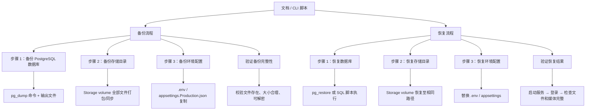
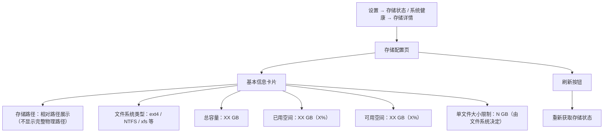
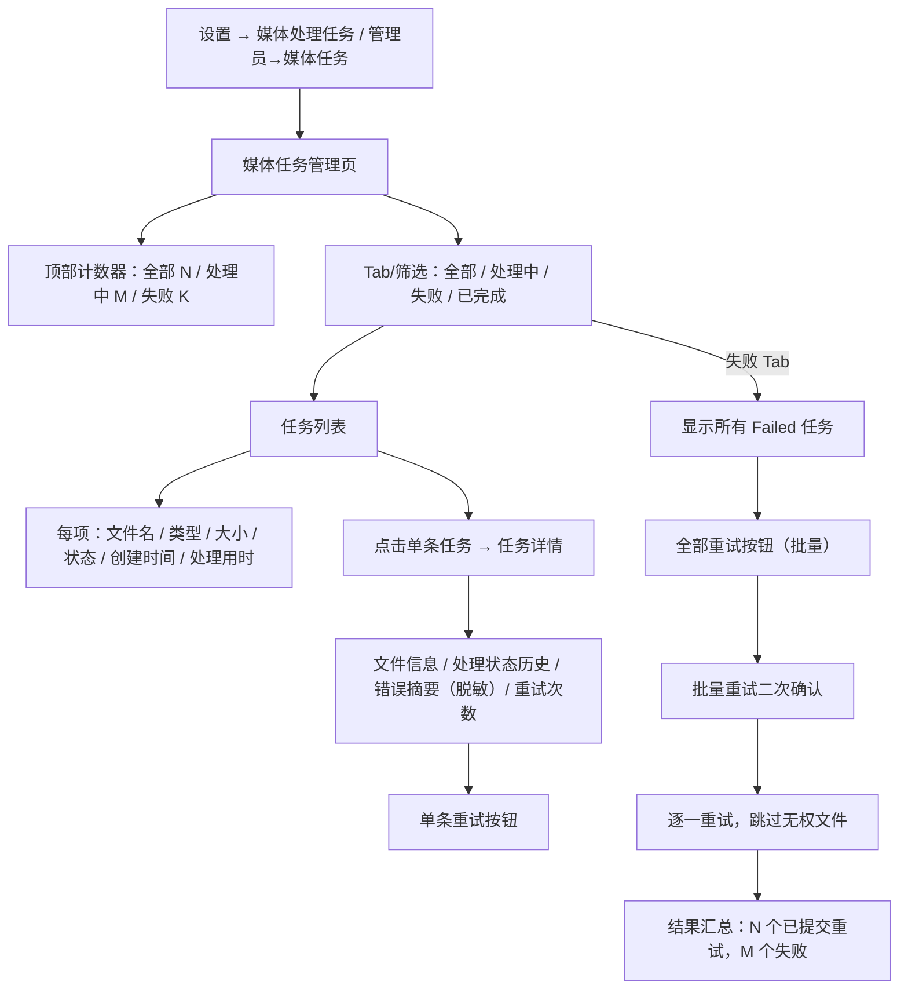
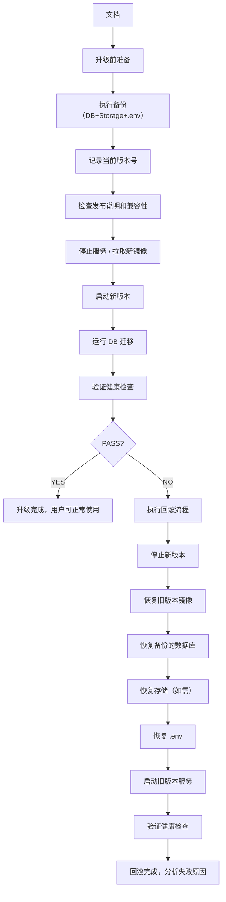
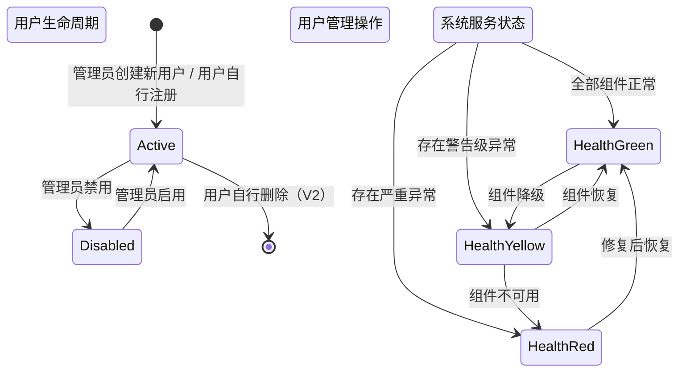

# PrivateCloudDrive V1.3 管理与运维 — 用户旅程与场景矩阵

日期：2026-07-09
角色：业务分析师 / Hermes-Business-Analyst
基线来源：`docs/product-roadmap-next.md`（§4.4 V1.3 管理与运维）、`docs/product-planning-hub.md`（§6 Next: V1.3 运维与规划版）、`docs/scenario-matrix-v1.2.md`（V1.2 场景矩阵格式参考）
版本定位：V1.3 管理与运维 — 管理员用户管理、系统健康页、备份恢复产品化、操作日志增强、存储配置、媒体任务管理、分享风险提醒、回收站清理建议

---

## 1. 管理结论

V1.3 阶段的目标是把 PrivateCloudDrive 从"可用但只能靠管理员的云盘"升级为"非开发者也能长期维护的私有部署产品"。本场景矩阵围绕 10 个用户旅程，覆盖 P0（管理员管理、系统健康、备份恢复、升级回滚）和 P1（操作日志、存储配置、媒体任务管理、分享风险、回收站清理），约束后端 API、MAUI 前端和验收口径：

| 优先级 | 用户旅程 | 目标用户 | 对应 V1.3 能力 |
|--------|----------|----------|----------------|
| P0 | 管理员创建/管理用户 | 部署管理员 | 用户列表、创建用户、重置密码、禁用/启用、容量配额 |
| P0 | 系统健康状态查看 | 部署管理员 | DB、Redis、Storage、FFmpeg、版本、磁盘空间、整体状态 |
| P0 | 备份/恢复演练 | 部署管理员 | 数据库 + storage + .env 备份恢复指南和脚本 |
| P0 | 升级与回滚 | 部署管理员 | 版本升级 SOP、回滚流程、故障诊断清单 |
| P1 | 操作日志筛选与审计 | 部署管理员 | 按用户、动作、文件、时间筛选，审计查询 |
| P1 | 存储配置只读展示 | 部署管理员 | 存储路径、容量、可用空间、文件系统类型 |
| P1 | 媒体处理任务管理 | 部署管理员 | 媒体任务列表、状态过滤、失败重试、任务详情 |
| P1 | 分享风险提醒 | 所有用户 / 管理员 | 分享到期提醒、密码强度提示、分享范围警告 |
| P1 | 回收站清理建议 | 所有用户 / 管理员 | 回收站清空提醒、过期文件提示、自动清理阈值 |
| P0 | 设置页信息架构定版 | 所有用户 | 统一的服务状态、账号、容量、存储、日志、回收站、媒体处理入口 |

### V1.3 与 V1.2 的关系

| 维度 | 关系说明 |
|------|----------|
| 定位 | V1.3 是**运维规划版**，叠加于 V1.2 媒体库产品化之上。目标用户从"媒体消费者"扩展到"部署维护者" |
| 依赖 | V1.3 依赖 V1.0 RC / V1.1 / V1.2 的所有基础能力：用户体系、文件管理、媒体处理、分享、回收站 |
| 数据 | V1.3 不新增核心业务表；新增 `PcdOperationLog` 扩展字段（索引）和系统健康缓存数据，复用已有 `PcdMediaAssets` / `PcdFileShares` / `PcdRecycleItems` 结构 |
| 权限 | V1.3 引入了**管理员角色**（admin），与普通用户（user）角色严格分离 |
| 部署 | V1.3 不新增 Docker 服务、不改变 Docker Compose 架构基线；但增加健康检查端点用于运维监控 |
| 后端 | V1.3 新增 Identity/Users 管理 API、Health API、Processing Task API、Storage Config API（只读） |

---

## 2. 用户角色定义

V1.3 新增「部署管理员」角色并正式定义管理员与普通用户分离：

| 角色 | 代号 | 技术能力 | 主要关注 | 设备 | 说明 |
|------|------|----------|----------|------|------|
| 独立部署者 | DEPLOYER | 能执行命令行、编辑 `.env` | 部署成功、数据安全 | 桌面端 + Docker | 首次部署和升级回滚场景 |
| 日常文件用户 | USER | 只使用 MAUI App | 文件能上传/下载/预览/删除 | Android 手机 | 普通用户，无管理权限 |
| 家庭媒体用户 | MEDIA_USER | 只使用 MAUI App，以照片/视频为主 | 媒体能预览、整理、不丢失 | Android 手机 | 普通用户，同时使用媒体库 |
| 部署管理员 | ADMIN | 熟悉 Docker、CLI 和基本排障 | 系统健康、用户管理、备份恢复 | 桌面端 + Docker | **V1.3 新增**，可访问管理功能 |
| 风险感知用户 | RISK_AWARE | 了解数据安全概念 | 分享风险、回收站清理 | Android 手机 | 所有用户的子视角，关注数据安全 |
| 非技术使用者 | NON_TECH | 只使用 App，不接触命令行 | 一切能在 App 内完成 | Android 手机 | 普通用户 |

> V1.3 正式引入 ADMIN 角色。管理员和普通用户的身份在注册时未区分，需要通过后台或命令行将用户标记为 admin（V2.0 可能加入管理员邀请/审批流程）。

---

## 3. 用户故事全集

---

### 3.1 US-V13-01：管理员用户管理（创建/列表）

**As a** 部署管理员 (ADMIN)
**I want** 能查看用户列表、创建新用户、查看用户基本信息
**So that** 我能在系统运行过程中管理普通用户的账号生命周期

#### 3.1.1 正常路径

```mermaid
flowchart TD
    A[设置 → 管理员入口 → 用户管理] --> B[用户列表页]
    B --> C[展示所有普通用户的表格]
    C --> D[每行：用户名/邮箱/创建时间/状态(启用/禁用)/配额/已用容量]
    B --> E[点击"+" → 创建用户]
    E --> F[弹出创建用户表单]
    F --> G[输入：用户名、邮箱、密码、配额（可选）]
    G --> H[点击确认]
    H --> I[调用 CreateUser API]
    I --> J{结果}
    J -->|成功| K[新用户出现在列表，默认已启用]
    J -->|失败| L[展示错误提示，保留表单输入]
    B --> M[点击用户行 → 进入用户详情页]
    M --> N[展示详细信息和操作入口]
```

**业务规则：**

| 规则编号 | 规则 | 原因 |
|----------|------|------|
| BR-UM-01 | 只有 ADMIN 角色用户可访问用户管理页面和管理 API | 权限管控 |
| BR-UM-02 | 管理员不能查看自己的完整密码哈希和 Token | 安全原则 |
| BR-UM-03 | 创建用户时用户名和邮箱必须唯一（同 Tenant 下） | 防止冲突 |
| BR-UM-04 | 创建用户时密码必须满足强度要求（最少 8 位、含字母和数字） | 基本安全要求 |
| BR-UM-05 | 新用户创建后默认已启用（isActive = true） | 无需管理员额外操作 |
| BR-UM-06 | 用户名的 NormalizedName 用于去重和搜索 | 防重复 |
| BR-UM-07 | 用户创建时配额默认为系统默认值（如 5GB），可由管理员设置 | 灵活性 |
| BR-UM-08 | 用户列表分页展示，默认 20 条/页 | 性能考虑 |
| BR-UM-09 | 用户列表按创建时间倒序，新创建的排最前 | 操作习惯 |
| BR-UM-10 | 管理员不能对自己执行禁用/删除操作 | 防止自锁 |
| BR-UM-11 | 不支持真正的"删除用户"（软删除/禁用），仅禁用、不删除账号数据 | 数据完整性 |

#### 3.1.2 异常路径与用户可见错误

| 异常场景 | 触发条件 | 系统行为 | 用户可见信息 | 解决方案入口 |
|----------|----------|----------|-------------|-------------|
| UM-ERR-01 | 非管理员访问用户管理 API | API 返回 403 | "您无权访问用户管理" | 联系其他管理员 |
| UM-ERR-02 | 创建用户时用户名已存在 | API 返回冲突 | "此用户名已被使用，请选择其他名称" | 修改用户名后重试 |
| UM-ERR-03 | 创建用户时邮箱已存在 | API 返回冲突 | "此邮箱已被注册" | 使用其他邮箱 |
| UM-ERR-04 | 创建用户时密码不满足强度 | 前端校验拒绝 | "密码至少需要 8 位字符，包含字母和数字" | 输入符合要求的密码 |
| UM-ERR-05 | 用户列表 API 超时或 500 | 列表加载失败 | "用户列表加载失败，请稍后重试" | 下拉刷新 |
| UM-ERR-06 | Token 过期时访问用户管理 | API 返回 401 | "登录已过期，请重新登录" | 跳转登录页 |
| UM-ERR-07 | 创建用户时配额超出系统上限 | 前端校验拒绝 | "配额不能超过系统总容量" | 设置合理配额 |
| UM-ERR-08 | 创建用户时 API 返回 400（邮箱格式非法等） | API 校验拒绝 | "邮箱格式不正确" | 修正邮箱格式 |

#### 3.1.3 验收条件

| 验收项 | 方法 | 预期 |
|--------|------|------|
| US-V13-01-AC01 | 管理员登录 → 用户管理 | 显示用户列表，包含当前所有普通用户 |
| US-V13-01-AC02 | 点击创建用户 → 填写用户名/邮箱/密码 → 确认 | 新用户出现在列表，默认启用 |
| US-V13-01-AC03 | 创建同名用户 | 提示用户名已存在，创建失败 |
| US-V13-01-AC04 | 创建同邮箱用户 | 提示邮箱已注册，创建失败 |
| US-V13-01-AC05 | 管理员页显示已用容量/配额 | 每行展示用户容量信息 |
| US-V13-01-AC06 | 普通用户访问用户管理 API | 返回 403 |
| US-V13-01-AC07 | 用户列表分页 | 超过 20 用户时分页正确 |
| US-V13-01-AC08 | 用户列表按创建时间倒序 | 最新用户排最前 |

---

### 3.2 US-V13-02：管理员用户状态管理（禁用/启用/重置密码/配额）

**As a** 部署管理员 (ADMIN)
**I want** 能禁用/启用用户、重置密码、调整配额
**So that** 我能管理异常用户（被封禁、离职）和控制存储消耗

#### 3.2.1 正常路径

```mermaid
flowchart TD
    A[用户管理 → 点击用户行] --> B[用户详情页]
    B --> C[展示：用户名、邮箱、创建时间、状态、配额、已用容量]
    B --> D[操作按钮组]
    D --> E[禁用用户]
    E --> F[二次确认：禁用后用户无法登录和访问文件]
    F --> G{确认}
    G -->|确认| H[调用 DisableUser API]
    H --> I[状态变为"禁用"，用户立即失去访问权限]
    G -->|取消| J[取消操作]
    D --> K[启用用户（仅禁用后可见）]
    K --> L[调用 EnableUser API]
    L --> M[状态变为"启用"]
    D --> N[重置密码]
    N --> O[弹出新密码输入框]
    O --> P[输入新密码 → 确认]
    P --> Q[调用 ResetPassword API]
    Q --> R[密码更新成功]
    R --> S[展示"密码已重置"]
    D --> T[调整配额]
    T --> U[弹出配额输入框（GB）]
    U --> V[输入新配额 → 确认]
    V --> W[调用 UpdateQuota API]
```

**业务规则：**

| 规则编号 | 规则 | 原因 |
|----------|------|------|
| BR-UMSTATE-01 | 禁用用户后该用户 401 所有 API（除 login 和 public share 端点） | 即时生效 |
| BR-UMSTATE-02 | 禁用用户不影响已上传的文件和分享链接（分享链接在有效期内仍可被匿名访问） | 数据不丢失 |
| BR-UMSTATE-03 | 禁用用户需要二次确认，文案需包含"用户将无法登录" | 防误操作 |
| BR-UMSTATE-04 | 启用用户后恢复所有正常权限，不需用户重新注册 | 低成本恢复 |
| BR-UMSTATE-05 | 重置密码后用户需使用新密码重新登录，Token 全部失效 | 安全原则 |
| BR-UMSTATE-06 | 重置密码不需要原密码确认（管理员权限） | 管理场景 |
| BR-UMSTATE-07 | 调整配额时新配额不能低于当前已用容量 | 避免数据丢失 |
| BR-UMSTATE-08 | 调整配额后立即生效，用户下一次上传操作按新配额校验 | 实时生效 |
| BR-UMSTATE-09 | 管理员不能对自己执行禁用和重置密码操作 | 防止自锁 |
| BR-UMSTATE-10 | 管理员可以修改自己的密码（通过常规设置页），但不能通过"用户管理"操作自己 | 权限分离 |

#### 3.2.2 异常路径与用户可见错误

| 异常场景 | 触发条件 | 系统行为 | 用户可见信息 | 解决方案入口 |
|----------|----------|----------|-------------|-------------|
| UMSTATE-ERR-01 | 禁用已禁用的用户 | API 返回 400 | "该用户已被禁用" | 刷新页面 |
| UMSTATE-ERR-02 | 启用已启用的用户 | API 返回 400 | "该用户已处于启用状态" | 刷新页面 |
| UMSTATE-ERR-03 | 管理员尝试禁用自己 | API 返回 400 | "您不能禁用自己" | 操作其他用户 |
| UMSTATE-ERR-04 | 重置密码 API 超时或 500 | 密码未重置 | "重置密码失败，请稍后重试" | 重试 |
| UMSTATE-ERR-05 | 配额调整小于已用量 | 前端校验拒绝 | "新配额不能低于当前已用容量（XX GB）" | 设置更大配额 |
| UMSTATE-ERR-06 | 调整配额 API 返回 404（用户已删除/不存在） | 请求失败 | "用户不存在" | 刷新列表 |
| UMSTATE-ERR-07 | 禁用用户 API 需要管理员 Token 但已过期 | 401 | "登录已过期，请重新登录" | 重新登录 |
| UMSTATE-ERR-08 | 新密码与历史密码相同（如果启用了密码历史校验） | API 返回 400 | "新密码不能与历史密码相同" | 使用不同的新密码 |

#### 3.2.3 验收条件

| 验收项 | 方法 | 预期 |
|--------|------|------|
| US-V13-02-AC01 | 管理员禁用普通用户 → 用户尝试登录 | 登录请求返回 401 或登录成功但后续 API 返回 403 |
| US-V13-02-AC02 | 禁用后 → 启用用户 | 用户可正常登录和使用 |
| US-V13-02-AC03 | 管理员重置用户密码 → 使用新密码登录 | 登录成功，旧密码/Tokens 失效 |
| US-V13-02-AC04 | 调整用户配额为 2GB → 上传小文件（<2GB） | 上传成功 |
| US-V13-02-AC05 | 调整配额低于已用量 | 前端提示拒绝，配额不更新 |
| US-V13-02-AC06 | 管理员尝试禁用自己 | 禁止操作，提示信息 |
| US-V13-02-AC07 | 禁用二次确认文案 | 包含"用户将无法登录" |
| US-V13-02-AC08 | 禁用后分享链接仍可访问 | 有效分享链接不受影响 |

---

### 3.3 US-V13-03：系统健康状态查看

**As a** 部署管理员 (ADMIN)
**I want** 能查看系统各组件的健康状态：DB、Redis、Storage、FFmpeg、版本、磁盘空间
**So that** 我能在问题发生前或发生时快速定位是哪个组件出现故障

#### 3.3.1 正常路径

```mermaid
flowchart TD
    A[设置 → 服务状态 / 系统健康] --> B[系统健康页]
    B --> C[整体状态汇总卡片]
    C --> D[绿色"所有服务运行正常" 或 红色"N 项异常"]
    B --> E[按组件展开的健康详情]
    E --> F1[数据库: 连接正常 / 延迟 Nms / 连接数 N]
    E --> F2[Redis: 连接正常 / 延迟 Nms / 内存使用率]
    E --> F3[存储: 路径 / 总计/已用/可用空间 / 可读写]
    E --> F4[FFmpeg: 版本 / 可用编码器列表 / 可用]
    E --> F5[应用版本: 当前版本号 / 构建时间 / 启动时间]
    E --> F6[磁盘: 总空间 / 已用 / 可用 / 系统盘使用率]
    B --> G[刷新按钮 / 自动刷新间隔设置（P2）]
    B --> H[点击每项 → 展开详情]
    H --> I[各组件具体指标数值]
```

**业务规则：**

| 规则编号 | 规则 | 原因 |
|----------|------|------|
| BR-HEALTH-01 | 健康检查 API 不返回敏感信息（连接字符串、密钥、物理路径全路径） | 安全原则 |
| BR-HEALTH-02 | 健康页整体状态按最差组件计算：全部绿色 = 正常，任一黄色 = 警告，任一红色 = 异常 | 整体感知 |
| BR-HEALTH-03 | DB 健康检查：连接 + 简单查询（SELECT 1）+ 连接数 | 验证真实可用性 |
| BR-HEALTH-04 | Redis 健康检查：PING + 内存使用信息 | 验证缓存层可用性 |
| BR-HEALTH-05 | Storage 健康检查：检查配置路径存在且可读写 | 存储层可用性 |
| BR-HEALTH-06 | FFmpeg 健康检查：执行 `ffmpeg -version` 和 `ffprobe -version` 返回非零 | 媒体处理依赖 |
| BR-HEALTH-07 | 磁盘空间：检查 system drive 和 storage drive | 空间不足预警 |
| BR-HEALTH-08 | 应用版本：从 AssemblyVersion 读取，展示 Major.Minor.Build 格式 | 版本可追溯 |
| BR-HEALTH-09 | 启动时间：展示应用 uptime（天/小时/分钟） | 运行稳定性感知 |
| BR-HEALTH-10 | 缓存：健康检查结果缓存 30 秒，避免频繁 IO | 性能保护 |
| BR-HEALTH-11 | 健康检查端点对 ADMIN 角色开放，不对普通用户开放 | 权限限制 |
| BR-HEALTH-12 | 磁盘空间阈值：<10% = 红色警告，10%-20% = 黄色警告，>20% = 正常 | 告警分级 |

#### 3.3.2 异常路径与用户可见错误

| 异常场景 | 触发条件 | 系统行为 | 用户可见信息 | 解决方案入口 |
|----------|----------|----------|-------------|-------------|
| HEALTH-ERR-01 | 健康检查 API 超时或 500 | 页面加载失败 | "健康检查加载失败，请稍后重试" | 刷新页面 |
| HEALTH-ERR-02 | DB 连接失败 | DB 组件红色 | "数据库连接异常：无法连接至数据库服务器" | 检查 DB 是否运行于正确端口 |
| HEALTH-ERR-03 | Redis PING 失败 | Redis 组件红色 | "Redis 连接异常：PING 无响应" | 检查 Redis 是否运行 |
| HEALTH-ERR-04 | Storage 路径不可写 | Storage 组件红色 | "存储目录不可写：[相对路径]，请检查目录权限" | 检查 volume 挂载和权限 |
| HEALTH-ERR-05 | FFmpeg 未安装或版本低 | FFmpeg 组件红色 | "FFmpeg 不可用或版本过低，媒体处理将受影响" | 安装 FFmpeg 或更新版本 |
| HEALTH-ERR-06 | 磁盘空间低于 10% | 磁盘组件红色 | "磁盘空间严重不足：仅剩 X.X GB（X%）" | 清理磁盘或扩展存储 |
| HEALTH-ERR-07 | 缓存超过 30 秒导致健康信息过时 | 不影响页面 | 无 | 下拉刷新 |
| HEALTH-ERR-08 | Token 过期时访问健康页 | API 返回 401 | "登录已过期，请重新登录" | 跳转登录页 |
| HEALTH-ERR-09 | 非管理员访问健康 API | API 返回 403 | "您无权查看系统健康状态" | 联系管理员 |
| HEALTH-ERR-10 | 存储路径不存在 | Storage 组件红色 | "存储目录不存在：[相对路径]，请检查配置" | 检查 storage volume 配置 |

#### 3.3.3 验收条件

| 验收项 | 方法 | 预期 |
|--------|------|------|
| US-V13-03-AC01 | 管理员访问系统健康页 | 显示所有组件状态，整体状态绿色 |
| US-V13-03-AC02 | 整体状态按最差组件计算 | 模拟 DB 断开后整体状态变为红色 |
| US-V13-03-AC03 | DB 组件展示连接正常/延迟 | 显示延迟数值和连接数 |
| US-V13-03-AC04 | Redis 组件展示 PING 结果 | 显示 PONG 和内存使用 |
| US-V13-03-AC05 | Storage 组件展示容量信息 | 显示总空间/已用/可用 |
| US-V13-03-AC06 | FFmpeg 组件展示版本 | 显示 FFmpeg 版本号 |
| US-V13-03-AC07 | 磁盘空间展示 | 显示磁盘总空间/已用/可用/使用率 |
| US-V13-03-AC08 | 应用版本和启动时间 | 显示版本号和运行时长 |
| US-V13-03-AC09 | 普通用户访问健康 API | 返回 403 |
| US-V13-03-AC10 | 健康信息不包含敏感数据 | 检查返回信息无连接字符串/密钥/全路径 |

---

### 3.4 US-V13-04：备份/恢复指南产品化

**As a** 独立部署者 / 部署管理员 (DEPLOYER / ADMIN)
**I want** 有清晰的备份和恢复指南，解释需要备份哪些数据、如何操作、如何验证
**So that** 在数据丢失或迁移时，我能安全完整地恢复系统

#### 3.4.1 正常路径



> V1.3 提供的是**文档指南 + 可选脚本**，不做产品化 UI 备份向导。备份恢复以 CLI/脚本方式完成，确保最大兼容性。

**业务规则：**

| 规则编号 | 规则 | 原因 |
|----------|------|------|
| BR-BACKUP-01 | 备份指南必须明确标明"备份不意味着 100% 数据安全，建议定期验证备份恢复流程" | 责任声明 |
| BR-BACKUP-02 | 数据库备份使用 pg_dump（自定义格式或 SQL 格式），不使用文件系统快照 | 数据库一致性 |
| BR-BACKUP-03 | 存储目录备份推荐使用 rsync/tar 方式，不依赖快照 | 文件系统兼容性 |
| BR-BACKUP-04 | .env 和 appsettings 包含敏感信息，备份文件必须标记"安全保管，勿泄露" | 安全警示 |
| BR-BACKUP-05 | 备份指南提供分步恢复检查清单 | 避免遗漏步骤 |
| BR-BACKUP-06 | 恢复时数据库必须恢复至相同版本 PostgreSQL（Major.Minor 一致） | 兼容性 |
| BR-BACKUP-07 | 建议备份周期：数据库每日，存储增量每周，配置每周 | 标准实践 |
| BR-BACKUP-08 | 恢复后健康检查可作为验证步骤（调用健康检查 API） | 一致性校验 |
| BR-BACKUP-09 | 备份脚本可在健康检查 API 中被引用，但不强制 | 可选增强 |
| BR-BACKUP-10 | 备份恢复文档中不包含数据库密码明文；使用环境变量引用 | 安全原则 |

#### 3.4.2 异常路径与用户可见错误

| 异常场景 | 触发条件 | 系统行为 | 用户可见信息 | 解决方案入口 |
|----------|----------|----------|-------------|-------------|
| BACKUP-ERR-01 | pg_dump 失败（DB 未运行） | 备份脚本报错 | "数据库备份失败：无法连接到数据库" | 检查 DB 是否运行 |
| BACKUP-ERR-02 | Storage 目录不存在 | 备份脚本报错 | "存储目录不存在，请检查 BACKUP_SRC 配置" | 确认存储路径 |
| BACKUP-ERR-03 | 备份目标目录空间不足 | 备份脚本报错 | "磁盘空间不足，无法创建备份文件" | 清理磁盘或修改备份路径 |
| BACKUP-ERR-04 | pg_restore 版本不兼容 | 恢复脚本报错 | "恢复失败：PostgreSQL 版本不兼容" | 确保 DB 版本一致 |
| BACKUP-ERR-05 | .env 文件丢失但继续恢复 | 服务启动失败 | "丢失环境配置，服务无法启动" | 重新创建 .env |
| BACKUP-ERR-06 | 恢复后存储路径与 .env 不一致 | 健康检查 FAIL | "存储路径配置与数据不匹配" | 检查存储路径配置 |
| BACKUP-ERR-07 | 部分备份文件损坏 | 恢复过程中报错 | "[文件名] 损坏或不完整，请检查备份源" | 使用其他备份版本 |
| BACKUP-ERR-08 | 恢复后用户 Token 失效 | 登录失败 | 所有用户需要重新登录（Token 在恢复前创建） | 用户重新登录 |

#### 3.4.3 验收条件

| 验收项 | 方法 | 预期 |
|--------|------|------|
| US-V13-04-AC01 | 阅读备份文档 | 包含 DB / Storage / .env 三部分 |
| US-V13-04-AC02 | 按照文档执行备份 | 备份文件成功生成（pg_dump + tar + config copy） |
| US-V13-04-AC03 | 按照文档执行恢复（同一环境） | 恢复后系统可正常登录和访问文件 |
| US-V13-04-AC04 | 恢复后检查文件完整性 | 文件列表、媒体、分享与备份前一致 |
| US-V13-04-AC05 | 恢复后健康检查 | 所有组件绿色 PASS |
| US-V13-04-AC06 | 备份文件中无明文密码 | 检查备份的 .env 不含明文关键凭据 |
| US-V13-04-AC07 | 备份文档含验证步骤 | 文档说明如何验证备份文件完整性 |

---

### 3.5 US-V13-05：操作日志筛选与审计

**As a** 部署管理员 (ADMIN)
**I want** 能按用户、动作类型、文件、时间段筛选操作日志
**So that** 我能快速定位异常操作，审计用户行为

#### 3.5.1 正常路径

```mermaid
flowchart TD
    A[设置 → 操作日志] --> B[操作日志列表]
    B --> C[默认展示最近 7 天日志，按时间倒序]
    B --> D[筛选条件栏]
    D --> E[按用户：下拉选择用户]
    D --> F[按动作类型：上传/下载/删除/分享/登录/修改等]
    D --> G[按时间范围：开始日期 / 结束日期]
    D --> H[按文件：文件名模糊搜索]
    E/I/F/G/H --> J[点击"查询"]
    J --> K[调用 OperationLog Query API]
    K --> L[返回筛选结果分页列表]
    L --> M[每项：时间 / 用户 / 动作 / 对象(文件名) / IP / 结果]
    M --> N[点击单条日志 → 查看详情]
    N --> O[展示完整日志信息（脱敏）]
```

**业务规则：**

| 规则编号 | 规则 | 原因 |
|----------|------|------|
| BR-LOG-01 | 操作日志对 ADMIN 角色开放全部用户日志；普通用户只能查看自己的操作日志 | 权限限制 |
| BR-LOG-02 | 操作日志默认保留 90 天，超过期限自动归档或清理（P2 实现） | 存储管理 |
| BR-LOG-03 | 操作日志不包含：密码、Token、OAuth Code、Client Secret、私有路径 | 安全脱敏 |
| BR-LOG-04 | 动作类型分类：FileOperation（上传/下载/删除/重命名/移动）、AuthOperation（登录/登出/修改密码）、ShareOperation（创建/取消分享）、AdminOperation（创建用户/禁用/重置密码）、SystemOperation（自动处理） | 分类审计 |
| BR-LOG-05 | 文件操作日志关联 FileNodeId，可跳转到文件详情（如果文件仍存在） | 可追踪性 |
| BR-LOG-06 | 日志结果包含：成功/失败 + 简要原因（失败日志） | 审计完整性 |
| BR-LOG-07 | 日志页默认展示 20 条/页，支持分页导航 | 性能 |
| BR-LOG-08 | 筛选条件支持多条件组合：用户 + 动作 + 时间范围 + 文件 | 精准定位 |
| BR-LOG-09 | 日志详情页展示 IP 地址（脱敏最后一位） | 追踪不泄露 |
| BR-LOG-10 | 操作日志不支持导出（V1.3 不做导出功能） | 范围限制 |

#### 3.5.2 异常路径与用户可见错误

| 异常场景 | 触发条件 | 系统行为 | 用户可见信息 | 解决方案入口 |
|----------|----------|----------|-------------|-------------|
| LOG-ERR-01 | 日志 API 超时或 500 | 列表加载失败 | "操作日志加载失败，请稍后重试" | 刷新重试 |
| LOG-ERR-02 | 筛选条件无结果 | 展示空结果 | "没有符合条件的操作日志" | 调整筛选条件 |
| LOG-ERR-03 | 按不存在的用户筛选 | API 返回空结果 | 不提示"用户不存在"，按无结果展示 | 重新选择用户 |
| LOG-ERR-04 | 时间范围选择超过 90 天 | 前端提示 | "查询范围不能超过 90 天" | 缩短时间范围 |
| LOG-ERR-05 | Token 过期时访问日志 | API 返回 401 | "登录已过期，请重新登录" | 跳转登录页 |
| LOG-ERR-06 | 非管理员筛选其他用户日志 | API 自动忽略该条件，只返回自己日志 | 返回当前用户日志（不提示越权） | 无需操作 |
| LOG-ERR-07 | 日志详情 API 返回 404（日志已清理） | 展示提示 | "该日志记录已不存在（可能已清理）" | 关闭详情 |
| LOG-ERR-08 | 分页翻页时日志被新数据覆盖 | 正常分页，无数据不一致 | 无（下次查询获取最新） | 重新查询 |

#### 3.5.3 验收条件

| 验收项 | 方法 | 预期 |
|--------|------|------|
| US-V13-05-AC01 | 管理员查看操作日志 | 显示所有用户的操作日志 |
| US-V13-05-AC02 | 普通用户查看操作日志 | 只显示自己的操作日志 |
| US-V13-05-AC03 | 按用户筛选 | 只返回该用户的日志 |
| US-V13-05-AC04 | 按动作类型筛选 | 只返回该动作类型的日志 |
| US-V13-05-AC05 | 按时间范围筛选 | 只返回该时间段的日志 |
| US-V13-05-AC06 | 按文件名搜索 | 只返回包含该文件名的日志 |
| US-V13-05-AC07 | 多条件组合筛选 | 同时满足所有条件的结果 |
| US-V13-05-AC08 | 超出 90 天时间范围 | 前端限制 |
| US-V13-05-AC09 | 日志无明文敏感信息 | 检查日志内容无密码/Token/密钥 |

---

### 3.6 US-V13-06：存储配置只读展示

**As a** 部署管理员 (ADMIN)
**I want** 能在管理页面查看存储配置信息：路径、容量、可用空间、文件系统类型
**So that** 我能了解存储使用状况，不用登录服务器查看

#### 3.6.1 正常路径



**业务规则：**

| 规则编号 | 规则 | 原因 |
|----------|------|------|
| BR-STORAGE-01 | 存储配置页仅对 ADMIN 角色开放 | 权限管控 |
| BR-STORAGE-02 | 存储路径不展示完整绝对路径，只展示相对路径（如 `./storage` 或 `volumes/pcd_storage`） | 安全脱敏 |
| BR-STORAGE-03 | 容量信息由文件系统实时查询，不做数据库存储 | 数据准确性 |
| BR-STORAGE-04 | 存储页不提供修改操作（V1.3 只读展示） | 防误操作 |
| BR-STORAGE-05 | 单文件大小限制读取实际文件系统限制 | 准确性 |
| BR-STORAGE-06 | 存储信息缓存 30 秒，避免频繁磁盘 IO | 性能保护 |
| BR-STORAGE-07 | 如果存储空间不足 10%，页面展示警告提示 | 预警 |
| BR-STORAGE-08 | OSS/MinIO 存储（V2 支持）当前不展示，仅展示当前主存储 | 范围限制 |
| BR-STORAGE-09 | 如果存储路径不可访问，存储配置页展示错误状态而非空 | 异常透明 |

#### 3.6.2 异常路径与用户可见错误

| 异常场景 | 触发条件 | 系统行为 | 用户可见信息 | 解决方案入口 |
|----------|----------|----------|-------------|-------------|
| STORAGE-ERR-01 | 存储路径不可访问（被卸载或权限错误） | 展示不可用状态 | "存储目录无法访问，请检查存储挂载和权限" | 检查 volume 配置 |
| STORAGE-ERR-02 | 查询存储信息时 API 超时或 500 | 页面加载失败 | "存储信息加载失败，请稍后重试" | 刷新页面 |
| STORAGE-ERR-03 | 存储路径在容器内不可见（Docker volume 映射问题） | 展示路径不存在 | "存储路径不存在，请检查 Docker volume 配置" | 检查 docker compose volume 映射 |
| STORAGE-ERR-04 | Token 过期时访问存储页 | API 返回 401 | "登录已过期，请重新登录" | 跳转登录页 |
| STORAGE-ERR-05 | 非管理员访问存储 API | API 返回 403 | "您无权查看存储配置" | 联系管理员 |
| STORAGE-ERR-06 | 磁盘 IO 繁忙导致查询超时 | API 返回超时 | "存储信息加载超时，请稍后重试" | 刷新页面 |

#### 3.6.3 验收条件

| 验收项 | 方法 | 预期 |
|--------|------|------|
| US-V13-06-AC01 | 管理员查看存储配置 | 展示路径（相对）、文件系统类型、总/已用/可用空间 |
| US-V13-06-AC02 | 存储路径展示相对路径 | 不展示 `/home/user/data` 之类完整路径 |
| US-V13-06-AC03 | 存储不足 10% | 展示警告提示 |
| US-V13-06-AC04 | 存储不可访问 | 展示错误状态和修复提示 |
| US-V13-06-AC05 | 普通用户访问存储 API | 返回 403 |
| US-V13-06-AC06 | 刷新按钮 | 重新获取并更新信息 |
| US-V13-06-AC07 | 仅展示主存储 | 不展示 OSS/MinIO 等（V1.3 不做） |

---

### 3.7 US-V13-07：媒体处理任务管理增强

**As a** 部署管理员 (ADMIN)
**I want** 能查看所有媒体处理任务的状态列表，按状态过滤，查看失败原因，批量重试
**So that** 我能集中管理媒体处理作业，确保所有媒体可播放预览

#### 3.7.1 正常路径



**业务规则：**

| 规则编号 | 规则 | 原因 |
|----------|------|------|
| BR-MEDIATASK-01 | 媒体任务管理页仅对 ADMIN 角色开放；普通用户通过 V1.2 的"处理状态页"查看自己的媒体 | 分层管理 |
| BR-MEDIATASK-02 | 任务列表默认按创建时间倒序，最新的排最前 | 关注最新 |
| BR-MEDIATASK-03 | 失败 Tab 显示重试按钮（单条 + 全部重试） | 高效恢复 |
| BR-MEDIATASK-04 | 全部重试每次不超过 50 条，逐条校验后提交 | 性能与安全 |
| BR-MEDIATASK-05 | 错误摘要必须脱敏；不包含物理路径、连接字符串、token、secret | 安全原则 |
| BR-MEDIATASK-06 | 任务详情展示处理历史（状态变更记录），包括：时间戳、旧状态、新状态 | 审计追踪 |
| BR-MEDIATASK-07 | 页面刷新通过下拉刷新或手动刷新按钮，不自动轮询 | 避免过量请求 |
| BR-MEDIATASK-08 | 任务列表可分页，默认 20 条/页 | 性能保护 |
| BR-MEDIATASK-09 | 管理员可以查看所有用户的处理任务（不限于自己） | 管理需求 |
| BR-MEDIATASK-10 | 已完成 Tab 可选显示最近 1000 条已完成任务，超过部分不展示 | 存储节约 |

#### 3.7.2 异常路径与用户可见错误

| 异常场景 | 触发条件 | 系统行为 | 用户可见信息 | 解决方案入口 |
|----------|----------|----------|-------------|-------------|
| MEDIATASK-ERR-01 | 任务列表 API 超时或 500 | 列表加载失败 | "媒体任务列表加载失败，请稍后重试" | 下拉刷新 |
| MEDIATASK-ERR-02 | 批量重试 API 超时或 500 | 部分任务重试失败 | "部分任务重试失败，请稍后重试" | 检查失败项单独重试 |
| MEDIATASK-ERR-03 | 单条重试失败（文件已删除） | API 返回 404 | "该文件已不存在，无法重试" | 刷新列表 |
| MEDIATASK-ERR-04 | Token 过期时访问任务管理 | API 返回 401 | "登录已过期，请重新登录" | 跳转登录页 |
| MEDIATASK-ERR-05 | 非管理员访问任务管理 API | API 返回 403 | "您无权管理媒体任务" | 联系管理员 |
| MEDIATASK-ERR-06 | 任务详情 API 返回 404（任务已清理） | 展示提示 | "该任务记录已不存在" | 返回列表 |
| MEDIATASK-ERR-07 | 全部重试时所有任务均无权重试 | API 返回无任务可重试 | "没有可重试的媒体任务" | 刷新列表确认 |
| MEDIATASK-ERR-08 | 无任何媒体任务（新部署空系统） | 展示空状态 | "暂无媒体处理任务" | 上传一个视频触发 |

#### 3.7.3 验收条件

| 验收项 | 方法 | 预期 |
|--------|------|------|
| US-V13-07-AC01 | 管理员查看媒体任务 | 显示所有用户的媒体处理任务 |
| US-V13-07-AC02 | 按状态 Tab 筛选 | 筛选结果正确 |
| US-V13-07-AC03 | 失败任务单条重试 | 任务状态变为 Processing |
| US-V13-07-AC04 | 失败任务全部重试 | 批量处理后显示结果汇总 |
| US-V13-07-AC05 | 任务详情展示脱敏错误摘要 | 错误摘要无敏感信息 |
| US-V13-07-AC06 | 普通用户访问任务管理 API | 返回 403 |
| US-V13-07-AC07 | 无任务时空状态 | 提示"暂无媒体处理任务" |
| US-V13-07-AC08 | 任务列表分页 | 超过 20 条时分页正确 |

---

### 3.8 US-V13-08：分享风险提醒

**As a** 所有用户 / 部署管理员 (USER / ADMIN)
**I want** 在创建分享时得到风险提示，以及查看所有有效分享时看到安全状态
**So that** 我不会无意识地公开分享敏感文件

#### 3.8.1 正常路径

```mermaid
flowchart TD
    A[分享管理页 / 创建分享弹窗] --> B{场景判断}
    B -->|创建分享| C[分享创建弹窗]
    C --> D[风险提示区]
    D --> E[密码分享：推荐提示"添加密码以保护分享链接"]
    D --> F[无密码分享：警告提示"此分享无需密码即可访问"]
    C --> G[设置过期时间：默认 7 天]
    G --> H[提示"链接有效期至 {日期}"]
    A --> I[分享管理列表]
    I --> J[每项展示：文件名/创建时间/过期时间/访问次数]
    J --> K[安全状态标记]
    K --> L[绿色🔒：带密码+有限期]
    K --> M[黄色⚠️：无密码或长期有效]
    I --> N[过期分享自动标记"已过期"]
    N --> O[提供"续期"入口]
```

**业务规则：**

| 规则编号 | 规则 | 原因 |
|----------|------|------|
| BR-SHARE-01 | 创建分享时默认展示密码提示"建议添加密码" | 安全引导 |
| BR-SHARE-02 | 无密码分享在弹窗或确认时展示黄色警告 | 风险提示 |
| BR-SHARE-03 | 分享过期时间默认 7 天；如选择"永不过期"（V1.3 支持可选），展示红色警告 | 安全默认值 |
| BR-SHARE-04 | 分享管理页展示每个分享的密码状态（有/无） | 透明度 |
| BR-SHARE-05 | 分享列表按创建时间倒序，最近创建的排最前 | 操作习惯 |
| BR-SHARE-06 | 已过期分享不可访问，但显示在列表中（灰色标记） | 历史可查 |
| BR-SHARE-07 | 管理员可查看所有用户的分享列表（只读） | 合规审计 |
| BR-SHARE-08 | 删除分享（取消分享）需要二次确认 | 防误操作 |
| BR-SHARE-09 | 续期分享保持原有密码和设置，仅延长过期时间 | 用户体验 |
| BR-SHARE-10 | 连续 3 次无密码分享后，展示强提醒"你已连续创建无密码分享" | 行为干预 |
| BR-SHARE-11 | 分享列表支持按文件搜索 | 查找便利 |
| BR-SHARE-12 | 分享过期中止后，持有链接的用户看到失效提示"该分享已过期" | 不泄露信息 |

#### 3.8.2 异常路径与用户可见错误

| 异常场景 | 触发条件 | 系统行为 | 用户可见信息 | 解决方案入口 |
|----------|----------|----------|-------------|-------------|
| SHARE-ERR-01 | 创建分享 API 超时或 500 | 分享创建失败 | "分享创建失败，请稍后重试" | 重试 |
| SHARE-ERR-02 | 分享续期 API 返回 404（文件已删除） | 续期失败 | "该分享关联的文件已不存在" | 删除该分享 |
| SHARE-ERR-03 | 访问已过期分享链接 | 展示过期页 | "该分享已过期，请联系文件所有者" | 无 |
| SHARE-ERR-04 | Token 过期时访问分享管理 | API 返回 401 | "登录已过期，请重新登录" | 跳转登录页 |
| SHARE-ERR-05 | 管理员查看其他用户分享时数据为空 | 展示空结果 | "暂无分享记录" | 无操作 |
| SHARE-ERR-06 | 取消分享 API 失败（网络断开） | 请求未发出 | "取消分享失败：网络连接已断开" | 检查网络后重试 |
| SHARE-ERR-07 | 访问已被取消的分享链接 | 展示失效页 | "该分享已取消" | 联系文件所有者 |
| SHARE-ERR-08 | 创建分享时设置密码但密码不符合长度要求 | 前端校验拒绝 | "分享密码长度至少 4 位" | 输入符合要求的密码 |

#### 3.8.3 验收条件

| 验收项 | 方法 | 预期 |
|--------|------|------|
| US-V13-08-AC01 | 创建分享时无密码 | 展示黄色警告"此分享无需密码" |
| US-V13-08-AC02 | 创建分享时添加密码 | 展示绿色提示"带密码分享" |
| US-V13-08-AC03 | 分享管理列表 | 每项展示密码状态、过期时间、访问次数 |
| US-V13-08-AC04 | 过期分享标记 | 灰色/标记"已过期" |
| US-V13-08-AC05 | 取消分享二次确认 | 确认后分享消失 |
| US-V13-08-AC06 | 管理员查看所有分享 | 可看到所有用户的分享列表 |
| US-V13-08-AC07 | 续期分享 | 过期时间延长，其他设置保留 |
| US-V13-08-AC08 | 访问已过期分享 | 展示"已过期"提示 |

---

### 3.9 US-V13-09：回收站清理建议

**As a** 所有用户 / 部署管理员 (USER / ADMIN)
**I want** 在回收站页面看到清理建议：文件已过期天数、建议清空原因、手动/自动清理入口
**So that** 我能及时释放存储空间，避免回收站无限增长

#### 3.9.1 正常路径

```mermaid
flowchart TD
    A[设置 → 回收站 / 设置→存储→回收站] --> B[回收站页]
    B --> C[顶部统计：总项目 N、总大小 X.X GB]
    B --> D[信息提示区]
    D --> E[是否有可清理项]
    E -->|有超过 30 天的文件| F[提示："X 个项目已在回收站超过 30 天，建议清理"]
    E -->|回收站大小超过 1GB| G[提示："回收站已占用 X.X GB，建议清理以释放空间"]
    E -->|回收站为空| H[提示："回收站已清空"]
    B --> I[文件列表]
    I --> J[每项：文件名/原始路径/删除时间/大小]
    I --> K[支持批量选中]
    K --> L[批量永久删除 / 批量恢复]
    B --> M[清空回收站按钮]
    M --> N[二次确认："此操作不可恢复"]
    N --> O[确认后永久删除所有回收站文件]
```

**业务规则：**

| 规则编号 | 规则 | 原因 |
|----------|------|------|
| BR-RECYCLE-01 | 回收站文件超过 30 天展示清理建议（非自动清理） | 用户引导 |
| BR-RECYCLE-02 | 回收站占用超过 1GB 展示清理建议 | 存储空间提醒 |
| BR-RECYCLE-03 | 回收站不属于"管理员专有"，普通用户和管理员各自管理自己的回收站 | 权限归属 |
| BR-RECYCLE-04 | 管理员可查看自己拥有文件的回收站状态，不能查看其他用户回收站 | 隐私边界 |
| BR-RECYCLE-05 | 清空回收站需要二次确认，文案包含"此操作不可恢复" | 防误操作 |
| BR-RECYCLE-06 | 永久删除后文件不可恢复，存储空间释放 | 数据安全 |
| BR-RECYCLE-07 | 批量删除支持全选和反选 | 高效操作 |
| BR-RECYCLE-08 | 回收站列表按删除时间倒序 | 关注最新删除 |
| BR-RECYCLE-09 | 回收站大小统计数据实时查询 | 准确性 |
| BR-RECYCLE-10 | V1.3 不做自动清理（定时任务），仅提供建议和手动清理入口 | 范围限制 |
| BR-RECYCLE-11 | 回收站清理建议在回收站页面顶部展示，不在首页强提醒 | 不过度干扰 |

#### 3.9.2 异常路径与用户可见错误

| 异常场景 | 触发条件 | 系统行为 | 用户可见信息 | 解决方案入口 |
|----------|----------|----------|-------------|-------------|
| RECYCLE-ERR-01 | 回收站列表 API 超时或 500 | 列表加载失败 | "回收站加载失败，请稍后重试" | 下拉刷新 |
| RECYCLE-ERR-02 | 永久删除 API 超时或 500 | 删除操作失败 | "删除失败，请稍后重试" | 重试删除 |
| RECYCLE-ERR-03 | 恢复文件 API 超时或 500 | 恢复操作失败 | "恢复失败，请稍后重试" | 重试恢复 |
| RECYCLE-ERR-04 | 清空回收站 API 部分失败 | 返回部分失败结果 | "部分文件删除失败，请重试" | 再次清空 |
| RECYCLE-ERR-05 | Token 过期时操作回收站 | API 返回 401 | "登录已过期，请重新登录" | 跳转登录页 |
| RECYCLE-ERR-06 | 恢复文件时原路径已不存在 | API 恢复至根目录或返回提示 | "原文件夹已不存在，文件恢复至根目录" | 在根目录找回 |
| RECYCLE-ERR-07 | 批量删除时部分文件无权限 | API 跳过并返回结果 | "N 个文件因权限不足无法删除" | 联系管理员 |
| RECYCLE-ERR-08 | 回收站未使用过（空） | 展示空状态 | "回收站中没有任何文件" | 无操作 |

#### 3.9.3 验收条件

| 验收项 | 方法 | 预期 |
|--------|------|------|
| US-V13-09-AC01 | 回收站中有超过 30 天的文件 | 展示清理建议 |
| US-V13-09-AC02 | 回收站大小超过 1GB | 展示清理建议 |
| US-V13-09-AC03 | 回收站为空 | 展示空状态 |
| US-V13-09-AC04 | 清空回收站 | 二次确认后永久删除 |
| US-V13-09-AC05 | 批量选中 → 永久删除 | 选中文件从回收站消失，存储空间释放 |
| US-V13-09-AC06 | 批量选中 → 恢复 | 选中文件恢复至原路径 |
| US-V13-09-AC07 | 恢复时原路径不存在 | 文件恢复至根目录 |
| US-V13-09-AC08 | 统计数据正确 | 文件数量和大小的统计与列表一致 |

---

### 3.10 US-V13-10：升级与回滚 SOP

**As a** 独立部署者 / 部署管理员 (DEPLOYER / ADMIN)
**I want** 有清晰的升级和回滚操作指南
**So that** 我能在不中断服务或数据损坏的前提下更新版本，并在必要时安全回滚

#### 3.10.1 正常路径



**业务规则：**

| 规则编号 | 规则 | 原因 |
|----------|------|------|
| BR-UPGRADE-01 | 升级前必须执行完整备份（DB+Storage+.env），否则不执行升级 | 数据安全第一 |
| BR-UPGRADE-02 | 升级 SOP 明确标明：跨大版本升级（1.x → 2.x）可能需要额外步骤 | 兼容性说明 |
| BR-UPGRADE-03 | 回滚 SOP 包含：镜像回退、DB 恢复、存储恢复、配置恢复四步 | 完整覆盖 |
| BR-UPGRADE-04 | 升级后健康检查必选步骤，未通过不视为升级完成 | 验收标准 |
| BR-UPGRADE-05 | 回滚后健康检查必选步骤，未通过说明回滚不完整 | 验收标准 |
| BR-UPGRADE-06 | SOP 提供 docker compose 命令行示例，不假设用户安装额外工具 | 降低门槛 |
| BR-UPGRADE-07 | 升级失败时明确区分"可重试的临时错误"和"需回滚的系统性错误" | 决策依据 |
| BR-UPGRADE-08 | 回滚时如果新旧版本 DB Schema 不兼容，需执行数据迁移还原 | 数据一致性 |
| BR-UPGRADE-09 | 升级 SOP 中标注"升级期间服务不可用"，预计停机时间 | 用户期望管理 |
| BR-UPGRADE-10 | 升级 SOP 不通过 API/UI 产品化，通过文档提供（V1.3 范围限制） | 范围约束 |

#### 3.10.2 异常路径与用户可见错误

| 异常场景 | 触发条件 | 系统行为 | 用户可见信息 | 解决方案入口 |
|----------|----------|----------|-------------|-------------|
| UPGRADE-ERR-01 | 升级前未备份 | 风险提示 | 文档明确警告"不要跳过备份步骤" | 执行备份后升级 |
| UPGRADE-ERR-02 | DB 迁移失败 | 服务启动失败 | "数据库迁移失败，请检查日志后执行回滚" | 执行回滚 SOP |
| UPGRADE-ERR-03 | 新镜像拉取失败（网络问题） | docker pull 失败 | "镜像拉取失败：请检查网络连接" | 重试或手动拉取 |
| UPGRADE-ERR-04 | 回滚时 DB dump 文件损坏 | pg_restore 失败 | "数据库恢复失败：备份文件损坏" | 使用其他备份版本 |
| UPGRADE-ERR-05 | 回滚时旧镜像 tag 已被覆盖 | docker tag 找不到 | "旧版本镜像不可用：请从 Docker Hub 重新拉取" | 使用旧版本 tag 重新 pull |
| UPGRADE-ERR-06 | 回滚后存储路径不一致 | 健康检查失败 | "存储路径配置不匹配" | 检查 .env 配置 |
| UPGRADE-ERR-07 | 升级后健康检查部分失败（如 FFmpeg 更新后不兼容） | 服务运行但不完整 | "升级完成但部分组件异常：[详情]" | 按健康页修复建议操作 |
| UPGRADE-ERR-08 | 升级后发现新版本 bug 需要立即回滚 | 执行回滚 SOP | 用户按 SOP 逐步骤回滚 | 回滚后分析问题原因 |

#### 3.10.3 验收条件

| 验收项 | 方法 | 预期 |
|--------|------|------|
| US-V13-10-AC01 | 阅读升级 SOP 文档 | 包含备份、拉取镜像、启动、验证四步骤 |
| US-V13-10-AC02 | 阅读回滚 SOP 文档 | 包含停止、回退镜像、恢复 DB、恢复存储、验证五步骤 |
| US-V13-10-AC03 | SOP 含 docker compose 命令示例 | 命令准确可执行 |
| US-V13-10-AC04 | SOP 含版本兼容性说明 | 明确标注跨版本升级额外步骤 |
| US-V13-10-AC05 | SOP 含回滚决策指南 | 明确"何时回滚"与"何时重试"的判断标准 |
| US-V13-10-AC06 | SOP 含停机时间预估 | 标明预期停机时间范围 |

---

## 4. 管理员角色状态机



---

## 5. 接口依赖矩阵

### V1.3 新增/扩展 API

| 编号 | 端点 | 方法 | 角色 | 说明 |
|------|------|------|------|------|
| API-01 | `/api/admin/users` | GET | ADMIN | 用户列表（分页） |
| API-02 | `/api/admin/users` | POST | ADMIN | 创建用户 |
| API-03 | `/api/admin/users/{id}/disable` | POST | ADMIN | 禁用用户 |
| API-04 | `/api/admin/users/{id}/enable` | POST | ADMIN | 启用用户 |
| API-05 | `/api/admin/users/{id}/reset-password` | POST | ADMIN | 重置密码 |
| API-06 | `/api/admin/users/{id}/quota` | PUT | ADMIN | 调整配额 |
| API-07 | `/api/admin/users/{id}` | GET | ADMIN | 用户详情 |
| API-08 | `/api/health` | GET | ADMIN | 系统健康检查（全量） |
| API-09 | `/api/admin/operation-logs` | GET | ADMIN | 操作日志查询（筛选+分页） |
| API-10 | `/api/admin/storage` | GET | ADMIN | 存储配置和状态（只读） |
| API-11 | `/api/admin/media-processing-tasks` | GET | ADMIN | 媒体处理任务列表（筛选+分页） |
| API-12 | `/api/admin/media-processing-tasks/{id}/retry` | POST | ADMIN | 单条任务重试 |
| API-13 | `/api/admin/media-processing-tasks/retry-batch` | POST | ADMIN | 批量重试（50 条） |
| API-14 | `/api/admin/shares` | GET | ADMIN | 全部分享列表（只读审计） |
| API-15 | `/api/admin/health/storage` | GET | ADMIN | 存储健康详情（独立端点） |
| API-16 | `/api/recycle-bin/size` | GET | USER/ADMIN | 回收站统计大小 |
| API-17 | `/api/recycle-bin/clear-suggestion` | GET | USER/ADMIN | 回收站清理建议 |

### V1.2 已有但 V1.3 增强的 API

| 编号 | 端点 | 增强内容 | 说明 |
|------|------|----------|------|
| API-E01 | `/api/identity/operation-logs` | 扩展筛选参数：UserId、ActionType、Keyword、StartTime、EndTime | 操作日志增强 |
| API-E02 | `/api/media-processing/{id}/retry` | 管理员可重试任意用户的处理任务 | 跨用户管理 |
| API-E03 | `/api/operation-log` | 支持按用户筛选（ADMIN 角色） | 审计增强 |

---

## 6. 权限矩阵（增量）

| 权限项 | ADMIN | USER |
|--------|-------|------|
| 用户列表查看 | ✅ 全部用户 | ❌ |
| 创建用户 | ✅ | ❌ |
| 禁用/启用用户 | ✅（不能对自己） | ❌ |
| 重置用户密码 | ✅（不能对自己） | ❌（只能改自己密码） |
| 调整用户配额 | ✅ | ❌ |
| 系统健康检查 | ✅ 全量 | ❌ |
| 操作日志全量查询 | ✅ 所有用户 | ⚠️ 仅自己 |
| 存储配置查看 | ✅ | ❌ |
| 媒体任务管理（全部用户） | ✅ | ❌（V1.2：仅自己） |
| 全部分享审计 | ✅ 只读 | ❌ |
| 回收站管理 | ✅ 仅自己文件 | ✅ 仅自己文件 |
| 分享管理 | ✅ 仅自己分享新增 | ✅ 仅自己分享 |
| 回收站清理建议 | ✅ | ✅ |

---

## 7. 数据字典（增量）

### 表：PcdOperationLog（已有，扩展筛选索引）

| 字段 | 类型 | 说明 | V1.3 变更 |
|------|------|------|-----------|
| Id | Guid | 主键 | 不变 |
| UserId | Guid | 操作用户 | 不变 |
| UserName | string | 操作用户名 | 不变 |
| ActionType | string | 操作分类：FileUpload/FileDownload/FileDelete/ShareCreate/UserCreate/Login/AdminOp | 新增 AdminOp 类型 |
| ActionName | string | 具体操作名称 | 不变 |
| TargetId | string | 目标对象 ID（FileNodeId/ShareId 等） | 不变 |
| TargetName | string | 目标对象名称 | 不变 |
| Detail | string | 详情（脱敏） | 不变 |
| IpAddress | string | 客户端 IP | 不变 |
| Result | bool | 操作结果：成功/失败 | 不变 |
| ErrorMessage | string | 失败原因（脱敏，仅失败时） | 不变 |
| CreationTime | DateTime | 操作时间 | 不变 |
| **TenantId** | Guid? | 租户 ID | 不变 |
| **新增索引** | - | IX_UserId_ActionType_CreationTime | **新增**：按用户+动作+时间复合索引 |
| **新增索引** | - | IX_CreationTime_ActionType | **新增**：按时间+动作筛选索引 |

### 表：PcdUsers（已有 IdentityUser，扩展管理字段）

| 字段 | 类型 | 说明 | V1.3 变更 |
|------|------|------|-----------|
| Id | Guid | 主键 | 不变 |
| UserName | string | 用户名 | 不变 |
| Email | string | 邮箱 | 不变 |
| IsActive | bool | 是否启用 | **新增**：默认 true |
| QuotaBytes | long | 容量配额（字节） | **新增**：默认 5GB |
| UsedBytes | long | 已用容量（字节） | **新增**：实时计算或定时统计 |
| Role | string | 角色："admin"/"user" | **新增** |
| DisabledAt | DateTime? | 禁用时间 | **新增** |
| DisabledBy | Guid? | 禁用操作者 | **新增** |

### 表：PcdUserLogins（已有，扩展 OAuth 绑定状态）

| 字段 | 类型 | 说明 | V1.3 变更 |
|------|------|------|-----------|
| UserId | Guid | 用户 ID | 不变 |
| LoginProvider | string | 登录方式 | 不变 |
| ProviderKey | string | 外部 ID | 不变 |
| IsBound | bool | 绑定状态 | **新增**：判断是否可用 |

### 表：PcdMediaAssets（已有，扩展字段）

| 字段 | 类型 | 说明 | V1.3 变更 |
|------|------|------|-----------|
| Id | Guid | 主键 | 不变 |
| FileNodeId | Guid | 关联文件节点 | 不变 |
| ProcessStatus | string | 处理状态 | 不变 |
| ProcessErrorSummary | string | 错误摘要（脱敏） | 不变 |
| RetryCount | int | 重试次数 | **新增** |
| LastRetryAt | DateTime? | 最后重试时间 | **新增** |
| MediaType | string | 媒体类型 | 不变 |
| Duration | int? | 时长（秒） | 不变 |

### 表：PcdFileShares（已有，扩展安全字段）

| 字段 | 类型 | 说明 | V1.3 变更 |
|------|------|------|-----------|
| Id | Guid | 主键 | 不变 |
| FileNodeId | Guid | 文件节点 | 不变 |
| IsPasswordProtected | bool | 是否密码保护 | **新增** |
| ExpirationTime | DateTime? | 过期时间 | 不变 |
| AccessCount | int | 访问次数 | 不变 |
| CreatedBy | Guid | 创建者 | 不变 |
| LastAccessedAt | DateTime? | 最后访问时间 | **新增** |
| IsExpired | bool | 是否已过期 | **新增**（计算列或运行时） |

---

## 8. 业务术语表（增量）

| 术语 | 英文 | 定义 | 上下文 |
|------|------|------|--------|
| 管理员 | Admin | 拥有系统管理权限的用户，可管理用户、查看健康状态、审计日志 | V1.3 核心角色 |
| 普通用户 | User | 常规用户，只能操作自己的文件和媒体 | 已有角色 |
| 用户禁用 | Disable | 将用户标记为不可用状态，登录后所有 API 均拒绝 | 安全操作 |
| 用户启用 | Enable | 恢复禁用用户的正常访问权限 | 恢复操作 |
| 容量配额 | Quota | 每个用户可使用的存储上限，单位字节 | 存储管理 |
| 健康检查 | Health Check | 系统各组件状态的实时检查，Pass/Fail/Warn | 运维监控 |
| 操作日志 | Operation Log | 记录用户在系统中的关键操作，用于审计 | 安全审计 |
| 脱敏 | Sanitization | 去除或替换日志/错误信息中的敏感数据 | 安全原则 |
| 存储路径 | Storage Path | 文件实际存储的目录路径，V1.3 只读展示 | 存储管理 |
| 重试（媒体处理） | Retry Processing | 对处理失败的媒体重新提交处理请求 | 媒体管理 |
| 分享风险 | Share Risk | 对无密码/长期有效/大量分享的安全风险提示 | 安全提醒 |
| 回收站清理建议 | Recycle Clear Suggestion | 基于过期时间和大小的回收站清理引导 | 存储管理 |
| 升级 SOP | Upgrade SOP | 升级 Standard Operating Procedure，标准操作流程 | 运维操作 |
| 回滚 SOP | Rollback SOP | 回滚标准操作流程 | 运维操作 |

---

## 9. QA 验收用例目录

| 编号 | 用户故事 | 用例数 | 覆盖重点 |
|------|----------|--------|----------|
| TC-V13-01 | US-V13-01 用户管理（创建/列表） | 8 | 创建、查看、分页、权限 |
| TC-V13-02 | US-V13-02 用户状态管理 | 8 | 禁用、启用、重置密码、配额 |
| TC-V13-03 | US-V13-03 系统健康页 | 10 | 全组件状态、颜色分级、权限 |
| TC-V13-04 | US-V13-04 备份恢复 | 7 | 三部分备份、恢复演练、完整性 |
| TC-V13-05 | US-V13-05 操作日志 | 9 | 条件筛选、权限隔离、安全脱敏 |
| TC-V13-06 | US-V13-06 存储配置 | 7 | 只读展示、容量、权限 |
| TC-V13-07 | US-V13-07 媒体任务管理 | 8 | 任务列表、状态过滤、重试、权限 |
| TC-V13-08 | US-V13-08 分享风险提醒 | 8 | 密码提示、过期管理、审计 |
| TC-V13-09 | US-V13-09 回收站清理建议 | 8 | 引导、批量操作、数据安全 |
| TC-V13-10 | US-V13-10 升级回滚 SOP | 6 | 文档完整性、示例可用性 |
| **合计** | **10 个用户故事** | **79** | **权限/安全/场景/异常** |

---

## 10. 发布验证清单

### 10.1 功能测试

| 检查项 | 方法 | 预期 |
|--------|------|------|
| V13-P0-01 | 管理员创建用户 + 新用户登录 | 前后端闭环 |
| V13-P0-02 | 管理员禁用用户 + 用户登录失败 | 禁用生效 |
| V13-P0-03 | 管理员重置密码 + 新密码登录 | 密码更新生效 |
| V13-P0-04 | 管理员调整配额 + 用户上传超限 | 配额限制正确 |
| V13-P0-05 | 系统健康页全组件绿色 | 各组件返回正常 |
| V13-P0-06 | 模拟 DB 断开 → 健康页红色 | 异常检测正确 |
| V13-P0-07 | 按文档执行备份 | 备份文件完整 |
| V13-P0-08 | 按文档恢复备份 | 恢复后系统正常 |

### 10.2 安全测试

| 检查项 | 方法 | 预期 |
|--------|------|------|
| V13-SEC-01 | 普通用户调用 admin API | 403 被拒绝 |
| V13-SEC-02 | 健康 API 不含敏感信息 | 无连接字符串/密钥 |
| V13-SEC-03 | 日志不含密码/Token | 脱敏正确 |
| V13-SEC-04 | 管理员不能禁用自己 | 禁止操作 |
| V13-SEC-05 | 存储路径不展示绝对路径 | 相对路径展示 |
| V13-SEC-06 | 错误摘要脱敏（无物理路径/secret） | 摘要安全 |

### 10.3 回归测试

| 检查项 | 方法 | 预期 |
|--------|------|------|
| V13-REG-01 | 普通用户V1.2功能（时间线/相册/分享/回收站） | 不受管理端变更影响 |
| V13-REG-02 | 文件上传/下载/删除 | 主链路正常 |
| V13-REG-03 | 视频播放 | 播放器正常 |
| V13-REG-04 | Token 刷新 | 刷新流程正常 |
| V13-REG-05 | 还原 V1.2 的操作日志页面 | 普通用户仍可查看自己的日志 |

---

*本文档由 Hermes-Business-Analyst 于 2026-07-09 生成，覆盖 V1.3 管理与运维阶段的全部 10 个用户故事、79 个 QA 验收用例。*
