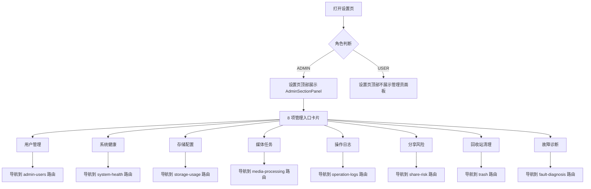
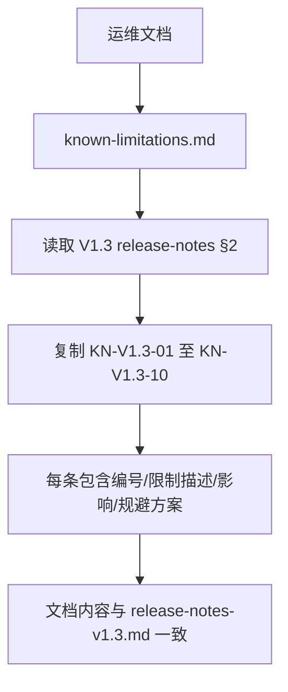
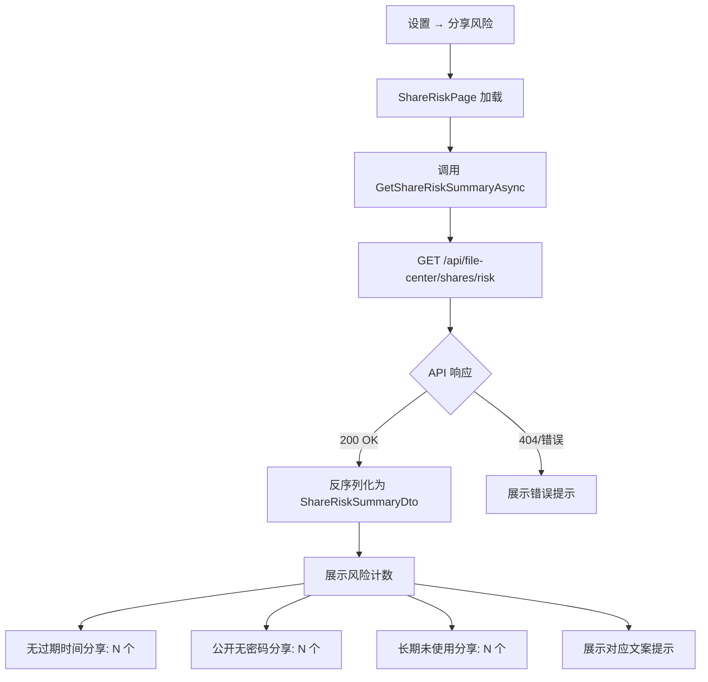
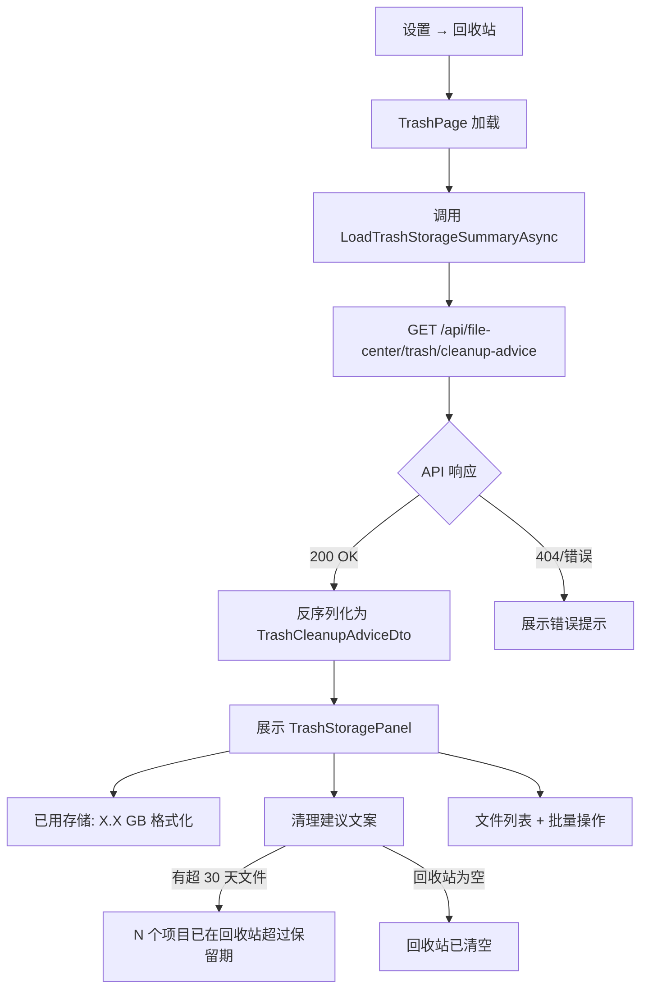
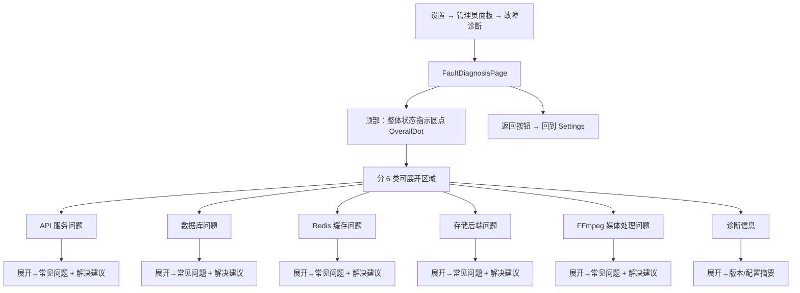
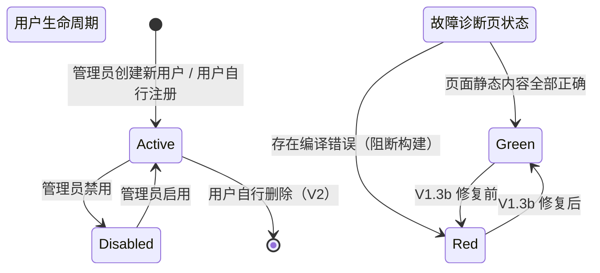

# PrivateCloudDrive V1.3b 维护版 — 用户旅程与场景矩阵

日期：2026-07-10
角色：业务分析师 / Hermes-Business-Analyst
基线来源：`docs/scenario-matrix-v1.3.md`（V1.3 场景矩阵）、`docs/release-notes-v1.3.md`（V1.3 发布说明 §2 已知限制）、`docs/validation/v1.3-mobile-accept-settings-ia.md`（设置页 IA 验收报告）、`docs/validation/v1.3-mobile-accept-media-share.md`（媒体+分享验收报告）、`docs/validation/v1.3-mobile-accept-trash-settings.md`（回收站+设置验收报告）
版本定位：V1.3b 维护版 — 修复 V1.3 QA 验证中发现的 P0/P1 阻塞缺陷、同步已知限制文档、补全管理员入口和故障诊断页处理器

---

## 1. 管理结论

V1.3b 是 V1.3 的维护补丁版，**不新增功能**，仅修复 V1.3 QA 验证（settings-ia、media-share、trash-settings 三份验收报告）中发现的 P0/P1 阻塞缺陷。V1.3b 的 5 个用户故事覆盖：

| 优先级 | 用户旅程 | 目标用户 | 对应 V1.3b 修复内容 |
|--------|----------|----------|---------------------|
| P0 | 设置页 IA 角色适配验收 | 部署管理员 | 确认管理员面板 8 项入口的可见性、角色隔离、导航可用性 |
| P0 | 已知限制文档同步 | 部署管理员 | 将 V1.3 release-notes §2 的全部 11 条 KN 同步至 known-limitations.md |
| P0 | 分享风险提示 UI 验收 | 风险感知用户 | 修复 API 路由不匹配 + DTO 属性名不匹配 |
| P0 | 回收站清理建议 UI 验收 | 风险感知用户 | 修复 API 路由不匹配 + DTO 属性名不匹配 |
| P1 | 故障诊断页面验收 | 非技术使用者/管理员 | 缺失 OnFaultDiagnosisClicked 处理器 + SetHealthDot 参数类型 |

> release-notes-v1.3.md §2 实际包含 **11 条** KN（KN-V1.3-01 至 KN-V1.3-11），补丁版本发布前新增了 KN-V1.3-11（ABP 测试项目版本未同步）。known-limitations.md 已同步全部 11 条。

### V1.3b 与 V1.3 的关系

| 维度 | 关系说明 |
|------|----------|
| 定位 | V1.3b 是 **V1.3 维护补丁版**，不新增功能，仅修复已验证的 P0/P1 阻塞缺陷 |
| 依赖 | V1.3b 依赖 V1.3 的所有代码基线，不新增 API、不新增数据表、不修改权限模型 |
| 数据 | V1.3b 不修改任何数据表结构；仅修复前后端 API 契约不一致 |
| 权限 | V1.3b 不修改 V1.3 已定义的 ADMIN/USER 角色隔离模型 |
| 部署 | V1.3b 不改变 Docker Compose 架构基线；修复后可重新构建发布 |
| 后端 | V1.3b 不新增 API 端点；修复范围仅限 MAUI 前端和后端之间已存在的 API 契约对齐 |

### 修复清单（来源：QA 验收报告）

| 缺陷编号 | 模块 | 严重级别 | 来源 |
|----------|------|---------|------|
| B-V13-01 | 分享风险：API 路由不匹配（/risk-summary → /risk） | P0 阻塞 | media-share 验收报告 |
| B-V13-02 | 分享风险：DTO 属性名不匹配（6 个字段） | P0 阻塞 | media-share 验收报告 |
| B-V13-03 | 回收站：API 路由不匹配（/storage-summary → /cleanup-advice） | P0 阻塞 | trash-settings 验收报告 |
| B-V13-04 | 回收站：DTO 属性名不匹配（3 个字段 + 1 个常量） | P1 连带 | trash-settings 验收报告 |
| B-V13-05 | 设置页：OnFaultDiagnosisClicked 处理器缺失（MAUIX2014） | P0 阻塞 | settings-ia 验收报告 |
| B-V13-06 | 故障诊断页：SetHealthDot 参数类型不匹配（CS1503, Border vs Ellipse） | P0 阻塞 | settings-ia 验收报告 |

---

## 2. 用户角色定义

与 V1.3 完全一致，无变更。详见 `docs/scenario-matrix-v1.3.md §2`。

| 角色 | 代号 | 技术能力 | 主要关注 | 设备 | 说明 |
|------|------|----------|----------|------|------|
| 独立部署者 | DEPLOYER | 能执行命令行、编辑 `.env` | 部署成功、数据安全 | 桌面端 + Docker | 首次部署和升级回滚场景 |
| 日常文件用户 | USER | 只使用 MAUI App | 文件能上传/下载/预览/删除 | Android 手机 | 普通用户，无管理权限 |
| 家庭媒体用户 | MEDIA_USER | 只使用 MAUI App，以照片/视频为主 | 媒体能预览、整理、不丢失 | Android 手机 | 普通用户，同时使用媒体库 |
| 部署管理员 | ADMIN | 熟悉 Docker、CLI 和基本排障 | 系统健康、用户管理、备份恢复 | 桌面端 + Docker | 可访问管理功能 |
| 风险感知用户 | RISK_AWARE | 了解数据安全概念 | 分享风险、回收站清理 | Android 手机 | 所有用户的子视角，关注数据安全 |
| 非技术使用者 | NON_TECH | 只使用 App，不接触命令行 | 一切能在 App 内完成 | Android 手机 | 普通用户，故障诊断页可读性 |

> V1.3b 不修改角色定义。故障诊断页面向所有用户开放（内容静态、不涉及敏感管理信息）。

---

## 3. 用户故事全集

---

### 3.1 US-V13B-01：设置页 IA 角色适配验收

**As a** 部署管理员 (ADMIN)
**I want** 在设置页顶部看到管理入口（服务状态、用户管理、日志、存储等 8 项入口卡片）
**So that** 我能在 App 内完成日常管理，无需切换到 Swagger

#### 3.1.1 正常路径

**业务规则：**

| 规则编号 | 规则 | 原因 |
|----------|------|------|
| BR-IA-01 | `AdminSectionPanel` 的可见性由 `CheckAdminAccessAsync()` 控制，调用 `GetAdminUsersAsync()` API，成功则显示面板 | 角色隔离 |
| BR-IA-02 | 非管理员在 API 调用失败时面板保持隐藏（`IsVisible = false`） | 权限下限安全 |
| BR-IA-03 | 管理员面板包含且仅包含 8 项：用户管理、系统健康、存储配置、媒体任务、操作日志、分享风险、回收站清理、故障诊断 | IA 定版 |
| BR-IA-04 | 每项点击处理器必须存在且注册路由；缺少任意处理器则编译失败 | 编译安全 |
| BR-IA-05 | 故障诊断入口的处理器为 `OnFaultDiagnosisClicked`，需导航到 `fault-diagnosis` 路由 | V1.3b 修复项 |
| BR-IA-06 | 子页面返回后回到 Settings 主页（`Shell.GoToAsync("..")`） | 导航一致性 |
| BR-IA-07 | 普通用户区域的设置项不受管理员面板影响 | 功能独立 |
| BR-IA-08 | HealthStatusDot 显示在设置页右上角，对所有用户可见（绿色/橙色/红色/灰色四色），颜色通过 `SetSystemHealthDotColor` 控制 | 统一健康感知 |

#### 3.1.2 异常路径与用户可见错误

| 异常场景 | 触发条件 | 系统行为 | 用户可见信息 | 解决方案入口 |
|----------|----------|----------|-------------|-------------|
| IA-ERR-01 | `OnFaultDiagnosisClicked` 处理器未实现 | 编译错误 MAUIX2014 | 构建失败，无法生成 APK | 实现处理器方法 |
| IA-ERR-02 | `SetHealthDot` 收到 Border 而非 Ellipse | 编译错误 CS1503 | 构建失败，无法生成 APK | 统一 OverallDot 类型为 Ellipse 或修改方法签名 |
| IA-ERR-03 | 管理员 API 调用失败（网络/服务器） | `AdminSectionPanel` 保持隐藏 | 管理员看不到管理入口但管理功能仍通过 Swagger 可用 | 检查网络后重试 |
| IA-ERR-04 | 路由未注册时导航 | 运行时异常（页面未找到） | 白屏或崩溃 | 在 AppShell 注册路由 |
| IA-ERR-05 | Token 过期后访问设置页 | 管理员 API 返回 401 | 面板隐藏，展示重新登录提示 | 跳转登录页 |

#### 3.1.3 验收条件

| 验收项 | 方法 | 预期 |
|--------|------|------|
| US-V13B-01-AC01 | 管理员登录 → 设置页 | 管理员面板展示 8 项入口卡片 |
| US-V13B-01-AC02 | 普通用户登录 → 设置页 | 管理员面板不展示 |
| US-V13B-01-AC03 | 依次点击 8 项入口 | 每项导航到对应子页面 |
| US-V13B-01-AC04 | 子页面点击返回 | 回到 Settings 主页面 |
| US-V13B-01-AC05 | 构建 `dotnet build -f net10.0-android` | 编译通过，无 MAUIX2014 / CS1503 错误 |
| US-V13B-01-AC06 | HealthStatusDot 对所有用户可见 | 设置页右上角显示颜色圆点 |
| US-V13B-01-AC07 | 管理员面板无故障诊断入口 | 8 项入口完整，OnFaultDiagnosisClicked 已实现 |

---

### 3.2 US-V13B-02：已知限制文档同步

**As a** 部署管理员 (ADMIN)
**I want** 在 `known-limitations.md` 看到 V1.3 的全部已知限制
**So that** 我能在评估部署前了解已知风险

#### 3.2.1 正常路径

**业务规则：**

| 规则编号 | 规则 | 原因 |
|----------|------|------|
| BR-KN-01 | known-limitations.md 必须包含 release-notes-v1.3.md §2 的全部 11 条 KN | 文档一致性 |
| BR-KN-02 | 每条 KN 必须包含：编号、限制描述、影响说明、规避/备注 | 信息完整 |
| BR-KN-03 | known-limitations.md 保留原有的非 V1.3 限制内容（隐私加密、存储恢复、客户端平台等） | 不丢失历史内容 |
| BR-KN-04 | V1.3 KN 与 release-notes-v1.3.md 内容逐条一致 | 避免冲突 |
| BR-KN-05 | known-limitations.md 不重复 V1.3 已修复或已裁定的非限制内容 | 精简可维护 |

#### 3.2.2 异常路径与用户可见错误

| 异常场景 | 触发条件 | 系统行为 | 用户可见信息 | 解决方案入口 |
|----------|----------|----------|-------------|-------------|
| KN-ERR-01 | release-notes-v1.3.md §2 后续更新但 known-limitations.md 未同步 | 内容过时 | 用户在两个文档看到不一致的信息 | 重新同步 |
| KN-ERR-02 | 某条 KN 在 release-notes 中删除但 known-limitations 仍保留 | 文档膨胀 | 用户看到不再适用的限制 | 审核同步 |
| KN-ERR-03 | 格式差异导致排版断裂 | Markdown 渲染异常 | 表格或编号显示混乱 | 修复格式 |

#### 3.2.3 验收条件

| 验收项 | 方法 | 预期 |
|--------|------|------|
| US-V13B-02-AC01 | 比较 known-limitations.md 与 release-notes-v1.3.md §2 | 11 条 KN 全部包含 |
| US-V13B-02-AC02 | 逐条对比内容一致性 | 限制描述、影响、规避方案逐条一致 |
| US-V13B-02-AC03 | 检查 known-limitations.md 保留历史内容 | 原有隐私/存储/客户端/功能范围内容保留 |
| US-V13B-02-AC04 | 检查格式 | Markdown 表格渲染正确 |

---

### 3.3 US-V13B-03：分享风险提示 UI 验收

**As a** 风险感知用户 (RISK_AWARE)
**I want** 在分享列表页顶部看到风险提示文案
**So that** 我意识到分享链接的潜在风险

#### 3.3.1 正常路径

> **V1.3b 修复要点**：
> - MAUI 端调用 URL 从 `/api/file-center/shares/risk-summary` 改为 `/api/file-center/shares/risk`
> - 前端 DTO `ShareRiskSummaryDto` 属性名与后端 `ShareRiskDto` 对齐，或后端添加 `[JsonPropertyName]` 兼容别名

**业务规则：**

| 规则编号 | 规则 | 原因 |
|----------|------|------|
| BR-SHARERISK-01 | 分享风险提示仅在存在至少一个分享链接时展示；无分享时展示空状态"暂无分享" | 业务条件 |
| BR-SHARERISK-02 | 风险计数精确反映当前用户的有效分享状态 | 数据准确性 |
| BR-SHARERISK-03 | 文案不包含敏感信息（文件名、Token、路径） | 安全原则 |
| BR-SHARERISK-04 | 用户数据隔离：不同用户看到不同的风险统计数据 | 隐私边界 |
| BR-SHARERISK-05 | API 路由、DTO 属性名前后端必须一致 | 契约约束 |
| BR-SHARERISK-06 | 页面出错时展示友好错误文案"无法读取分享安全状态"，不崩溃 | 容错 |

**API 契约对齐清单（V1.3b 修复）**：

| 后端 `ShareRiskDto` | 前端 `ShareRiskSummaryDto`（修复后） | 类型 | 说明 |
|---------------------|--------------------------------------|------|------|
| `NoExpirationCount` | `NoExpirationCount` | int | 无过期时间分享数 |
| `PublicNoPasswordCount` | `PublicNoPasswordCount` | int | 公开无密码分享数 |
| `LongUnusedCount` | `LongUnusedCount` | int | 长期未使用分享数 |
| `NoExpirationMessage` | `NoExpirationMessage` | string | 无过期提醒文案 |
| `PublicShareMessage` | `PublicShareMessage` | string | 公开分享提醒文案 |
| `UnusedShareMessage` | `UnusedShareMessage` | string | 未使用分享提醒文案 |

#### 3.3.2 异常路径与用户可见错误

| 异常场景 | 触发条件 | 系统行为 | 用户可见信息 | 解决方案入口 |
|----------|----------|----------|-------------|-------------|
| SHARERISK-ERR-01 | API 路由不匹配（MAUI 仍使用旧 URL） | HTTP 404 | "无法读取分享安全状态" | 修复前端路由为 `/risk` |
| SHARERISK-ERR-02 | DTO 属性名不匹配，JSON 反序列化失败 | 计数显示 "--" | 全部计数不可见 | 对齐 DTO 属性名 |
| SHARERISK-ERR-03 | API 超时或 500 | 错误捕获 | "无法读取分享安全状态，请稍后重试" | 刷新重试 |
| SHARERISK-ERR-04 | Token 过期 | API 返回 401 | "登录已过期，请重新登录" | 跳转登录页 |
| SHARERISK-ERR-05 | 无任何分享 | API 返回空数据 | "暂无分享记录" | 创建分享后查看 |
| SHARERISK-ERR-06 | 网络断开 | HTTP 请求失败 | "网络连接已断开，请检查网络" | 检查网络后重试 |

#### 3.3.3 验收条件

| 验收项 | 方法 | 预期 |
|--------|------|------|
| US-V13B-03-AC01 | ShareRiskPage 调用 API | MAUI 发送 `GET /api/file-center/shares/risk`，HTTP 200 |
| US-V13B-03-AC02 | 存在无过期分享 | 计数 N 正确，文案显示 |
| US-V13B-03-AC03 | 存在公开（无密码）分享 | 计数 N 正确，文案显示 |
| US-V13B-03-AC04 | 存在长期未使用分享 | 计数 N 正确，文案显示 |
| US-V13B-03-AC05 | 无分享时展示空状态 | 展示"暂无分享记录" |
| US-V13B-03-AC06 | API 失败时展示错误提示 | 文案友好，不崩溃 |
| US-V13B-03-AC07 | 用户 A 与用户 B 数据隔离 | 各自看到自己的风险数据 |
| US-V13B-03-AC08 | 后端 ShareRiskDto 与前端对齐 | 6 个字段属性名匹配 |

---

### 3.4 US-V13B-04：回收站清理建议 UI 验收

**As a** 风险感知用户 (RISK_AWARE)
**I want** 在回收站页面底部看到清理建议（已删除文件数量和占用的空间）
**So that** 我能决定是否需要清理回收站

#### 3.4.1 正常路径

> **V1.3b 修复要点**：
> - MAUI 端调用 URL 从 `/api/file-center/trash/storage-summary` 改为 `/api/file-center/trash/cleanup-advice`
> - 前端 DTO `TrashStorageSummaryDto` 属性名与后端 `TrashCleanupAdviceDto` 对齐

**业务规则：**

| 规则编号 | 规则 | 原因 |
|----------|------|------|
| BR-TRASH-01 | 回收站清理建议仅在回收站非空时展示；空回收站展示"回收站已清空" | 业务条件 |
| BR-TRASH-02 | 清理建议文案包含：文件数量 + 占用空间 + 保留天数 三要素 | 信息完整 |
| BR-TRASH-03 | 文案实用非技术化，不制造恐慌 | 体验要求 |
| BR-TRASH-04 | 用户数据隔离：不同用户看到自己的回收站状态 | 隐私边界 |
| BR-TRASH-05 | API 路由、DTO 属性名前后端必须一致 | 契约约束 |
| BR-TRASH-06 | 回收站不属于"管理员专有"，普通用户和管理员各自管理自己的回收站 | 权限归属 |

**API 契约对齐清单（V1.3b 修复）**：

| 后端 `TrashCleanupAdviceDto` | 前端 `TrashStorageSummaryDto`（修复后） | 类型 | 说明 |
|-------------------------------|----------------------------------------|------|------|
| `TrashSizeBytes` | `TrashSizeBytes` | long | 回收站总大小（字节） |
| `AutoCleanupCount` | `AutoCleanupCount` | int | 超保留期文件数 |
| `CleanupAdviceMessage` | `CleanupAdviceMessage` | string | 清理建议文案 |
| `RetentionDays` | `RetentionDays` | int | 保留天数（如 30） |

#### 3.4.2 异常路径与用户可见错误

| 异常场景 | 触发条件 | 系统行为 | 用户可见信息 | 解决方案入口 |
|----------|----------|----------|-------------|-------------|
| TRASH-ERR-01 | API 路由不匹配（MAUI 仍使用旧 URL） | HTTP 404 | "回收站存储信息暂时不可用" | 修复前端路由为 `/cleanup-advice` |
| TRASH-ERR-02 | DTO 属性名不匹配，JSON 反序列化失败 | 各字段为 0/空 | 展示"0 字节"和空文案 | 对齐 DTO 属性名 |
| TRASH-ERR-03 | API 超时或 500 | 错误捕获 | "回收站存储信息暂时不可用" | 刷新重试 |
| TRASH-ERR-04 | Token 过期 | API 返回 401 | "登录已过期，请重新登录" | 跳转登录页 |
| TRASH-ERR-05 | 回收站为空 | API 返回空数据 | "回收站已清空" | 无操作 |
| TRASH-ERR-06 | 清理操作（批量删除/清空）时 API 失败 | 操作提示 | "删除失败，请稍后重试" | 重试操作 |

#### 3.4.3 验收条件

| 验收项 | 方法 | 预期 |
|--------|------|------|
| US-V13B-04-AC01 | TrashPage 调用 API | MAUI 发送 `GET /api/file-center/trash/cleanup-advice`，HTTP 200 |
| US-V13B-04-AC02 | 回收站非空（有超 30 天文件） | `TrashSizeBytes` 格式化显示，`CleanupAdviceMessage` 显示清理建议 |
| US-V13B-04-AC03 | 回收站非空（文件均在 30 天内） | 显示"已用存储 X.X GB"，文案不提示清理 |
| US-V13B-04-AC04 | 回收站为空 | 显示"回收站已清空" |
| US-V13B-04-AC05 | `TrashSizeBytes` 显示格式化字节（KB/MB/GB） | 用户可读的格式 |
| US-V13B-04-AC06 | API 失败时展示错误提示 | 文案友好，不崩溃 |
| US-V13B-04-AC07 | 后端 DTO 与前端对齐 | 4 个字段属性名匹配 |
| US-V13B-04-AC08 | 清空回收站后重新加载 | 统计数据更新为空 |

---

### 3.5 US-V13B-05：故障诊断页面验收

**As a** 部署管理员 / 非技术使用者 (ADMIN / NON_TECH)
**I want** 一个故障诊断页面，按类别列出常见问题和解决建议
**So that** 我可以在遇到问题时自助排查

#### 3.5.1 正常路径

> **V1.3b 修复要点**：
> - `SettingsPage.xaml.cs` 添加 `OnFaultDiagnosisClicked` 处理器（`Shell.Current.GoToAsync("fault-diagnosis")`）
> - `FaultDiagnosisPage.xaml.cs` 中 `OverallDot` 类型改为 `<shapes:Ellipse>` 或 `SetHealthDot` 方法签名改为接受 `Border`
> - 故障诊断页路由已在 AppShell 注册：`fault-diagnosis`

**业务规则：**

| 规则编号 | 规则 | 原因 |
|----------|------|------|
| BR-FAULT-01 | 故障诊断页面为**静态内容**（不使用实时检测数据），但与健康页内容不重复 | BR-V13B-01 |
| BR-FAULT-02 | 故障诊断面向所有用户开放（URL 见路由注册），管理员和非技术使用者均可查看 | 设计决策 |
| BR-FAULT-03 | 6 类可展开区域：API 服务、数据库、Redis 缓存、存储后端、FFmpeg 媒体处理、诊断信息 | IA 定版 |
| BR-FAULT-04 | 整体状态指示圆点 `OverallDot` 类型与 `SetHealthDot` 方法签名参数类型一致 | 编译约束 |
| BR-FAULT-05 | 顶部圆点为 `<shapes:Ellipse>` 类型（与其他 6 个状态点一致），颜色通过 `Fill` 属性控制 | 类型统一 |
| BR-FAULT-06 | 故障诊断内容不泄露敏感信息（路径、连接串、密钥、Token） | 安全原则 |
| BR-FAULT-07 | 每类展开区域默认折叠状态，点击切换展开/折叠 | 信息架构 |
| BR-FAULT-08 | 故障诊断入口 `OnFaultDiagnosisClicked` 处理器必须在 `SettingsPage.xaml.cs` 中实现 | 编译安全 |

#### 3.5.2 异常路径与用户可见错误

| 异常场景 | 触发条件 | 系统行为 | 用户可见信息 | 解决方案入口 |
|----------|----------|----------|-------------|-------------|
| FAULT-ERR-01 | `OnFaultDiagnosisClicked` 未实现 | 编译错误 MAUIX2014 | 构建失败，无法生成 APK | 实现处理器 |
| FAULT-ERR-02 | `SetHealthDot` 参数类型不匹配 | 编译错误 CS1503 | 构建失败，无法生成 APK | 统一类型为 Ellipse |
| FAULT-ERR-03 | 故障诊断路由未注册 | 导航到未知路由时崩溃 | 白屏或 Crash | 在 AppShell.xaml.cs 注册 |
| FAULT-ERR-04 | 返回按钮异常 | GoToAsync("..") 失败 | 停留在当前页 | 刷新后重试 |
| FAULT-ERR-05 | 展开/折叠切换事件绑定错误 | 点击无响应 | 区域无法展开 | 检查点击事件绑定 |
| FAULT-ERR-06 | 内容包含过时/错误信息 | 用户读到误导性建议 | 采取错误排障步骤 | 更新静态内容 |

#### 3.5.3 验收条件

| 验收项 | 方法 | 预期 |
|--------|------|------|
| US-V13B-05-AC01 | 构建 `dotnet build -f net10.0-android` | 编译通过，无 MAUIX2014 / CS1503 错误 |
| US-V13B-05-AC02 | 管理员 Settings 页存在故障诊断入口 | 管理员面板第 8 项 |
| US-V13B-05-AC03 | 点击故障诊断入口 | 导航到 FaultDiagnosisPage |
| US-V13B-05-AC04 | 页面展示 6 类可展开区域 | API 服务 / 数据库 / Redis / 存储 / FFmpeg / 诊断信息 |
| US-V13B-05-AC05 | 点击每类区域展开/折叠 | 展开显示内容，折叠隐藏 |
| US-V13B-05-AC06 | 顶部整体状态圆点显示 | OverallDot 为 Ellipse，颜色正确 |
| US-V13B-05-AC07 | 返回按钮 | 回到 Settings 主页 |
| US-V13B-05-AC08 | 内容均为静态文本（不调用实时 API） | 页面加载时无 API 调用 |
| US-V13B-05-AC09 | 内容与健康页不重复 | 无重叠的组件状态描述 |
| US-V13B-05-AC10 | 无敏感信息泄露 | 内容不含连接串/密钥/路径 |

---

## 4. 管理员角色状态机

与 V1.3 完全一致，无变更。详见 `docs/scenario-matrix-v1.3.md §4`。

---

## 5. 接口依赖矩阵

### V1.3b 不新增 API

V1.3b 是维护版，**不新增、不修改任何后端端点**。修复范围仅限前端（MAUI 端）的 API 调用 URL 和 DTO 对齐：

| 编号 | 影响端点 | 修改类型 | 位置 | 变更内容 |
|------|----------|----------|------|----------|
| API-FIX-01 | `/api/file-center/shares/risk-summary` | URL 修正 | MAUI `CloudDriveApiClient.cs` | 改为 `/api/file-center/shares/risk` |
| API-FIX-02 | `/api/file-center/shares/risk` → `ShareRiskSummaryDto` | DTO 对齐 | MAUI `CloudDriveApiClient.cs` | 6 个字段属性名对齐后端 `ShareRiskDto` |
| API-FIX-03 | `/api/file-center/trash/storage-summary` | URL 修正 | MAUI `CloudDriveApiClient.cs` | 改为 `/api/file-center/trash/cleanup-advice` |
| API-FIX-04 | `/api/file-center/trash/cleanup-advice` → `TrashStorageSummaryDto` | DTO 对齐 | MAUI `CloudDriveApiClient.cs` | 4 个字段属性名对齐后端 `TrashCleanupAdviceDto` |

### 后端已验证的端点（V1.3b 不做修改）

| 编号 | 端点 | 方法 | 角色 | 验证状态 |
|------|------|------|------|----------|
| API-B01 | `/api/file-center/shares/risk` | GET | USER/ADMIN | ✅ 后端单元测试通过（10 个用例全部 PASS） |
| API-B02 | `/api/file-center/trash/cleanup-advice` | GET | USER/ADMIN | ✅ 后端单元测试通过（数据隔离/保留期/文案全部 PASS） |

---

## 6. 权限矩阵（增量）

与 V1.3 完全一致，V1.3b 无变更。详见 `docs/scenario-matrix-v1.3.md §6`。

| 权限项 | ADMIN | USER |
|--------|-------|------|
| 用户列表查看 | ✅ 全部用户 | ❌ |
| 创建用户 | ✅ | ❌ |
| 禁用/启用用户 | ✅（不能对自己） | ❌ |
| 重置用户密码 | ✅（不能对自己） | ❌（只能改自己密码） |
| 调整用户配额 | ✅ | ❌ |
| 系统健康检查 | ✅ 全量 | ❌ |
| 操作日志全量查询 | ✅ 所有用户 | ⚠️ 仅自己 |
| 存储配置查看 | ✅ | ❌ |
| 媒体任务管理（全部用户） | ✅ | ❌（V1.2：仅自己） |
| 全部分享审计 | ✅ 只读 | ❌ |
| 回收站管理 | ✅ 仅自己文件 | ✅ 仅自己文件 |
| 分享管理 | ✅ 仅自己分享新增 | ✅ 仅自己分享 |
| 回收站清理建议 | ✅ | ✅ |
| **故障诊断页查看** | ✅ | ✅（V1.3b 确认） |
| Settings 管理员面板 | ✅ 8 项入口 | ❌（V1.3b 确认） |
| Settings HealthStatusDot | ✅ 四色圆点 | ✅ 四色圆点 |

> V1.3b 唯一增补：故障诊断页面面向**所有用户**（非管理员也可查看），HealthStatusDot 对所有用户可见。

---

## 7. 数据字典（增量）

V1.3b 不修改任何数据表结构。无新增字段、无新增索引、无新增实体。

---

## 8. 业务术语表（增量）

V1.3b 无新术语。详见 `docs/scenario-matrix-v1.3.md §8`。

| 术语 | 英文 | 定义 | 上下文 |
|------|------|------|--------|
| 故障诊断 | Fault Diagnosis | 静态页面，按类别列出常见问题和解决建议，帮助用户自助排查 | V1.3b 验收焦点 |
| API 契约 | API Contract | 前后端约定的 API 路由和 DTO 字段定义，V1.3b 验证其一致性 | V1.3b 修复核心 |
| 管理层可见性 | Admin Panel Visibility | 管理员面板根据角色动态显示/隐藏的机制 | V1.3b 验收焦点 |
| 维护版 | Maintenance Release | 不新增功能、仅修复缺陷的补丁版本 | V1.3b 版本定义 |

---

## 9. QA 验收用例目录

### V1.3b 验收用例

| 编号 | 用户故事 | 用例数 | 覆盖重点 |
|------|----------|--------|----------|
| TC-V13B-01 | US-V13B-01 设置页 IA 角色适配 | 7 | 面板可见性、8 项导航、角色隔离、编译通过 |
| TC-V13B-02 | US-V13B-02 已知限制文档同步 | 4 | 内容完整、逐条一致、格式正确 |
| TC-V13B-03 | US-V13B-03 分享风险提示 UI | 8 | API 路由对齐、DTO 对齐、数据隔离、空状态、错误处理 |
| TC-V13B-04 | US-V13B-04 回收站清理建议 UI | 8 | API 路由对齐、DTO 对齐、统计数据正确、空状态、错误处理 |
| TC-V13B-05 | US-V13B-05 故障诊断页面 | 10 | 编译通过、6 类展开、导航、静态内容、安全性 |
| **合计** | **5 个用户故事** | **37** | **修复验证 / 契约对齐 / 编译安全 / 边界场景** |

### V1.3 已有用例回归

V1.3b 修复后需回归以下 V1.3 用例，确保修复未引入退化：

| 编号 | 回归范围 | 回归原因 |
|------|----------|----------|
| REG-V13B-01 | Settings 主页导航至所有子页面 | 新增 OnFaultDiagnosisClicked 后需验证其他入口不受影响 |
| REG-V13B-02 | 分享管理页创建/取消/续期分享 | 修改分享风险 API 调用后需验证分享主链路正常 |
| REG-V13B-03 | 回收站页面批量删除/恢复/清空 | 修改回收站 API 调用后需验证回收站操作主链路正常 |
| REG-V13B-04 | 普通用户登录 → Settings → 管理员面板不可见 | 确保角色隔离未退化 |
| REG-V13B-05 | 主题切换不影响编译 | 新增 XAML 元素后确认 Light/Dark 主题均正常 |
| REG-V13B-06 | 整体构建 `dotnet build -f net10.0-android` | 确认修复后构建通过 |

---

## 10. 发布验证清单

### 10.1 编译验证（P0 — 必须通过）

| 检查项 | 方法 | 预期 |
|--------|------|------|
| V13B-BUILD-01 | `dotnet build -f net10.0-android` | 编译通过，错误数 = 0 |
| V13B-BUILD-02 | 检查已知的 MAUIX2014 | 无 `OnFaultDiagnosisClicked` 相关错误 |
| V13B-BUILD-03 | 检查已知的 CS1503 | 无 `SetHealthDot` 参数不匹配错误 |
| V13B-BUILD-04 | 无新增编译警告（允许不影响构建的 NuGet 版本警告） | 零错误，警告量不增加 |

### 10.2 API 契约验证（P0）

| 检查项 | 方法 | 预期 |
|--------|------|------|
| V13B-API-01 | 确认 MAUI 分享风险 API URL = `/api/file-center/shares/risk` | 实际发送请求 URL 正确 |
| V13B-API-02 | 确认 MAUI 回收站 API URL = `/api/file-center/trash/cleanup-advice` | 实际发送请求 URL 正确 |
| V13B-API-03 | 前端 ShareRiskSummaryDto 字段与后端 ShareRiskDto 一致 | 6 个字段属性名完全一致 |
| V13B-API-04 | 前端 TrashStorageSummaryDto 字段与后端 TrashCleanupAdviceDto 一致 | 4 个字段属性名完全一致 |
| V13B-API-05 | 分享风险 API 返回 JSON 可被前端正确反序列化 | 全部字段非空默认值正确 |

### 10.3 文档验证

| 检查项 | 方法 | 预期 |
|--------|------|------|
| V13B-DOC-01 | known-limitations.md 包含 V1.3 全部 11 条 KN | 11 条，编号 KN-V1.3-01 至 KN-V1.3-11 |
| V13B-DOC-02 | 每条 KN 包含限制描述 + 影响 + 规避方案 | 三列完整 |
| V13B-DOC-03 | known-limitations.md 保留历史内容 | 原有隐私/存储/客户端/功能范围章节保留 |
| V13B-DOC-04 | 场景矩阵文档已更新 | 本文件（scenario-matrix-v1.3b.md）已生成 |

### 10.4 功能验收

| 检查项 | 方法 | 预期 |
|--------|------|------|
| V13B-FUNC-01 | 管理员登录 → Settings → 8 项管理入口可见 | 全部展示且可点击导航 |
| V13B-FUNC-02 | 管理员点击故障诊断 | 导航到 FaultDiagnosisPage，6 类区域可展开 |
| V13B-FUNC-03 | 普通用户登录 → Settings → 无管理员面板 | 8 项管理入口不可见 |
| V13B-FUNC-04 | 分享风险页正确显示计数和文案 | 后端返回的数据与前端展示一致 |
| V13B-FUNC-05 | 回收站页正确显示大小和清理建议 | 后端返回的数据与前端展示一致 |
| V13B-FUNC-06 | 回收站统计数据与文件列表一致 | 统计正确，无数据偏差 |

### 10.5 安全验证

| 检查项 | 方法 | 预期 |
|--------|------|------|
| V13B-SEC-01 | 故障诊断页内容不含敏感信息 | 无连接字符串/密钥/物理路径 |
| V13B-SEC-02 | 分享风险文案不含敏感数据 | 无暴露文件名/Token/路径 |
| V13B-SEC-03 | 管理员面板非管理员不可见 | 普通用户Settings顶部无管理区 |

### 10.6 回归验证

| 检查项 | 方法 | 预期 |
|--------|------|------|
| V13B-REG-01 | V1.2/V1.3 分享主链路 | 创建/取消/续期分享功能正常 |
| V13B-REG-02 | V1.2/V1.3 回收站操作 | 批量删除/恢复/清空功能正常 |
| V13B-REG-03 | V1.2/V1.3 设置页其他功能 | 主题切换、账号信息、关于页面正常 |
| V13B-REG-04 | V1.2 相册/时间线/媒体预览 | 不受前端修复影响 |

---

*本文档由 Hermes-Business-Analyst 于 2026-07-10 生成，覆盖 V1.3b 维护版的全部 5 个用户故事、37 个 QA 验收用例、6 个已知 P0/P1 阻塞缺陷修复验证。*
