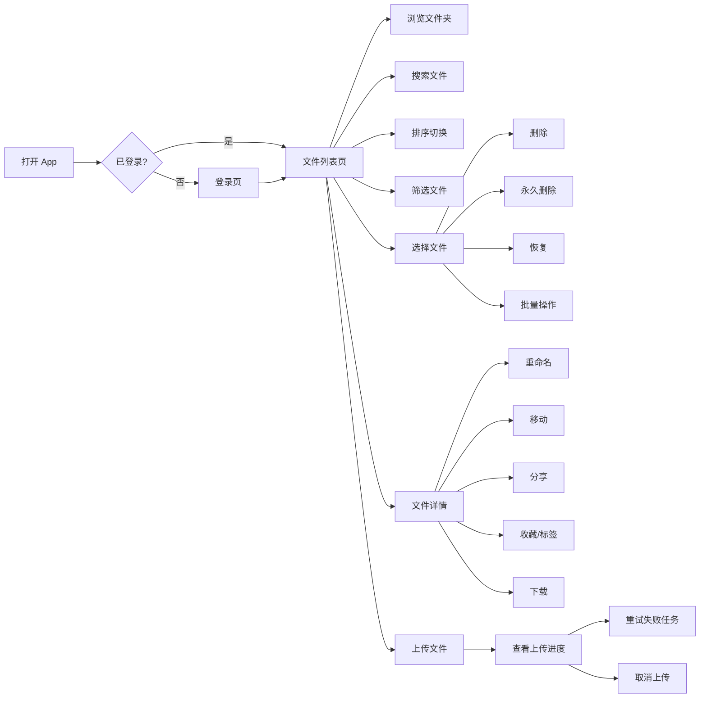
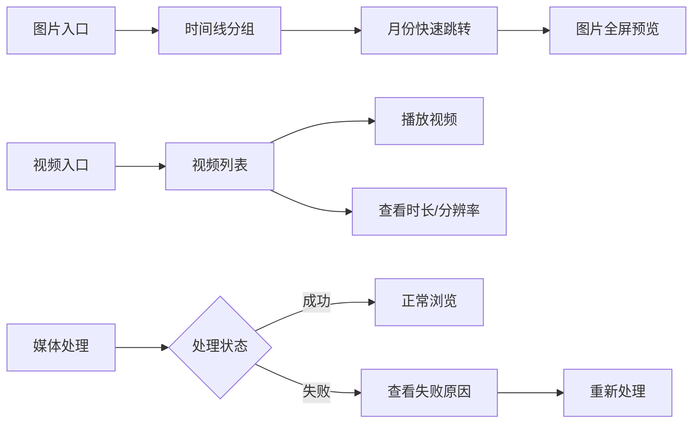
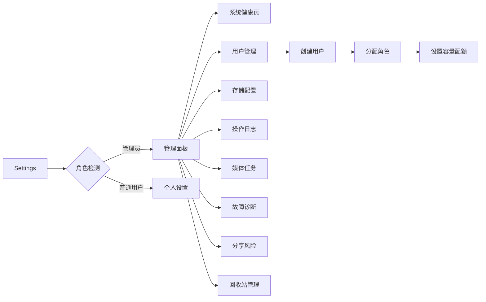

# PrivateCloudDrive V1.4 用户旅程与场景矩阵

| 文档版本 | 日期 | 负责人 |
|:-------:|:----:|:------:|
| 1.0 | 2026-07-12 | 产品总监 (pm) |

---

## 1. 用户角色定义

| 角色 | 职责 | 使用频率 | V1.4 重点关注 |
|------|------|---------|:------------:|
| **个人用户** | 私有云盘文件管理、照片备份、视频观看 | 每日 | ✅ |
| **家庭用户** | 多家庭成员共享使用 | 每周 | ❌（V2.0） |
| **管理员** | 实例配置、用户管理、系统监控 | 不定期 | ✅ |
| **小团队** | 共享工作文件 | 每日 | ❌（V2.0） |
| **部署者** | 首次部署、升级、备份恢复 | 一次性/不定期 | ❌（V1.3 已覆盖） |

---

## 2. 核心用户旅程

### 2.1 日常文件管理旅程

### 2.2 媒体浏览旅程

### 2.3 管理员运维旅程

---

## 3. 页面场景矩阵

| # | 页面 | V1.3b 状态 | V1.4 变化 | 新增/修改 | 角色 |
|---|------|:---------:|-----------|:--------:|:----:|
| P01 | 登录页 | ✅ 已有 | 无变化 | — | 所有 |
| P02 | 文件列表页 | ✅ 已有 | +搜索入口 +排序筛选弹窗 +多选模式 | **修改** | 所有 |
| P03 | 搜索结果页 | ❌ 无 | **新增搜索独立页面** | **新增** | 所有 |
| P04 | 图片时间线页 | ✅ 已有 | +月份跳转 +处理失败重试 | 修改 | 所有 |
| P05 | 视频列表页 | ✅ 已有 | +时长/分辨率/大小信息 | 修改 | 所有 |
| P06 | 上传页 | ✅ 已有 | +重试/取消/清除 | 修改 | 所有 |
| P07 | 文件详情页 | ✅ 已有 | 无变化 | — | 所有 |
| P08 | 预览（图片） | ✅ 已有 | 无变化 | — | 所有 |
| P09 | 预览（视频） | ✅ 已有 | 无变化 | — | 所有 |
| P10 | 分享创建页 | ✅ 已有 | 无变化 | — | 所有 |
| P11 | Settings 主页面 | ✅ 已有 | +容量卡片 +分享管理入口 | **修改** | 所有 |
| P12 | 我的分享页 | ❌ 无 | **新增：分享管理列表** | **新增** | 所有 |
| P13 | 用户管理页 | ✅ 已有 | +角色选择器(创建用户时) | 修改 | 管理员 |
| P14 | 系统健康页 | ✅ 已有 | +缓存说明文案 | 修改 | 管理员 |
| P15 | 存储配置页 | ✅ 已有 | 无变化 | — | 管理员 |
| P16 | 操作日志页 | ✅ 已有 | 无变化 | — | 管理员 |
| P17 | 媒体任务页 | ✅ 已有 | 无变化 | — | 管理员 |
| P18 | 故障诊断页 | ✅ 已有 | 无变化 | — | 管理员 |
| P19 | 分享风险页 | ✅ 已有 | 无变化 | — | 管理员 |
| P20 | 回收站页 | ✅ 已有 | +批量选择(复用UX-02) | 修改 | 所有 |

### 页面变更汇总

| 变更类型 | 数量 | 页面 |
|:--------:|:----:|------|
| **新增页面** | 2 | 搜索结果页(P03)、我的分享页(P12) |
| **修改已有页面** | 9 | 文件列表页(P02)、图片页(P04)、视频页(P05)、上传页(P06)、Settings(P11)、用户管理(P13)、健康页(P14)、回收站(P20) |
| **无变化** | 9 | 登录页(P01)、详情页(P07)、图片预览(P08)、视频预览(P09)、分享创建(P10)、存储配置(P15)、操作日志(P16)、媒体任务(P17)、故障诊断(P18)、分享风险(P19) |

---

## 4. 状态矩阵

### 4.1 各页面状态覆盖

| # | 页面 | 加载态 | 空状态 | 错误态 | 弱网态 | 权限不足 |
|---|------|:------:|:------:|:------:|:------:|:--------:|
| P01 | 登录页 | spinner | — | 错误密码提示 | 网络不可用提示 | — |
| P02 | 文件列表页 | skeleton | "此目录为空" | 加载失败重试 | 离线提示 | — |
| P03 | 搜索结果页 | spinner | "未找到匹配文件" | 搜索失败重试 | 搜索超时提示 | — |
| P04 | 图片时间线 | skeleton | "暂无图片" | 加载失败重试 | 缩略图占位 | — |
| P05 | 视频列表 | skeleton | "暂无视频" | 加载失败重试 | 封面占位 | — |
| P06 | 上传页 | — | "无上传任务" | 失败状态+重试按钮 | 自动暂停 | — |
| P11 | Settings | skeleton | — | 加载失败重试 | 部分数据过期 | 部分面板隐藏 |
| P12 | 我的分享 | skeleton | "暂无分享" | 加载失败重试 | 部分数据过期 | — |
| P13 | 用户管理 | spinner | "暂无用户" | 加载失败重试 | 操作不可用 | 非管理员不可见 |
| P14 | 健康页 | spinner | — | 部分组件 FAIL 标记 | 超时组件灰色 | 非管理员不可见 |
| P20 | 回收站 | spinner | "回收站为空" | 加载失败重试 | 离线提示 | — |

### 4.2 状态设计要求

| 状态 | 设计原则 |
|------|---------|
| **加载态** | 使用 skeleton screen 或 spinner，避免白屏闪跳 |
| **空状态** | 简洁文案 + 引导操作（如有），不制造焦虑 |
| **错误态** | 显示用户可读的错误信息 + 重试按钮，不暴露技术堆栈 |
| **弱网态** | 显示离线/超时提示，不阻塞用户浏览已有缓存内容 |
| **权限不足** | 页面不可见或控件隐藏（管理员/普通用户），不弹无权限错误 |

---

## 5. 搜索体验场景详解

### 搜索入口

| 场景 | 步骤 | 期望结果 |
|------|------|---------|
| S1. 用户记得文件名 | 点击搜索图标 → 输入完整或部分文件名 → 按回车 | 搜索结果按匹配度排列 |
| S2. 用户只记得文件类型 | 点击搜索图标 → 输入 `*.pdf` 或按筛选按钮 → 选"PDF" | 显示所有 PDF 文件 |
| S3. 搜索无结果 | 输入不存在的关键词 | 显示"未找到匹配的文件" + 清除搜索按钮 |
| S4. 搜索包含子目录 | 搜索"report" | 显示当前目录及子目录中匹配的文件 |
| S5. 搜索后浏览 | 搜索"photo" → 点击某个结果进入文件夹 | 进入搜索结果所在的文件夹 |

### 搜索行为约束

| 约束 | 规则 |
|------|------|
| 搜索范围 | 仅当前用户文件，不跨用户 |
| 搜索字段 | 文件名（ILIKE），不搜索文件内容 |
| 搜索结果 | 包含文件和文件夹 |
| 分页 | 同文件列表分页逻辑 |
| 搜索时机 | 用户主动触发（输入后按回车或延迟 300ms 自动触发） |
| 清除搜索 | 点击清除图标或返回按钮 |

---

## 6. 批量操作场景详解

| 场景 | 步骤 | 期望结果 |
|------|------|---------|
| B1. 选择性删除 | 长按 → 进入多选 → 勾选 3 个文件 → 点击删除 → 确认 | 3 个文件移入回收站 |
| B2. 全选后批量永久删除 | 进入多选 → 全选 → 点击永久删除 → 确认（强警告） | 所有文件被永久删除 |
| B3. 跨目录选择 | 进入多选 → 勾选文件 A → 进入子目录 → 勾选文件 B | 当前目录选择不清除（需确认技术可行性） |
| B4. 批量操作中取消 | 多选 → 点击取消/返回 | 退出多选模式，文件保持原状态 |

### 批量操作约束

| 约束 | 规则 |
|------|------|
| 单次最多选择 | 100 个文件 |
| 操作类型 | 删除（移入回收站）/ 恢复（从回收站）/ 永久删除（不可恢复）|
| 二次确认 | 删除和永久删除必须有确认弹窗；永久删除增加"此操作不可恢复"警告 |
| 进度反馈 | 加载指示器；完成后自动退出多选模式并刷新列表 |
| 操作中可取消 | 弹出确认框时用户可选择"取消"回退 |

---

## 7. 容量可视化场景详解

| 场景 | 步骤 | 期望结果 |
|------|------|---------|
| C1. 查看容量 | Settings → 看到容量卡片 | 显示进度条 + "已用 12.5GB / 总 50GB" |
| C2. 容量告警 | 已用空间超过 90% | 进度条变为橙色/红色，显示"空间不足"提示 |
| C3. 上传超限 | 剩余空间 < 上传文件大小 | 提示"存储空间不足，无法上传" + 清理建议 |
| C4. 管理员查看配额 | 用户管理 → 用户详情 | 显示该用户的配额和使用情况 |

---

## 8. 验收矩阵

| 验收场景 | 对应 AC | 优先级 | 验证方式 | 负责人 |
|---------|:-------:|:------:|---------|:------:|
| P02 搜索入口+搜索行为 | AC-UX01-A~H | P0 | 模拟器 | qa-eng |
| P03 搜索结果页所有状态 | AC-UX01-B~G | P0 | 模拟器 | qa-eng |
| P02 多选模式+批量操作 | AC-UX02-A~J | P0 | 模拟器 | qa-eng |
| P11 容量卡片展示 | AC-UX03-A~F | P0 | 模拟器 | qa-eng |
| P02 排序筛选底部弹窗 | AC-UX04-A~H | P0 | 模拟器 | qa-eng |
| P13 创建用户角色选择 | AC-KN03-A~D | P0 | 模拟器 | qa-eng |
| P14 健康页缓存说明 | AC-KN02-A~B | P0 | 模拟器 | qa-eng |
| P12 我的分享管理 | AC-UX05-A~F | P1 | 模拟器 | qa-eng |
| P06 上传重试/取消 | AC-UX06-A~F | P1 | 模拟器 | qa-eng |
| P04/P05 媒体库交互 | AC-UX07-A~E | P1 | 模拟器 | qa-eng |
| P11 设置页 IA 调优 | AC-UX08-A~E | P1 | 模拟器 | qa-eng |
| QA-01 真机 19 项全链路 | QA-01-A~S | P0 | **真机** | qa-eng |

---

*本文档由 Hermes 产品总监 (pm) 基于 V1.4 发布范围定义生成。*
