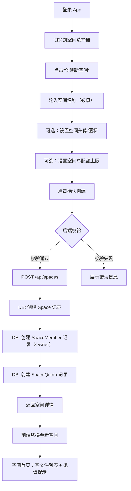
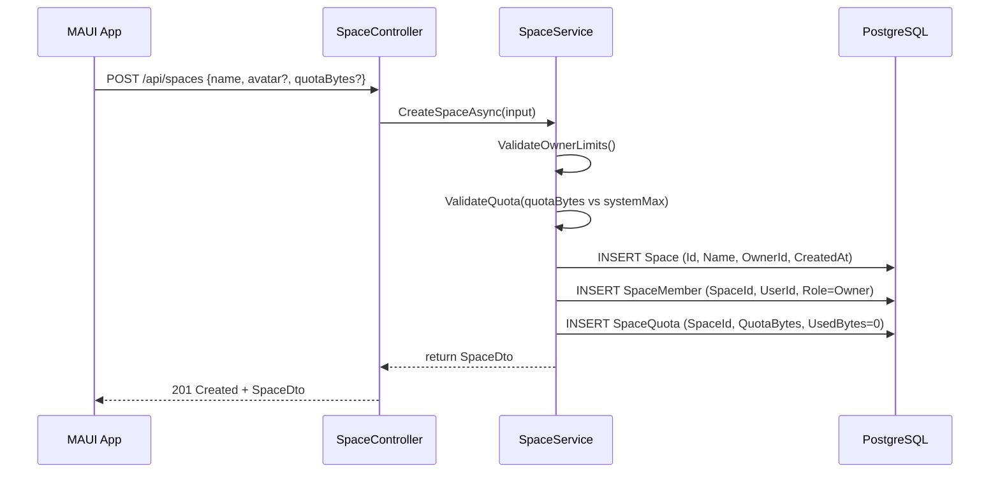
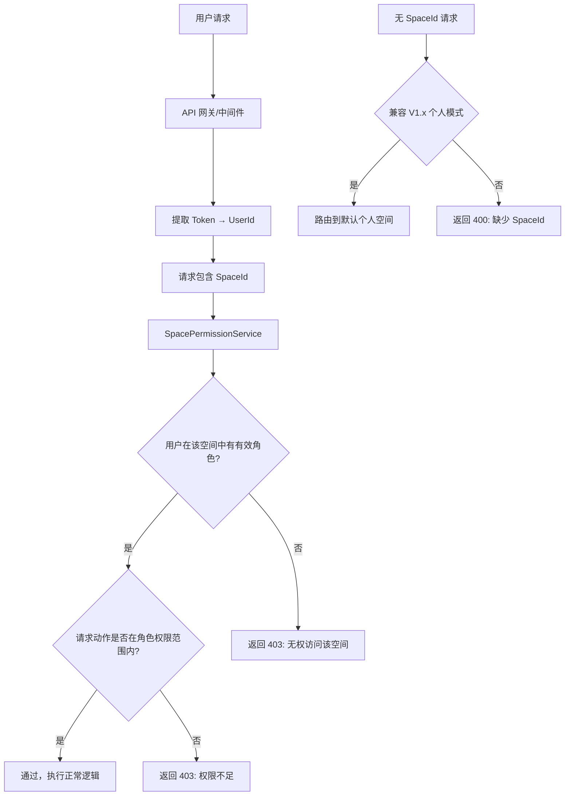
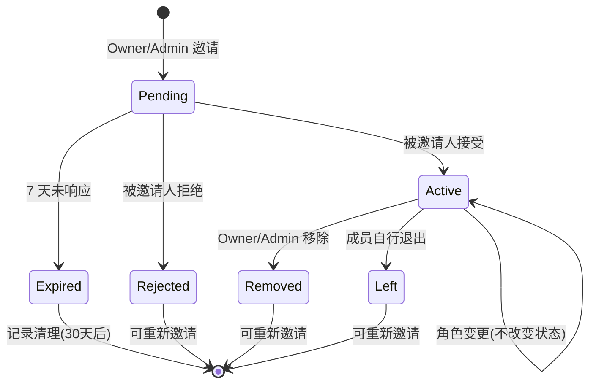
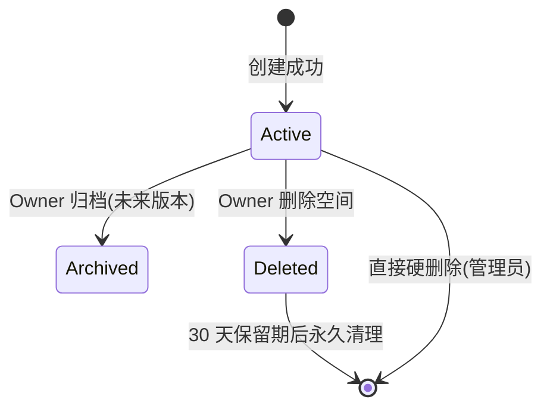

# PrivateCloudDrive V2.0 用户旅程与场景矩阵

| 文档版本 | 日期 | 负责人 |
|:-------:|:----:|:------:|
| 1.0 | 2026-07-14 | Hermes-Business-Analyst（business-analyst） |

参考输入：

- `docs/v2.0-pre-study.md` — V2.0 架构预研报告
- `docs/product-roadmap-next.md` §4.6 — 产品路线图 V2.0 候选
- `docs/scenario-matrix-v1.4.md` — V1.4 场景矩阵格式参考
- `docs/scenario-matrix-v1.3b.md` — V1.3b 场景矩阵格式参考
- `docs/release-plan-v1.4.md` — V1.4 发布计划（明确 V2.0 不做内容）

> **前置说明**：V2.0 定位为"从个人 OwnerId 云盘升级为 Space 云盘的架构版本"，本矩阵仅覆盖 **V2.0 MVP 空间底座** 范围，不包含 AI 搜索、桌面同步、iOS 支持、Web/Blazor 管理后台、HLS 转码、外部登录关闭环。详细范围论证见 `docs/v2.0-pre-study.md`。

---

## 1. V2.0 角色定义

### 1.1 新增 V2.0 角色

| 角色 | 代号 | 所属空间角色 | 权限等级 | 技术能力 | 主要关注 | 设备 |
|------|------|------------|:--------:|----------|----------|------|
| **空间拥有者** | SPACE_OWNER | Owner | 5（最高） | 会使用 MAUI App | 空间创建/管理、成员邀请、配额设置、数据安全 | Android 手机 |
| **空间管理员** | SPACE_ADMIN | Admin | 4 | 会使用 MAUI App | 成员管理、文件管理、分享管理 | Android 手机 |
| **空间成员** | SPACE_MEMBER | Member | 2 | 只使用 MAUI App | 空间内文件上传/下载/编辑、共享家庭资料 | Android 手机 |
| **空间查看者** | SPACE_VIEWER | Viewer | 1 | 只使用 MAUI App | 只读访问空间文件，不可上传/修改/删除 | Android 手机 |
| **个人用户** | PERSONAL | 无空间角色 | 0 | 只使用 MAUI App | 仅有个人默认空间，未加入任何家庭/团队空间 | Android 手机 |

### 1.2 空间角色权限矩阵

| 操作 | Owner | Admin | Member | Viewer | 个人用户（无空间） |
|------|:-----:|:-----:|:------:|:------:|:----------------:|
| 创建空间 | ✅ | ❌ | ❌ | ❌ | ✅（首次） |
| 编辑空间信息（名称/头像） | ✅ | ✅ | ❌ | ❌ | ❌ |
| 删除空间 | ✅ | ❌ | ❌ | ❌ | ❌ |
| 邀请成员 | ✅ | ✅ | ❌ | ❌ | ❌ |
| 移除成员 | ✅ | ✅ | ❌ | ❌ | ❌ |
| 修改成员角色 | ✅ | ✅（不可改 Owner） | ❌ | ❌ | ❌ |
| 查看成员列表 | ✅ | ✅ | ✅ | ✅ | ❌ |
| 浏览文件列表 | ✅ | ✅ | ✅ | ✅ | ❌ |
| 上传文件 | ✅ | ✅ | ✅ | ❌ | ❌ |
| 下载文件 | ✅ | ✅ | ✅ | ✅ | ❌ |
| 删除文件（自己上传） | ✅ | ✅ | ✅ | ❌ | ❌ |
| 删除文件（他人上传） | ✅ | ✅ | ❌ | ❌ | ❌ |
| 创建分享链接 | ✅ | ✅ | ✅（空间内文件） | ❌ | ❌ |
| 管理空间配额 | ✅ | ❌ | ❌ | ❌ | ❌ |
| 查看空间用量 | ✅ | ✅ | ✅ | ✅ | ❌ |
| 退出空间 | ✅（不可退出，只能转让/删除） | ✅ | ✅ | ✅ | ❌ |
| 访问个人默认空间 | ✅ | ✅ | ✅ | ✅ | ✅ |

### 1.3 与 V1.x 角色关系

| V1.x 角色 | V2.0 角色映射 | 迁移说明 |
|-----------|---------------|----------|
| 个人用户（USER） | → 个人用户（PERSONAL） + 自动拥有个人默认空间 | 迁移后每个用户自动获得一个个人默认空间（PersonalSpace），原 V1.x 文件归入该空间 |
| 部署管理员（ADMIN） | → 部署管理员 + 个人默认空间 | 管理员角色保持系统级管理权限不变，同时拥有个人默认空间 |
| 家庭媒体用户（MEDIA_USER） | → 可升级为空间成员（SPACE_MEMBER） | 加入家庭空间后可在空间内上传/浏览媒体 |

---

## 2. 核心用户故事全集

---

### 2.1 US-V20-01：创建并管理家庭空间

**As a** 拥有私有云盘的个人用户 (PERSONAL → SPACE_OWNER)
**I want** 在 App 内创建一个家庭共享空间，设置空间名称和配额上限
**So that** 我的家人可以加入同一个空间共享照片和文件

#### 2.1.1 正常路径



**空间创建 API 流程：**



**业务规则：**

| 规则编号 | 规则 | 原因 |
|----------|------|------|
| BR-SPACE-01 | 每个用户默认拥有一个 PersonalSpace（自动创建于迁移时），不能删除 | 兼容 V1.x 个人文件 |
| BR-SPACE-02 | 用户可创建最多 5 个非默认空间（家庭/团队） | 防止滥用 |
| BR-SPACE-03 | 空间名称必填，长度 1~64 字符，允许中英文、数字、空格、短横线 | 业务约束 |
| BR-SPACE-04 | 空间总配额上限不能超过系统管理员配置的最大值（默认 100GB，可在 Settings 调整） | 配额安全 |
| BR-SPACE-05 | 创建者自动成为 Space Owner，不可更改此关系 | 所有权不可转让（初始版本） |
| BR-SPACE-06 | 空间创建成功后当前用户立刻进入该空间上下文（前端自动切换） | UX 连续性 |
| BR-SPACE-07 | 空间头像为可选，支持 JPEG/PNG 不超过 2MB；未设置时展示默认图标 | 体验可选 |
| BR-SPACE-08 | SpaceId 为 UUID v7，创建时自动生成 | 标识唯一性 |

#### 2.1.2 异常路径与用户可见错误

| 异常场景 | 触发条件 | 系统行为 | 用户可见信息 | 解决方案入口 |
|----------|----------|----------|-------------|-------------|
| SPACE-ERR-01 | 空间名称空或超出 64 字符 | 返回 400 BadRequest | "空间名称不能为空，且最多 64 个字符" | 修改名称后重试 |
| SPACE-ERR-02 | 用户已达到空间创建上限（5 个） | 返回 403 Forbidden | "您已达到空间创建上限（5 个），无法创建新空间" | 删除一个已有空间后再创建 |
| SPACE-ERR-03 | 设置的空间配额超过系统最大允许值 | 返回 400 BadRequest | "空间配额上限不能超过系统最大值(100 GB)" | 修改配额上限后重试 |
| SPACE-ERR-04 | 空间名称与现有空间重复（同一用户） | 返回 409 Conflict | "您已有一个同名空间，请使用不同的名称" | 修改空间名称 |
| SPACE-ERR-05 | Token 过期 | 返回 401 Unauthorized | "登录已过期，请重新登录" | 跳转登录页 |
| SPACE-ERR-06 | 网络断开 | HTTP 请求失败 | "网络连接已断开，请检查网络后重试" | 检查网络后重试 |
| SPACE-ERR-07 | 服务器内部错误（DB/Redis） | 返回 500 | "创建空间失败，请稍后重试" | 刷新重试或联系管理员 |
| SPACE-ERR-08 | 头像上传失败（格式不支持/超大小） | 返回 400 + 空间已创建但无头像 | "头像上传失败，请使用 JPEG 或 PNG 格式，不超过 2MB" | 可在空间设置中重新上传 |

#### 2.1.3 验收条件

| 验收项 | 方法 | 预期 |
|--------|------|------|
| US-V20-01-AC01 | 登录用户 → 空间选择器 → 创建空间 | 成功创建空间，自动切换至新空间 |
| US-V20-01-AC02 | 空间名称为空点击创建 | 显示错误"空间名称不能为空" |
| US-V20-01-AC03 | 空间名称 65 个字符 | 显示错误"最多 64 个字符" |
| US-V20-01-AC04 | 创建第 6 个非默认空间 | HTTP 403，提示已达上限 |
| US-V20-01-AC05 | 设置配额为 200GB（超过系统最大值） | 提示"不能超过 100 GB" |
| US-V20-01-AC06 | Token 过期后创建 | 跳转登录页 |
| US-V20-01-AC07 | 数据库确认 Space/SpaceMember/SpaceQuota 记录 | 三条记录正确写入 |
| US-V20-01-AC08 | 个人默认空间不可删除 | 空间列表无删除入口 |

---

### 2.2 US-V20-02：邀请家庭成员加入空间

**As a** 空间拥有者 (SPACE_OWNER)
**I want** 通过用户的注册邮箱或用户名邀请她加入我的家庭空间
**So that** 她可以共享空间内的文件

#### 2.2.1 正常路径

```mermaid
flowchart TD
    A[空间首页 → 成员管理] --> B[展示当前成员列表]
    B --> C[点击“邀请成员”]
    C --> D[输入被邀请用户的邮箱或用户名]
    D --> E[选择角色：Admin / Member / Viewer]
    E --> F[点击“发送邀请”]
    F --> G{后端校验}
    G -->|校验通过| H[POST /api/spaces/{id}/members]
    H --> I[DB: 创建 SpaceMember 记录（Pending）]
    I --> J[被邀请用户收到通知]
    J --> K[被邀请用户登录 → 空间选择器]
    K --> L{接受邀请?}
    L -->|接受| M[DB: SpaceMember 状态改为 Active]
    L -->|拒绝| N[DB: SpaceMember 状态改为 Rejected / 删除记录]
    M --> O[被邀请人可访问空间]
    G -->|校验失败| P[展示错误信息]
```

**业务规则：**

| 规则编号 | 规则 | 原因 |
|----------|------|------|
| BR-INVITE-01 | 仅 Owner/Admin 可发起邀请 | 权限约束 |
| BR-INVITE-02 | 邀请通过用户注册邮箱或用户名查找，不支持外部邮箱/未注册用户 | MVP 范围 |
| BR-INVITE-03 | 不能邀请已经在空间中的用户（Active/Pending 均不可重复邀请） | 幂等性 |
| BR-INVITE-04 | 不能邀请自己 | 自反规则 |
| BR-INVITE-05 | 被邀请用户收到空间邀请通知（App 内通知/LocalNotification），邀请不强制即时响应 | 异步模式 |
| BR-INVITE-06 | 邀请在 7 天后自动过期（SpaceMember 状态改为 Expired） | 避免死记录 |
| BR-INVITE-07 | Owner 不可邀请他人成为 Owner（Owner 仅创建者特有） | 权限不可转移 |
| BR-INVITE-08 | 被邀请用户接受前，SpaceMember 记录处于 Pending 状态，不计入活跃成员数 | 防止配额/人数绕过 |
| BR-INVITE-09 | 空间成员数量上限受系统配置（默认 20 人），Owner/Admin 点击邀请时校验 | 防滥用 |
| BR-INVITE-10 | Admin 可邀请的角色范围 ≤ Admin 自己的角色（Admin 不可邀请他人为 Admin，但可邀请 Member/Viewer） | 防越权提升 |

#### 2.2.2 异常路径与用户可见错误

| 异常场景 | 触发条件 | 系统行为 | 用户可见信息 | 解决方案入口 |
|----------|----------|----------|-------------|-------------|
| INVITE-ERR-01 | 被邀请用户不存在（邮箱/用户名找不到） | 返回 404 | "未找到用户，请确认邮箱或用户名正确" | 检查输入后重试 |
| INVITE-ERR-02 | 被邀请用户已在空间中（Active） | 返回 409 Conflict | "该用户已在空间中" | 无需重复邀请 |
| INVITE-ERR-03 | 被邀请用户已有待处理的邀请（Pending） | 返回 409 Conflict | "该用户已有一个待处理的邀请" | 等待对方响应或取消已有邀请 |
| INVITE-ERR-04 | 邀请自己 | 返回 400 BadRequest | "不能邀请自己加入空间" | 无操作 |
| INVITE-ERR-05 | 邀请角色为 Owner | 返回 400 BadRequest | "Owner 角色不可通过邀请分配" | 邀请为 Admin/Member/Viewer |
| INVITE-ERR-06 | 空间成员已达上限（20 人） | 返回 403 Forbidden | "空间成员已达上限（20 人），无法添加新成员" | 移除不活跃成员或升级空间 |
| INVITE-ERR-07 | Admin 尝试邀请他人成为 Admin | 返回 403 Forbidden | "您无权分配 Admin 角色" | 邀请为 Member/Viewer |
| INVITE-ERR-08 | 被邀请用户系统级禁用（被管理员禁用账号） | 返回 403 Forbidden | "该用户账号已被禁用，无法邀请" | 联系系统管理员 |
| INVITE-ERR-09 | Token 过期 | 返回 401 | "登录已过期，请重新登录" | 跳转登录页 |
| INVITE-ERR-10 | API 超时 | 请求失败 | "邀请发送失败，请稍后重试" | 刷新重试 |
| INVITE-ERR-11 | 被邀请用户拒绝邀请（被邀请人操作） | 空间 Owner 无额外操作，成员列表状态更新 | "用户 [用户名] 拒绝了邀请" | 可重新邀请或忽略 |
| INVITE-ERR-12 | 邀请过期（7 天后未响应） | 自动标记 Expired | "用户 [用户名] 未在规定时间内响应邀请" | 可重新邀请 |

#### 2.2.3 验收条件

| 验收项 | 方法 | 预期 |
|--------|------|------|
| US-V20-02-AC01 | Owner 邀请已注册用户（Member 角色） | SpaceMember 创建为 Pending，被邀请人收到通知 |
| US-V20-02-AC02 | 被邀请人接受邀请 | SpaceMember 状态 → Active，可访问空间文件 |
| US-V20-02-AC03 | 被邀请人拒绝邀请 | SpaceMember 状态 → Rejected/删除，不可访问空间 |
| US-V20-02-AC04 | 邀请不存在的邮箱 | 404 错误"未找到用户" |
| US-V20-02-AC05 | 邀请已在空间中的用户 | 409 错误"该用户已在空间中" |
| US-V20-02-AC06 | 邀请自己 | 400 错误"不能邀请自己" |
| US-V20-02-AC07 | 邀请达到成员上限 | 403 错误"已达上限" |
| US-V20-02-AC08 | Admin 尝试邀请他人为 Admin | 403 错误"您无权分配 Admin 角色" |
| US-V20-02-AC09 | 邀请超过 7 天未响应 | 自动标记 Expired |
| US-V20-02-AC10 | 空间成员列表展示正确状态（Active/Pending/Expired） | 过滤和标识正确 |

---

### 2.3 US-V20-03：家庭成员在共享空间内查看和上传文件

**As a** 家庭成员 (SPACE_MEMBER)
**I want** 在家庭空间内浏览文件列表、上传照片、下载已有文件
**So that** 我能与家人共享和协作使用资料

#### 2.3.1 正常路径

```mermaid
flowchart TD
    A[登录 App] --> B[空间选择器]
    B --> C[切换到“我的家庭”空间]
    C --> D[空间文件列表页加载]
    D --> E[调用 GET /api/spaces/{id}/files]
    E --> F[后端：验证当前用户在该空间中的权限]
    F --> G[权限校验通过]
    G --> H[返回文件列表（按 SpaceId + 用户可见范围）]
    H --> I[用户浏览文件夹]
    I --> J[用户点击上传按钮]
    J --> K[选择文件/拍照]
    K --> L{后端空间配额校验}
    L -->|配额充足| M[POST /api/spaces/{id}/files/upload]
    M --> N[后端：校验 Member 角色可上传]
    N --> O[写入 FileNode（SpaceId + UploaderId）]
    O --> P[更新 SpaceQuota.UsedBytes]
    P --> Q[文件列表刷新，新文件可见]
    L -->|配额不足| R[展示“空间容量不足”提示]
```

**业务规则：**

| 规则编号 | 规则 | 原因 |
|----------|------|------|
| BR-FILE-01 | 空间内文件列表必须经过 SpaceId + 当前用户权限裁剪 | 空间隔离 |
| BR-FILE-02 | Member 角色可上传文件到空间根目录或自己有写入权限的文件夹 | 权限边界 |
| BR-FILE-03 | Viewer 角色不可上传、不可删除、不可修改空间内任何文件 | 只读约束 |
| BR-FILE-04 | 文件上传时必须检查空间配额（SpaceQuota.UsedBytes + 新文件大小 ≤ SpaceQuota.QuotaBytes） | 容量控制 |
| BR-FILE-05 | 空间内文件的 OwnerId 记录为上传者的 UserId，但文件的生命周期与空间绑定（空间删除时级联清理） | 归属模型 |
| BR-FILE-06 | 空间内文件列表、搜索、排序、筛选均按 SpaceId 独立范围 | 搜索隔离 |
| BR-FILE-07 | 删除空间内文件时，文件进入空间级回收站（非个人回收站） | 回收站隔离 |
| BR-FILE-08 | Member 只能删除自己上传的文件；Admin/Owner 可删除空间内任意文件 | 权限分层 |
| BR-FILE-09 | 当用户 UploaderId 在空间中被移除时，其上传的文件继续存在（不可删除），新的空间 Owner/Admin 可管理 | 数据留存 |
| BR-FILE-10 | 空间内文件名搜索不返回其他空间的文件 | 跨空间隔离 |

**API 契约变更要点（V2.0 新增/修改）：**

| 端点 | 变更类型 | 说明 |
|------|:--------:|------|
| `GET /api/spaces/{spaceId}/files` | **新增** | 空间内文件列表（替代 V1.x 个人 OwnerId 列表） |
| `POST /api/spaces/{spaceId}/files/upload` | **新增** | 空间内上传 |
| `GET /api/spaces/{spaceId}/files/{id}/download` | **新增** | 空间内文件下载 |
| `DELETE /api/spaces/{spaceId}/files/{id}` | **新增** | 空间内文件删除 |
| `GET /api/spaces/{spaceId}/files/search` | **新增** | 空间内搜索 |
| `GET /api/spaces/{spaceId}/trash` | **新增** | 空间级回收站 |
| `GET /api/file-center/folders` | **修改** | 兼容 V1.x 个人空间老 API（内部按默认 PersonalSpace 路由） |

#### 2.3.2 异常路径与用户可见错误

| 异常场景 | 触发条件 | 系统行为 | 用户可见信息 | 解决方案入口 |
|----------|----------|----------|-------------|-------------|
| FILE-ERR-01 | Viewer 尝试上传文件 | 返回 403 Forbidden | "您的角色为查看者，无上传权限" | 联系 Owner/Admin 升级角色 |
| FILE-ERR-02 | 空间配额不足（文件大小 + 已用空间 > 空间配额） | 返回 402/409 | "空间容量不足，剩余空间仅 X.X GB，无法上传" | 联系 Owner 扩容或清理空间 |
| FILE-ERR-03 | 用户被移出空间后访问空间文件列表 | 返回 403 Forbidden | "您已不在该空间中，无法访问" | 切换至个人空间 |
| FILE-ERR-04 | 用户切换空间时传入不存在的 SpaceId | 返回 404 | "空间不存在或已被删除" | 刷新空间列表 |
| FILE-ERR-05 | Member 删除他人上传的文件 | 返回 403 Forbidden | "您无权删除其他成员上传的文件" | 联系 Admin/Owner |
| FILE-ERR-06 | 网络断开导致上传中断 | 分片上传失败 | "上传失败，可尝试重试" | 上传页面重试 |
| FILE-ERR-07 | Token 过期后操作 | API 返回 401 | "登录已过期，请重新登录" | 跳转登录页 |
| FILE-ERR-08 | 搜索关键词命中其他空间中同名文件 | 搜索隔离策略生效 | 不返回其他空间文件（用户无感知） | 无操作 |

#### 2.3.3 验收条件

| 验收项 | 方法 | 预期 |
|--------|------|------|
| US-V20-03-AC01 | Member 在空间内浏览文件列表 | 仅返回当前空间文件，不包含其他空间或个人空间文件 |
| US-V20-03-AC02 | Member 上传文件到空间 | 文件上传成功，SpaceQuota.UsedBytes 增加，文件列表可见 |
| US-V20-03-AC03 | Viewer 尝试上传 | 403 错误"无上传权限" |
| US-V20-03-AC04 | 空间配额不足时上传 | 明确提示剩余容量不足 |
| US-V20-03-AC05 | Member 下载空间内文件 | 下载成功 |
| US-V20-03-AC06 | Member 删除自己上传的文件 | 文件移入空间回收站 |
| US-V20-03-AC07 | Member 删除他人上传的文件 | 403 错误"无权删除" |
| US-V20-03-AC08 | 被移除成员访问空间文件列表 | 403 错误"已不在该空间中" |
| US-V20-03-AC09 | 搜索只在当前空间范围内 | 不跨空间返回结果 |
| US-V20-03-AC10 | 空间内回收站与其他空间隔离 | 不同空间的已删除文件不相互可见 |

---

### 2.4 US-V20-04：空间所有者和管理员管理成员权限与配额

**As a** 空间拥有者或管理员 (SPACE_OWNER / SPACE_ADMIN)
**I want** 查看空间成员列表、修改成员角色、移除成员、查看空间用量和调整配额
**So that** 我能控制谁可以访问空间以及空间不会被超量使用

#### 2.4.1 正常路径

```mermaid
flowchart TD
    A[空间设置 → 成员管理] --> B[加载成员列表]
    B --> C[GET /api/spaces/{id}/members]
    C --> D[返回成员列表（含角色、加入时间、状态）]
    D --> E{成员操作选择}
    
    E --> F[修改成员角色]
    F --> F1[选择新角色 Admin/Member/Viewer]
    F1 --> F2[PUT /api/spaces/{id}/members/{userId}/role]
    F2 --> F3{校验}
    F3 -->|Owner 操作| F4[更新角色]
    F3 -->|Admin 操作| F5{目标角色 ≤ Admin?}
    F5 -->|是| F4
    F5 -->|否| F6[403 拒绝]
    F4 --> F7[前端刷新成员列表]

    E --> G[移除成员]
    G --> G1[二次确认弹窗]
    G1 --> G2[DELETE /api/spaces/{id}/members/{userId}]
    G2 --> G3{校验}
    G3 -->|不能移除 Owner| G4[删除 SpaceMember 记录]
    G3 -->|可以移除| G4
    G4 --> G5[被移除用户的空间文件继续保留]
    G5 --> G7[前端刷新成员列表]
    G3 -->|尝试移除 Owner| G6[400 拒绝]
    G7 --> G8[被移除用户下次访问空间时收到 403]

    E --> H[空间配额设置]
    H --> H1[查看空间用量面板]
    H1 --> H2[Get /api/spaces/{id}/quota]
    H2 --> H3[展示已用/总量/百分比]
    H3 --> H4{Owner 调整配额}
    H4 --> H5[PUT /api/spaces/{id}/quota {bytes}]
    H5 --> H6{校验}
    H6 -->|≤ 系统最大值| H7[更新配额]
    H6 -->|超过系统最大值| H8[400 拒绝]
    H7 --> H9[用量面板刷新]
```

**业务规则：**

| 规则编号 | 规则 | 原因 |
|----------|------|------|
| BR-MGMT-01 | 仅 Owner 和 Admin 可访问成员管理界面 | 权限约束 |
| BR-MGMT-02 | Owner 不可被移除或降级；Owner 只能转移所有权或删除空间（删除空间为未来版本） | Owner 不可撤销性 |
| BR-MGMT-03 | Admin 可修改 Member/Viewer 的角色，但不可修改其他 Admin 的角色，不可将任何人提升为 Admin | Admin 自身权限 |
| BR-MGMT-04 | 移除成员时该成员上传的文件仍然保留在空间内，文件的 UploaderId 不变 | 防止数据丢失 |
| BR-MGMT-05 | 成员被移除后其 SpaceMember 记录标记为 Removed 或物理删除，不能保留访问凭证 | 权限即时撤销 |
| BR-MGMT-06 | 被移除成员如果仍有文件在空间回收站中，移除后不可再恢复（回收站清理策略） | 移除即撤回所有权限 |
| BR-MGMT-07 | 修改角色时，被修改的用户在下次请求时立即生效（不等待 Token 刷新） | 权限即时性 |
| BR-MGMT-08 | 空间总配额修改不追溯已经使用的空间，仅影响后续上传校验 | 防止配额变更导致已上传文件失效 |
| BR-MGMT-09 | 减少配额时如果已用空间 > 新配额，允许修改但禁止新增上传，直到使用量低于新配额 | 配额安全 |
| BR-MGMT-10 | 系统管理员（全局 ADMIN）可查看所有空间但不自动获得空间内操作权限 | 全局与空间角色分离 |

#### 2.4.2 异常路径与用户可见错误

| 异常场景 | 触发条件 | 系统行为 | 用户可见信息 | 解决方案入口 |
|----------|----------|----------|-------------|-------------|
| MGMT-ERR-01 | Admin 尝试修改另一个 Admin 的角色 | 返回 403 | "您无权修改管理员角色" | 联系 Owner |
| MGMT-ERR-02 | Admin 尝试将成员提升为 Admin | 返回 403 | "您无权分配 Admin 角色" | 联系 Owner |
| MGMT-ERR-03 | 尝试移除 Owner | 返回 400 | "空间拥有者不可被移除" | 不可操作 |
| MGMT-ERR-04 | Member 访问成员管理界面 | 返回 403 | "您无权管理空间成员" | 无操作 |
| MGMT-ERR-05 | 设置配额超过系统最大值 | 返回 400 | "空间配额不能超过系统上限(100 GB)" | 减小配额值 |
| MGMT-ERR-06 | 减少配额至低于已用空间 | 允许修改 + 提示 | "当前已用空间 X.X GB，将暂时禁止新上传" | 清理文件后再上传 |
| MGMT-ERR-07 | 移除后用户再次被邀请 | 正常流程 | 无异常（需重新邀请） | 重新邀请 |
| MGMT-ERR-08 | Token 过期 | 返回 401 | "登录已过期，请重新登录" | 跳转登录页 |
| MGMT-ERR-09 | 移除成员时 API 超时 | 请求失败 | "移除成员失败，请稍后重试" | 刷新重试 |

#### 2.4.3 验收条件

| 验收项 | 方法 | 预期 |
|--------|------|------|
| US-V20-04-AC01 | Owner 查看成员列表 | 展示所有成员及角色/状态/加入时间 |
| US-V20-04-AC02 | Owner 将 Member 改为 Admin | 修改成功，成员列表更新，该成员获得管理权限 |
| US-V20-04-AC03 | Admin 修改 Viewer 为 Member | 修改成功 |
| US-V20-04-AC04 | Admin 尝试修改另一个 Admin | 403 错误 |
| US-V20-04-AC05 | Admin 尝试升级 Member 为 Admin | 403 错误"无权分配 Admin" |
| US-V20-04-AC06 | 移除 Member | 成员从空间列表消失，被移除者下次访问空间时 403 |
| US-V20-04-AC07 | 移除 Owner | 400 错误"不可移除" |
| US-V20-04-AC08 | Owner 查看并调整空间配额 | 配额成功更新，面板刷新 |
| US-V20-04-AC09 | 减少配额低于已用量 | 允许修改，显示提示，上传被阻止 |
| US-V20-04-AC10 | 设置配额超系统上限 | 400 错误"不能超过系统上限" |
| US-V20-04-AC11 | Member 尝试访问成员管理 | 403 错误 |

---

### 2.5 US-V20-05：将已有个人文件迁移到家庭空间

**As a** 空间拥有者 (SPACE_OWNER)
**I want** 将我已有的个人文件或文件夹移动到家庭空间
**So that** 家人可以看到和分享之前只有我可见的文件

#### 2.5.1 正常路径

```mermaid
flowchart TD
    A[切换到个人默认空间] --> B[浏览并选择要迁移的文件/文件夹]
    B --> C[点击更多菜单 → “移动到空间”]
    C --> D[弹出空间选择列表（排除当前空间）]
    D --> E[选择目标家庭空间]
    E --> F{后端校验}
    F -->|校验通过| G[POST /api/spaces/{targetId}/migrate]
    G --> H[请求参数: {fileIds[], folderIds[], targetSpaceId}]
    H --> I{文件归属校验}
    I -->|当前用户为所选文件的 Owner| J[继续]
    I -->|存在非当前用户文件| K[返回 403]
    J --> L{目标空间配额校验}
    L -->|目标空间配额充足| M[迁移文件]
    L -->|目标空间配额不足| N[返回 402]
    M --> O[迁移过程]
    O --> O1[FileNode.SpaceId = 目标空间Id]
    O --> O2[FileNode.MigratedBy = 当前UserId]
    O --> O3[更新目标空间 SpaceQuota.UsedBytes]
    O --> O4[扣减个人空间 SpaceQuota.UsedBytes]
    O --> P[返回迁移结果]
    P --> Q[前端刷新两个空间的列表]
    F -->|校验失败| R[展示错误]
```

**业务规则：**

| 规则编号 | 规则 | 原因 |
|----------|------|------|
| BR-MIGRATE-01 | 仅当前用户拥有的文件（FileNode.OwnerId = 当前用户）可从个人空间迁移 | 所有权边界 |
| BR-MIGRATE-02 | 目标空间必须是当前用户有写入权限的空间（Member 及以上） | 不可迁入无权空间 |
| BR-MIGRATE-03 | 迁移前必须校验目标空间配额，配额不足时中断全部迁移（非部分迁移） | 事务一致性 |
| BR-MIGRATE-04 | 迁移后文件 UploaderId/FileNode.OwnerId 不变，但 SpaceId 更新为目标空间 ID | 归属追溯 |
| BR-MIGRATE-05 | 迁移后文件的生命周期跟随目标空间（空间删除时级联） | 生命周期绑定 |
| BR-MIGRATE-06 | 迁移不可撤销（没有"迁移回滚"操作；用户可在目标空间手动移动文件/文件夹） | MVP 简化 |
| BR-MIGRATE-07 | 一次最多迁移 50 个文件/文件夹（与批量操作上限一致） | 防止超长事务 |
| BR-MIGRATE-08 | 文件夹迁移时同步迁移其下所有子文件（递归） | 目录结构保持 |
| BR-MIGRATE-09 | 文件在个人空间和家庭空间之间移动时，文件的分享链接（FileShare）保持有效，但分享的可见性范围变为空间中成员可访问 | 分享策略 |
| BR-MIGRATE-10 | 迁移记录写入 OperationLog（记录原始 SpaceId、目标 SpaceId、文件数、发起者） | 审计追溯 |
| BR-MIGRATE-11 | 迁移操作不影响文件的任何已有属性（创建时间、修改时间、标签、收藏等） | 数据完整性 |

#### 2.5.2 异常路径与用户可见错误

| 异常场景 | 触发条件 | 系统行为 | 用户可见信息 | 解决方案入口 |
|----------|----------|----------|-------------|-------------|
| MIGRATE-ERR-01 | 选择的文件中包含非当前用户拥有的文件 | 返回 403 | "部分文件不属于您，无法迁移" | 仅选择自己上传的文件 |
| MIGRATE-ERR-02 | 目标空间配额不足（迁移后超出配额） | 返回 402/409 | "目标空间容量不足，剩余空间 X.X GB，无法迁移" | 清理目标空间或扩大配额 |
| MIGRATE-ERR-03 | 目标空间不存在或用户无写入权限（Member 以下） | 返回 403 | "您无权向该空间迁移文件" | 联系目标空间 Owner |
| MIGRATE-ERR-04 | 个人空间本身配额异常（无法扣减已用空间） | 返回 500 | "迁移失败，数据不一致，请联系管理员" | 查看日志，人工修复 |
| MIGRATE-ERR-05 | 一次选择超过 50 个文件/文件夹 | 返回 400 | "一次最多迁移 50 个文件" | 分批迁移 |
| MIGRATE-ERR-06 | 迁移过程中网络断开 | 部分迁移可能已写入 | "迁移中断，请查看目标空间确认迁移状态，未完成的可重新迁移" | 重新迁移未被迁移的文件 |
| MIGRATE-ERR-07 | Token 过期 | 返回 401 | "登录已过期，请重新登录" | 跳转登录页 |
| MIGRATE-ERR-08 | 迁移到一个没有任何角色的空间（曾经被移除后重新邀请但角色尚未分配） | 返回 403 | "您未在该空间中获得有效角色" | 联系空间 Owner 分配角色 |
| MIGRATE-ERR-09 | 文件夹包含子文件夹时递归迁移后目标空间配额不足 | 整体事务中止 | "迁移失败，目标空间配额不足" | 分批迁移并检查配额 |
| MIGRATE-ERR-10 | 迁移文件超过单文件大小上限 | 随上传限制控制 | 在空间上传配额内 | 调整为更大配额 |

#### 2.5.3 验收条件

| 验收项 | 方法 | 预期 |
|--------|------|------|
| US-V20-05-AC01 | 将个人文件迁移到家庭空间 | 文件在家庭空间可见，个人空间不可见 |
| US-V20-05-AC02 | 迁移包含非本人文件 | 403 错误"部分文件不属于您" |
| US-V20-05-AC03 | 目标空间配额不足时迁移 | 402/409 错误，迁移中止 |
| US-V20-05-AC04 | 迁移文件夹（含子文件） | 目录结构完整保持 |
| US-V20-05-AC05 | 迁移后个人空间配额正确扣减 | UsedBytes 减少 |
| US-V20-05-AC06 | 迁移后目标空间配额正确增加 | UsedBytes 增加 |
| US-V20-05-AC07 | 一次迁移 51 个文件 | 400 错误"最多 50 个" |
| US-V20-05-AC08 | 文件属性（标签/收藏/创建时间）不丢失 | 迁移前后属性一致 |
| US-V20-05-AC09 | 操作日志记录迁移 | 含原始空间、目标空间、文件数 |
| US-V20-05-AC10 | 迁移后文件的已有分享链接是否仍可访问 | 分享链接按空间可见性策略继续有效 |

---

### 2.6 US-V20-06：跨空间访问隔离与安全性

**As a** 同时属于多个空间的用户 (SPACE_MEMBER)
**I want** 在切换空间时只能看到当前空间的文件，API 参数篡改无法访问其他空间的数据
**So that** 确保空间之间的数据严格隔离

#### 2.6.1 权限校验链路



**安全规则：**

| 规则编号 | 规则 | 原因 |
|----------|------|------|
| BR-SEC-01 | 所有 V2.0 空间级 API 必须在请求中明确 SpaceId（路径参数或 Header） | 防止 SQL 注入式跨空间访问 |
| BR-SEC-02 | 后端对每个空间级请求执行 `PermissionService.CheckAsync(UserId, SpaceId, RequiredAction)` | 服务端强制校验 |
| BR-SEC-03 | 用户不可通过篡改 SpaceId 参数访问未授权的空间（即使 SpaceId 存在且用户有账号） | 防止 IDOR 越权 |
| BR-SEC-04 | 用户的 SpaceMember 状态为 Pending/Expired/Removed 时均视为无权限 | 状态机安全 |
| BR-SEC-05 | 搜索 API 必须同时传入 SpaceId，搜索结果不跨空间 | 搜索隔离 |
| BR-SEC-06 | 媒体库（图片/视频/相册）查询必须限定 SpaceId | 媒体隔离 |
| BR-SEC-07 | 空间回收站 API 必须限定 SpaceId | 回收站隔离 |
| BR-SEC-08 | 空间被删除时所有成员立即失去访问权限；文件/媒体/分享等联动关系按删除策略处理（软删除或标记） | 删除安全 |
| BR-SEC-09 | 操作日志记录 OperatorUserId + SpaceId，审计可追溯"谁在哪个空间做了什么" | 审计追溯 |
| BR-SEC-10 | 空间级 API 的前端调用必须使用后端返回的 SpaceId，不可缓存过期 SpaceId | 防 Stale Id |

#### 2.6.2 攻击场景与防御

| 攻击场景 | 方法 | 系统防御 | 结果 |
|----------|------|----------|------|
| IDOR-01 | 用户 A 将 SpaceId 改写成用户 B 的空间 ID | SpacePermissionService 校验失败 | 403 "无权访问该空间" |
| IDOR-02 | 用户 A 将 API 路径从 `/api/spaces/{A}/files` 改为 `/api/spaces/{B}/files` | 后端校验 UserId + SpaceId 关系 | 403 "无权访问该空间" |
| IDOR-03 | Viewer 修改 HTTP Method 从 GET 改为 POST 尝试上传 | Action 级别权限校验 | 403 "您的角色无上传权限" |
| IDOR-04 | 被移除用户使用缓存的 SpaceId + 旧 Token | SpaceMember 状态为 Removed | 403 "您已不在该空间中" |
| IDOR-05 | 用户 A 通过搜索 API 猜测文件 ID 搜索其他空间文件 | 搜索限定 SpaceId | 不返回跨空间结果 |
| IDOR-06 | 用户 A 尝试访问其他空间的外链分享文件 | 分享 API 校验 SpaceId + 当前用户权限 | 403 或分享密码拦截 |
| IDOR-07 | 枚举操作：批量尝试不同 SpaceId 探测哪些空间可访问 | 审计日志记录异常 SpaceId 尝试 | 可安全团队告警 |

#### 2.6.3 验收条件（安全验证）

| 验收项 | 方法 | 预期 |
|--------|------|------|
| US-V20-06-AC01 | 用户 A 修改 SpaceId 为用户 B 的空间 ID 来访问文件列表 | 403 "无权访问" |
| US-V20-06-AC02 | 用户 A 修改 SpaceId 后尝试搜索 | 403 或空结果 |
| US-V20-06-AC03 | 被移除成员使用缓存的 API 调用 | 403 (SpaceMember 状态已更新) |
| US-V20-06-AC04 | Pending 状态的用户尝试访问空间 | 403 (无 Active 角色) |
| US-V20-06-AC05 | Viewer 篡改请求方法尝试上传 | 403 "无上传权限" |
| US-V20-06-AC06 | 不同空间之间回收站互相不可见 | 隔离验证 |
| US-V20-06-AC07 | 操作日志记录所有越权尝试 | 含 UserId、SpaceId、请求路径、HTTP 状态码 |

---

## 3. 空间成员状态机

### 3.1 SpaceMember 状态图



**状态说明：**

| 状态 | 含义 | 空间权限 | 可操作 |
|------|------|:--------:|:------:|
| Pending | 邀请已发送，等待被邀请人响应 | ❌ | 取消邀请、等待超时 |
| Active | 正常活跃成员 | ✅ | 按角色权限 |
| Expired | 邀请 7 天未响应自动过期 | ❌ | Owner/Admin 可重新邀请 |
| Rejected | 被邀请人主动拒绝 | ❌ | Owner/Admin 可重新邀请 |
| Removed | 被 Owner/Admin 移除 | ❌ | 可重新邀请 |
| Left | 成员自行退出 | ❌ | 可重新邀请 |

### 3.2 Space 状态图



V2.0 MVP 仅支持 Active → Deleted 的删除操作。归档（Archived）和保留期（SoftDelete）为 V2.x 候选。

---

## 4. 新增/修改数据字典

### 4.1 Space（空间实体）

| 字段名 | 类型 | 约束 | 说明 |
|--------|------|:----:|------|
| Id | Guid (UUID v7) | PK | 空间唯一标识 |
| Name | string(1~64) | NOT NULL | 空间名称 |
| AvatarUrl | string(500)? | NULL | 空间头像 URL |
| OwnerId | Guid | FK → IdentityUser.Id, NOT NULL | 空间创建者（Owner） |
| SpaceType | enum | NOT NULL, default: Family | Personal / Family / Team |
| Status | enum | NOT NULL, default: Active | Active / Archived / Deleted |
| CreatedAt | DateTime | NOT NULL | 创建时间 |
| UpdatedAt | DateTime? | NULL | 最后修改时间 |
| DeletedAt | DateTime? | NULL | 删除时间（软删除） |

**索引：**

| 索引名称 | 字段 | 类型 | 说明 |
|----------|------|:----:|------|
| IX_Space_OwnerId | OwnerId | 普通 | 按创建者查询空间 |
| IX_Space_Status | Status | 普通 | 按状态筛选 |
| UQ_Space_OwnerId_Name | OwnerId, Name | 唯一 | 同一用户空间名唯一 |

### 4.2 SpaceMember（空间成员关系）

| 字段名 | 类型 | 约束 | 说明 |
|--------|------|:----:|------|
| Id | Guid (UUID v7) | PK | 关系标识 |
| SpaceId | Guid | FK → Space.Id, NOT NULL | 所属空间 |
| UserId | Guid | FK → IdentityUser.Id, NOT NULL | 成员用户 |
| Role | enum | NOT NULL | Owner / Admin / Member / Viewer |
| Status | enum | NOT NULL, default: Pending | Pending / Active / Expired / Rejected / Removed / Left |
| InvitedBy | Guid? | FK → IdentityUser.Id, NULL | 邀请者（OWNER/ADMIN） |
| InvitedAt | DateTime | NOT NULL | 邀请时间 |
| ActivatedAt | DateTime? | NULL | 接受邀请时间 |
| ExpiresAt | DateTime? | NULL | 邀请过期时间（= InvitedAt + 7d） |
| LeftAt | DateTime? | NULL | 退出/移除时间 |

**索引：**

| 索引名称 | 字段 | 类型 | 说明 |
|----------|------|:----:|------|
| IX_SpaceMember_SpaceId | SpaceId | 普通 | 按空间查询所有成员 |
| IX_SpaceMember_UserId | UserId | 普通 | 按用户查询所属空间 |
| UQ_SpaceMember_SpaceId_UserId | SpaceId, UserId | 唯一 | 同一用户在空间只一条记录 |
| IX_SpaceMember_Status | Status | 普通 | 按状态筛选 |
| IX_SpaceMember_ExpiresAt | ExpiresAt | 普通 | 定时任务扫描过期邀请 |

### 4.3 SpaceQuota（空间配额）

| 字段名 | 类型 | 约束 | 说明 |
|--------|------|:----:|------|
| Id | Guid (UUID v7) | PK | 配额标识 |
| SpaceId | Guid | FK → Space.Id, NOT NULL, UNIQUE | 一空间一配额记录 |
| QuotaBytes | long | NOT NULL, default: 10GB | 空间总配额上限 |
| UsedBytes | long | NOT NULL, default: 0 | 空间当前已用空间 |
| WarnThresholdPercent | int? | NULL, default: 90 | 预警阈值百分比（可选） |
| UpdatedAt | DateTime | NOT NULL | 最后更新 |

**索引：**

| 索引名称 | 字段 | 类型 | 说明 |
|----------|------|:----:|------|
| UQ_SpaceQuota_SpaceId | SpaceId | 唯一 | 一空间一条配额记录 |

### 4.4 FileNode 变更（增加字段）

| 字段名 | 类型 | 约束 | V1.x 状态 | V2.0 变化 |
|--------|------|:----:|:---------:|-----------|
| SpaceId | Guid? | NULL, FK → Space.Id | ❌ 无 | **新增**，NULL 表示 V1.x 遗留数据（迁移后逐步消零） |
| MigratedBy | Guid? | NULL, FK → IdentityUser.Id | ❌ 无 | **新增**，执行迁移的用户 ID |
| UploaderId | Guid | FK → IdentityUser.Id, NOT NULL | ✅ 已有（OwnerId 语义） | 语义明确化为"上传者" |

**变更说明：**

- V2.0 迁移后 `FileNode.SpaceId` 不可为 NULL（所有文件必须归属一个空间）
- V1.x 文件迁移到 PersonalSpace 时设置 SpaceId = PersonalSpace.Id
- `OwnerId` 字段保留向后兼容，但 V2.0 新建文件以 SpaceId 为主归属键

### 4.5 其他受影响实体

| 实体 | V2.0 变更 | 说明 |
|------|-----------|------|
| MediaAsset | +SpaceId (Guid?, FK) | 媒体文件归属空间 |
| MediaAlbum | +SpaceId (Guid?, FK) | 相册归属空间 |
| FileShare | +SpaceId (Guid?, FK) | 分享链接关联空间 |
| FileTag | 增加 SpaceId | 标签是全局限定还是空间限定：V2.0 MVP 先做全局限定（按 SpaceId 过滤隔离），空间内标签策略留 V2.1 ADR |
| BlobObject | 增加 SpaceId（元数据层） | Blob 存储层路径不变，元数据层记录 SpaceId 用于隔离查询和审计 |
| UploadSession | +SpaceId (Guid?, FK) | 上传会话关联空间 |
| OperationLog | +SpaceId (Guid?, FK) | 操作日志记录空间上下文 |

---

## 5. 新增/修改 API 接口

| 端点 | 方法 | 说明 | 角色限制 |
|------|:----:|------|:--------:|
| `/api/spaces` | GET | 获取当前用户的所有空间列表（含角色） | 登录用户 |
| `/api/spaces` | POST | 创建新空间 | 登录用户 |
| `/api/spaces/{id}` | GET | 获取空间详情 | Active 空间成员 |
| `/api/spaces/{id}` | PUT | 更新空间信息 | Owner / Admin |
| `/api/spaces/{id}` | DELETE | 删除空间 | Owner |
| `/api/spaces/{id}/members` | GET | 获取空间成员列表 | Owner / Admin / Member / Viewer |
| `/api/spaces/{id}/members` | POST | 邀请成员 | Owner / Admin |
| `/api/spaces/{id}/members/{userId}` | PUT | 修改成员角色 | Owner / Admin（受角色限制） |
| `/api/spaces/{id}/members/{userId}` | DELETE | 移除成员 | Owner / Admin |
| `/api/spaces/{id}/members/{userId}/accept` | POST | 接受邀请 | 被邀请用户 |
| `/api/spaces/{id}/members/{userId}/reject` | POST | 拒绝邀请 | 被邀请用户 |
| `/api/spaces/{id}/members/{userId}/leave` | POST | 退出空间 | Active 成员（Owner 不可用） |
| `/api/spaces/{id}/quota` | GET | 获取空间配额/用量 | Owner / Admin / Member / Viewer |
| `/api/spaces/{id}/quota` | PUT | 更新空间配额 | Owner |
| `/api/spaces/{id}/files` | GET | 空间内文件列表 | Active 成员（按角色过滤） |
| `/api/spaces/{id}/files/upload` | POST | 空间内上传 | Member 及以上 |
| `/api/spaces/{id}/files/{fileId}/download` | GET | 空间内下载 | Active 成员（按角色过滤） |
| `/api/spaces/{id}/files/search` | GET | 空间内搜索 | Active 成员（按角色过滤） |
| `/api/spaces/{id}/trash` | GET | 空间内回收站 | Member 及以上 |
| `/api/spaces/{id}/migrate` | POST | 从个人空间迁移文件到该空间 | Member 及以上（仅限本人文件） |

**API 总数：新增 20 个端点（V2.0 MVP）**

---

## 6. 已知限制与 MVP 不做

| 编号 | 限制 | 说明 | 计划 |
|------|------|------|:----:|
| KN-V20-01 | 空间所有权不可转让 | Owner 不可将所有权转移给其他成员；目前只能删除空间 | V2.1 |
| KN-V20-02 | 无邀请邮件/短信通知 | 仅 App 内通知，不支持外部邮箱/手机号邀请 | V2.x |
| KN-V20-03 | 无自定义角色 | 只支持 Owner/Admin/Member/Viewer 固定四角色，不支持自定义权限组合 | V2.x |
| KN-V20-04 | 不可跨空间移动/复制文件 | 仅支持从个人空间迁移到家庭空间，不支持空间间直接移动 | V2.1 |
| KN-V20-05 | 无空间归档 | 仅支持删除空间，不支持归档/冻结 | V2.x |
| KN-V20-06 | 空间删除后 30 天内可恢复 | V2.0 MVP 暂不实现软删除周期管理（直接硬删除或标记删除） | V2.1 |
| KN-V20-07 | 邀请流程无二维码/链接邀请 | 仅支持通过用户名/邮箱搜索邀请 | V2.x |
| KN-V20-08 | 迁移操作不可回滚 | 迁移到空间后无法一键回退到个人空间 | V2.1 |
| KN-V20-09 | 个人空间与家庭空间文件重复 | 迁移后个人空间不再保留该文件，非复制语义 | 有意设计 |
| KN-V20-10 | 无空间层级嵌套 | 不支持空间内再建子空间 | V2.x |

---

## 7. 验收门禁总览

| 闸门 | 标准 | 涉及用户故事 |
|:----:|------|:------------:|
| G1 空间创建 | 创建、列表、详情、删除正常，约束校验通过 | US-V20-01 |
| G2 成员邀请 | 邀请、接受、拒绝、过期、移除全链路，权限边界正确 | US-V20-02 |
| G3 文件主链路 | 各角色下列表、上传、下载、删除符合权限矩阵 | US-V20-03 |
| G4 权限隔离 | API 参数篡改无法越权访问；IDOR 测试 0 越权 | US-V20-06 |
| G5 配额管理 | 用量展示准确，超限阻断清晰，配额修改生效即时 | US-V20-01, US-V20-04 |
| G6 迁移 | 从个人空间到家庭空间迁移完整，配额双向更新正确 | US-V20-05 |
| G7 搜索隔离 | 搜索结果仅限当前空间，不跨空间泄露 | US-V20-03, US-V20-06 |
| G8 媒体隔离 | 图片/视频/相册只能看到当前空间内容 | US-V20-03, US-V20-06 |
| G9 回收站隔离 | 各空间回收站独立，互不可见 | US-V20-03 |
| G10 审计 | 操作日志记录 SpaceId、操作者、动作 | US-V20-04, US-V20-05 |
| G11 MAUI 客户端 | 空间选择器、空间切换、成员管理、权限提示 UI 正常构建 | US-V20-01~05 |

---

## 8. 页面变更总览（相对 V1.4）

| # | 页面 | V1.4 状态 | V2.0 变化 | 角色 |
|---|------|:---------:|-----------|:----:|
| P01 | 登录页 | ✅ 已有 | 无变化 | 所有 |
| P02 | 空间选择器 | ❌ 无 | **新增**：顶部空间切换下拉菜单 | 所有 |
| P03 | 创建空间页 | ❌ 无 | **新增**：名称/头像/配额表单 | 登录用户 |
| P04 | 空间文件列表页 | ❌ 无（替代 P02 文件列表） | **新增**：按 SpaceId 隔离的文件列表 | 空间成员 |
| P05 | 成员管理页 | ❌ 无 | **新增**：成员列表/角色修改/移除 | Owner/Admin |
| P06 | 邀请成员页 | ❌ 无 | **新增**：搜索用户/选择角色/发送邀请 | Owner/Admin |
| P07 | 空间设置页 | ❌ 无 | **新增**：空间信息编辑/配额设置 | Owner/Admin |
| P08 | 个人默认空间页 | ✅ 有（原名文件列表） | **修改**：新增"迁移到空间"操作 | 个人用户 |
| P09 | 图片时间线页 | ✅ 已有 | **修改**：按当前选择的空间隔离 | 空间成员 |
| P10 | 视频列表页 | ✅ 已有 | **修改**：按当前选择的空间隔离 | 空间成员 |
| P11 | 上传页 | ✅ 已有 | **修改**：关联当前选中空间 | 空间成员 |
| P12 | 空间回收站页 | ❌ 无 | **新增**：空间级别独立回收站 | 空间成员 |
| P13 | 成员邀请通知页 | ❌ 无 | **新增**：通知列表 + 接受/拒绝 | 所有用户 |
| P14~P21 | 管理员页面 | ✅ 已有 | 无变化（系统级管理不影响空间） | 系统管理员 |

**页面变更汇总：**

| 变更类型 | 数量 | 页面 |
|:--------:|:----:|------|
| **新增页面** | 9 | 空间选择器(P02)、创建空间(P03)、空间文件列表(P04)、成员管理(P05)、邀请成员(P06)、空间设置(P07)、空间回收站(P12)、成员邀请通知(P13) |
| **修改已有页面** | 4 | 个人默认空间(P08)、图片时间线(P09)、视频列表(P10)、上传页(P11) |
| **无变化页面** | 8 | 登录页(P01)、管理员页面(P14~P21) |
