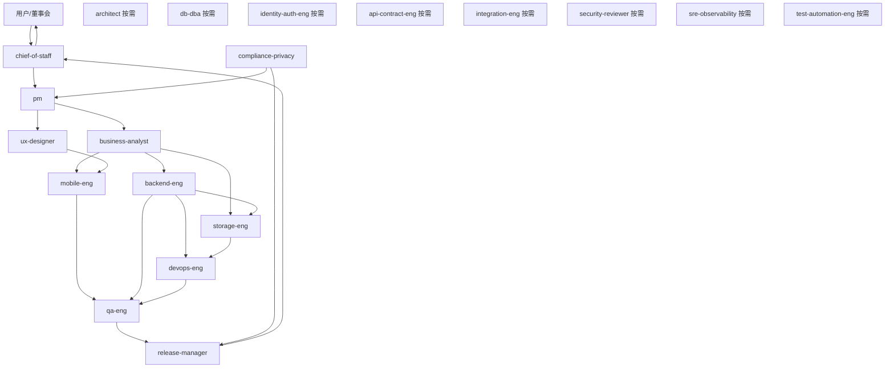

# PrivateCloudDrive 团队优化与 Private Backup Sprint 作战模型

日期：2026-05-17
负责人：Hermes 产品总监 / chief-of-staff
文档定位：在产品转向“手机优先私有备份网盘”后，重新定义多 Agent 团队的活跃编制、冻结岗位、责任边界和会议机制。

---

## 1. 管理结论

原 25 个岗位不再按“全员常驻开发公司”模式运作。

新的组织原则：

> 25 个岗位保留为能力池，但当前 2 周 Private Backup MVP Sprint 只启用 11 个常驻岗位，其余 14 个岗位转为按需顾问或阶段门禁。

原因：当前问题不是人不够，而是产品焦点不够尖锐。继续让所有角色并行，会导致功能扩散、会议噪音和验收口径变宽。

---

## 2. 新团队编制

### 2.1 常驻核心小队：11 人

| 部门 | Profile | Sprint 责任 |
|---|---|---|
| 管理 | chief-of-staff | 控制节奏、阻止范围膨胀、每日收口、最终对齐用户目标 |
| 产品 | pm | 北极星任务、需求优先级、验收口径、继续/暂停判断 |
| 产品 | business-analyst | 备份场景、存储位置、失败重试、恢复流程、边界规则 |
| 体验 | ux-designer | 首次连接、备份中心、设置/健康/恢复信息架构 |
| 移动 | mobile-eng | App 后端地址配置、备份页、批量选择、上传进度、失败重试 |
| 后端 | backend-eng | 备份 API、存储配置、健康状态、任务状态、服务端能力实现 |
| 存储 | storage-eng | 本地存储根目录、容量、生命周期、备份恢复边界 |
| 运维 | devops-eng | Docker 部署、环境变量、数据目录挂载、备份/恢复脚本 |
| 隐私安全 | compliance-privacy | 隐私说明、数据位置说明、加密边界、用户信任文案 |
| 质量 | qa-eng | 端到端验收：连接、上传、预览、失败、恢复、截图证据 |
| 发布 | release-manager | 2 周可行性闸门，决定是否进入下一阶段 |

### 2.2 按需顾问：8 人

| Profile | 调用条件 |
|---|---|
| architect | 出现架构边界、模块拆分、长期技术债时介入 |
| db-dba | 涉及迁移、索引、备份一致性、数据库恢复时介入 |
| identity-auth-eng | 涉及登录、Token、设备管理、权限风险时介入 |
| api-contract-eng | App/后端接口契约变动较大时介入 |
| integration-eng | 多端联调失败或验收环境不稳定时介入 |
| test-automation-eng | 核心链路稳定后补自动化回归 |
| security-reviewer | 分享、鉴权、越权、敏感数据风险评审时介入 |
| sre-observability | 日志、健康检查、长期运行、故障诊断时介入 |

### 2.3 冻结岗位：6 人

本 Sprint 不主动启用，避免偏离“私有备份可信闭环”：

| Profile | 冻结原因 |
|---|---|
| ui-designer | 暂不做纯视觉探索；由 UX 给出工具型信息架构，UI 只做必要一致性调整 |
| frontend-eng | Web 管理后台暂不作为 2 周核心路径，除非部署配置必须 Web 化 |
| performance-eng | 当前先验证可用性，非大规模性能压测阶段 |
| docs-writer | 文档由 PM/DevOps/Compliance 先写最小可信文档，后续再产品化 |
| support-ops | 还未进入外部用户支持阶段 |
| delivery-manager | 2 周内由 chief-of-staff 直接承担交付节奏，减少管理层重叠 |

---

## 3. 组织结构图

---

## 4. 新部门人数口径

| 口径 | 人数 | 说明 |
|---|---:|---|
| 常驻核心小队 | 11 | 当前实际参与 2 周 Private Backup MVP Sprint 的岗位 |
| 按需顾问池 | 8 | 只在触发条件满足时介入 |
| 冻结岗位 | 6 | 本阶段不主动启用 |
| 完整能力池 | 25 | 保留所有 profile，不删除，防止后续能力缺口 |

产品部门重新定义：

| 产品部门口径 | 人数 | 成员 |
|---|---:|---|
| 核心产品决策 | 4 | chief-of-staff、pm、business-analyst、ux-designer |
| 广义产品可信闭环 | 7 | 上述 4 人 + compliance-privacy、qa-eng、release-manager |
| 暂停常驻产品支持 | 3 | ui-designer、docs-writer、support-ops |

---

## 5. Sprint 会议机制

### 每日内部站会，不打扰用户

只回答 4 个问题：

1. 昨天是否推进了北极星任务？
2. 今天是否能让“备份可信闭环”更完整？
3. 是否出现范围膨胀？
4. 是否有阻塞需要调用顾问岗位？

### 每 3 天一次闸门评审

| 闸门 | 判断 |
|---|---|
| D3 | 后端地址配置、存储位置展示、备份页信息架构是否成型 |
| D6 | App 能否完成批量文件/照片上传并显示状态 |
| D9 | 失败重试、容量/健康、备份恢复说明是否闭环 |
| D12 | Android 设备/模拟器验收是否有截图、日志、可复现证据 |
| D14 | 决定继续、暂停或转向 |

---

## 6. 不再允许的团队行为

1. 不允许为了“看起来公司化”而全员并行。
2. 不允许 UI/视觉先行于备份主链路。
3. 不允许工程角色做与 Private Backup MVP 无关的新功能。
4. 不允许用“构建通过”替代“用户备份成功”。
5. 不允许新增岗位解决产品焦点问题；先靠收缩解决。

---

## 7. 当前最终决定

团队不裁撤 profile，但调整为“精干常驻 + 顾问池 + 冻结池”。

当前实际作战人数从 25 人降为 11 人。

这个调整的目的不是减少能力，而是防止团队继续围绕泛网盘扩散，确保 2 周内只证明一个问题：

> PrivateCloudDrive 是否能成为一个让普通用户信任的手机优先私有备份网盘。
