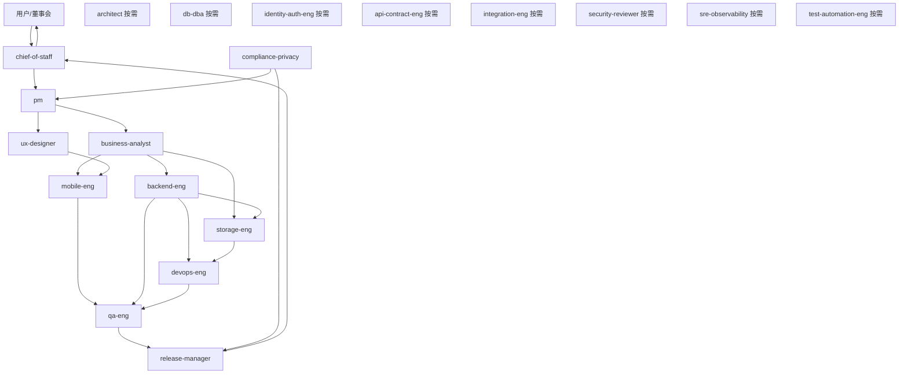

# PrivateCloudDrive 团队优化与 Private Backup Sprint 作战模型

日期：2026-05-17
负责人：Hermes 产品总监 / chief-of-staff
文档定位：在产品转向“手机优先私有备份网盘”后，重新定义多 Agent 团队的活跃编制、冻结岗位、责任边界和会议机制。

---

## 1. 管理结论

原 25 个岗位不再按“全员常驻开发公司”模式运作。

新的组织原则：

> 25 个岗位保留为能力池，但当前 2 周 Private Backup MVP Sprint 只启用 11 个常驻岗位，其余 14 个岗位转为按需顾问或阶段门禁。

原因：当前问题不是人不够，而是产品焦点不够尖锐。继续让所有角色并行，会导致功能扩散、会议噪音和验收口径变宽。

---

## 2. 新团队编制

### 2.1 常驻核心小队：11 人

| 部门 | Profile | Sprint 责任 |
|---|---|---|
| 管理 | chief-of-staff | 控制节奏、阻止范围膨胀、每日收口、最终对齐用户目标 |
| 产品 | pm | 北极星任务、需求优先级、验收口径、继续/暂停判断 |
| 产品 | business-analyst | 备份场景、存储位置、失败重试、恢复流程、边界规则 |
| 体验 | ux-designer | 首次连接、备份中心、设置/健康/恢复信息架构 |
| 移动 | mobile-eng | App 后端地址配置、备份页、批量选择、上传进度、失败重试 |
| 后端 | backend-eng | 备份 API、存储配置、健康状态、任务状态、服务端能力实现 |
| 存储 | storage-eng | 本地存储根目录、容量、生命周期、备份恢复边界 |
| 运维 | devops-eng | Docker 部署、环境变量、数据目录挂载、备份/恢复脚本 |
| 隐私安全 | compliance-privacy | 隐私说明、数据位置说明、加密边界、用户信任文案 |
| 质量 | qa-eng | 端到端验收：连接、上传、预览、失败、恢复、截图证据 |
| 发布 | release-manager | 2 周可行性闸门，决定是否进入下一阶段 |

### 2.2 按需顾问：8 人

| Profile | 调用条件 |
|---|---|
| architect | 出现架构边界、模块拆分、长期技术债时介入 |
| db-dba | 涉及迁移、索引、备份一致性、数据库恢复时介入 |
| identity-auth-eng | 涉及登录、Token、设备管理、权限风险时介入 |
| api-contract-eng | App/后端接口契约变动较大时介入 |
| integration-eng | 多端联调失败或验收环境不稳定时介入 |
| test-automation-eng | 核心链路稳定后补自动化回归 |
| security-reviewer | 分享、鉴权、越权、敏感数据风险评审时介入 |
| sre-observability | 日志、健康检查、长期运行、故障诊断时介入 |

### 2.3 冻结岗位：6 人

本 Sprint 不主动启用，避免偏离“私有备份可信闭环”：

| Profile | 冻结原因 |
|---|---|
| ui-designer | 暂不做纯视觉探索；由 UX 给出工具型信息架构，UI 只做必要一致性调整 |
| frontend-eng | Web 管理后台暂不作为 2 周核心路径，除非部署配置必须 Web 化 |
| performance-eng | 当前先验证可用性，非大规模性能压测阶段 |
| docs-writer | 文档由 PM/DevOps/Compliance 先写最小可信文档，后续再产品化 |
| support-ops | 还未进入外部用户支持阶段 |
| delivery-manager | 2 周内由 chief-of-staff 直接承担交付节奏，减少管理层重叠 |

---

## 3. 中文姓名 / Profile 对照表

以后汇报和分工优先使用中文姓名，括号中保留实际 Hermes profile，方便调用。

| 编制 | 中文姓名 | Profile | 角色/责任 |
|---|---|---|---|
| 常驻 | 何司令 | chief-of-staff | 公司执行中枢，控节奏、防范围膨胀 |
| 常驻 | 沈产品 | pm | 产品目标、优先级、验收口径 |
| 常驻 | 白分析 | business-analyst | 备份场景、边界规则、异常流程 |
| 常驻 | 游体验 | ux-designer | 首次连接、备份中心、设置/健康/恢复信息架构 |
| 常驻 | 莫移动 | mobile-eng | Android App 备份主链路体验 |
| 常驻 | 侯后端 | backend-eng | 备份 API、健康状态、服务端能力 |
| 常驻 | 石存储 | storage-eng | 本地存储、容量、生命周期、恢复边界 |
| 常驻 | 杜运维 | devops-eng | Docker、环境变量、数据目录、备份恢复脚本 |
| 常驻 | 和隐私 | compliance-privacy | 隐私说明、数据位置、用户信任文案 |
| 常驻 | 秦质检 | qa-eng | 端到端验收、截图证据、缺陷复现 |
| 常驻 | 芮发布 | release-manager | 发布闸门、是否进入下一阶段 |
| 顾问 | 顾架构 | architect | 架构边界、模块拆分、长期技术债 |
| 顾问 | 丁数据 | db-dba | 迁移、索引、备份一致性、数据库恢复 |
| 顾问 | 尹认证 | identity-auth-eng | 登录、Token、设备管理、权限风险 |
| 顾问 | 齐契约 | api-contract-eng | App/后端接口契约 |
| 顾问 | 连集成 | integration-eng | 多端联调失败、验收环境不稳定 |
| 顾问 | 佟自动 | test-automation-eng | 核心链路稳定后的自动化回归 |
| 顾问 | 安安全 | security-reviewer | 分享、鉴权、越权、敏感数据风险 |
| 顾问 | 苏观测 | sre-observability | 日志、健康检查、长期运行、故障诊断 |
| 冻结 | 吴界面 | ui-designer | 视觉/组件设计，当前冻结 |
| 冻结 | 冯前端 | frontend-eng | Web 前端，当前冻结 |
| 冻结 | 彭性能 | performance-eng | 性能容量，当前冻结 |
| 冻结 | 文档张 | docs-writer | 产品化文档，当前冻结 |
| 冻结 | 宋支持 | support-ops | 支持运营，当前冻结 |
| 冻结 | 戴交付 | delivery-manager | 交付经理，当前由何司令兼任 |

---

## 4. 组织结构图

---

## 4. 新部门人数口径

| 口径 | 人数 | 说明 |
|---|---:|---|
| 常驻核心小队 | 11 | 当前实际参与 2 周 Private Backup MVP Sprint 的岗位 |
| 按需顾问池 | 8 | 只在触发条件满足时介入 |
| 冻结岗位 | 6 | 本阶段不主动启用 |
| 完整能力池 | 25 | 保留所有 profile，不删除，防止后续能力缺口 |

产品部门重新定义：

| 产品部门口径 | 人数 | 成员 |
|---|---:|---|
| 核心产品决策 | 4 | chief-of-staff、pm、business-analyst、ux-designer |
| 广义产品可信闭环 | 7 | 上述 4 人 + compliance-privacy、qa-eng、release-manager |
| 暂停常驻产品支持 | 3 | ui-designer、docs-writer、support-ops |

---

## 5. Sprint 会议机制

### 每日内部站会，不打扰用户

只回答 4 个问题：

1. 昨天是否推进了北极星任务？
2. 今天是否能让“备份可信闭环”更完整？
3. 是否出现范围膨胀？
4. 是否有阻塞需要调用顾问岗位？

### 每 3 天一次闸门评审

| 闸门 | 判断 |
|---|---|
| D3 | 后端地址配置、存储位置展示、备份页信息架构是否成型 |
| D6 | App 能否完成批量文件/照片上传并显示状态 |
| D9 | 失败重试、容量/健康、备份恢复说明是否闭环 |
| D12 | Android 设备/模拟器验收是否有截图、日志、可复现证据 |
| D14 | 决定继续、暂停或转向 |

---

## 6. 不再允许的团队行为

1. 不允许为了“看起来公司化”而全员并行。
2. 不允许 UI/视觉先行于备份主链路。
3. 不允许工程角色做与 Private Backup MVP 无关的新功能。
4. 不允许用“构建通过”替代“用户备份成功”。
5. 不允许新增岗位解决产品焦点问题；先靠收缩解决。

---

## 7. 当前最终决定

团队不裁撤 profile，但调整为“精干常驻 + 顾问池 + 冻结池”。

当前实际作战人数从 25 人降为 11 人。

这个调整的目的不是减少能力，而是防止团队继续围绕泛网盘扩散，确保 2 周内只证明一个问题：

> PrivateCloudDrive 是否能成为一个让普通用户信任的手机优先私有备份网盘。

---

## 8. Sprint 内部主动沟通制度

本 Sprint 不采用“用户逐条派活”的方式。11 人常驻核心小队必须像成熟公司一样主动协作：

1. 何司令负责跨岗位协调和最终收口；发现无人负责事项时立即补位或派发任务。
2. 沈产品、白分析、游体验负责把“备份可信闭环”的产品口径讲清楚，并主动回应工程侧疑问。
3. 莫移动、侯后端、石存储、杜运维必须围绕 App 备份主链路主动对齐接口、存储目录、配置、错误状态和验收环境。
4. 和隐私必须在涉及用户文件、数据位置、恢复说明时主动介入，而不是等发布前补文案。
5. 秦质检必须主动要求可见证据：Android App 页面、截图、日志、复现步骤，不能只接受“构建通过”。
6. 芮发布必须在门禁前主动汇总阻塞项、风险项、可降级项和继续/暂停建议。

员工协作优先在 Kanban 里完成：评论用于沟通细节，父子任务用于表达依赖，阻塞用于升级关键决策，完成摘要用于交接给下游。除重大产品取舍、真实外部输入、最终人工验收外，不打扰用户。

---

## 9. 自主经营授权

2026-05-22 起，用户授权 Hermes 启动 PrivateCloudDrive 自主经营机制：

1. Hermes 可以在用户没有明确目标时，自主推进 PrivateCloudDrive。
2. Hermes 可以创建 Kanban 看板、拆解任务、分配中文员工、多 Agent 协作。
3. Hermes 可以创建 Cron 定时任务，让公司每天自动晨会、推进、验收和周复盘。
4. Hermes 可以自主执行普通开发、测试、修复、UI 优化、文档更新、App 验收和中文 Git 提交。
5. 普通决策不需要询问用户；重大风险、破坏性数据操作、付费采购、公开发布和最终验收必须询问用户。
6. Hermes 可以检查并配置 Gateway / Cron 后台运行。

授权章程见：`docs/hermes-autonomous-operating-charter.md`。
