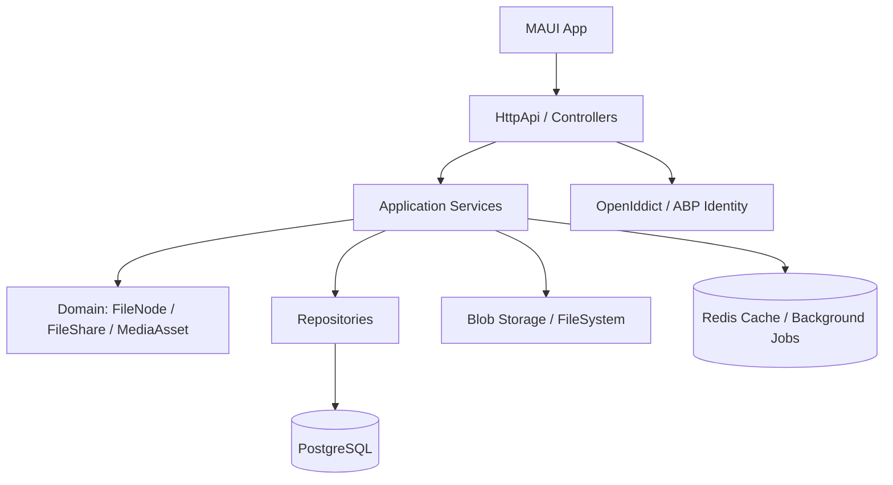
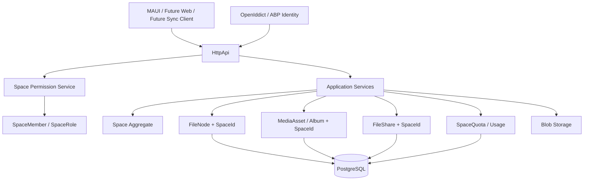
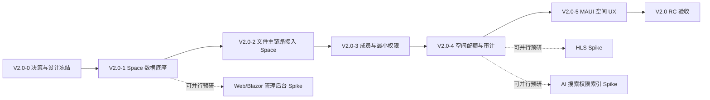

# PrivateCloudDrive V2.0 前期预研：架构依赖与范围建议

| 元数据 | 值 |
|---|---|
| 文档版本 | 1.0 |
| 日期 | 2026-07-14 |
| 负责人 | Hermes-Architect（architect） |
| 决策性质 | V2.0 重大产品方向预研，需用户授权后才能进入实施 |
| 证据来源 | `docs/product-roadmap-next.md`、`docs/release-plan-v1.4.md`、`docs/release-notes-v1.4.md`、`docs/architecture-v1.4-boundary.md`、`docs/known-limitations.md`、当前代码结构观察 |

---

## 0. 架构结论

### 0.1 总体结论

**建议：V2.0 进入“有条件 Go”，但只允许先做“家庭/团队空间最小可行底座”，不要一次性并行推进 AI 搜索、桌面同步、iOS、Web 管理后台、HLS 转码和外部登录关闭环。**

原因：当前 V1.x 已经具备个人云盘、媒体库、分享、管理员、健康检查、备份恢复、容量、搜索、排序筛选、批量操作等产品基线，但现有 FileCenter 数据模型仍以 `TenantId + OwnerId` 为核心隔离边界，缺少“空间 / 成员 / 角色 / 文件 ACL / 继承权限 / 空间配额”这些 V2.0 家庭或团队协作的基础实体。如果直接叠加跨用户共享或团队空间，容易引入越权、配额归属错误、回收站与分享语义混乱、前端 3 端状态不一致等高风险问题。

### 0.2 风险等级

| 范围 | 风险等级 | 结论 |
|---|---:|---|
| 多用户 / 家庭空间 / 团队共享文件夹 | 高 | 可以做，但必须先补空间与权限底座，不能只在现有 `OwnerId` 查询上打补丁 |
| AI 搜索 / 智能相册 | 高 | 建议排到空间权限底座之后；否则索引会先天缺少权限裁剪能力 |
| 桌面同步客户端 | 高 | 依赖稳定文件变更日志、冲突处理、客户端状态库；不应作为 V2.0 首批 MVP |
| iOS 支持 | 中高 | MAUI 已有方向，但当前 V1.4 仍存在 Android 编译阻塞和 iOS 不在范围限制；应先完成 Android/Windows 稳定 |
| Web/Blazor 管理后台 | 中 | 可独立推进为管理体验增强，但不应成为家庭空间的前置阻塞 |
| HLS 转码 / 低清预览 | 中 | 与媒体任务管线相关，可在空间底座后并行评估 |
| 外部登录关闭环（微信/Google/GitHub） | 中 | 当前 OpenIddict 扩展流已有代码基础，但真机/正式凭据仍是产品与配置风险 |

### 0.3 推荐 V2.0 MVP

**V2.0 MVP = 家庭/团队空间底座 + 空间成员管理 + 空间级配额 + 文件节点归属升级 + 最小权限模型 + 迁移与回滚方案。**

不建议把以下内容放入 V2.0 MVP 首批：

- AI 语义搜索 / OCR / 人脸识别 / 智能相册。
- 桌面同步客户端。
- iOS 正式发布。
- 独立 Web/Blazor 管理后台完整替代 MAUI Settings。
- HLS 全量转码与低清预览。
- 微信/Google/GitHub 外部登录全平台正式关闭环。

---

## 1. V2.0 候选范围盘存

来源：

- `docs/product-roadmap-next.md` §4.6 将 V2.0 定位为“家庭空间 / 团队空间 / 智能能力”，候选包括家庭共享空间、团队共享文件夹、文件夹级权限、多用户容量策略、桌面端同步客户端、Web 管理端、AI 图片/文件语义搜索、人脸聚类、S3/MinIO 多存储后端切换。
- `docs/release-plan-v1.4.md` §1.3 与 §5 明确 V1.4 不做：多用户/家庭空间、AI 搜索/智能相册、桌面同步客户端、iOS 支持、Web/Blazor 管理后台、HLS 转码/低清预览、外部登录真机关闭环。
- `docs/known-limitations.md` §5 与 §9 继续保留桌面同步、AI 相册/搜索、iOS、管理端仅 MAUI+Swagger、搜索非全文索引等限制。

### 1.1 候选能力清单

| 候选能力 | 产品价值 | 当前基础 | 主要缺口 | 建议进入 V2.0 MVP |
|---|---|---|---|:---:|
| 多用户 / 家庭空间 | 从个人云盘升级为家庭资料中心 | ABP Identity、TenantId、OwnerId、管理员用户管理、角色系统已有 | 缺少 Space、Membership、SpaceRole、File ACL、空间配额、迁移策略 | ✅ 是 |
| 团队共享文件夹 | 小团队资料协作 | 文件夹/文件模型、分享链接、角色权限已有 | 缺少跨用户协作权限、成员可见范围、操作审计主体语义 | ✅ 只做最小共享空间，不做复杂团队治理 |
| 跨用户文件共享 / 权限 | 家庭成员间共享照片和文件 | 公开分享链接已有，个人文件隔离已有 | 公开分享不等于内部 ACL；缺少继承权限、撤权、只读/可写角色 | ✅ 是，作为空间底座核心 |
| 空间配额 | 家庭/团队可控使用成本 | 用户配额和 `StorageUsageDto` 已有 | 配额归属仍按用户，不支持空间级汇总与成员用量分摊 | ✅ 是 |
| AI 搜索 / 智能相册 | 大量照片和文件的发现能力 | 文件名搜索、媒体资产、相册、缩略图、视频元数据已有 | 无索引服务、无 embedding/OCR/人脸模型、无权限过滤索引 | ❌ 否，作为 V2.1/V2.x |
| 桌面同步客户端 | 提升长期使用黏性 | API 主链路较完整 | 缺少变更日志、冲突解决、离线状态、客户端本地库 | ❌ 否 |
| iOS 支持 | 平台覆盖完整 | MAUI 项目存在 | 当前文档仍将 iOS 列为非范围；证书、推送、平台差异未验证 | ❌ 否 |
| Web/Blazor 管理后台 | 管理员桌面操作更方便 | ABP Web 主题和 Swagger 存在 | 独立 UI、权限、路由、部署与测试矩阵 | ⚠️ 可并行预研，不进空间 MVP 主线 |
| HLS 转码 / 低清预览 | 移动网络下视频体验提升 | FFmpeg、媒体任务、视频封面/元数据已有 | 转码队列、存储膨胀、码率策略、清理策略 | ❌ 否，空间底座后再做 |
| 外部登录正式关闭环 | 降低登录门槛 | OpenIddict password/refresh/custom flow、WeChat/External grant 代码存在 | 正式凭据、移动端真机、iOS SDK、绑定/解绑 UX | ⚠️ 可独立增强，不阻塞 V2.0 MVP |

### 1.2 范围边界建议

V2.0 不应定义为“所有 V1.x 没做的功能合集”，而应定义为：

```text
V2.0 = 从个人 OwnerId 云盘升级为 Space 云盘的架构版本。
```

因此 V2.0 首批只做以下可验收闭环：

1. 创建家庭/团队空间。
2. 邀请 / 添加 / 移除成员。
3. 空间内文件夹和文件列表、上传、下载、删除、恢复、分享仍可用。
4. 空间成员至少支持 Owner / Admin / Member / Viewer 四类角色。
5. 空间级配额可查看、可限制上传。
6. 个人空间与家庭/团队空间互相隔离。
7. 所有查询、搜索、媒体库、回收站、分享管理都必须按 SpaceId + 权限裁剪。

明确不做：

- 复杂组织架构、部门、审批流。
- Office 在线协同编辑。
- 任意层级 ACL 矩阵编辑器。
- “企业网盘”式高级审计报表。
- NAS OS、RAID、SMB/NFS、Docker App Store。

---

## 2. 基础设施依赖评估

### 2.1 当前已具备的依赖

| 依赖 | 当前证据 | 可复用程度 | 说明 |
|---|---|---:|---|
| ABP 多租户基础 | `PrivateCloudDriveDomainSharedModule`、`HttpApiHostModule` 引入 `AbpTenantManagement*` / `AbpAspNetCoreMultiTenancyModule` | 中 | 框架能力存在，但产品语义仍不是“家庭空间” |
| 用户隔离 | `FileNode` 实现 `IMultiTenant`，包含 `TenantId` 与 `OwnerId`；仓储查询强制 `TenantId == tenantId && OwnerId == ownerId` | 高 | 当前个人文件隔离较明确，是 V2.0 的安全基线 |
| 角色 / 权限系统 | `AdminIdentityUserAppService` 使用 ABP Identity、RoleManager；接口受 `[Authorize(PrivateCloudDrivePermissions.FileCenter.Manage)]` 保护 | 中 | 适合管理员入口，但不等同于空间内角色 |
| OpenIddict 登录基线 | `PrivateCloudDriveHttpApiHostModule` 允许 password/refresh/custom flow，并配置 token revocation、bearer validation | 高 | 账号密码与移动端 token 主链路可复用 |
| 分享安全 | `FileShare` 保存 token、过期时间、下载权限、PBKDF2 密码哈希；公开分享访问有 token/密码/限流逻辑 | 中 | 可复用为外链分享；不能替代内部成员 ACL |
| 文件主链路 | `FileCenterFoldersAppService` 覆盖列表、创建、重命名、移动、删除、恢复、永久删除、批量操作 | 高 | 业务能力完整，但需要把 owner 语义升级为 space 语义 |
| 搜索与筛选 | `GetFolderChildrenInput` 支持 SearchKeyword、SearchScope、NodeType、MediaType、TagId、IsFavorite、Sorting | 中 | 可复用查询参数；索引与权限裁剪需要改造 |
| 容量与配额 | `PrivateCloudDriveSettings.FileCenter.UserStorageQuotaInBytes`、`AdminIdentityUserAppService.SetQuotaAsync`、V1.4 容量 API | 中 | 用户配额基础存在；缺少空间配额实体与空间用量聚合 |
| 媒体库 | 代码中已有 `MediaAsset`、`MediaAlbum`、`MediaAlbumItem` 及媒体服务；V1.2/V1.4 文档确认图片/视频体验 | 中 | 可复用，但相册归属和可见性需要跟随 SpaceId 改造 |
| 运维基线 | V1.3/V1.4 文档确认健康页、备份恢复、Docker、日志、安全门禁 | 中 | 支撑版本演进，但 DB 迁移与回滚需要 V2.0 专项方案 |

### 2.2 当前缺失的关键依赖

| 缺失项 | 影响范围 | 为什么是前置依赖 |
|---|---|---|
| `Space` / `Workspace` 领域实体 | DB schema、Domain、Application、API、前端 | 没有空间实体就无法表达家庭/团队边界，只能继续依赖个人 `OwnerId` |
| `SpaceMember` / 成员关系 | DB schema、权限服务、管理 UI | 需要表达用户属于哪些空间、在空间内是什么角色、是否已禁用/退出 |
| 空间内角色模型 | Domain.Shared、权限策略、前端按钮显隐 | ABP 全局角色不能直接表达“用户 A 是家庭空间 1 的管理员，但在空间 2 只是查看者” |
| 文件节点归属升级 | `FileNode`、`BlobObject`、`UploadSession`、`MediaAsset`、`FileShare`、`FileTag`、`MediaAlbum` | 当前大量实体以 `OwnerId` 为主查询键；V2.0 需要引入 `SpaceId` 或等价归属 |
| 文件 ACL / 继承权限 | Domain、Repository、ApplicationService、测试 | 跨用户共享必须能判断每个文件/文件夹对当前用户是否可见、可写、可删除 |
| 空间级配额 | 设置、上传、管理员、Settings | 家庭空间容量必须独立于个人用户配额；上传前校验要按空间汇总 |
| 迁移策略 | EF Core Migration、DbMigrator、回滚脚本、备份 | 需要把现有个人文件安全迁入“个人默认空间”，不能破坏已有数据 |
| 权限裁剪索引 | 搜索、媒体库、相册、AI 索引 | 一旦有共享空间，搜索和媒体列表必须按用户可访问空间过滤 |
| 审计语义升级 | OperationLog、Admin、导出 | 操作日志需要记录 SpaceId、OperatorUserId、TargetOwner/空间角色，否则协作场景难排查 |
| 前端空间切换 UX | MAUI、未来 Web/Blazor、桌面端 | 个人空间与家庭空间切换、成员入口、空间设置会影响信息架构 |

### 2.3 代码结构观察

当前核心结构大致如下：



V2.0 推荐演进为：



### 2.4 影响范围评估

| 层 | 影响等级 | 需要改造的内容 |
|---|---:|---|
| DB schema | 高 | 新增 Space / SpaceMember / SpaceRole / SpaceQuota；为 FileNode、BlobObject、UploadSession、MediaAsset、MediaAlbum、FileShare、FileTag、OperationLog 等补 SpaceId 或映射关系 |
| Domain | 高 | 新增空间聚合、成员关系、空间权限策略；重写文件归属不变量 |
| Application | 高 | 所有 FileCenter 应用服务从 `GetOwnerId()` 模式升级为 `ResolveAccessibleSpace()` + `AuthorizeSpaceAction()` |
| Repository | 高 | 查询条件从 `TenantId + OwnerId` 扩展为 `TenantId + SpaceId + 权限可见范围`；软删除、唯一索引、搜索都需复核 |
| API 契约 | 中高 | 文件列表、上传、搜索、媒体库、分享、回收站、容量等需要增加 `spaceId` 或默认空间上下文 |
| MAUI | 中高 | 增加空间选择器、成员管理、空间设置、权限不足提示；文件页/媒体页/上传页都要感知当前空间 |
| Web/Blazor | 中 | 如果进入 V2.0 首批，需要补管理后台完整权限；否则可延后 |
| 桌面同步 | 高 | 如果进入范围，需要新增变更日志 API 和客户端同步状态库；建议延后 |
| 部署 / 迁移 | 高 | 必须有备份、迁移 dry-run、回滚 SQL、迁移前后数据计数校验 |
| 测试 | 高 | 增加多用户、多空间、跨成员权限、撤权后访问、分享链接、搜索隔离、配额隔离测试矩阵 |

---

## 3. 候选发布顺序建议

### 3.1 推荐阶段拆分



### 3.2 发布顺序

| 阶段 | 建议内容 | 依赖关系 | 预估工作量 | 风险 |
|---|---|---|---:|---:|
| V2.0-0：产品与架构决策 | 确认是否进入 V2.0；冻结 MVP；产出 ADR：Space 模型、权限模型、迁移策略 | 用户授权 | 3–5 人天 / 4–6 张任务卡 | 中 |
| V2.0-1：Space 数据底座 | Space、SpaceMember、SpaceRole、默认个人空间迁移、DbMigrator dry-run | V2.0-0 | 8–12 人天 / 8–12 张任务卡 | 高 |
| V2.0-2：文件主链路接入 Space | 列表、上传、下载、移动、删除、恢复、永久删除、回收站、唯一索引 | V2.0-1 | 12–18 人天 / 12–18 张任务卡 | 高 |
| V2.0-3：成员与最小权限 | Owner/Admin/Member/Viewer；空间成员管理；权限不足提示 | V2.0-1/2 | 8–12 人天 / 8–12 张任务卡 | 高 |
| V2.0-4：空间配额与审计 | SpaceQuota、用量汇总、上传前校验、OperationLog 增加 SpaceId | V2.0-2 | 6–10 人天 / 6–10 张任务卡 | 中高 |
| V2.0-5：MAUI 空间 UX | 空间切换、空间设置、成员页、空间文件页状态 | V2.0-2/3/4 | 10–16 人天 / 10–16 张任务卡 | 中高 |
| V2.0 RC：验证与发布 | 多用户权限矩阵、迁移演练、备份恢复、Android 真机、Docker、文档 | 全部 | 8–12 人天 / 8–12 张任务卡 | 高 |

### 3.3 可以并行的事项

| 可并行事项 | 前置要求 | 说明 |
|---|---|---|
| Web/Blazor 管理后台 Spike | V2.0-0 之后 | 只做原型和路由/权限验证，不抢 Space 主线资源 |
| HLS 转码 Spike | 媒体任务与存储容量策略明确后 | 先评估码率、存储膨胀、清理策略，不纳入 V2.0 MVP |
| AI 搜索索引 Spike | Space 权限模型草案完成后 | 只验证“索引如何带 SpaceId/ACL 裁剪”，不做产品化 |
| 外部登录关闭环 | 与 Space 主线低耦合 | 可作为 V1.5/V2.x 独立增强，避免与空间权限同时上线 |
| UI 自动化验收评估 | 任意阶段 | V1.4 已暴露人工验收成本，建议尽早 Spike |

### 3.4 必须前置的事项

| 必须前置 | 阻塞对象 | 原因 |
|---|---|---|
| 用户授权进入 V2.0 | 全部实施任务 | V2.0 是产品方向变更，不能自主推进 |
| V1.4 G1 编译阻塞清零 | V2.0 开发分支 | `docs/release-notes-v1.4.md` 显示 MAUI Android 编译仍 FAIL，不应在失败基线上叠加空间改造 |
| Space / ACL ADR | DB 与 API 改造 | 没有设计冻结会造成迁移和权限返工 |
| 数据备份与迁移 dry-run | 任何生产数据迁移 | 文件与元数据不可丢；必须能回滚 |
| 多用户权限测试矩阵 | Space 上线 | 防止跨用户/跨空间数据泄露 |

### 3.5 工作量总览

粗略估算：

| 口径 | 数量 |
|---|---:|
| V2.0 MVP 端到端实施 | 55–85 人天 |
| Kanban 任务数量 | 55–85 张，其中高风险任务约 20–30 张 |
| 推荐最小团队 | backend-eng、mobile-eng、qa-eng、security-reviewer、devops-eng、pm、architect |
| 推荐节奏 | 先 1 个架构 Spike + 2 个实现迭代 + 1 个 RC 验收迭代 |

注意：以上估算不包含 AI 搜索、桌面同步、iOS、完整 Web 管理后台、HLS 全量产品化。

---

## 4. 推荐方案

### 4.1 Go / No-Go 建议

**建议：有条件 Go。**

Go 条件：

1. 用户明确授权 V2.0 方向从“个人私有云盘”升级到“家庭/小团队空间”。
2. V1.4 当前 G1 MAUI 编译阻塞已修复，形成可继续开发的稳定基线。
3. 接受 V2.0 MVP 只做空间底座，不把 AI 搜索、桌面同步、iOS、Web 管理后台、HLS、外部登录全平台关闭环一起纳入首批。
4. 接受一次高风险 DB schema 迁移，并要求先完成备份、dry-run、回滚脚本和测试数据验证。

No-Go 条件：

1. 用户暂不希望改变产品形态，只想稳定个人云盘。
2. V1.4 编译 / 验收仍未清零。
3. 当前团队资源不足以承受 55–85 人天的高风险架构版本。
4. 无法接受现有数据迁移风险或无法提供迁移演练环境。

### 4.2 Go 情况下的最小可行范围

推荐 V2.0 MVP 功能清单：

| 模块 | 最小可行范围 | 不做内容 |
|---|---|---|
| 空间模型 | 默认个人空间 + 家庭/团队空间；空间名称、头像/图标可选、创建者 | 空间模板、组织层级、审批流 |
| 成员管理 | 添加成员、移除成员、角色切换、成员禁用 | 邀请邮件/短信复杂流程、外部联系人 |
| 角色权限 | Owner/Admin/Member/Viewer；固定权限矩阵 | 自定义 ACL 编辑器、任意权限组合 |
| 文件主链路 | 空间内列表/上传/下载/删除/恢复/永久删除/移动/重命名 | 跨空间移动、空间间复制、复杂共享树 |
| 搜索 | 空间内文件名搜索，按当前用户可见空间裁剪 | AI 语义搜索、全文搜索引擎 |
| 媒体库 | 空间内图片/视频列表、已有缩略图/封面继续可用 | 智能相册、人脸识别、OCR |
| 分享 | 空间内成员可按权限创建/管理外链分享 | 内部成员细粒度分享审批 |
| 配额 | 空间已用/总配额；上传前空间配额校验 | 复杂用户分摊账单 |
| 审计 | 操作日志增加 SpaceId、操作者、目标文件 | CSV 导出、报表统计 |
| 前端 | MAUI 空间切换、空间设置、成员列表、权限不足提示 | Web/Blazor 完整后台、桌面同步客户端、iOS 发布 |

### 4.3 No-Go 情况下的替代方向

如果暂不进入 V2.0，建议走 **V1.5 稳定增强路线**：

1. 修复 V1.4 G1 MAUI Android 编译阻塞。
2. 补齐 MAUI UI 自动化验收或最小截图自动化，降低人工验收成本。
3. 搜索从 ILIKE 升级到 PostgreSQL 全文索引，但仍保持单用户范围。
4. 分享管理增强、上传队列重试/取消、媒体库交互完善。
5. Web/Blazor 管理后台做只读健康 / 用户 / 存储状态最小版。
6. 外部登录只做可配置关闭环，不改变核心文件权限模型。

这条路线收益较稳，风险低于 V2.0；适合在用户尚未确认家庭/团队方向时继续提高产品完成度。

### 4.4 改造步骤

若用户授权进入 V2.0，建议按以下步骤推进：

1. **冻结 V1.4 基线**
   - 修复 MAUI Android 编译阻塞。
   - 确认后端测试、Docker 栈、secret scan、真机验收状态。

2. **产出 ADR**
   - Space 模型 ADR。
   - SpaceRole / 权限矩阵 ADR。
   - FileNode / BlobObject / MediaAsset / FileShare 归属升级 ADR。
   - 迁移与回滚 ADR。

3. **数据库迁移 Spike**
   - 新增 Space / SpaceMember 表。
   - 为现有数据创建默认个人空间。
   - 对核心表补 SpaceId。
   - 在测试库执行 dry-run，输出迁移前后计数和校验报告。

4. **后端主链路改造**
   - 引入 SpacePermissionService。
   - 文件、媒体、分享、标签、回收站、容量查询统一走 SpaceId + 权限校验。
   - 保持 API 兼容策略：可设置默认当前空间，逐步让前端传入 spaceId。

5. **前端最小空间 UX**
   - 登录后默认进入个人空间。
   - 文件页顶部可切换空间。
   - Settings 增加空间设置与成员管理入口。
   - 无权限操作时给出可理解提示。

6. **安全与 QA 验收**
   - 多用户、多空间、不同角色、撤权后访问、分享链接、搜索隔离、回收站隔离、配额隔离测试。
   - 重点验证“用户不能通过 API 参数猜测访问其他空间文件”。

7. **发布与回滚准备**
   - 发布前必须备份 DB + storage。
   - 迁移脚本必须支持 dry-run。
   - 高风险迁移失败时回滚到 V1.4 数据备份和代码基线。

### 4.5 回滚方案

| 场景 | 回滚方式 | 注意事项 |
|---|---|---|
| ADR 阶段发现范围过大 | 不进入实现，回退到 V1.5 稳定增强路线 | 无代码/数据影响 |
| DB 迁移 dry-run 失败 | 丢弃测试库迁移结果，修正迁移脚本 | 不触碰生产数据 |
| 生产迁移失败 | 停止服务，恢复迁移前 DB 备份与 storage 备份，回滚代码到 V1.4 基线 | 必须提前演练恢复时长 |
| Space 权限出现越权缺陷 | 立即关闭 V2.0 功能入口或回滚服务；保留公开分享限流 | 权限缺陷不可灰度接受 |
| MAUI 空间 UX 编译失败 | 回滚前端空间入口，后端可先隐藏 Space API | 避免在不可编译客户端上继续叠加功能 |

### 4.6 验收标准

V2.0 MVP 的验收门禁建议：

| 闸门 | 标准 |
|---|---|
| G0 范围冻结 | 只做空间底座，不夹带 AI / 同步 / iOS / HLS / 完整 Web 后台 |
| G1 迁移安全 | 测试库 dry-run PASS；迁移前后 FileNode / BlobObject / MediaAsset / FileShare 计数一致或差异可解释 |
| G2 权限隔离 | 多用户多空间测试 0 越权；API 参数篡改无法访问无权限文件 |
| G3 文件主链路 | 每个角色下列表、上传、下载、删除、恢复、永久删除、移动、重命名符合权限矩阵 |
| G4 搜索隔离 | 搜索结果只返回当前用户在当前空间可见文件 |
| G5 媒体隔离 | 图片/视频/相册只展示当前空间可见媒体 |
| G6 分享安全 | 空间内分享创建、禁用、过期、密码、下载限制仍可用；撤权不影响外链既有安全策略的定义需明确 |
| G7 配额 | 空间容量展示准确；上传超过空间配额被拒绝并有前端提示 |
| G8 审计 | 操作日志记录 SpaceId、OperatorUserId、动作、目标资源 |
| G9 客户端 | MAUI Android 构建通过；空间切换与成员页真机验收 PASS |
| G10 运维 | 备份恢复文档、迁移回滚文档、已知限制、release notes 同步完成 |

---

## 5. 最终建议给用户确认

请用户确认以下决策后再创建 V2.0 实施任务：

1. 是否同意 V2.0 的核心方向是“家庭/团队空间”，而不是 AI 搜索或桌面同步。
2. 是否接受 V2.0 MVP 只做空间底座与最小权限，不做复杂企业网盘。
3. 是否接受先修复 V1.4 G1 编译阻塞，再进入 V2.0。
4. 是否允许进行一次涉及 DB schema 与数据迁移的高风险架构版本。
5. 是否有可用于迁移演练的测试数据环境。

**架构推荐结论：有条件 Go；如果用户希望控制风险，则先走 V1.5 稳定增强路线，再重新评估 V2.0。**
