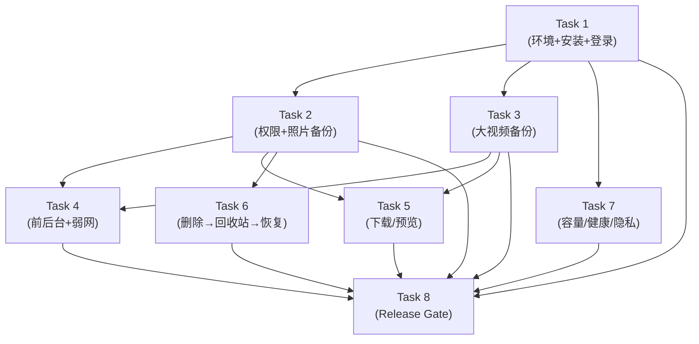

# Android 真机验收 8 项 — 可执行子任务分解方案

> 用途：将原单体任务 `t_9a7372c7`（8 项验收证据采集，60 轮迭代仍超时）拆分为 8 个可独立执行的 Kanban 子任务。
> 每个子任务控制在 **15–20 次工具调用**（Kanban worker 默认 60 预算的 1/3），产出独立的证据文件，通过独立的 secret scan。
> 依赖关系使用 Kanban `--parent` 表达。
> 最后更新：2026-07-03

---

## 1. DAG 总览



**并行机会**：
- Task 2、Task 3、Task 7 可以在 Task 1 完成后**并行**执行。
- Task 4、Task 5、Task 6 可以在 Task 2 和 Task 3 完成后**并行**执行。

**估计总流水线时间**：3 个串行阶段 = ~9–12 分钟（纯工具执行），加上人工在模拟器上的 UI 操作等待。

---

## 2. 子任务清单

### Task 1：环境验证 + Clean Install + 登录

| 字段 | 内容 |
|---|---|
| **Kanban 标题** | [Android 验收 1/8] 环境验证 + Clean Install + 登录 |
| **估计工具调用** | ~12 |
| **Parent** | 无（根任务） |
| **用户故事** | 作为 QA 工程师，我需要在 Android 设备/模拟器上 clean install APK，配置局域网后端，完成登录并确认连接状态，作为后续所有验收的前置条件。 |
| **数据依赖** | 后端 LAN 可达（t_f10829b2 DONE）、ADB 设备连接、APK 已构建 |
| **人工依赖** | ADB 设备须就绪（模拟器或真机），自动或手动登录 |

#### 操作步骤

| 步骤 | 操作 | 预期结果 |
|---|---|---|
| 1.1 | `adb devices` 确认设备连接 | 至少 1 台设备/模拟器 |
| 1.2 | `adb uninstall com.companyname.privateclouddrive.app` (忽略不存在) | 干净状态 |
| 1.3 | 构建 APK: `dotnet build ... -f net10.0-android` | 构建成功 |
| 1.4 | `adb install -r <path-to-signed-apk>` | exit code 0 |
| 1.5 | 启动 App → 截图启动页 | 启动页可见 |
| 1.6 | 配置后端地址：`http://192.168.1.94:8080` → 截图 | IP 脱敏为 `[REDACTED_IP]` |
| 1.7 | 使用 QA 账号登录 → 截图文件页 | 登录成功，文件页加载 |
| 1.8 | 切换到"我的"→ 截图含在线状态 | 显示"在线"标签 |

#### 截图清单

- `real-device-01-startup-page.png`
- `real-device-01-server-config.png`（IP 脱敏）
- `real-device-01-files-after-login.png`
- `real-device-01-settings-online.png`

#### 验收标准

- [ ] App 不崩溃，启动页/登录页/文件页正常加载
- [ ] 登录成功，文件页无错误 banner
- [ ] 服务器 IP 已脱敏

**结论：** PASS / FAIL / WARN

---

### Task 2：相册/媒体权限 + 照片备份命中

| 字段 | 内容 |
|---|---|
| **Kanban 标题** | [Android 验收 2/8] 相册权限 + 照片备份 |
| **估计工具调用** | ~15 |
| **Parent** | Task 1 |
| **用户故事** | 作为 QA 工程师，我需要验证真机相册权限授予和照片备份流程：权限对话框、媒体选择器、上传队列、文件列表、媒体库均正常。 |
| **数据依赖** | 模拟器/真机至少有 3 张测试照片（可预置到模拟器存储） |

#### 操作步骤

| 步骤 | 操作 | 预期结果 |
|---|---|---|
| 2.1 | 文件页点击"上传" → 截图备份选项弹层 | 显示"备份照片""从相册选择备份"等 |
| 2.2 | 选择"备份照片" → 截图权限请求对话框 | 系统权限弹窗 |
| 2.3 | 授予媒体权限 → 截图媒体选择界面 | 进入选择界面 |
| 2.4 | 选择 2-3 张照片 → 截图上传队列进度 | 进度可见 |
| 2.5 | 等待完成 → 截图队列完成状态 | 显示"完成" |
| 2.6 | 文件页定位备份目录 → 截图文件列表 | 照片文件出现 |
| 2.7 | 切换到相册 Tab → 截图媒体库 | 照片缩略图可见 |

#### 截图清单

- `real-device-02-create-action-menu.png`
- `real-device-02-permission-dialog.png`
- `real-device-02-media-picker.png`
- `real-device-02-upload-progress.png`
- `real-device-02-upload-completed.png`
- `real-device-02-files-listed.png`
- `real-device-02-media-library.png`

#### 验收标准

- [ ] 权限对话框正常弹出
- [ ] 授权后媒体选择功能完整
- [ ] 备份成功 → 文件出现在文件页和媒体库
- [ ] 截图不显示原始照片内容（仅文件名称/列表）

**结论：** PASS / FAIL / WARN

---

### Task 3：大视频备份路径（分片上传 + 中断 + 重试）

| 字段 | 内容 |
|---|---|
| **Kanban 标题** | [Android 验收 3/8] 大视频备份 — 分片上传/中断/重试 |
| **估计工具调用** | ~18 |
| **Parent** | Task 1 |
| **用户故事** | 作为 QA 工程师，我需要验证大视频文件（>50MB）的分片上传路径：进度可视化、失败原因可读、重试可从断点恢复。 |
| **数据依赖** | 需提前准备 >50MB 测试视频到模拟器 |

#### 操作步骤

| 步骤 | 操作 | 预期结果 |
|---|---|---|
| 3.1 | 确认测试视频 >32MB（触发分片） | 确认通过 |
| 3.2 | 上传 → 截图队列含文件名和大小范围 | 队列显示"约 xx MB" |
| 3.3 | 观察进度 → 截图进度条 | 分片进度更新 |
| 3.4 | 中断网络或关闭 App → 截图失败状态 | 队列项失败，原因可读 |
| 3.5 | 恢复/重启 → 截图队列保留 | 失败任务仍在 |
| 3.6 | 点击"重试" → 截图重试进度 | 从断点恢复 |
| 3.7 | 等待完成 → 截图完成状态 | 上传成功 |
| 3.8 | 验证文件出现在文件页 | 视频文件在列表 |

#### 截图清单

- `real-device-03-queue-with-size.png`
- `real-device-03-upload-progress.png`
- `real-device-03-upload-failed.png`
- `real-device-03-queue-persisted-after-restart.png`
- `real-device-03-retry-progress.png`
- `real-device-03-upload-completed.png`
- `real-device-03-file-listed.png`

#### 验收标准

- [ ] 分片上传进度可视化
- [ ] 失败原因为用户友好文案（不暴露原始异常）
- [ ] 重试可从断点继续
- [ ] 文件最终上传成功

**结论：** PASS / FAIL / WARN

---

### Task 4：前后台切换 + 弱网中断 + OEM 省电

| 字段 | 内容 |
|---|---|
| **Kanban 标题** | [Android 验收 4/8] 前后台/弱网/OEM 省电 |
| **估计工具调用** | ~15 |
| **Parent** | Task 2, Task 3 |
| **用户故事** | 作为 QA 工程师，我需要验证 App 在前后台切换、网络中断后队列保留与重试能力，并记录 OEM 省电策略影响。 |
| **数据依赖** | Task 2/3 已上传文件（有可用的上传队列） |

#### 操作步骤

| 步骤 | 操作 | 预期结果 |
|---|---|---|
| 4.1 | 开始小文件上传 → 截图进度 | 上传进行中 |
| 4.2 | 按 Home 键切后台 → 无崩溃 | — |
| 4.3 | 30s 后切回前台 → 截图队列状态 | 状态不变 |
| 4.4 | 关闭 WiFi/飞行模式 → 截图失败状态 + 可读原因 | 任务失败 |
| 4.5 | 恢复网络 → 截图队列保留 + "重试"按钮可见 | 保留状态 |
| 4.6 | 点击"重试" → 截图重试成功 | 完成状态 |
| 4.7 | OEM 省电记录 | 填写设备/版本/省电模式 → WARN |

#### 截图清单

- `real-device-04-queue-foreground.png`
- `real-device-04-queue-after-foreground-background.png`
- `real-device-04-queue-failed-network-down.png`
- `real-device-04-queue-after-network-restore.png`
- `real-device-04-retry-success.png`
- `real-device-04-oem-power-log.txt`（logcat 摘要）

#### 验收标准

- [ ] 前后台切换不丢失队列状态
- [ ] 网络中断后有可读错误原因
- [ ] 网络恢复后可手动重试
- [ ] OEM 省电影响记录为 WARN（如适用）

**结论：** PASS / WARN（OEM 记录）

---

### Task 5：MAUI 内下载/预览（图片 + 视频 + 普通文件）

| 字段 | 内容 |
|---|---|
| **Kanban 标题** | [Android 验收 5/8] 下载与预览（3 种文件类型） |
| **估计工具调用** | ~12 |
| **Parent** | Task 2, Task 3 |
| **用户故事** | 作为 QA 工程师，我需要验证 Android MAUI App 内文件下载和预览链路：图片预览/下载、视频播放、普通文件内容预览均可用。 |
| **数据依赖** | Task 2/3 的已上传文件 |

#### 操作步骤

| 步骤 | 操作 | 预期结果 |
|---|---|---|
| 5.1 | 点击图片 → 截图图片预览页 | 缩略图加载 |
| 5.2 | 点击下载 → 截图下载进度 | 进度提示 |
| 5.3 | 确认通知栏完成 → 截图通知 | 下载成功 |
| 5.4 | 点击视频 → 截图视频播放界面（暂停态） | 播放界面可加载 |
| 5.5 | 点击普通文件（`.txt`）→ 截图内容预览/系统打开方式 | 内容或系统路由正确 |

#### 脱敏规则

- 预览截图只显示文件名称和 UI 布局，不显示完整文件内容
- 视频预览只显示播放器界面帧

#### 截图清单

- `real-device-05-image-preview.png`
- `real-device-05-download-progress.png`
- `real-device-05-download-notification.png`
- `real-device-05-video-preview.png`
- `real-device-05-file-preview.png`

#### 验收标准

- [ ] 图片预览可加载
- [ ] 下载到本地成功
- [ ] 视频播放器界面可加载（内容播放待验证）
- [ ] 普通文件预览或正确路由

**结论：** PASS / FAIL / WARN

---

### Task 6：删除 → 回收站 → 恢复全链路

| 字段 | 内容 |
|---|---|
| **Kanban 标题** | [Android 验收 6/8] 删除 → 回收站 → 恢复 |
| **估计工具调用** | ~12 |
| **Parent** | Task 2（只需至少一个已上传文件） |
| **用户故事** | 作为 QA 工程师，我需要验证文件删除、回收站查看、恢复的完整 UI 链路，并确认永久删除和清空回收站有强确认对话框。 |
| **数据依赖** | Task 2 的已上传文件 |

#### 操作步骤

| 步骤 | 操作 | 预期结果 |
|---|---|---|
| 6.1 | 选择模式→勾选文件 → 截图已选状态 | 工具栏含"移入回收站" |
| 6.2 | 点击"移入回收站" → 截图确认或空文件页 | 文件从列表消失 |
| 6.3 | "我的"→"回收站" → 截图回收站列表 | 已删文件可见 |
| 6.4 | 选择→"恢复" → 截图确认+文件恢复后 | 文件回到原处 |
| 6.5 | 永久删除 → 截图强确认对话框+删除后 | 对话框含"不可恢复" |
| 6.6 | 清空回收站 → 截图确认对话框 | 强确认提示 |

#### 截图清单

- `real-device-06-file-selected.png`
- `real-device-06-move-to-trash.png`
- `real-device-06-trash-listing.png`
- `real-device-06-restore-confirmation.png`
- `real-device-06-file-restored.png`
- `real-device-06-permanent-delete-confirmation.png`
- `real-device-06-after-permanent-delete.png`
- `real-device-06-empty-trash-confirmation.png`

#### 验收标准

- [ ] 删除 → 回收站可见 → 恢复成功
- [ ] 永久删除有强确认（不可撤销文案）
- [ ] 清空回收站有强确认

**结论：** PASS / FAIL / WARN

---

### Task 7：容量 / 系统健康 / 恢复与隐私边界页面

| 字段 | 内容 |
|---|---|
| **Kanban 标题** | [Android 验收 7/8] 容量/健康/恢复/隐私页面 |
| **估计工具调用** | ~10 |
| **Parent** | Task 1（仅需登录状态） |
| **用户故事** | 作为 QA 工程师，我需要验证 Android App 设置页中的容量状态、系统健康、恢复说明和隐私边界页面可正常加载，截图内容合规脱敏。 |
| **数据依赖** | Task 1 的登录态 |

#### 操作步骤

| 步骤 | 操作 | 预期结果 |
|---|---|---|
| 7.1 | "我的"页 → 截图含容量/文件数/在线状态 | 信息完整 |
| 7.2 | 点击"存储用量" → 截图存储用量页 | 分类容量可读 |
| 7.3 | 验证"已用/剩余"信息 | 脱敏显示 |
| 7.4 | 查看"存储位置" → 截图路径脱敏 | 路径为 `[REDACTED_PATH]` |
| 7.5 | 查看"健康状态" → 截图 | Healthy / Warning |
| 7.6 | 点击"恢复边界说明" → 截图 | 文案完整 |
| 7.7 | 查看"隐私边界" → 截图 | 隐私声明可见 |

#### 截图清单

- `real-device-07-settings-page.png`
- `real-device-07-storage-usage.png`
- `real-device-07-storage-location.png`（路径脱敏）
- `real-device-07-health-status.png`
- `real-device-07-restore-boundary.png`
- `real-device-07-privacy-boundary.png`

#### 验收标准

- [ ] 所有页面正常加载
- [ ] 路径/IP 已脱敏
- [ ] 恢复说明和隐私边界文案完整可读

**结论：** PASS / FAIL / WARN

---

### Task 8：Release Gate — Secret Scan + Evidence Index + PR

| 字段 | 内容 |
|---|---|
| **Kanban 标题** | [Android 验收 8/8] Release Gate（扫密/索/PR） |
| **估计工具调用** | ~10 |
| **Parent** | Task 1, 2, 3, 4, 5, 6, 7（所有前置验收完成后） |
| **用户故事** | 作为 QA 工程师，我需要运行 release gate：secret/log scan 确认 0 findings、更新 validation evidence index、人工复核所有截图脱敏合规、提交 PR。 |
| **数据依赖** | Tasks 1–7 全部完成 |  |

#### 操作步骤

| 步骤 | 命令 / 操作 | 预期结果 |
|---|---|---|
| 8.1 | `git diff --check` | 无 whitespace/冲突 |
| 8.2 | `python scripts/secret-log-scan.py --include-working-tree --archive-ref HEAD` | PASS, 0 findings |
| 8.3 | `python scripts/validation_evidence_index.py --run-id "mobile-eng-real-device-r1" --date $(date -u +%Y%m%d)` | PASS, evidence_count=N |
| 8.4 | 人工复核：逐项检查截图脱敏合规 | 所有截图合规 |
| 8.5 | 更新 `docs/validation/evidence-index.md` 8 项结论 | 所有状态已填写 |
| 8.6 | 提交 PR / 提供分支参考 | 可复核的分支路径 |

#### 验收标准

- [ ] Secret/log scan: 0 findings
- [ ] Validation evidence index: PASS, 0 sensitive findings
- [ ] 所有截图脱敏合规
- [ ] Evidence index 8 项结论已更新

**结论：** PASS / FAIL

---

## 3. 依赖关系矩阵（Kanban `--parent` 用法）

| 子任务 | 依赖的 parent task | 含义 |
|---|---|---|
| Task 1 | 无 | 根任务 |
| Task 2 | Task 1 | 需要登录态 |
| Task 3 | Task 1 | 需要登录态 |
| Task 7 | Task 1 | 需要登录态 |
| Task 4 | Task 2, Task 3 | 需要照片 + 视频文件（上传队列） |
| Task 5 | Task 2, Task 3 | 需要照片 + 视频文件（预览） |
| Task 6 | Task 2 | 需要至少一个已上传文件 |
| Task 8 | Task 1，2，3，4，5，6，7 | 所有证据采集完成 |

**创建命令示例**（在 orchestrator 中执行）：

```bash
# 创建根任务
hermes kanban create \
  "[Android 验收 1/8] 环境验证 + Clean Install + 登录" \
  --assignee mobile-eng \
  --body "$(cat task-1-body.md)"

# 创建并行子任务（依赖 Task 1）
hermes kanban create \
  "[Android 验收 2/8] 相册权限 + 照片备份" \
  --assignee mobile-eng --parent t_<task-1-id>

hermes kanban create \
  "[Android 验收 3/8] 大视频备份" \
  --assignee mobile-eng --parent t_<task-1-id>

hermes kanban create \
  "[Android 验收 7/8] 容量/健康/隐私页面" \
  --assignee mobile-eng --parent t_<task-1-id>
```

---

## 4. 每个子任务的独立证据输出

每个子任务产出 3 类文件，聚合到 `docs/validation/evidence/` 和 `docs/validation/screenshots/real-device/`：

```
docs/validation/
├── screenshots/real-device/
│   ├── real-device-01-*.png      (Task 1, ~4 张)
│   ├── real-device-02-*.png      (Task 2, ~7 张)
│   ├── real-device-03-*.png      (Task 3, ~7 张)
│   ├── real-device-04-*.png      (Task 4, ~5 张 + 1 log)
│   ├── real-device-05-*.png      (Task 5, ~5 张)
│   ├── real-device-06-*.png      (Task 6, ~8 张)
│   ├── real-device-07-*.png      (Task 7, ~6 张)
├── evidence/
│   ├── task-01-conclusion.md     (Task 1 结论)
│   ├── task-02-conclusion.md     (Task 2 结论)
│   ├── ...
│   ├── task-08-release-gate.md   (Task 8 扫密 & index 结果)
├── android-real-device-evidence-runbook.md   (运行手册，共享)
├── evidence-index.md                         (主索引，Task 8 更新)
```

**secret scan 执行时机**：
- 每个子任务完成后立即执行 `secret-log-scan.py` 扫描本子任务新增/变更文件
- 扫到 findings → 子任务 block → 人工介入修复后再继续
- Task 8 执行全量扫描做最终确认

---

## 5. 资源与风险评估

| 风险 | 影响 | 缓解措施 |
|---|---|---|
| ADB 设备断连 | Task 1–7 无法执行 | 任务开头 `adb devices` 检查，断连则 block |
| 模拟器 UI 自动化不可靠 | 截图时机不对 | 人工操作 + 截图命令；`sleep` 等待 UI 稳定 |
| 大视频上传耗时 > 2 min | Task 3 超时 | 视频尺寸控制在 50–80MB；`background upload + poll` 模式 |
| 多个子任务并行写入同目录 | 文件名覆盖 | 每个子任务使用独立文件名前缀（已固化在截图清单中） |
| 脱敏遗漏 | 敏感信息泄露 | 每个子任务结尾执行 `secret-log-scan.py`；Task 8 全量扫描 |
| 后端服务在验收过程中宕机 | 所有后续任务失败 | Task 1 结尾保存后端健康快照；宕机时 block 通知 devops-eng |

---

## 6. 与原单体任务的关系

本分解方案将原 `t_9a7372c7` 拆为 8 个子任务，每个子任务：

- **独立分配**给 mobile-eng profile（同一负责角色）
- **独立的迭代预算**（15–20 次调用 vs 原来 60 次依然不够）
- **独立的证据输出**（截图 + logcat + 结论 markdown）
- **串行依赖但有并行空间**（Task 2/3/7 并行，Task 4/5/6 并行）

理论上总流水线完成时间约为原单体任务的 **1/2–1/3**（因为原来 60 次调用的很大一部分消耗在上下文切换、状态恢复和重复验证上）。
