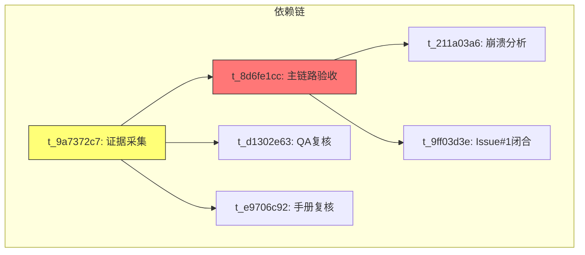

# V1.0 RC → V1.1 过渡派工计划

| 元数据 | 值 |
|---|---|
| 文档版本 | 1.0 |
| 日期 | 2026-07-03 |
| 负责人 | delivery-manager |
| 来源看板 | `kanban.db` — blocked=6, running=0, ready=0, done=143 |
| 基线文档 | `docs/release-plan-v1.1.md`, `docs/architecture-v1.1-file-management-boundary.md` |

---

## 1. 当前状态快照

### 1.1 看板状态

| 指标 | 值 | 解读 |
|---|---|---|
| done | 143 | V1.0 RC 发布周期基本完成 |
| blocked | 6 | 全部为 Android 验收/文档类（无代码实现任务在运行） |
| running | 0 | 无活跃 worker |
| ready | 0 | 无待派工任务 |

### 1.2 代码基线

| 检查项 | 结果 |
|---|---|
| 当前分支 | `docs/android-evidence-r2`（非 `main`） |
| `dotnet build` | ✅ 0 错误，8 警告（Scriban 已知漏洞，非阻塞） |
| `dotnet test` | ✅ **160/160 全部通过**（Domain 6 + Application 6 + EF 148） |
| Docker PCD 栈 | ❌ 未运行（仅 knowpulse 栈运行中：Postgres/MinIO/Qdrant/LiteLLM） |
| ADB 设备 | ❌ 无连接设备 |

### 1.3 未提交文件分类

当前工作树在 `docs/android-evidence-r2` 分支上有 11 个 modified + 11 个 untracked 文件：

#### 应入库（证据/文档/基础设施代码）

| 类别 | 文件 | 说明 |
|---|---|---|
| **后端改动** | `FileCenter/FileCenterSystemHealthAppService.cs` | V1.0 收尾的健康检查增强 |
| **测试证据** | `EfCoreFileCenterSystemHealthAppServiceTests.cs` | 健康检查测试 |
| | `EfCoreExternalAuthAppServiceTests.cs` | 外部认证测试（+32 行） |
| | `EfCoreOperationLogsAppServiceTests.cs` | 操作日志测试（+54 行） |
| **V1.0 RC 文档** | `docs/architecture-v1.0-rc-boundary.md` | 架构边界同步（+497/-251 大幅重构） |
| | `docs/deployment.md` | 部署文档补充（+107 行） |
| | `docs/release-notes-v1.0-rc.md` | Release Notes 补充（+2 行） |
| | `docs/validation/README.md` | 证据索引更新 |
| **V1.1 规划文档** | `docs/scenario-matrix-v1.1-file-management.md` | V1.1 场景矩阵（modified） |
| | `docs/architecture-v1.1-file-management-boundary.md` | —（untracked） |
| | `docs/release-plan-v1.1.md` | —（untracked） |
| | `docs/release-plan-v1.1-file-management.md` | —（untracked） |
| | `docs/scenario-v1.1.md` / `docs/scenario-matrix-v1.1.md` | —（untracked） |
| **测试文档** | `docs/testing.md` | 同步 MAUI 构建验证更新（+102 行） |
| **部署脚本** | `scripts/verify-local-stack.ps1` | 本地栈验证脚本（modified） |
| | `scripts/verify-health.ps1` | 健康检查脚本（untracked） |
| | `scripts/verify-health.sh` | 健康检查脚本（untracked） |
| **辅助工具** | `scripts/parse_ui_xml.py` | UI XML 解析工具（untracked） |
| **Deployment 代码** | `src/*/Deployment/`（3 目录） | 部署管理代码（untracked） |
| | `test/*/Deployment/` | 部署测试代码（untracked） |

**结论：22 个未提交文件全部属于证据/文档/基础设施代码，无工作区临时工件需要还原。** 建议在合并到 `main` 前统一提交到当前分支。

---

## 2. 阻塞卡分类处理方案

### 2.1 阻塞卡总览

| # | 任务 ID | 标题 | 负责人 | 类型 | 阻塞时长 |
|---|---|---|---|---|---|
| 1 | `t_8d6fe1cc` | RC-P0-06：Android 真机主链路验收 | qa-eng | 环境阻塞（无真机） | 较长 |
| 2 | `t_211a03a6` | RC-P0-06 崩溃分析：状态评估与处置方案 | qa-eng | 分析卡（依赖 #1） | 中 |
| 3 | `t_d1302e63` | P0-Next：Android 真机验收证据复核（QA 门禁） | qa-eng | 审核阻塞（依赖 #3） | 中 |
| 4 | `t_e9706c92` | 复核 Android 真机验收运行手册与最终证据 | qa-eng | 审核阻塞（依赖 #3） | 中 |
| 5 | `t_9a7372c7` | 采集并提交 Android 真机 8 项最终验收证据包 | mobile-eng | 执行阻塞（依赖 DevOps） | 中 |
| 6 | `t_9ff03d3e` | Issue #1 闭合评估 | qa-eng | 评估卡（依赖证据） | 中 |

### 2.2 分类处理方案



#### 卡 #1 — t_8d6fe1cc（根阻塞）：Android 真机主链路验收

| 项 | 内容 |
|---|---|
| **诊断** | 4 次运行均失败（2 crashed、1 blocked 无设备、1 crashed）。环境已确认模拟器可用且用户已接受模拟器替代真机。当前已知没有任何物理 Android 设备连接（ADB 返回空列表）。 |
| **操作指令** | **→ 转为模拟器验收**。创建替代卡 `t_replace_8d6fe1cc`：在模拟器上执行原主链路验收清单。原卡标记为 `reclaimed-by-simulator` 并 `blocked`。 |
| **负责人** | qa-eng |
| **优先级** | P0 — 不阻塞 V1.1 发布前置 |

#### 卡 #2 — t_211a03a6：崩溃分析与处置方案

| 项 | 内容 |
|---|---|
| **诊断** | 依赖卡 #1 的执行结果。原目的是分析 4 次 crash 原因并提供合并/重启建议。 |
| **操作指令** | 依赖卡 #1 转为模拟器验收后，此卡的评估范围相应更新为"模拟器验收可行性评估"。建议：任务体已基本完成（已分析出 pid not alive 因无设备），可以 **合并到 #1 的替代卡** 中，作为模拟器验收运行手册的一部分。 |
| **负责人** | qa-eng → 消化到替代卡 |
| **优先级** | P1 — 不单独阻塞 |

#### 卡 #3 — t_d1302e63 + 卡 #4 — t_e9706c92：QA 复核

| 项 | 内容 |
|---|---|
| **诊断** | 这两个 QA 复核卡前置依赖 mobile-eng 的 t_9a7372c7（证据采集）。t_9a7372c7 又依赖 devops-eng（pcdlocal 后端对 Android 真机可达）。但当前无真机、无 PCD 部署，整个链路已失效。 |
| **操作指令** | **→ 合并为 1 个模拟器验收复核卡**。创建替代卡 `t_replace_qareview`：复核模拟器验收运行手册 + 模拟器验收证据。原两张卡标记为 `reclaimed-by-simulator`。 |
| **负责人** | qa-eng |
| **优先级** | P1 |

#### 卡 #5 — t_9a7372c7：证据采集（mobile-eng）

| 项 | 内容 |
|---|---|
| **诊断** | 任务体要求先确保 devops-eng 完成 pcdlocal 后端 LAN 可达，再采集 8 项真机证据。当前 PCD 栈未运行，无真机。 |
| **操作指令** | **→ 转为模拟器证据采集**。mobile-eng 在模拟器环境中完成证据采集，输出到 `docs/validation/`。原卡阻塞解除（改为 done 并引用替代卡）。 |
| **负责人** | mobile-eng |
| **优先级** | P0 — 模拟器验收是 V1.1 前置门禁 |

#### 卡 #6 — t_9ff03d3e：Issue #1 闭合评估

| 项 | 内容 |
|---|---|
| **诊断** | Issue #1（Private Backup MVP）的验收。D7 发布闸门已过，118 个任务 done，但需要确认 Android 备份主链路证据完整。 |
| **操作指令** | **→ 在模拟器验收完成后立即执行**。如果模拟器验收覆盖备份主链路，可以直接 close。否则创建缺口清单。当前可以先评估已知证据（160/160 测试通过、V1.0 发布文档四件套就绪）是否足够。 |
| **负责人** | qa-eng |
| **优先级** | P0 — 必须在 V1.1 开始前闭合 |

### 2.3 推荐操作汇总

| 操作 | 涉及原卡 | 新任务 | 负责人 |
|---|---|---|---|
| 真机→模拟器转换 | t_8d6fe1cc, t_9a7372c7 | `t_replace_android_acceptance` | mobile-eng |
| 崩溃分析合并到模拟器卡 | t_211a03a6 | 吸收到 `t_replace_android_acceptance` | qa-eng |
| QA 复核合并 | t_d1302e63, t_e9706c92 | `t_replace_qareview_sim` | qa-eng |
| Issue #1 证据盘点后闭合 | t_9ff03d3e | 直接评估（可并行） | qa-eng |

---

## 3. V1.1 实施阶段就绪检查清单

### 3.1 Git 状态

| 检查项 | 状态 | 备注 |
|---|---|---|
| 当前分支 | ⚠️ `docs/android-evidence-r2` | 非 `main`。V1.1 实施应在 `main` 或从 `main` 新建的分支 |
| 未提交改动 | 22 个文件未提交 | 全部为证据/文档/基础设施，需先提交到当前分支后合并到 `main` |
| 与 main 的差异 | 待确认 | 建议先 `git merge main` 或 rebase 到 `main` |

### 3.2 构建与测试

| 检查项 | 状态 |
|---|---|
| `dotnet build` | ✅ 0 错误 |
| `dotnet test` | ✅ 160/160 通过（Domain 6 + App 6 + EF 148） |

### 3.3 服务栈健康

| 服务 | 状态 | 备注 |
|---|---|---|
| Docker PCD 栈 | ❌ 未运行 | 需 `docker compose up -d` 启动 PrivateCloudDrive 栈 |
| PostgreSQL | ❌（仅 knowpulse-postgres 在运行） | PCD 需独立 PG 实例或复用 knowpulse-pg |
| Redis | ❌ 未确认 | 栈未运行 |
| API | ❌ 未运行 | PCD 栈未启动 |
| MediaWorker | ❌ 未运行 | PCD 栈未启动 |

### 3.4 模拟器

| 检查项 | 状态 |
|---|---|
| ADB 已安装 | ✅ `adb` 可用 |
| 连接设备 | ❌ 空列表 |
| 备注 | 需要先启动模拟器或连接设备 |

### 3.5 就绪行动项

```text
[ ] 提交当前 22 个文件到 `docs/android-evidence-r2` 分支
[ ] 合并 `docs/android-evidence-r2` 到 `main`
[ ] 从 `main` 创建 V1.1 工作分支（如 `feature/v1.1-file-management`）
[ ] `docker compose up -d` 启动 PCD 栈
[ ] 启动 Android 模拟器或连接设备
[ ] 验证 API/PG/Redis/MediaWorker 4/4 健康
```

---

## 4. V1.1 P0 任务优先级排序

参考 `docs/release-plan-v1.1.md` §4 和 `docs/architecture-v1.1-file-management-boundary.md` §4。

### 4.1 P0 排序（基于依赖关系）

| 优先级 | 任务 | Phase | 依赖 | 预估工期 |
|---|---|---|---|---|
| P0-1 | **安全契约加固 + 测试补全**（V11-FIX-01/02/03/05） | Phase 1 | 无 | 1-2 天 |
| | — 搜索/排序/筛选安全契约 | | TD-01 | |
| | — 批量操作逐项校验 + 100 上限 + 审计 | | TD-02 | |
| | — 排序 allowlist + fallback | | TD-03 | |
| | — 重命名/移动错误码 + 循环移动检测 | | TD-04 | |
| | — 永久删除 Blob 清理回归 | | TD-05 | |
| P0-2 | **MAUI 缺陷修复**（容量 API 接入 + 入口确认） | Phase 2 | P0-1 无硬依赖 | 1-2 天 |
| | — 容量 ProgressBar 接入 `StorageUsageDto` API | | | |
| | — 确认重命名/移动 MAUI 入口 | | | |
| | — 确认分享管理页面状态 | | | |
| P0-3 | **模拟器/真机验收**（替代被阻塞的真机验收链路） | Phase 3 | P0-1 完成 | 2-3 天 |
| | — 模拟器主链路验收（搜索/排序/筛选/批量/重命名/移动/容量/分享） | | | |
| | — 操作日志审计覆盖度确认 | | | |
| P0-4 | **文档同步 + 发布** | Phase 4 | P0-3 完成 | 1 天 |
| | — `docs/testing.md` V1.1 验收矩阵 | | | |
| | — `docs/release-notes-v1.1.md` | | | |
| | — product-planning-hub 状态同步 | | | |

### 4.2 P1 辅助项（鼓励完成，不阻塞发布）

| 优先级 | 任务 | Phase |
|---|---|---|
| P1-1 | 分享管理安全边界加固（V11-FIX-05） | Phase 1 并行 |
| P1-2 | 上传队列重试/取消端到端确认 | Phase 2 并行 |
| P1-3 | 操作日志覆盖批量/分享/永久删除 | Phase 3 |
| P1-4 | Docker/Secret 扫描继续作为发布门禁 | 持续 |

### 4.3 推荐两批发布方案（源自 architecture-boundary §9）

| 方案 | 范围 | 跳过项 |
|---|---|---|
| **V1.1a（推荐最小发布）** | 搜索、排序/筛选、批量删除/恢复、重命名、容量展示 | — |
| **V1.1b（后置增强）** | 完整移动目录选择、批量永久删除、上传队列重试/取消、分享管理列表页 | 不阻塞 V1.1a |

---

## 5. 首批评派工建议

基于 V1.1 Release Plan 的 Phase 1→Phase 2→Phase 3→Phase 4 梯队，以下是首批 3 个可直接派工的任务：

### 首批任务 #1：安全契约加固（V11-FIX-01/02/03/05）

| 属性 | 值 |
|---|---|
| **标题** | V1.1 安全契约加固：搜索/排序/筛选安全测试 + 批量操作防护 + 排序 allowlist |
| **Assignee** | backend-eng |
| **Workspace** | `worktree` — 基于 `main` 分支创建 `feature/v1.1-security-contract` |
| **Scope** | 实现 architecture-boundary §5 中 V11-FIX-01/02/03 的全部验收标准 |
| **验收** | `dotnet test` 通过（现有 160 + 新增测试）；跨用户搜索返回空；未知排序值不抛 500 |
| **依赖** | 无（可立即开始） |

### 首批任务 #2：MAUI 容量 API 接入 + 重命名/分享入口确认

| 属性 | 值 |
|---|---|
| **标题** | MAUI 缺陷修复：容量 `StorageUsageDto` 接入 + 重命名入口确认 + 分享管理页状态 |
| **Assignee** | mobile-eng |
| **Workspace** | `worktree` — 从 `main` 的 `feature/v1.1-maui-fixes` |
| **Scope** | 替换 `FilesPage.xaml` 硬编码 `Progress="1"` 为真实 API 值；确认详情页重命名入口；确认分享管理页面存在与否 |
| **验收** | MAUI Windows/Android 构建通过；容量展示非硬编码值（或标记为 Degraded 已知限制） |
| **依赖** | 与 #1 可并行 |

### 首批任务 #3：模拟器验收框架建立（替代被阻塞的真机验收）

| 属性 | 值 |
|---|---|
| **标题** | V1.1 模拟器验收框架：启动模拟器 + 部署 PCD 栈 + 主链路冒烟 |
| **Assignee** | qa-eng |
| **Workspace** | `scratch` — 不涉及代码修改 |
| **Scope** | 启动 Android 模拟器、`docker compose up` 部署 PCD 栈、运行 V1.1 P0 主链路冒烟（登录→文件列表→搜索→排序→筛选→上传→下载→删除→恢复→批量→分享） |
| **验收** | 模拟器验收记录输出到 `docs/validation/v1.1-simulator-acceptance.md` |
| **依赖** | 无（可立即开始，与 #1/#2 并行） |

---

## 6. 下游协作任务汇总

| Profile | 首批任务 | Workspace | 优先级 | 预计工期 |
|---|---|---|---|---|
| backend-eng | V1.1 安全契约加固 | `worktree` → `feature/v1.1-security-contract` | P0 | 1-2 天 |
| mobile-eng | MAUI 缺陷修复（容量/重命名/分享入口） | `worktree` → `feature/v1.1-maui-fixes` | P0 | 1-2 天 |
| qa-eng | 模拟器验收框架建立 | `scratch` | P0 | 2-3 天 |
| devops-eng | V1.1 部署验证 + MAUI 构建脚本纳入发布清单 | `scratch`（脚本层面） | P1 | 1 天 |
| security-reviewer | 安全复核（V1.1 发布门禁） | `scratch`（复核报告） | P0 | 0.5 天（Phase 1 完成后） |
| pm | 文档同步 + Release Notes | `scratch`（文档） | P1 | 1 天（Phase 4） |

---

## 7. 风险与缓解

| 风险 | 概率 | 影响 | 缓解方案 |
|---|---|---|---|
| 无物理 Android 真机导致验收不可信 | 高 | 中 | 已确认模拟器可替代真机；V1.1 release-plan §3.1 明确 G5 门禁可降到模拟器 |
| PCD Docker 栈启动失败 | 中 | 高 | knowpulse 栈已有 Postgres/MinIO，可与 PCD 共享或启动独立 PCD 栈 |
| MAUI 重命名入口缺失导致体验缺口 | 中 | 低 | 已准备写入 V1.1 已知限制，不阻塞发布 |
| 第 1 批与第 2 批并行导致 merge 冲突 | 低 | 中 | 使用 `worktree` 隔离分支，分批合并到 `main` |

---

## 8. 立即执行的派工步骤

```text
第 1 步：kanban_create 创建首批 3 个 V1.1 任务（见 §5）
第 2 步：kanban_block 原 5 个真机验收阻塞卡，标记为 reclaimed-by-simulator
第 3 步：kanban_create 创建替代卡（模拟器验收）
第 4 步：提交当前分支 22 个未提交文件 + 合并到 main
第 5 步：启动 PCD 栈（docker compose up -d）
```

---

*本文档由 delivery-manager 生成。可直接执行 §5 中的派工建议创建 kanban 任务。*
