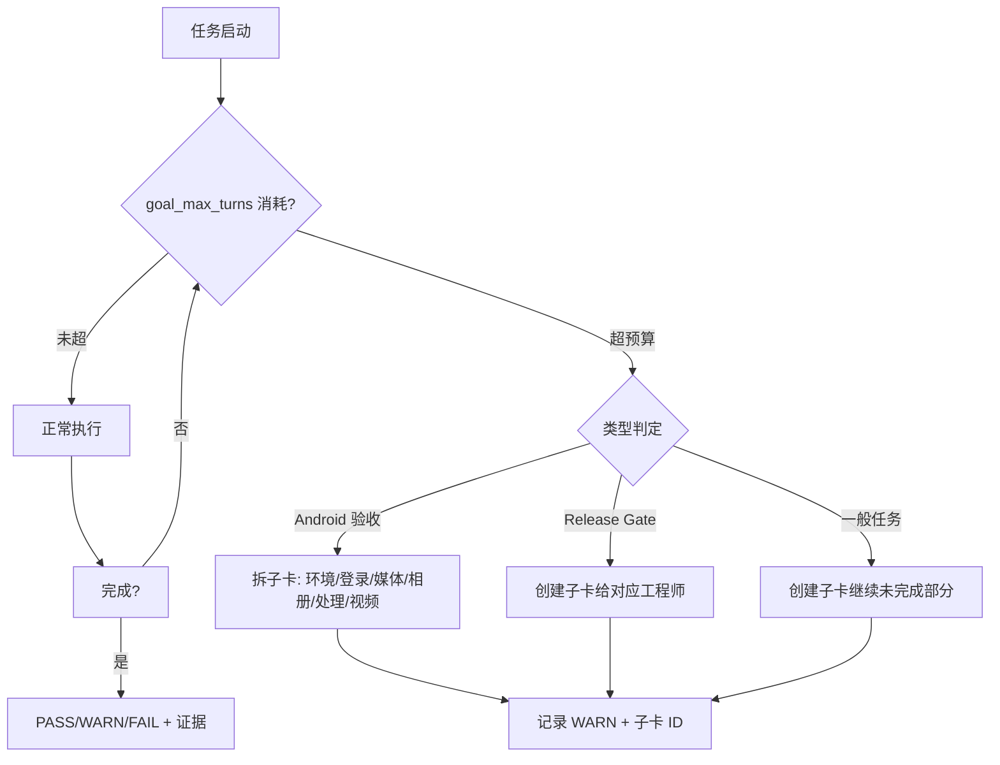

# V1.2 RC 迭代预算分档规范

日期：2026-07-09
维护者：丁交付 / delivery-manager
出处：`docs/architecture-v1.2-rc-boundary.md` §6 迭代预算治理建议
状态：生效

## 背景

V1.1 期间 Android 验收任务默认 `goal_max_turns=60`，导致 5/8 个验收项耗尽预算提前终止。V1.2 RC 不再简单给所有任务统一设高预算，而是按复杂度、设备环境、交付物类型分档。

## 预算分档表

| 档位 | 任务类型 | goal_max_turns | 适用范围 | 退出条件 |
|------|---------|:-------------:|----------|---------|
| **A** | 一般实现/文档/审核 | 60 | 架构文档、普通后端修复、Release Gate 文档检查、安全复核、文档审查 | 产物完成 + 基础命令/引用检查通过 |
| **B** | Android 模拟器/真机验收 | 120 | APK 安装、启动、登录、媒体页触控、截图/录屏、adb 排障 | 明确 PASS/WARN/FAIL + 设备/构建/日志证据 |
| **C** | Release Gate / 发布门禁 | 60 | 发布门禁判断、安全复核、文档审查、放行/阻塞结论 | 给出放行/阻塞结论和证据路径 |
| **D** | 长时间环境排障 | 120 或拆分子任务 | Emulator 冷启动、依赖恢复、Docker/MAUI 双栈联调 | 每 30-45 分钟有 heartbeat；超 120 拆子卡 |

## 任务创建规则

### 1. Android 验收卡默认 B 档 (120)

每张验收卡只覆盖 **一个主场景**：
- 登录 + 首页
- 媒体时间线
- 相册（CRUD + 添加/移除媒体）
- 处理状态页（含失败重试）
- 视频详情/播放

验收必须记录：
```text
设备/模拟器型号:   [例如 Pixel 7 / Android Emulator API 35]
Android 版本:       [例如 Android 15 (API 35)]
APK 路径/构建号:    [例如 D:/Devs/.../app.apk]
后端 URL:           [例如 http://10.0.2.2:8081]
截图/日志路径:      [例如 docs/validation/xxx-screenshot.png]
结果:               PASS / WARN / FAIL
```

### 2. Release Gate 卡保持 C 档 (60)

发布岗在单卡中不承担实际修复工作。发现问题后创建子卡指派给 backend-eng / mobile-eng / qa-eng。

### 3. 环境排障卡

超过 120 仍未完成的任务必须拆分为：
- 环境准备
- 登录主链路
- 各媒体场景子卡

不允许在单卡无限追加迭代。

## 任务模板

### Android 验收模板

```text
标题: [V1.2 RC] Android 验收 — {场景名称}
负责人: qa-eng
预算: 120
验收模板:
- [ ] 构建/获取 APK
- [ ] 安装并启动
- [ ] 登录（注入 token / 手动）
- [ ] 执行场景操作
- [ ] 截图/录屏证据
- [ ] 记录设备、版本、结果
- [ ] 若有 FAIL 则创建对应子卡
```

### Release Gate 模板

```text
标题: [V1.2 RC] Release Gate — {闸门名称}
负责人: release-manager
预算: 60
闸门标准: 参见 docs/architecture-v1.2-rc-boundary.md §9
```

## 超预算处理流程



## 引用方式

在 Kanban 任务 body 中推荐使用：

```yaml
budget_tier: B  # A=60, B=120, C=60, D=120/拆分
goal_max_turns: 120
```

## 参见

- `docs/architecture-v1.2-rc-boundary.md` §6（预算治理原始建议）
- `docs/architecture-v1.2-rc-boundary.md` §9（发布门禁标准）
- `docs/validation/worktree-pr-cleanup-temp-resolution.md`（worktree 处置记录）
